<a id="carátula"></a>
<a id="caratula"></a>
<div align="center">


#### Universidad Peruana de Ciencias Aplicadas

#### Carrera de Ingeniería de Software

----

### 1ASI0730 
### Aplicaciones Web 
#### NRC 
### 8150

## Informe del Trabajo Final

----

#### Docente
### Velásquez Núñez, Ángel Augusto

----

#### Equipo
### NeonCode

#### Proyecto
### Medical SMARTBOX

----

#### Integrantes:

u202222859 - Espinoza Flores, Aaron André

u20211b556 - Gargate Paredes, Santiago

u202520310 - Jaramillo Mayta, Jhon Jordy

u20231c995 - Munayco Apolaya, Maria Luisa

u202114790 - Santos Minaya, Renzo Piero

----

#### Período 202620

#### Septiembre 2026

</div>


<div style="page-break-after: always;"></div>

# Registro de Versiones del Informe

El presente Registro de Versiones del Informe documenta la trazabilidad evolutiva, iterativa y colaborativa de la memoria técnica del proyecto **Medical SMARTBOX** a lo largo de su ciclo de vida de desarrollo. En estricta observancia del estándar de versionado semántico (*Semantic Versioning 2.0.0*) y de los criterios de evaluación de la asignatura **1ASI0730 Aplicaciones Web**, se registran de forma estructurada las incorporaciones de secciones, diagramas de arquitectura, modelos de dominio, historias de usuario, especificaciones de bases de datos y evidencias de implementación del primer ciclo ágil (Sprint 1) junto con el despliegue del Landing Page institucional, así como las mejoras producto de las revisiones internas de calidad del equipo **NeonCode** para la entrega oficial del **Avance 1 (AV1 - Semana 4)**, complementado con la hoja de ruta planificada para los hitos sucesivos del proyecto.

| Entregable | Versión | Fecha | Autor(es) | Descripción de modificación |
| :---: | :---: | :---: | :--- | :--- |
| **AV1** | **V0.1.0** | 08/09/2026 | NeonCode Team | **Inicialización del Repositorio y Andamiaje Documental:** Creación de la estructura base del repositorio en la organización pública de GitHub (`NeonCode-UPC/report`). Configuración del modelo de ramificación GitFlow (`main`, `develop`), convenciones Conventional Commits y estructura de directorios `docs/` y `assets/`. Elaboración de la Carátula institucional según las directrices y modelo del docente Velásquez Núñez, y generación del esqueleto Markdown para todos los capítulos. |
| **AV1** | **V0.2.0** | 09/09/2026 | Espinoza Flores, Aaron André<br>Munayco Apolaya, Maria Luisa | **Elicitación, Marco Estratégico e Investigación de Mercado:** Elaboración del Capítulo I completo: 1.1 Startup Profile (misión, visión y perfiles de integrantes), 1.2 Solution Profile (antecedentes y problemática 5W2H sustentada en incidentes de transporte asistencial en Lima Metropolitana, formulación del proceso Lean UX con Problem Statements, Assumptions, Hypothesis Statements y Lean UX Canvas) y 1.3 Segmentos Objetivo (delimitación del Segmento 1: operadores de transporte asistencial SAMU 106 y Segmento 2: centros sanitarios y farmacéuticas). Desarrollo del Capítulo II: 2.1 Competidores (análisis competitivo frente a Cryoport, Ransa, Talma y SAMU) y 2.2 Entrevistas (diseño de guías semiestructuradas, registro de sesiones y análisis de hallazgos cualitativos). |
| **AV1** | **V0.3.0** | 14/09/2026 | Jaramillo Mayta, Jhon Jordy<br>Munayco Apolaya, Maria Luisa<br>Santos Minaya, Renzo Piero | **Needfinding, Modelado de Dominio Preliminar y Especificación Ágil:** Elaboración del Capítulo 2.3 Needfinding completo (User Personas para ambos segmentos, User Task Matrix priorizada, User Journey Mapping As-Is/To-Be y Empathy Maps). Modelado del Capítulo 2.4 (Big Picture EventStorming en Miro cubriendo el ciclo de despacho, monitoreo térmico IoT y entrega asistencial) y Capítulo 2.5 (Ubiquitous Language formal con 30 términos canónicos en inglés con definición clínica y técnica en español). Desarrollo del Capítulo III completo: 3.1 User Stories (historias de usuario épicas y técnicas redactadas bajo sintaxis Gherkin Given-When-Then con criterios de aceptación rigurosos), 3.2 Impact Mapping (Goal $\rightarrow$ Actor $\rightarrow$ Impact $\rightarrow$ Deliverable) y 3.3 Product Backlog priorizado por valor asistencial. Elaboración de las Guías de Estilo (4.1) y Arquitectura de Información (4.2). |
| **AV1** | **V0.4.0** | 16/09/2026 | Jaramillo Mayta, Jhon Jordy<br>Munayco Apolaya, Maria Luisa | **Arquitectura de Software DDD, Diseño Orientado a Objetos y Base de Datos:** Incorporación de wireframes, wireflows y mockups de alta fidelidad para el Landing Page y la Web Application (Capítulos 4.3, 4.4 y 4.5). Modelado táctico del Capítulo 4.6 (Design-Level EventStorming delimitando seis Bounded Contexts: Smart Container IoT, Emergency Fleet Logistics, Clinical Quality Assurance, Chain of Custody, Critical Alerting y Access Governance). Elaboración de diagramas C4 bajo estándares de Structurizr: 4.6.2 Context Diagram, 4.6.3 Container Diagram (Web API, Telemetry Consumer, Base de Datos, Broker MQTT, Redis Cache y Web App) y 4.6.4 Component Diagrams. Desarrollo del Capítulo 4.7 (Class Diagrams UML modelando un dominio rico con entidades, value objects, agregados y servicios de dominio) y Capítulo 4.8 (Database Design con modelo relacional físico en 3NF, diccionarios de datos, índices para series temporales y compatibilidad con directivas DIGEMID/MINSA). |
| **AV1** | **V0.5.0** | 16/09/2026 | Gargate Paredes, Santiago<br>Santos Minaya, Renzo Piero | **Gestión de Configuración (SCM) y Ejecución del Sprint 1:** Documentación del Capítulo 5.1 completo: 5.1.1 Configuración del entorno de desarrollo (SDK .NET 9, Node.js, Vite, herramientas de análisis de código), 5.1.2 Gestión de código fuente (GitFlow, SemVer y Conventional Commits), 5.1.3 Guías de estilo de código (estándares C# Microsoft y Vue.js/HTML5/CSS3 Google/W3C) y 5.1.4 Configuración de despliegue continuo (CI/CD en Vercel/GitHub Pages). Documentación del Sprint 1: 5.2.1.1 Sprint Planning 1, 5.2.1.2 Matriz LACX de líderes y colaboradores, 5.2.1.3 Sprint Backlog 1. Registro de evidencias de desarrollo de Landing Page en HTML5/CSS3 semántico y responsive (5.2.1.4), evidencias de ejecución y validación responsive en múltiples viewports (5.2.1.5), y evidencias de despliegue activo en la nube con métricas de performance (5.2.1.7). |
| **AV1** | **V1.0.0** | 17/09/2026 | NeonCode Team | **Consolidación Oficial del Entregable AV1:** Integración armonizada de todos los capítulos del informe (Cap. I, II, III, IV y V: 5.1 y 5.2.1). Incorporación formal de la sección 01 (Carátula según modelo docente), sección 02 (Registro de Versiones del Informe), sección 03 (Project Report Collaboration Insights con métricas analíticas de GitHub y trazabilidad de commits de AV1), sección 04 (Tabla de Contenidos a 4 niveles de jerarquía con hipervínculos funcionales) y sección 05 (Student Outcome ABET EAC 5 detallado con sustentos individuales para los 5 integrantes y conclusiones de avance). Conclusiones preliminares, Bibliografía en formato APA y Anexos normativos. |
| **TB1** | **V2.0.0** | *(Planificado)* | NeonCode Team | **Incorporación del Sprint 2 y Primer Incremento de Web Application:** Documentación del Sprint 2 (5.2.2 completo: Sprint Planning 2, Aspect Leaders Matrix, Sprint Backlog 2, evidencias de desarrollo del frontend en Vue.js / PrimeVue, gestión de estado Pinia, evidencias de despliegue y collaboration insights). Levantamiento de observaciones formuladas por el docente evaluador sobre la entrega AV1. Actualización de conclusiones y Student Outcome para el hito TB1. |
| **AV2** | **V3.0.0** | *(Planificado)* | NeonCode Team | **Integración de Web Services RESTful API y Sprint 3:** Documentación del Sprint 3 (5.2.3 completo: servicios backend en ASP.NET Core (.NET 9) bajo Clean Architecture y DDD, documentación Swagger/OpenAPI, base de datos relacional y telemetría IoT en tiempo real). Incorporación de la sección 5.3 (Validation Interviews y evaluaciones según heurísticas de Nielsen) y 5.4 (Video About-the-Product). Actualización de Student Outcome para AV2. |
| **TB2** | **V4.0.0** | *(Planificado)* | NeonCode Team | **Cierre del Producto Final, Sprint 4 y Release Review:** Documentación del Sprint 4 (5.2.4 completo: consolidación de seguridad JWT, control de acceso basado en roles RBAC, integración completa frontend-backend y pruebas de estrés). Incorporación del video About-the-Team, informe de desempeño del equipo (Participant Performance Report), anexos consolidados y preparación de la versión final para la sustentación sincrónica del trabajo de fin de curso. |


<div style="page-break-after: always;"></div>

# Project Report Collaboration Insights

El informe del proyecto **Medical SMARTBOX** ha sido elaborado de manera estrictamente colaborativa y descentralizada a través de un repositorio público en la plataforma GitHub, administrado bajo la organización oficial de la startup (**NeonCode-UPC**), en cumplimiento con los estándares de ingeniería y gobernanza documental estipulados en el enunciado del curso **1ASI0730 Aplicaciones Web**.

**URL del Repositorio Oficial del Informe:**  
<https://github.com/NeonCode-UPC/report>

---

## 1. Gobernanza y Flujo de Trabajo en el Repositorio

Para garantizar la integridad estructural, la trazabilidad histórica de los cambios y la no colisión entre los colaboradores, el equipo implementó las siguientes políticas de ingeniería de software:

* **Modelo de Ramificación GitFlow:**  
  * `main`: Rama de producción documental que aloja exclusivamente las versiones estables consolidadas correspondientes a los hitos evaluativos institucionales (`V1.0.0` para AV1, `V2.0.0` para TB1, etc.).  
  * `develop`: Rama de integración continua donde convergen las contribuciones revisadas de cada capítulo.  
  * `feature/*`: Ramas de desarrollo temáticas aisladas (`feature/ch1-startup-solution`, `feature/ch2-needfinding-eventstorming`, `feature/ch3-requirements-backlog`, `feature/ch4-architecture-c4-class-db`, `feature/ch5-scm-sprint1`, `feature/report-management`), creadas individualmente por cada integrante según su asignación.
* **Estándar Conventional Commits 1.0.0:** Todos los registros de confirmación se estructuraron bajo prefijos canónicos (`docs(...)`, `feat(...)`, `fix(...)`, `chore(...)`), especificando el alcance del cambio y facilitando la auditoría cruzada.
* **Políticas de Pull Requests (PR) y Code/Doc Review:** La incorporación de contenido hacia `develop` y `main` requirió la revisión cruzada de al menos un miembro del equipo para verificar el cumplimiento de las guías de estilo Markdown y la integridad de los enlaces y tablas.

---

## 2. Participación del Equipo en el Informe Técnico (Hito AV1)

La siguiente matriz resume la distribución formal de responsabilidades y las aportaciones técnicas destacadas de cada miembro del equipo durante el desarrollo del primer avance:

| Integrante | Usuario GitHub | Rol Principal | Secciones y Capítulos Asignados (AV1) | Aportaciones Técnicas Destacadas |
| :--- | :---: | :---: | :--- | :--- |
| **Espinoza Flores, Aaron André** | `@psure` | Research & Entrevistas | **Capítulo I completo:**<br>• 1.1 Startup Profile<br>• 1.2 Solution Profile (5W2H, Lean UX)<br>• 1.3 Segmentos Objetivo<br>**Capítulo II:**<br>• 2.1 Competidores<br>• 2.2 Entrevistas | Formulación de la problemática clínica sustentada en pérdidas de cadena de frío en ambulancias; elaboración del Lean UX Canvas; delimitación cualitativa de los dos segmentos objetivo; diseño y análisis de entrevistas semiestructuradas a personal de salud y logística. |
| **Gargate Paredes, Santiago** | `@sssantiagoo` | Frontend Developer | **Capítulo V (Sprint 1):**<br>• 5.2.1.4 Development Evidence<br>• 5.2.1.5 Execution Evidence<br>• 5.2.1.7 Software Deployment Evidence<br>• 5.2.1.8 Collaboration Insights | Redacción y consolidación de evidencias del Sprint 1 para el Landing Page; documentación de pruebas de visualización responsive en múltiples viewports; registro de métricas de despliegue continuo en Vercel y métricas de desempeño web. |
| **Jaramillo Mayta, Jhon Jordy** | `@Marklnz1` | Arquitecto de Software | **Capítulo II:**<br>• 2.4 Big Picture EventStorming<br>• 2.5 Ubiquitous Language<br>**Capítulo IV:**<br>• 4.6 Domain-Driven Architecture (C4)<br>• 4.7 Software OO Design (UML)<br>• 4.8 Database Design (ERD) | Modelado colaborativo en Miro del Big Picture EventStorming; redacción de 30 términos canónicos del dominio; descomposición táctica en 6 Bounded Contexts; diagramas C4 (Contexto, Contenedores, Componentes); Diagrama de Clases UML con agregados ricos y diseño relacional en 3NF. |
| **Munayco Apolaya, Maria Luisa** | `@malumunayco` | UX/UI Designer | **Capítulo II:**<br>• 2.3 Needfinding (Personas, Task Matrix, Journey Maps, Empathy)<br>**Capítulo IV:**<br>• 4.1 Style Guidelines<br>• 4.2 Information Architecture<br>• 4.3 a 4.5 UI/UX Wireframes & Mockups | Creación de User Personas y mapas de empatía en UXPressia; definición del Design System clínico y Guías de Estilo; arquitectura de la información (SEO, taxonomía, navegación); diseño interactivo de wireframes y mockups de alta fidelidad en Figma. |
| **Santos Minaya, Renzo Piero** | `@psure` / `@pisure` | Product Owner / Scrum Master | **Capítulo III completo:**<br>• 3.1 User Stories (Gherkin)<br>• 3.2 Impact Mapping<br>• 3.3 Product Backlog<br>**Capítulo V:**<br>• 5.1 SCM (5.1.1 a 5.1.4)<br>• 5.2.1 Sprint 1 (5.2.1.1 a 5.2.1.3) | Redacción de User Stories con criterios de aceptación Gherkin (Given-When-Then); matriz de Impact Mapping y priorización de Backlog; documentación de gobernanza SCM (GitFlow, SemVer); facilitación del Sprint Planning 1, Matriz LACX y Sprint Backlog 1. |

---

## 3. AV1 – Sprint Review (Semana 4)

### 3.1. Dinámica de Trabajo Colaborativo

Durante las cuatro semanas de desarrollo del avance **AV1**, el equipo sincronizó sus esfuerzos mediante una combinación de reuniones presenciales en campus y sesiones virtuales en Discord. La coordinación de tareas se apoyó en un tablero ágil (Trello/Jira) donde cada sección del informe fue modelada como un entregable con criterios de aceptación verificables. 

Cada integrante trabajó en su respectiva rama `feature/*`, sometiendo sus avances a revisión antes de integrarlos en la rama `develop`. Para la entrega final, se consolidó la rama `main`, sincronizando todos los enlaces cruzados, asegurando que las imágenes referenciadas residan en `assets/` y validando la consistencia semántica entre los capítulos de diseño, arquitectura y gestión ágil.

### 3.2. Métricas de Colaboración y Commits en el Repositorio de Documentación

Los datos cuantitativos extraídos del historial de Git para el repositorio de documentación (`NeonCode-UPC/report`) durante el hito **AV1** evidencian una participación activa y balanceada de todos los miembros:

| Integrante | Ramas Principales de Aporte | Commits Realizados | Líneas de Markdown Agregadas (aprox.) | Archivos Aportados / Editados |
| :--- | :--- | :---: | :---: | :---: |
| **Aaron André Espinoza Flores** | `feature/ch1-startup-solution`, `feature/ch2-research` | 5 | ~1,200 | `11-startup-profile.md`, `12-solution-profile.md`, `13-segmentos-objetivos.md`, `21-competidores.md`, `22-entrevistas.md` |
| **Santiago Gargate Paredes** | `feature/ch5-landing-sprint1`, `feature/ch5-insights` | 4 | ~950 | `52-landingpage-services-implementations.md`, `54-video-about-the-product.md` |
| **Jhon Jordy Jaramillo Mayta** | `feature/ch2-domain-modeling`, `feature/ch4-architecture` | 8 | ~4,800 | `24-big-picture-eventstorming.md`, `25-ubiquitous-language.md`, `46-dd-software-architecture.md`, `47-software-object-oriented-design.md`, `48-database-design.md` |
| **Maria Luisa Munayco Apolaya** | `feature/ch2-needfinding`, `feature/ch4-ux-ui` | 6 | ~1,950 | `23-needfinding.md`, `41-style-guidelines.md`, `42-information-architecture.md`, `43-landing-page-ui-design.md`, `44-web-application-uxui-design.md`, `45-web-application-prototyping.md` |
| **Renzo Piero Santos Minaya** | `feature/ch3-backlog`, `feature/ch5-scm-planning`, `feature/report-integration` | 7 | ~2,100 | `01-caratula.md`, `02-registro-versiones.md`, `03-collaboration-insights.md`, `04-contenido.md`, `05-student-outcome.md`, `31-user-stories.md`, `32-impact-mapping.md`, `33-product-backlog.md`, `51-software-configuration-management.md` |

> *Nota: Los commits registrados en esta sección corresponden estrictamente al repositorio del informe técnico (`NeonCode-UPC/report`). Los desarrollos de código fuente correspondientes al Landing Page (`landing-page`), Frontend Web (`medical-smartbox-frontend`) y Backend RESTful API (`medical-smartbox-backend`) se auditan de forma independiente en sus respectivos repositorios.*

### 3.3. Evidencias Gráficas de Colaboración en GitHub (GitHub Insights)

A continuación, se presentan las capturas oficiales de la analítica de colaboración del repositorio del informe en GitHub:

<div align="center">


*Figura 0.1 - Histograma de frecuencia de commits y distribución de aportes por colaborador en el repositorio de documentación (Fuente: GitHub Insights).*

</div>

#### Interpretación de las Métricas de Actividad:
* **Semana 1 (08/09/2026):** Pico inicial asociado a la configuración del andamiaje del repositorio, inicialización de plantillas y estructura de directorios.
* **Semana 2 (09/09/2026):** Incorporación intensiva de la investigación preliminar, análisis competitivo y entrevistas de necesidad.
* **Semana 3 (14/09/2026):** Consolidación de sesiones de modelado colaborativo de dominio (EventStorming) y especificación de historias de usuario.
* **Semana 4 (16/09/2026 - 17/09/2026):** Fase de máxima convergencia técnica: integración de arquitectura C4, modelo de clases, persistencia física de base de datos, evidencias de despliegue del Landing Page y auditoría final del informe AV1.

---

## 4. Proyección de Colaboración para Siguientes Hitos

* **TB1 – Stage Review (Semana 7):** Incorporación de la documentación del Sprint 2 (Frontend Web Application en Vue.js / PrimeVue), levantamiento de observaciones del docente y actualización de métricas de contribución.
* **AV2 – Sprint Review (Semana 12):** Documentación del Sprint 3 (Backend RESTful API en ASP.NET Core y persistencia en PostgreSQL/SQL Server), entrevistas de validación con usuarios clínicos y métricas de integración.
* **TB2 – Release Review (Semana 15):** Consolidación final del Sprint 4 (seguridad JWT, pruebas integradas, despliegue global en la nube), producción audiovisual y auditoría final de contribuciones.


<div style="page-break-after: always;"></div>

# Contenido

## Tabla de Contenido

- [Carátula](#carátula)
- [Registro de Versiones del Informe](#registro-de-versiones-del-informe)
- [Project Report Collaboration Insights](#project-report-collaboration-insights)
- [Contenido](#contenido)
- [Student Outcome](#student-outcome)
- [Capítulo I: Introducción](#capítulo-i-introducción)
  - [1.1. Startup Profile](#11-startup-profile)
    - [1.1.1. Descripción de la Startup](#111-descripción-de-la-startup)
    - [1.1.2. Perfiles de integrantes del equipo](#112-perfiles-de-integrantes-del-equipo)
  - [1.2. Solution Profile](#12-solution-profile)
    - [1.2.1. Antecedentes y problemática](#121-antecedentes-y-problemática)
    - [1.2.2. Lean UX Process](#122-lean-ux-process)
      - [1.2.2.1. Lean UX Problem Statements](#1221-lean-ux-problem-statements)
      - [1.2.2.2. Lean UX Assumptions](#1222-lean-ux-assumptions)
      - [1.2.2.3. Lean UX Hypothesis Statements](#1223-lean-ux-hypothesis-statements)
      - [1.2.2.4. Lean UX Canvas](#1224-lean-ux-canvas)
  - [1.3. Segmentos objetivo](#13-segmentos-objetivo)
- [Capítulo II: Requirements Elicitation & Analysis](#capítulo-ii-requirements-elicitation--analysis)
  - [2.1. Competidores](#21-competidores)
    - [2.1.1. Análisis competitivo](#211-análisis-competitivo)
    - [2.1.2. Estrategias y tácticas frente a competidores](#212-estrategias-y-tácticas-frente-a-competidores)
  - [2.2. Entrevistas](#22-entrevistas)
    - [2.2.1. Diseño de entrevistas](#221-diseño-de-entrevistas)
    - [2.2.2. Registro de entrevistas](#222-registro-de-entrevistas)
    - [2.2.3. Análisis de entrevistas](#223-análisis-de-entrevistas)
  - [2.3. Needfinding](#23-needfinding)
    - [2.3.1. User Personas](#231-user-personas)
    - [2.3.2. User Task Matrix](#232-user-task-matrix)
    - [2.3.3. User Journey Mapping](#233-user-journey-mapping)
    - [2.3.4. Empathy Mapping](#234-empathy-mapping)
    - [2.3.5. As-Is Scenario Mapping](#235-as-is-scenario-mapping)
  - [2.4. Big Picture EventStorming](#24-big-picture-eventstorming)
  - [2.5. Ubiquitous Language](#25-ubiquitous-language)
- [Capítulo III: Requirements Specification](#capítulo-iii-requirements-specification)
  - [3.1. User Stories](#31-user-stories)
  - [3.2. Impact Mapping](#32-impact-mapping)
  - [3.3. Product Backlog](#33-product-backlog)
- [Capítulo IV: Product Design](#capítulo-iv-product-design)
  - [4.1. Style Guidelines](#41-style-guidelines)
    - [4.1.1. General Style Guidelines](#411-general-style-guidelines)
    - [4.1.2. Web Style Guidelines](#412-web-style-guidelines)
  - [4.2. Information Architecture](#42-information-architecture)
    - [4.2.1. Organization Systems](#421-organization-systems)
    - [4.2.2. Labeling Systems](#422-labeling-systems)
    - [4.2.3. SEO Tags and Meta Tags](#423-seo-tags-and-meta-tags)
    - [4.2.4. Searching Systems](#424-searching-systems)
    - [4.2.5. Navigation Systems](#425-navigation-systems)
  - [4.3. Landing Page UI Design](#43-landing-page-ui-design)
    - [4.3.1. Landing Page Wireframe](#431-landing-page-wireframe)
    - [4.3.2. Landing Page Mock-up](#432-landing-page-mock-up)
  - [4.4. Web Applications UX/UI Design](#44-web-applications-uxui-design)
    - [4.4.1. Web Applications Wireframes](#441-web-applications-wireframes)
    - [4.4.2. Web Applications Wireflow Diagrams](#442-web-applications-wireflow-diagrams)
    - [4.4.3. Web Applications Mock-ups](#443-web-applications-mock-ups)
    - [4.4.4. Web Applications User Flow Diagrams](#444-web-applications-user-flow-diagrams)
  - [4.5. Web Applications Prototyping](#45-web-applications-prototyping)
  - [4.6. Domain-Driven Software Architecture](#46-domain-driven-software-architecture)
    - [4.6.1. Design-Level EventStorming](#461-design-level-eventstorming)
    - [4.6.2. Software Architecture Context Diagram (C4)](#462-software-architecture-context-diagram-c4)
    - [4.6.3. Software Architecture Container Diagrams (C4)](#463-software-architecture-container-diagrams-c4)
    - [4.6.4. Software Architecture Components Diagrams (C4)](#464-software-architecture-components-diagrams-c4)
  - [4.7. Software Object-Oriented Design](#47-software-object-oriented-design)
    - [4.7.1. Class Diagrams](#471-class-diagrams)
  - [4.8. Database Design](#48-database-design)
    - [4.8.1. Database Diagrams](#481-database-diagrams)
- [Capítulo V: Product Implementation, Validation & Deployment](#capítulo-v-product-implementation-validation--deployment)
  - [5.1. Software Configuration Management](#51-software-configuration-management)
    - [5.1.1. Software Development Environment Configuration](#511-software-development-environment-configuration)
    - [5.1.2. Source Code Management](#512-source-code-management)
    - [5.1.3. Source Code Style Guide & Conventions](#513-source-code-style-guide--conventions)
    - [5.1.4. Software Deployment Configuration](#514-software-deployment-configuration)
  - [5.2. Landing Page, Services & Applications Implementation](#52-landing-page-services--applications-implementation)
    - [5.2.1. Sprint 1](#521-sprint-1)
      - [5.2.1.1. Sprint Planning 1](#5211-sprint-planning-1)
      - [5.2.1.2. Aspect Leaders and Collaborators](#5212-aspect-leaders-and-collaborators)
      - [5.2.1.3. Sprint Backlog 1](#5213-sprint-backlog-1)
      - [5.2.1.4. Development Evidence for Sprint Review](#5214-development-evidence-for-sprint-review)
      - [5.2.1.5. Execution Evidence for Sprint Review](#5215-execution-evidence-for-sprint-review)
      - [5.2.1.6. Services Documentation Evidence for Sprint Review](#5216-services-documentation-evidence-for-sprint-review)
      - [5.2.1.7. Software Deployment Evidence for Sprint Review](#5217-software-deployment-evidence-for-sprint-review)
      - [5.2.1.8. Team Collaboration Insights during Sprint](#5218-team-collaboration-insights-during-sprint)
    - [5.2.2. Sprint 2 (Proyección TB1)](#522-sprint-2)
      - [5.2.2.1. Sprint Planning 2](#5221-sprint-planning-2)
      - [5.2.2.2. Aspect Leaders and Collaborators](#5222-aspect-leaders-and-collaborators)
      - [5.2.2.3. Sprint Backlog 2](#5223-sprint-backlog-2)
      - [5.2.2.4. Development Evidence for Sprint Review](#5224-development-evidence-for-sprint-review)
      - [5.2.2.5. Execution Evidence for Sprint Review](#5225-execution-evidence-for-sprint-review)
      - [5.2.2.6. Services Documentation Evidence for Sprint Review](#5226-services-documentation-evidence-for-sprint-review)
      - [5.2.2.7. Software Deployment Evidence for Sprint Review](#5227-software-deployment-evidence-for-sprint-review)
      - [5.2.2.8. Team Collaboration Insights during Sprint](#5228-team-collaboration-insights-during-sprint)
    - [5.2.3. Sprint 3 (Proyección AV2)](#523-sprint-3)
      - [5.2.3.1. Sprint Planning 3](#5231-sprint-planning-3)
      - [5.2.3.2. Aspect Leaders and Collaborators](#5232-aspect-leaders-and-collaborators)
      - [5.2.3.3. Sprint Backlog 3](#5233-sprint-backlog-3)
      - [5.2.3.4. Development Evidence for Sprint Review](#5234-development-evidence-for-sprint-review)
      - [5.2.3.5. Execution Evidence for Sprint Review](#5235-execution-evidence-for-sprint-review)
      - [5.2.3.6. Services Documentation Evidence for Sprint Review](#5236-services-documentation-evidence-for-sprint-review)
      - [5.2.3.7. Software Deployment Evidence for Sprint Review](#5237-software-deployment-evidence-for-sprint-review)
      - [5.2.3.8. Team Collaboration Insights during Sprint](#5238-team-collaboration-insights-during-sprint)
    - [5.2.4. Sprint 4 (Proyección TB2)](#524-sprint-4)
      - [5.2.4.1. Sprint Planning 4](#5241-sprint-planning-4)
      - [5.2.4.2. Aspect Leaders and Collaborators](#5242-aspect-leaders-and-collaborators)
      - [5.2.4.3. Sprint Backlog 4](#5243-sprint-backlog-4)
      - [5.2.4.4. Development Evidence for Sprint Review](#5244-development-evidence-for-sprint-review)
      - [5.2.4.5. Execution Evidence for Sprint Review](#5245-execution-evidence-for-sprint-review)
      - [5.2.4.6. Services Documentation Evidence for Sprint Review](#5246-services-documentation-evidence-for-sprint-review)
      - [5.2.4.7. Software Deployment Evidence for Sprint Review](#5247-software-deployment-evidence-for-sprint-review)
      - [5.2.4.8. Team Collaboration Insights during Sprint](#5248-team-collaboration-insights-during-sprint)
  - [5.3. Validation Interviews](#53-validation-interviews)
    - [5.3.1. Diseño de entrevistas](#531-diseño-de-entrevistas)
    - [5.3.2. Registro de entrevistas](#532-registro-de-entrevistas)
    - [5.3.3. Evaluaciones según heurísticas](#533-evaluaciones-según-heurísticas)
  - [5.4. Video About-the-Product](#54-video-about-the-product)
- [Conclusiones y Recomendaciones](#conclusiones-y-recomendaciones)
- [Bibliografía](#bibliografía)
- [Anexos](#anexos)
  - [Anexo A. Videos de Exposiciones](#anexo-a-videos-de-exposiciones)
  - [Anexo B. Video About-the-Product](#anexo-b-video-about-the-product)
  - [Anexo C. Video About-the-Team](#anexo-c-video-about-the-team)
  - [Anexo D. Repositorios del Proyecto](#anexo-d-repositorios-del-proyecto)
  - [Anexo E. Enlaces de Despliegue (Deployment)](#anexo-e-enlaces-de-despliegue-deployment)
  - [Anexo F. Registros de Auditoría y Diagramas](#anexo-f-registros-de-auditoría-y-diagramas)


<div style="page-break-after: always;"></div>

# Student Outcome

El curso contribuye al cumplimiento del Student Outcome ABET:
**ABET – EAC - Student Outcome 5**

> **Criterio:** La capacidad de funcionar efectivamente en un equipo cuyos miembros juntos proporcionan liderazgo, crean un entorno de colaboración e inclusivo, establecen objetivos, planifican tareas y cumplen objetivos.

En el siguiente cuadro se describe las acciones realizadas y enunciados de conclusiones por parte del grupo, que permiten sustentar el haber alcanzado el logro del ABET – EAC - Student Outcome 5.

| Criterio específico | Acciones realizadas | Conclusiones |
| :--- | :--- | :--- |
| **5.c.1 Trabaja en equipo para proporcionar liderazgo en forma conjunta** | **Espinoza Flores, Aaron André**<br><br>**AV1:** Lideró la definición de la visión de negocio y la elicitación de requisitos asistenciales para la plataforma Medical SMARTBOX. Condujo la estructuración del Capítulo I (Problemática 5W2H sustentada en fallas de cadena de frío en ambulancias de Lima Metropolitana, formulación de Lean UX Canvas y delimitación de los dos segmentos objetivo: operadores de transporte asistencial SAMU 106 y directores de centros hospitalarios/farmacéuticos). Asimismo, encabezó el análisis competitivo del mercado telemático de salud (Cap. 2.1) y el diseño y conducción de las entrevistas a profundidad a paramédicos y especialistas en logística biomédica (Cap. 2.2), asegurando que los requerimientos del producto respondan a dolores reales y no a supuestos infundados.<br><hr>**Gargate Paredes, Santiago**<br><br>**AV1:** Asumió el liderazgo técnico del frente de desarrollo y despliegue del Landing Page institucional de Medical SMARTBOX correspondiente al Sprint 1. Estableció la arquitectura semántica en HTML5, CSS3 modular y JavaScript, asegurando un diseño totalmente responsive (*mobile-first*) orientado a la conversión B2B de instituciones de salud. Lideró la implementación del pipeline de integración y despliegue continuo (CI/CD) alojado en la nube (Vercel/GitHub Pages), auditó los tiempos de carga y accesibilidad web conforme a las pautas WCAG, y documentó exhaustivamente las evidencias de desarrollo, ejecución y despliegue para la revisión de sprint (Capítulos 5.2.1.4 a 5.2.1.7).<br><hr>**Jaramillo Mayta, Jhon Jordy**<br><br>**AV1:** Ejerció el liderazgo en la definición de la arquitectura de software y el modelado orientado al dominio (DDD). Facilitó la sesión colaborativa de Big Picture EventStorming (Cap. 2.4) unificando la comprensión de los flujos de telemetría, custodia y alertas críticas entre todos los miembros. Formuló el glosario canónico de Ubiquitous Language (Cap. 2.5) y lideró el diseño táctico mediante Design-Level EventStorming delimitando seis Bounded Contexts. Diseñó los diagramas del Modelo C4 (Contexto, Contenedores y Componentes) integrando Web API, bróker MQTT y WebSockets SignalR, y formalizó el Diagrama de Clases de Dominio UML (Cap. 4.7) y el Diagrama Físico de Base de Datos Relacional normalizado (Cap. 4.8) para garantizar consistencia transaccional y cumplimiento de las normativas DIGEMID/MINSA.<br><hr>**Munayco Apolaya, Maria Luisa**<br><br>**AV1:** Lideró la estrategia de Experiencia de Usuario (UX) y Diseño de Interfaz (UI) del ecosistema Medical SMARTBOX. Dirigió el proceso de Needfinding (Cap. 2.3) coordinando la síntesis de hallazgos empíricos en User Personas (Dr. Carlos Mendoza y Paramédico Javier Soto), User Task Matrix y mapas de empatía. Estableció el Sistema de Diseño visual y las Guías de Estilo (Cap. 4.1), definiendo una paleta cromática clínica accesible y componentes UI atómicos. Asimismo, encabezó la arquitectura de información y la concepción de wireframes y mockups de alta fidelidad tanto para el Landing Page institucional como para el portal web operativo de monitoreo telemático (Capítulos 4.2 a 4.5), garantizando una experiencia coherente, intuitiva y libre de fricción para los operadores de emergencia.<br><hr>**Santos Minaya, Renzo Piero**<br><br>**AV1:** Ejerció el rol de liderazgo como Product Owner y Scrum Master del equipo. Condujo la transformación de los dolores y requisitos de negocio en artefactos ágiles formales, estructurando el catálogo completo de User Stories con criterios de aceptación rigurosamente formulados bajo sintaxis Gherkin (Scenario, Given, When, Then) organizados en Epics, junto con el Impact Mapping y el Product Backlog priorizado por valor clínico (Capítulo 3). En el ámbito de gestión, lideró la gobernanza de configuración de software (SCM) estableciendo el modelo de ramificación GitFlow, convenciones de Conventional Commits y guías de estilo para C# y Vue.js (Cap. 5.1). Asimismo, facilitó la sesión de Sprint Planning 1, coordinó la asignación de roles mediante la Matriz LACX y gestionó el Sprint Backlog 1 (Cap. 5.2.1.1 a 5.2.1.3), asegurando el ritmo de avance y el cumplimiento del cronograma académico. | **AV1:**<br>Durante este primer hito del proyecto, el equipo demostró un ejercicio de liderazgo horizontal y distribuido de alta efectividad. En lugar de centralizar la toma de decisiones en una sola figura, cada integrante asumió el liderazgo autónomo y especializado de un pilar fundamental de la solución: investigación empírica de mercado (Aaron Espinoza), experiencia y prototipado visual UX/UI (Maria Luisa Munayco), arquitectura de software y persistencia de datos (Jhon Jaramillo), gestión ágil y especificación de requerimientos (Renzo Santos), y desarrollo frontend con despliegue en la nube (Santiago Gargate).<br><br>Esta delegación basada en competencias técnicas permitió avanzar en paralelo sobre frentes complejos y altamente interconectados sin generar cuellos de botella. Las disyuntivas de diseño técnico —tales como la selección de protocolos telemáticos para IoT (MQTT vs. WebSockets) o la delimitación de fronteras transaccionales en los Bounded Contexts— fueron debatidas y consensuadas con base en evidencia normativa (DIGEMID/MINSA) y criterios de ingeniería, logrando una cohesión técnica integral que sentó las bases para el éxito de las entregas posteriores. |
| **5.c.2 Crea un entorno colaborativo e inclusivo, establece metas, planifica tareas y cumple objetivos** | **Espinoza Flores, Aaron André**<br><br>**AV1:** Fomentó activamente un entorno inclusivo al incorporar la voz y las perspectivas de los profesionales de salud en el diseño de la solución, evitando sesgos técnicos aislados. Colaboró en la definición del objetivo central del proyecto a través del Lean UX Canvas, asegurando que las metas de investigación se descompusieran en actividades concretas (diseño de guías semiestructuradas, calendarización de entrevistas y tabulación cualitativa). Participó en las ceremonias de sincronización semanal del equipo, aportando insumos críticos que permitieron al diseñador UX y al arquitecto de software alinear las interfaces y los eventos de dominio con las necesidades operativas reales de las ambulancias en Lima.<br><hr>**Gargate Paredes, Santiago**<br><br>**AV1:** Contribuyó al entorno colaborativo mediante una comunicación transparente y continua sobre el progreso de la implementación del Landing Page. Participó en la estimación de tiempos del Sprint Backlog 1, comprometiéndose a cumplir con las metas de entrega y despliegue dentro de los plazos estipulados. Mantuvo un flujo riguroso de commits conforme a Conventional Commits, integró su código en la rama `develop` mediante Pull Requests evaluados en conjunto y colaboró activamente con el Product Owner en la redacción de la sección de Collaboration Insights del Sprint 1 (Cap. 5.2.1.8), garantizando total trazabilidad y cumplimiento de los objetivos del hito.<br><hr>**Jaramillo Mayta, Jhon Jordy**<br><br>**AV1:** Impulsó un espacio colaborativo técnico promoviendo el modelado colaborativo visual mediante Miro y Structurizr DSL, lo que permitió que integrantes con roles no técnicos participaran en la validación de la lógica del sistema. Estableció metas técnicas claras para el sprint (entrega de diagramas de arquitectura C4, modelo de clases y script SQL normalizado de base de datos), desglosando las actividades de diagramación en tareas medibles en el tablero ágil. Atendió oportunamente las dudas de sus compañeros respecto a la estructura de microservicios y persistencia relacional, asegurando la consistencia conceptual del informe y cumpliendo al 100% las metas arquitectónicas asignadas para la entrega AV1.<br><hr>**Munayco Apolaya, Maria Luisa**<br><br>**AV1:** Promovió un entorno inclusivo al transformar los hallazgos de las entrevistas en artefactos de empatía compartidos con todo el equipo, facilitando que cada miembro comprendiera las necesidades emocionales y laborales de los usuarios finales. Planificó minuciosamente el cronograma de diseño en Figma y UXPressia, estableciendo hitos de revisión intermedia (wireframes de baja fidelidad seguidos de mockups de alta fidelidad interactivos). Integró activamente el feedback de sus compañeros y del Product Owner sobre usabilidad y densidad de información clínica, cumpliendo a cabalidad con la entrega de todos los flujos de navegación requeridos para el Landing Page y la Web Application.<br><hr>**Santos Minaya, Renzo Piero**<br><br>**AV1:** Estableció y dinamizó el entorno colaborativo del equipo a través de la configuración del tablero ágil en Trello/Jira y el canal de coordinación en Discord, garantizando canales de comunicación abiertos, respetuosos y transparentes. Lideró la ceremonia de Sprint Planning 1, guiando al equipo en la estimación colectiva de esfuerzos en horas hombre para cada User Story y tarea técnica. Monitoreó el cumplimiento de las metas semanales mediante revisiones de progreso, identificó y removió impedimentos operativos, y aseguró que cada miembro entregara su sección del informe en formato Markdown respetando la fecha límite institucional, logrando así el cumplimiento riguroso de todos los objetivos trazados para el avance AV1. | **AV1:**<br>El establecimiento de un entorno de trabajo colaborativo, inclusivo y altamente disciplinado constituyó el factor determinante para el éxito de la entrega AV1. A través de la adopción del marco de trabajo Scrum, complementado con tableros Kanban interactivos y el flujo GitFlow en GitHub, el equipo logró transformar un enunciado académico de alta complejidad en un plan de acción estructurado con metas semanales claras y alcanzables.<br><br>Se fomentó la inclusión multidisciplinaria, donde las observaciones clínicas de investigación, las directrices de diseño visual y las restricciones de arquitectura fueron escuchadas y ponderadas con igual valor técnico. La comunicación asertiva y periódica evitó la duplicidad de esfuerzos y permitió resolver de manera proactiva los bloqueos de integración. Como resultado tangible, el equipo cumplió con el 100% de los entregables planificados para el Sprint 1 y la documentación técnica de los Capítulos I al V (secciones 5.1 y 5.2.1), demostrando un desempeño maduro, coordinado y alineado con los estándares internacionales de acreditación profesional ABET. |


<div style="page-break-after: always;"></div>

# Capítulo I: Introducción

# 1.1. Startup Profile

## 1.1.1. Descripción de la Startup

[Nombre de la startup] es una iniciativa orientada al diseño de soluciones tecnológicas para el sector salud, enfocada en mejorar la seguridad, trazabilidad y eficiencia del transporte de medicamentos, órganos e insumos médicos sensibles. La startup surge ante la necesidad de reducir riesgos durante los traslados médicos, especialmente cuando los productos requieren condiciones controladas de temperatura, monitoreo continuo y disponibilidad inmediata para la atención de pacientes.

La propuesta de la startup se basa en integrar tecnologías web, sensores IoT y servicios de geolocalización para ofrecer una plataforma que permita supervisar en tiempo real el estado de contenedores inteligentes instalados en ambulancias o unidades de transporte médico. Estos contenedores están diseñados para conservar la carga en condiciones adecuadas, detectar variaciones críticas, registrar el stock mediante sensores de peso y reportar información relevante sobre la ubicación y el estado operativo del vehículo.

El enfoque de [Nombre de la startup] combina innovación tecnológica con responsabilidad social, debido a que el transporte seguro de productos médicos puede impactar directamente en la calidad de la atención sanitaria. Por ello, la solución busca apoyar a personal médico, operadores logísticos y entidades de salud en la toma de decisiones oportunas, reduciendo la incertidumbre durante los traslados y fortaleciendo la cadena de custodia de los productos transportados.

## 1.1.2. Perfiles de integrantes del equipo

En esta sección se presentarán los perfiles de los integrantes del equipo, incluyendo fotografía, código de estudiante, nombres y apellidos, carrera, principales conocimientos técnicos y habilidades que aportan al desarrollo del proyecto. Cada integrante deberá evidenciar su participación en la investigación, documentación, diseño, implementación, pruebas y despliegue de la solución.

| Integrante | Código | Carrera | Perfil y aporte al proyecto |
|---|---|---|---|
| Renzo Piero Santos Minaya | u202114790 | Ingeniería de Software | Integrante del equipo responsable de colaborar en las actividades de investigación, documentación, diseño, implementación, pruebas y despliegue de la solución. |
| Aaron André Espinoza Flores | u202222859 | Ingeniería de Software | Integrante del equipo responsable de colaborar en las actividades de investigación, documentación, diseño, implementación, pruebas y despliegue de la solución. |
| Jhon Jordy Jaramillo Mayta | u202520310 | Ingeniería de Software | Integrante del equipo responsable de colaborar en las actividades de investigación, documentación, diseño, implementación, pruebas y despliegue de la solución. |
| Santiago Gargate Paredes | u20211b556 | Ingeniería de Software | Integrante del equipo responsable de colaborar en las actividades de investigación, documentación, diseño, implementación, pruebas y despliegue de la solución. |
| Maria Luisa Munayco Apolaya | u20231c995 | Ingeniería de Software | Integrante del equipo responsable de colaborar en las actividades de investigación, documentación, diseño, implementación, pruebas y despliegue de la solución. |


<div style="page-break-after: always;"></div>

# 1.2. Solution Profile

## 1.2.1. Antecedentes y problemática

El transporte de medicamentos, vacunas, muestras biológicas, sangre y órganos requiere condiciones estrictas de conservación, trazabilidad y control operativo. En muchos escenarios de atención médica, estos elementos son trasladados en ambulancias o unidades especializadas, donde una variación de temperatura, una demora no prevista o una falta de información sobre el contenido transportado puede afectar la calidad del producto médico y, en consecuencia, la seguridad del paciente.

Actualmente, parte de este proceso puede depender de registros manuales, comunicación telefónica o sistemas aislados que no ofrecen una visión integrada del traslado. Esta situación dificulta conocer en tiempo real la ubicación del contenedor, la temperatura interna, el stock disponible, el estado de apertura, el nivel de combustible del vehículo y el tiempo estimado de llegada. La ausencia de información centralizada incrementa el riesgo de pérdida de medicamentos sensibles, ruptura de la cadena de frío, demoras en emergencias y falta de evidencia para auditorías internas.

La solución propuesta consiste en una plataforma web integrada con contenedores inteligentes basados en IoT, diseñados para el transporte médico en ambulancias. Cada contenedor contará con sensores para monitorear temperatura, peso, apertura, batería y ubicación. Además, la plataforma se conectará con información del vehículo para mostrar nivel de combustible y estimar el tiempo aproximado de llegada. Esta información permitirá a los usuarios autorizados supervisar el traslado, recibir alertas críticas y consultar el historial de cada operación.

## 1.2.2. Lean UX Process

El proceso Lean UX permite orientar la solución a partir de la comprensión del problema, la formulación de supuestos y la validación progresiva de hipótesis. Para este proyecto, el proceso se aplica sobre el dominio del transporte médico controlado, considerando la necesidad de mejorar la visibilidad del traslado, la conservación de productos sensibles y la coordinación entre personal médico, operadores logísticos y entidades de salud.

### 1.2.2.1. Lean UX Problem Statements

The current state of medical transport for medicines, biological supplies and organs has focused mainly on manual coordination, isolated temperature control devices and direct communication between health personnel and transport operators.

What existing products and services fail to address is the lack of integrated real-time visibility of container temperature, stock, location, vehicle status and estimated arrival time during critical medical transport operations.

Our product will address this gap by providing an IoT-enabled smart container platform connected to a responsive web application and a RESTful API, allowing authorized users to monitor environmental conditions, route progress, inventory and operational alerts from a centralized interface.

Our initial focus will be health institutions, emergency medical staff and medical logistics operators that need to transport sensitive medicines, organs or supplies under controlled conditions.

We will know we are successful when users can monitor active medical transports in real time, receive timely alerts for critical incidents, reduce uncertainty about arrival times and access traceability records for completed transfers.

### 1.2.2.2. Lean UX Assumptions

#### Business Assumptions

- We believe health institutions need a digital solution that improves traceability and control during medical transport operations.
- We believe hospitals, clinics and emergency service providers are willing to adopt IoT-based monitoring when it reduces operational risk.
- We believe the solution can generate value through subscription plans for institutions that manage multiple ambulances or medical containers.
- We believe reliable transport evidence can become a differentiating factor for institutions that handle sensitive medical products.

#### Business Outcome Assumptions

- We believe the platform can reduce incidents related to temperature deviation during transport.
- We believe real-time monitoring can reduce the time required to identify and respond to critical events.
- We believe digital traceability reports can improve audit readiness for health institutions.
- We believe route and vehicle visibility can improve coordination between dispatchers and medical teams.

#### User Assumptions

- We believe emergency medical staff need quick access to the status of the transported medical load.
- We believe logistics operators need to monitor multiple active transfers from a single dashboard.
- We believe hospital supervisors need historical evidence of transport conditions and delivery confirmation.
- We believe ambulance drivers need simple alerts that do not distract from their primary responsibility.

#### User Outcome and Benefit Assumptions

- We believe medical staff want to confirm that medicines or organs arrive in appropriate condition.
- We believe logistics operators want to reduce uncertainty about location, fuel level and estimated arrival time.
- We believe supervisors want to review incidents, responsibilities and timestamps after each transfer.
- We believe users benefit from early alerts that allow corrective action before the transported product is compromised.

#### Feature Assumptions

- We believe temperature monitoring and automatic alerts are essential features for sensitive medical transport.
- We believe weight-based stock detection can help estimate the quantity of medicines inside the container.
- We believe GPS tracking and route visualization can improve operational coordination.
- We believe vehicle fuel monitoring and estimated arrival time can support better decision-making during emergencies.
- We believe a traceability history can provide evidence for audits and process improvement.

### 1.2.2.3. Lean UX Hypothesis Statements

- We believe we will achieve improved control of temperature-sensitive medical transport if emergency medical staff and logistics operators attain early detection of temperature deviations with real-time temperature monitoring and critical alerts.
- We believe we will achieve better inventory visibility during transfers if medical staff attain updated information about available medicines with weight-based stock detection inside the smart container.
- We believe we will achieve more accurate operational coordination if logistics operators attain real-time route visibility with GPS tracking and estimated arrival time.
- We believe we will achieve better emergency planning if dispatchers and supervisors attain visibility of vehicle autonomy with fuel-level monitoring and vehicle status integration.
- We believe we will achieve stronger transport accountability if health institutions attain historical evidence of each transfer with traceability reports and chain-of-custody records.

### 1.2.2.4. Lean UX Canvas

| Sección | Descripción |
|---|---|
| Business problem | Las instituciones de salud necesitan transportar medicamentos, órganos e insumos sensibles con mayor control, trazabilidad y capacidad de respuesta ante incidentes. |
| Business outcomes | Reducir incidentes de conservación, mejorar la visibilidad del traslado, disminuir incertidumbre sobre tiempos de llegada y generar evidencia histórica. |
| Users | Personal médico de emergencia, operadores logísticos de salud, supervisores hospitalarios y responsables de transporte médico. |
| User outcomes | Conocer el estado de la carga, recibir alertas oportunas, confirmar disponibilidad de stock y revisar evidencia del traslado. |
| Solutions | Contenedor inteligente IoT, aplicación web responsive, RESTful API, alertas, GPS, monitoreo de temperatura, sensores de peso y reportes. |
| Hypotheses | Si los usuarios monitorean condiciones críticas en tiempo real, podrán reaccionar antes de que el traslado comprometa la seguridad del producto médico. |
| Most important thing to learn first | Validar si los usuarios consideran prioritario integrar temperatura, ubicación, stock y ETA en una sola plataforma. |
| Least amount of work to learn it | Prototipo navegable con dashboard de contenedores, alertas, detalle de traslado y registro histórico básico. |


<div style="page-break-after: always;"></div>

# 1.3. Segmentos Objetivo

La solución propuesta está dirigida a actores que participan directa o indirectamente en el transporte de medicamentos, órganos e insumos médicos sensibles. Estos segmentos requieren información confiable, alertas oportunas y trazabilidad durante el traslado, debido a que las condiciones de conservación y los tiempos de llegada pueden impactar en la continuidad de la atención médica.

## Segmento 1: Personal médico y de emergencias

Este segmento incluye paramédicos, enfermeros, médicos de emergencia y técnicos que participan en el traslado o recepción de productos médicos. Sus principales necesidades se relacionan con conocer el estado de la carga, verificar que los productos se mantengan dentro de condiciones seguras y responder rápidamente ante alertas críticas.

El personal médico requiere una interfaz clara, accesible y rápida de consultar, especialmente en escenarios de alta presión. Para este segmento, la solución debe priorizar información esencial como temperatura actual, estado del contenedor, stock disponible, alertas activas y tiempo estimado de llegada.

## Segmento 2: Operadores logísticos e instituciones de salud

Este segmento está conformado por coordinadores de ambulancias, responsables de transporte médico, supervisores de cadena de frío, hospitales, clínicas, bancos de sangre, laboratorios, centros quirúrgicos, áreas de farmacia hospitalaria y personal encargado de planificar, supervisar o recibir traslados médicos entre instituciones de salud.

Los operadores logísticos e instituciones de salud necesitan visibilidad sobre múltiples unidades, rutas, contenedores y entregas, así como evidencia del cumplimiento de condiciones de transporte para medicamentos refrigerados, órganos, muestras biológicas o insumos de alto valor. Sus principales necesidades se relacionan con monitorear la ubicación de los contenedores, revisar el avance de cada traslado, anticipar demoras, validar disponibilidad de recursos, confirmar entregas y coordinar acciones cuando se presenta una incidencia.

Para este segmento, la solución debe ofrecer un dashboard centralizado, filtros de búsqueda, priorización de alertas, trazabilidad histórica, reportes de operación, registros de temperatura, ubicación, responsables, horarios de apertura del contenedor, incidentes y acciones tomadas durante cada traslado.


<div style="page-break-after: always;"></div>

# Capítulo II: Requirements Elicitation & Analysis

# 2.1. Competidores

Esta sección identifica competidores directos e indirectos relacionados con el monitoreo de cadena de frío, rastreo logístico, transporte médico y gestión de activos IoT. El análisis permite reconocer alternativas existentes, comparar capacidades y definir estrategias que diferencien la propuesta de [Nombre del producto].

## 2.1.1. Análisis competitivo

Para el análisis se consideran soluciones de monitoreo de temperatura, plataformas de rastreo vehicular y sistemas de gestión logística médica. Aunque algunas alternativas cubren parcialmente el problema, no siempre integran en una sola experiencia la temperatura del contenedor, stock por peso, ubicación GPS, estado del vehículo, ETA y trazabilidad de cadena de custodia.

| Criterio | Nuestra solución | Competidor 1: Monitoreo de cadena de frío | Competidor 2: Rastreo vehicular GPS | Competidor 3: Gestión logística médica |
|---|---|---|---|---|
| Perfil | Plataforma IoT para contenedores médicos inteligentes en ambulancias. | Solución enfocada en sensores de temperatura para productos refrigerados. | Plataforma orientada a localización y control de flotas. | Sistema para coordinar entregas e inventario médico. |
| Valor para clientes | Integra conservación, stock, ubicación, vehículo y trazabilidad. | Permite conocer condiciones térmicas. | Permite conocer ubicación y ruta. | Organiza procesos logísticos e inventario. |
| Mercado objetivo | Hospitales, clínicas, ambulancias y operadores de transporte médico. | Empresas con cadena de frío. | Empresas con flotas vehiculares. | Instituciones con operaciones logísticas. |
| Productos y servicios | Contenedor IoT, aplicación web, API RESTful, alertas y reportes. | Sensores, registradores y panel de temperatura. | GPS, mapas, alertas de ruta y reportes de flota. | Módulos de despacho, inventario y seguimiento. |
| Ventaja competitiva | Visión integral del traslado médico crítico. | Especialización térmica. | Seguimiento vehicular consolidado. | Gestión administrativa del proceso. |
| Debilidad identificada | Requiere integración con hardware y vehículos. | No gestiona stock ni vehículo. | No controla condiciones internas del contenedor. | Puede no integrarse con sensores físicos en tiempo real. |

## 2.1.2. Estrategias y tácticas frente a competidores

La estrategia principal de la startup será diferenciarse mediante una solución integrada para transporte médico crítico, evitando competir únicamente como plataforma de GPS o como registrador de temperatura. La propuesta busca unir información clínica-operativa relevante en una sola aplicación web.

Las tácticas iniciales serán:

- Priorizar escenarios de alto valor, como transporte de medicamentos refrigerados, órganos, sangre y muestras biológicas.
- Ofrecer trazabilidad completa del traslado, incluyendo temperatura, ubicación, apertura del contenedor, stock estimado y eventos relevantes.
- Integrar mapas y estimación de llegada mediante servicios externos para mejorar la coordinación operativa.
- Diseñar alertas simples y priorizadas para que el personal médico pueda actuar sin sobrecarga de información.
- Generar reportes históricos que apoyen auditorías, mejora continua y responsabilidad profesional.


<div style="page-break-after: always;"></div>

# 2.2. Entrevistas

Las entrevistas permitirán obtener información cualitativa sobre las necesidades, frustraciones y expectativas de los segmentos objetivo. El objetivo es validar si el problema identificado representa una necesidad real y si las funcionalidades propuestas aportan valor durante el transporte de medicamentos, órganos e insumos médicos sensibles.

## 2.2.1. Diseño de entrevistas

Las entrevistas estarán dirigidas a personal médico de emergencia, operadores logísticos de salud, representantes de instituciones médicas y áreas especializadas. Las preguntas se formularán evitando inducir respuestas y buscando comprender experiencias previas, tareas actuales, problemas frecuentes y criterios de éxito.

### Preguntas para personal médico y de emergencias

1. ¿Qué tipo de medicamentos, insumos u otros elementos sensibles suele trasladar o recibir durante una emergencia?
2. ¿Cómo verifica actualmente que la carga transportada se mantuvo en condiciones adecuadas?
3. ¿Qué información considera crítica durante el traslado de un medicamento u órgano?
4. ¿Qué problemas ha observado relacionados con temperatura, tiempo de llegada o disponibilidad de insumos?
5. ¿Cómo debería presentarse una alerta para que sea útil durante una situación de emergencia?

### Preguntas para operadores logísticos e instituciones de salud

1. ¿Cómo se planifican actualmente las rutas, asignaciones de ambulancias o unidades de transporte médico y la recepción de productos sensibles?
2. ¿Qué herramientas utilizan para conocer ubicación, estado del vehículo, condiciones de la carga y tiempo estimado de llegada?
3. ¿Qué información falta normalmente durante un traslado médico sensible o al momento de recibir medicamentos, órganos o muestras biológicas?
4. ¿Cómo se registran incidentes relacionados con demoras, conservación, cadena de custodia o entrega de productos?
5. ¿Qué requisitos de trazabilidad y evidencias deben cumplirse ante una incidencia durante el traslado?
6. ¿Qué indicadores y reportes serían útiles para mejorar la operación, evaluar la calidad de los traslados y reducir riesgos?
7. ¿Qué condiciones debería cumplir una solución digital para ser adoptada por operadores logísticos e instituciones de salud?

## 2.2.2. Registro de entrevistas

Para cada segmento objetivo se registrarán entre tres y cinco entrevistas. Cada registro incluirá nombres y apellidos del entrevistado, edad, distrito, segmento al que pertenece, fecha de entrevista, captura representativa del video, URL del video publicado en Microsoft Stream, minuto de inicio y duración.

| Entrevistado | Segmento | Edad | Distrito | Fecha | URL del video | Inicio | Duración | Resumen |
|---|---|---:|---|---|---|---|---|---|
| Wilbert Toledo | Personal médico y de emergencias | 21 | Pueblo Libre | 2026-09-16 | [Entrevista1_Segmento1_AaronEspinoza.mp4](https://upcedupe-my.sharepoint.com/:v:/g/personal/u202222859_upc_edu_pe/IQCihpuSFk_uRraSi_YPm6zdAWy1fp-ti8brf56zZ5T5dPU?e=THmpOi) | 00:00:00 | 02:51 | Entrevista a un estudiante de medicina que se encuentra realizando prácticas, orientada a validar necesidades del personal médico y de emergencias sobre el traslado de medicamentos, órganos e insumos sensibles, considerando verificación de condiciones, información crítica, problemas de temperatura, tiempos de llegada, disponibilidad de insumos y utilidad de alertas. |
| Aldair Lazaro | Personal médico y de emergencias | 26 | San Martín de Porres | 2026-09-17 | [Entrevista2_Segmento1.mp4](https://upcedupe-my.sharepoint.com/:v:/g/personal/u202222859_upc_edu_pe/IQAnNStpnJLhQrdYqBUBUuhsAXzXihAxwOY5jm2ogaY1W_o?e=dTOVJd) | 00:00:00 | 04:38 | Entrevista del Segmento 1 orientada a recopilar respuestas de personal médico y de emergencias sobre el traslado de productos médicos sensibles, la verificación de condiciones de conservación, la información crítica requerida, los problemas frecuentes y la utilidad de alertas durante situaciones de emergencia. |
| Renato Calvo Yalan | Personal médico y de emergencias | 22 | San Isidro | 2026-09-17 | [Entrevista3_Segmento1.mp4](https://upcedupe-my.sharepoint.com/:v:/g/personal/u202222859_upc_edu_pe/IQDZgfiUkHGxRrwTdE7Iv-OtAY9gytVP4b90_kNvg11HLBM?e=D0DFJi) | 00:00:00 | 02:24 | Entrevista del Segmento 1 enfocada en recopilar información sobre experiencias, necesidades y problemas del personal médico y de emergencias durante el traslado de productos médicos sensibles, considerando condiciones de conservación, trazabilidad, tiempos de llegada, disponibilidad de insumos y respuesta ante alertas. |
| Humberto Arellán | Operadores logísticos e instituciones de salud | 49 | Chancay | 2026-09-16 | [Entrevista1_Segmento2_Santiago.mp4](https://upcedupe-my.sharepoint.com/:v:/g/personal/u20211b556_upc_edu_pe/IQCOlY0VDDlYTaEz1XMBJVqqAbYPNMKkoNavYEq4x8SMEIk?nav=eyJyZWZlcnJhbEluZm8iOnsicmVmZXJyYWxBcHAiOiJPbmVEcml2ZUZvckJ1c2luZXNzIiwicmVmZXJyYWxBcHBQbGF0Zm9ybSI6IldlYiIsInJlZmVycmFsTW9kZSI6InZpZXciLCJyZWZlcnJhbFZpZXciOiJNeUZpbGVzTGlua0NvcHkifX0&e=Rp6Coc) | 00:00:00 | 04:27 | Entrevista del Segmento 2 enfocada en los requisitos a tomar en cuenta para mejorar la comunicación dentro del recorrido en instituciones de salud a un transportista logístico de material médico y biológico. |
| Gianfranco Timoteo | Operadores logísticos e instituciones de salud | 21 | Chorrillos | 2026-09-16 | [Entrevista2_Segmento2_Santiago.mp4](https://upcedupe-my.sharepoint.com/:v:/g/personal/u20211b556_upc_edu_pe/IQBZE3k_0cleSJ9ddix4HoawAaRyJwIJyrE49MOVHQoWX-g?e=VpNpC4) | 00:00:00 | 04:59 | Entrevista del segmento 2 a un practicante de la carrera de Ingenería de Sistemas que ejerce del área técnologíca al soporte y registro en una institución de salud.  |
| Karla Pacheco | Operadores logísticos e instituciones de salud | 25 | Breña | 2003-09-16 | [Entrevista3_Segmento2_Santiago.mp4](https://upcedupe-my.sharepoint.com/:v:/g/personal/u20211b556_upc_edu_pe/IQBcid1EWBvQQ4gHkfCezwxOAcdZisuuMwmtkIhUnB3A0nc?e=pXWVBC) | 00:00:00 | 04:09 | Entrevista del Segmento 2 a una axuliar administrativa del área de la salud encargada del monitoreo y registro de las rutas de ambulancias y recolección de muestras o medicamentos. |

## 2.2.3. Análisis de entrevistas

El análisis de entrevistas permitirá identificar patrones comunes por segmento. Se evaluarán necesidades relacionadas con visibilidad del traslado, conservación de la carga, trazabilidad, disponibilidad de stock, tiempos de llegada y respuesta ante alertas.

Los resultados esperados del análisis deberán expresar porcentajes y hallazgos sustentados en las entrevistas registradas. Por ejemplo, se podrá identificar qué proporción de entrevistados considera crítica la temperatura, qué porcentaje necesita conocer la ubicación en tiempo real y qué problemas se repiten durante la coordinación entre ambulancias e instituciones de salud.


<div style="page-break-after: always;"></div>

# 2.3. Needfinding

El proceso de Needfinding permitió identificar y representar las necesidades, objetivos y desafíos de los segmentos objetivo de Medical SmartBox. A partir del análisis del contexto del transporte de productos médicos sensibles y de los perfiles de usuarios involucrados en dichas operaciones, se elaboran los siguientes artefactos centrados en el usuario, los cuales servirán como base para el diseño de la solución.

## 2.3.1. User Personas

A continuación, se presentan las fichas de User Persona elaboradas para cada uno de los segmentos objetivo de Medical SmartBox. Cada ficha representa un arquetipo de usuario construido a partir de las características, responsabilidades, necesidades, objetivos y frustraciones identificadas dentro del dominio del transporte médico y la cadena de frío.

### User Persona 1: Personal médico y de emergencias

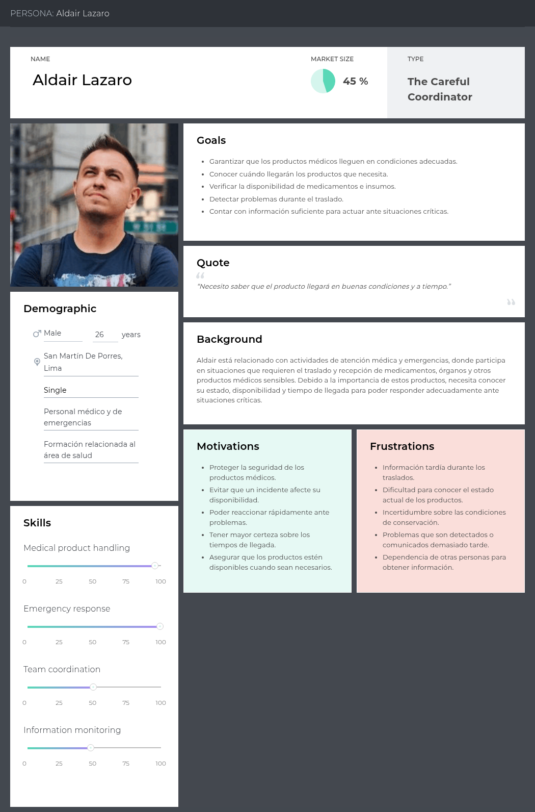

### User Persona 2: Operadores logísticos e instituciones de salud

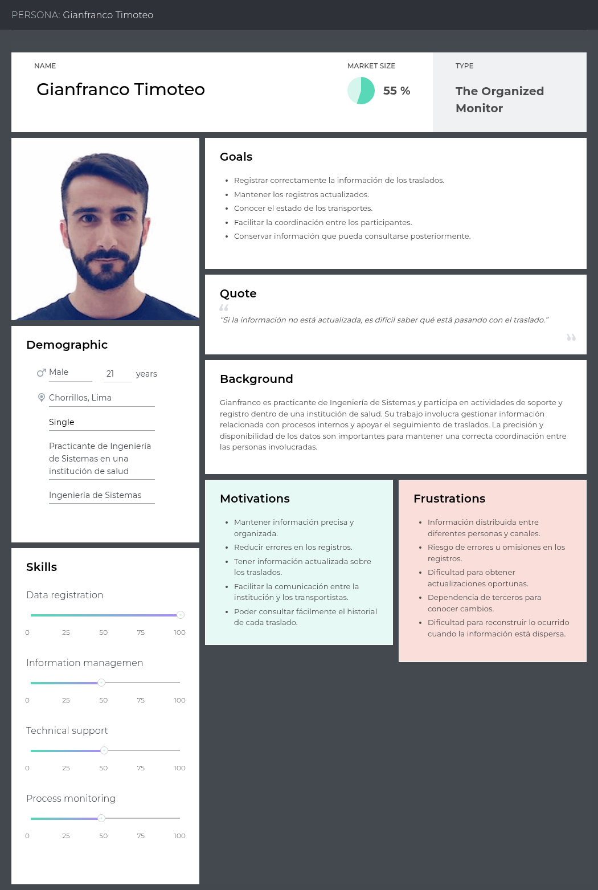

## 2.3.2. User Task Matrix

La User Task Matrix permite visualizar y comparar las tareas que cada segmento objetivo realiza para cumplir sus objetivos dentro de los procesos de transporte y recepción de productos médicos, independientemente de la existencia de una solución tecnológica. A continuación, se presentan las principales tareas identificadas para cada segmento, junto con su frecuencia e importancia para los User Personas correspondientes.

| **Tarea** | **Personal médico y de emergencias (Frecuencia / Importancia)** | **Operadores logísticos e instituciones de salud (Frecuencia / Importancia)** |
| --- | --- | --- |
| **Supervisar el estado de los productos médicos durante el transporte** | Alta / Alta | Media / Alta |
| **Coordinar y dar seguimiento a los transportes en curso** | Alta / Alta | Alta / Alta |
| **Verificar que los productos se mantengan en condiciones adecuadas** | Alta / Alta | Alta / Alta |
| **Identificar y atender incidentes durante el transporte** | Alta / Alta | Media / Alta |
| **Consultar la ubicación y el tiempo estimado de llegada de los transportes** | Alta / Alta | Alta / Alta |
| **Coordinar acciones ante retrasos o cambios durante el traslado** | Alta / Alta | Alta / Alta |
| **Registrar información relacionada con el transporte y la entrega** | Alta / Media | Alta / Alta |
| **Verificar las condiciones de los productos al momento de la recepción** | Media / Alta | Alta / Alta |
| **Confirmar la recepción de medicamentos o productos médicos** | Media / Alta | Alta / Alta |
| **Revisar antecedentes de transportes y entregas anteriores** | Media / Alta | Media / Alta |
| **Generar o revisar evidencias de las condiciones del transporte** | Media / Alta | Media / Alta |
| **Investigar las causas de incidentes o problemas durante una entrega** | Media / Alta | Media / Alta |

**Análisis de la User Task Matrix:** Las empresas de transporte y los operadores logísticos presentan una alta frecuencia e importancia en tareas relacionadas con la supervisión y coordinación de los transportes, debido a que deben gestionar continuamente el traslado de productos médicos y responder ante posibles incidentes. Por su parte, los centros de salud y las cadenas farmacéuticas concentran sus actividades principalmente en el seguimiento de los envíos, la verificación de las condiciones de los productos y la confirmación de su recepción. Para ambos segmentos, las tareas relacionadas con el control de las condiciones del transporte, la ubicación de los envíos y la gestión de incidentes presentan una importancia elevada, debido al impacto que pueden tener sobre la seguridad y trazabilidad de los productos médicos.

## 2.3.3. User Journey Mapping

Los User Journey Maps representan el recorrido end-to-end que cada User Persona realiza actualmente (situación As-Is) para cumplir con sus objetivos dentro de los procesos relacionados con el traslado, monitoreo y recepción de productos médicos sensibles, sin la existencia de Medical SmartBox. Estos mapas permiten identificar los puntos de dolor (pains) y las oportunidades de mejora (gains) presentes en las actividades actuales de los usuarios.

- **Segmento 1: Personal médico y de emergencias**

El siguiente Journey Map representa el recorrido de Renato Calvo Yalan, integrante del personal médico y de emergencias, durante las actividades relacionadas con el traslado y recepción de medicamentos, órganos e insumos médicos sensibles. El recorrido comprende la coordinación previa del traslado, el seguimiento de las condiciones de los productos, la espera durante el transporte y la recepción de los insumos. Durante este proceso, el usuario necesita contar con información oportuna sobre las condiciones de conservación, el tiempo estimado de llegada y la disponibilidad de los productos para poder actuar ante posibles incidentes.

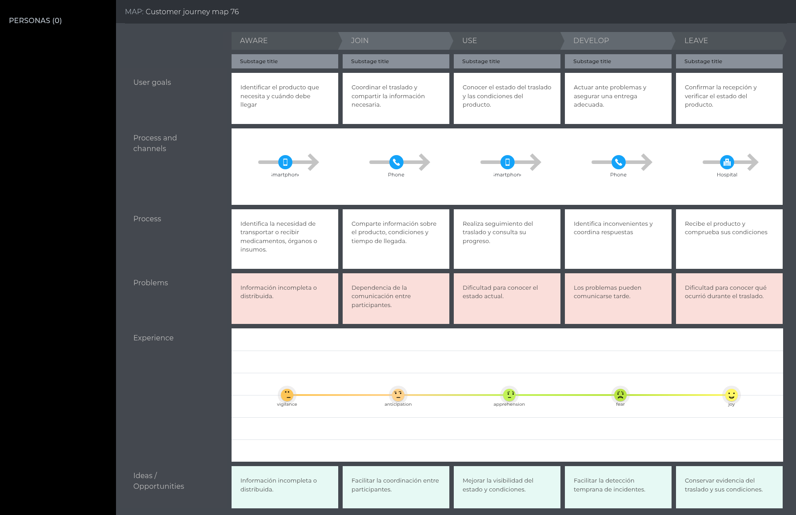

- **Segmento 2: Operadores logísticos e instituciones de salud**

El siguiente Journey Map representa el recorrido de Karla Pacheco, auxiliar administrativa del área de salud encargada del monitoreo y registro de rutas de ambulancias y de la recolección de muestras o materiales médicos. El recorrido comprende la coordinación de las rutas, el registro de información, el seguimiento del transporte y la recepción de los materiales. Durante este proceso, la comunicación con los transportistas y la disponibilidad de información actualizada resultan importantes para mantener un seguimiento adecuado de las rutas y registrar correctamente el desarrollo de cada traslado.

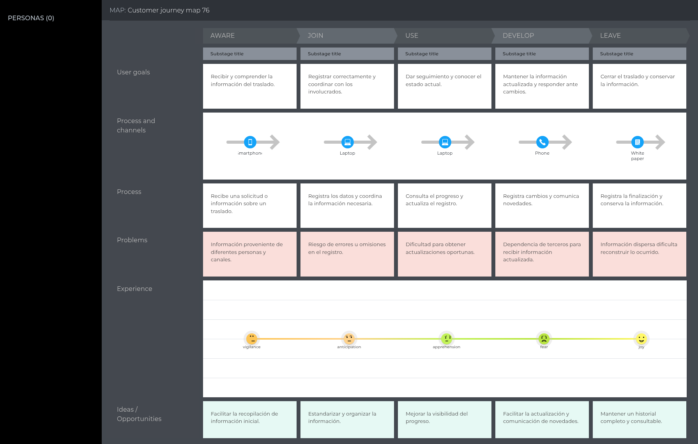

## 2.3.4. Empathy Mapping

Los Empathy Maps permiten profundizar en la comprensión de cada User Persona, explorando lo que piensa, siente, ve, oye, dice y hace dentro de su contexto relacionado con el traslado y manejo de productos médicos sensibles. Estos mapas permiten identificar los principales pains y gains de cada segmento y comprender las necesidades que deben ser consideradas durante el diseño de Medical SmartBox.

- **Segmento 1: Personal médico y de emergencias**

El siguiente Mapa de Empatía profundiza en la experiencia de Aldair Lazaro, integrante del personal médico y de emergencias. Se identifican sus principales pensamientos y sentimientos relacionados con la responsabilidad de garantizar que los productos médicos sensibles lleguen en condiciones adecuadas, así como lo que observa durante el traslado, la información que recibe de otros participantes del proceso y las acciones que realiza para verificar las condiciones y disponibilidad de los productos. El mapa también permite identificar como principales pains la falta de información oportuna, la incertidumbre ante posibles incidentes y la dificultad para conocer el estado del traslado, mientras que entre los gains se encuentran una mayor visibilidad del proceso, información confiable y capacidad de respuesta ante situaciones críticas.

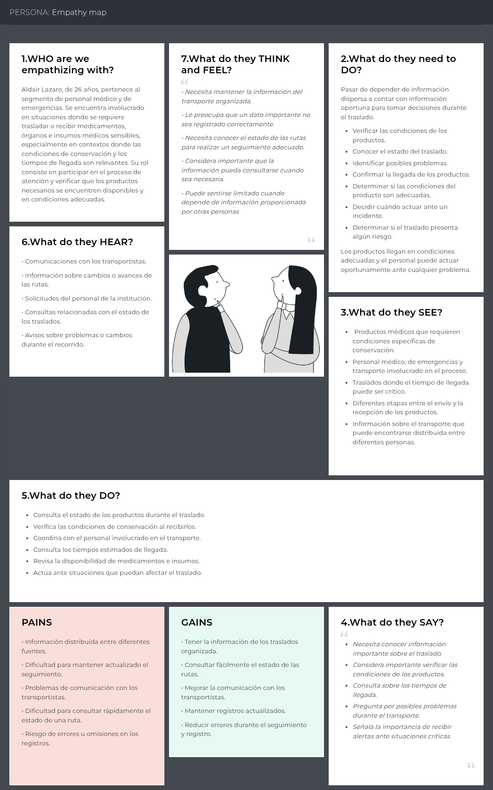

- **Segmento 2: Operadores logísticos e instituciones de salud**

El siguiente Mapa de Empatía profundiza en la experiencia de Gianfranco Timoteo, quien participa en actividades relacionadas con el soporte y registro dentro de una institución de salud. Se identifican sus principales pensamientos y sentimientos relacionados con la necesidad de mantener información organizada y disponible, así como lo que observa en el proceso de transporte, la información que recibe de otros participantes y las actividades que realiza para registrar y dar seguimiento a los traslados. El mapa permite identificar como principales pains las dificultades de comunicación, la información distribuida y el seguimiento de las rutas, mientras que entre los gains se encuentran una mejor coordinación, información centralizada y mayor facilidad para consultar el estado de los transportes.

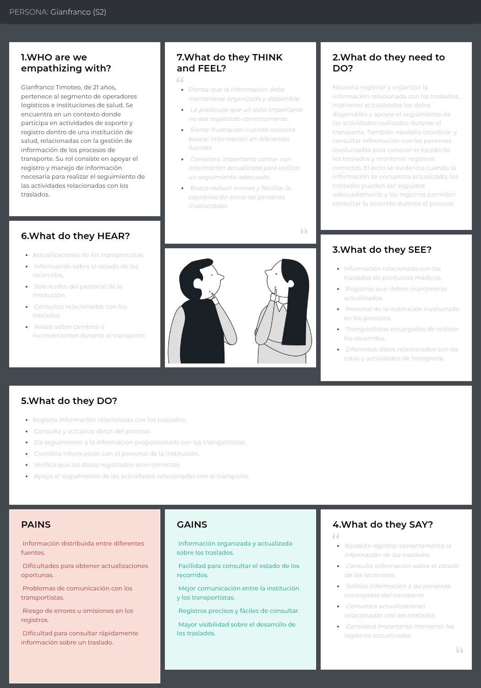


<div style="page-break-after: always;"></div>

# 2.4. Big Picture EventStorming

El equipo llevó a cabo una sesión formal de **Big Picture EventStorming** con el objetivo de obtener una visión holística y compartida del dominio de negocio del **Contenedor Médico Inteligente (Smart Medical Container)** para el transporte asistencial de medicamentos termosensibles, hemoderivados, muestras biológicas y órganos en Lima Metropolitana. Bajo los principios y prácticas de *Domain-Driven Design* y la técnica de *EventStorming* propuesta por Alberto Brandolini, la dinámica integró activamente la perspectiva de los dos segmentos objetivo del negocio: **Empresas de Transporte y Operadores Logísticos de Cadena de Frío** (conductores y paramédicos de ambulancia) y **Centros de Salud y Cadenas Farmacéuticas** (coordinadores de despacho, farmacéuticos y médicos receptores), en conjunto con el equipo de ingeniería de software e IoT.

Siguiendo los principios de modelado colaborativo de Brandolini, el Big Picture EventStorming no se diseñó como un diagrama de flujo rígido de ingeniería ni como un BPMN con carriles estructurados, sino como un **lienzo colaborativo de notas adhesivas** en Miro donde el tiempo fluye de manera natural y orgánica de **izquierda a derecha**. A lo largo de la sesión, los participantes exploraron el ciclo de vida completo del transporte médico urgente: desde la solicitud inicial del traslado hasta la recepción conforme en el centro de salud receptor bajo estricta cadena de frío (2 °C a 8 °C según DIGEMID R.M. N° 833-2015/MINSA) y custodia electrónica inmutable.

El taller se desarrolló ejecutando rigurosamente los nueve (9) pasos estructurados del proceso canónico de Big Picture EventStorming documentado por Alberto Brandolini (*Step-by-Step Guide to Run Your Big Picture EventStorming*):

1. **Preparación del Espacio y Materiales (*Preparing the Room*):** Se estructuró un lienzo infinito colaborativo en Miro, eliminando barreras jerárquicas y configurando una superficie de modelado sin límites de anchura, provista de la agenda visual de la sesión y una paleta cromática estandarizada de notas adhesivas digitales.
2. **Dinámica de Activación (*Energizing the Audience*):** Se realizó una breve dinámica de desinhibición y alineación para predisponer activamente al equipo multidisciplinario, articulando la visión operativa de conductores y paramédicos de ambulancia (Segmento 1) con el criterio clínico de médicos cirujanos, químicos farmacéuticos y el equipo de ingeniería de software e IoT (Segmento 2).
3. **Presentación del Alcance, Objetivos y Reglas (*Briefing and Presenting the Plan*):** El facilitador presentó el propósito central del modelado: la preservación inviolable de la cadena de frío (+2 °C a +8 °C bajo normativa DIGEMID R.M. N° 833-2015) y la trazabilidad digital de órganos y hemoderivados frente a la congestión vehicular de Lima Metropolitana, estableciendo las reglas de interacción y respeto por el tiempo cronológico.
4. **Generación Caótica de Eventos de Dominio (*Generating Domain Events*):** Fase divergente de modelado silencioso e individual. Cada participante escribió y pegó de forma libre y masiva en notas adhesivas naranjas (`#FFA500`) todos los eventos relevantes del negocio expresados en tiempo verbal pasado (*Domain Events*), reflejando hitos significativos como `Pre-enfriamiento Peltier estabilizado`, `Excursión térmica incipiente detectada` o `Muestra aceptada formalmente como viable`.
5. **Ordenamiento Cronológico y Detección de Flujos Concurrentes (*Sorting Domain Events*):** Fase convergente de debate intenso. Los participantes organizaron cooperativamente las notas de izquierda a derecha en una línea temporal estricta de extremo a extremo, alineando verticalmente los procesos que ocurren en paralelo (por ejemplo, el control térmico autónomo Peltier ejecutándose concurrentemente mientras el vehículo avanza en el tráfico).
6. **Identificación de Actores y Sistemas Externos (*Adding Actors and External Systems*):** Se incorporaron los roles humanos responsables de gatillar o atender eventos mediante notas amarillas pequeñas (Conductor de Ambulancia, Paramédico TEM, Coordinador de Despacho, Cirujano Receptor), así como los sistemas externos interactuantes en notas azules (Firmware Autónomo ESP32 como nodo IoT Edge emisor, API de Tráfico TomTom, Pasarela SMS Twilio, Registro RENIPRESS / SUSALUD y Sistema HIS / Quirófano Hospitalario receptor).
7. **Narración Cronológica Hacia Adelante (*Storytelling*):** Un facilitador y representantes de ambos segmentos narraron oralmente la historia completa del flujo de negocio de izquierda a derecha. Esta lectura validó la consistencia global del proceso, esclareció supuestos implícitos y permitió identificar fricciones operativas y riesgos reales, señalizados de inmediato con notas magenta/rosa (*Hotspots*).
8. **Narración Inversa y Detección de Brechas (*Reverse Storytelling*):** Se ejecutó una lectura en sentido inverso, comenzando desde el evento final (`Muestra aceptada formalmente como viable` / `Acta final de entrega firmada digitalmente`) y preguntando repetidamente: *¿Qué condición previa tuvo que cumplirse para que ocurriera este hecho?* Este análisis retrospectivo descubrió eventos faltantes de bioseguridad, validaciones de pre-enfriamiento y protocolos de contingencia ante caídas de la toma vehicular de 12V.
9. **Cierre, Consenso y Síntesis de Oportunidades (*Closing and Synthesis*):** Se consolidó el entendimiento compartido del dominio, se extrajo el vocabulario fundamental para la construcción del Lenguaje Ubicuo (Sección 2.5) y se priorizaron en notas verdes las oportunidades de solución de software e IoT (tara automática con celda de carga HX711, algoritmo predictivo de desvíos de ETA y acta digital inmutable con firma QR).

---

  
*Nota: Elaboración propia en Miro según la técnica de modelado colaborativo de Alberto Brandolini para el transporte asistencial de muestras médicas y órganos en Lima Metropolitana.*

---

### **2.4.1. Análisis del Dominio y Hallazgos de la Sesión**

La sesión de Big Picture EventStorming permitió al equipo comprender la dinámica real del transporte médico en Lima Metropolitana y articular las necesidades clínicas con la arquitectura del sistema:

#### 1. Exploración Desestructurada, Línea de Tiempo y Eventos Pivote (Pivotal Events)
El mapeo de eventos evidenció que el transporte asistencial es un proceso altamente concurrente y sensible al tiempo. Mientras el vehículo se desplaza por arterias viales congestionadas de Lima Metropolitana, el hardware del contenedor inteligente ejecuta en paralelo un lazo cerrado autónomo de control térmico (manteniendo la carga entre +2.0 °C y +8.0 °C mediante celdas Peltier), registrando la estabilidad del peso y verificando el precinto de seguridad electromecánico.

Siguiendo el enfoque canónico de modelado colaborativo concebido por Alberto Brandolini, la línea de tiempo temporal se estructura a partir de tres **Eventos Pivote (*Pivotal Events*)** que demarcan formalmente los momentos críticos de quiebre y transición de responsabilidad entre las tres macrofases del sistema:
* **Pivotal Event 1 (Origen → Tránsito):** `Acta digital de salida generada y firmada digitalmente` junto con la `Conexión del contenedor a la toma 12V DC`. Marca la transferencia legal de custodia desde el hospital donante o farmacia central hacia el equipo asistencial móvil, activando el régimen de supervisión telemática en ruta.
* **Pivotal Event 2 (Tránsito → Destino):** `Geocerca de pre-arribo hospitalaria activada`. Disparo telemático automatizado al ingresar al radio de 2 km / 10 minutos del hospital receptor, habilitando la alerta temprana a la rampa de trauma shock y la preparación del equipo médico o farmacéutico receptor.
* **Pivotal Event 3 (Destino → Cierre Clínico):** `Muestra aceptada formalmente como viable`, `Acta final de entrega firmada digitalmente` y `Expediente PDF auditado exportado a DIGEMID`. Cierre definitivo de la cadena de custodia con generación del expediente digital sellado mediante hash criptográfico SHA-256 para auditoría sanitaria de DIGEMID.

#### 2. Matriz de Puntos Críticos (Hotspots) y Oportunidades de Solución

La pizarra colaborativa desarrollada en Miro articula el flujo de izquierda a derecha en tres macrofases espaciales (**1. Origen y Despacho**, **2. Tránsito y Monitoreo Asistencial**, **3. Destino, Custodia y Cierre Clínico**), integrando analíticamente sus seis (6) etapas operativas para brindar una granularidad técnica precisa.

La siguiente matriz sintetiza los problemas operativos reales identificados en la red hospitalaria de Lima y las soluciones de ingeniería de software e IoT implementadas:

<table border="1" cellpadding="6" cellspacing="0">
  <thead>
    <tr>
      <th>Fase Operativa</th>
      <th>Punto Crítico / Hotspot (Problema Real en Lima)</th>
      <th>Severidad</th>
      <th>Oportunidad de Solución (Software / IoT)</th>
      <th>Subdominio DDD</th>
    </tr>
  </thead>
  <tbody>
    <tr>
      <td><strong>Despacho</strong></td>
      <td>Asignación de ambulancias sin visibilidad del estado de su toma de 12V ni del pre-enfriamiento del contenedor.</td>
      <td>Alta</td>
      <td><strong>Tablero IoT de Estado de Flota:</strong> Supervisión en tiempo real de batería, conexión eléctrica y temperatura previa.</td>
      <td><em>Medical Transport Planning & Dispatching</em></td>
    </tr>
    <tr>
      <td><strong>Carga y Custodia</strong></td>
      <td>Riesgo de sustitución de muestras o carga de paquetes no verificados en la rampa hospitalaria.</td>
      <td>Crítica</td>
      <td><strong>Tara Automática con Celda HX711:</strong> Registro de masa inicial (&plusmn;5 g) y bloqueo automático del solenoide.</td>
      <td><em>Smart Container & Telemetry Monitoring</em></td>
    </tr>
    <tr>
      <td><strong>Carga y Custodia</strong></td>
      <td>Actas en papel autocopiativo mojadas, extraviadas o ilegibles sin respaldo probatorio.</td>
      <td>Media</td>
      <td><strong>Acta Digital con Firma QR:</strong> Comprobante electrónico inalterable consultable en plataforma web.</td>
      <td><em>Chain of Custody & Traceability</em></td>
    </tr>
    <tr>
      <td><strong>Tránsito</strong></td>
      <td><strong>Congestión severa en Lima (TomTom: 34 min/10 km):</strong> Retrasos críticos en Av. Javier Prado o Vía Expresa.</td>
      <td>Crítica</td>
      <td><strong>Motor de ETA Dinámico:</strong> Recálculo de tiempos con TomTom Traffic API cada 60s y alertas de demora.</td>
      <td><em>Medical Transport Planning & Dispatching</em></td>
    </tr>
    <tr>
      <td><strong>Tránsito</strong></td>
      <td><strong>Golpe de calor en cabina (hasta 38.5 &deg;C):</strong> Rompe la cadena de frío en cajas convencionales en &lt;45 min.</td>
      <td>Catastrófica</td>
      <td><strong>Refrigeración Activa Peltier + Alarma Dual:</strong> Control PID (2&ndash;8 &deg;C), alarma sonora local y push a médicos.</td>
      <td><em>Critical Alerting & Incident Response</em></td>
    </tr>
    <tr>
      <td><strong>Tránsito</strong></td>
      <td><strong>Desconexión accidental de 12V:</strong> El enchufe del encendedor se zafa con baches o frenadas.</td>
      <td>Alta</td>
      <td><strong>Conmutación Automática a Batería LiFePO4:</strong> Pack interno LiFePO4 (4h de autonomía) con aviso en cabina.</td>
      <td><em>Smart Container & Telemetry Monitoring</em></td>
    </tr>
    <tr>
      <td><strong>Tránsito</strong></td>
      <td><strong>Pérdida de señal 4G en túneles (Línea Amarilla / zanjas):</strong> Provoca vacíos de datos durante el traslado.</td>
      <td>Alta</td>
      <td><strong>Búfer Flash Offline en ESP32:</strong> Almacenamiento local de 5,000 muestras y sincronización al reconectar.</td>
      <td><em>Smart Container & Telemetry Monitoring</em></td>
    </tr>
    <tr>
      <td><strong>Arribo</strong></td>
      <td>Quirófano o personal de guardia no preparado al llegar la ambulancia por falta de preaviso.</td>
      <td>Alta</td>
      <td><strong>Geocerca de Pre-Arribo (&le; 2 km / 10 min):</strong> Notificación automática al hospital receptor para alistar recepción.</td>
      <td><em>Medical Transport Planning & Dispatching</em></td>
    </tr>
    <tr>
      <td><strong>Entrega</strong></td>
      <td>Apertura indebida en pasillos o entrega a personal no facultado sin validación de identidad.</td>
      <td>Crítica</td>
      <td><strong>Doble Factor de Desbloqueo:</strong> Ubicación obligatoria en geocerca hospitalaria + código OTP temporal.</td>
      <td><em>Chain of Custody & Traceability</em></td>
    </tr>
    <tr>
      <td><strong>Cierre</strong></td>
      <td>Rechazo de lotes o litigios por falta de auditoría continua exigida por DIGEMID (R.M. 833-2015).</td>
      <td>Media</td>
      <td><strong>Expediente Digital con Hash SHA-256:</strong> Reporte PDF descargable con telemetría completa y firmas.</td>
      <td><em>Chain of Custody & Traceability</em></td>
    </tr>
  </tbody>
</table>

---

#### 3. Validación por Storytelling y Reverse Storytelling
La validación del recorrido de extremo a extremo confirmó la coherencia del ciclo asistencial entre ambos segmentos. Mediante la narrativa directa se verificó la transición sin fricciones de custodia entre el médico emisor, el paramédico y el cirujano receptor. Complementariamente, el análisis retrospectivo desde el hito `Muestra aceptada formalmente como viable` (`Acta final de entrega firmada digitalmente`) comprobó que ninguna entrega puede consumarse sin la confluencia de tres condiciones inviolables: desbloqueo por OTP dentro de la geocerca hospitalaria, preservación térmica continua (2 °C a 8 °C) garantizada por el respaldo LiFePO4, y descarga íntegra de la telemetría resguardada en el búfer flash local tras cruzar túneles.

#### 4. Delimitación Preliminar de Contextos Acotados (Bounded Contexts)
La sesión exploratoria preliminar del Big Picture permitió delimitar cinco (5) macro-contextos de negocio, los cuales, durante la fase de descomposición táctica de Design-Level EventStorming (Capítulo 4.6.1), evolucionan naturalmente hacia seis (6) Bounded Contexts al independizar la gestión de suscripciones comerciales y aprovisionamiento de flota (*Subscription & Fleet Provisioning*) del núcleo de autenticación y organizaciones (*IAM*):
1. **Medical Transport Planning & Dispatching:** Gestión de solicitudes de traslado, asignación de unidades móviles/tripulación y cálculo dinámico de rutas anti-tráfico.
2. **Smart Container & Telemetry Monitoring:** Ingestión de telemetría continua (temperatura, peso neto HX711, batería Li-Ion) y control electromecánico de tapa.
3. **Critical Alerting & Incident Response:** Detección en tiempo real de excursiones térmicas, disparador de alarmas acústicas en cabina y notificación de contingencias.
4. **Chain of Custody & Traceability:** Verificación de token OTP en geocerca, registro de actas de custodia y sellado inmutable con hash SHA-256 para DIGEMID (R.M. 833-2015).
5. **Identity, Access & Subscriptions (IAM):** Gestión de instituciones hospitalarias, planes SaaS B2B, autenticación JWT basada en roles y trazabilidad de licencias médicas.


<div style="page-break-after: always;"></div>

# 2.5. Ubiquitous Language

En esta sección se establece el glosario formal de términos y conceptos del dominio del negocio (*Smart Medical Container*), garantizando una comunicación unívoca, rigurosa y libre de ambigüedades entre los dos segmentos clave del negocio (las **empresas de transporte y operadores logísticos de cadena de frío**, y los **centros de salud y cadenas farmacéuticas** receptoras), las entidades reguladoras peruanas (MINSA, DIGEMID, DIGDOT) y el equipo de desarrollo de software.

Conforme a las directrices fundamentales de *Domain-Driven Design* (Eric Evans, Martin Fowler), todos los términos se presentan en idioma inglés con su equivalente formal en español entre paréntesis. Cada definición ha sido redactada rigurosamente desde la perspectiva clínica, operativa y legal del negocio asistencial en Lima Metropolitana, asegurando que el vocabulario permanezca libre de tecnicismos de implementación de software (tales como tablas relacionales, llaves foráneas, APIs, endpoints o controladores).

Cada uno de los 29 términos canónicos se encuentra formalmente circunscrito a su correspondiente *Bounded Context*, garantizando que cada concepto posea una semántica unívoca y bien delimitada dentro de las fronteras transaccionales del dominio. Cabe precisar que la estructuración en cinco (5) Bounded Contexts dentro de este glosario refleja los macro-contextos delimitados durante la fase exploratoria de requisitos del Big Picture (Capítulo 2.4), los cuales evolucionan armónicamente hacia seis (6) Bounded Contexts durante la descomposición de diseño táctico (Capítulo 4.6.1) al independizarse modularmente el aprovisionamiento de flota y suscripciones B2B. A continuación, se presenta la tabla consolidada en orden alfabético estricto (A-Z) como índice lexicográfico de referencia rápida, seguida del desglose analítico detallado por cada subdominio:

| # | Ubiquitous Term (English / Español) | Bounded Context Asociado | Tipo de Artefacto DDD |
|:---:|:---|:---|:---|
| 1 | **Acceptable Temperature Range (Rango Térmico Aceptable)** | Medical Transport Planning & Dispatching | Value Object |
| 2 | **Audit Trail & Digital Manifest (Rastro de Auditoría y Manifiesto Digital)** | Chain of Custody & Traceability | Aggregate Root |
| 3 | **Automated Maintenance and Sensor Calibration (Mantenimiento y Calibración Automatizada)** | Smart Container & Telemetry Monitoring | Domain Policy |
| 4 | **Chain of Custody (Cadena de Custodia Sanitaria)** | Chain of Custody & Traceability | Core Domain / Aggregate Root |
| 5 | **Cold Chain (Cadena de Frío)** | Smart Container & Telemetry Monitoring | Domain Policy |
| 6 | **Cold Ischemia Time (Tiempo de Isquemia Fría)** | Medical Transport Planning & Dispatching | Value Object |
| 7 | **Cold-Chain Deviation Report (Informe de Desviación de Cadena de Frío)** | Critical Alerting & Incident Response | Read Model / Domain Report |
| 8 | **Container Autonomy and Telemetry (Telemetría y Autonomía del Contenedor)** | Smart Container & Telemetry Monitoring | Entity / Value Object |
| 9 | **Container Lid Status & Tamper-Evident Lock (Estado de Tapa y Bloqueo Electromecánico de Custodia)** | Smart Container & Telemetry Monitoring | Entity |
| 10 | **Critical Operational Alert & Acknowledgment (Alerta Operativa Crítica y Acuse de Recibo)** | Critical Alerting & Incident Response | Aggregate Root / Entity |
| 11 | **Custody Handover Act (Acta de Entrega y Trazabilidad de Custodia)** | Chain of Custody & Traceability | Aggregate Root |
| 12 | **Dynamic Route ETA (Tiempo Estimado de Llegada Dinámico)** | Medical Transport Planning & Dispatching | Value Object |
| 13 | **Emergency Medical Crew (Tripulación Asistencial y Paramédica)** | Medical Transport Planning & Dispatching | Entity |
| 14 | **Fleet Container Provisioning (Aprovisionamiento y Vinculación de Flota)** | Identity, Access & Subscriptions (IAM) | Domain Policy / Entity |
| 15 | **Healthcare & Pharmaceutical Client (Centro de Salud y Cadena Farmacéutica)** | Identity, Access & Subscriptions (IAM) | Aggregate Root |
| 16 | **Hospital Geofence (Geocerca Hospitalaria)** | Identity, Access & Subscriptions (IAM) | Value Object |
| 17 | **Hospital Pre-Arrival Notice (Aviso de Pre-Arribo Hospitalario)** | Critical Alerting & Incident Response | Domain Event |
| 18 | **Logistics Transport Unit (Unidad de Transporte y Ambulancia Logística)** | Medical Transport Planning & Dispatching | Entity |
| 19 | **Medical and Biological Payload (Carga Médica y Biológica)** | Medical Transport Planning & Dispatching | Value Object |
| 20 | **One-Time Password / Unlock Token (Clave OTP / Token de Desbloqueo Temporal)** | Chain of Custody & Traceability | Value Object |
| 21 | **Procurement & Dispatch Coordinator (Coordinador de Procura y Despacho Asistencial)** | Medical Transport Planning & Dispatching | Entity |
| 22 | **Receiving Medical Custodian (Custodio Médico Receptor)** | Chain of Custody & Traceability | Value Object |
| 23 | **SaaS Subscription Plan (Plan de Suscripción SaaS B2B)** | Identity, Access & Subscriptions (IAM) | Aggregate Root |
| 24 | **Smart Medical Container (Contenedor Médico Inteligente)** | Smart Container & Telemetry Monitoring | Aggregate Root |
| 25 | **Tare Weight & Net Weight (Peso Tara y Peso Neto)** | Smart Container & Telemetry Monitoring | Value Object |
| 26 | **Thermal Excursion (Excursión Térmica)** | Critical Alerting & Incident Response | Domain Event / Aggregate Root |
| 27 | **Transport Mission / Emergency Transport Order (Misión de Transporte Asistido / Orden de Traslado de Emergencia)** | Medical Transport Planning & Dispatching | Aggregate Root |
| 28 | **Vehicle Telematics and Auxiliary Power (Telemática Vehicular y Alimentación Auxiliar)** | Smart Container & Telemetry Monitoring | Value Object / Domain Event |
| 29 | **Weight-Based Medical Stock (Stock Médico Ponderal)** | Smart Container & Telemetry Monitoring | Value Object |

---

### **2.5.1. Bounded Context: Identity, Access & Subscriptions (IAM)**

<table border="1" cellpadding="6" cellspacing="0">
  <thead>
    <tr>
      <th>Ubiquitous Term</th>
      <th>Domain Definition</th>
      <th>Role in the System &amp; DDD Mapping</th>
    </tr>
  </thead>
  <tbody>
    <tr>
      <td><strong>Healthcare &amp; Pharmaceutical Client (Centro de Salud y Cadena Farmacéutica)</strong></td>
      <td>Entidad pública o privada del sector salud o farmacéutico (hospital nacional, clínica privada, instituto especializado, laboratorio clínico o cadena farmacéutica) facultada legalmente para actuar como centro emisor o receptor de insumos médicos críticos, medicamentos termosensibles, hemoderivados u órganos bajo estricta cadena de frío.</td>
      <td><strong>Aggregate Root:</strong> <code>HospitalInstitution</code><br><em>Bounded Context:</em> Identity, Access &amp; Subscriptions (IAM)</td>
    </tr>
    <tr>
      <td><strong>Hospital Geofence (Geocerca Hospitalaria)</strong></td>
      <td>Perímetro geográfico virtual delimitado alrededor de la institución de salud receptora (típicamente con un radio de 2 km / 10 min), cuyo traspaso por la ambulancia activa automáticamente los protocolos de pre-arribo y habilita la autorización del desbloqueo digital.</td>
      <td><strong>Value Object:</strong> <code>GeoFence</code> en <code>HospitalInstitution</code><br><em>Bounded Context:</em> Identity, Access &amp; Subscriptions (IAM)</td>
    </tr>
    <tr>
      <td><strong>SaaS Subscription Plan (Plan de Suscripción SaaS B2B)</strong></td>
      <td>Acuerdo comercial formal y recurrente entre la plataforma Medical SMARTBOX y la institución de salud o empresa de ambulancias, que establece la cuota máxima de contenedores médicos autorizados en flota (Small Box de 5L vs. Standard Box de 20L), niveles de servicio de soporte y acceso multi-inquilino al portal de trazabilidad.</td>
      <td><strong>Aggregate Root:</strong> <code>SubscriptionPlan</code><br><em>Bounded Context:</em> Identity, Access &amp; Subscriptions (IAM)</td>
    </tr>
    <tr>
      <td><strong>Fleet Container Provisioning (Aprovisionamiento y Vinculación de Flota)</strong></td>
      <td>Proceso técnico y administrativo mediante el cual se activa, calibra y asocia un Contenedor Médico Inteligente a la flota de una institución acreditada, vinculando su número de serie de fábrica a los límites de membresía contratados.</td>
      <td><strong>Domain Policy / Entity:</strong> <code>ContainerProvisioning</code> en <code>SmartContainer</code><br><em>Bounded Context:</em> Identity, Access &amp; Subscriptions (IAM)</td>
    </tr>
  </tbody>
</table>

---

### **2.5.2. Bounded Context: Medical Transport Planning & Dispatching**

<table border="1" cellpadding="6" cellspacing="0">
  <thead>
    <tr>
      <th>Ubiquitous Term</th>
      <th>Domain Definition</th>
      <th>Role in the System &amp; DDD Mapping</th>
    </tr>
  </thead>
  <tbody>
    <tr>
      <td><strong>Acceptable Temperature Range (Rango Térmico Aceptable)</strong></td>
      <td>Intervalo estricto de temperatura de preservación bioambiental fijado por las Buenas Prácticas de Almacenamiento y Transporte de DIGEMID (+2.0 °C a +8.0 °C para medicamentos biológicos, vacunas y hemoderivados; y +2.0 °C a +4.0 °C para órganos de donante cadavérico), dentro del cual se garantiza la estabilidad farmacológica y viabilidad tisular de la carga.</td>
      <td><strong>Value Object:</strong> <code>TemperatureRange</code> en <code>TransportOrder</code><br><em>Bounded Context:</em> Medical Transport Planning &amp; Dispatching</td>
    </tr>
    <tr>
      <td><strong>Cold Ischemia Time (Tiempo de Isquemia Fría)</strong></td>
      <td>Intervalo de tiempo fisiológico máximo que un órgano para trasplante puede permanecer sin irrigación sanguínea en preservación hipotérmica (desde el clampado aórtico en el hospital donante hasta su revascularización en quirófano) antes de sufrir necrosis tisular irreversible, gobernado por la Directiva Sanitaria N° 152/DIGDOT.</td>
      <td><strong>Value Object:</strong> <code>IschemiaTimeLimit</code> en <code>TransportOrder</code><br><em>Bounded Context:</em> Medical Transport Planning &amp; Dispatching</td>
    </tr>
    <tr>
      <td><strong>Dynamic Route ETA (Tiempo Estimado de Llegada Dinámico)</strong></td>
      <td>Cálculo predictivo continuo de la duración remanente y la hora exacta de arribo de la ambulancia al hospital de destino, ajustado dinámicamente según las variaciones del flujo vehicular, congestión e incidentes de tránsito en los corredores hospitalarios de Lima Metropolitana.</td>
      <td><strong>Value Object:</strong> <code>RouteProgress</code> en la Entidad <code>TransportRoute</code><br><em>Bounded Context:</em> Medical Transport Planning &amp; Dispatching</td>
    </tr>
    <tr>
      <td><strong>Emergency Medical Crew (Tripulación Asistencial y Paramédica)</strong></td>
      <td>Personal asistencial calificado (paramédicos, enfermeros o conductores de emergencias médicas) encargado de la operación en ruta, conexión del contenedor a la toma 12V del vehículo asistencial y custodia física directa durante el traslado de urgencia.</td>
      <td><strong>Entity:</strong> <code>CrewMember</code> en <code>DispatchTrip</code><br><em>Bounded Context:</em> Medical Transport Planning &amp; Dispatching</td>
    </tr>
    <tr>
      <td><strong>Logistics Transport Unit (Unidad de Transporte y Ambulancia Logística)</strong></td>
      <td>Vehículo terrestre de transporte especializado (ambulancia asistencial Tipo II/III o furgón logístico climatizado) operado por empresas de transporte y operadores logísticos de cadena de frío, equipado con soporte eléctrico continuo de 12V en cabina y sistema telemático de navegación para el Contenedor Médico Inteligente.</td>
      <td><strong>Entity:</strong> <code>VehicleBinding</code> asociada al Agregado <code>DispatchTrip</code><br><em>Bounded Context:</em> Medical Transport Planning &amp; Dispatching</td>
    </tr>
    <tr>
      <td><strong>Medical and Biological Payload (Carga Médica y Biológica)</strong></td>
      <td>Conjunto de insumos terapéuticos y biológicos altamente termosensibles y críticos trasladados en la unidad de transporte asistido, que comprende órganos sólidos para trasplante (corazón, riñón, hígado), tejidos humanos, componentes sanguíneos (paquetes globulares, plasma), vacunas e inmunobiológicos, y medicamentos de alto costo sujetos a rigurosos límites de supervivencia biológica.</td>
      <td><strong>Value Object:</strong> <code>BiologicalPayload</code> encapsulado en <code>TransportOrder</code><br><em>Bounded Context:</em> Medical Transport Planning &amp; Dispatching</td>
    </tr>
    <tr>
      <td><strong>Procurement &amp; Dispatch Coordinator (Coordinador de Procura y Despacho Asistencial)</strong></td>
      <td>Profesional asistencial o logístico (adscrito a DIGDOT, MINSA o a la central de despacho del operador de transporte) facultado para autorizar la misión de traslado, evaluar la disponibilidad de unidades móviles climatizadas y emitir la orden formal de transporte de órganos o hemoderivados.</td>
      <td><strong>Entity:</strong> <code>DispatchCoordinator</code> en <code>TransportOrder</code><br><em>Bounded Context:</em> Medical Transport Planning &amp; Dispatching</td>
    </tr>
    <tr>
      <td><strong>Transport Mission / Emergency Transport Order (Misión de Transporte Asistido / Orden de Traslado de Emergencia)</strong></td>
      <td>Operación asistencial protocolizada de traslado médico entre un centro de salud o almacén farmacéutico de origen y una institución de destino, gobernada por una ventana temporal crítica, una tripulación técnica asignada y directivas estrictas de conservación bioambiental.</td>
      <td><strong>Aggregate Root:</strong> <code>DispatchTrip</code><br><em>Bounded Context:</em> Medical Transport Planning &amp; Dispatching</td>
    </tr>
  </tbody>
</table>

---

### **2.5.3. Bounded Context: Smart Container & Telemetry Monitoring**

<table border="1" cellpadding="6" cellspacing="0">
  <thead>
    <tr>
      <th>Ubiquitous Term</th>
      <th>Domain Definition</th>
      <th>Role in the System &amp; DDD Mapping</th>
    </tr>
  </thead>
  <tbody>
    <tr>
      <td><strong>Automated Maintenance and Sensor Calibration (Mantenimiento y Calibración Automatizada)</strong></td>
      <td>Protocolo de diagnóstico predictivo y continuo ejecutado de forma autónoma por el contenedor inteligente y la plataforma de monitoreo asistencial para supervisar el desgaste de la celda Peltier, la deriva de calibración de la celda de carga HX711 y los ciclos de vida útil de la batería interna LiFePO4, programando órdenes de servicio preventivo antes de que ocurra una falla operativa en ruta.</td>
      <td><strong>Domain Policy:</strong> <code>PreventiveMaintenancePolicy</code><br><em>Bounded Context:</em> Smart Container &amp; Telemetry Monitoring</td>
    </tr>
    <tr>
      <td><strong>Cold Chain (Cadena de Frío)</strong></td>
      <td>Proceso logístico ininterrumpido de control y supervisión ambiental que asegura que los insumos biológicos y farmacéuticos se mantengan dentro de los intervalos térmicos normativos reglamentados por el MINSA y la DIGEMID (+2 °C a +4 °C para órganos; +2 °C a +8 °C para hemoderivados y vacunas) durante todas las etapas de custodia y desplazamiento en ambulancia.</td>
      <td><strong>Domain Policy:</strong> <code>ColdChainPreservationPolicy</code><br><em>Bounded Context:</em> Smart Container &amp; Telemetry Monitoring</td>
    </tr>
    <tr>
      <td><strong>Container Autonomy and Telemetry (Telemetría y Autonomía del Contenedor)</strong></td>
      <td>Flujo periódico de mediciones físicas directas (temperatura interna de cámara, peso en bandeja, estado del sensor magnético de tapa, voltaje y porcentaje de carga de la batería interna LiFePO4) transmitidas de forma continua para garantizar que el soporte térmico se mantenga activo aun ante desconexiones de la red de la ambulancia.</td>
      <td><strong>Entity:</strong> <code>TelemetryLog</code> / <strong>Value Object:</strong> <code>TelemetrySnapshot</code><br><em>Bounded Context:</em> Smart Container &amp; Telemetry Monitoring</td>
    </tr>
    <tr>
      <td><strong>Container Lid Status &amp; Tamper-Evident Lock (Estado de Tapa y Bloqueo Electromecánico de Custodia)</strong></td>
      <td>Supervisión continua del sellado hermético superior (contacto magnético) y cerrojo electromecánico de alta retención comandado por solenoide, que previene la apertura no autorizada de la tapa durante el tránsito de la ambulancia y habilita su liberación física únicamente cuando el vehículo ingresa a la geocerca hospitalaria de destino y el personal facultado valida su identidad mediante un código OTP de un solo uso.</td>
      <td><strong>Entity:</strong> <code>ElectromechanicalLock</code> subordinada a <code>SmartContainer</code><br><em>Bounded Context:</em> Smart Container &amp; Telemetry Monitoring</td>
    </tr>
    <tr>
      <td><strong>Smart Medical Container (Contenedor Médico Inteligente)</strong></td>
      <td>Unidad física móvil e isotérmica de grado clínico instalada en el transporte asistido, disponible en diversos factores de forma y capacidades volumétricas modulares según los requisitos de carga, dotada de aislamiento térmico de alta densidad, alimentación energética dual (red fija y toma vehicular de 12V), instrumentación de medición bioambiental continua y mecanismo de cierre electromecánico de seguridad.</td>
      <td><strong>Aggregate Root:</strong> <code>SmartContainer</code><br><em>Bounded Context:</em> Smart Container &amp; Telemetry Monitoring</td>
    </tr>
    <tr>
      <td><strong>Tare Weight &amp; Net Weight (Peso Tara y Peso Neto)</strong></td>
      <td>Procedimiento metrológico de calibración en origen mediante el cual se descuenta la masa basal del contenedor vacío y sus componentes de fijación (tara), permitiendo cuantificar con precisión (&plusmn;5 g) la masa neta de la carga biológica para detectar variaciones por fugas, sustracción o reemplazo clandestino durante el traslado.</td>
      <td><strong>Value Object:</strong> <code>ContainerWeightMetrics</code> en <code>SmartContainer</code><br><em>Bounded Context:</em> Smart Container &amp; Telemetry Monitoring</td>
    </tr>
    <tr>
      <td><strong>Vehicle Telematics and Auxiliary Power (Telemática Vehicular y Alimentación Auxiliar)</strong></td>
      <td>Parámetros operativos capturados desde la unidad móvil de transporte asistencial (estado de suministro eléctrico continuo de 12V en cabina, velocidad de desplazamiento y coordenadas geográficas en tiempo real) que permiten supervisar la estabilidad energética del contenedor y predecir los tiempos de traslado en la red vial de Lima Metropolitana.</td>
      <td><strong>Value Object:</strong> <code>AuxiliaryPowerTelemetry</code> / <strong>Domain Event:</strong> <code>ExternalPowerLost</code><br><em>Bounded Context:</em> Smart Container &amp; Telemetry Monitoring</td>
    </tr>
    <tr>
      <td><strong>Weight-Based Medical Stock (Stock Médico Ponderal)</strong></td>
      <td>Estimación cuantitativa en tiempo real de la cantidad de medicamentos, ampollas o insumos almacenados dentro del compartimento, calculada a partir de las variaciones de masa registradas continuamente por la celda de carga de precisión, permitiendo prevenir desabastecimientos en ruta o sustracciones clandestinas.</td>
      <td><strong>Value Object:</strong> <code>PayloadWeight</code> (Invariante de peso en <code>SmartContainer</code>)<br><em>Bounded Context:</em> Smart Container &amp; Telemetry Monitoring</td>
    </tr>
  </tbody>
</table>

---

### **2.5.4. Bounded Context: Critical Alerting & Incident Response**

<table border="1" cellpadding="6" cellspacing="0">
  <thead>
    <tr>
      <th>Ubiquitous Term</th>
      <th>Domain Definition</th>
      <th>Role in the System &amp; DDD Mapping</th>
    </tr>
  </thead>
  <tbody>
    <tr>
      <td><strong>Cold-Chain Deviation Report (Informe de Desviación de Cadena de Frío)</strong></td>
      <td>Acta técnico-sanitaria de notificación obligatoria emitida automáticamente cuando se constata una excursión térmica no mitigada durante el traslado en ambulancia, documentando la integral tiempo-temperatura del evento para sustentar formalmente el descarte, reemplazo o cuarentena preventiva del lote médico ante auditorías de DIGEMID y DIGDOT.</td>
      <td><strong>Read Model / Domain Report:</strong> <code>ColdChainDeviationReport</code><br><em>Bounded Context:</em> Critical Alerting &amp; Incident Response</td>
    </tr>
    <tr>
      <td><strong>Critical Operational Alert &amp; Acknowledgment (Alerta Operativa Crítica y Acuse de Recibo)</strong></td>
      <td>Notificación de alta prioridad y respuesta inmediata ante contingencias en ruta (excursiones térmicas, desconexión vehicular de 12V, apertura indebida o anomalías ponderales), que combina avisos acústico-visuales en la cabina asistencial y alertas digitales a la central médica, requiriendo que la tripulación confirme manualmente su recepción en un plazo no mayor a 2 minutos para coordinar el plan de contingencia.</td>
      <td><strong>Aggregate Root:</strong> <code>CriticalIncident</code> / <strong>Entity:</strong> <code>ContingencyResolution</code><br><em>Bounded Context:</em> Critical Alerting &amp; Incident Response</td>
    </tr>
    <tr>
      <td><strong>Hospital Pre-Arrival Notice (Aviso de Pre-Arribo Hospitalario)</strong></td>
      <td>Comunicación protocolar preventiva enviada automáticamente al equipo médico y quirúrgico del hospital receptor cuando la ambulancia se encuentra a una proximidad crítica (10 minutos de arribo o cruce de geocerca), facilitando el alistamiento de quirófano, esterilización de instrumental y despeje de rampas de trauma shock.</td>
      <td><strong>Domain Event:</strong> <code>HospitalPreArrivalTriggered</code><br><em>Bounded Context:</em> Critical Alerting &amp; Incident Response</td>
    </tr>
    <tr>
      <td><strong>Thermal Excursion (Excursión Térmica)</strong></td>
      <td>Incidente crítico originado cuando la temperatura interna de la cámara del contenedor traspasa los márgenes de seguridad normativos durante un tiempo mayor a la tolerancia asistencial permitida, comprometiendo la estabilidad fisicoquímica o viabilidad celular del insumo y tipificándose como una no conformidad sanitaria grave.</td>
      <td><strong>Domain Event:</strong> <code>ThermalExcursionDetected</code> / <strong>Aggregate Root:</strong> <code>CriticalIncident</code><br><em>Bounded Context:</em> Critical Alerting &amp; Incident Response</td>
    </tr>
  </tbody>
</table>

---

### **2.5.5. Bounded Context: Chain of Custody & Traceability**

<table border="1" cellpadding="6" cellspacing="0">
  <thead>
    <tr>
      <th>Ubiquitous Term</th>
      <th>Domain Definition</th>
      <th>Role in the System &amp; DDD Mapping</th>
    </tr>
  </thead>
  <tbody>
    <tr>
      <td><strong>Audit Trail &amp; Digital Manifest (Rastro de Auditoría y Manifiesto Digital)</strong></td>
      <td>Secuencia ininterrumpida y cronológica de evidencias físicas, temporales y ambientales registradas durante toda la misión de transporte, compilada al cierre en un acta o expediente digital sellado criptográficamente que acredita ante los auditores de DIGEMID, DIGDOT y SUSALUD que la custodia médica nunca fue vulnerada.</td>
      <td><strong>Aggregate Root:</strong> <code>DigitalAuditManifest</code><br><em>Bounded Context:</em> Chain of Custody &amp; Traceability</td>
    </tr>
    <tr>
      <td><strong>Chain of Custody (Cadena de Custodia Sanitaria)</strong></td>
      <td>Registro documental, físico y legal continuo e inalterable que certifica la tenencia, ubicación, trazabilidad horaria, eventos de manipulación y curvas bioambientales de la carga médica desde el centro donante o farmacia de origen hasta su recepción definitiva.</td>
      <td><strong>Core Bounded Context:</strong> Chain of Custody &amp; Traceability<br><em>Aggregate Root:</em> <code>CustodyTransfer</code></td>
    </tr>
    <tr>
      <td><strong>Custody Handover Act (Acta de Entrega y Trazabilidad de Custodia)</strong></td>
      <td>Documento protocolar formal generado al término del traslado asistencial, donde la tripulación paramédica y el equipo médico receptor rubrican mancomunadamente la conformidad del estado físico, el balance de stock y el dictamen de viabilidad biológica con el respaldo de la curva térmica completa del trayecto.</td>
      <td><strong>Aggregate Root:</strong> <code>CustodyTransfer</code><br><em>Bounded Context:</em> Chain of Custody &amp; Traceability</td>
    </tr>
    <tr>
      <td><strong>One-Time Password / Unlock Token (Clave OTP / Token de Desbloqueo Temporal)</strong></td>
      <td>Clave numérica efímera de seguridad clínica generada dinámicamente por la plataforma y transmitida exclusivamente al médico receptor facultado, cuya introducción en el panel de control del contenedor condiciona la liberación del solenoide físico de la tapa únicamente cuando la ambulancia se encuentra dentro de la geocerca hospitalaria autorizada de destino.</td>
      <td><strong>Value Object:</strong> <code>OtpToken</code> encapsulado en <code>CustodyTransfer</code><br><em>Bounded Context:</em> Chain of Custody &amp; Traceability</td>
    </tr>
    <tr>
      <td><strong>Receiving Medical Custodian (Custodio Médico Receptor)</strong></td>
      <td>Profesional de la salud facultado en el establecimiento hospitalario o farmacia de destino (cirujano de trasplantes, médico de emergencia o químico farmacéutico responsable) habilitado para recibir la clave OTP, constatar la viabilidad clínica y formalizar el acta de conformidad.</td>
      <td><strong>Value Object:</strong> <code>ReceivingPhysician</code> en <code>CustodyTransfer</code><br><em>Bounded Context:</em> Chain of Custody &amp; Traceability</td>
    </tr>
  </tbody>
</table>


<div style="page-break-after: always;"></div>

# Capítulo III: Requirements Specification

# 3.1. User Stories

En esta sección se detallan las 18 historias de usuario (User Stories) que estructuran el alcance funcional del ecosistema **NeonCode**. La especificación abarca la aplicación web responsive de monitoreo, el sitio web público (Landing Page) y la interfaz de servicios backend (RESTful API) para la supervisión en tiempo real de contenedores médicos inteligentes instalados en ambulancias.

Todos los criterios de aceptación siguen la especificación **Gherkin** (Dado que / Cuando / Entonces), redactados en tercera persona, tiempo presente y enfocados en las reglas de negocio del dominio de salud y logística médica, omitiendo referencias a elementos de interfaz de usuario.

| Epic / Story ID | Título | Descripción | Criterios de Aceptación | Relacionado con (Epic ID) |
| :--- | :--- | :--- | :--- | :--- |
| **EP01** | Identity & Access Management | Épica destinada a la gestión de accesos, roles, autenticación segura y perfiles de instituciones de salud. | N/A | N/A |
| **US01** | Registro de Institución de Salud | Como supervisor hospitalario, deseo registrar mi centro médico en la plataforma NeonCode para gestionar la flota de ambulancias y contenedores. | **Dado que** la institución de salud no cuenta con una cuenta activa,<br>**Cuando** proporciona el registro institucional y credenciales de acceso válidas,<br>**Entonces** el sistema genera la cuenta corporativa y notifica la activación del perfil. | EP01 |
| **US02** | Autenticación de Personal de Emergencia | Como personal médico de emergencia, deseo autenticarme en la aplicación web para acceder al estado de la carga transportada en tiempo real. | **Dado que** el usuario médico cuenta con credenciales activas,<br>**Cuando** ingresa sus datos de acceso autorizados,<br>**Entonces** el sistema valida la identidad y concede acceso al panel de supervisión. | EP01 |
| **US03** | Endpoint de Autenticación de Usuarios (API) | Como Developer, deseo disponer de un endpoint POST `/api/v1/authentication/sign-in` para validar credenciales y emitir tokens de sesión. | **Dado que** la aplicación cliente envía una solicitud POST con credenciales válidas,<br>**Cuando** la API procesa la autenticación,<br>**Entonces** responde con código HTTP 200 y el token JWT de sesión.<br><br>**Dado que** el cliente envía datos de acceso inválidos,<br>**Cuando** la API procesa la petición,<br>**Entonces** responde con un código HTTP 401 Unauthorized. | EP01 |
| **EP02** | Landing Page & Brand Awareness | Épica orientada a la difusión de la propuesta de valor y captura de prospectos del sector salud. | N/A | N/A |
| **US04** | Exploración de Propuesta de Valor Logística | Como visitante comercial, deseo consultar las capacidades de los contenedores inteligentes en el Landing Page para evaluar su implementación. | **Dado que** el visitante navega en el sitio principal de NeonCode,<br>**Cuando** explora la sección de soluciones para transporte médico,<br>**Entonces** el sistema despliega las especificaciones térmicas, de trazabilidad y planes de servicio. | EP02 |
| **US05** | Solicitud de Demostración Corporativa | Como visitante comercial, deseo enviar un formulario de contacto para solicitar una demostración del sistema en mi centro hospitalario. | **Dado que** el visitante completa sus datos institucionales de contacto,<br>**Cuando** efectúa el envío del formulario,<br>**Entonces** el sistema registra el prospecto y despacha un correo de confirmación al usuario. | EP02 |
| **US06** | Consulta de Preguntas Frecuentes | Como visitante comercial, deseo revisar la sección de FAQ en el Landing Page para resolver dudas sobre la integración IoT en ambulancias. | **Dado que** el visitante ingresa al centro de ayuda del sitio web,<br>**Cuando** selecciona la categoría de hardware y sensores IoT,<br>**Entonces** el sistema muestra las respuestas estructuradas sobre la cadena de frío y conectividad. | EP02 |
| **EP03** | Container & Ambulance Provisioning | Épica para el alta, configuración y vinculación de contenedores IoT y unidades de ambulancia. | N/A | N/A |
| **US07** | Alta de Unidades de Ambulancia | Como operador logístico de salud, deseo registrar vehículos de transporte en el sistema para asociarles contenedores de insumos. | **Dado que** el operador logístico ha iniciado sesión,<br>**Cuando** ingresa los datos de identificación y matrícula de la ambulancia,<br>**Entonces** el sistema registra el vehículo en el inventario activo de la institución. | EP03 |
| **US08** | Vinculación de Contenedor Inteligente | Como operador logístico de salud, deseo vincular un contenedor IoT a una ambulancia específica para iniciar la supervisión de la carga. | **Dado que** el operador selecciona una ambulancia disponible,<br>**When** ingresa el identificador único del contenedor inteligente,<br>**Then** el sistema asigna el dispositivo al vehículo y habilita la recepción de telemetría. | EP03 |
| **US09** | Ingesta de Telemetría IoT (API) | Como Developer, deseo contar con un endpoint POST `/api/v1/containers/{containerId}/telemetry` para registrar datos térmicos y de estado. | **Dado que** el contenedor transmite un payload con temperatura, peso, apertura y batería,<br>**When** la API valida y procesa la estructura de datos,<br>**Then** almacena la lectura en la base de datos y responde con HTTP 201 Created. | EP03 |
| **EP04** | Real-Time Environmental & Fleet Monitoring | Épica centrada en la supervisión continua de temperatura, inventario por peso, GPS, combustible y ETA. | N/A | N/A |
| **US10** | Monitoreo Térmico y de Apertura | Como personal médico de emergencia, deseo consultar la temperatura interna y el estado de apertura del contenedor para garantizar la cadena de frío. | **Dado que** la ambulancia se encuentra en ruta de traslado,<br>**When** los sensores del contenedor registran cambios térmicos o de escotilla,<br>**Then** la plataforma actualiza de forma inmediata las lecturas en la vista de monitoreo. | EP04 |
| **US11** | Control de Stock por Sensores de Peso | Como personal médico de emergencia, deseo verificar la disponibilidad de insumos mediante sensores de peso para confirmar existencias. | **Dado que** el usuario médico consulta el detalle del contenedor,<br>**When** se retira o ingresa un insumo médico,<br>**Then** el sistema calcula la diferencia de masa y actualiza el estimado de stock en la plataforma. | EP04 |
| **US12** | Consulta de Telemetría e Indicadores (API) | Como Developer, deseo disponer de un endpoint GET `/api/v1/containers/{containerId}/metrics` para alimentar la vista del panel web. | **Dado que** el cliente web solicita el estado actual de un contenedor,<br>**When** la API procesa la petición con un identificador válido,<br>**Then** responde con código HTTP 200 y el objeto JSON con las últimas mediciones. | EP04 |
| **EP05** | Incident Alerts & Medical Dispatch | Épica para la gestión y notificación de incidentes críticos como variaciones térmicas o retrasos. | N/A | N/A |
| **US13** | Configuración de Umbrales Térmicos Críticos | Como supervisor hospitalario, deseo establecer rangos de temperatura permitidos para recibir avisos preventivos ante desviaciones. | **Dado que** el supervisor edita los parámetros de conservación de una carga sensible,<br>**When** guarda los límites mínimos y máximos de temperatura,<br>**Then** el sistema registra la regla de negocio para la emisión de alertas. | EP05 |
| **US14** | Visualización de Alertas en Ruta | Como operador logístico de salud, deseo recibir avisos de variaciones térmicas o retrasos para tomar acciones correctivas inmediatas. | **Dado que** un sensor detecta una anomalía de temperatura o nivel crítico de batería,<br>**When** el evento es registrado por el sistema,<br>**Then** la plataforma notifica la alerta priorizada en el panel del operador. | EP05 |
| **US15** | Servicio de Despacho de Alertas (API) | Como Developer, deseo contar con un endpoint POST `/api/v1/alerts/dispatch` para procesar notificaciones de emergencia. | **Dado que** la regla de negocio detecta la ruptura de la cadena de frío,<br>**When** la API ejecuta el servicio de despacho,<br>**Then** genera la notificación correspondiente y retorna un código HTTP 202 Accepted. | EP05 |
| **EP06** | Chain of Custody & Audit Reports | Épica orientada al registro histórico, trazabilidad de la cadena de custodia y reportes de auditoría. | N/A | N/A |
| **US16** | Generación de Reportes de Trazabilidad | Como supervisor hospitalario, deseo exportar el informe del traslado médico para certificar el cumplimiento de la cadena de frío. | **Dado que** un traslado médico ha finalizado,<br>**When** el supervisor solicita la consolidación del informe de auditoría,<br>**Then** el sistema genera un reporte con la gráfica de temperatura, aperturas y tiempos de traslado. | EP06 |
| **US17** | Confirmación de Entrega y Cadena de Custodia | Como personal médico de emergencia, deseo registrar la recepción del contenedor para cerrar la cadena de custodia del envío. | **Dado que** la ambulancia arriba a la institución de destino,<br>**When** el profesional de salud confirma la recepción satisfactoria de la carga,<br>**Then** el sistema sella el registro histórico con fecha, hora y responsable de recepción. | EP06 |
| **US18** | Consulta de Historial de Traslados (API) | Como Developer, deseo disponer de un endpoint GET `/api/v1/transfers/{transferId}/audit` para recuperar el registro de auditoría. | **Dado que** se requiere auditar un traslado finalizado,<br>**When** la API procesa la consulta con el identificador de traslado,<br>**Then** devuelve un código HTTP 200 con el historial de eventos y datos de telemetría. | EP06 |


<div style="page-break-after: always;"></div>

# 3.2. Impact Mapping

El **Impact Mapping** es una técnica de planificación estratégica que conecta los objetivos de negocio de la startup **NeonCode** con las entregas de software para la supervisión de contenedores médicos inteligentes. Este mapa permite priorizar las funcionalidades que generan un impacto directo en el comportamiento de nuestros segmentos objetivo: Personal Médico de Emergencias, Operadores Logísticos de Salud, Supervisores Hospitalarios y Visitantes Comerciales.

### Estructura del Impact Map

El mapa de impacto se compone de cuatro niveles jerárquicos:
1. **Business Goal (Meta de Negocio):** Objetivos SMART que la startup busca alcanzar en un periodo determinado.
2. **Actor / Persona:** Los usuarios o roles que nos ayudarán a alcanzar las metas.
3. **Impact:** Los cambios conductuales o beneficios esperados en los actores.
4. **Deliverables & User Stories:** Los entregables digitales y las historias de usuario asociadas que provocan dichos impactos.

---

### Mapeo Completo por Objetivos de Negocio (Business Goals)

#### Goal 1: Alcanzar 50 instituciones de salud y operadores de ambulancias afiliados a la plataforma NeonCode en un periodo de 8 meses tras el lanzamiento.

* **Actor:** Visitante Comercial
    * **Impact:** Comprender los beneficios de la supervisión térmica y logística para solicitar demostraciones o contratar planes de servicio.
        * **Deliverable:** Landing Page corporativo y portal de difusión de soluciones médicas.
            * **US04:** Exploración de Propuesta de Valor Logística.
            * **US05:** Solicitud de Demostración Corporativa.
            * **US06:** Consulta de Preguntas Frecuentes.

* **Actor:** Supervisor Hospitalario
    * **Impact:** Dar de alta la institución y configurar la flota de ambulancias y contenedores de manera ágil.
        * **Deliverable:** Módulo de onboarding institucional y gestión de flota vehicular.
            * **US01:** Registro de Institución de Salud.
            * **US07:** Alta de Unidades de Ambulancia.

---

#### Goal 2: Reducir en un 40% las incidencias de pérdida de insumos médicos y ruptura de la cadena de frío durante los traslados en el primer año.

* **Actor:** Personal Médico de Emergencia
    * **Impact:** Monitorear parámetros críticos en tiempo real y confirmar las entregas para garantizar la integridad de la carga.
        * **Deliverable:** Dashboard de monitoreo en tiempo real y registro de cadena de custodia.
            * **US02:** Autenticación de Personal de Emergencia.
            * **US10:** Monitoreo Térmico y de Apertura.
            * **US11:** Control de Stock por Sensores de Peso.
            * **US17:** Confirmación de Entrega y Cadena de Custodia.

* **Actor:** Operador Logístico de Salud
    * **Impact:** Vincular contenedores a vehículos y recibir alertas prioritarias ante desviaciones térmicas o retrasos.
        * **Deliverable:** Gestor de hardware IoT y centro de notificaciones críticas.
            * **US08:** Vinculación de Contenedor Inteligente.
            * **US14:** Visualización de Alertas en Ruta.

* **Actor:** Supervisor Hospitalario
    * **Impact:** Establecer límites de seguridad térmica y exportar informes auditables tras cada traslado.
        * **Deliverable:** Motor de reglas de umbral y módulo de reportes de trazabilidad.
            * **US13:** Configuración de Umbrales Térmicos Críticos.
            * **US16:** Generación de Reportes de Trazabilidad.

---

### Captura de los Artefactos en UXPressia

#### Impact Map Goal 1


#### Impact Map Goal 2


<div style="page-break-after: always;"></div>

# 3.3. Product Backlog

En esta sección se presenta el **Product Backlog** priorizado para la plataforma **NeonCode**, estructurado a partir de las 18 historias de usuario definidas previamente. Las historias han sido estimadas utilizando la técnica de **Planning Poker** basada en la secuencia de Fibonacci (1, 2, 3, 5, 8, 13) para reflejar la complejidad, esfuerzo y nivel de incertidumbre de cada entregable.

El backlog se encuentra organizado secuencialmente para guiar el desarrollo de los Sprints del proyecto, priorizando la arquitectura base, autenticación y servicios de ingesta IoT antes de los paneles de visualización y reportes avanzados.

| Order / Priority | Epic ID | User Story ID | Título de la Historia | Story Points (Fibonacci) | Sprint Asignado |
| :---: | :---: | :---: | :--- | :---: | :---: |
| **01** | EP01 | **US03** | Endpoint de Autenticación de Usuarios (API) | 5 | Sprint 1 |
| **02** | EP01 | **US01** | Registro de Institución de Salud | 3 | Sprint 1 |
| **03** | EP01 | **US02** | Autenticación de Personal de Emergencia | 3 | Sprint 1 |
| **04** | EP02 | **US04** | Exploración de Propuesta de Valor Logística | 2 | Sprint 1 |
| **05** | EP02 | **US05** | Solicitud de Demostración Corporativa | 2 | Sprint 1 |
| **06** | EP02 | **US06** | Consulta de Preguntas Frecuentes | 1 | Sprint 1 |
| **07** | EP03 | **US09** | Ingesta de Telemetría IoT (API) | 8 | Sprint 2 |
| **08** | EP03 | **US07** | Alta de Unidades de Ambulancia | 3 | Sprint 2 |
| **09** | EP03 | **US08** | Vinculación de Contenedor Inteligente | 5 | Sprint 2 |
| **10** | EP04 | **US12** | Consulta de Telemetría e Indicadores (API) | 5 | Sprint 2 |
| **11** | EP04 | **US10** | Monitoreo Térmico y de Apertura | 8 | Sprint 2 |
| **12** | EP04 | **US11** | Control de Stock por Sensores de Peso | 8 | Sprint 3 |
| **13** | EP05 | **US13** | Configuración de Umbrales Térmicos Críticos | 3 | Sprint 3 |
| **14** | EP05 | **US15** | Servicio de Despacho de Alertas (API) | 5 | Sprint 3 |
| **15** | EP05 | **US14** | Visualización de Alertas en Ruta | 5 | Sprint 3 |
| **16** | EP06 | **US18** | Consulta de Historial de Traslados (API) | 5 | Sprint 4 |
| **17** | EP06 | **US16** | Generación de Reportes de Trazabilidad | 8 | Sprint 4 |
| **18** | EP06 | **US17** | Confirmación de Entrega y Cadena de Custodia | 3 | Sprint 4 |

---

### Resumen de Estimación y Velocidad por Sprint

* **Sprint 1 (Fundación e Identidad):** 16 Story Points (US01, US02, US03, US04, US05, US06)
* **Sprint 2 (Ingesta IoT y Monitoreo Base):** 29 Story Points (US07, US08, US09, US10, US12)
* **Sprint 3 (Alertas e Inventario Avanzado):** 21 Story Points (US11, US13, US14, US15)
* **Sprint 4 (Trazabilidad y Auditoría):** 16 Story Points (US16, US17, US18)
* **Total del Product Backlog:** 82 Story Points


<div style="page-break-after: always;"></div>

# Capítulo IV: Product Design

# 4.1. Style Guidelines
Un "Style Guideline" es un conjunto de directrices y normas que establecen los estándares y criterios a seguir en la redacción, diseño y presentación de documentos, contenido web, software y otros productos creativos. A continuación, se presentan las especificaciones detalladas de los parámetros implementados en la estructura de **Medical SmartBox**.

## 4.1.1. General Style Guidelines

### Branding
Para el desarrollo de la identidad de Medical SmartBox, hemos elegido un diseño que encapsula la esencia de la logística médica y la monitorización de precisión. El logotipo y la interfaz presentan una estética limpia y tecnológica, aportando modernidad y máxima legibilidad. La identidad visual fusiona la salud con la tecnología IoT, simbolizando el control total y la trazabilidad de la cadena de frío. La elección de colores, en una combinación de azul marino, verde cerceta (teal) y acentos en coral/rojo, transmite una sensación de confianza, estabilidad técnica y la capacidad de alerta inmediata frente a incidencias. 


### Typography
Para el diseño tipográfico de Medical SmartBox, se ha seleccionado una combinación de fuentes que refleja modernidad y claridad de datos, priorizando la lectura rápida en dashboards operativos.
*   **Bricolage Grotesque:** Fue elegida como la tipografía principal para nuestros encabezados (`h1`, `h2`, `h3`). Su estructura sólida y geométrica otorga al diseño un aire profesional, tecnológico y contemporáneo.
*   **Inter:** Para los párrafos, etiquetas de la interfaz y la visualización de datos numéricos (como telemetría y temperaturas), hemos optado por Inter, una fuente destacada por su altísima legibilidad en pantallas digitales e interfaces ricas en datos, favoreciendo una lectura ágil para los operadores logísticos y personal de salud.


### Colors
La paleta de colores de Medical SmartBox fue seleccionada para reflejar los valores de seguridad, precisión técnica y prevención operativa.
*   **Verde Cerceta (Teal - `#0F7A70`) y Verde Claro (`#B9DDA0`):** Representan el estado óptimo, la salud y las operaciones estables ("En rango").
*   **Azul Marino (`#10312F` / `#1F3C77`):** Evocan profesionalismo, tecnología y la solidez institucional del sector médico.
*   **Coral / Rojo (`#E05A46`):** Utilizado estratégicamente como color de acento para alertas críticas (ej. "Temperatura fuera de rango" o "Batería baja"), garantizando que los incidentes destaquen inmediatamente visualmente.


### Spacing
El espaciado en Medical SmartBox está cuidadosamente definido para garantizar una interfaz limpia, enfocada en la visualización de métricas. Se emplea un diseño modular con separaciones claras (paneles y tarjetas flotantes), lo que mejora la jerarquía de la telemetría en vivo, evita confusiones al monitorear múltiples transportes y aporta equilibrio visual en vistas saturadas de datos.

# 4.1.2. Web Style Guidelines

Medical SmartBox cuenta con un diseño web responsivo para garantizar una experiencia fluida en cualquier dispositivo, permitiendo su uso tanto en paneles de control (operadores logísticos) como en dispositivos móviles (centros de salud recibiendo despachos). Se utiliza un diseño lineal con un "Route Rail" (navegación vertical) que guía al usuario por la narrativa del producto. La barra de navegación superior (pegajosa) mantiene el logotipo a la izquierda, y los controles críticos como el cambio de idioma (ES/EN), el inicio de sesión y el llamado a la acción ("Ir a la Web App") a la derecha.

---

## 4.2. Information Architecture

### 4.2.1. Organization Systems

*   **Visual Organization:**

    Para facilitar la asimilación visual de la información crítica, la plataforma prioriza las tarjetas de telemetría y alertas. En el dashboard, la información más crítica (como alertas rojas de "Temperatura sobre el rango esperado" o desvíos de ETA) tiene el mayor peso visual mediante contrastes cromáticos y tipografía agrandada (clase `.tnum`). La información secundaria tiene colores neutros o silenciados.
*   **Organización Cronológica / Secuencial:**

    Se emplea intensivamente en el módulo de **Trazabilidad (Traceability)**. El historial de un transporte (ej. TR-0417) se divide en hitos secuenciales (Preparado -> Recogido -> En tránsito -> Llegando -> Entregado), permitiendo al usuario ver el ciclo de vida de un envío en orden lógico.
*   **Organización Matricial / Cruzada:**

    Se aplica en el Panel de Operaciones (Flota en ruta) y en el Inbox de Receptores. Los operadores visualizan listas cruzando identificadores de transporte (TR-0417) con métricas dinámicas (Temperatura, ETA, Batería del SmartBox, Estado de Puertas).

### 4.2.2. Labeling Systems

La aplicación utiliza un sistema de etiquetas y terminología adaptado a los dos principales tipos de usuarios: Operadores logísticos y Centros Receptores.

*   **Para el visitante:** Botones directos como "Ir a la Web App" o "Iniciar sesión".
*   **Para los Operadores de Transporte:** Se emplea terminología técnica de monitoreo y flota. Etiquetas como "ETA", "Telemetría en vivo", "Combustible (%)", "Batería (%)" y "Temperatura (°C)". Las alertas usan un lenguaje preciso: "Puerta abierta fuera de parada", "Batería baja del SmartBox".
*   **Para los Centros Receptores (Hospitales/Farmacias):** El enfoque cambia hacia la recepción de paquetes. Etiquetas enfocadas en el estado de llegada: "Envíos entrantes", "Llegan hoy", "Recibido", y confirmaciones como "Conforme".

### 4.2.3. SEO Tags and Meta Tags

Los SEO y meta tags implementados en Medical SmartBox están optimizados para el nicho de logística médica:

*   **Title Tag:**
    `<title>Medical SmartBox — Monitoreo y trazabilidad del transporte médico</title>`
*   **Meta Description:**
    `<meta name="description" content="Medical SmartBox es una plataforma para monitorear transportes médicos, detectar incidencias de temperatura en tiempo real y mantener cada envío y cadena de frío bajo control.">`
*   **Language tag:** (Dinámico vía script, base en inglés y español)
    `<html lang="es">`
*   **Meta Viewport:** (Esencial para responsividad en móviles y paneles de campo)
    `<meta name="viewport" content="width=device-width, initial-scale=1">`
*   **Author tag:**
    `<meta name="author" content="Medical SmartBox Team">`
*   **Canonical Tag:**
    `<link rel="canonical" href="https://www.medicalsmartbox.com/">`

### 4.2.4. Searching Systems

Para asegurar que los usuarios encuentren la unidad o el dato exacto al instante:

*   **Búsqueda global y de flota:** Un input de búsqueda con el placeholder *"Buscar transporte, SmartBox o destino"* y filtros dedicados *"Filtrar por ruta, estado o SmartBox"*.
*   **Búsqueda por Estados (Tabs):** Posibilidad de filtrar vistas rápidamente mediante estados activos como "En tránsito", "Crítica", o "Entregado".

### 4.2.5. Navigation Systems

*   **Navegación principal (Top Nav):** Enlaces ancla directos a secciones clave del producto: *Plataforma, Cómo funciona, Soluciones, Trazabilidad*.
*   **Navegación Vertical de Seguimiento (Route Rail):** Un indicador de progreso visual en el lateral de la pantalla que funciona como un "scrollspy", ubicando al usuario en qué sección de la página (Inicio, Monitoreo, Alertas, Capturas, Datos, etc.) se encuentra.
*   **Controles de Autenticación y Demostración:** Botones persistentes en el encabezado y menús laterales (Drawer) para "Iniciar sesión" o abrir la "Web App" completa.
*   **Selector de Idioma:** Un interruptor claro (Toggle ES/EN) que permite cambiar la internacionalización de la plataforma sin recargar, crucial para equipos logísticos internacionales.

## 4.3. Landing Page UI Design
El diseño de la interfaz de usuario en la landing page de **Medical SmartBox** es clave para causar una primera impresión positiva y transmitir la innovación tecnológica y el rigor que respalda a nuestra solución de monitoreo de la cadena de frío médica. Buscamos ofrecer una experiencia visual limpia, profesional y altamente funcional que inspire confianza e invite a los operadores logísticos, gerentes de distribución farmacéutica y administradores de centros de salud a solicitar una demostración y explorar nuestro ecosistema de monitoreo IoT y trazabilidad en tiempo real.

### 4.3.1. Landing Page Wireframe

*   **Landing Page para Desktop Browser:**
    *   **Hero Section:** Boceto estructural de la sección principal (Hero Section), definiendo un diseño de dos columnas para ubicar la propuesta de valor centrada en la protección de insumos médicos a la izquierda, y un elemento visual destacado a la derecha (preview interactivo del contenedor SmartBox y su telemetría).


*   **Características de la Plataforma:** Diseño esquemático (layout) para la sección de características clave (*Monitoreo Térmico en Tiempo Real*, *Alertas Predictivas de Incidencias* y *Trazabilidad End-to-End*), utilizando un sistema de cuadrícula para distribuir equitativamente tres tarjetas informativas.


*   **Presentación de la Startup / Quiénes Somos:** Estructura conceptual para la presentación del equipo detrás de Medical SmartBox. Define una cuadrícula adaptable (responsive grid) con cinco espacios reservados para las fotografías y perfiles del equipo desarrollador e ingenieros de software.


*   **Call to Action (CTA) y Footer:** Maquetación básica para la sección de "Llamado a la Acción", mostrando un formulario centralizado para la solicitud de demostraciones guiadas y el bloque del pie de página con enlaces institucionales, legales y de cumplimiento normativo sanitario.


### 4.3.2. Landing Page Mock-up

*   **Hero Section:** Interfaz final del Hero Section. Destaca la integración de la paleta de colores corporativa (Azul Marino `#10312F`, Verde Cerceta `#0F7A70` y Verde Claro `#B9DDA0`), la tipografía moderna (**Bricolage Grotesque** para titulares e **Inter** para cuerpo de texto) y una composición visual de un operador logístico inspeccionando un envío médico con telemetría activa en un dispositivo SmartBox, logrando captar la atención del usuario inmediatamente.
  
* 

*   **Tarjetas de Servicios:** Implementación final de las tarjetas de servicio (*Telemetría IoT en Vivo*, *Mapeo de Ruta Térmica* y *Alertas Predictivas de Excursión de Temperatura*). Se incorporaron imágenes fotográficas de alta calidad y un diseño de tarjeta limpia (*Clean UI*) con sombras suaves y bordes redondeados para facilitar la lectura de métricas clave.


*   **Sección "Quiénes Somos":** Resultado visual de la sección "Quiénes Somos". Presenta formalmente a los cinco ingenieros de software del equipo de Medical SmartBox, transmitiendo transparencia, profesionalismo, solvencia técnica y compromiso con la seguridad en la salud digital.


*   **Formulario "Únete a Medical SmartBox":** Versión construida del formulario "Ir a la Web App". Utiliza el fondo azul marino oscuro de la marca para generar un alto contraste con los campos de entrada e incentivar la conversión, cerrando la página con un footer minimalista con políticas de privacidad, certificaciones sanitarias y enlaces legales.


---

# 4.4. Web Applications UX/UI Design

El diseño de experiencia de usuario (UX) y diseño de interfaz de usuario (UI) en la plataforma web de **Medical SmartBox** busca crear una herramienta digital intuitiva, accesible y altamente funcional para operadores logísticos, conductores de transporte médico y personal receptor en hospitales o farmacias. La UX se enfoca en comprender la urgencia y precisión requeridas en la cadena de frío, diseñando flujos de interacción eficientes para monitorear cargas térmicamente sensibles, reaccionar ante desvíos de temperatura y configurar sensores IoT sin fricción.

Por su parte, la UI se encarga del aspecto visual, estructurando de manera clara componentes complejos como dashboards telemétricos en tiempo real, trazabilidad por hitos de envío, gráficos de estabilidad térmica y sistemas de alertas predictivas. Un diseño UX/UI exitoso en Medical SmartBox fusiona una estética tecnológica limpia con la practicidad operativa, ofreciendo una experiencia fluida que transforma datos IoT masivos en decisiones logísticas rápidas que salvan vidas y evitan la merma de medicamentos.

### 4.4.1. Web Applications Wireframes
*   **Acceso y Autenticación Segura:** El flujo de inicio de sesión presenta un diseño *desktop* de dos columnas ("auth-shell"). La izquierda actúa como un panel informativo destacando la propuesta de valor ("Cadena de frío bajo custodia digital") y estadísticas de la flota, mientras que la derecha contiene el formulario de acceso institucional que solicita RUC/Correo y Contraseña. A esto le sigue una pantalla obligatoria de Verificación en Dos Pasos (2FA) mediante un código OTP de 6 dígitos


*   **Núcleo Operativo - Dashboard Principal:** El Dashboard general organiza la vista del operador comenzando con una fila de KPIs (unidades en ruta, monitorizadas, alertas críticas y cumplimiento DIGEMID). En el cuerpo central, se emplea una estructura de cuadrícula (`grid-2`) que muestra un mapa de "Flota en tiempo real" a la izquierda y un panel consolidado de "Alertas críticas recientes" a la derecha, finalizando con una tabla inferior para los "Traslados en curso"


*   **Gestión de Envíos y Tablero de Despacho:** El sistema incluye una lista maestra de "Órdenes de traslado" y un formulario completo para crear una nueva orden validando ventana de isquemia fría y precooling. Además, presenta un Tablero de Despacho en formato Kanban que categoriza los viajes en Pendientes, Despachados, En tránsito y Entregados


*   **Vista Detallada de Telemetría y Ruta:** La inspección individual de un envío presenta un *stepper* de estado en la parte superior. Debajo, se divide en dos módulos: a la izquierda, el mapa de trazabilidad y ruta en vivo con cálculo de ETA dinámico; a la derecha, las tarjetas telemétricas y medidores (*gauges*) mostrando la temperatura interna en tiempo real (ej. 4.3°C), nivel de batería, estado de cierre y lecturas recientes.


*   **Monitoreo y Control de Smart Containers:** Se incluye un módulo visual tipo *grid* para monitorear todos los contenedores de la flota y una vista de detalle por Smart Container que incluye una curva gráfica de temperatura de las últimas 24 horas. Complementariamente, el sistema permite enviar comandos de desbloqueo remoto de la tapa mediante interacción electromecánica y visualizar el historial completo de excursiones térmicas.


*   **Centro de Alertas y Respuesta a Incidentes:** La plataforma cuenta con una bandeja centralizada para gestionar notificaciones. El detalle de una alerta crítica expone la magnitud de la excursión térmica (temperatura, duración, ubicación), el registro temporal del despacho de alertas (vía SMS y Push) y una sección para que el operador documente las acciones correctivas.


*   **Configuración y Umbrales de Alerta:** Una pantalla de administración dedicada a "Canales de notificación" permite al usuario activar/desactivar notificaciones Push, SMS, Correo y alarmas acústicas. Aquí mismo, en el panel "Umbrales de severidad", se configuran manualmente los límites máximos/mínimos de temperatura y los tiempos límite (SLA) para el envío de alertas.


*   **Cadena de Custodia, Manifiestos y Reportes:** El flujo de entrega garantiza la seguridad exigiendo la Verificación OTP en destino y trazando todos los eventos en una Línea de Tiempo de Cadena de Custodia. Administrativamente, se generan Manifiestos Digitales de Auditoría inmutables sellados con SHA-256 y se presenta un consolidado analítico para cumplimiento normativo DIGEMID/DIGDOT


*   **Administración Institucional y B2B:** La plataforma incluye la gestión integral de la suscripción, facturación B2B, vinculación de unidades vehiculares y el control granular de usuarios organizados en roles operativos de logística o perfiles clínicos.
   


### 4.4.3. Web Applications Mock-ups

Esta imagen presenta el diseño de interfaz de usuario (UI) en alta fidelidad para el flujo de acceso institucional a Medical SmartBox. La vista se divide en dos columnas: el panel izquierdo refuerza la propuesta de valor de la plataforma ("Cadena de frío bajo custodia digital") y muestra estadísticas clave de la flota. El panel derecho contiene el formulario de inicio de sesión, seguido de un flujo obligatorio de Verificación en Dos Pasos (2FA), donde el operador debe ingresar un código OTP de 6 dígitos. Este diseño garantiza un acceso seguro restringido a personal autorizado, manteniendo una estética corporativa e intuitiva.


Esta imagen detalla el Dashboard General de Operaciones. La interfaz aprovecha el espacio horizontal para presentar una fila superior de indicadores clave de rendimiento (KPIs), como traslados activos, unidades monitorizadas, alertas críticas y cumplimiento térmico. El cuerpo central se divide en dos áreas principales: a la izquierda, un mapa interactivo que ubica la flota en tiempo real dentro de Lima Metropolitana; a la derecha, un panel que consolida las alertas críticas más recientes. En la parte inferior, una tabla estructurada permite visualizar rápidamente los traslados en curso, ofreciendo al operador logístico un centro de control integral en una sola vista.


Esta imagen ilustra las interfaces dedicadas a la planificación y seguimiento logístico. El diseño incluye una lista navegable de Órdenes de Traslado y un formulario de creación que integra validaciones automáticas de isquemia fría y pre-enfriamiento del contenedor. Destaca el Tablero de Despacho en formato Kanban, que categoriza visualmente el estado de cada viaje (Pendiente, Despachado, En tránsito, Entregado). Además, la vista de detalle de un viaje específico divide la pantalla para mostrar, simultáneamente, la ruta en vivo con el cálculo de ETA dinámico y la telemetría en tiempo real del Smart Container asociado.


Esta imagen presenta los módulos de monitoreo y control a nivel de hardware IoT. La interfaz ofrece una vista en cuadrícula de todos los Smart Containers activos. Al inspeccionar una unidad individual (SB-0231), el usuario accede a un panel detallado que muestra medidores circulares (*gauges*) para la temperatura actual y el nivel de batería, junto con un gráfico que traza la curva térmica de las últimas 24 horas. Estos paneles también incluyen herramientas para revisar el historial completo de excursiones térmicas exportable para auditoría, y controles directos para accionar el bloqueo o desbloqueo electromecánico de la tapa del contenedor mediante comandos MQTT.


Esta imagen expone el Centro de Alertas Críticas y la gestión de incidentes. La bandeja principal clasifica las notificaciones por severidad, permitiendo al operador priorizar la atención. El detalle de un incidente (por ejemplo, una excursión térmica crítica) presenta una vista estructurada que documenta la temperatura registrada, la duración fuera del umbral, y un registro temporal (*timeline*) del despacho automático de notificaciones vía Push y SMS. La interfaz fomenta la resolución eficiente al incluir un campo de texto donde el operador puede registrar las acciones correctivas tomadas y un botón para marcar la alerta como resuelta.


Esta imagen detalla el panel de Perfil, Configuración y roles de acceso. La interfaz de configuración permite al administrador gestionar los "Canales de notificación", activando o desactivando avisos vía SMS, Push, correo y alarma acústica, así como definir los umbrales de temperatura y SLA críticos. Complementariamente, se incluyen vistas para la gestión del personal, donde se listan los usuarios activos y se asignan permisos granulares a través de perfiles específicos, divididos entre el segmento operativo (Fleet Logistics Dispatcher) y el segmento clínico (Receiving Physician, Health Quality Auditor).


Esta imagen muestra los módulos orientados a la auditoría, la trazabilidad y el cumplimiento normativo. Destaca el flujo de entrega, que exige la validación de un código OTP en el punto de destino para desbloquear el contenedor, evento que queda registrado en la Línea de Tiempo de Cadena de Custodia. El sistema genera manifiestos digitales de cada traslado, los cuales son sellados criptográficamente (SHA-256) para garantizar su inmutabilidad. Finalmente, un panel de reportes consolida el rendimiento térmico mensual de las distintas sedes, facilitando la presentación de datos ante entidades regulatorias como DIGEMID.


### 4.4.4. Web Applications User Flow Diagrams

El diagrama de flujo de usuario es una representación visual de las acciones secuenciales que un operador logístico, supervisor hospitalario o personal médico realiza al interactuar con el ecosistema digital de NeonCode. A continuación se presentan tres diagramas de flujo clave adaptados a las historias de usuario de la plataforma, detallando el *Happy Path* (ruta ideal) y las ramificaciones alternativas (errores de validación, fallas de conectividad IoT y desviaciones en la cadena de frío).

**User Flow 1: Autenticación de Personal y Acceso al Panel**
*   **User Stories relacionadas:** US01, US02
*   **Flujos incluidos:** *Happy Path* (autenticación exitosa y acceso al panel), credenciales inválidas, cuenta institucional no activada, campos incompletos y reintentos de sesión.


**User Flow 2: Alta de Ambulancia y Vinculación de Contenedor Inteligente**
*   **User Stories relacionadas:** US07, US08
*   **Flujos incluidos:** *Happy Path* (registro de vehículo y asignación telemétrica de contenedor), matrícula de ambulancia duplicada, ID de contenedor no encontrado, contenedor previamente asignado a otro vehículo y falla de enlace telemétrico inicial.


**User Flow 3: Monitoreo Térmico en Ruta, Gestión de Alertas y Cierre de Custodia**
*   **User Stories relacionadas:** US10, US11, US13, US14, US17
*   **Flujos incluidos:** *Happy Path* (monitoreo en tiempo real, recepción de alerta por variación térmica, acción correctiva y confirmación de entrega), pérdida de señal del contenedor, umbral térmico no configurado, variación de stock por sensores de peso e incidencia no resuelta en ruta.


## 4.5. Web Applications Prototyping
El prototipo adjunta la representación visual de los mock-ups anteriormente mostrados y diseños interactivos, pero no cuenta con código real detrás.

Para este proyecto usamos la herramienta de Figma. Véase el anexo 3 para mayor información


<div style="page-break-after: always;"></div>

# **4.6. Domain-Driven Software Architecture**

En este capítulo se formula la propuesta integral de arquitectura de software para la plataforma **Medical SMARTBOX**, articulando los hallazgos del modelado exploratorio preliminar con los patrones tácticos y estratégicos de **Domain-Driven Design (DDD)** concebidos por Eric Evans y Alberto Brandolini. A partir de los flujos identificados en el Big Picture EventStorming (Capítulo 2.4), se profundiza en la descomposición del dominio en Bounded Contexts, Agregados, Eventos de Dominio, Comandos y Consultas (Queries CQRS), estableciendo fronteras de consistencia transaccional de alta cohesión y bajo acoplamiento.

Para representar la arquitectura de forma rigurosa, comprensible y estandarizada entre perfiles clínicos, operadores logísticos y equipos de desarrollo, se adopta el **C4 Model** propuesto por Simon Brown. La arquitectura se organiza y documenta progresivamente a través de las siguientes secciones:
* **4.6.1. Design-Level EventStorming:** Descomposición táctica del dominio, identificación de invariantes y delimitación formal de Bounded Contexts.
* **4.6.2. Software Architecture Context Level Diagram (C4 Nivel 1):** Delimitación perimetral del sistema frente a los actores asistenciales y sistemas externos.
* **4.6.3. Software Architecture Container Level Diagrams (C4 Nivel 2):** Descomposición en unidades ejecutables independientes y tecnologías del stack oficial.
* **4.6.4. Software Architecture Component Level Diagrams (C4 Nivel 3):** Diseño modular interno bajo los principios de Clean Architecture e Inversión de Dependencias.

---

## **4.6.1. Design-Level EventStorming**

### **1. Introducción y Ficha Técnica del Taller Colaborativo**

A partir de la exploración macro realizada en el **Big Picture EventStorming (Capítulo 2.4)**, se ejecutó una sesión formal de **Design-Level EventStorming (DLES)** bajo los principios canónicos de Domain-Driven Design concebidos por Alberto Brandolini y las pautas tácticas de Nick Tune.

El objetivo primordial del Design-Level EventStorming es **cerrar la brecha entre la visión general del negocio y el diseño detallado de software orientado a objetos y arquitectura de microservicios/módulos DDD**, descomponiendo los procesos asistenciales en sus componentes transaccionales atómicos: Comandos, Consultas (Queries), Agregados con invariantes de negocio protegidas, Eventos de Dominio inmutables, Políticas reactivas (*Whenever-Then*), Modelos de Lectura (Read Models) y puntos de integración ciberfísica IoT.

#### Ficha Técnica de la Sesión Colaborativa
* **Modalidad y Alcance:** Sesión estructurada de modelado colaborativo intensivo y sincrónico orientada a la descomposición táctica del dominio.
* **Entorno y Herramienta:** Pizarra digital en **Miro**, organizada por carriles transaccionales y matrices de notas adhesivas digitales.
* **Participantes y Roles Multidisciplinarios:**
  * *Facilitador DDD y Arquitecto de Software:* Moderación del flujo temporal y preservación de fronteras transaccionales.
  * *Especialista en Hardware IoT y Firmware:* Definición de interacción con microcontrolador ESP32, sensores térmicos Peltier y celda HX711.
  * *Coordinador de Logística y Despacho Asistencial (Segmento 1):* Modelado de rutas críticas, contingencias en el tráfico de Lima y alimentación de 12V.
  * *Director Farmacéutico y Auditor Sanitario (Segmento 2):* Definición de límites de isquemia fría, actas inmutables y normativas DIGEMID (R.M. N° 833-2015).
* **Fases del Taller de Modelado Colaborativo (Brandolini & Tune):** 1) Generación divergente de eventos y comandos; 2) Agrupación en Agregados Raíz y blindaje de invariantes; 3) Definición de Consultas y Modelos de Lectura para interfaces web/móvil; 4) Modelado de políticas reactivas de orquestación; 5) Identificación de servicios externos y subsistemas de telemetría.

#### Convención Cromática Oficial de Post-its (Notación DDD Estándar)

Durante el taller colaborativo se aplicó el código de colores estandarizado internacionalmente para el modelado con notas adhesivas en pizarra digital:

| Tipo de Artefacto DDD | Color de Post-it | Notación y Sintaxis | Descripción y Propósito en el Dominio |
|---|---|---|---|
| **Domain Event** | Naranja (`#FFA500`) | Verbo en pasado participio (Inglés) | Hecho irreversible en el sistema (`ContainerLocked`, `ExcursionDetected`). |
| **Command** | Azul (`#2196F3`) | Verbo en imperativo / presente | Acción disparada por un actor o sistema (`LockContainer`, `LogTelemetry`). |
| **Query (CQRS)** | Azul Claro / Cian (`#80DEEA`) | Petición de lectura en presente | Consulta optimizada que proyecta información sin mutar el estado (`GetActiveTransportsQuery`, `GetTelemetrySnapshotQuery`). |
| **Aggregate Root** | Amarillo Ocre (`#FFF59D`) | Sustantivo en singular | Frontera de consistencia transaccional (`SmartContainer`, `MedicalTransport`). |
| **Business Policy / Rule** | Lila / Morado (`#BA68C8`) | *"Whenever [Event] THEN [Command]"* | Regla reactiva o de orquestación de negocio. |
| **Read Model / UI View** | Verde Claro (`#81C784`) | Nombre de la proyección / vista | Información requerida en pantalla para que el actor decida (`ActiveTransportsView`). |
| **Actor / User Role** | Amarillo Pálido (`#FFF9C4`) | Rol formal del usuario | Representa a los actores de los 2 segmentos objetivo (`Driver`, `Pharmacist`). |
| **External System / IoT** | Rosa / Fucsia (`#F48FB1`) | Nombre del sistema / hardware | Entidad ajena a la plataforma (`ESP32 Hardware`, `OBD-II Telemetry`, `FCM/Twilio`). |
| **Hotspot / Risk / Exception** | Rojo / Magenta (`#E53935`) | Problema o riesgo crítico | Fricción del entorno operativo de Lima (`12V Socket Disconnect`, `TomTom Traffic Delay`). |

---

### **2. Matriz Estratégica de Clasificación de Bounded Contexts**

Bajo los principios de Domain-Driven Design para arquitecturas SaaS en entornos asistenciales y logísticos, el dominio de **Medical SMARTBOX** se estructura en **seis (6) Bounded Contexts**, balanceando subdominios estratégicos (*Core Domains*), de soporte (*Supporting Subdomains*) y genéricos (*Generic Subdomains*).

A diferencia de la exploración macro de Big Picture (Capítulo 2.4), en esta etapa de diseño detallado se independizó el contexto **Subscription & Fleet Provisioning** como un *Subdominio de Soporte*. Esta separación aísla los contratos comerciales de suscripción B2B, la tarificación modular por factor de forma (*Small Box* de 5L vs. *Standard Box* de 20L) y la vinculación telemática de activos vehiculares del flujo clínico asistencial de los *Core Domains*, garantizando alta cohesión y bajo acoplamiento para los **dos segmentos objetivo** del proyecto:

<table border="1" cellpadding="6" cellspacing="0" style="border-collapse: collapse; width: 100%;">
  <thead>
    <tr>
      <th>Bounded Context</th>
      <th>Clasificación Estratégica</th>
      <th>Responsabilidad Primaria en el Sistema</th>
      <th>Agregados Principales (Aggregate Roots)</th>
      <th>Segmento Objetivo Atendido</th>
    </tr>
  </thead>
  <tbody>
    <tr>
      <td><strong>1. Identity & Access Management (IAM)</strong></td>
      <td><em>Generic Subdomain</em></td>
      <td>Autenticación multifactor (2FA), gestión de sesiones JWT, roles asistenciales y asignación institucional.</td>
      <td><code>UserAccount</code>, <code>RolePermission</code>, <code>MedicalOrganization</code></td>
      <td>Segmento 1 (Operadores de transporte) y Segmento 2 (Centros de salud).</td>
    </tr>
    <tr>
      <td><strong>2. Subscription & Fleet Provisioning</strong></td>
      <td><em>Supporting Subdomain</em></td>
      <td>Gestión comercial SaaS de suscripciones por número de contenedores y tamaño de box (*Small* vs. *Standard*), y vinculación con la ambulancia.</td>
      <td><code>SubscriptionPlan</code>, <code>ContainerDevice</code>, <code>VehicleBinding</code></td>
      <td>Segmento 1 (Vínculo con flota) y Segmento 2 (Contratación B2B).</td>
    </tr>
    <tr>
      <td><strong>3. Medical Transport Planning & Dispatching</strong></td>
      <td><em>Core Domain</em></td>
      <td>Programación de traslados de emergencia, control de tiempos de isquemia fría, selección de rutas anti-congestión en Lima y cálculo de ETA.</td>
      <td><code>TransportOrder</code>, <code>DispatchTrip</code></td>
      <td>Segmento 1 (Conducción y despacho) y Segmento 2 (Programación de quirófano).</td>
    </tr>
    <tr>
      <td><strong>4. Smart Container & Telemetry Monitoring</strong></td>
      <td><em>Core Domain (Diferenciador)</em></td>
      <td>Ingesta continua de telemetría IoT desde el ESP32: temperatura Peltier (2°C-8°C), tara/peso neto HX711, bloqueo solenoide, acelerómetro y 12V vehicular.</td>
      <td><code>SmartContainer</code>, <code>TelemetrySnapshot</code></td>
      <td>Segmento 1 (Cuidado de energía en ruta) y Segmento 2 (Monitoreo de conservación).</td>
    </tr>
    <tr>
      <td><strong>5. Critical Alerting & Incident Response</strong></td>
      <td><em>Core Domain</em></td>
      <td>Motor de evaluación de umbrales en tiempo real, disparo omnicanal de alertas (Push/SMS), escalamiento y registro de contingencias.</td>
      <td><code>AlertRule</code>, <code>CriticalIncident</code>, <code>ContingencyResolution</code></td>
      <td>Segmento 1 (Acción inmediata en cabina) y Segmento 2 (Prevención de pérdida).</td>
    </tr>
    <tr>
      <td><strong>6. Chain of Custody & Traceability</strong></td>
      <td><em>Core Domain / Regulatorio</em></td>
      <td>Trazabilidad inmutable legal y sanitaria (DIGEMID R.M. 833-2015): despacho con QR, apertura en destino con OTP y acta digital de entrega.</td>
      <td><code>CustodyTransfer</code>, <code>DigitalAuditManifest</code></td>
      <td>Segmento 2 (Recepción en farmacia/quirófano y auditoría DIGDOT).</td>
    </tr>
  </tbody>
</table>

#### Mapeo Formal de Bounded Contexts a la Taxonomía SaaS del Dominio

Para corroborar la cobertura integral del modelo respecto a los requisitos de plataformas SaaS para salud y logística crítica, la siguiente matriz correlaciona los subdominios de la taxonomía SaaS estándar con la partición arquitectónica en Bounded Contexts adoptada en **Medical SMARTBOX**:

<table border="1" cellpadding="6" cellspacing="0" style="border-collapse: collapse; width: 100%;">
  <thead>
    <tr>
      <th>Subdominio SaaS Estándar</th>
      <th>Bounded Context Asignado</th>
      <th>Tipo DDD</th>
      <th>Justificación de Diseño y Cobertura Operativa</th>
    </tr>
  </thead>
  <tbody>
    <tr>
      <td><strong>1. Autenticación y Autorización (IAM)</strong></td>
      <td>Identity & Access Management (IAM)</td>
      <td><em>Generic</em></td>
      <td>Centraliza credenciales JWT, control de acceso basado en roles (RBAC) para ambos segmentos y registro formal de sedes con código RENIPRESS.</td>
    </tr>
    <tr>
      <td><strong>2. Facturación y Suscripciones B2B</strong></td>
      <td>Subscription & Fleet Provisioning</td>
      <td><em>Supporting</em></td>
      <td>Modela planes institucionales mensuales, tarificación por flota activa y capacidad asignada de contenedores (5L vs. 20L).</td>
    </tr>
    <tr>
      <td><strong>3. Planificación y Despacho Operativo</strong></td>
      <td>Medical Transport Planning & Dispatching</td>
      <td><em>Core</em></td>
      <td>Coordina la asignación de ambulancias, cálculo de tiempos de isquemia y rutas óptimas evitando la congestión vehicular de Lima.</td>
    </tr>
    <tr>
      <td><strong>4. Monitoreo e Ingestión Telemática IoT</strong></td>
      <td>Smart Container & Telemetry Monitoring</td>
      <td><em>Core</em></td>
      <td>Procesa el flujo sensorial de temperatura, peso y batería vía MQTT TLS, y gestiona el estado electromecánico del cerrojo.</td>
    </tr>
    <tr>
      <td><strong>5. Gestión de Contingencias y Alertas</strong></td>
      <td>Critical Alerting & Incident Response</td>
      <td><em>Core</em></td>
      <td>Evalúa desviaciones térmicas y demoras de tráfico en tiempo real, despachando notificaciones omnicanal (Push/SMS).</td>
    </tr>
    <tr>
      <td><strong>6. Auditoría, Custodia y Cumplimiento</strong></td>
      <td>Chain of Custody & Traceability</td>
      <td><em>Core</em></td>
      <td>Asegura la inviolabilidad de entrega mediante token OTP y genera el acta digital inmutable con hash SHA-256 (DIGEMID).</td>
    </tr>
    <tr>
      <td><strong>7. Analítica y Métricas de Rendimiento</strong></td>
      <td>Consolidado en Telemetry Monitoring y Chain of Custody</td>
      <td><em>Supporting</em></td>
      <td>Se resuelve mediante modelos de lectura (<em>Read Models</em>) y reportes consolidados de cumplimiento térmico sin requerir un microservicio analítico separado.</td>
    </tr>
    <tr>
      <td><strong>8. Fidelización y Retención B2B (<em>Engagement</em>)</strong></td>
      <td>Integrado en Subscription & Fleet Provisioning</td>
      <td><em>Supporting</em></td>
      <td>En el modelo B2B interinstitucional (hospitales, redes de ambulancias), la fidelización no se gestiona mediante puntos de consumo masivo, sino a través de Acuerdos de Nivel de Servicio (SLA garantizado de respuesta técnica) y reportes ejecutivos de efectividad operativa.</td>
    </tr>
  </tbody>
</table>

A nivel de descomposición analítica de dominio, la gestión contractual de flotas (`Subscription & Fleet Provisioning`) se modela tácticamente como un subdominio de soporte independiente de la autenticación pura de usuarios (`IAM`). En la posterior fase de diseño de clases y persistencia relacional, ambos contextos se agrupan de forma cohesionada bajo un esquema unificado (`IAM & Subscriptions`). Dicha decisión de ingeniería optimiza las transacciones de validación de cuotas multi-inquilino (*multi-tenancy*), garantizando que las credenciales del personal médico y la disponibilidad de cajas inteligentes se resuelvan dentro de la misma frontera transaccional en la base de datos.

---

### **3. Diagrama Panorámico de Integración de Bounded Contexts**

Este diagrama macro ilustra cómo interactúan los seis contextos mediante el intercambio de eventos de dominio asíncronos y comandos de orquestación, asegurando un desacoplamiento de bajo acoplamiento y alta cohesión.

---

  
*Nota: Elaboración propia en Miro según la técnica de modelado colaborativo Design-Level EventStorming para Medical SMARTBOX.*

---

### **4. Desglose Exhaustivo por Bounded Context**

A continuación se detalla la especificación transaccional completa para cada uno de los seis Bounded Contexts, definiendo sus responsabilidades de negocio, agregados, invariantes inviolables, matrices de artefactos DDD y flujos de ejecución.

---

#### **4.6.1.1. Bounded Context 1: Identity & Access Management (IAM)**

* **Clasificación:** *Generic Subdomain*  
* **Alineación con Segmentos:** Centraliza la gobernanza de identidades para el **Segmento 1** (conductores de ambulancia, técnicos paramédicos y despachadores logísticos) y el **Segmento 2** (químicos farmacéuticos, médicos cirujanos de trasplante y auditores de calidad hospitalaria).

##### Agregados Raíz e Invariantes de Negocio

1. **`UserAccount` (Aggregate Root):**
   * *Invariante 1.1:* Ningún usuario puede activar una sesión operativa sin haber completado la verificación de doble factor (2FA vía TOTP/SMS).
   * *Invariante 1.2:* Los usuarios con rol de conductor de ambulancia (`AmbulanceDriver`) deben contar obligatoriamente con número de brevete profesional (A-IIb o A-III) vigente registrado en el perfil.
2. **`MedicalOrganization` (Aggregate Root):**
   * *Invariante 1.3:* Toda sede de centro de salud receptora debe contar con el código único RENIPRESS (Registro Nacional de IPRESS - MINSA) validado antes de ser autorizada como punto de origen o destino de carga médica.

##### Matriz de Artefactos DDD - Contexto IAM

<table border="1" cellpadding="5" cellspacing="0" style="border-collapse: collapse; width: 100%;">
  <thead>
    <tr>
      <th>Query CQRS (Cian)</th>
      <th>Read Model (Verde)</th>
      <th>Actor (Amarillo)</th>
      <th>Command (Azul)</th>
      <th>Aggregate (Ocre)</th>
      <th>Domain Event (Naranja)</th>
      <th>Policy / Regla Reactiva (Morada)</th>
    </tr>
  </thead>
  <tbody>
    <tr>
      <td><code>GetUserProfileQuery</code></td>
      <td><code>LoginCredentialsView</code></td>
      <td>Cualquier Usuario</td>
      <td><code>AuthenticateUser</code></td>
      <td><code>UserAccount</code></td>
      <td><code>UserAuthenticated</code></td>
      <td><em>Whenever [UserAuthenticated] THEN [SendTwoFactorChallengeCommand]</em></td>
    </tr>
    <tr>
      <td><code>ValidateUserCredentialsQuery</code></td>
      <td><code>OtpChallengeView</code></td>
      <td>Paramédico / Médico</td>
      <td><code>ValidateTwoFactorToken</code></td>
      <td><code>UserAccount</code></td>
      <td><code>SessionAccessGranted</code></td>
      <td><em>Whenever [SessionAccessGranted] THEN [IssueScopedJwtTokenCommand]</em></td>
    </tr>
    <tr>
      <td><code>GetAssignedRolesQuery</code></td>
      <td><code>DriverRegistryView</code></td>
      <td>Coordinador Flota (Seg. 1)</td>
      <td><code>RegisterDriverProfile</code></td>
      <td><code>UserAccount</code></td>
      <td><code>DriverProfileEnrolled</code></td>
      <td><em>Whenever [DriverProfileEnrolled] THEN [AuthorizeEmergencyVehicleBindingCommand]</em></td>
    </tr>
    <tr>
      <td><code>GetMedicalOrganizationByRenipressQuery</code></td>
      <td><code>OrganizationProfileView</code></td>
      <td>Administrador Clínico (Seg. 2)</td>
      <td><code>RegisterMedicalOrganization</code></td>
      <td><code>MedicalOrganization</code></td>
      <td><code>MedicalOrganizationEnrolled</code></td>
      <td><em>Whenever [MedicalOrganizationEnrolled] THEN [ValidateRenipressRegistrationCommand]</em></td>
    </tr>
  </tbody>
</table>

---

*Nota: Elaboración propia en Miro según la técnica Design-Level EventStorming para el Bounded Context de Identity & Access Management (IAM).*

---

#### **4.6.1.2. Bounded Context 2: Subscription & Fleet Provisioning**

* **Clasificación:** *Supporting Subdomain*  
* **Alineación con Segmentos:** Modela la relación comercial y operativa de la startup con ambos segmentos. Para el **Segmento 2**, gestiona las suscripciones SaaS por cantidad y factor de forma de contenedor contratado (*Small Box* para vacunas, ampollas y biopsias de 5L; *Standard Box* para hemoderivados y órganos de 20L). Para el **Segmento 1**, gestiona el inventario de dispositivos hardware y su emparejamiento telemático con las ambulancias asistenciales.

##### Agregados Raíz e Invariantes de Negocio

1. **`SubscriptionPlan` (Aggregate Root):**
   * *Invariante 2.1:* Una institución médica no puede solicitar el aprovisionamiento de un contenedor adicional si la cantidad activa excede la cuota contratada en su plan suscrito.
   * *Invariante 2.2:* Los contenedores asignados deben corresponder al factor de forma contratado (*Small Box* o *Standard Box*) acorde al tipo de carga declarada en el contrato B2B.
2. **`VehicleBinding` (Aggregate Root):**
   * *Invariante 2.3:* Un contenedor inteligente solo puede estar vinculado telemáticamente a una única ambulancia física a la vez, identificada por su placa de rodaje única y código de móvil asistencial.

##### Matriz de Artefactos DDD - Contexto Subscription & Fleet Provisioning

<table border="1" cellpadding="5" cellspacing="0" style="border-collapse: collapse; width: 100%;">
  <thead>
    <tr>
      <th>Query CQRS (Cian)</th>
      <th>Read Model (Verde)</th>
      <th>Actor (Amarillo)</th>
      <th>Command (Azul)</th>
      <th>Aggregate (Ocre)</th>
      <th>Domain Event (Naranja)</th>
      <th>Policy / Regla Reactiva (Morada)</th>
    </tr>
  </thead>
  <tbody>
    <tr>
      <td><code>GetActiveSubscriptionPlanQuery</code></td>
      <td><code>SubscriptionTiersView</code></td>
      <td>Director Médico (Seg. 2)</td>
      <td><code>SubscribeToPlan</code></td>
      <td><code>SubscriptionPlan</code></td>
      <td><code>SubscriptionActivated</code></td>
      <td><em>Whenever [SubscriptionActivated] THEN [ProvisionContainerAllocationCommand]</em></td>
    </tr>
    <tr>
      <td><code>GetContainerDeviceStatusQuery</code></td>
      <td><code>DeviceInventoryView</code></td>
      <td>Técnico Logístico</td>
      <td><code>ProvisionContainerHardware</code></td>
      <td><code>ContainerDevice</code></td>
      <td><code>ContainerHardwareProvisioned</code></td>
      <td><em>Whenever [ContainerHardwareProvisioned] THEN [EnableTelemetrySensorsCommand]</em></td>
    </tr>
    <tr>
      <td><code>GetVehicleBindingQuery</code></td>
      <td><code>FleetPairingView</code></td>
      <td>Paramédico / Despachador (Seg. 1)</td>
      <td><code>BindContainerToVehicle</code></td>
      <td><code>VehicleBinding</code></td>
      <td><code>ContainerBoundToVehicle</code></td>
      <td><em>Whenever [ContainerBoundToVehicle] THEN [Activate12VPowerTelemetryCommand]</em></td>
    </tr>
  </tbody>
</table>

---

*Nota: Elaboración propia en Miro según la técnica Design-Level EventStorming para el Bounded Context de Subscription & Fleet Provisioning.*

---

#### **4.6.1.3. Bounded Context 3: Medical Transport Planning & Dispatching**

* **Clasificación:** *Core Domain*  
* **Alineación con Segmentos:** Articula la necesidad médica del **Segmento 2** (solicitud urgente de insumo con rango térmico de 2°C a 8°C y tiempo de isquemia fría crítico) con la respuesta operativa del **Segmento 1** (asignación de unidad asistencial, cálculo de ruta anti-tráfico en Lima con TomTom y estimación dinámica de ETA).

##### Agregados Raíz e Invariantes de Negocio

1. **`TransportOrder` (Aggregate Root):**
   * *Invariante 3.1:* Una orden de traslado de órganos o tejidos no puede ser creada sin declarar el **Tiempo Máximo de Isquemia Fría** (ej. <4 horas para corazón, <8 horas para hígado, conforme a la Directiva Sanitaria N° 152/MINSA).
   * *Invariante 3.2:* Toda orden debe definir un origen (IPRESS remitente) y destino (IPRESS receptora) con geoceldas GPS verificadas en Lima/Callao.
2. **`DispatchTrip` (Aggregate Root):**
   * *Invariante 3.3:* Un viaje no puede iniciar su transición a estado `InTransit` si el contenedor médico asignado no ha alcanzado previamente su temperatura de pre-enfriamiento operativo (+2.0 °C a +8.0 °C).
   * *Invariante 3.4:* El viaje no puede darse por finalizado si la ambulancia se encuentra fuera del radio perimetral de seguridad (geofence de 100 metros) de la rampa de emergencia del hospital destino.

##### Matriz de Artefactos DDD - Contexto Transport Planning & Dispatching

<table border="1" cellpadding="5" cellspacing="0" style="border-collapse: collapse; width: 100%;">
  <thead>
    <tr>
      <th>Query CQRS (Cian)</th>
      <th>Read Model (Verde)</th>
      <th>Actor (Amarillo)</th>
      <th>Command (Azul)</th>
      <th>Aggregate (Ocre)</th>
      <th>Domain Event (Naranja)</th>
      <th>Policy / Regla Reactiva (Morada)</th>
    </tr>
  </thead>
  <tbody>
    <tr>
      <td><code>GetTransportOrderDetailsQuery</code></td>
      <td><code>OrderCreationFormView</code></td>
      <td>Químico Farmacéutico (Seg. 2)</td>
      <td><code>CreateTransportOrder</code></td>
      <td><code>TransportOrder</code></td>
      <td><code>TransportOrderPlaced</code></td>
      <td><em>Whenever [TransportOrderPlaced] THEN [EvaluateFleetAvailabilityCommand]</em></td>
    </tr>
    <tr>
      <td><code>GetFleetDispatchBoardQuery</code></td>
      <td><code>FleetDispatchBoardView</code></td>
      <td>Despachador Flota (Seg. 1)</td>
      <td><code>AssignVehicleAndBoxToTrip</code></td>
      <td><code>DispatchTrip</code></td>
      <td><code>TripResourcesAssigned</code></td>
      <td><em>Whenever [TripResourcesAssigned] THEN [RequestContainerPrecoolingCommand]</em></td>
    </tr>
    <tr>
      <td><code>GetActiveTripMonitorQuery</code></td>
      <td><code>ActiveTripMonitorView</code></td>
      <td>Chofer Ambulancia (Seg. 1)</td>
      <td><code>StartDispatchedTrip</code></td>
      <td><code>DispatchTrip</code></td>
      <td><code>DispatchedTripStarted</code></td>
      <td><em>Whenever [DispatchedTripStarted] THEN [LockContainerElectromechanicalLidCommand]</em></td>
    </tr>
    <tr>
      <td><code>CalculateDynamicRouteEtaQuery</code></td>
      <td><code>ActiveTripMonitorView</code></td>
      <td>Sistema / TomTom API</td>
      <td><code>UpdateDynamicEta</code></td>
      <td><code>DispatchTrip</code></td>
      <td><code>DynamicEtaRecalculated</code></td>
      <td><em>Whenever [DynamicEtaRecalculated] AND delay > 15m THEN [NotifyHospitalRampCommand]</em></td>
    </tr>
    <tr>
      <td><code>GetDestinationGeofenceStatusQuery</code></td>
      <td><code>DestinationArrivalView</code></td>
      <td>Chofer Ambulancia (Seg. 1) / Sistema GPS</td>
      <td><code>RegisterDestinationArrival</code></td>
      <td><code>DispatchTrip</code></td>
      <td><code>TripDestinationReached</code></td>
      <td><em>Whenever [TripDestinationReached] THEN [NotifyHospitalReceivingTeamCommand]</em></td>
    </tr>
  </tbody>
</table>

---

*Nota: Elaboración propia en Miro según la técnica Design-Level EventStorming para el Bounded Context de Medical Transport Planning & Dispatching.*

---

#### **4.6.1.4. Bounded Context 4: Smart Container & Telemetry Monitoring**

* **Clasificación:** *Core Domain (Diferenciador Tecnológico)*  
* **Alineación con Segmentos:** Representa el corazón IoT del sistema. Para el **Segmento 1**, monitorea la integridad eléctrica en la toma de 12V y estado de la batería de litio interna para evitar descargas accidentales por vibración. Para el **Segmento 2**, certifica la curva ininterrumpida de frío (+2.0 °C a +8.0 °C con celdas Peltier) y la estabilidad del peso neto del insumo mediante celda de carga HX711 (&plusmn;5 gramos).

##### Agregados Raíz e Invariantes de Negocio

1. **`SmartContainer` (Aggregate Root):**
   * *Invariante 4.1:* La tapa electromecánica (`ElectromechanicalLock`) no puede ser destrabada si el contenedor se encuentra en viaje activo (`TripStatus == InTransit`), a menos que se reciba un comando firmado de desbloqueo de emergencia o código OTP verificado en destino.
   * *Invariante 4.2:* Si la celda de carga HX711 detecta una variación de peso neto superior a 15 gramos mientras el contenedor está en ruta cerrada, debe emitirse de forma inmediata un evento de presunta adulteración de carga útil.
2. **`TelemetrySnapshot` (Aggregate Root):**
   * *Invariante 4.3:* Todo paquete de telemetría debe contar con una marca de tiempo inmutable sincronizada vía UTC/NTP y una firma criptográfica emitida por el microcontrolador ESP32 para prevenir inyecciones falsas de datos.

##### Matriz de Artefactos DDD - Contexto Smart Container & Telemetry

<table border="1" cellpadding="5" cellspacing="0" style="border-collapse: collapse; width: 100%;">
  <thead>
    <tr>
      <th>Query CQRS (Cian)</th>
      <th>Read Model (Verde)</th>
      <th>Actor (Amarillo)</th>
      <th>Command (Azul)</th>
      <th>Aggregate (Ocre)</th>
      <th>Domain Event (Naranja)</th>
      <th>Policy / Regla Reactiva (Morada)</th>
    </tr>
  </thead>
  <tbody>
    <tr>
      <td><code>GetContainerTelemetrySnapshotQuery</code></td>
      <td><code>ContainerSensorsLiveView</code></td>
      <td>ESP32 / Sensores IoT</td>
      <td><code>RecordTelemetrySnapshot</code></td>
      <td><code>SmartContainer</code></td>
      <td><code>TelemetrySnapshotRecorded</code></td>
      <td><em>Whenever [TelemetrySnapshotRecorded] THEN [EvaluateThermalLimitsCommand]</em></td>
    </tr>
    <tr>
      <td><code>GetTareCalibrationStatusQuery</code></td>
      <td><code>TareCalibrationView</code></td>
      <td>Químico Farmacéutico (Seg. 2)</td>
      <td><code>CalibrateTareAndPayloadWeight</code></td>
      <td><code>SmartContainer</code></td>
      <td><code>PayloadWeightRegistered</code></td>
      <td><em>Whenever [PayloadWeightRegistered] THEN [EngageSolenoidLockCommand]</em></td>
    </tr>
    <tr>
      <td><code>GetPowerStatusQuery</code></td>
      <td><code>PowerStatusView</code></td>
      <td>Hardware ESP32</td>
      <td><code>SwitchToInternalBatteryPower</code></td>
      <td><code>SmartContainer</code></td>
      <td><code>AuxiliaryBatteryEngaged</code></td>
      <td><em>Whenever [AuxiliaryBatteryEngaged] THEN [TriggerPowerLossWarningCommand]</em></td>
    </tr>
    <tr>
      <td><code>GetContainerLockStateQuery</code></td>
      <td><code>ContainerLockView</code></td>
      <td>Custodio Receptor (Seg. 2)</td>
      <td><code>UnlockElectromechanicalLid</code></td>
      <td><code>SmartContainer</code></td>
      <td><code>ContainerLidUnlocked</code></td>
      <td><em>Whenever [ContainerLidUnlocked] THEN [LogCustodyAccessAuditCommand]</em></td>
    </tr>
  </tbody>
</table>

---

*Nota: Elaboración propia en Miro según la técnica Design-Level EventStorming para el Bounded Context de Smart Container & Telemetry Monitoring.*

---

#### **4.6.1.5. Bounded Context 5: Critical Alerting & Incident Response**

* **Clasificación:** *Core Domain*  
* **Alineación con Segmentos:** Garantiza que los problemas en ruta se detecten y resuelvan en segundos. Para el **Segmento 1**, dispara alarmas audibles y visuales de alta prioridad en el dashboard del conductor/paramédico para que reconecte la toma de 12V o revise el contenedor. Para el **Segmento 2**, alerta inmediatamente a la central de farmacia y equipo quirúrgico si una desviación térmica o retraso por congestión pone en riesgo la carga biológica.

##### Agregados Raíz e Invariantes de Negocio

1. **`CriticalIncident` (Aggregate Root):**
   * *Invariante 5.1:* Toda alerta de grado `CRITICAL` (excursión >8.0 °C por más de 3 minutos continuos o caída de batería <20%) debe despachar notificaciones automáticas en menos de 10 segundos hacia el personal de ruta y receptores.
   * *Invariante 5.2:* Un incidente crítico no puede ser cerrado administrativamente sin que el usuario responsable registre obligatoriamente una **Acción de Mitigación / Contingencia** y su respectivo acuse de recibo (*Acknowledgment*).

2. **`AlertRule` (Aggregate Root):**
   * *Invariante 5.3:* Toda regla de monitoreo debe parametrizar obligatoriamente umbrales dentro del margen normativo de DIGEMID (+2.0 °C a +8.0 °C), bloqueando configuraciones permisivas fuera de estándar que pongan en riesgo la carga biológica.
   * *Invariante 5.4:* Los umbrales de advertencia incipiente (*Warning*) no pueden superar los +7.5 °C para asegurar una ventana de reacción mínima de 15 minutos antes de que ocurra una excursión térmica crítica irreversible.

##### Matriz de Artefactos DDD - Contexto Critical Alerting & Incident Response

<table border="1" cellpadding="5" cellspacing="0" style="border-collapse: collapse; width: 100%;">
  <thead>
    <tr>
      <th>Query CQRS (Cian)</th>
      <th>Read Model (Verde)</th>
      <th>Actor (Amarillo)</th>
      <th>Command (Azul)</th>
      <th>Aggregate (Ocre)</th>
      <th>Domain Event (Naranja)</th>
      <th>Policy / Regla Reactiva (Morada)</th>
    </tr>
  </thead>
  <tbody>
    <tr>
      <td><code>GetLiveAlertsQuery</code></td>
      <td><code>LiveAlertsBannerView</code></td>
      <td>Sistema Reactivo</td>
      <td><code>TriggerCriticalAlert</code></td>
      <td><code>CriticalIncident</code></td>
      <td><code>CriticalAlertTriggered</code></td>
      <td><em>Whenever [CriticalAlertTriggered] THEN [DispatchPushNotificationCommand]</em></td>
    </tr>
    <tr>
      <td><code>GetIncidentDetailQuery</code></td>
      <td><code>IncidentDetailModalView</code></td>
      <td>Paramédico / Chofer (Seg. 1)</td>
      <td><code>AcknowledgeAlert</code></td>
      <td><code>CriticalIncident</code></td>
      <td><code>AlertAcknowledgedByOperator</code></td>
      <td><em>Whenever [AlertAcknowledged] THEN [SilenceCabinBuzzerCommand]</em></td>
    </tr>
    <tr>
      <td><code>GetContingencyResolutionsQuery</code></td>
      <td><code>ContingencyResolutionView</code></td>
      <td>Paramédico / Farmacéutico</td>
      <td><code>ResolveIncidentWithMitigation</code></td>
      <td><code>CriticalIncident</code></td>
      <td><code>IncidentResolved</code></td>
      <td><em>Whenever [IncidentResolved] THEN [AppendToAuditManifestCommand]</em></td>
    </tr>
    <tr>
      <td><code>GetAlertRuleThresholdsQuery</code></td>
      <td><code>AlertConfigurationView</code></td>
      <td>Director Farmacéutico (Seg. 2)</td>
      <td><code>ConfigureAlertThresholds</code></td>
      <td><code>AlertRule</code></td>
      <td><code>AlertThresholdsConfigured</code></td>
      <td><em>Whenever [AlertThresholdsConfigured] THEN [SyncThermalMonitoringParametersCommand]</em></td>
    </tr>
  </tbody>
</table>

---

*Nota: Elaboración propia en Miro según la técnica Design-Level EventStorming para el Bounded Context de Critical Alerting & Incident Response.*

---

#### **4.6.1.6. Bounded Context 6: Chain of Custody & Traceability**

* **Clasificación:** *Core Domain / Cumplimiento Normativo*  
* **Alineación con Segmentos:** Brinda la certeza legal, médica y sanitaria que exige el **Segmento 2** ante auditorías de DIGEMID (R.M. N° 833-2015/MINSA) y DIGDOT (Directiva 152/MINSA). Controla la transferencia física y legal de la custodia mediante código QR de salida, apertura en rampa receptor mediante **código OTP de un solo uso** enviado al personal acreditado, y emisión del acta digital inmutable con curva térmica completa.

##### Agregados Raíz e Invariantes de Negocio

1. **`CustodyTransfer` (Aggregate Root):**
   * *Invariante 6.1:* La transferencia formal de custodia médica solo puede completarse si el código OTP ingresado por el receptor coincide exactamente con el token criptográfico emitido por el sistema al centro de salud receptor.
   * *Invariante 6.2:* No se puede dar por recibida conforme una carga médica si durante el trayecto se registró una excursión térmica acumulada que supere el límite de estabilidad biológica declarado para el fármaco u órgano.
2. **`DigitalAuditManifest` (Aggregate Root):**
   * *Invariante 6.3:* El acta digital final es inmutable: una vez generada con las firmas del despachador y receptor, su contenido y curva térmica se sellan criptográficamente con hash SHA-256 impidiendo cualquier alteración posterior.

##### Matriz de Artefactos DDD - Contexto Chain of Custody & Traceability

<table border="1" cellpadding="5" cellspacing="0" style="border-collapse: collapse; width: 100%;">
  <thead>
    <tr>
      <th>Query CQRS (Cian)</th>
      <th>Read Model (Verde)</th>
      <th>Actor (Amarillo)</th>
      <th>Command (Azul)</th>
      <th>Aggregate (Ocre)</th>
      <th>Domain Event (Naranja)</th>
      <th>Policy / Regla Reactiva (Morada)</th>
    </tr>
  </thead>
  <tbody>
    <tr>
      <td><code>GetDispatchVerificationQuery</code></td>
      <td><code>DispatchVerificationView</code></td>
      <td>Químico Farmacéutico Remitente</td>
      <td><code>SignInitialCustodyHandover</code></td>
      <td><code>CustodyTransfer</code></td>
      <td><code>InitialCustodySigned</code></td>
      <td><em>Whenever [InitialCustodySigned] THEN [IssueRecipientOtpCodeCommand]</em></td>
    </tr>
    <tr>
      <td><code>ValidateDeliveryOtpQuery</code></td>
      <td><code>OtpVerificationModalView</code></td>
      <td>Médico / Químico Receptor (Seg. 2)</td>
      <td><code>VerifyDeliveryOtpCode</code></td>
      <td><code>CustodyTransfer</code></td>
      <td><code>DeliveryOtpVerified</code></td>
      <td><em>Whenever [DeliveryOtpVerified] THEN [UnlockSmartContainerCommand]</em></td>
    </tr>
    <tr>
      <td><code>GetFinalInspectionReportQuery</code></td>
      <td><code>FinalInspectionReportView</code></td>
      <td>Custodio Receptor (Seg. 2)</td>
      <td><code>AcceptMedicalDelivery</code></td>
      <td><code>CustodyTransfer</code></td>
      <td><code>MedicalCustodyTransferred</code></td>
      <td><em>Whenever [MedicalCustodyTransferred] THEN [SealDigitalAuditManifestCommand]</em></td>
    </tr>
    <tr>
      <td><code>GetAuditManifestCertifiedPdfQuery</code></td>
      <td><code>AuditManifestDownloadView</code></td>
      <td>Auditor DIGEMID / MINSA</td>
      <td><code>GenerateCertifiedPdfManifest</code></td>
      <td><code>DigitalAuditManifest</code></td>
      <td><code>AuditManifestSealedWithHash</code></td>
      <td><em>Whenever [AuditManifestSealedWithHash] THEN [ArchiveInCloudStorageCommand]</em></td>
    </tr>
  </tbody>
</table>

---

*Nota: Elaboración propia en Miro según la técnica Design-Level EventStorming para el Bounded Context de Chain of Custody & Traceability.*

---

### **5. Matriz Transversal de Políticas de Negocio Reactivas (Event-Driven)**

Para garantizar que la arquitectura DDD soporte adecuadamente la reactividad en tiempo real entre microservicios/módulos, se formalizan las **políticas de negocio transversales** que gobiernan el comportamiento del sistema, detallando el canal de desacoplamiento asíncrono y la estrategia de consistencia:

| Política / Regla de Negocio | Evento Disparador (Triggering Domain Event) | Bounded Context Emisor | Comando Consecuente (Resulting Command) | Bounded Context Receptor | Canal de Integración / Event Bus | Estrategia de Consistencia |
|---|---|---|---|---|---|---|
| **POL-01: Control Térmico Reactivo** | TelemetrySnapshotRecorded (Temp < 2.0°C o > 8.0°C) | *Smart Container IoT* | TriggerCriticalAlert | *Critical Alerting* | Redis Pub/Sub: smartbox.telemetry.excursions | Consistencia Eventual (< 500 ms) |
| **POL-02: Escalación por Tráfico de Lima** | DynamicEtaRecalculated (Retraso ETA > 15 min) | *Transport Planning* | NotifyHospitalRampDelay | *Transport Planning / IAM* | Internal Event Bus (MediatR): trips.eta.delays | Consistencia Eventual (< 2 s) |
| **POL-03: Bloqueo Automático en Despacho** | DispatchedTripStarted | *Transport Planning* | EngageSolenoidLock | *Smart Container IoT* | Internal Event Bus (MediatR): trips.dispatched | Consistencia Fuerte / Inmediata |
| **POL-04: Seguridad de Energía Vehicular** | ExternalPowerSourceLost (Toma 12V desconectada) | *Smart Container IoT* | TriggerPowerWarningAlert | *Critical Alerting* | Redis Pub/Sub: smartbox.power.alerts | Consistencia Eventual (< 500 ms) |
| **POL-05: Autorización de Apertura en Rampa** | DeliveryOtpVerified | *Chain of Custody* | UnlockElectromechanicalLid | *Smart Container IoT* | Internal MediatR (intra-API) → Redis Pub/Sub: smartbox.commands.actuators → MQTT TLS 8883 | Consistencia Fuerte / Inmediata |
| **POL-06: Cierre Inmutable de Manifiesto** | MedicalCustodyTransferred | *Chain of Custody* | SealDigitalAuditManifest | *Chain of Custody* | Internal Event Bus (MediatR): custody.completed | Consistencia Fuerte (Transaccional) |

---

### **6. Conclusiones y Preparación para el C4 Model (Capítulo 4.6.2)**

El **Design-Level EventStorming** ha permitido descomponer con total rigor la complejidad del problema de transporte médico crítico en Lima Metropolitana. A través de los seis Bounded Contexts y sus respectivos Agregados Raíz, se han blindado las reglas sanitarias (DIGEMID/DIGDOT) y operativas de los dos segmentos objetivo:
* Para el **Segmento 1**, el software garantiza que la conducción no sufra distracciones, monitoreando en segundo plano la alimentación eléctrica de 12V, el estado de la batería y la optimización de rutas frente al tráfico limeño.
* Para el **Segmento 2**, el software garantiza la trazabilidad transparente y en tiempo real de la curva térmica (2 °C a 8 °C), la inmutabilidad de la cadena de custodia mediante códigos OTP y la disponibilidad de actas digitales certificadas.

Este modelado funcional establece las fronteras directas para la elaboración del **C4 Model (Context Diagram en 4.6.2, Container Diagram en 4.6.3 y Component Diagrams en 4.6.4)**, así como los cimientos para el **Diagrama de Clases UML (4.7)** y el **Esquema Relacional de Base de Datos (4.8)**.

---

## **4.6.2. Software Architecture Context Diagram**

### **1. Introducción y Fundamentos Arquitectónicos del C4 Model**

Para representar con rigor formal la arquitectura del sistema, se adoptó el **C4 Model** concebido por Simon Brown, complementado bajo los principios de *Domain-Driven Architecture* de Nick Tune.

El C4 Model organiza la descripción de los sistemas de software en cuatro niveles jerárquicos de abstracción visual: **Contexto (System Context), Contenedores (Containers), Componentes (Components) y Código (Code)**. En esta sección se elabora el **Nivel 1: Software Architecture Context Diagram (Diagrama de Contexto del Sistema)**.

#### Propósito y Alcance del Diagrama de Contexto
El objetivo esencial del Diagrama de Contexto es **establecer las fronteras operativas del sistema**, mostrándolo como una **caja negra central única** sin revelar detalles internos de implementación técnica, bases de datos o frameworks de programación. Este enfoque permite que tanto los interesados técnicos como los directores clínicos, químicos farmacéuticos y auditores gubernamentales comprendan claramente:
1. **Quiénes son los usuarios:** Qué actores humanos interactúan con la plataforma y qué valor operativo obtienen de ella.
2. **Cuáles son las dependencias externas:** Qué sistemas de software de terceros, hardware embebido y servicios en la nube son requeridos para que la solución funcione.
3. **Cuáles son los límites de responsabilidad:** Qué funciones ejecuta estrictamente el sistema y qué tareas delega a sistemas especializados del ecosistema de salud y movilidad de Lima Metropolitana.

---

### **2. Definición del Sistema Central (Subject System)**

* **Nombre Oficial del Sistema:** `Medical SMARTBOX Platform`
* **Tipo:** `[Software System]`
* **Descripción de Dominio:**  
  Plataforma integral B2B SaaS de software y telemetría IoT para la monitorización activa de la cadena de frío (+2.0 °C a +8.0 °C), pesaje de alta precisión (&plusmn;5 g), custodia electromecánica inmutable y trazabilidad de traslados asistenciales de emergencia en ambulancias para Lima Metropolitana y el Callao.
* **Misión Operativa:**  
  Garantizar el "Desperdicio Cero" de órganos para trasplante, hemoderivados, vacunas y muestras biológicas termosensibles durante el trayecto vial, blindando el cumplimiento de la **R.M. N° 833-2015/MINSA** (Manual de BPDT - DIGEMID) y la **Directiva Sanitaria N° 152/MINSA** (DIGDOT), mediante la supervisión en tiempo real de temperatura, energía vehicular (12V) y cálculo dinámico de tiempos de llegada (ETA) frente al tráfico severo de la capital.

---

### **3. Catálogo de Actores y Personas (Segmentos Objetivo)**

Los usuarios del sistema se articulan de manera estricta con los **dos segmentos objetivo** modelados en la sección **1.3**:

<table border="1" cellpadding="6" cellspacing="0" style="border-collapse: collapse; width: 100%;">
  <thead>
    <tr>
      <th>Actor / Persona</th>
      <th>Segmento Objetivo</th>
      <th>Rol Operativo en el Dominio</th>
      <th>Canal de Acceso / Interfaz</th>
      <th>Interacción Primaria con el Sistema</th>
    </tr>
  </thead>
  <tbody>
    <tr>
      <td><strong>Ambulance Driver & Paramedic</strong><br><em>(Chofer Asistencial y Paramédico / TEM)</em></td>
      <td><strong>Segmento 1:</strong><br>Empresas de Transporte y Operadores Logísticos</td>
      <td>Conduce la ambulancia, atiende incidentes asistenciales de urgencia, supervisa la estabilidad del cable de 12V vehicular y responde ante alarmas críticas en cabina.</td>
      <td>Frontend Web App (PWA Mobile en Tablet de cabina / Smartphone)</td>
      <td>Visualiza el estado de conexión de 12V, silencia alertas audibles tras acuse de recibo y navega con rutas optimizadas anti-tráfico.</td>
    </tr>
    <tr>
      <td><strong>Fleet Logistics Dispatcher</strong><br><em>(Coordinador de Despacho de Flota)</em></td>
      <td><strong>Segmento 1:</strong><br>Empresas de Transporte y Operadores Logísticos</td>
      <td>Planifica la disponibilidad de vehículos, asigna contenedores inteligentes a las unidades móviles y supervisa la telemetría global de la flota en ruta.</td>
      <td>Frontend Web App (Dashboard Desktop / Web)</td>
      <td>Asigna móviles a órdenes de traslado, monitorea la posición GPS en tiempo real y gestiona contingencias por congestión vial.</td>
    </tr>
    <tr>
      <td><strong>Clinical Pharmacist / Medical Remitter</strong><br><em>(Químico Farmacéutico Remitente / Banco de Sangre)</em></td>
      <td><strong>Segmento 2:</strong><br>Centros de Salud y Cadenas Farmacéuticas</td>
      <td>Responsable del acondicionamiento térmico de la carga biológica, verificación del pre-enfriamiento (2°C-8°C), pesaje basal con celda HX711 y despacho formal.</td>
      <td>Frontend Web App (Portal Web Hospitalario)</td>
      <td>Registra la orden de traslado de emergencia, declara tiempos de isquemia, tara la carga útil y autoriza el bloqueo electromecánico inicial.</td>
    </tr>
    <tr>
      <td><strong>Receiving Physician / Surgical Team</strong><br><em>(Médico Cirujano / Custodio Receptor en Rampa)</em></td>
      <td><strong>Segmento 2:</strong><br>Centros de Salud y Cadenas Farmacéuticas</td>
      <td>Personal clínico del hospital receptor que atiende la llegada de la ambulancia, valida el arribo en rampa de emergencias y desbloquea el compartimento.</td>
      <td>Frontend Web App (Mobile / Tablet de Quirófano)</td>
      <td>Monitorea el ETA dinámico de aproximación, ingresa el <strong>código OTP de un solo uso</strong> para destrabar la tapa y firma el acta de recepción conforme.</td>
    </tr>
    <tr>
      <td><strong>Health Quality Auditor / Regulatory Inspector</strong><br><em>(Auditor de Calidad Hospitalaria / Inspector DIGEMID-DIGDOT)</em></td>
      <td><strong>Segmento 2:</strong><br>Centros de Salud y Cadenas Farmacéuticas</td>
      <td>Especialista en aseguramiento de la calidad o inspector sanitario gubernamental que fiscaliza la preservación legal de la cadena de custodia y frío.</td>
      <td>Frontend Web App (Portal de Cumplimiento y Auditoría)</td>
      <td>Descarga expedientes digitales certificados en PDF con curvas térmicas completas y firmas criptográficas inalterables con sellado SHA-256.</td>
    </tr>
  </tbody>
</table>

---

### **4. Catálogo de Sistemas Externos e Interfaces Periféricas**

La plataforma se conecta con siete sistemas de software externos y dispositivos de hardware distribuido:

<table border="1" cellpadding="6" cellspacing="0" style="border-collapse: collapse; width: 100%;">
  <thead>
    <tr>
      <th>Sistema Externo / Hardware</th>
      <th>Tipo de Sistema</th>
      <th>Descripción y Función de Negocio</th>
      <th>Nivel de Criticidad</th>
    </tr>
  </thead>
  <tbody>
    <tr>
      <td><strong>Smart Container IoT Embedded Hardware</strong><br><em>(ESP32 + Sensores Embebidos)</em></td>
      <td><code>[Hardware System / Embebido]</code></td>
      <td>Módulo inteligente integrado en el contenedor que incluye microcontrolador ESP32, termómetro digital sumergible DS18B20, celda de carga HX711, solenoide electromecánico, celdas Peltier, acelerómetro y batería Li-Ion de respaldo.</td>
      <td><strong>Crítica (Core):</strong> Transmite ráfagas periódicas de telemetría y ejecuta comandos remotos de bloqueo y desbloqueo.</td>
    </tr>
    <tr>
      <td><strong>Vehicle Telemetry Interface</strong><br><em>(OBD-II / GPS de la Ambulancia)</em></td>
      <td><code>[External Software / Hardware]</code></td>
      <td>Dispositivo telemático vehicular conectado al puerto estándar OBD-II de la ambulancia. Transmite a la plataforma el voltaje suministrado por la toma de 12V, nivel de combustible de la unidad, velocidad y coordenadas GPS vehiculares.</td>
      <td><strong>Alta:</strong> Permite detectar caídas de energía vehicular antes de que se agote la batería de respaldo del box.</td>
    </tr>
    <tr>
      <td><strong>Traffic & Route Optimization Engine</strong><br><em>(TomTom Traffic API / Mapbox)</em></td>
      <td><code>[External Cloud Service]</code></td>
      <td>Servicio internacional de georreferenciación y tráfico vehicular en tiempo real. Proporciona matrices de tiempo de viaje dinámicas ajustadas a la congestión histórica y en vivo de las principales vías de Lima Metropolitana.</td>
      <td><strong>Alta:</strong> Suministra el recálculo dinámico del ETA para alertar a los equipos de quirófano en caso de embotellamientos severos.</td>
    </tr>
    <tr>
      <td><strong>Multi-Channel Notification Gateway</strong><br><em>(Firebase Cloud Messaging & Twilio SMS)</em></td>
      <td><code>[External Cloud Service]</code></td>
      <td>Plataforma de comunicaciones omnicanal para el despacho ultrarrápido (&lt;10 segundos) de notificaciones push de alta prioridad y alertas por SMS a teléfonos móviles de la tripulación y médicos coordinadores.</td>
      <td><strong>Crítica:</strong> Dispara las alarmas de excursión térmica o desconexión eléctrica cuando el usuario no tiene la aplicación web abierta.</td>
    </tr>
    <tr>
      <td><strong>Hospital Management System</strong><br><em>(HIS / EHR / RENIPRESS - MINSA)</em></td>
      <td><code>[External Software System]</code></td>
      <td>Sistemas de información hospitalaria y registros electrónicos de salud de las IPRESS emisoras y receptoras. Valida los códigos únicos de sede y permite la sincronización de solicitudes quirúrgicas urgentes.</td>
      <td><strong>Media:</strong> Valida la existencia formal de los establecimientos de salud y enriquece los datos del paciente o receptor.</td>
    </tr>
    <tr>
      <td><strong>Cloud Immutable Storage</strong><br><em>(AWS S3 / Azure Blob Storage con WORM)</em></td>
      <td><code>[External Cloud Service]</code></td>
      <td>Almacén de objetos en la nube configurado con directivas de retención inmutable (Write Once, Read Many). Almacena las actas de custodia digital y manifiestos de viaje en PDF firmados criptográficamente.</td>
      <td><strong>Alta:</strong> Resguarda los expedientes probatorios legales para inspecciones de SUSALUD, DIGEMID o auditorías judiciales.</td>
    </tr>
    <tr>
      <td><strong>B2B Payment & Billing Gateway</strong><br><em>(Culqi / Stripe B2B Payments)</em></td>
      <td><code>[External Cloud Service]</code></td>
      <td>Pasarela de procesamiento de pagos y recaudación corporativa recurrente. Gestiona las suscripciones mensuales de las flotas de ambulancias y clínicas, validando cobros automáticos y emitiendo comprobantes fiscales electrónicos ante SUNAT.</td>
      <td><strong>Alta:</strong> Respalda la operatividad comercial y el modelo de monetización SaaS de la plataforma.</td>
    </tr>
  </tbody>
</table>

---

### **5. Matriz de Interacciones y Protocolos de Comunicación**

Para garantizar que el modelado técnico no deje ambigüedades sobre las tecnologías de comunicación, la siguiente tabla detalla cada una de las flechas de interacción del diagrama de contexto:

<table border="1" cellpadding="5" cellspacing="0" style="border-collapse: collapse; width: 100%;">
  <thead>
    <tr>
      <th>Flujo #</th>
      <th>Origen (Source)</th>
      <th>Destino (Target)</th>
      <th>Descripción Funcional de la Interacción</th>
      <th>Protocolo y Formato de Datos</th>
    </tr>
  </thead>
  <tbody>
    <tr>
      <td><strong>F-01</strong></td>
      <td>Ambulance Driver & Paramedic</td>
      <td>Medical SMARTBOX Platform</td>
      <td>Consulta estado del viaje, monitorea conexión de 12V y registra acuse de recibo de alertas acústicas.</td>
      <td><code>HTTPS / WSS / JSON (TLS 1.3)</code></td>
    </tr>
    <tr>
      <td><strong>F-02</strong></td>
      <td>Fleet Logistics Dispatcher</td>
      <td>Medical SMARTBOX Platform</td>
      <td>Asigna móviles a viajes, monitorea mapas de flota y gestiona suscripciones de boxes.</td>
      <td><code>HTTPS / JSON (RESTful API)</code></td>
    </tr>
    <tr>
      <td><strong>F-03</strong></td>
      <td>Clinical Pharmacist Remitter</td>
      <td>Medical SMARTBOX Platform</td>
      <td>Crea órdenes de traslado, registra tara/peso del insumo y autoriza el precinto inicial.</td>
      <td><code>HTTPS / JSON (RESTful API)</code></td>
    </tr>
    <tr>
      <td><strong>F-04</strong></td>
      <td>Receiving Physician</td>
      <td>Medical SMARTBOX Platform</td>
      <td>Monitorea ETA, valida llegada en rampa, ingresa código OTP de apertura y firma acta de entrega.</td>
      <td><code>HTTPS / JSON (RESTful API)</code></td>
    </tr>
    <tr>
      <td><strong>F-05</strong></td>
      <td>Health Quality Auditor</td>
      <td>Medical SMARTBOX Platform</td>
      <td>Consulta historiales térmicos y descarga actas digitales certificadas en PDF.</td>
      <td><code>HTTPS / PDF Stream</code></td>
    </tr>
    <tr>
      <td><strong>F-06</strong></td>
      <td>Smart Container Hardware (ESP32)</td>
      <td>Medical SMARTBOX Platform</td>
      <td>Transmite ráfagas de telemetría (temperatura DS18B20, peso HX711, batería, acelerómetro).</td>
      <td><code>MQTT over TLS / JSON (TCP 8883)</code></td>
    </tr>
    <tr>
      <td><strong>F-07</strong></td>
      <td>Medical SMARTBOX Platform</td>
      <td>Smart Container Hardware (ESP32)</td>
      <td>Envía comandos firmados de bloqueo y desbloqueo de la tapa electromecánica (solenoide).</td>
      <td><code>MQTT Publish / TLS / JSON</code></td>
    </tr>
    <tr>
      <td><strong>F-08</strong></td>
      <td>Vehicle Telemetry Interface (OBD-II)</td>
      <td>Medical SMARTBOX Platform</td>
      <td>Transmite telemetría del vehículo (voltaje de 12V, nivel de combustible y posición GPS).</td>
      <td><code>HTTPS / REST / JSON (4G Cellular)</code></td>
    </tr>
    <tr>
      <td><strong>F-09</strong></td>
      <td>Medical SMARTBOX Platform</td>
      <td>TomTom Traffic API</td>
      <td>Solicita cálculo dinámico de tiempos de ruta y congestión vial en Lima para recalcular ETA.</td>
      <td><code>HTTPS / REST / JSON</code></td>
    </tr>
    <tr>
      <td><strong>F-10</strong></td>
      <td>Medical SMARTBOX Platform</td>
      <td>Notification Gateway (Firebase/Twilio)</td>
      <td>Despacha alertas críticas inmediatas vía notificaciones Push (FCM) y mensajes de texto SMS.</td>
      <td><code>HTTPS / REST API</code></td>
    </tr>
    <tr>
      <td><strong>F-11</strong></td>
      <td>Medical SMARTBOX Platform</td>
      <td>Hospital Management System (HIS)</td>
      <td>Valida identificadores RENIPRESS de sede y sincroniza preavisos de llegada para quirófanos.</td>
      <td><code>HTTPS / REST / HL7-FHIR</code></td>
    </tr>
    <tr>
      <td><strong>F-12</strong></td>
      <td>Medical SMARTBOX Platform</td>
      <td>Cloud Immutable Storage (AWS S3)</td>
      <td>Archiva de forma inalterable las actas de custodia firmadas digitalmente con sellado criptográfico SHA-256.</td>
      <td><code>HTTPS / S3 REST API (TLS 1.3)</code></td>
    </tr>
    <tr>
      <td><strong>F-13</strong></td>
      <td>Medical SMARTBOX Platform</td>
      <td>B2B Payment & Billing Gateway (Culqi / Stripe)</td>
      <td>Procesa la facturación recurrente de suscripciones B2B, valida cobros automáticos y emite comprobantes electrónicos.</td>
      <td><code>HTTPS / REST API (TLS 1.3)</code></td>
    </tr>
  </tbody>
</table>

---

### **6. Especificación Visual Oficial y Bloque de Diagramación**

---


*Nota: Elaboración propia en Structurizr conforme a los estándares del modelo C4 para la arquitectura de software.*

---

### **7. Conclusiones y Transición hacia el Container Diagram (Capítulo 4.6.3)**

El **Software Architecture Context Diagram** define formalmente el perímetro del ecosistema del **Medical SMARTBOX**:
1. **Claridad de Actores:** Se han diferenciado nítidamente las responsabilidades del personal en ruta (Segmento 1: Chofer y Despachador) de las de los especialistas sanitarios (Segmento 2: Químico Farmacéutico, Médico Cirujano y Auditor).
2. **Robustez de Integraciones:** El sistema no depende de soluciones mágicas, sino de contratos técnicos específicos: telemetría continua sobre **MQTT/TLS** para el hardware IoT de ultrabajo consumo (ESP32), APIs de geolocalización contra **TomTom** para vencer la congestión de Lima, y almacenamiento inmutable **WORM** para cumplir la regulación de DIGEMID.
3. **Paso Siguiente:** Habiendo establecido la plataforma central como una caja negra de alcance delimitado, el siguiente capítulo (**4.6.3 Software Architecture Container Diagrams**) "abrirá" esta caja negra para descomponerla en sus unidades ejecutables independientes: **Landing Page estática, Single Page Application en Vue.js + PrimeVue, RESTful Web API en ASP.NET Core C#, IoT Background Ingestion Worker y Base de Datos Relacional MySQL**.

---

## **4.6.3. Software Architecture Container Diagrams**

### **1. Introducción y Fundamentación Arquitectónica del Nivel 2 de C4**

Fundamentado en los estándares de diseño arquitectónico de software, el **C4 Model** de Simon Brown y las directrices de *Domain-Driven Architecture* de Nick Tune para la integración entre Bounded Contexts y unidades de ejecución independientes, un **Contenedor** no debe confundirse exclusivamente con un contenedor de virtualización Docker, sino que representa una **unidad de software ejecutable o almacén de datos desplegable y operable de manera independiente**.

Tras haber delimitado en el Capítulo 4.6.2 la plataforma central `Medical SMARTBOX Platform` como una caja negra perimetral única, en este capítulo se realiza un "zoom in" a su arquitectura interna para descomponerla en sus contenedores de software concretos, evidenciando:
1. **La asignación de responsabilidades de software:** Qué contenedor procesa las interfaces de usuario, cuál gestiona la lógica transaccional de negocio DDD y cuál soporta la ingesta continua de hardware IoT.
2. **Las decisiones y criterios de selección tecnológica:** Adopción estratégica de **HTML5/CSS3/JavaScript** para la Landing Page de captación y difusión; **Vue Framework con PrimeVue** (Material Design) para la Frontend Web Application interactiva de alta densidad operativa; **ASP.NET Core con Entity Framework Core (C#)** para la Web API RESTful de alta concurrencia y procesamiento asíncrono; y **MySQL Server** como RDBMS principal con motor transaccional InnoDB para garantizar consistencia ACID.
3. **Los patrones y protocolos de comunicación inter-contenedor:** Especificación exacta de canales de transporte (HTTPS, WSS, TCP/MQTT, SQL/TCP) para garantizar alta disponibilidad, baja latencia y tolerancia a fallos.

---

### **2. Catálogo de Contenedores de Software (Arquitectura de Despliegue)**

La solución **Medical SMARTBOX** se descompone en **seis (6) contenedores principales**, articulando las necesidades del **Segmento 1 (Transporte / Ambulancias)** y del **Segmento 2 (Centros de Salud / Farmacéuticas)**:

<table border="1" cellpadding="6" cellspacing="0" style="border-collapse: collapse; width: 100%;">
  <thead>
    <tr>
      <th>Contenedor C4</th>
      <th>Tipo de Unidad</th>
      <th>Tecnología Oficial</th>
      <th>Responsabilidades de Negocio y Operativas</th>
      <th>Segmento Atendido</th>
    </tr>
  </thead>
  <tbody>
    <tr>
      <td><strong>1. Landing Page</strong></td>
      <td><em>Web Application (Static)</em></td>
      <td>HTML5, CSS3, JavaScript nativo (Vanilla), Responsive Web Design</td>
      <td>Portal público web orientado a la captación de clientes B2B, presentación de antecedentes, propuesta de valor de cadena de frío y catálogo de planes SaaS basados en factores de forma (*Small Box* de 5L vs. *Standard Box* de 20L). Provee acceso directo al inicio de sesión institucional.</td>
      <td>Segmento 1 y Segmento 2 (Adquisición B2B)</td>
    </tr>
    <tr>
      <td><strong>2. Single Page Application (SPA)</strong><br><em>(Frontend Web App)</em></td>
      <td><em>Single Page Application</em></td>
      <td><strong>Vue Framework</strong> + <strong>PrimeVue</strong> (Material Design), HTML5, CSS3, JS, Axios, i18n, ARIA (a11y)</td>
      <td>Aplicación cliente que ejecuta en el navegador web del usuario, adaptativa y accesible: <br>• <strong>Vista Mobile PWA:</strong> Para Paramédicos/Choferes en tablet de cabina (alertas visuales/audibles) y Médicos en rampa hospitalaria (validación OTP de un solo uso). <br>• <strong>Vista Desktop:</strong> Para Despachadores de flota (mapas en vivo) y Químicos Farmacéuticos/Auditores (órdenes y actas).</td>
      <td>Segmento 1 (Operación en cabina/despacho) y Segmento 2 (Clínico y auditoría)</td>
    </tr>
    <tr>
      <td><strong>3. RESTful Web API</strong><br><em>(Backend Services)</em></td>
      <td><em>Web API Service</em></td>
      <td><strong>ASP.NET Core 10.0 (.NET 10 LTS, C#)</strong>, Entity Framework Core 10.0 (TargetFramework: <code>net10.0</code>), OpenAPI / Swagger</td>
      <td>Servidor central de servicios que expone endpoints REST bajo especificación OpenAPI/Swagger. Ejecuta la lógica de aplicación DDD, gestiona la autenticación JWT con 2FA, orquesta comandos y queries, valida invariantes de negocio de los 6 Bounded Contexts y genera actas PDF firmadas.</td>
      <td>Transversal a toda la plataforma</td>
    </tr>
    <tr>
      <td><strong>4. IoT Ingestion Background Worker</strong></td>
      <td><em>Background Service / Daemon & Embedded MQTT Broker</em></td>
      <td><strong>.NET BackgroundService (C#)</strong>, MQTTnet Server (Embedded Managed Broker) & Client, TLS 1.3</td>
      <td>Servicio en segundo plano de alto rendimiento desacoplado de la API web. Aloja un servidor/broker MQTT gestionado embebido (MQTTnet Server) que gestiona sesiones concurrentes seguras y procesa de forma continua el flujo masivo de telemetría emitido por los microcontroladores ESP32 vía <strong>MQTT over TLS (Puerto 8883)</strong>. Valida en microsegundos si la temperatura excede [2.0 °C - 8.0 °C] o si cayó la alimentación de 12V vehicular, actualiza el snapshot reactivo en Redis y emite eventos de lotes para su volcado periódico en MySQL para alimentar el historial inmutable de las actas de DIGEMID.</td>
      <td>Hardware IoT de los Contenedores Inteligentes</td>
    </tr>
    <tr>
      <td><strong>5. Relational Database</strong></td>
      <td><em>Relational DBMS</em></td>
      <td><strong>MySQL 8.0 Server</strong> (o PostgreSQL)</td>
      <td>Almacén de datos relacional transaccional (ACID) administrado mediante migraciones de Entity Framework Core (Puerto TCP 3306). Persiste usuarios, suscripciones, flota de ambulancias, órdenes de traslado, manifiestos digitales y registros de auditoría legal.</td>
      <td>Persistencia persistente del sistema</td>
    </tr>
    <tr>
      <td><strong>6. Telemetry Cache & Real-Time Hub</strong></td>
      <td><em>In-Memory Data Store & Pub/Sub</em></td>
      <td><strong>Redis</strong> + <strong>ASP.NET Core SignalR</strong></td>
      <td>Almacén en memoria de ultrabaja latencia (Puerto TCP 6379) donde Redis provee la persistencia volátil en memoria y el backplane Pub/Sub distribuido, mientras que el host Kestrel expone el hub de WebSockets seguros (<code>WSS</code>) de ASP.NET Core SignalR para distribuir telemetría en tiempo real hacia la SPA sin saturar conexiones de MySQL.</td>
      <td>Soporte en tiempo real para SPA y Monitoreo</td>
    </tr>
  </tbody>
</table>

---

### **3. Matriz de Protocolos de Comunicación y Conectividad Inter-Contenedor**

Para garantizar el cumplimiento de los estándares de conectividad segura e interoperabilidad exigidos por la industria médica, se formaliza la siguiente matriz de integración:

<table border="1" cellpadding="5" cellspacing="0" style="border-collapse: collapse; width: 100%;">
  <thead>
    <tr>
      <th>Origen (Source)</th>
      <th>Destino (Target)</th>
      <th>Protocolo / Canal</th>
      <th>Puerto</th>
      <th>Formato de Carga</th>
      <th>Descripción y Función de Negocio</th>
    </tr>
  </thead>
  <tbody>
    <tr>
      <td>Navegador Web (Usuario)</td>
      <td>Landing Page</td>
      <td><code>HTTPS (TLS 1.3)</code></td>
      <td>TCP 443</td>
      <td>HTML5 / CSS3 / JS</td>
      <td>Descarga de recursos estáticos, SEO meta tags y presentación del servicio SaaS.</td>
    </tr>
    <tr>
      <td>Navegador Web (Usuario)</td>
      <td>Single Page Application (SPA)</td>
      <td><code>HTTPS (TLS 1.3)</code></td>
      <td>TCP 443</td>
      <td>Vue.js Bundle / JSON</td>
      <td>Descarga de la aplicación web interactiva compilada y componentes PrimeVue.</td>
    </tr>
    <tr>
      <td>Single Page Application (SPA)</td>
      <td>RESTful Web API</td>
      <td><code>JSON / HTTPS</code></td>
      <td>TCP 443 / 5001</td>
      <td>REST Payload + Bearer JWT</td>
      <td>Ejecución de comandos y consultas autenticadas (Login 2FA, Crear orden, Despacho, Verificación OTP, Firmas).</td>
    </tr>
    <tr>
      <td>Single Page Application (SPA)</td>
      <td>Telemetry Cache & SignalR Hub</td>
      <td><code>WSS (WebSocket Seguro)</code></td>
      <td>TCP 443 (WSS)</td>
      <td>JSON Event Stream</td>
      <td>Recepción continua de telemetría en vivo (curva térmica Peltier, posición GPS en mapa) y alertas audibles en cabina.</td>
    </tr>
    <tr>
      <td>Smart Container Hardware (ESP32)</td>
      <td>IoT Ingestion Background Worker</td>
      <td><code>MQTT over TLS</code></td>
      <td>TCP 8883</td>
      <td>Compact JSON / Binary</td>
      <td>Transmisión masiva de telemetría de sensores (DS18B20, celda HX711, batería Li-Ion, acelerómetro).</td>
    </tr>
    <tr>
      <td>IoT Ingestion Background Worker</td>
      <td>Smart Container Hardware (ESP32)</td>
      <td><code>MQTT over TLS</code></td>
      <td>TCP 8883</td>
      <td>JSON Signed Command</td>
      <td>Publicación de comandos firmados de bloqueo y desbloqueo del solenoide electromecánico de la tapa.</td>
    </tr>
    <tr>
      <td>IoT Ingestion Background Worker</td>
      <td>Telemetry Cache (Redis)</td>
      <td><code>TCP / RESP</code></td>
      <td>TCP 6379</td>
      <td>Key-Value / Hashes</td>
      <td>Actualización en memoria del último snapshot térmico del contenedor para consulta instantánea.</td>
    </tr>
    <tr>
      <td>IoT Ingestion Background Worker</td>
      <td>Telemetry Cache & Event Bus (Redis)</td>
      <td><code>TCP / RESP (Pub/Sub)</code></td>
      <td>TCP 6379</td>
      <td>JSON / Domain Events</td>
      <td>Publicación desacoplada de eventos críticos en canal Redis Pub/Sub (<code>smartbox.alerts.critical</code>) consumidos por la Web API.</td>
    </tr>
    <tr>
      <td>RESTful Web API</td>
      <td>Relational Database (MySQL)</td>
      <td><code>TCP / MySQL Protocol</code></td>
      <td>TCP 3306</td>
      <td>SQL Statements vía EF Core</td>
      <td>Persistencia transaccional de órdenes, usuarios, suscripciones, manifiestos digitales, auditorías y volcado por lotes de snapshots de telemetría consolidada (telemetry_logs).</td>
    </tr>
    <tr>
      <td>RESTful Web API</td>
      <td>Telemetry Cache (Redis)</td>
      <td><code>TCP / RESP</code></td>
      <td>TCP 6379</td>
      <td>Key-Value / Distributed Cache</td>
      <td>Almacén volátil de tokens OTP temporales (validez 15 min), sesiones activas y suscripción a eventos críticos de telemetría.</td>
    </tr>
    <tr>
      <td>RESTful Web API</td>
      <td>TomTom Traffic & Routing API</td>
      <td><code>HTTPS / REST</code></td>
      <td>TCP 443</td>
      <td>JSON Requests / Responses</td>
      <td>Cálculo dinámico de congestión vial y estimación de tiempo de llegada (ETA) para alertar al quirófano.</td>
    </tr>
    <tr>
      <td>RESTful Web API</td>
      <td>Firebase FCM & Twilio Gateway</td>
      <td><code>HTTPS / REST</code></td>
      <td>TCP 443</td>
      <td>JSON Push / SMS Payload</td>
      <td>Despacho de notificaciones push de emergencia (&lt;10s) a paramédicos y farmacéuticos.</td>
    </tr>
    <tr>
      <td>RESTful Web API</td>
      <td>Cloud Immutable Storage (AWS S3)</td>
      <td><code>HTTPS / S3 REST API</code></td>
      <td>TCP 443</td>
      <td>Octet-Stream (PDF SHA-256)</td>
      <td>Archivo permanente con directiva WORM de actas digitales certificadas de custodia para DIGEMID/DIGDOT.</td>
    </tr>
    <tr>
      <td>RESTful Web API</td>
      <td>B2B Payment & Billing Gateway (Culqi / Stripe)</td>
      <td><code>HTTPS / REST API (TLS 1.3)</code></td>
      <td>TCP 443</td>
      <td>JSON Requests / Webhooks</td>
      <td>Procesamiento recurrente de débitos automáticos por planes de suscripción B2B y emisión de comprobantes fiscales electrónicos.</td>
    </tr>
    <tr>
      <td>Vehicle Telemetry System (OBD-II / 12V Aux)</td>
      <td>RESTful Web API</td>
      <td><code>HTTPS / REST</code></td>
      <td>TCP 443</td>
      <td>JSON Payload</td>
      <td>Transmisión telemétrica del voltaje auxiliar de 12V vehicular y geolocalización satelital de la unidad móvil.</td>
    </tr>
    <tr>
      <td>RESTful Web API</td>
      <td>Hospital Management System (HIS / EHR / RENIPRESS)</td>
      <td><code>HTTPS / FHIR (HL7)</code></td>
      <td>TCP 443</td>
      <td>FHIR JSON Bundle</td>
      <td>Sincronización automatizada del preaviso de llegada a rampa/quirófano y validación de acreditación institucional ante RENIPRESS.</td>
    </tr>
  </tbody>
</table>

---

### **4. Decisiones de Arquitectura y Trade-offs Técnicos**

1. **Desacoplamiento entre REST API y el IoT Ingestion Worker:**  
   * *Justificación:* Los sensores de los contenedores inteligentes emiten lecturas cada pocos segundos. Si todas estas ráfagas ingresaran directamente por endpoints HTTP de la REST API, se generaría un alto overhead de conexiones y contención en la base de datos. Se adoptó un **Worker Service dedicado en segundo plano que hospeda un broker MQTT gestionado embebido (`MQTTnet Server`)** y consume MQTT sobre TLS (puerto 8883), consolidando el broker y el procesamiento en una sola unidad de despliegue de alto rendimiento en .NET sin requerir un contenedor Mosquitto o EMQX externo, procesando las lecturas en memoria y notificando al backend solo cuando se detectan desviaciones o al consolidar viajes.
2. **Uso de Redis y SignalR como Capa de Caché y Tiempo Real:**  
   * *Justificación:* Los operadores logísticos y paramédicos requieren monitorear la curva de temperatura y la posición de la ambulancia en vivo. Implementar consultas periódicas (*polling*) desde el cliente web saturaría la base de datos MySQL. Para resolverlo, el hub de WebSockets (`TelemetryHub`) se aloja en el host Kestrel de la **RESTful Web API**, mientras que **Redis** opera como almacén de estado volátil en memoria y backplane Pub/Sub distribuido, permitiendo empujar actualizaciones en milisegundos hacia la Single Page Application mediante WebSockets (`WSS`) sin acoplar instancias de servidor ni comprometer la concurrencia transaccional.
3. **Persistencia Relacional en MySQL Server:**  
   * *Justificación:* El transporte asistencial exige estricta integridad referencial (ACID) para auditorías de DIGEMID: no puede existir un viaje sin una orden médica, ni un acta firmada sin un custodio validado. **MySQL 8.0 administrado por Entity Framework Core** provee el control transaccional requerido.

---

### **5. Especificación Visual Oficial y Bloque de Diagramación**

---


*Nota: Elaboración propia en Structurizr conforme a los estándares del modelo C4 para la arquitectura de software.*

---

### **6. Conclusiones y Transición hacia el Component Diagram (Capítulo 4.6.4)**

El **Software Architecture Container Diagram** formaliza la distribución física de responsabilidades de la plataforma:
1. **Cumplimiento Estricto del Stack:** Se ha integrado fielmente el ecosistema de tecnologías abiertas y estándares de la industria adoptados para la plataforma (**Vue.js 3 + PrimeVue**, **ASP.NET Core con Entity Framework Core**, **MySQL Server** y **Worker Services .NET**).
2. **Desacoplamiento de Carga:** La separación entre la **RESTful Web API** (orientada a transacciones de usuario) y el **IoT Ingestion Worker** (orientado a ráfagas continuas de telemetría MQTT) garantiza que la plataforma soporte cientos de ambulancias concurrentes en Lima sin degradar el rendimiento.
3. **Paso Siguiente:** Habiendo descompuesto el sistema en contenedores ejecutables, el siguiente capítulo (**4.6.4 Software Architecture Components Diagrams**) profundizará en la arquitectura interna del contenedor central más complejo: la **RESTful Web API en ASP.NET Core**, desglosándola bajo los principios de **Clean Architecture / Onion Architecture DDD** (Controllers, Application Handlers, Domain Aggregates e Infrastructure Repositories).

---

## **4.6.4. Software Architecture Components Diagrams**

### **1. Introducción y Fundamentos Arquitectónicos del Nivel 3 de C4**

Fundamentado en las directrices técnicas del **C4 Model** de Simon Brown, las prácticas de arquitectura hexagonal / Clean Architecture de Nick Tune y las convenciones de ingeniería de software para ASP.NET Core, un **Componente** es una agrupación modular y cohesiva de código (clases, interfaces y servicios) que reside dentro de un contenedor ejecutable, definiendo límites de responsabilidad explícitos.

#### Justificación del Alcance de Componentes en la Solución
Conforme a las recomendaciones de arquitectura de software para sistemas distribuidos, la descomposición de componentes se enfoca de manera prioritaria y detallada en el contenedor central: la **RESTful Web API en ASP.NET Core (C#)**, dado que en ella reside la lógica transaccional de negocio de los Bounded Contexts, la aplicación de Clean Architecture y la inversión de dependencias hacia la base de datos y pasarelas de terceros. Respecto al resto de contenedores de la arquitectura:
* **Single Page Application (SPA):** Se organiza modularmente mediante componentes adaptativos de interfaz en **Vue Framework con PrimeVue** (vistas móviles PWA para paramédicos y vistas de escritorio para coordinadores hospitalarios), los cuales consumen directamente la Web API mediante servicios HTTP tipados (Axios).
* **IoT Ingestion Background Worker:** Se estructura internamente mediante daemons de servicio (.NET `BackgroundService`) y manejadores de mensajes MQTTnet que enrutan telemetría cruda hacia la Web API y Redis.
* **Landing Page y Bases de Datos:** La Landing Page está constituida por recursos web estáticos (HTML5/CSS3/JS), mientras que la persistencia relacional en **MySQL 8.0 InnoDB** se especifica con total profundidad en el **Capítulo 4.8 (Database Design)**.

En este capítulo se realiza la descomposición exhaustiva de la **RESTful Web API en ASP.NET Core (C#)**, descomponiéndola bajo los principios de **Clean Architecture / DDD Onion Architecture (Inversión de Dependencias)** para evidenciar cómo se estructuran los módulos que dan soporte operativo al **Segmento 1 (Transporte / Ambulancias)** y al **Segmento 2 (Centros de Salud y Cadenas Farmacéuticas)**.

---

### **2. Arquitectura Interna del Contenedor: Clean / Onion Architecture**

Para evitar el acoplamiento directo entre los controladores HTTP y la base de datos MySQL, el contenedor **RESTful Web API** organiza sus componentes en cuatro capas concéntricas regidas por la **Regla de Dependencia** (las dependencias de código fuente solo apuntan hacia adentro, hacia el Dominio):

---


*Nota: Diagrama de Arquitectura de Capas Clean / Onion para el contenedor RESTful Web API elaborado conforme a los patrones de Clean Architecture y Domain-Driven Design para la plataforma.*

---

1. **Presentation Layer (Capa de Controladores REST):**  
   Recibe las solicitudes HTTP desde la Single Page Application (Vue.js), valida los tokens JWT de autorización y el formato básico de los datos entrantes (DTOs), delegando inmediatamente la ejecución hacia los servicios de aplicación.
2. **Application Layer (Capa de Aplicación y Casos de Uso):**  
   Orquesta los flujos de negocio y coordina las transacciones sin contener reglas de negocio del dominio. Convierte DTOs en entidades, invoca a los agregados del dominio, interactúa con interfaces de repositorio y coordina adaptadores externos.
3. **Domain Layer (Capa de Dominio - Núcleo Central Inmutable):**  
   Contiene los Agregados Raíz (*Aggregate Roots*), Entidades, Objetos de Valor (*Value Objects*) y las **invariantes de negocio** que no dependen de ningún framework o base de datos. Define las interfaces de repositorio que la infraestructura debe implementar.
4. **Infrastructure Layer (Capa de Infraestructura y Persistencia):**  
   Implementa las interfaces de repositorio utilizando **Entity Framework Core sobre MySQL 8.0**, gestiona el contexto de base de datos (`AppDbContext`) e implementa los adaptadores hacia servicios en la nube externos (TomTom, Firebase, Twilio, AWS S3).

Conforme a los fundamentos del C4 Model, en este Nivel 3 (Component Diagrams) se modelan los artefactos modulares inyectables en el contenedor de inversión de control (IoC) de ASP.NET Core (Controladores, Servicios de Aplicación, Repositorios, Adaptadores y DbContext). Las entidades de dominio, objetos de valor y estructuras internas de clases corresponden al Nivel 4 (Code / UML Class Diagrams), los cuales se especifican con exhaustividad técnica en el Capítulo 4.7.

---

### **3. Catálogo Detallado de Componentes de la RESTful Web API**

A continuación se detallan los componentes estructurados por capa para los Bounded Contexts principales:

<table border="1" cellpadding="6" cellspacing="0" style="border-collapse: collapse; width: 100%;">
  <thead>
    <tr>
      <th>Capa Arquitectónica</th>
      <th>Componente C4</th>
      <th>Tecnología / Framework</th>
      <th>Responsabilidades Técnicas y de Negocio</th>
      <th>Dependencias Inyectadas</th>
    </tr>
  </thead>
  <tbody>
    
    <tr>
      <td rowspan="7"><strong>Presentation<br>(Controllers & Hubs)</strong></td>
      <td><code>AuthController</code></td>
      <td>ASP.NET Core ControllerBase, Swagger Attributes</td>
      <td>Expone endpoints para autenticación JWT, renovación de tokens, registro de usuarios institucionales y roles.</td>
      <td><code>IIdentityService</code></td>
    </tr>
    <tr>
      <td><code>SubscriptionsController</code></td>
      <td>ASP.NET Core ControllerBase, Swagger Attributes</td>
      <td>Expone endpoints para planes SaaS B2B, cupos de contenedores (5L/20L) y vinculación de ambulancias.</td>
      <td><code>ISubscriptionService</code></td>
    </tr>
    <tr>
      <td><code>TransportsController</code></td>
      <td>ASP.NET Core ControllerBase, Swagger Attributes</td>
      <td>Expone endpoints REST para crear órdenes de traslado de emergencia, asignar ambulancias (Seg. 1) y consultar rutas activas.</td>
      <td><code>ITransportService</code></td>
    </tr>
    <tr>
      <td><code>ContainersController</code></td>
      <td>ASP.NET Core ControllerBase, Swagger Attributes</td>
      <td>Expone endpoints para calibración de tara y pesaje neto con celda HX711, y envío de comandos de bloqueo solenoide.</td>
      <td><code>ITelemetryService</code></td>
    </tr>
    <tr>
      <td><code>AlertsController</code></td>
      <td>ASP.NET Core ControllerBase, Swagger Attributes</td>
      <td>Expone endpoints para acuse de recibo de alarmas acústicas en cabina (Seg. 1) y registro de mitigación ante excursión térmica.</td>
      <td><code>IIncidentService</code></td>
    </tr>
    <tr>
      <td><code>CustodyController</code></td>
      <td>ASP.NET Core ControllerBase, Swagger Attributes</td>
      <td>Expone endpoints para validar el <strong>código OTP de un solo uso</strong> en rampa hospitalaria (Seg. 2) y descargar el acta digital certificada.</td>
      <td><code>ICustodyService</code></td>
    </tr>
    <tr>
      <td><code>TelemetryHub</code></td>
      <td>ASP.NET Core SignalR Hub, Authorize Attribute</td>
      <td>Expone el endpoint de WebSockets (<code>/hubs/telemetry</code>) para suscripción en tiempo real a curvas térmicas, estado de 12V y posición GPS de SmartBoxes.</td>
      <td><code>IRealTimeCacheService</code></td>
    </tr>
    
    <tr>
      <td rowspan="7"><strong>Application<br>(Services / Use Cases)</strong></td>
      <td><code>IdentityService</code></td>
      <td>C# Service Class, JWT Bearer Handler</td>
      <td>Valida credenciales con hashing BCrypt, emite tokens criptográficos JWT y verifica permisos RBAC de ambos segmentos.</td>
      <td><code>IUserRepository</code>,<br><code>ITokenGeneratorService</code></td>
    </tr>
    <tr>
      <td><code>SubscriptionService</code></td>
      <td>C# Service Class</td>
      <td>Gestiona planes institucionales B2B, valida cupos de SmartBoxes activos por institución y acuerdos de soporte SLA.</td>
      <td><code>ISubscriptionRepository</code></td>
    </tr>
    <tr>
      <td><code>TransportApplicationService</code></td>
      <td>C# Service Class, FluentValidation</td>
      <td>Orquesta la planificación del viaje, valida tiempos de isquemia fría (&lt;4h corazón, &lt;8h hígado) y consulta a TomTom para recalcular ETA dinámico.</td>
      <td><code>ITransportRepository</code>,<br><code>ITrafficRoutingService</code></td>
    </tr>
    <tr>
      <td><code>TelemetryProcessingService</code></td>
      <td>C# Service Class, MediatR</td>
      <td>Valida snapshots de telemetría, comprueba rango térmico (+2.0 °C a +8.0 °C), detecta desconexión de energía de 12V y persiste periódicamente bloques consolidados en MySQL vía <code>ISmartContainerRepository</code> para alimentar las actas de DIGEMID.</td>
      <td><code>ISmartContainerRepository</code>,<br><code>IRealTimeCacheService</code></td>
    </tr>
    <tr>
      <td><code>TelemetryAlertSubscriber</code></td>
      <td>BackgroundService (C#), IHostedService</td>
      <td>Servicio continuo en segundo plano que escucha los canales Redis Pub/Sub (<code>smartbox.alerts.critical</code> y <code>smartbox.telemetry.batch</code>); mediante <code>IServiceScope</code>, delega de forma segura el manejo de alertas a <code>IncidentResponseService</code> y la persistencia de lotes a <code>TelemetryProcessingService</code>.</td>
      <td><code>IServiceScopeFactory</code>,<br><code>IRealTimeCacheService</code></td>
    </tr>
    <tr>
      <td><code>IncidentResponseService</code></td>
      <td>C# Service Class</td>
      <td>Evalúa severidad de desviaciones térmicas y orquesta el despacho omnicanal de alertas push y SMS hacia la tripulación y médicos.</td>
      <td><code>IIncidentRepository</code>,<br><code>INotificationService</code></td>
    </tr>
    <tr>
      <td><code>CustodyVerificationService</code></td>
      <td>C# Service Class</td>
      <td>Comprueba la validez temporal del OTP, comanda el desbloqueo electromecánico de la tapa y genera el manifiesto sellado con SHA-256.</td>
      <td><code>ICustodyRepository</code>,<br><code>IStorageService</code>,<br><code>IRealTimeCacheService</code></td>
    </tr>
    
    <tr>
      <td rowspan="5"><strong>Domain<br>(Core Business)</strong><br><small style="color: #666;"><em>(Límites de dominio orquestados por Aplicación; modelado estructural de clases detallado en Capítulo 4.7)</em></small></td>
      <td><code>UserAccount</code> & <code>SubscriptionPlan</code></td>
      <td>Plain C# (POCO), Domain Entities</td>
      <td>Representan las identidades, roles clínicos, límites de flota de SmartBoxes y acuerdos comerciales B2B.</td>
      <td>—</td>
    </tr>
    <tr>
      <td><code>SmartContainer</code></td>
      <td>DDD Aggregate Root</td>
      <td>Encapsula el estado electromecánico de la tapa, celda Peltier, batería LiFePO4 y el historial telemétrico.</td>
      <td>—</td>
    </tr>
    <tr>
      <td><code>TransportOrder</code> & <code>DispatchTrip</code></td>
      <td>DDD Aggregate Roots</td>
      <td>Modelan la solicitud clínica de traslado, asignación de paramédico/ambulancia y ruta con isquemia fría controlada.</td>
      <td>—</td>
    </tr>
    <tr>
      <td><code>CriticalIncident</code></td>
      <td>DDD Aggregate Root</td>
      <td>Modela anomalías térmicas y de energía auxiliar, gobernando las reglas de escalamiento y resoluciones de mitigación.</td>
      <td>—</td>
    </tr>
    <tr>
      <td><code>CustodyTransfer</code></td>
      <td>DDD Aggregate Root</td>
      <td>Gobernado por la máquina de estados de entrega, validación de clave OTP temporal y manifiesto inmutable DIGEMID.</td>
      <td>—</td>
    </tr>
    
    <tr>
      <td rowspan="9"><strong>Infrastructure<br>(Persistence & Adapters)</strong></td>
      <td><code>AppDbContext</code></td>
      <td>Entity Framework Core 10.0 (.NET 10 LTS), Pomelo MySQL / Oracle MySQL EF Core</td>
      <td>Contexto de base de datos que mapea las entidades del dominio hacia el esquema relacional en MySQL 8.0 (TCP 3306).</td>
      <td><code>DbContextOptions</code></td>
    </tr>
    <tr>
      <td><code>EF Repositories Implementations</code></td>
      <td>EF Core Repositories (C#)</td>
      <td>Implementan <code>IUserRepository</code>, <code>ISubscriptionRepository</code>, <code>ITransportRepository</code>, <code>ISmartContainerRepository</code>, etc.</td>
      <td><code>AppDbContext</code></td>
    </tr>
    <tr>
      <td><code>TomTomRoutingAdapter</code></td>
      <td>HttpClient, Polly (Retry/CircuitBreaker)</td>
      <td>Consume la API de TomTom para obtener matrices de tiempo considerando el tráfico vehicular en avenidas de Lima.</td>
      <td><code>IHttpClientFactory</code></td>
    </tr>
    <tr>
      <td><code>FirebaseTwilioNotificationAdapter</code></td>
      <td>FirebaseAdmin SDK, Twilio REST API</td>
      <td>Despacha notificaciones push a la PWA móvil y mensajes de texto SMS a los teléfonos de la guardia médica.</td>
      <td><code>IOptions&lt;NotificationSettings&gt;</code></td>
    </tr>
    <tr>
      <td><code>AwsS3StorageAdapter</code></td>
      <td>AWSSDK.S3 (C#)</td>
      <td>Sube los manifiestos de viaje en PDF generados con sellado SHA-256 a buckets con retención WORM inmutable.</td>
      <td><code>IAmazonS3</code></td>
    </tr>
    <tr>
      <td><code>CulqiPaymentAdapter</code></td>
      <td>HttpClient, Polly (Resilience)</td>
      <td>Implementa <code>IPaymentGateway</code> para procesamiento automatizado de débitos B2B y validación de comprobantes de pago.</td>
      <td><code>IHttpClientFactory</code></td>
    </tr>
    <tr>
      <td><code>HospitalFhirAdapter</code></td>
      <td>HttpClient, HL7.Fhir.R4</td>
      <td>Implementa <code>IHospitalInteroperabilityService</code> para sincronización de preavisos con el HIS hospitalario y consulta de habilitación RENIPRESS.</td>
      <td><code>IHttpClientFactory</code></td>
    </tr>
    <tr>
      <td><code>JwtTokenGeneratorAdapter</code></td>
      <td>System.IdentityModel.Tokens.Jwt, C# Class</td>
      <td>Implementa <code>ITokenGeneratorService</code> para generar y firmar criptográficamente tokens JWT con claims institucionales.</td>
      <td><code>IOptions&lt;JwtSettings&gt;</code></td>
    </tr>
    <tr>
      <td><code>RedisRealTimeCacheAdapter</code></td>
      <td>StackExchange.Redis (C#)</td>
      <td>Implementa <code>IRealTimeCacheService</code> para gestión de estado volátil en memoria y suscripción a canales Pub/Sub.</td>
      <td><code>IConnectionMultiplexer</code></td>
    </tr>
  </tbody>
</table>

---

### **4. Matriz de Inyección de Dependencias y Ciclos de Vida (IoC Container)**

Siguiendo las convenciones oficiales de desarrollo para ASP.NET Core de Microsoft, los componentes se registran en el contenedor de dependencias nativo de ASP.NET Core (`Program.cs`) respetando sus ciclos de vida:

| Interfaz (Abstracción) | Implementación Concreta | Ciclo de Vida (*Service Lifetime*) | Justificación Arquitectónica |
|---|---|---|---|
| `IIdentityService` | `IdentityService` | `Scoped` | Maneja la sesión y tokens JWT por cada solicitud HTTP entrante. |
| `ISubscriptionService` | `SubscriptionService` | `Scoped` | Valida cuotas y estado de suscripción por transacción. |
| `ITransportService` | `TransportApplicationService` | `Scoped` | Instanciado por cada petición HTTP para mantener el contexto de la transacción. |
| `ITelemetryService` | `TelemetryProcessingService` | `Scoped` | Maneja operaciones de validación por solicitud. |
| `TelemetryAlertSubscriber` | `TelemetryAlertSubscriber` | `Singleton` (`IHostedService`) | Mantiene la escucha permanente del canal Redis Pub/Sub y crea ámbitos temporales (`IServiceScope`) para ejecutar servicios `Scoped`. |
| `IIncidentService` | `IncidentResponseService` | `Scoped` | Mantiene el estado de evaluación de la incidencia en curso. |
| `ICustodyService` | `CustodyVerificationService` | `Scoped` | Gestiona el proceso transaccional de entrega con OTP y comanda el desbloqueo vía Redis Pub/Sub hacia el despachador MQTT. |
| `AppDbContext` | `AppDbContext` (EF Core) | `Scoped` | Un contexto por request garantiza coherencia del patrón *Unit of Work*. |
| `IUserRepository` | `UserRepository` | `Scoped` | Acceso a credenciales y roles asistenciales vía EF Core. |
| `ISubscriptionRepository` | `SubscriptionRepository` | `Scoped` | Persistencia de contratos y cuotas institucionales. |
| `ITransportRepository` | `TransportRepository` | `Scoped` | Comparte el mismo `AppDbContext` que el servicio de aplicación. |
| `ISmartContainerRepository`| `SmartContainerRepository` | `Scoped` | Persistencia coordinada de contenedores. |
| `IIncidentRepository` | `IncidentRepository` | `Scoped` | Persistencia transaccional de incidentes térmicos y acciones de mitigación. |
| `ICustodyRepository` | `CustodyRepository` | `Scoped` | Persistencia de transferencias de custodia, tokens OTP y actas digitales. |
| `ITrafficRoutingService` | `TomTomRoutingAdapter` | `Transient` / `Typed HttpClient` | Utiliza pools de sockets optimizados con reintentos automáticos (Polly). |
| `INotificationService` | `FirebaseTwilioNotificationAdapter` | `Singleton` | Reutiliza los clientes de conexión hacia FCM y Twilio de forma concurrente. |
| `IStorageService` | `AwsS3StorageAdapter` | `Singleton` | Adaptador de cliente S3 autenticado de larga duración. |
| `IPaymentGateway` | `CulqiPaymentAdapter` | `Transient` / `Typed HttpClient` | Procesamiento transaccional de débitos B2B con aislamiento por solicitud. |
| `IHospitalInteroperabilityService` | `HospitalFhirAdapter` | `Transient` / `Typed HttpClient` | Consultas de interoperabilidad hospitalaria HL7-FHIR y estado RENIPRESS con resiliencia Polly. |
| `ITokenGeneratorService` | `JwtTokenGeneratorAdapter` | `Scoped` | Genera tokens criptográficos JWT con claims y firmas digitales para usuarios autenticados. |
| `IRealTimeCacheService` | `RedisRealTimeCacheAdapter` | `Singleton` | Administra la conexión multiplexada persistente hacia Redis para telemetría en tiempo real y canales SignalR Pub/Sub. |
| `MapHub<TelemetryHub>` | `TelemetryHub` (SignalR) | `Transient` / *Per-Invocation* | Endpoint WebSockets (`/hubs/telemetry`) para distribución reactiva de eventos y telemetría hacia los clientes SPA conectados. |

---

### **5. Especificación Visual Oficial y Bloque de Diagramación del Backend RESTful API**

---


*Nota: Elaboración propia en Structurizr conforme a los estándares del modelo C4 para la arquitectura de software.*

---

### **6. Desglose Componencial de Contenedores Satélites (SPA y Ingestion Worker)**

Para complementar la visión integral de la arquitectura en el Nivel 3 (Componentes) conforme a las directrices de ingeniería de software, se presenta la descomposición modular de los otros dos contenedores de software activos del sistema:

#### **6.1. Single Page Application (Frontend Web Vue 3 + PrimeVue)**
* **Router & Navigation Guard (Vue Router):** Gestiona rutas protegidas por roles sanitarios (`/dispatch`, `/telemetry-live`, `/handover-otp`, `/audit-manifests`), interceptando transiciones de usuario sin token JWT válido.
* **State Management Stores (Pinia):**
  * `useAuthStore`: Almacena perfil del usuario autenticado, RUC institucional y claims de autorización.
  * `useTripTrackingStore`: Mantiene la posición geográfica en vivo de la ambulancia, el tiempo estimado de llegada (ETA) y la ruta activa.
  * `useSmartBoxStore`: Sincroniza en tiempo real la temperatura interna (+2°C a +8°C), nivel de batería, estado del cerrojo y alertas críticas recibidas vía WebSocket SignalR.
* **Componentes Visuales Especializados (PrimeVue + Leaflet):**
  * `LiveAmbulanceMap`: Renderiza el mapa interactivo de Lima Metropolitana con trazado de polilíneas y geocercas hospitalarias de 2 km.
  * `ThermalTelemetryGauge`: Instrumento gráfico tipo tacómetro que resalta zonas térmicas seguras y dispara avisos visuales ante aproximación al límite de excursión.
  * `OtpHandoverDialog`: Interfaz modal para ingreso del código OTP de 6 dígitos con teclado numérico accesible para cirujanos y farmacéuticos en quirófano.
* **HTTP Client & Resiliency (Axios ApiClient):** Instancia de Axios configurada con interceptores para inyección automática del encabezado `Authorization: Bearer <token>` y captura uniforme de errores RFC 7807 (ProblemDetails).

---


*Nota: Elaboración propia en Structurizr conforme a la notación C4 Model (Nivel 3: Componentes) de Simon Brown.*

---

#### **6.2. IoT Telemetry Ingestion Worker (.NET BackgroundService)**
* **MqttTelemetryConsumer:** Servicio residente en segundo plano basado en `MQTTnet` que mantiene una conexión persistente bidireccional sobre TLS (puerto 8883) suscrito al tópico canónico `smartbox/+/telemetry`.
* **TelemetryPayloadValidator:** Valida la estructura JSON del mensaje sensorial, verifica la firma criptográfica HMAC-SHA256 generada por el firmware del microcontrolador ESP32 y descarta paquetes corruptos.
* **ThermalThresholdEvaluator:** Evalúa si la temperatura supera los umbrales clínicos (+2.0 °C / +8.0 °C); de detectar desviación o desconexión vehicular de 12V, emite un evento interno hacia el pipeline de alertas críticas.
* **RedisTelemetryPublisher:** Publica las lecturas normalizadas en el canal Pub/Sub de Redis para su propagación inmediata a la Web API y clientes conectados mediante SignalR Hubs.
* **MqttCommandDispatcher:** Componente residente que se suscribe al canal Redis Pub/Sub (`smartbox.commands.actuators`) para consumir comandos de bloqueo y desbloqueo emitidos por `CustodyVerificationService`, publicando mensajes firmados vía MQTT sobre TLS (puerto 8883) hacia el actuador del cerrojo electromecánico en el microcontrolador ESP32 (`smartbox/{boxId}/commands`).

---


*Nota: Elaboración propia en Structurizr conforme a la notación C4 Model (Nivel 3: Componentes) de Simon Brown.*

---

### **7. Conclusiones y Transición hacia el Diseño Orientado a Objetos (Capítulo 4.7)**

El **Software Architecture Components Diagram** demuestra la aplicación rigurosa de los principios de **Clean Architecture e Inversión de Dependencias (DIP)**:
1. **Desacoplamiento Estricto:** La capa de Dominio permanece libre de dependencias hacia MySQL, HTTP o bibliotecas de terceros; los controladores y repositorios dependen de abstracciones (`Interfaces`).
2. **Alta Cohesión:** Cada Bounded Context cuenta con su tríada de Controlador, Servicio de Aplicación y Repositorio, garantizando mantenibilidad y escalabilidad.
3. **Paso Siguiente:** Habiendo establecido la estructura modular de componentes, el siguiente capítulo (**4.7 Software Object-Oriented Design / 4.7.1 Class Diagrams**) detallará el modelado estático orientado a objetos de estas clases, especificando atributos tipados, modificadores de acceso (`+`, `-`, `#`), métodos con parámetros y tipos de retorno, y relaciones UML con multiplicidades exactas.

---


<div style="page-break-after: always;"></div>

# **4.7. Software Object-Oriented Design**

## **4.7.1. Class Diagrams**

### **1. Introducción y Fundamentación Técnica del Diseño OO**

El diseño estático del sistema se fundamenta en los estándares de la especificación oficial UML 2.5 y las referencias canónicas de ingeniería de software:
* **Notación de Modelado UML 2.5:** Estándares canónicos para la construcción de diagramas de clases orientados a objetos con tipado estricto y relaciones formales.
* **Convenciones Oficiales de Microsoft C# (.NET 10 LTS):** Tipado estricto, encapsulamiento mediante propiedades automáticas con mutabilidad controlada (`{ get; private set; }`) y diseño orientado al dominio.
* **Patrones de Arquitectura DDD (Nick Tune y Eric Evans):** Modelado de clases diferenciando estereotipos estratégicos de Domain-Driven Design (Agregados, Entidades, Objetos de Valor e Interfaces de Repositorio).

El diseño orientado a objetos del sistema **Medical SMARTBOX** trasciende la mera representación de estructuras de datos pasivas (modelos anémicos tipo CRUD) para modelar un **Dominio Rico (*Rich Domain Model*)**, donde las clases encapsulan tanto su estado como las **invariantes de negocio y reglas sanitarias** que garantizan la preservación de órganos, hemoderivados y vacunas durante el transporte de emergencia en Lima Metropolitana.

#### Estereotipos y Convenciones UML Aplicadas (Notación Formal OMG UML « »)
1. **«AggregateRoot» (Raíz de Agregado):** Entidad principal que define una frontera transaccional de consistencia. El acceso a los objetos internos del agregado se realiza exclusivamente a través de sus métodos públicos.
2. **«Entity» (Entidad):** Objeto con identidad única que perdura a través del tiempo y cuyos atributos pueden mutar.
3. **«ValueObject» (Objeto de Valor):** Objeto inmutable sin identidad conceptual, definido exclusivamente por sus atributos (`TemperatureReading`, `OtpToken`, `GeoLocation`).
4. **«Enumeration» (Enumeración):** Conjunto cerrado de constantes con significado semántico en el dominio.
5. **«Repository» (Abstracción de Persistencia DDD):** Define operaciones de persistencia de agregados desacoplando la lógica de negocio del motor de base de datos.
6. **«Service» (Abstracción de Servicio Externo / Integración):** Encapsula servicios de infraestructura externos (tráfico, notificaciones, almacenamiento).
7. **«DomainEvent» (Evento de Dominio):** Notificación inmutable de un hecho consumado relevante en el ciclo de vida del negocio.
8. **Modificadores de Acceso y Visibilidad:**  
   * `+` : Público (*public*)  
   * `-` : Privado (*private*)  
   * `#` : Protegido (*protected*)

#### Mapeo Objeto-Relacional con Entity Framework Core 10.0 y Convenciones Nominales
En estricta observancia de los patrones Domain-Driven Design (DDD), las clases del dominio adoptan nomenclatura de negocio en C# (*PascalCase*), mientras que el esquema relacional en MySQL 8.0 implementa estándares físicos de base de datos (*snake_case*). Las correspondencias específicas entre nombres de propiedades y columnas físicas se gobiernan declarativamente mediante la Fluent API de EF Core (`.HasColumnName(...)`):
* `SubscriptionPlan.PlanCode` $\longrightarrow$ columna `code` (definida en tabla `subscription_plans`).
* `SubscriptionPlan.MaxFleetBoxes` $\longrightarrow$ columna `max_smartboxes` (definida en tabla `subscription_plans`).
* `SubscriptionPlan.MonthlyCostUsd` $\longrightarrow$ columna `monthly_price_usd` (definida en tabla `subscription_plans`).
* `HospitalInstitution.OfficialName` $\longrightarrow$ columna `name` (definida en tabla `hospital_institutions`).
* `UserAccount.ProfessionalLicenseNumber` $\longrightarrow$ columna `medical_license_number` (definida en tabla `users`).
* `TransportOrder.Priority` $\longrightarrow$ columna `clinical_priority` (definida en tabla `transport_orders`).
* `CustodyTransfer.TransferredAt` $\longrightarrow$ columna `completed_at` (definida en tabla `custody_transfers`).
* `DigitalAuditManifest.GeneratedAt` $\longrightarrow$ columna `sealed_at` (definida en tabla `digital_audit_manifests`).
* `DigitalAuditManifest.CloudStorageUrl` $\longrightarrow$ columna `cloud_storage_pdf_url` (definida en tabla `digital_audit_manifests`).
Esta separación formal preserva la expresividad del lenguaje ubicuo en el código fuente de dominio sin acoplarlo rígidamente a los identificadores físicos de almacenamiento.

---

### **2. Desglose Exhaustivo de Clases por Bounded Context**

A continuación se detalla la especificación estática de clases para los cinco Bounded Contexts del sistema que articulan el **Segmento 1 (Transporte y Flota Logística)** y el **Segmento 2 (Centros de Salud y Cadenas Farmacéuticas)**:

---

#### **4.7.1.0. Bounded Context: Identity, Access & Subscriptions (IAM)**

A nivel del diseño estático de clases de software, las entidades de identidad, roles institucionales y suscripción SaaS se consolidan en este módulo para garantizar consistencia transaccional inmediata en la validación de licencias y membresías activas. Este contexto centraliza la autenticación mediante tokens JWT, control de acceso basado en roles (RBAC) para los dos segmentos objetivo, registro formal de sedes hospitalarias con código RENIPRESS y gestión del modelo de suscripción SaaS para flotas de contenedores médicos.

<table border="1" cellpadding="5" cellspacing="0" style="border-collapse: collapse; width: 100%;">
  <thead>
    <tr>
      <th>Clase / Interfaz / Enum</th>
      <th>Estereotipo DDD</th>
      <th>Atributos (Visibilidad y Tipo)</th>
      <th>Métodos (Firma Completa y Retorno)</th>
      <th>Invariantes y Reglas Protegidas</th>
    </tr>
  </thead>
  <tbody>
    <tr>
      <td><code>SubscriptionPlan</code></td>
      <td><code>«AggregateRoot»</code></td>
      <td>
        <code>+ Id: Guid</code><br>
        <code>+ PlanCode: string</code><br>
        <code>+ Name: string</code><br>
        <code>+ MaxAmbulances: int</code><br>
        <code>+ MaxFleetBoxes: int</code><br>
        <code>+ MonthlyCostUsd: decimal</code><br>
        <code>+ SupportSlaHours: int</code><br>
        <code>+ TelemetryDataRetentionMonths: int</code><br>
        <code>+ IsActive: bool</code>
      </td>
      <td>
        <code>+ CanProvisionBox(currentBoxes: int): bool</code><br>
        <code>+ CanProvisionAmbulance(currentAmbulances: int): bool</code><br>
        <code>+ UpdateBillingTerms(cost: decimal, maxBoxes: int, maxAmbulances: int): void</code>
      </td>
      <td>
        • El costo mensual debe ser mayor o igual a cero.<br>
        • No se permite aprovisionar boxes ni registrar ambulancias si la flota activa alcanza el límite del plan.
      </td>
    </tr>
    <tr>
      <td><code>HospitalInstitution</code></td>
      <td><code>«AggregateRoot»</code></td>
      <td>
        <code>+ Id: Guid</code><br>
        <code>+ OfficialName: string</code><br>
        <code>+ TaxIdRuc: string</code><br>
        <code>+ InstitutionType: InstitutionTypeEnum</code><br>
        <code>+ RenipressCode: string</code><br>
        <code>+ HealthServiceLevel: string</code><br>
        <code>+ Address: string</code><br>
        <code>+ District: string</code><br>
        <code>+ EmergencyPhone: string</code><br>
        <code>+ Latitude: double</code><br>
        <code>+ Longitude: double</code><br>
        <code>+ GeofenceRadiusMeters: double</code><br>
        <code>+ SubscriptionPlanId: Guid</code><br>
        <code>+ IsActive: bool</code>
      </td>
      <td>
        <code>+ IsLocationInsideGeofence(lat: double, lon: double): bool</code><br>
        <code>+ UpdateGeofenceRadius(radiusMeters: double): void</code>
      </td>
      <td>
        • El RUC debe ser una cadena fiscal válida de 11 dígitos.<br>
        • El código RENIPRESS es de registro sanitario obligatorio ante SUSALUD/MINSA.<br>
        • El radio de geocerca no puede ser inferior a 500 metros ni superior a 5000 metros.
      </td>
    </tr>
    <tr>
      <td><code>UserAccount</code></td>
      <td><code>«AggregateRoot»</code></td>
      <td>
        <code>+ Id: Guid</code><br>
        <code>+ InstitutionId: Guid</code><br>
        <code>+ FirstName: string</code><br>
        <code>+ LastName: string</code><br>
        <code>+ Email: string</code><br>
        <code>+ PasswordHash: string</code><br>
        <code>+ PhoneNumber: string</code><br>
        <code>+ ProfessionalLicenseNumber: string</code><br>
        <code>+ Role: UserRole</code><br>
        <code>+ IsActive: bool</code><br>
        <code>+ LastLoginAt: DateTime?</code>
      </td>
      <td>
        <code>+ VerifyPassword(plainPassword: string): bool</code><br>
        <code>+ ChangePassword(newHash: string): void</code><br>
        <code>+ DeactivateAccount(): void</code>
      </td>
      <td>
        • El correo electrónico debe poseer formato RFC válido y ser único en el sistema.<br>
        • Los usuarios con roles clínicos (médico, farmacéutico) deben registrar número de colegiatura profesional habilitada.<br>
        • Contraseñas protegidas mediante algoritmos de derivación de claves criptográficas seguras (BCrypt/Argon2).
      </td>
    </tr>
    <tr>
      <td><code>UserRole</code></td>
      <td><code>«Enumeration»</code></td>
      <td>
        <code>AmbulanceDriver</code><br>
        <code>Paramedic</code><br>
        <code>FleetDispatcher</code><br>
        <code>ClinicalPharmacist</code><br>
        <code>ReceivingSurgeon</code><br>
        <code>QualityAuditor</code><br>
        <code>SystemAdministrator</code>
      </td>
      <td>N/A (Constantes semánticas)</td>
      <td>Restringe los privilegios de navegación y permisos de comandos en la Web Application y API.</td>
    </tr>
    <tr>
      <td><code>InstitutionTypeEnum</code></td>
      <td><code>«Enumeration»</code></td>
      <td>
        <code>PublicHospital</code><br>
        <code>PrivateClinic</code><br>
        <code>AmbulanceNetwork</code><br>
        <code>PharmaceuticalLab</code>
      </td>
      <td>N/A (Constantes semánticas)</td>
      <td>Clasifica la naturaleza asistencial de la institución cliente registrada en la plataforma.</td>
    </tr>
    <tr>
      <td><code>IUserRepository</code></td>
      <td><code>«Repository»</code></td>
      <td>N/A (Contrato abstracto)</td>
      <td>
        <code>+ GetByIdAsync(id: Guid): Task&lt;UserAccount&gt;</code><br>
        <code>+ GetByEmailAsync(email: string): Task&lt;UserAccount&gt;</code><br>
        <code>+ SaveAsync(user: UserAccount): Task</code>
      </td>
      <td>Desacopla la persistencia de usuarios del motor MySQL.</td>
    </tr>
    <tr>
      <td><code>IInstitutionRepository</code></td>
      <td><code>«Repository»</code></td>
      <td>N/A (Contrato abstracto)</td>
      <td>
        <code>+ GetByIdAsync(id: Guid): Task&lt;HospitalInstitution&gt;</code><br>
        <code>+ GetByRenipressCodeAsync(code: string): Task&lt;HospitalInstitution&gt;</code><br>
        <code>+ SaveAsync(institution: HospitalInstitution): Task</code>
      </td>
      <td>Garantiza la inversión de dependencias para la gestión institucional.</td>
    </tr>
    <tr>
      <td><code>ISubscriptionRepository</code></td>
      <td><code>«Repository»</code></td>
      <td>N/A (Contrato abstracto)</td>
      <td>
        <code>+ GetByIdAsync(id: Guid): Task&lt;SubscriptionPlan&gt;</code><br>
        <code>+ GetByCodeAsync(code: string): Task&lt;SubscriptionPlan&gt;</code><br>
        <code>+ SaveAsync(plan: SubscriptionPlan): Task</code>
      </td>
      <td>Garantiza la persistencia e inversión de dependencias para los planes de suscripción B2B.</td>
    </tr>
  </tbody>
</table>

---

#### **4.7.1.1. Bounded Context A: Smart Container & Telemetry Monitoring (IoT)**

Representa el núcleo físico y sensorial del proyecto. Modela el control activo de frío (+2.0 °C a +8.0 °C) mediante celdas Peltier, el pesaje digital con celda HX711 (&plusmn;5 g), el solenoide electromecánico de la tapa y la supervisión de la toma de 12V vehicular.

<table border="1" cellpadding="5" cellspacing="0" style="border-collapse: collapse; width: 100%;">
  <thead>
    <tr>
      <th>Clase / Interfaz / Enum</th>
      <th>Estereotipo DDD</th>
      <th>Atributos (Visibilidad y Tipo)</th>
      <th>Métodos (Firma Completa y Retorno)</th>
      <th>Invariantes y Reglas Protegidas</th>
    </tr>
  </thead>
  <tbody>
    <tr>
      <td><code>SmartContainer</code></td>
      <td><code>«AggregateRoot»</code></td>
      <td>
        <code>+ Id: Guid</code><br>
        <code>+ SerialNumber: string</code><br>
        <code>+ FormFactor: BoxFormFactor</code><br>
        <code>+ Status: ContainerStatus</code><br>
        <code>+ CurrentTemperature: double</code><br>
        <code>+ NetWeightGrams: double</code><br>
        <code>+ TareWeightGrams: double</code><br>
        <code>+ LastTelemetryAt: DateTime</code><br>
        <code>- _lock: ElectromechanicalLock</code><br>
        <code>- _cooler: PeltierCooler</code><br>
        <code>- _battery: BatteryUnit</code>
      </td>
      <td>
        <code>+ RecordTelemetry(snapshot: TelemetrySnapshot): Result</code><br>
        <code>+ CalibrateTare(tareGrams: double): void</code><br>
        <code>+ LoadPayload(grossWeightGrams: double): void</code><br>
        <code>+ EngageLock(): void</code><br>
        <code>+ UnlockWithVerifiedOtp(): void</code><br>
        <code>+ SwitchToAuxiliaryPower(): void</code>
      </td>
      <td>
        • La tapa electromecánica no puede abrirse si el estado es <code>InTransit</code> salvo autorización explícita.<br>
        • Variaciones de peso &gt; 15g en ruta disparan evento de presunta adulteración de carga.<br>
        • Desviación térmica fuera de [2.0 °C - 8.0 °C] dispara evento de excursión.
      </td>
    </tr>
    <tr>
      <td><code>ElectromechanicalLock</code></td>
      <td><code>«Entity»</code></td>
      <td>
        <code>+ Id: Guid</code><br>
        <code>+ State: LockState</code><br>
        <code>+ LastEngagedAt: DateTime</code><br>
        <code>+ IsSecure: bool</code>
      </td>
      <td>
        <code>+ Engage(): void</code><br>
        <code>+ Release(): void</code><br>
        <code>+ VerifySecurityStatus(): bool</code>
      </td>
      <td>Encapsula y comanda el estado lógico de seguridad del cerrojo de la tapa del contenedor.</td>
    </tr>
    <tr>
      <td><code>PeltierCooler</code></td>
      <td><code>«Entity»</code></td>
      <td>
        <code>+ Id: Guid</code><br>
        <code>+ PowerOutputPercentage: int</code><br>
        <code>+ TargetTemperature: double</code><br>
        <code>+ IsActive: bool</code>
      </td>
      <td>
        <code>+ SetTargetTemperature(targetCelsius: double): void</code><br>
        <code>+ Activate(): void</code><br>
        <code>+ Deactivate(): void</code>
      </td>
      <td>Comanda el punto de consigna térmico del sistema de enfriamiento activo para preservar el rango seguro de +4.0 °C.</td>
    </tr>
    <tr>
      <td><code>BatteryUnit</code></td>
      <td><code>«Entity»</code></td>
      <td>
        <code>+ Id: Guid</code><br>
        <code>+ ChargePercentage: double</code><br>
        <code>+ IsChargingFrom12V: bool</code><br>
        <code>+ RemainingAutonomyHours: double</code>
      </td>
      <td>
        <code>+ UpdateLevel(chargePct: double, isCharging: bool): void</code><br>
        <code>+ HasSufficientAutonomy(minHours: double): bool</code>
      </td>
      <td>Supervisa la alimentación vehicular de 12V y la reserva de autonomía energética de la batería interna.</td>
    </tr>
    <tr>
      <td><code>TelemetrySnapshot</code></td>
      <td><code>«ValueObject»</code></td>
      <td>
        <code>+ TimestampUtc: DateTime</code><br>
        <code>+ TemperatureCelsius: double</code><br>
        <code>+ WeightGrams: double</code><br>
        <code>+ BatteryPercent: double</code><br>
        <code>+ Is12VConnected: bool</code><br>
        <code>+ Location: GeoLocation</code><br>
        <code>+ FirmwareSignature: string</code>
      </td>
      <td>
        <code>+ IsThermallyValid(): bool</code><br>
        <code>+ HasValidSignature(publicKey: string): bool</code>
      </td>
      <td>Inmutable. Representa un paquete atómico de telemetría emitido por el microcontrolador ESP32.</td>
    </tr>
    <tr>
      <td><code>ISmartContainerRepository</code></td>
      <td><code>«Repository»</code></td>
      <td>—</td>
      <td>
        <code>+ GetByIdAsync(id: Guid): Task&lt;SmartContainer&gt;</code><br>
        <code>+ GetBySerialNumberAsync(serial: string): Task&lt;SmartContainer&gt;</code><br>
        <code>+ SaveAsync(container: SmartContainer): Task</code>
      </td>
      <td>Contrato de persistencia desacoplado de Entity Framework Core.</td>
    </tr>
    <tr>
      <td><code>ContainerStatus</code></td>
      <td><code>«Enumeration»</code></td>
      <td><code>Available</code>, <code>Precooling</code>, <code>LockedAndReady</code>, <code>InTransit</code>, <code>Delivered</code>, <code>MaintenanceRequired</code></td>
      <td>—</td>
      <td>Ciclo de vida operativo del contenedor.</td>
    </tr>
    <tr>
      <td><code>BoxFormFactor</code></td>
      <td><code>«Enumeration»</code></td>
      <td><code>SmallBox_5L</code> (Vacunas/Biopsias), <code>StandardBox_20L</code> (Órganos/Sangre)</td>
      <td>—</td>
      <td>Factor de forma asociado a la suscripción B2B.</td>
    </tr>
    <tr>
      <td><code>TelemetryLog</code></td>
      <td><code>«Entity»</code></td>
      <td>
        <code>+ Id: long</code><br>
        <code>+ ContainerId: Guid</code><br>
        <code>+ TripId: Guid?</code><br>
        <code>+ TimestampUtc: DateTime</code><br>
        <code>+ TemperatureCelsius: decimal</code><br>
        <code>+ AmbientTemperatureCelsius: decimal</code><br>
        <code>+ WeightGrams: decimal</code><br>
        <code>+ BatteryPercentage: decimal</code><br>
        <code>+ Is12VConnected: bool</code><br>
        <code>+ PeltierPowerPct: int</code><br>
        <code>+ LidLockEngaged: bool</code><br>
        <code>+ Latitude: decimal?</code><br>
        <code>+ Longitude: decimal?</code><br>
        <code>+ FirmwareSignature: string</code><br>
        <code>+ IsThermalExcursion: bool</code>
      </td>
      <td>
        <code>+ IsExcursion(minTemp: decimal, maxTemp: decimal): bool</code><br>
        <code>+ ValidateIntegrity(): bool</code>
      </td>
      <td>
        • Registro transaccional inmutable que persiste cada lectura sensorial en MySQL (<code>telemetry_logs</code>) para auditoría de DIGEMID.<br>
        • Permite reconstruir la curva térmica continua y verificar alertas retrospectivas.
      </td>
    </tr>
    <tr>
      <td><code>ITelemetryRepository</code></td>
      <td><code>«Repository»</code></td>
      <td>—</td>
      <td>
        <code>+ AppendLogAsync(log: TelemetryLog): Task</code><br>
        <code>+ GetLogsByTripIdAsync(tripId: Guid): Task&lt;IReadOnlyCollection&lt;TelemetryLog&gt;&gt;</code><br>
        <code>+ GetLatestByContainerIdAsync(containerId: Guid): Task&lt;TelemetryLog&gt;</code>
      </td>
      <td>Contrato de persistencia de alta concurrencia para el flujo continuo de telemetría sensorial.</td>
    </tr>
    <tr>
      <td><code>LockState</code></td>
      <td><code>«Enumeration»</code></td>
      <td><code>Locked</code>, <code>Unlocked</code>, <code>Tampered</code>, <code>Error</code></td>
      <td>—</td>
      <td>Estado mecánico del solenoide.</td>
    </tr>
    <tr>
      <td><code>GeoLocation</code></td>
      <td><code>«ValueObject»</code></td>
      <td>
        <code>+ Latitude: double</code><br>
        <code>+ Longitude: double</code>
      </td>
      <td>
        <code>+ DistanceTo(other: GeoLocation): double</code><br>
        <code>+ IsWithinGeofence(center: GeoLocation, radiusMeters: double): bool</code>
      </td>
      <td>
        • Objeto de valor inmutable. Valida rangos de latitud [-90.0, 90.0] y longitud [-180.0, 180.0].<br>
        • Utilizado para calcular la distancia a geocercas hospitalarias de pre-arribo y el progreso de la ruta asistencial.
      </td>
    </tr>
  </tbody>
</table>

---

#### **4.7.1.2. Bounded Context B: Medical Transport Planning & Dispatching (Segmento 1)**

Modela la respuesta operativa del **Segmento 1 (Ambulancias y Despacho)** ante las emergencias: creación de órdenes, asignación de unidades móviles, control de tiempos de isquemia fría y cálculo dinámico de ETA ante el tráfico severo de Lima.

<table border="1" cellpadding="5" cellspacing="0" style="border-collapse: collapse; width: 100%;">
  <thead>
    <tr>
      <th>Clase / Interfaz / Enum</th>
      <th>Estereotipo DDD</th>
      <th>Atributos (Visibilidad y Tipo)</th>
      <th>Métodos (Firma Completa y Retorno)</th>
      <th>Invariantes y Reglas Protegidas</th>
    </tr>
  </thead>
  <tbody>
    <tr>
      <td><code>TransportOrder</code></td>
      <td><code>«AggregateRoot»</code></td>
      <td>
        <code>+ Id: Guid</code><br>
        <code>+ OrderCode: string</code><br>
        <code>+ OriginHospitalId: Guid</code><br>
        <code>+ DestinationHospitalId: Guid</code><br>
        <code>+ CargoDescription: string</code><br>
        <code>+ CargoType: CargoType</code><br>
        <code>+ Priority: PriorityLevel</code><br>
        <code>+ Status: TransportOrderStatus</code><br>
        <code>+ MaxIschemiaLimit: IschemiaTimeLimit</code><br>
        <code>+ CreatedByUserId: Guid</code><br>
        <code>+ CreatedAt: DateTime</code>
      </td>
      <td>
        <code>+ ValidateIschemiaFeasibility(estimatedMinutes: int): bool</code><br>
        <code>+ CancelOrder(reason: string): void</code>
      </td>
      <td>
        • Requiere obligatoriamente un límite de isquemia fría conforme a la Directiva Sanitaria N° 152/MINSA.<br>
        • El hospital de origen y destino deben ser IPRESS verificadas con RENIPRESS.
      </td>
    </tr>
    <tr>
      <td><code>DispatchTrip</code></td>
      <td><code>«AggregateRoot»</code></td>
      <td>
        <code>+ Id: Guid</code><br>
        <code>+ OrderId: Guid</code><br>
        <code>+ AssignedVehiclePlate: string</code><br>
        <code>+ AssignedContainerId: Guid</code><br>
        <code>+ AssignedDriverUserId: Guid</code><br>
        <code>+ AssignedParamedicUserId: Guid</code><br>
        <code>+ Status: TripStatus</code><br>
        <code>+ ScheduledDepartureTime: DateTime</code><br>
        <code>+ ActualDepartureTime: DateTime?</code><br>
        <code>+ EstimatedArrivalTime: DateTime</code><br>
        <code>+ ActualArrivalTime: DateTime?</code><br>
        <code>- _route: TransportRoute</code>
      </td>
      <td>
        <code>+ AssignCrewAndResources(vehiclePlate: string, boxId: Guid, driverId: Guid, paramedicId: Guid): void</code><br>
        <code>+ StartTrip(boxPrecooled: bool): Result</code><br>
        <code>+ UpdateDynamicEta(newEta: DateTime): void</code><br>
        <code>+ RegisterHospitalArrival(currentLoc: GeoLocation): Result</code>
      </td>
      <td>
        • No puede iniciar el viaje si el contenedor no alcanzó pre-enfriamiento (2°C-8°C).<br>
        • No puede marcar llegada si la ambulancia está fuera de la geocerca de 100m del hospital receptor.
      </td>
    </tr>
    <tr>
      <td><code>TransportRoute</code></td>
      <td><code>«Entity»</code></td>
      <td>
        <code>+ Id: Guid</code><br>
        <code>+ DistanceKilometers: double</code><br>
        <code>+ PlannedDurationMinutes: int</code><br>
        <code>+ CurrentCongestionDelayMinutes: int</code><br>
        <code>+ PolylineCoordinates: string</code>
      </td>
      <td>
        <code>+ RecalculateRoute(congestionMinutes: int): void</code><br>
        <code>+ IsSeverelyDelayed(): bool</code>
      </td>
      <td>Gestiona los desvíos y demoras ocasionados por el tráfico en arterias viales de Lima.</td>
    </tr>
    <tr>
      <td><code>IschemiaTimeLimit</code></td>
      <td><code>«ValueObject»</code></td>
      <td>
        <code>+ MaxSafeHours: double</code><br>
        <code>+ WarningThresholdHours: double</code>
      </td>
      <td>
        <code>+ IsViolated(elapsedHours: double): bool</code><br>
        <code>+ IsApproachingLimit(elapsedHours: double): bool</code>
      </td>
      <td>Inmutable. Tiempos máximos de conservación celular (&lt;4h para corazón, &lt;8h para hígado).</td>
    </tr>
    <tr>
      <td><code>ITransportRepository</code></td>
      <td><code>«Repository»</code></td>
      <td>—</td>
      <td>
        <code>+ GetTripByIdAsync(id: Guid): Task&lt;DispatchTrip&gt;</code><br>
        <code>+ GetActiveTripsAsync(): Task&lt;List&lt;DispatchTrip&gt;&gt;</code><br>
        <code>+ SaveTripAsync(trip: DispatchTrip): Task</code>
      </td>
      <td>Contrato para persistencia de órdenes y viajes asistenciales.</td>
    </tr>
    <tr>
      <td><code>ITrafficRoutingService</code></td>
      <td><code>«Service»</code></td>
      <td>—</td>
      <td>
        <code>+ GetDynamicEtaAsync(origin: GeoLocation, dest: GeoLocation): Task&lt;DateTime&gt;</code><br>
        <code>+ CheckTrafficDelaysAsync(routePolyline: string): Task&lt;int&gt;</code>
      </td>
      <td>Abstracción para el cliente HTTP de la API de TomTom.</td>
    </tr>
    <tr>
      <td><code>TripStatus</code></td>
      <td><code>«Enumeration»</code></td>
      <td><code>Scheduled</code>, <code>ResourcesAssigned</code>, <code>PrecoolingVerified</code>, <code>InTransit</code>, <code>ArrivedAtDestination</code>, <code>Completed</code>, <code>Cancelled</code></td>
      <td>—</td>
      <td>Estados del viaje asistencial.</td>
    </tr>
    <tr>
      <td><code>CargoType</code></td>
      <td><code>«Enumeration»</code></td>
      <td><code>HeartOrgan</code>, <code>LiverOrgan</code>, <code>KidneyOrgan</code>, <code>BloodPlasmaPack</code>, <code>ThermolabileVaccine</code>, <code>BiopsySample</code></td>
      <td>—</td>
      <td>Tipo biológico de la carga transportada.</td>
    </tr>
    <tr>
      <td><code>PriorityLevel</code></td>
      <td><code>«Enumeration»</code></td>
      <td><code>Routine</code>, <code>Urgent</code>, <code>StatEmergency</code></td>
      <td>—</td>
      <td>Nivel de prioridad clínica de despacho conforme a <code>transport_orders.clinical_priority</code> en MySQL.</td>
    </tr>
    <tr>
      <td><code>TransportOrderStatus</code></td>
      <td><code>«Enumeration»</code></td>
      <td><code>Pending</code>, <code>Assigned</code>, <code>InTransit</code>, <code>Completed</code>, <code>Cancelled</code></td>
      <td>—</td>
      <td>Ciclo de vida transaccional de la orden de traslado conforme a <code>transport_orders.status</code> en MySQL.</td>
    </tr>
  </tbody>
</table>

---

#### **4.7.1.3. Bounded Context C: Critical Alerting & Incident Response (Segmentos 1 y 2)**

Modela la detección de contingencias, despacho de alarmas acústicas y visuales a la cabina de ambulancia (Segmento 1) y notificaciones push/SMS a los directores médicos y receptores (Segmento 2).

<table border="1" cellpadding="5" cellspacing="0" style="border-collapse: collapse; width: 100%;">
  <thead>
    <tr>
      <th>Clase / Interfaz / Enum</th>
      <th>Estereotipo DDD</th>
      <th>Atributos (Visibilidad y Tipo)</th>
      <th>Métodos (Firma Completa y Retorno)</th>
      <th>Invariantes y Reglas Protegidas</th>
    </tr>
  </thead>
  <tbody>
    <tr>
      <td><code>CriticalIncident</code></td>
      <td><code>«AggregateRoot»</code></td>
      <td>
        <code>+ Id: Guid</code><br>
        <code>+ TripId: Guid</code><br>
        <code>+ ContainerId: Guid</code><br>
        <code>+ IncidentType: IncidentType</code><br>
        <code>+ Severity: IncidentSeverity</code><br>
        <code>+ Status: IncidentStatus</code><br>
        <code>+ TriggerTemperatureCelsius: decimal?</code><br>
        <code>+ TriggerBatteryPercentage: decimal?</code><br>
        <code>+ EscalationLevel: EscalationLevelEnum</code><br>
        <code>+ TriggeredAt: DateTime</code><br>
        <code>+ AcknowledgedAt: DateTime?</code><br>
        <code>+ AcknowledgedByUserId: Guid?</code><br>
        <code>- _resolution: ContingencyResolution?</code>
      </td>
      <td>
        <code>+ Acknowledge(operatorId: Guid): void</code><br>
        <code>+ EscalateToMedicalDirector(): void</code><br>
        <code>+ Resolve(actionDescription: string, resolvedBy: Guid): Result</code>
      </td>
      <td>
        • Alertas críticas deben despacharse en menos de 10 segundos.<br>
        • Un incidente no puede cerrarse como resuelto sin registrar obligatoriamente una acción de mitigación.<br>
        • Registra los valores sensoriales de disparo (temperatura y batería) conforme a <code>critical_incidents</code> en MySQL.
      </td>
    </tr>
    <tr>
      <td><code>ContingencyResolution</code></td>
      <td><code>«Entity»</code></td>
      <td>
        <code>+ Id: Guid</code><br>
        <code>+ MitigationAction: string</code><br>
        <code>+ QualitySignoffNotes: string</code><br>
        <code>+ ResolvedAt: DateTime</code><br>
        <code>+ ResolvedByUserId: Guid</code><br>
        <code>+ WasThermalIntegrityRestored: bool</code>
      </td>
      <td>
        <code>+ ValidateResolution(): bool</code>
      </td>
      <td>Registra la intervención física en ruta (ej. reconexión de toma 12V, cambio de ruta) y el visto bueno de control de calidad.</td>
    </tr>
    <tr>
      <td><code>IIncidentRepository</code></td>
      <td><code>«Repository»</code></td>
      <td>—</td>
      <td>
        <code>+ GetActiveIncidentsAsync(): Task&lt;List&lt;CriticalIncident&gt;&gt;</code><br>
        <code>+ SaveAsync(incident: CriticalIncident): Task</code>
      </td>
      <td>Contrato de persistencia de alertas e incidentes.</td>
    </tr>
    <tr>
      <td><code>INotificationService</code></td>
      <td><code>«Service»</code></td>
      <td>—</td>
      <td>
        <code>+ SendCriticalPushAlertAsync(userId: Guid, msg: string): Task&lt;bool&gt;</code><br>
        <code>+ SendSmsAlertAsync(phone: string, msg: string): Task&lt;bool&gt;</code>
      </td>
      <td>Abstracción hacia Firebase Cloud Messaging y Twilio SMS.</td>
    </tr>
    <tr>
      <td><code>IncidentSeverity</code></td>
      <td><code>«Enumeration»</code></td>
      <td><code>LowWarning</code>, <code>ModerateAlert</code>, <code>CriticalEmergency</code>, <code>CatastrophicFailure</code></td>
      <td>—</td>
      <td>Nivel de severidad de la anomalía.</td>
    </tr>
    <tr>
      <td><code>IncidentType</code></td>
      <td><code>«Enumeration»</code></td>
      <td><code>ColdChainBreachHigh</code>, <code>ColdChainBreachLow</code>, <code>Auxiliary12VPowerLost</code>, <code>PayloadTamperingSuspected</code>, <code>SevereTrafficDelayExceeded</code></td>
      <td>—</td>
      <td>Tipo de falla operativa detectada.</td>
    </tr>
    <tr>
      <td><code>EscalationLevelEnum</code></td>
      <td><code>«Enumeration»</code></td>
      <td><code>OperationalCabAlert = 1</code>, <code>LogisticsSupervisorAlert = 2</code>, <code>MedicalDirectorEscalation = 3</code></td>
      <td>—</td>
      <td>Nivel de escalamiento jerárquico asistencial conforme a <code>critical_incidents.escalation_level</code> en MySQL (valores base 1 requeridos por la restricción CHECK 1..3).</td>
    </tr>
    <tr>
      <td><code>IncidentStatus</code></td>
      <td><code>«Enumeration»</code></td>
      <td><code>Triggered</code>, <code>Acknowledged</code>, <code>Escalated</code>, <code>Resolved</code></td>
      <td>—</td>
      <td>Ciclo de vida operativo de la contingencia conforme a <code>critical_incidents.status</code> en MySQL.</td>
    </tr>
  </tbody>
</table>

---

#### **4.7.1.4. Bounded Context D: Chain of Custody & Traceability (Segmento 2 - Clínico y Legal)**

Modela la seguridad de custodia en el hospital receptor (**Segmento 2**): validación del **código OTP de un solo uso**, desbloqueo seguro de la tapa y generación inmutable del acta digital con hash criptográfico SHA-256 para auditorías de DIGEMID y DIGDOT.

<table border="1" cellpadding="5" cellspacing="0" style="border-collapse: collapse; width: 100%;">
  <thead>
    <tr>
      <th>Clase / Interfaz / Enum</th>
      <th>Estereotipo DDD</th>
      <th>Atributos (Visibilidad y Tipo)</th>
      <th>Métodos (Firma Completa y Retorno)</th>
      <th>Invariantes y Reglas Protegidas</th>
    </tr>
  </thead>
  <tbody>
    <tr>
      <td><code>CustodyTransfer</code></td>
      <td><code>«AggregateRoot»</code></td>
      <td>
        <code>+ Id: Guid</code><br>
        <code>+ TripId: Guid</code><br>
        <code>+ RecipientHospitalId: Guid</code><br>
        <code>+ AuthorizedRecipientUserId: Guid</code><br>
        <code>+ Status: HandoverStatus</code><br>
        <code>+ RecipientNotes: string?</code><br>
        <code>+ TransferredAt: DateTime?</code><br>
        <code>- _otpToken: OtpToken</code>
      </td>
      <td>
        <code>+ GenerateRecipientOtp(): string</code><br>
        <code>+ VerifyOtpAndAuthorizeOpening(enteredOtp: string): Result</code><br>
        <code>+ ConfirmCustodyAcceptance(inspectorNotes: string): Result</code><br>
        <code>+ RejectDeliveryDueToThermalDamage(reason: string): void</code><br>
        <code>+ RejectDeliveryDueToTampering(reason: string): void</code>
      </td>
      <td>
        • El contenedor solo se destraba si el código OTP coincide exactamente y no ha expirado (&lt;15 min).<br>
        • Si se detectó excursión térmica irreparable o alteración de peso &gt; 15g, no se puede confirmar entrega conforme.<br>
        • Genera de forma asociada el <code>DigitalAuditManifest</code> como raíz de agregado inmutable.<br>
        • Registra notas de recepción conforme a <code>custody_transfers.recipient_notes</code> en MySQL.
      </td>
    </tr>
    <tr>
      <td><code>DigitalAuditManifest</code></td>
      <td><code>«AggregateRoot»</code></td>
      <td>
        <code>+ Id: Guid</code><br>
        <code>+ TransferId: Guid</code><br>
        <code>+ ManifestCode: string</code><br>
        <code>+ GeneratedAt: DateTime</code><br>
        <code>+ CryptographicHashSha256: string</code><br>
        <code>+ CloudStorageUrl: string</code><br>
        <code>+ IsSealedAndImmutable: bool</code><br>
        <code>+ AverageTemperatureCelsius: double</code><br>
        <code>+ MinTemperatureCelsius: double</code><br>
        <code>+ MaxTemperatureCelsius: double</code><br>
        <code>+ TotalExcursionSeconds: int</code><br>
        <code>+ MinsaComplianceVerified: bool</code>
      </td>
      <td>
        <code>+ CalculateThermalCompliance(): bool</code><br>
        <code>+ SealManifest(pdfBytes: byte[]): void</code>
      </td>
      <td>
        • El acta es estrictamente inmutable una vez sellada con hash SHA-256.<br>
        • Contiene la curva térmica minuto a minuto, acumulación de segundos de excursión y verificación explícita de directivas sanitarias del MINSA para sustento legal ante DIGEMID.
      </td>
    </tr>
    <tr>
      <td><code>OtpToken</code></td>
      <td><code>«ValueObject»</code></td>
      <td>
        <code>+ HashedCode: string</code><br>
        <code>+ ExpiresAtUtc: DateTime</code><br>
        <code>+ MaxAttemptsAllowed: int</code><br>
        <code>+ CurrentAttempts: int</code>
      </td>
      <td>
        <code>+ ValidateCode(plainCode: string): bool</code><br>
        <code>+ IsExpired(): bool</code>
      </td>
      <td>Inmutable. Token temporal de un solo uso despachado al teléfono del médico receptor.</td>
    </tr>
    <tr>
      <td><code>ICustodyRepository</code></td>
      <td><code>«Repository»</code></td>
      <td>—</td>
      <td>
        <code>+ GetTransferByTripIdAsync(tripId: Guid): Task&lt;CustodyTransfer&gt;</code><br>
        <code>+ SaveTransferAsync(transfer: CustodyTransfer): Task</code><br>
        <code>+ SaveManifestAsync(manifest: DigitalAuditManifest): Task</code>
      </td>
      <td>Contrato de persistencia de transferencias de custodia y actas auditables.</td>
    </tr>
    <tr>
      <td><code>IStorageService</code></td>
      <td><code>«Service»</code></td>
      <td>—</td>
      <td>
        <code>+ UploadImmutablePdfAsync(fileName: string, stream: Stream): Task&lt;string&gt;</code>
      </td>
      <td>Abstracción hacia AWS S3 para almacenamiento WORM.</td>
    </tr>
    <tr>
      <td><code>HandoverStatus</code></td>
      <td><code>«Enumeration»</code></td>
      <td><code>PendingOtpVerification</code>, <code>OtpVerifiedLidUnlocked</code>, <code>CompletedAccepted</code>, <code>RejectedThermalExcursion</code>, <code>RejectedTampering</code></td>
      <td>—</td>
      <td>Estados de la entrega física y legal.</td>
    </tr>
  </tbody>
</table>

---

#### **4.7.1.5. Domain Events y Clases Transversales (Shared Kernel)**

Permiten propagar asíncronamente cambios de estado críticos entre los Bounded Contexts sin generar acoplamiento directo entre Agregados Raíz:

<table border="1" cellpadding="5" cellspacing="0" style="border-collapse: collapse; width: 100%;">
  <thead>
    <tr>
      <th>Clase / Estructura</th>
      <th>Estereotipo DDD</th>
      <th>Atributos / Propiedades Tipadas C#</th>
      <th>Métodos / Comportamiento</th>
      <th>Descripción y Propósito de Negocio</th>
    </tr>
  </thead>
  <tbody>
    <tr>
      <td><code>IDomainEvent</code></td>
      <td><code>«Interface»</code></td>
      <td>
        <code>+ EventId: Guid</code><br>
        <code>+ OccurredOn: DateTime</code>
      </td>
      <td>—</td>
      <td>Contrato base inmutable para todos los eventos emitidos por Agregados.</td>
    </tr>
    <tr>
      <td><code>ThermalExcursionDetectedEvent</code></td>
      <td><code>«DomainEvent»</code></td>
      <td>
        <code>+ ContainerId: Guid</code><br>
        <code>+ CurrentTemperature: double</code><br>
        <code>+ OccurredOn: DateTime</code>
      </td>
      <td>—</td>
      <td>Emitido por <code>SmartContainer</code> al rebasar la franja térmica de 2°C a 8°C. Desencadena la creación del incidente crítico.</td>
    </tr>
    <tr>
      <td><code>ExternalPowerLostEvent</code></td>
      <td><code>«DomainEvent»</code></td>
      <td>
        <code>+ ContainerId: Guid</code><br>
        <code>+ BatteryPercentage: decimal</code><br>
        <code>+ OccurredOn: DateTime</code>
      </td>
      <td>—</td>
      <td>Emitido al desconectarse el arnés vehicular de 12V de la ambulancia. Conmuta a respaldo LiFePO4 y alerta a cabina.</td>
    </tr>
    <tr>
      <td><code>HospitalPreArrivalTriggeredEvent</code></td>
      <td><code>«DomainEvent»</code></td>
      <td>
        <code>+ TripId: Guid</code><br>
        <code>+ DestinationHospitalId: Guid</code><br>
        <code>+ EstimatedArrival: DateTime</code><br>
        <code>+ OccurredOn: DateTime</code>
      </td>
      <td>—</td>
      <td>Emitido por <code>DispatchTrip</code> al cruzar el radio de geocerca de 2 km. Despacha el token OTP hacia el médico receptor.</td>
    </tr>
    <tr>
      <td><code>CustodyAcceptedEvent</code></td>
      <td><code>«DomainEvent»</code></td>
      <td>
        <code>+ TransferId: Guid</code><br>
        <code>+ RecipientUserId: Guid</code><br>
        <code>+ OccurredOn: DateTime</code>
      </td>
      <td>—</td>
      <td>Emitido por <code>CustodyTransfer</code> tras validar el OTP y desbloquear la tapa. Dispara la generación del manifiesto digital SHA-256.</td>
    </tr>
    <tr>
      <td><code>Result</code></td>
      <td><code>«ValueObject»</code></td>
      <td>
        <code>+ IsSuccess: bool</code><br>
        <code>+ ErrorMessage: string</code><br>
        <code>+ IsFailure: bool</code>
      </td>
      <td>
        <code>+ Ok(): Result</code><br>
        <code>+ Fail(error: string): Result</code>
      </td>
      <td>Objeto de valor inmutable del Shared Kernel que encapsula el resultado exitoso o fallido de operaciones de negocio sin requerir excepciones no controladas.</td>
    </tr>
  </tbody>
</table>

---

### **3. Matriz de Relaciones y Cardinalidades del Modelo de Clases**

Para asegurar total rigurosidad en la implementación del diagrama UML, la siguiente tabla define todas las relaciones del ecosistema:

<table border="1" cellpadding="5" cellspacing="0" style="border-collapse: collapse; width: 100%;">
  <thead>
    <tr>
      <th>Clase Origen</th>
      <th>Multiplicidad</th>
      <th>Tipo de Relación UML</th>
      <th>Multiplicidad</th>
      <th>Clase Destino</th>
      <th>Rol / Calificación de la Relación</th>
    </tr>
  </thead>
  <tbody>
    <tr>
      <td><code>SmartContainer</code></td>
      <td><code>1</code></td>
      <td>Composición (<code>*--</code>)</td>
      <td><code>1</code></td>
      <td><code>ElectromechanicalLock</code></td>
      <td><code>- _lock</code> (perno de seguridad)</td>
    </tr>
    <tr>
      <td><code>SmartContainer</code></td>
      <td><code>1</code></td>
      <td>Composición (<code>*--</code>)</td>
      <td><code>1</code></td>
      <td><code>PeltierCooler</code></td>
      <td><code>- _cooler</code> (celda de refrigeración)</td>
    </tr>
    <tr>
      <td><code>SmartContainer</code></td>
      <td><code>1</code></td>
      <td>Composición (<code>*--</code>)</td>
      <td><code>1</code></td>
      <td><code>BatteryUnit</code></td>
      <td><code>- _battery</code> (batería interna Li-Ion)</td>
    </tr>
    <tr>
      <td><code>SmartContainer</code></td>
      <td><code>1</code></td>
      <td>Dependencia (<code>..&gt;</code>)</td>
      <td><code>*</code></td>
      <td><code>TelemetrySnapshot</code></td>
      <td><code>processes &gt;</code> (lecturas periódicas)</td>
    </tr>
    <tr>
      <td><code>SmartContainer</code></td>
      <td><code>1</code></td>
      <td>Asociación (<code>--&gt;</code>)</td>
      <td><code>*</code></td>
      <td><code>TelemetryLog</code></td>
      <td><code>records &gt;</code> (histórico sensorial continuo persistido en MySQL)</td>
    </tr>
    <tr>
      <td><code>ITelemetryRepository</code></td>
      <td><code>1</code></td>
      <td>Dependencia (<code>..&gt;</code>)</td>
      <td><code>*</code></td>
      <td><code>TelemetryLog</code></td>
      <td><code>persists &gt;</code> (contrato de persistencia de series temporales)</td>
    </tr>
    <tr>
      <td><code>DispatchTrip</code></td>
      <td><code>1</code></td>
      <td>Asociación (<code>--&gt;</code>)</td>
      <td><code>1</code></td>
      <td><code>SmartContainer</code></td>
      <td><code>transports &gt;</code> (contenedor asignado)</td>
    </tr>
    <tr>
      <td><code>DispatchTrip</code></td>
      <td><code>1</code></td>
      <td>Asociación (<code>--&gt;</code>)</td>
      <td><code>1</code></td>
      <td><code>TransportOrder</code></td>
      <td><code>fulfills &gt;</code> (orden médica urgente)</td>
    </tr>
    <tr>
      <td><code>DispatchTrip</code></td>
      <td><code>1</code></td>
      <td>Composición (<code>*--</code>)</td>
      <td><code>1</code></td>
      <td><code>TransportRoute</code></td>
      <td><code>- _route</code> (ruta y tráfico)</td>
    </tr>
    <tr>
      <td><code>DispatchTrip</code></td>
      <td><code>1</code></td>
      <td>Asociación (<code>--&gt;</code>)</td>
      <td><code>1</code></td>
      <td><code>CustodyTransfer</code></td>
      <td><code>culminates in &gt;</code> (entrega hospitalaria)</td>
    </tr>
    <tr>
      <td><code>SmartContainer</code></td>
      <td><code>1</code></td>
      <td>Asociación (<code>--&gt;</code>)</td>
      <td><code>0..*</code></td>
      <td><code>CriticalIncident</code></td>
      <td><code>triggers &gt;</code> (alertas operativas)</td>
    </tr>
    <tr>
      <td><code>CriticalIncident</code></td>
      <td><code>1</code></td>
      <td>Composición (<code>*--</code>)</td>
      <td><code>0..1</code></td>
      <td><code>ContingencyResolution</code></td>
      <td><code>- _resolution</code> (mitigación registrada)</td>
    </tr>
    <tr>
      <td><code>CustodyTransfer</code></td>
      <td><code>1</code></td>
      <td>Composición (<code>*--</code>)</td>
      <td><code>1</code></td>
      <td><code>OtpToken</code></td>
      <td><code>- _otpToken</code> (código seguro de apertura)</td>
    </tr>
    <tr>
      <td><code>CustodyTransfer</code></td>
      <td><code>1</code></td>
      <td>Asociación (<code>--&gt;</code>)</td>
      <td><code>0..1</code></td>
      <td><code>DigitalAuditManifest</code></td>
      <td><code>generates &gt;</code> (acta legal inmutable, generada y sellada al validar OTP)</td>
    </tr>
    <tr>
      <td><code>HospitalInstitution</code></td>
      <td><code>*</code></td>
      <td>Asociación (<code>--&gt;</code>)</td>
      <td><code>1</code></td>
      <td><code>SubscriptionPlan</code></td>
      <td><code>subscribed to &gt;</code> (plan SaaS contratado)</td>
    </tr>
    <tr>
      <td><code>UserAccount</code></td>
      <td><code>*</code></td>
      <td>Asociación (<code>--&gt;</code>)</td>
      <td><code>1</code></td>
      <td><code>HospitalInstitution</code></td>
      <td><code>belongs to &gt;</code> (entidad empleadora)</td>
    </tr>
    <tr>
      <td><code>TransportOrder</code></td>
      <td><code>*</code></td>
      <td>Asociación (<code>--&gt;</code>)</td>
      <td><code>1</code></td>
      <td><code>HospitalInstitution</code></td>
      <td><code>origin &gt; / destination &gt;</code> (sedes remitente y receptora)</td>
    </tr>
    <tr>
      <td><code>DispatchTrip</code></td>
      <td><code>*</code></td>
      <td>Asociación (<code>--&gt;</code>)</td>
      <td><code>1</code></td>
      <td><code>UserAccount</code></td>
      <td><code>assigned crew &gt;</code> (chofer y paramédico asignados)</td>
    </tr>
    <tr>
      <td><code>CustodyTransfer</code></td>
      <td><code>*</code></td>
      <td>Asociación (<code>--&gt;</code>)</td>
      <td><code>1</code></td>
      <td><code>UserAccount</code></td>
      <td><code>recipient &gt;</code> (médico o farmacéutico que recibe con OTP)</td>
    </tr>
  </tbody>
</table>

---

### **4. Diagramas de Clases por Bounded Context**

A continuación, se presentan las especificaciones visuales del diseño orientado a objetos para cada uno de los Bounded Contexts de la plataforma, elaboradas bajo la notación formal de UML 2.5 y los patrones tácticos de Domain-Driven Design:

#### **4.1. Bounded Context: Identity, Access & Subscriptions (IAM)**

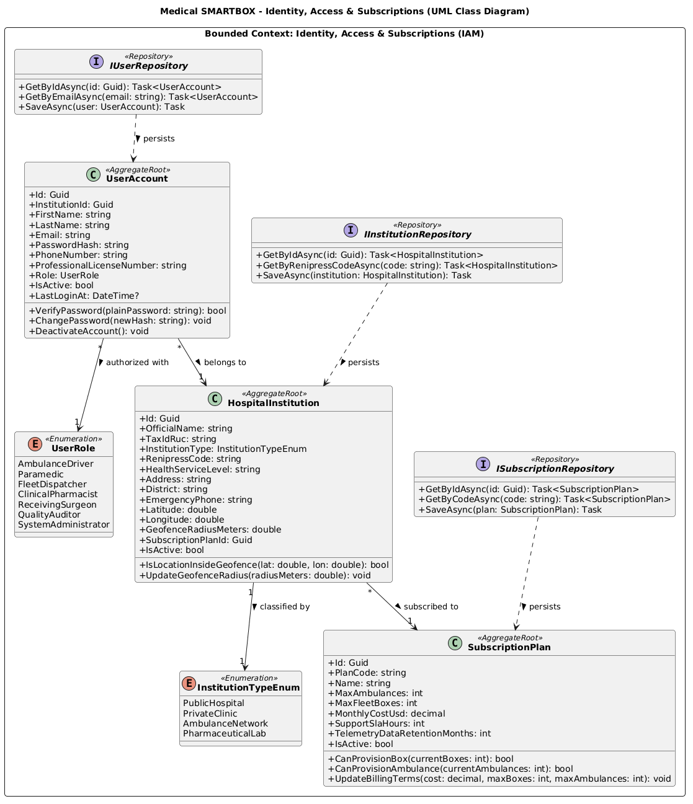

*Nota: Elaboración propia en PlantUML conforme a los estándares de UML 2.5 y Domain-Driven Design para el Bounded Context de IAM y Suscripciones.*

---

#### **4.2. Bounded Context: Smart Container & Telemetry Monitoring**

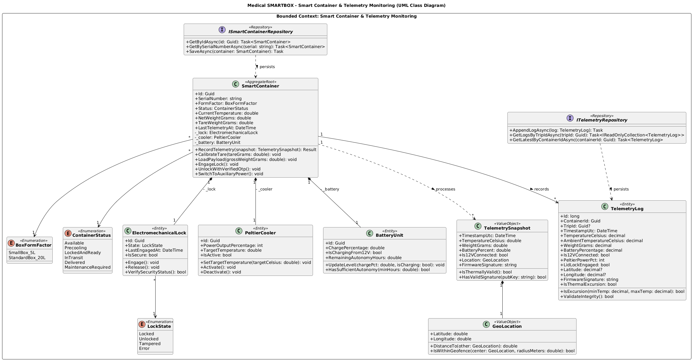

*Nota: Elaboración propia en PlantUML conforme a los estándares de UML 2.5 y Domain-Driven Design para el Bounded Context de Contenedores Inteligentes y Telemetría.*

---

#### **4.3. Bounded Context: Medical Transport Planning & Dispatching**

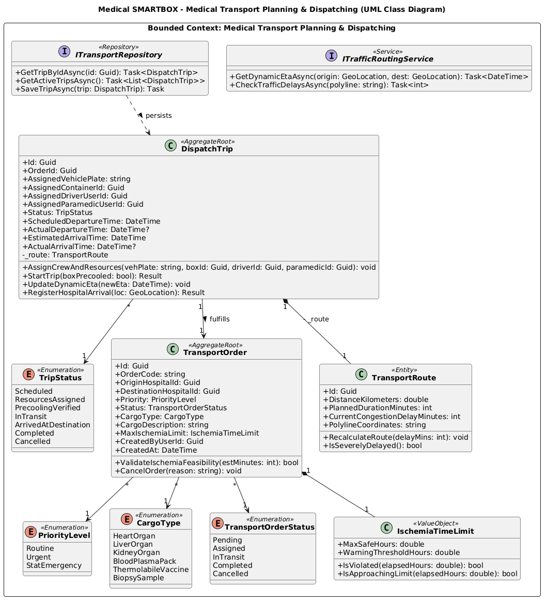

*Nota: Elaboración propia en PlantUML conforme a los estándares de UML 2.5 y Domain-Driven Design para el Bounded Context de Transporte y Despacho.*

---

#### **4.4. Bounded Context: Critical Alerting & Incident Response**

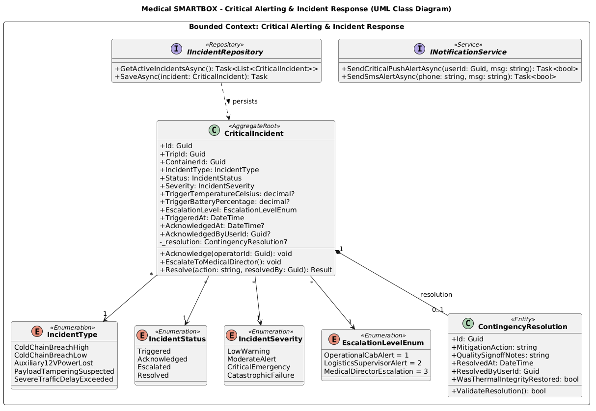

*Nota: Elaboración propia en PlantUML conforme a los estándares de UML 2.5 y Domain-Driven Design para el Bounded Context de Alertas Críticas e Incidentes.*

---

#### **4.5. Bounded Context: Chain of Custody & Traceability**

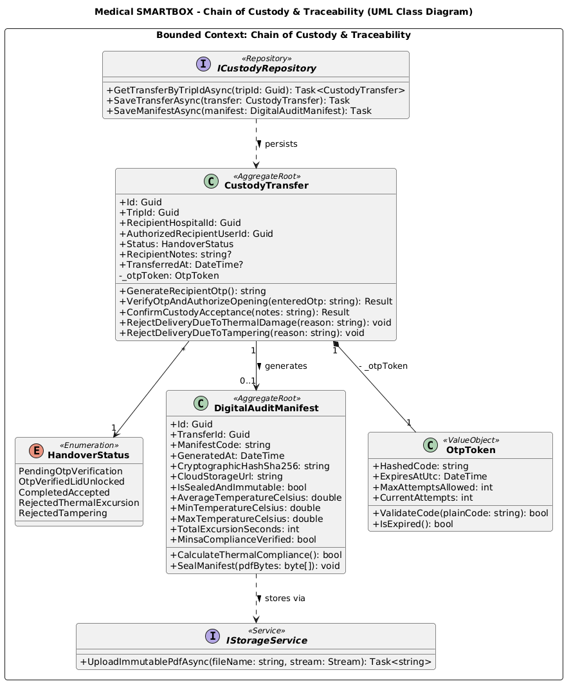

*Nota: Elaboración propia en PlantUML conforme a los estándares de UML 2.5 y Domain-Driven Design para el Bounded Context de Cadena de Custodia y Trazabilidad.*


<div style="page-break-after: always;"></div>

# **4.8. Database Design**

El diseño de la base de datos de **Medical SMARTBOX** establece la arquitectura de persistencia física que da soporte a los procesos transaccionales, telemétricos y de auditoría clínica de la plataforma. A diferencia del Diagrama de Clases de Software (Capítulo 4.7), cuyo foco es la encapsulación del comportamiento y la protección de invariantes en memoria mediante agregados de Domain-Driven Design (DDD), el modelo relacional se especializa en la integridad referencial estricta, la normalización formal, la indexación de alta velocidad para series temporales de IoT y la inmutabilidad jurídica de los registros de custodia requeridos por las entidades regulatorias peruanas (**DIGEMID** y **MINSA**).

La persistencia del sistema está gobernada por un enfoque **Code-First** a través de **Entity Framework Core 10.0 (.NET 10 LTS)** sobre el motor relacional **MySQL Server 8.0 (Enterprise / Community)** utilizando el motor de almacenamiento **InnoDB**. Siguiendo las convenciones oficiales de desarrollo para Microsoft .NET y ASP.NET Core Framework, la configuración de esquemas se desacopla mediante clases `IEntityTypeConfiguration<TEntity>` basadas en **Fluent API**, asegurando que el modelo de dominio permanezca limpio (*Persistence Ignorance*) mientras que la base de datos física explota al máximo las restricciones nativas del motor (`FOREIGN KEY`, `UNIQUE`, `CHECK`, `INDEX`).

### Decisiones Arquitectónicas de Persistencia Relacional:
1. **Motor de Almacenamiento y Conjunto de Caracteres:**  
   Se selecciona exclusivamente **InnoDB** por su soporte nativo de transacciones compatibles con **ACID**, bloqueo a nivel de fila (*row-level locking*) y soporte de claves foráneas con verificación en tiempo de ejecución. La base de datos opera bajo el conjunto de caracteres `utf8mb4` y la colación `utf8mb4_unicode_ci`, garantizando soporte pleno para caracteres especiales clínicos, acentos en español latinoamericano (`es_419`) y firmas criptográficas sin riesgo de truncamiento.
2. **Identificadores Universales Únicos (UUID / GUID):**  
   Para desacoplar la generación de identificadores entre los nodos de borde (ESP32 en ambulancias) y los microservicios sin colisiones ni consultas previas de secuencia, todas las entidades maestras y transaccionales utilizan identificadores únicos universales (`Guid` en C#) persistidos como columnas `CHAR(36)` con formato canónico de guiones (`8-4-4-4-12`). La única excepción son los registros de telemetría sensorial de alta frecuencia (`telemetry_logs`), donde se utiliza un identificador numérico secuencial `BIGINT UNSIGNED AUTO_INCREMENT` como clave primaria física para minimizar la fragmentación de índices B-Tree en inserciones continuas masivas.
3. **Estrategia de Aplanamiento de Value Objects (*Flattening*):**  
   Conforme a los patrones de diseño de arquitectura orientada al dominio formulados por Nick Tune, los *Value Objects* del dominio carecen de identidad propia y representan atributos compuestos inmutables. Para evitar la sobrecarga de uniones relacionales (*JOINs*) en consultas críticas, se aplica la técnica de *Value Object Flattening*:
   * El Value Object `IschemiaTimeLimit` se aplana en las columnas `max_ischemia_hours` e `ischemia_warning_hours` dentro de `transport_orders`.
   * El Value Object `OtpToken` se aplana en las columnas `otp_code_hash`, `otp_expires_at` y `otp_attempt_count` dentro de `custody_transfers`.
   * Las coordenadas geográficas de telemetría se aplanan en `latitude` y `longitude` en `telemetry_logs`.
4. **Marcas Temporales UTC con Precisión de Microsegundos:**  
   Dado que los contenedores inteligentes registran desviaciones térmicas en milisegundos y las ambulancias se desplazan rápidamente por arterias viales, todas las fechas y horas se registran en formato universal coordinado (`DateTime.UtcNow`) utilizando el tipo `DATETIME(6)`. Esto elimina ambigüedades por husos horarios y garantiza orden estricto en el procesamiento reactivo de eventos.
5. **Mapeo de Entidades Internas y Agregados en EF Core 10 (`OwnsOne`):**  
   En el modelo orientado a objetos (Capítulo 4.7), la raíz de agregado `SmartContainer` encapsula entidades subordinadas como `ElectromechanicalLock` (cerrojo de seguridad) y `BatteryUnit` (unidad de alimentación LiFePO4), mientras que la raíz `DispatchTrip` encapsula la entidad de ruta `TransportRoute`. En la base de datos física, para evitar la proliferación de tablas satélite 1 a 1 y maximizar la eficiencia en consultas operativas sin sobrecarga de operaciones `JOIN`, estas entidades se aplanan directamente dentro de las tablas `smart_containers` y `dispatch_trips` mediante la Fluent API de Entity Framework Core 10.0:
   ```csharp
   builder.Entity<SmartContainer>(b =>
   {
       b.ToTable("smart_containers");
       b.HasKey(c => c.Id);

       // Mapeo OwnsOne para cerrojo electromecánico
       b.OwnsOne(c => c.Lock, lockBuilder =>
       {
           lockBuilder.Property(l => l.State)
                      .HasColumnName("lock_state")
                      .HasConversion<string>()
                      .IsRequired();
       });

       // Mapeo OwnsOne para unidad de batería y alimentación 12V
       b.OwnsOne(c => c.Battery, batteryBuilder =>
       {
           batteryBuilder.Property(bt => bt.ChargePercentage)
                         .HasColumnName("battery_percentage")
                         .HasPrecision(5, 2)
                         .IsRequired();
           batteryBuilder.Property(bt => bt.IsChargingFrom12V)
                         .HasColumnName("is_12v_connected")
                         .IsRequired();
       });

       // Entidad en memoria; su telemetría dinámica se persiste en telemetry_logs.peltier_power_pct
       b.Ignore(c => c.Cooler);
   });

   // Mapeo OwnsOne para ruta telemétrica en DispatchTrip
   builder.Entity<DispatchTrip>(b =>
   {
       b.ToTable("dispatch_trips");
       b.HasKey(t => t.Id);

       b.OwnsOne(t => t.Route, routeBuilder =>
       {
           routeBuilder.Property(r => r.DistanceKilometers)
                       .HasColumnName("distance_km")
                       .HasPrecision(6, 2)
                       .IsRequired();
           routeBuilder.Property(r => r.PlannedDurationMinutes)
                       .HasColumnName("planned_duration_minutes")
                       .IsRequired();
           routeBuilder.Property(r => r.CurrentCongestionDelayMinutes)
                       .HasColumnName("current_delay_minutes")
                       .IsRequired();
           routeBuilder.Property(r => r.PolylineCoordinates)
                       .HasColumnName("polyline_coordinates")
                       .HasColumnType("TEXT");
       });
   });
   ```
   Esta configuración garantiza que el modelo de dominio en C# preserve estrictamente el encapsulamiento y comportamiento de objetos internos de la raíz de agregado, mientras que el motor MySQL persiste las columnas de forma atómica y de alto rendimiento.
6. **Conversión de Tipos Numéricos entre Dominio y Persistencia (`double` a `DECIMAL`):**  
   En el modelo de clases de dominio en C# (Capítulo 4.7), las lecturas sensoriales y telemétricas (temperatura, peso neto y coordenadas geográficas) se representan como tipos primitivos `double` para optimizar el rendimiento computacional de cálculos en memoria y procesamiento de flujos IoT. En la persistencia física en MySQL, estos valores se persisten rigurosamente como tipos de coma fija `DECIMAL(p, s)` (`DECIMAL(4,2)` para temperatura, `DECIMAL(6,2)` para peso en gramos y `DECIMAL(10,8)` / `DECIMAL(11,8)` para latitud/longitud). En Entity Framework Core 10.0, esta transición se gobierna explícitamente mediante conversores de valor `HasConversion<double>()` y directivas `HasPrecision(p, s)` en la configuración Fluent API, eliminando discrepancias de precisión entre capas de arquitectura.
7. **Delimitación de Flota Vehicular y Activos Externos (Segmento 1):**  
   En el modelo SaaS, las ambulancias constituyen activos vehiculares de transporte sanitario operados por terceros (Segmento 1) identificados por su número de placa (`assigned_vehicle_plate`) en las órdenes de despacho (`dispatch_trips`). El control de cuotas comerciales de suscripción (`max_ambulances` en `subscription_plans`) se valida a nivel de servicio contra las unidades móviles simultáneamente activas, preservando el foco del software exclusivamente en la gestión del contenedor médico inteligente y evitando la sobreingeniería de tablas maestras vehiculares internas.
8. **Invariantes Térmicas de Firmware y Control de Celda Peltier:**  
   La celda termoeléctrica Peltier opera bajo un punto de consigna (*setpoint*) fijo y normado (+4.0 °C) implementado como invariante de control en el firmware autónomo del ESP32. Su estado no demanda columnas de configuración mutable en la tabla de catálogo `smart_containers`, sino que su modulación dinámica de potencia se audita y persiste históricamente mediante la columna `peltier_power_pct` en la tabla de series temporales de alta frecuencia `telemetry_logs`.
9. **Mapeo Declarativo de Nombres de Columnas en Fluent API:**  
   Para preservar la pureza del modelo de dominio en C# (Capítulo 4.7) conforme al lenguaje ubicuo (*PascalCase*) y garantizar total coherencia con el esquema físico en MySQL 8.0 (*snake_case*), EF Core mapea explícitamente las siguientes propiedades mediante `.HasColumnName(...)`:
   * `SubscriptionPlan.PlanCode` $\longrightarrow$ `code` (tabla `subscription_plans`).
   * `SubscriptionPlan.MaxFleetBoxes` $\longrightarrow$ `max_smartboxes` (tabla `subscription_plans`).
   * `SubscriptionPlan.MonthlyCostUsd` $\longrightarrow$ `monthly_price_usd` (tabla `subscription_plans`).
   * `HospitalInstitution.OfficialName` $\longrightarrow$ `name` (tabla `hospital_institutions`).
   * `UserAccount.ProfessionalLicenseNumber` $\longrightarrow$ `medical_license_number` (tabla `users`).
   * `TransportOrder.Priority` $\longrightarrow$ `clinical_priority` (tabla `transport_orders`).
   * `CustodyTransfer.TransferredAt` $\longrightarrow$ `completed_at` (tabla `custody_transfers`).
   * `DigitalAuditManifest.GeneratedAt` $\longrightarrow$ `sealed_at` (tabla `digital_audit_manifests`).
   * `DigitalAuditManifest.CloudStorageUrl` $\longrightarrow$ `cloud_storage_pdf_url` (tabla `digital_audit_manifests`).

---

### **4.8.1. Database Diagrams**

#### **1. Justificación de Normalización y Desnormalización Controlada**

El modelo de datos relacional de Medical SMARTBOX ha sido diseñado bajo una estricta disciplina de normalización matemática para erradicar redundancias y anomalías de actualización, incorporando desnormalización controlada únicamente en puntos donde la seguridad clínica y el rendimiento de consulta lo justifican plenamente:

* **Primera Forma Normal (1NF):**  
  Todas las columnas contienen exclusivamente valores atómicos e indivisibles. No existen grupos repetitivos ni atributos multivaluados; por ejemplo, las coordenadas poligonales de rutas se representan mediante colecciones ordenadas o columnas específicas de latitud/longitud decimal, y la tripulación de la ambulancia se descompone en roles foráneos atómicos (`assigned_driver_user_id` y `assigned_paramedic_user_id`).
* **Segunda Forma Normal (2NF):**  
  El modelo se encuentra en 1NF y cada atributo no primario posee una dependencia funcional completa de la clave primaria. En ninguna tabla existen dependencias parciales, puesto que todas las tablas maestras emplean identificadores subrogados únicos (`id`), garantizando que cada columna describa íntegramente a dicha entidad.
* **Tercera Forma Normal (3NF):**  
  El modelo se encuentra en 2NF y ningún atributo no clave depende transitivamente de otra columna no clave. Por ejemplo, los datos del hospital de origen y destino (RUC, dirección, acreditación) no se duplican dentro de `transport_orders`, sino que se relacionan mediante claves foráneas normalizadas (`origin_hospital_id`, `destination_hospital_id`) hacia `hospital_institutions`.
* **Desnormalización Controlada Justificada por Criterio Clínico:**  
  En la tabla `digital_audit_manifests` (Contexto de Cadena de Custodia), se almacenan de manera precalculada las métricas `average_temperature_celsius`, `min_temperature_celsius`, `max_temperature_celsius` y `total_excursion_seconds`.  
  *Justificación Técnica y Legal:* Un traslado en ambulancia puede generar miles de lecturas de telemetría en `telemetry_logs`. Si un auditor de calidad de DIGEMID o un cirujano de trasplantes requiere verificar el acta de entrega durante una auditoría o minutos antes de implantar un corazón, calcular agregaciones dinámicas (`AVG`, `MIN`, `MAX`) sobre millones de filas degradaría la base de datos y retardaría la respuesta médica. Además, el acta digital constituye un documento médico-legal sellado criptográficamente con hash SHA-256 (`cryptographic_hash_sha256`); desnormalizar estas métricas en el momento exacto del cierre de custodia garantiza que las cifras auditadas permanezcan inmutables en el tiempo, protegidas de cualquier alteración histórica o depuración de logs sensoriales antiguos.
* **Principio de Custodia Unívoca y Ausencia de Tablas N:M:**  
  A diferencia de aplicaciones comerciales genéricas, el modelo relacional descarta de forma deliberada el uso de tablas intermedias de descomposición muchos a muchos (N:M). Bajo la normativa de DIGEMID (R.M. N° 833-2015/MINSA) y DIGDOT (Directiva Sanitaria N° 152), el transporte asistencial de órganos, hemoderivados y vacunas críticas opera bajo el **Principio de Custodia Unívoca (1 Orden de Traslado $\rightarrow$ 1 Despacho $\rightarrow$ 1 Contenedor Inteligente $\rightarrow$ 1 Custodio Receptor Acreditado)**. Establecer asignaciones múltiples concurrentes (N:M) introduciría vacíos de trazabilidad médico-legal y riesgo inaceptable de contaminación cruzada o confusión de muestras biológicas, por lo que el esquema relacional refuerza estrictamente relaciones 1:1 y 1:N con integridad referencial restrictiva.

---

#### **2. Diccionario de Datos Exhaustivo por Bounded Context**

A continuación se detalla la especificación formal de las 11 tablas del sistema relacional agrupadas por sus Bounded Contexts, cubriendo de forma estricta las necesidades operativas del **Segmento 1 (Ambulancias y Logística)** y el **Segmento 2 (Hospitales y Laboratorios B2B)**:

---

##### **4.8.1.1. Bounded Context: IAM & Subscriptions (Soporte B2B y Acceso)**

Garantiza la autenticación, la asignación de roles médicos y la gestión de planes SaaS para clínicas y flotas de ambulancias.

###### **Tabla 1: `subscription_plans`**
Almacena los niveles de suscripción B2B que determinan la capacidad operativa de ambulancias y contenedores asignados a cada institución cliente.

| Columna | Tipo de Dato MySQL | Nulo | Restricciones / Constraints | Descripción y Regla de Negocio |
|---|---|---|---|---|
| `id` | `CHAR(36)` | **NOT NULL** | `PRIMARY KEY` | Identificador único del plan en formato UUIDv4. |
| `name` | `VARCHAR(50)` | **NOT NULL** | — | Nombre comercial del plan (ej. *Plan Red Hospitalaria Integral*). |
| `code` | `VARCHAR(20)` | **NOT NULL** | `UNIQUE` | Código alfanumérico único para facturación (ej. `HOSP-ENTERPRISE-01`). |
| `max_ambulances` | `INT` | **NOT NULL** | `DEFAULT 5, CHECK (> 0)` | Límite máximo de ambulancias autorizadas para operar en la red. |
| `max_smartboxes` | `INT` | **NOT NULL** | `DEFAULT 10, CHECK (> 0)` | Cupo de contenedores inteligentes IoT asignados a la flota. |
| `monthly_price_usd` | `DECIMAL(10, 2)` | **NOT NULL** | `DEFAULT 0.00, CHECK (>= 0)` | Tarifa mensual en dólares americanos cobrada a la institución. |
| `support_sla_hours` | `INT` | **NOT NULL** | `DEFAULT 24` | Tiempo máximo garantizado de respuesta técnica para incidentes. |
| `telemetry_data_retention_months` | `INT` | **NOT NULL** | `DEFAULT 12, CHECK (> 0)` | Período de retención de telemetría histórica conforme a normativa DIGEMID. |
| `is_active` | `TINYINT(1)` | **NOT NULL** | `DEFAULT 1` | Indicador booleano de vigencia comercial del plan. |
| `created_at` | `DATETIME(6)` | **NOT NULL** | `DEFAULT CURRENT_TIMESTAMP(6)` | Fecha y hora UTC de registro del plan en la plataforma. |

###### **Tabla 2: `hospital_institutions`**
Representa los centros de salud, redes hospitalarias, bancos de órganos y operadores logísticos (Segmento 2).

| Columna | Tipo de Dato MySQL | Nulo | Restricciones / Constraints | Descripción y Regla de Negocio |
|---|---|---|---|---|
| `id` | `CHAR(36)` | **NOT NULL** | `PRIMARY KEY` | Identificador único de la institución de salud en formato UUIDv4. |
| `subscription_plan_id` | `CHAR(36)` | **NOT NULL** | `FOREIGN KEY` -> `subscription_plans(id)` | Plan de suscripción contratado por la entidad hospitalaria. |
| `name` | `VARCHAR(150)` | **NOT NULL** | — | Razón social o denominación del hospital/clínica (ej. *Hospital Rebagliati*). |
| `tax_id_ruc` | `VARCHAR(11)` | **NOT NULL** | `UNIQUE` | Registro Único de Contribuyentes (RUC) fiscal emitido por SUNAT. |
| `institution_type` | `ENUM(...)` | **NOT NULL** | `DEFAULT 'PublicHospital'` | Tipo: `PublicHospital`, `PrivateClinic`, `AmbulanceNetwork`, `PharmaceuticalLab`. |
| `health_service_level` | `VARCHAR(20)` | **NOT NULL** | `DEFAULT 'II-2'` | Nivel o categoría de atención asistencial MINSA (I-4, II-2, III-1, III-E). |
| `address` | `VARCHAR(255)` | **NOT NULL** | — | Dirección física donde operan los puntos de despacho o quirófanos. |
| `district` | `VARCHAR(100)` | **NOT NULL** | — | Distrito de Lima Metropolitana o región sanitaria de ubicación. |
| `emergency_phone` | `VARCHAR(20)` | **NOT NULL** | — | Teléfono de contacto de la central de emergencias hospitalarias. |
| `renipress_code` | `VARCHAR(20)` | **NOT NULL** | `UNIQUE` | Código único nacional del Registro Nacional de IPRESS (SUSALUD / MINSA). |
| `latitude` | `DECIMAL(10, 8)` | **NOT NULL** | `CHECK (BETWEEN -90 AND 90)` | Coordenada geográfica de latitud del helipuerto o rampa de urgencia. |
| `longitude` | `DECIMAL(11, 8)` | **NOT NULL** | `CHECK (BETWEEN -180 AND 180)` | Coordenada geográfica de longitud de la sede hospitalaria. |
| `geofence_radius_meters` | `DECIMAL(6, 2)` | **NOT NULL** | `DEFAULT 2000.00, CHECK (> 0)` | Radio perimétrico virtual (ej. 2 km) que dispara el preaviso y habilita OTP. |
| `is_active` | `TINYINT(1)` | **NOT NULL** | `DEFAULT 1` | Estado de habilitación operativa para programar traslados. |
| `created_at` | `DATETIME(6)` | **NOT NULL** | `DEFAULT CURRENT_TIMESTAMP(6)` | Fecha y hora UTC de alta en el sistema. |
| `updated_at` | `DATETIME(6)` | **NOT NULL** | `DEFAULT CURRENT_TIMESTAMP(6)` | Marca temporal UTC de la última actualización de datos institucionales. |

###### **Tabla 3: `users`**
Gestiona las credenciales y perfiles profesionales autorizados en ambos segmentos.

| Columna | Tipo de Dato MySQL | Nulo | Restricciones / Constraints | Descripción y Regla de Negocio |
|---|---|---|---|---|
| `id` | `CHAR(36)` | **NOT NULL** | `PRIMARY KEY` | Identificador universal del usuario en la plataforma. |
| `institution_id` | `CHAR(36)` | **NOT NULL** | `FOREIGN KEY` -> `hospital_institutions(id)` | Entidad sanitaria a la cual pertenece laboralmente el usuario. |
| `first_name` | `VARCHAR(80)` | **NOT NULL** | — | Nombres del usuario. |
| `last_name` | `VARCHAR(80)` | **NOT NULL** | — | Apellidos completos. |
| `email` | `VARCHAR(120)` | **NOT NULL** | `UNIQUE` | Correo electrónico corporativo utilizado para autenticación JWT. |
| `password_hash` | `VARCHAR(255)` | **NOT NULL** | — | Contraseña protegida mediante algoritmo de hashing irreversible (BCrypt). |
| `role` | `ENUM(...)` | **NOT NULL** | — | Rol: `FleetDispatcher`, `AmbulanceDriver`, `Paramedic`, `ClinicalPharmacist`, `ReceivingSurgeon`, `QualityAuditor`, `SystemAdministrator`. |
| `phone_number` | `VARCHAR(20)` | **NOT NULL** | — | Número móvil para recepción de alertas SMS de contingencia vía Twilio. |
| `medical_license_number` | `VARCHAR(30)` | NULL | — | Matrícula profesional (CMP para cirujanos, TEM para paramédicos). |
| `is_active` | `TINYINT(1)` | **NOT NULL** | `DEFAULT 1` | Indicador de cuenta activa y habilitada para iniciar sesión. |
| `last_login_at` | `DATETIME(6)` | NULL | — | Marca temporal UTC del último inicio de sesión autenticado. |
| `created_at` | `DATETIME(6)` | **NOT NULL** | `DEFAULT CURRENT_TIMESTAMP(6)` | Registro inicial de la cuenta de usuario. |
| `updated_at` | `DATETIME(6)` | **NOT NULL** | `DEFAULT CURRENT_TIMESTAMP(6)` | Timestamp de modificación de credenciales o perfil. |

---

##### **4.8.1.2. Bounded Context: Smart Container & Telemetry Monitoring (Core IoT)**

Modela el contenedor físico inteligente, su estado electromecánico y el flujo continuo de lecturas sensoriales emitidas desde la ambulancia.

###### **Tabla 4: `smart_containers`**
Representa la unidad isotérmica física dotada de sensores, solenoide de tapa y refrigeración activa Peltier.

| Columna | Tipo de Dato MySQL | Nulo | Restricciones / Constraints | Descripción y Regla de Negocio |
|---|---|---|---|---|
| `id` | `CHAR(36)` | **NOT NULL** | `PRIMARY KEY` | Identificador único del contenedor inteligente. |
| `serial_number` | `VARCHAR(30)` | **NOT NULL** | `UNIQUE` | Número de serie impreso en chasis y quemado en firmware (ej. `SMB-BOX-2026-0042`). |
| `form_factor` | `ENUM(...)` | **NOT NULL** | `DEFAULT 'StandardBox_20L'` | Tamaño: `SmallBox_5L` (córneas, biopsias) o `StandardBox_20L` (corazones, riñones). |
| `status` | `ENUM(...)` | **NOT NULL** | `DEFAULT 'Available'` | Estado operativo: `Available`, `Precooling`, `LockedAndReady`, `InTransit`, `Delivered`, `MaintenanceRequired`. |
| `lock_state` | `ENUM(...)` | **NOT NULL** | `DEFAULT 'Unlocked'` | Posición del cerrojo electromecánico: `Locked`, `Unlocked`, `Tampered`, `Error`. |
| `current_temperature_celsius` | `DECIMAL(4, 2)` | **NOT NULL** | `CHECK (-20.00 TO 60.00)` | Última lectura de temperatura interna (°C). Rango seguro: +2.00 a +8.00 °C. |
| `tare_weight_grams` | `DECIMAL(8, 2)` | **NOT NULL** | `DEFAULT 0.00, CHECK (>= 0)` | Peso en vacío calibrado con celda de carga HX711 (tara en gramos). |
| `net_weight_grams` | `DECIMAL(8, 2)` | **NOT NULL** | `DEFAULT 0.00, CHECK (>= 0)` | Peso neto actual del paquete biológico o hemoderivado transportado. |
| `battery_percentage` | `DECIMAL(5, 2)` | **NOT NULL** | `CHECK (0.00 TO 100.00)` | Nivel remanente de la batería LiFePO4 interna del contenedor. |
| `is_12v_connected` | `TINYINT(1)` | **NOT NULL** | `DEFAULT 0` | Flag de alimentación auxiliar desde la toma de 12V vehicular de la ambulancia. |
| `last_telemetry_at` | `DATETIME(6)` | NULL | — | Marca de tiempo del último mensaje MQTT recibido desde el ESP32. |
| `created_at` | `DATETIME(6)` | **NOT NULL** | `DEFAULT CURRENT_TIMESTAMP(6)` | Fecha de fabricación o registro del contenedor en inventario. |
| `updated_at` | `DATETIME(6)` | **NOT NULL** | `DEFAULT CURRENT_TIMESTAMP(6)` | Timestamp de la última sincronización telemétrica o cambio de estado. |

###### **Tabla 5: `telemetry_logs`**
Serie temporal de lecturas sensoriales emitidas en ráfagas cada 5 segundos durante el transporte de emergencia.

| Columna | Tipo de Dato MySQL | Nulo | Restricciones / Constraints | Descripción y Regla de Negocio |
|---|---|---|---|---|
| `id` | `BIGINT UNSIGNED` | **NOT NULL** | `PRIMARY KEY, AUTO_INCREMENT` | Identificador numérico monótono para optimización de inserciones continuas. |
| `container_id` | `CHAR(36)` | **NOT NULL** | `FOREIGN KEY` -> `smart_containers(id)` | Contenedor inteligente emisor de la trama sensorial. |
| `trip_id` | `CHAR(36)` | NULL | `FOREIGN KEY` -> `dispatch_trips(id)` | Viaje de ambulancia activo durante el registro telemétrico. |
| `timestamp_utc` | `DATETIME(6)` | **NOT NULL** | — | Marca temporal UTC provista por el reloj RTC del microcontrolador. |
| `temperature_celsius` | `DECIMAL(4, 2)` | **NOT NULL** | — | Temperatura en la cámara biológica medida por el sensor Dallas DS18B20. |
| `ambient_temperature_celsius` | `DECIMAL(4, 2)` | **NOT NULL** | — | Temperatura ambiente dentro de la cabina de la ambulancia. |
| `weight_grams` | `DECIMAL(8, 2)` | **NOT NULL** | — | Peso bruto medido por la celda HX711 (detecta aperturas o sustracciones). |
| `battery_percentage` | `DECIMAL(5, 2)` | **NOT NULL** | `CHECK (0.00 TO 100.00)` | Carga porcentual de la batería interna en el instante de la muestra. |
| `is_12v_connected` | `TINYINT(1)` | **NOT NULL** | `DEFAULT 0` | Estado del circuito de alimentación de 12V de la ambulancia. |
| `peltier_power_pct` | `INT` | **NOT NULL** | `CHECK (0 TO 100)` | Potencia PWM aplicada a las celdas Peltier de enfriamiento. |
| `lid_lock_engaged` | `TINYINT(1)` | **NOT NULL** | `DEFAULT 1` | Verificación de contacto magnético de tapa (1: sellado, 0: abierto). |
| `latitude` | `DECIMAL(10, 8)` | NULL | — | Coordenada GPS latitudinal transmitida por el módem SIM7600G. |
| `longitude` | `DECIMAL(11, 8)` | NULL | — | Coordenada GPS longitudinal del vehículo en ruta. |
| `firmware_signature` | `VARCHAR(128)` | **NOT NULL** | — | Hash de validación criptográfica de la trama generada por el ESP32. |
| `is_thermal_excursion` | `TINYINT(1)` | **NOT NULL** | `DEFAULT 0` | Flag de desvío: marcado con 1 si la temperatura sale de +2.0°C a +8.0°C. |

---

##### **4.8.1.3. Bounded Context: Medical Transport Planning & Dispatching (Core Operativo)**

Articula las órdenes de traslado clínico y su asignación a los recursos móviles (ambulancia, chofer y paramédico).

###### **Tabla 6: `transport_orders`**
Solicitudes clínicas de transporte emitidas por cirujanos o químicos farmacéuticos (Segmento 2).

| Columna | Tipo de Dato MySQL | Nulo | Restricciones / Constraints | Descripción y Regla de Negocio |
|---|---|---|---|---|
| `id` | `CHAR(36)` | **NOT NULL** | `PRIMARY KEY` | Identificador universal de la orden clínica. |
| `order_code` | `VARCHAR(20)` | **NOT NULL** | `UNIQUE` | Código legible de seguimiento clínico (ej. `ORD-2026-TRP-001`). |
| `origin_hospital_id` | `CHAR(36)` | **NOT NULL** | `FOREIGN KEY` -> `hospital_institutions(id)` | Centro hospitalario emisor de la carga médica (donante/banco). |
| `destination_hospital_id` | `CHAR(36)` | **NOT NULL** | `FOREIGN KEY` -> `hospital_institutions(id)` | Centro hospitalario receptor (sala de operaciones de trasplante). |
| `cargo_type` | `ENUM(...)` | **NOT NULL** | — | Carga: `HeartOrgan`, `LiverOrgan`, `KidneyOrgan`, `BloodPlasmaPack`, `ThermolabileVaccine`, `BiopsySample`. |
| `cargo_description` | `VARCHAR(255)` | **NOT NULL** | — | Especificación clínica detallada (ej. *Corazón en solución Custodiol*). |
| `max_ischemia_hours` | `DECIMAL(4, 2)` | **NOT NULL** | `CHECK (> 0)` | Límite máximo de isquemia fría tolerable según Directiva 152/MINSA. |
| `ischemia_warning_hours` | `DECIMAL(4, 2)` | **NOT NULL** | `CHECK (> 0)` | Umbral preventivo para disparo de alertas de tráfico severo. |
| `clinical_priority` | `ENUM(...)` | **NOT NULL** | `DEFAULT 'StatEmergency'` | Prioridad médica de despacho: `Routine`, `Urgent`, `StatEmergency`. |
| `status` | `ENUM(...)` | **NOT NULL** | `DEFAULT 'Pending'` | Ciclo de vida: `Pending`, `Assigned`, `InTransit`, `Completed`, `Cancelled`. |
| `created_by_user_id` | `CHAR(36)` | **NOT NULL** | `FOREIGN KEY` -> `users(id)` | Cirujano de trasplante o coordinador médico emisor. |
| `created_at` | `DATETIME(6)` | **NOT NULL** | `DEFAULT CURRENT_TIMESTAMP(6)` | Timestamp de emisión de la orden de traslado. |
| `updated_at` | `DATETIME(6)` | **NOT NULL** | `DEFAULT CURRENT_TIMESTAMP(6)` | Marca temporal de última modificación o reasignación. |

###### **Tabla 7: `dispatch_trips`**
Ejecución del traslado por la ambulancia, tripulación y contenedor asignados (Segmento 1).

| Columna | Tipo de Dato MySQL | Nulo | Restricciones / Constraints | Descripción y Regla de Negocio |
|---|---|---|---|---|
| `id` | `CHAR(36)` | **NOT NULL** | `PRIMARY KEY` | Identificador único del viaje de despacho. |
| `order_id` | `CHAR(36)` | **NOT NULL** | `UNIQUE, FOREIGN KEY` -> `transport_orders(id)` | Orden de transporte vinculada (relación 1 a 1 estricta). |
| `assigned_container_id` | `CHAR(36)` | **NOT NULL** | `FOREIGN KEY` -> `smart_containers(id)` | Contenedor físico precriado asignado para el traslado. |
| `assigned_driver_user_id` | `CHAR(36)` | **NOT NULL** | `FOREIGN KEY` -> `users(id)` | Chofer de ambulancia responsable del desplazamiento. |
| `assigned_paramedic_user_id` | `CHAR(36)` | **NOT NULL** | `FOREIGN KEY` -> `users(id)` | Paramédico TEM a bordo encargado de la custodia del contenedor. |
| `assigned_vehicle_plate` | `VARCHAR(10)` | **NOT NULL** | — | Placa oficial de rodaje de la ambulancia asignada (ej. `EUG-418`). |
| `status` | `ENUM(...)` | **NOT NULL** | `DEFAULT 'Scheduled'` | Estado: `Scheduled`, `ResourcesAssigned`, `PrecoolingVerified`, `InTransit`, `ArrivedAtDestination`, `Completed`, `Cancelled`. |
| `scheduled_departure_time` | `DATETIME(6)` | **NOT NULL** | — | Hora programada de salida del hospital de origen. |
| `actual_departure_time` | `DATETIME(6)` | NULL | — | Hora real de partida una vez validado el pre-enfriamiento a 4.0 °C. |
| `estimated_arrival_time` | `DATETIME(6)` | **NOT NULL** | — | ETA inicial recalculado dinámicamente según TomTom Traffic API. |
| `actual_arrival_time` | `DATETIME(6)` | NULL | — | Hora exacta de arribo físico a la puerta de emergencia hospitalaria. |
| `distance_km` | `DECIMAL(6, 2)` | **NOT NULL** | `DEFAULT 0.00` | Distancia total recorrida por la ambulancia en kilómetros. |
| `planned_duration_minutes` | `INT` | **NOT NULL** | `DEFAULT 0` | Duración prevista calculada en el ruteo inicial. |
| `current_delay_minutes` | `INT` | **NOT NULL** | `DEFAULT 0` | Retraso acumulado inducido por congestión vehicular en Lima. |
| `polyline_coordinates` | `TEXT` | NULL | — | Cadena codificada de la ruta geográfica recorrida. |
| `created_at` | `DATETIME(6)` | **NOT NULL** | `DEFAULT CURRENT_TIMESTAMP(6)` | Momento de creación de la hoja de despacho. |
| `updated_at` | `DATETIME(6)` | **NOT NULL** | `DEFAULT CURRENT_TIMESTAMP(6)` | Timestamp de la última actualización telemétrica o de ETA. |

---

##### **4.8.1.4. Bounded Context: Critical Alerting & Incident Response (Soporte Reactivo)**

Registra y escala contingencias en ruta ante desvíos térmicos o fallas eléctricas de la ambulancia.

###### **Tabla 8: `critical_incidents`**
Incidencias generadas automáticamente ante violaciones térmicas o manipulaciones indebidas.

| Columna | Tipo de Dato MySQL | Nulo | Restricciones / Constraints | Descripción y Regla de Negocio |
|---|---|---|---|---|
| `id` | `CHAR(36)` | **NOT NULL** | `PRIMARY KEY` | Identificador universal del incidente crítico. |
| `trip_id` | `CHAR(36)` | **NOT NULL** | `FOREIGN KEY` -> `dispatch_trips(id)` | Viaje de ambulancia en el cual ocurrió la anomalía. |
| `container_id` | `CHAR(36)` | **NOT NULL** | `FOREIGN KEY` -> `smart_containers(id)` | Contenedor que experimentó el desvío sensorial. |
| `severity` | `ENUM(...)` | **NOT NULL** | `DEFAULT 'CriticalEmergency'` | Nivel: `LowWarning`, `ModerateAlert`, `CriticalEmergency`, `CatastrophicFailure`. |
| `incident_type` | `ENUM(...)` | **NOT NULL** | — | Tipo: `ColdChainBreachHigh`, `ColdChainBreachLow`, `Auxiliary12VPowerLost`, `PayloadTamperingSuspected`, `SevereTrafficDelayExceeded`. |
| `triggered_at` | `DATETIME(6)` | **NOT NULL** | — | Momento UTC exacto en que se detectó la violación del umbral. |
| `trigger_temperature_celsius` | `DECIMAL(4, 2)` | NULL | — | Temperatura registrada al momento de la alarma (opcional si el incidente es por tráfico o manipulación). |
| `trigger_battery_percentage` | `DECIMAL(5, 2)` | NULL | — | Nivel de batería al momento del incidente (opcional en contingencias no eléctricas). |
| `status` | `ENUM(...)` | **NOT NULL** | `DEFAULT 'Triggered'` | Estado: `Triggered`, `Acknowledged`, `Escalated`, `Resolved`. |
| `escalation_level` | `INT` | **NOT NULL** | `DEFAULT 1, CHECK (1 TO 3)` | Nivel de escalamiento (1: Operador, 2: Paramédico, 3: Director Médico). |
| `acknowledged_at` | `DATETIME(6)` | NULL | — | Timestamp en que el operador de flota confirmó la alerta. |
| `acknowledged_by_user_id` | `CHAR(36)` | NULL | `FOREIGN KEY` -> `users(id)` | Operador que tomó control del incidente. |
| `created_at` | `DATETIME(6)` | **NOT NULL** | `DEFAULT CURRENT_TIMESTAMP(6)` | Fecha de persistencia del incidente. |

###### **Tabla 9: `contingency_resolutions`**
Medidas correctivas aplicadas y validadas para mitigar el incidente y proteger el tejido clínico.

| Columna | Tipo de Dato MySQL | Nulo | Restricciones / Constraints | Descripción y Regla de Negocio |
|---|---|---|---|---|
| `id` | `CHAR(36)` | **NOT NULL** | `PRIMARY KEY` | Identificador único de la resolución de contingencia. |
| `incident_id` | `CHAR(36)` | **NOT NULL** | `UNIQUE, FOREIGN KEY` -> `critical_incidents(id)` | Incidente mitigado (relación 1 a 1 estricta). |
| `mitigation_action` | `VARCHAR(500)` | **NOT NULL** | — | Acción operativa (ej. *Reconexión de arnés 12V vehicular y refuerzo criogénico*). |
| `was_thermal_integrity_restored` | `TINYINT(1)` | **NOT NULL** | `DEFAULT 1` | Certificación de retorno a la franja de +2.0 °C a +8.0 °C. |
| `quality_signoff_notes` | `TEXT` | **NOT NULL** | — | Dictamen técnico obligatorio firmado por el especialista biomédico. |
| `resolved_by_user_id` | `CHAR(36)` | **NOT NULL** | `FOREIGN KEY` -> `users(id)` | Profesional biomédico o médico de guardia responsable. |
| `resolved_at` | `DATETIME(6)` | **NOT NULL** | — | Marca temporal del cierre satisfactorio de la contingencia. |

---

##### **4.8.1.5. Bounded Context: Chain of Custody & Traceability (Core Regulatorio)**

Garantiza la inmutabilidad de la custodia médica mediante autenticación OTP y actas digitales para MINSA/DIGEMID.

###### **Tabla 10: `custody_transfers`**
Protocolo de entrega hospitalaria con autenticación de apertura mediante código OTP de un solo uso.

| Columna | Tipo de Dato MySQL | Nulo | Restricciones / Constraints | Descripción y Regla de Negocio |
|---|---|---|---|---|
| `id` | `CHAR(36)` | **NOT NULL** | `PRIMARY KEY` | Identificador universal de la transferencia de custodia. |
| `trip_id` | `CHAR(36)` | **NOT NULL** | `UNIQUE, FOREIGN KEY` -> `dispatch_trips(id)` | Viaje de ambulancia culminado (relación 1 a 1 estricta). |
| `recipient_hospital_id` | `CHAR(36)` | **NOT NULL** | `FOREIGN KEY` -> `hospital_institutions(id)` | Hospital de destino donde se realiza la entrega física. |
| `authorized_recipient_user_id` | `CHAR(36)` | **NOT NULL** | `FOREIGN KEY` -> `users(id)` | Cirujano o farmacéutico facultado para recibir el contenedor. |
| `handover_status` | `ENUM(...)` | **NOT NULL** | `DEFAULT 'PendingOtpVerification'` | Estado: `PendingOtpVerification`, `OtpVerifiedLidUnlocked`, `CompletedAccepted`, `RejectedThermalExcursion`, `RejectedTampering`. |
| `otp_code_hash` | `VARCHAR(128)` | **NOT NULL** | — | Hash HMAC-SHA256 del token OTP efímero de 6 dígitos generado por el sistema. |
| `otp_expires_at` | `DATETIME(6)` | **NOT NULL** | — | Límite temporal de vigencia del token (15 minutos tras el arribo). |
| `otp_attempt_count` | `INT` | **NOT NULL** | `DEFAULT 0, CHECK (0 TO 3)` | Contador de intentos de digitación (bloqueo automático al 3er fallo). |
| `otp_verified_at` | `DATETIME(6)` | NULL | — | Marca temporal exacta de la validación y liberación del solenoide. |
| `recipient_notes` | `VARCHAR(500)` | NULL | — | Observaciones clínicas del receptor en la mesa quirúrgica. |
| `created_at` | `DATETIME(6)` | **NOT NULL** | `DEFAULT CURRENT_TIMESTAMP(6)` | Momento de generación del token OTP al llegar la ambulancia. |
| `completed_at` | `DATETIME(6)` | NULL | — | Timestamp de aceptación y firma final de la custodia. |

###### **Tabla 11: `digital_audit_manifests`**
Acta digital de entrega legal sellada criptográficamente con hash SHA-256 para auditorías de DIGEMID (R.M. 833-2015).

| Columna | Tipo de Dato MySQL | Nulo | Restricciones / Constraints | Descripción y Regla de Negocio |
|---|---|---|---|---|
| `id` | `CHAR(36)` | **NOT NULL** | `PRIMARY KEY` | Identificador único del acta digital. |
| `transfer_id` | `CHAR(36)` | **NOT NULL** | `UNIQUE, FOREIGN KEY` -> `custody_transfers(id)` | Transferencia de custodia certificada (relación 1 a 1 estricta). |
| `manifest_code` | `VARCHAR(30)` | **NOT NULL** | `UNIQUE` | Código oficial del manifiesto clínico (ej. `MAN-2026-MINSA-0089`). |
| `cryptographic_hash_sha256` | `CHAR(64)` | **NOT NULL** | — | Hash SHA-256 del PDF y de la serie completa de telemetría del viaje. |
| `cloud_storage_pdf_url` | `VARCHAR(500)` | **NOT NULL** | — | Enlace inmutable hacia el repositorio S3 / Azure Blob Storage cifrado. |
| `is_sealed_and_immutable` | `TINYINT(1)` | **NOT NULL** | `DEFAULT 1` | Bandera de inmutabilidad jurídica; impide modificaciones o reaperturas. |
| `average_temperature_celsius` | `DECIMAL(4, 2)` | **NOT NULL** | — | Temperatura promedio consolidada durante todo el traslado (°C). |
| `min_temperature_celsius` | `DECIMAL(4, 2)` | **NOT NULL** | — | Temperatura mínima registrada en la cámara durante el viaje. |
| `max_temperature_celsius` | `DECIMAL(4, 2)` | **NOT NULL** | — | Temperatura máxima alcanzada en el contenedor. |
| `total_excursion_seconds` | `INT` | **NOT NULL** | `DEFAULT 0, CHECK (>= 0)` | Tiempo acumulado en segundos fuera del rango regulatorio (+2°C a +8°C). |
| `minsa_compliance_verified` | `TINYINT(1)` | **NOT NULL** | `DEFAULT 1` | Certificación booleana de cumplimiento de la Directiva Sanitaria 152/MINSA. |
| `sealed_at` | `DATETIME(6)` | **NOT NULL** | — | Fecha y hora UTC del sellado criptográfico del acta. |

---

#### **3. Matriz de Integridad Referencial y Cardinalidad**

La siguiente matriz documenta las **20 relaciones de clave foránea** implementadas en la base de datos, detallando la cardinalidad, las restricciones de clave foránea y las acciones ante eliminación (`ON DELETE`):

| Tabla Primaria (Padre) | Tabla Dependiente (Hija) | Cardinalidad | Columna Clave Foránea (FK) | Regla `ON DELETE` | Justificación Operativa y Regulatoria |
|---|---|---|---|---|---|
| `subscription_plans` | `hospital_institutions` | **1 : N** | `subscription_plan_id` | `RESTRICT` | Impide descontinuar o eliminar planes comerciales que posean hospitales asociados activos. |
| `hospital_institutions` | `users` | **1 : N** | `institution_id` | `RESTRICT` | Protege la filiación institucional de la tripulación y personal médico. |
| `hospital_institutions` | `transport_orders` (Origen) | **1 : N** | `origin_hospital_id` | `RESTRICT` | Preserva el hospital emisor como parte inmutable de la orden de traslado clínico. |
| `hospital_institutions` | `transport_orders` (Destino) | **1 : N** | `destination_hospital_id` | `RESTRICT` | Garantiza que el destino del trasplante no sea eliminado de la base de datos histórica. |
| `hospital_institutions` | `custody_transfers` | **1 : N** | `recipient_hospital_id` | `RESTRICT` | Mantiene la validez legal del hospital receptor del órgano según directiva MINSA. |
| `users` | `transport_orders` | **1 : N** | `created_by_user_id` | `RESTRICT` | Mantiene la autoría médica del cirujano solicitante para efectos médico-legales. |
| `users` | `dispatch_trips` (Chofer) | **1 : N** | `assigned_driver_user_id` | `RESTRICT` | Salvaguarda la identidad del chofer asignado a la ambulancia en la hoja de ruta. |
| `users` | `dispatch_trips` (Paramédico) | **1 : N** | `assigned_paramedic_user_id` | `RESTRICT` | Registra de forma indeleble al paramédico TEM que custodió el contenedor en tránsito. |
| `users` | `critical_incidents` | **1 : N** | `acknowledged_by_user_id` | `RESTRICT` | Documenta fehacientemente qué operador de despacho atendió y acusó la alerta crítica. |
| `users` | `contingency_resolutions` | **1 : N** | `resolved_by_user_id` | `RESTRICT` | Fija la responsabilidad del profesional biomédico que dictaminó la resolución correctiva. |
| `users` | `custody_transfers` | **1 : N** | `authorized_recipient_user_id` | `RESTRICT` | Identifica con precisión al médico receptor que digitó el código OTP en quirófano. |
| `smart_containers` | `telemetry_logs` | **1 : N** | `container_id` | `RESTRICT` | Protege la integridad de las series temporales físicas emitidas por el hardware IoT. |
| `smart_containers` | `dispatch_trips` | **1 : N** | `assigned_container_id` | `RESTRICT` | Evita la desvinculación o supresión de un contenedor involucrado en un traslado en curso. |
| `smart_containers` | `critical_incidents` | **1 : N** | `container_id` | `RESTRICT` | Asegura la trazabilidad técnica histórica del contenedor que experimentó anomalías térmicas. |
| `transport_orders` | `dispatch_trips` | **1 : 1** | `order_id` | `RESTRICT` | Cada orden clínica tiene exactamente una hoja de despacho operativa para su cumplimiento. |
| `dispatch_trips` | `telemetry_logs` | **1 : N** | `trip_id` | `SET NULL` | Si un despacho preliminar es cancelado antes de partir, las muestras se conservan vinculadas al contenedor pero desacopladas del viaje. |
| `dispatch_trips` | `critical_incidents` | **1 : N** | `trip_id` | `RESTRICT` | Impide borrar un viaje de ambulancia que haya tenido incidentes críticos en ruta. |
| `dispatch_trips` | `custody_transfers` | **1 : 1** | `trip_id` | `RESTRICT` | Cada viaje completado concluye obligatoriamente en un único proceso formal de entrega. |
| `critical_incidents` | `contingency_resolutions` | **1 : 1** | `incident_id` | `RESTRICT` | Un incidente crítico solo puede tener un dictamen oficial de mitigación de contingencia. |
| `custody_transfers` | `digital_audit_manifests` | **1 : 1** | `transfer_id` | `RESTRICT` | La transferencia exitosa produce exactamente un acta digital sellada inmutable para DIGEMID. |

---

#### **4. Estrategia de Indexación y Optimización de Consultas IoT**

Para procesar ráfagas continuas de telemetría provenientes de múltiples ambulancias sin degradar los tiempos de respuesta del dashboard web en Vue.js ni la transmisión en tiempo real de WebSockets vía SignalR, se implementa una estrategia de **índices B-Tree compuestos**:

1. **`idx_telemetry_container_timestamp (container_id, timestamp_utc DESC)`:**  
   *Propósito:* Optimiza la consulta más frecuente del sistema: obtener la última lectura emitida por un contenedor específico para renderizar el termómetro digital, indicador de peso y estado de batería en el frontend. Al estar ordenado descendentemente, el motor MySQL resuelve la consulta en tiempo $O(1)$ sin realizar un escaneo completo de tabla (*Full Table Scan*).
2. **`idx_telemetry_trip_timestamp (trip_id, timestamp_utc ASC)`:**  
   *Propósito:* Permite recuperar la curva térmica completa y las coordenadas del recorrido de una ambulancia para trazar el gráfico histórico de temperatura en el visor de auditoría clínica.
3. **`idx_dispatch_trips_status_departure (status, scheduled_departure_time)`:**  
   *Propósito:* Alimenta la vista en tiempo real del operador de despacho de flota (Segmento 1), filtrando instantáneamente todos los viajes con estado `InTransit` o `Scheduled` para calcular demoras por tráfico con TomTom API.
4. **`idx_critical_incidents_status_severity (status, severity)`:**  
   *Propósito:* Prioriza las alertas no resueltas (`Open`) de mayor severidad (`CriticalEmergency`, `CatastrophicFailure`) para despachar notificaciones inmediatas mediante push y SMS a la central médica.

---

#### **5. Diagrama Físico de Base de Datos (Entity Relationship Diagram)**

  
*Nota: Diagrama Relacional Físico de Base de Datos generado mediante Reverse Engineering en MySQL Workbench 8.0 bajo motor InnoDB.*

---

#### **6. Conclusiones y Transición hacia el Capítulo V (Implementación y Validación)**

El diseño relacional presentado en esta sección concluye la fase arquitectónica del **Capítulo IV**, consolidando una base de datos que:
1. **Garantiza la Integridad Clínica y Legal:** El uso de restricciones `RESTRICT` en claves foráneas, sellos SHA-256 e inmutabilidad de actas previene la eliminación o alteración de evidencia requerida por DIGEMID y SUSALUD.
2. **Satisface las Necesidades de Ambos Segmentos:** Modela fielmente las variables dinámicas de las ambulancias en ruta (Segmento 1) y los requisitos de recepción estéril y tiempos de isquemia de los cirujanos y farmacéuticos (Segmento 2).
3. **Prepara el Terreno para el Capítulo V:** Con el esquema relacional formalizado y la estructura física de base de datos validada, el equipo técnico queda habilitado para proceder en el **Capítulo V (Product Implementation, Validation & Deployment)** con la configuración del entorno de desarrollo (.NET 10 SDK [net10.0], MySQL 8.0, Vue 3, GitFlow) y la ejecución de los Sprints de desarrollo con Entity Framework Core Code-First Migrations.


<div style="page-break-after: always;"></div>

# Capítulo V: Product Implementation, Validation & Deployment

# 5.1. Software Configuration Management

En esta sección se detallan la configuración del entorno de desarrollo, la estrategia de gestión del código fuente, las convenciones de estilo adoptadas por el equipo de desarrollo de **NeonCode** y la infraestructura empleada para el despliegue del sistema de supervisión de contenedores médicos inteligentes.

---

### 5.1.1. Software Development Environment Configuration

Para garantizar un flujo de trabajo uniforme y minimizar discrepancias entre las estaciones de trabajo de los miembros del equipo, se ha estandarizado la configuración del entorno de desarrollo:

* **Entornos de Desarrollo Integrados (IDE):**
    * **JetBrains WebStorm:** Entorno principal utilizado para el desarrollo, maquetación y pruebas del sitio web corporativo (Landing Page) y la aplicación web administrativa frontend. Se han configurado complementos como *GitFlowHelper*, *Prettier* y *ESLint*.
    * **Visual Studio Code / IntelliJ IDEA:** Utilizados para el desarrollo y depuración de los microservicios backend de la API RESTful.
* **Entorno de Ejecución (Runtime) y Lenguajes:**
    * **Node.js (v20.x LTS):** Entorno de ejecución JavaScript del lado del servidor para los servicios web de la API.
    * **TypeScript (v5.x):** Lenguaje tipado adoptado en el frontend para garantizar el control de tipos en la manipulación de estados y datos de telemetría.
    * **HTML5, CSS3 y TailwindCSS:** Estándares empleados para el diseño responsive y accesible de las aplicaciones web.
* **Gestor de Paquetes y Depósitos de Software:**
    * **npm (v10.x):** Gestor de paquetes utilizado para la administración, auditoría de seguridad e instalación de las bibliotecas del proyecto.

---

### 5.1.2. Source Code Management

La gestión del código fuente de **NeonCode** se realiza a través de **Git** como sistema de control de versiones distribuido, centralizado en la organización de **GitHub** (`NeonCode-UPC/report`).

#### Estrategia de Ramificación (GitFlow)

El equipo aplica la estrategia **GitFlow** para mantener un desarrollo aislado, seguro y estructurado:

* **`main`:** Rama de producción que almacena exclusivamente código estable, verificado y listo para el despliegue final.
* **`develop`:** Rama de integración continua donde se consolidan todas las funcionalidades completadas durante el desarrollo de los sprints.
* **`feature/<nombre-funcionalidad>`:** Ramas de trabajo temporal creadas a partir de `develop` para la construcción de historias de usuario o secciones específicas (ejemplo: `feature/us01-registro-institucion` o `feature/capitulo-1`).
* **`release/<version>`:** Ramas de preparación creadas antes de un despliegue importante para pruebas finales de integración.
* **`hotfix/<nombre-incidencia>`:** Ramas de emergencia creadas directamente desde `main` para solventar errores críticos en el entorno de producción.

#### Flujo de Comandos GitFlow

```bash
# Iniciar una rama de funcionalidad desde develop
git flow feature start us01-registro-institucion

# Publicar la rama en el repositorio remoto de GitHub
git flow feature publish us01-registro-institucion

# Finalizar la funcionalidad e integrar los cambios en develop
git flow feature finish us01-registro-institucion
```
## 5.1.3. Source Code Style Guide & Conventions

Para mantener la calidad, legibilidad y mantenibilidad del código fuente en el repositorio de **NeonCode**, el equipo de desarrollo sigue guías de estilo estandarizadas y convenciones de control de versiones.

### Guía de Estilo de Código Fuente

* **Estándar de Formato:** Se utiliza **Prettier** y **ESLint** para el análisis estático de código y formateo automático en la aplicación web frontend (React con TypeScript) y los servicios de la API RESTful.
* **Convenciones de Nomenclatura:**
    * **Variables y Funciones:** Se utiliza `camelCase` (ejemplo: `containerTemperature`, `calculateEstimatedArrival`).
    * **Componentes y Clases:** Se utiliza `PascalCase` (ejemplo: `TelemetryDashboard`, `ContainerService`).
    * **Archivos y Directorios:** Se utiliza `kebab-case` para nombres de archivos y carpetas (ejemplo: `container-monitoring.component.tsx`, `3.1-user-stories.md`).
    * **Constantes Globales:** Se utiliza `UPPER_SNAKE_CASE` (ejemplo: `MAX_CRITICAL_TEMPERATURE`, `DEFAULT_TIMEOUT`).
* **Terminología Normada (Anexo E):** Queda estrictamente prohibido el uso de *spanglish* o términos no reconocidos académicamente. Se debe emplear de manera exclusiva:
    * **Requisito** en lugar de "requerimiento".
    * **Biblioteca** en lugar de "librería".
    * **Aplicación** en lugar de "app".

### Convención de Mensajes de Confirmación (Conventional Commits)

Todas las confirmaciones de cambios (commits) realizadas en el repositorio de GitHub deben cumplir obligatoriamente con el estándar **Conventional Commits**:

**Estructura del Mensaje:**
`<tipo>(<alcance>): <descripción corta en tiempo presente>`

* **`feat`:** Incorporación de una nueva funcionalidad (ejemplo: `feat(auth): add JWT sign-in endpoint`).
* **`fix`:** Corrección de un fallo o error en el código (ejemplo: `fix(telemetry): correct temperature parser logic`).
* **`docs`:** Cambios o adiciones exclusivamente en archivos de documentación Markdown (ejemplo: `docs(ch5): add code conventions and deployment configuration`).
* **`style`:** Ajustes de formato, espacios o estilos CSS que no alteran la lógica de negocio (ejemplo: `style(landing): fix container card padding`).
* **`refactor`:** Reestructuración interna del código que no añade funcionalidades ni corrige errores (ejemplo: `refactor(api): optimize database connection pooling`).
* **`test`:** Adición o actualización de pruebas unitarias o de integración (ejemplo: `test(auth): add unit test for sign-in service`).

---

## 5.1.4. Software Deployment Configuration

El proceso de despliegue del sistema de supervisión de contenedores médicos inteligentes de **NeonCode** se organiza en tres entornos aislados para garantizar la estabilidad operativa de la plataforma.

### Entornos de Despliegue

| Entorno | Propósito | Plataforma / Hosting | Rama Git Asociada | Configuración y Acceso |
| :--- | :--- | :--- | :--- | :--- |
| **Local (Development)** | Entorno de desarrollo individual para codificación, depuración y pruebas unitarias. | Servidor local Vite / Node.js (`localhost:5173` / `localhost:3000`) | Rama de trabajo (`feature/*`) | Acceso exclusivo del equipo de desarrollo. |
| **Staging (Testing)** | Entorno de integración continua para pruebas de calidad (QA) y validación de entregables de sprint. | Vercel (Frontend) / Render (API RESTful Backend) | `develop` | Despliegue automático ante cada *pull request* integrado. |
| **Production (Live)** | Entorno final de alta disponibilidad donde opera la solución para supervisores hospitalarios y personal médico. | Vercel Production / AWS App Runner | `main` | Despliegue automatizado mediante pipelines de CI/CD tras la consolidación de entregas (*releases*). |

### Gestión de Variables de Entorno y Configuración

* **Archivos `.env`:** Todas las claves de API, cadenas de conexión a base de datos y tokens de autenticación se gestionan mediante variables de entorno en archivos `.env.local` y no se suben al repositorio.
* **Secretos en Plataforma:** Las claves de producción se configuran directamente en el panel de administración de Vercel y Render, garantizando la seguridad de la cadena de custodia de datos.

<div style="page-break-after: always;"></div>

# 5.2. Landing Page & Services Implementations

## 5.2.1. Sprint 1

En este apartado se detalla la planificación, asignación de responsabilidades y desglose de tareas técnicas para la ejecución del primer ciclo de desarrollo (Sprint 1) del ecosistema **NeonCode**, así como las evidencias correspondientes a su implementación, ejecución de vistas, documentación de servicios, despliegue de la solución y colaboración del equipo mediante el control de versiones.

---

### 5.2.1.1. Sprint Planning 1

El **Sprint Planning 1** define los objetivos tácticos, el alcance y la velocidad comprometida por el equipo para el primer ciclo de desarrollo. El foco principal de este sprint consiste en establecer la arquitectura base, implementar la autenticación segura en la API RESTful, habilitar el registro de instituciones de salud y construir el sitio web corporativo (Landing Page).

* **Objetivo del Sprint (Sprint Goal):** Construir la infraestructura base de servicios de autenticación e identidad de la API RESTful, habilitar el registro de instituciones de salud en la aplicación web administrativa y desplegar el sitio web corporativo (Landing Page) para presentar la propuesta de valor y capturar prospectos.
* **Duración:** 2 semanas.
* **Velocidad Planificada:** 16 Story Points.
* **Historias de Usuario Seleccionadas:** `US01`, `US02`, `US03`, `US04`, `US05`, `US06`.

---

### 5.2.1.2. Matriz LACX del Sprint 1

La matriz **LACX** (Lead, Assignee, Complexity, eXpense) define los roles de liderazgo, ejecución técnica, complejidad estimada y esfuerzo relativo asignado a cada integrante del equipo para el cumplimiento de las historias de usuario del Sprint 1.

* **L (Lead):** Integrante responsable de liderar la revisión técnica, arquitectura y calidad del entregable.
* **A (Assignee):** Integrante encargado de la codificación, implementación y ejecución de las pruebas.
* **C (Complexity):** Complejidad técnica atribuida al desarrollo de la historia (Baja, Media, Alta).
* **X (eXpense):** Esfuerzo relativo expresado en Story Points según la escala de Fibonacci (1, 2, 3, 5).

| User Story ID | Título de la Historia | Lead (L) | Assignee (A) | Complexity (C) | eXpense / Points (X) |
| :---: | :--- | :--- | :--- | :---: | :---: |
| **US03** | Endpoint de Autenticación de Usuarios (API) | Renzo Santos | Aaron Espinoza | Media | 5 |
| **US01** | Registro de Institución de Salud | Jhon Jaramillo | Renzo Santos | Media | 3 |
| **US02** | Autenticación de Personal de Emergencia | Santiago Gargate | Maria Munayco | Baja | 3 |
| **US04** | Exploración de Propuesta de Valor Logística | Maria Munayco | Santiago Gargate | Baja | 2 |
| **US05** | Solicitud de Demostración Corporativa | Aaron Espinoza | Jhon Jaramillo | Baja | 2 |
| **US06** | Consulta de Preguntas Frecuentes | Santiago Gargate | Maria Munayco | Baja | 1 |

---

### 5.2.1.3. Sprint Backlog 1

El **Sprint Backlog 1** presenta el desglose detallado de tareas técnicas necesarias para completar los criterios de aceptación de cada historia de usuario, incluyendo las estimaciones en horas de esfuerzo individual y el estado de desarrollo inicial.

| User Story ID | Tareas Técnicas (Technical Tasks) | Estimación (Horas) | Estado Inicial |
| :---: | :--- | :---: | :---: |
| **US03** | • Configuración inicial del proyecto Node.js/Express con TypeScript.<br>• Creación del modelo de datos de usuario e institución con cifrado de clave mediante la biblioteca `bcrypt`.<br>• Implementación del servicio y controlador para el endpoint POST `/api/v1/authentication/sign-in`.<br>• Implementación de la generación y validación de tokens JWT para el manejo de sesiones.<br>• Redacción de pruebas unitarias para validar respuestas HTTP 200 y 401. | 14 h | To Do |
| **US01** | • Diseño y maquetación del formulario de registro institucional en la aplicación web frontend.<br>• Implementación de validaciones en el cliente para los campos de datos corporativos.<br>• Integración con la API RESTful para el envío del formulario de registro. | 10 h | To Do |
| **US02** | • Diseño y maquetación de la vista de inicio de sesión para el personal médico de emergencias.<br>• Manejo del estado global de autenticación en el frontend y almacenamiento seguro del token JWT.<br>• Configuración de rutas protegidas y redirección al panel de monitoreo. | 8 h | To Do |
| **US04** | • Maquetación HTML5/CSS3 con TailwindCSS del sitio web principal (Landing Page).<br>• Diseño de la sección de propuesta de valor sobre la conservación de la cadena de frío.<br>• Optimización de diseño responsive para dispositivos móviles y de escritorio. | 6 h | To Do |
| **US05** | • Maquetación del formulario interactivo de solicitud de demostración corporativa.<br>• Validación de requisitos de entrada en los campos de datos de contacto.<br>• Conexión con servicio backend para el despacho de correos de confirmación. | 6 h | To Do |
| **US06** | • Maquetación de la sección acordeón de preguntas frecuentes (FAQ) en el Landing Page.<br>• Integración de las respuestas informativas sobre especificaciones del contenedor inteligente y conectividad IoT. | 4 h | To Do |

**Resumen del Sprint Backlog 1:**
* **Total de Historias de Usuario:** 6 historias.
* **Puntos de Historia Totales (Story Points):** 16 SP.
* **Horas Totales Estimadas:** 48 horas de trabajo técnico.

---

### 5.2.1.4. Development Evidence for Sprint Review

Durante el Sprint 1 se realizaron avances relacionados con la implementación de la solución web según el alcance definido. En esta sección se presentan los principales commits asociados al desarrollo del proyecto, evidenciando los cambios realizados por el equipo durante esta etapa.

| Repository | Branch | Commit ID | Commit Message | Commit Message Body | Committed on (Date) |
|---|---|---|---|---|---|
| | | | | | |

---

### 5.2.1.5. Execution Evidence for Sprint Review

Durante este Sprint se implementaron las principales vistas de la solución web, permitiendo validar la estructura visual y funcional de las interfaces desarrolladas.

A continuación, se presentan las capturas correspondientes a las vistas implementadas junto con el enlace de demostración del funcionamiento.

#### Vista implementada 1

[Insertar captura]

Descripción:
> Se muestra la interfaz desarrollada durante el Sprint 1, donde se evidencian los componentes visuales y elementos implementados para la interacción del usuario.

#### Video de demostración

[Insertar enlace]

---

### 5.2.1.6. Services Documentation Evidence for Sprint Review

Durante este Sprint no se desarrollaron servicios web asociados al backend. La implementación estuvo enfocada en el desarrollo inicial del Landing Page frontend, mientras que la arquitectura de servicios fue definida como parte del diseño técnico del sistema en esta primera entrega.

---

### 5.2.1.7. Software Deployment Evidence for Sprint Review

Durante el Sprint 1 no se realizó un despliegue productivo de servicios backend ni aplicaciones web. La evidencia corresponde al entorno de desarrollo utilizado para validar los avances del Landing Page.

---

### 5.2.1.8. Team Collaboration Insights during Sprint

Durante el desarrollo del Sprint 1, el equipo utilizó GitHub como herramienta de control de versiones para organizar el trabajo mediante ramas y commits.

La gestión mediante ramas permitió separar los avances realizados por cada integrante, mientras que los commits facilitaron mantener un historial ordenado de los cambios realizados durante el desarrollo.


<div style="page-break-after: always;"></div>

# 5.3. Validation Interviews


<div style="page-break-after: always;"></div>

# 5.4. Video About the Product


<div style="page-break-after: always;"></div>

# Conclusiones


<div style="page-break-after: always;"></div>

# Bibliografía


<div style="page-break-after: always;"></div>

# Anexos


<div style="page-break-after: always;"></div>

