<div class="cover-page" align="center" style="text-align: center; font-family: 'Segoe UI', Arial, sans-serif; line-height: 1.25;">
<div align="center" style="margin: 0 0 8mm 0;">

</div>
<div align="center" style="margin: 0 0 13mm 0; line-height: 1.35;">
<div style="font-size: 10.5pt; color: #1e293b; margin: 0;">Universidad Peruana de Ciencias Aplicadas</div>
<div style="font-size: 10.5pt; color: #1e293b; margin: 3px 0 0 0;">Carrera de Ingeniería de Software</div>
</div>
<div align="center" style="margin: 0 0 7mm 0; line-height: 1.25;">
<div style="font-size: 11pt; font-weight: bold; color: #000; margin: 0;"><b>1ASI0730</b></div>
<div style="font-size: 13pt; font-weight: bold; color: #000; margin: 3.5px 0 0 0;"><b>Aplicaciones Web</b></div>
<div style="font-size: 9pt; color: #334155; margin: 5px 0 0 0;">NRC</div>
<div style="font-size: 11pt; font-weight: bold; color: #000; margin: 2.5px 0 0 0;"><b>8150</b></div>
</div>
<div align="center" style="margin: 0 0 7mm 0;">
<div style="font-size: 14pt; font-weight: bold; color: #000; margin: 0;"><b>Informe del Trabajo Final</b></div>
</div>
<div align="center" style="margin: 0 0 13mm 0; line-height: 1.25;">
<div style="font-size: 9pt; color: #334155; margin: 0;">Docente</div>
<div style="font-size: 11.5pt; font-weight: bold; color: #000; margin: 3px 0 0 0;"><b>Velásquez Núñez, Ángel Augusto</b></div>
</div>
<div align="center" style="margin: 0 0 13mm 0; line-height: 1.25;">
<div style="font-size: 9pt; color: #334155; margin: 0;">Equipo</div>
<div style="font-size: 12.5pt; font-weight: bold; color: #000; margin: 3px 0 0 0;"><b>NeonCode</b></div>
<div style="font-size: 9pt; color: #334155; margin: 5px 0 0 0;">Proyecto</div>
<div style="font-size: 12.5pt; font-weight: bold; color: #000; margin: 3px 0 0 0;"><b>Medical SMARTBOX</b></div>
</div>
<div align="center" style="margin: 0 0 13mm 0;">
<div style="font-size: 10.5pt; font-weight: bold; color: #000; margin: 0 0 5mm 0;"><b>Integrantes</b></div>
<table class="integrantes-table" align="center" style="width: auto !important; margin: 0 auto !important; border: none !important; border-collapse: collapse !important; font-size: 9pt; line-height: 1.25; text-align: left;">
<thead>
<tr>
<th align="left" style="border: none !important; background: transparent !important; padding: 3px 32px 4px 0; font-weight: bold; color: #000; text-align: left;">Código</th>
<th align="left" style="border: none !important; background: transparent !important; padding: 3px 0 4px 0; font-weight: bold; color: #000; text-align: left;">Apellidos y Nombres</th>
</tr>
</thead>
<tbody>
<tr>
<td align="left" style="border: none !important; background: transparent !important; padding: 3px 32px 3px 0; color: #000;">u202222859</td>
<td align="left" style="border: none !important; background: transparent !important; padding: 3px 0 3px 0; color: #000;">Espinoza Flores, Aaron André</td>
</tr>
<tr>
<td align="left" style="border: none !important; background: transparent !important; padding: 3px 32px 3px 0; color: #000;">u20211b556</td>
<td align="left" style="border: none !important; background: transparent !important; padding: 3px 0 3px 0; color: #000;">Gargate Paredes, Santiago</td>
</tr>
<tr>
<td align="left" style="border: none !important; background: transparent !important; padding: 3px 32px 3px 0; color: #000;">u202520310</td>
<td align="left" style="border: none !important; background: transparent !important; padding: 3px 0 3px 0; color: #000;">Jaramillo Mayta, Jhon Jordy</td>
</tr>
<tr>
<td align="left" style="border: none !important; background: transparent !important; padding: 3px 32px 3px 0; color: #000;">u20231c995</td>
<td align="left" style="border: none !important; background: transparent !important; padding: 3px 0 3px 0; color: #000;">Munayco Apolaya, Maria Luisa</td>
</tr>
<tr>
<td align="left" style="border: none !important; background: transparent !important; padding: 3px 32px 3px 0; color: #000;">u202114790</td>
<td align="left" style="border: none !important; background: transparent !important; padding: 3px 0 3px 0; color: #000;">Santos Minaya, Renzo Piero</td>
</tr>
</tbody>
</table>
</div>
<div align="center" style="line-height: 1.3;">
<div style="font-size: 10pt; font-weight: bold; color: #000; margin: 0 0 13mm 0;"><b>Período 202620</b></div>
<div style="font-size: 10pt; font-weight: bold; color: #000; margin: 0;"><b>Septiembre 2026</b></div>
</div>
</div>

<div style="page-break-after: always;"></div>

# Registro de Versiones del Informe

El presente Registro de Versiones del Informe documenta la trazabilidad evolutiva, iterativa y colaborativa de la memoria técnica del proyecto **Medical SMARTBOX** a lo largo de su ciclo de vida de desarrollo. En estricta observancia del estándar de versionado semántico (*Semantic Versioning 2.0.0*) y de los criterios de evaluación de la asignatura **1ASI0730 Aplicaciones Web**, se registran de forma estructurada las incorporaciones de secciones, diagramas de arquitectura, modelos de dominio, historias de usuario, especificaciones de bases de datos y evidencias de implementación del primer ciclo ágil (Sprint 1) junto con el despliegue del Landing Page institucional, así como las mejoras producto de las revisiones internas de calidad del equipo **NeonCode** para la entrega oficial del **Avance 1 (AV1 - Semana 4)**, complementado con la hoja de ruta planificada para los hitos sucesivos del proyecto.

| Versión | Fecha | Autor | Descripción de modificación |
| :---: | :---: | :--- | :--- |
| **V1.0.0** | 08/09/2026 | NeonCode Team | **Inicialización del Repositorio y Andamiaje Documental:** Creación de la estructura base del repositorio en la organización pública de GitHub (`NeonCode-UPC/report`). Configuración del modelo de ramificación GitFlow (`main`, `develop`), convenciones Conventional Commits y estructura de directorios `docs/` y `assets/`. Elaboración de la Carátula institucional según las directrices y modelo del docente Velásquez Núñez, y generación del esqueleto Markdown para todos los capítulos. |
| **V1.1.0** | 09/09/2026 | Espinoza Flores, Aaron André<br>Munayco Apolaya, Maria Luisa | **Relevamiento de Requisitos, Marco Estratégico e Investigación de Mercado:** Elaboración del Capítulo I completo: 1.1 Startup Profile (misión, visión y perfiles de integrantes), 1.2 Solution Profile (problemática 5W2H sustentada en fallas de cadena de frío en ambulancias de Lima Metropolitana, formulación del proceso Lean UX con Problem Statements, Assumptions, Hypothesis Statements y Lean UX Canvas) y 1.3 Segmentos Objetivo (delimitación del Segmento 1: operadores de transporte asistencial y ambulancias, y Segmento 2: centros sanitarios, bancos de sangre y farmacéuticas). Desarrollo del Capítulo II: 2.1 Competidores (análisis competitivo de mercado real frente a Sensitech, Tracklink Perú y Controlant) y 2.2 Entrevistas (diseño de guías semiestructuradas, registro de 6 sesiones con enlaces a video y análisis de hallazgos cualitativos). |
| **V1.2.0** | 14/09/2026 | Jaramillo Mayta, Jhon Jordy<br>Munayco Apolaya, Maria Luisa<br>Santos Minaya, Renzo Piero | **Needfinding, Modelado de Dominio y Especificación Ágil:** Elaboración del Capítulo 2.3 Needfinding completo (User Personas para ambos segmentos: Paramédico Javier Soto y Dr. Carlos Mendoza; User Task Matrix priorizada, User Journey Mapping As-Is y Empathy Maps). Modelado del Capítulo 2.4 (Big Picture EventStorming en Miro cubriendo el ciclo de despacho, monitoreo térmico IoT y entrega asistencial) y Capítulo 2.5 (Ubiquitous Language formal categorizado por Bounded Contexts). Desarrollo del Capítulo III completo: 3.1 User Stories (18 historias de usuario épicas y técnicas redactadas bajo sintaxis Gherkin Given-When-Then en español con criterios de aceptación rigurosos), 3.2 Impact Mapping (Goal → Actor → Impact → Deliverable) y 3.3 Product Backlog priorizado por valor asistencial. Elaboración de las Guías de Estilo (4.1) y Arquitectura de Información (4.2). |
| **V1.2.5** | 16/09/2026 | Jaramillo Mayta, Jhon Jordy<br>Munayco Apolaya, Maria Luisa | **Arquitectura de Software DDD, Diseño Orientado a Objetos y Base de Datos:** Incorporación de wireframes, wireflows y mockups de alta fidelidad para el Landing Page y la Web Application (Capítulos 4.3, 4.4 y 4.5). Modelado táctico del Capítulo 4.6 (Design-Level EventStorming delimitando seis Bounded Contexts: Smart Container IoT, Emergency Fleet Logistics, Clinical Quality Assurance, Chain of Custody, Critical Alerting y Access Governance). Elaboración de diagramas C4 bajo estándares de Structurizr: 4.6.2 Context Diagram, 4.6.3 Container Diagram (Web API, Telemetry Worker, MySQL 8.0, Broker MQTT, Redis Cache y Web App) y 4.6.4 Component Diagrams en capas DDD. Desarrollo del Capítulo 4.7 (Class Diagrams UML) y Capítulo 4.8 (Database Design con modelo relacional físico en 3NF en MySQL 8.0 InnoDB, diccionarios de datos, índices para series temporales y compatibilidad con directivas DIGEMID/MINSA). |
| **V1.3.0** | 16/09/2026 | Gargate Paredes, Santiago<br>Santos Minaya, Renzo Piero | **Gestión de Configuración (SCM) y Ejecución del Sprint 1:** Documentación del Capítulo 5.1 completo: 5.1.1 Configuración del entorno de desarrollo (SDK .NET 10 LTS [`net10.0`], Node.js, Vite, herramientas de análisis de código), 5.1.2 Gestión de código fuente (GitFlow, SemVer y Conventional Commits), 5.1.3 Guías de estilo de código (estándares C# Microsoft y Vue.js/HTML5/CSS3 Google/W3C) y 5.1.4 Configuración de despliegue continuo (CI/CD en GitHub Pages). Documentación del Sprint 1: 5.2.1.1 Sprint Planning 1, 5.2.1.2 Matriz LACX de líderes y colaboradores, 5.2.1.3 Sprint Backlog 1. Registro de evidencias de desarrollo de Landing Page en HTML5/CSS3 semántico y responsive (5.2.1.4), evidencias de ejecución y validación responsive en múltiples viewports (5.2.1.5), servicios backend proyectados (5.2.1.6) y evidencias de despliegue activo en la nube con métricas de performance (5.2.1.7). Conclusiones preliminares, Bibliografía en formato APA y Anexos normativos. |
| **V2.0.0** | *(Planificado)* | NeonCode Team | **Incorporación del Sprint 2 y Primer Incremento de Web Application (Hito TB1 - Semana 7):** Documentación del Sprint 2 (5.2.2 completo: Sprint Planning 2, Aspect Leaders Matrix, Sprint Backlog 2, evidencias de desarrollo del frontend en Vue.js / PrimeVue, gestión de estado Pinia, evidencias de despliegue y collaboration insights). Levantamiento de observaciones formuladas por el docente evaluador sobre la entrega AV1. Actualización de conclusiones y Student Outcome para el hito TB1. |
| **V3.0.0** | *(Planificado)* | NeonCode Team | **Integración de Web Services RESTful API y Sprint 3 (Hito AV2 - Semana 12):** Documentación del Sprint 3 (5.2.3 completo: servicios backend en ASP.NET Core 10.0 [.NET 10 LTS, C# 14] bajo arquitectura DDD por capas, documentación OpenAPI/Scalar, base de datos relacional MySQL 8.0 y telemetría IoT en tiempo real). Incorporación de la sección 5.3 (Validation Interviews y evaluaciones según heurísticas de Nielsen) y 5.4 (Video About-the-Product). Actualización de Student Outcome para AV2. |
| **V4.0.0** | *(Planificado)* | NeonCode Team | **Cierre del Producto Final, Sprint 4 y Release Review (Hito TB2 - Semana 15):** Documentación del Sprint 4 (5.2.4 completo: consolidación de seguridad JWT, control de acceso basado en roles RBAC, integración completa frontend-backend y pruebas de estrés). Incorporación del video About-the-Team, informe de desempeño del equipo (Participant Performance Report), anexos consolidados y preparación de la versión final para la sustentación sincrónica del trabajo de fin de curso. |

<div style="page-break-after: always;"></div>

# Project Report Collaboration Insights

El informe del proyecto **Medical SMARTBOX** ha sido elaborado de manera estrictamente colaborativa y descentralizada a través de un repositorio público en la plataforma GitHub, administrado bajo la organización oficial de la startup (**NeonCode-UPC**), en cumplimiento con los estándares de ingeniería y gobernanza documental estipulados en el enunciado del curso **1ASI0730 Aplicaciones Web**.

**URL del Repositorio Oficial del Informe:**  
<https://github.com/NeonCode-UPC/report>

***

## 1. Gobernanza y Flujo de Trabajo en el Repositorio

Para garantizar la integridad estructural, la trazabilidad histórica de los cambios y la no colisión entre los colaboradores, el equipo implementó las siguientes políticas de ingeniería de software:

* **Modelo de Ramificación GitFlow:**  
  * `main`: Rama de producción documental que aloja exclusivamente las versiones estables consolidadas correspondientes a los hitos evaluativos institucionales (`V1.0.0` para AV1, `V2.0.0` para TB1, etc.).  
  * `develop`: Rama de integración continua donde convergen las contribuciones revisadas de cada capítulo.  
  * `feature/*`: Ramas de desarrollo temáticas aisladas (`feature/ch1-startup-solution`, `feature/ch2-needfinding-eventstorming`, `feature/ch3-requirements-backlog`, `feature/ch4-architecture-c4-class-db`, `feature/ch5-scm-sprint1`, `feature/report-management`), creadas individualmente por cada integrante según su asignación.
* **Estándar Conventional Commits 1.0.0:** Todos los registros de confirmación se estructuraron bajo prefijos canónicos (`docs(...)`, `feat(...)`, `fix(...)`, `chore(...)`), especificando el alcance del cambio y facilitando la auditoría cruzada.
* **Políticas de Pull Requests (PR) y Code/Doc Review:** La incorporación de contenido hacia `develop` y `main` requirió la revisión cruzada de al menos un miembro del equipo para verificar el cumplimiento de las guías de estilo Markdown y la integridad de los enlaces y tablas.

***

## 2. Participación del Equipo en el Informe Técnico (Hito AV1)

La siguiente matriz resume la distribución formal de responsabilidades y las aportaciones técnicas destacadas de cada miembro del equipo durante el desarrollo del primer avance:

| Integrante | Usuario GitHub | Rol Principal | Secciones y Capítulos Asignados (AV1) | Aportaciones Técnicas Destacadas |
| :--- | :---: | :---: | :--- | :--- |
| **Espinoza Flores, Aaron André** | `@psure` | Research & Entrevistas | **Capítulo I completo:**<br>• 1.1 Startup Profile<br>• 1.2 Solution Profile (5W2H, Lean UX)<br>• 1.3 Segmentos Objetivo<br>**Capítulo II:**<br>• 2.1 Competidores<br>• 2.2 Entrevistas | Formulación de la problemática clínica sustentada en pérdidas de cadena de frío en ambulancias; elaboración del Lean UX Canvas; delimitación cualitativa de los dos segmentos objetivo; diseño y análisis de entrevistas semiestructuradas a personal de salud y logística. |
| **Gargate Paredes, Santiago** | `@sssantiagoo` | Frontend Developer | **Capítulo V (Sprint 1):**<br>• 5.2.1.4 Development Evidence<br>• 5.2.1.5 Execution Evidence<br>• 5.2.1.7 Software Deployment Evidence<br>• 5.2.1.8 Collaboration Insights | Redacción y consolidación de evidencias del Sprint 1 para el Landing Page; documentación de pruebas de visualización responsive en múltiples viewports; registro de métricas de despliegue continuo en Vercel y métricas de desempeño web. |
| **Jaramillo Mayta, Jhon Jordy** | `@Marklnz1` | Arquitecto de Software | **Capítulo II:**<br>• 2.4 Big Picture EventStorming<br>• 2.5 Ubiquitous Language<br>**Capítulo IV:**<br>• 4.6 Domain-Driven Architecture (C4)<br>• 4.7 Software OO Design (UML)<br>• 4.8 Database Design (ERD) | Modelado colaborativo en Miro del Big Picture EventStorming; redacción de 30 términos canónicos del dominio; descomposición táctica en 6 Bounded Contexts; diagramas C4 (Contexto, Contenedores, Componentes); Diagrama de Clases UML con agregados ricos y diseño relacional en 3NF. |
| **Munayco Apolaya, Maria Luisa** | `@malumunayco` | UX/UI Designer | **Capítulo II:**<br>• 2.3 Needfinding (Personas, Task Matrix, Journey Maps, Empathy)<br>**Capítulo IV:**<br>• 4.1 Style Guidelines<br>• 4.2 Information Architecture<br>• 4.3 a 4.5 UI/UX Wireframes & Mockups | Creación de User Personas y mapas de empatía en UXPressia; definición del Design System clínico y Guías de Estilo; arquitectura de la información (SEO, taxonomía, navegación); diseño interactivo de wireframes y mockups de alta fidelidad en Figma. |
| **Santos Minaya, Renzo Piero** | `@psure` / `@pisure` | Product Owner / Scrum Master | **Capítulo III completo:**<br>• 3.1 User Stories (Gherkin)<br>• 3.2 Impact Mapping<br>• 3.3 Product Backlog<br>**Capítulo V:**<br>• 5.1 SCM (5.1.1 a 5.1.4)<br>• 5.2.1 Sprint 1 (5.2.1.1 a 5.2.1.3) | Redacción de User Stories con criterios de aceptación Gherkin (Given-When-Then); matriz de Impact Mapping y priorización de Backlog; documentación de gobernanza SCM (GitFlow, SemVer); facilitación del Sprint Planning 1, Matriz LACX y Sprint Backlog 1. |

***

## 3. AV1 – Sprint Review (Semana 4)

### 3.1. Dinámica de Trabajo Colaborativo

Durante las cuatro semanas de desarrollo del avance **AV1**, el equipo sincronizó sus esfuerzos mediante una combinación de reuniones presenciales en campus y sesiones virtuales en Discord. La coordinación de tareas se apoyó en un tablero ágil (Trello/Jira) donde cada sección del informe fue modelada como un entregable con criterios de aceptación verificables. 

Cada integrante trabajó en su respectiva rama `feature/*`, sometiendo sus avances a revisión antes de integrarlos en la rama `develop`. Para la entrega final, se consolidó la rama `main`, sincronizando todos los enlaces cruzados, asegurando que las imágenes referenciadas residan en `assets/` y validando la consistencia semántica entre los capítulos de diseño, arquitectura y gestión ágil.

### 3.2. Métricas de Colaboración y Commits en el Repositorio de Documentación

Los datos cuantitativos extraídos del historial de Git para el repositorio de documentación (`NeonCode-UPC/report`) durante el hito **AV1** evidencian una participación activa y balanceada de todos los miembros:

| Integrante | Ramas Principales de Aporte | Commits Realizados | Líneas de Markdown Agregadas (aprox.) | Archivos Aportados / Editados |
| :--- | :--- | :---: | :---: | :---: |
| **Aaron André Espinoza Flores** | `feature/ch1-startup-solution`, `feature/ch2-research` | 5 | ~1,200 | `11-startup-profile.md`, `12-solution-profile.md`, `13-segmentos-objetivos.md`, `21-competidores.md`, `22-entrevistas.md` |
| **Santiago Gargate Paredes** | `feature/ch5-landing-sprint1`, `feature/ch5-insights` | 4 | ~950 | `52-landingpage-services-implementations.md`, `54-video-about-the-product.md` |
| **Jhon Jordy Jaramillo Mayta** | `feature/ch2-domain-modeling`, `feature/ch4-architecture` | 8 | ~4,800 | `24-big-picture-eventstorming.md`, `25-ubiquitous-language.md`, `46-dd-software-architecture.md`, `47-software-object-oriented-design.md`, `48-database-design.md` |
| **Maria Luisa Munayco Apolaya** | `feature/ch2-needfinding`, `feature/ch4-ux-ui` | 6 | ~1,950 | `23-needfinding.md`, `41-style-guidelines.md`, `42-information-architecture.md`, `43-landing-page-ui-design.md`, `44-web-application-uxui-design.md`, `45-web-application-prototyping.md` |
| **Renzo Piero Santos Minaya** | `feature/ch3-backlog`, `feature/ch5-scm-planning`, `feature/report-integration` | 7 | ~2,100 | `01-caratula.md`, `02-registro-versiones.md`, `03-collaboration-insights.md`, `04-contenido.md`, `05-student-outcome.md`, `31-user-stories.md`, `32-impact-mapping.md`, `33-product-backlog.md`, `51-software-configuration-management.md` |

> *Nota: Los commits registrados en esta sección corresponden estrictamente al repositorio del informe técnico (`NeonCode-UPC/report`). Los desarrollos de código fuente correspondientes al Landing Page (`landing-page`), Frontend Web (`medical-smartbox-frontend`) y Backend RESTful API (`medical-smartbox-backend`) se auditan de forma independiente en sus respectivos repositorios.*

### 3.3. Evidencias Gráficas de Colaboración en GitHub (GitHub Insights)

A continuación, se presentan las capturas oficiales de la analítica de colaboración del repositorio del informe en GitHub:

<div align="center">

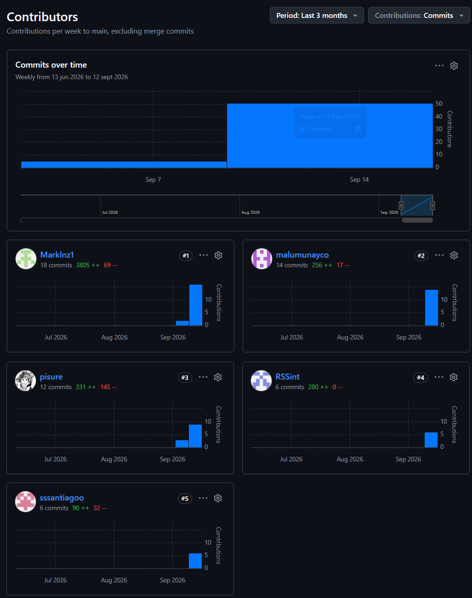

*Figura 0.1 - Histograma de frecuencia de commits y distribución de aportes por colaborador en el repositorio de documentación (Fuente: GitHub Insights).*

</div>

#### Interpretación de las Métricas de Actividad:
* **Semana 1 (08/09/2026):** Pico inicial asociado a la configuración del andamiaje del repositorio, inicialización de plantillas y estructura de directorios.
* **Semana 2 (09/09/2026):** Incorporación intensiva de la investigación preliminar, análisis competitivo y entrevistas de necesidad.
* **Semana 3 (14/09/2026):** Consolidación de sesiones de modelado colaborativo de dominio (EventStorming) y especificación de historias de usuario.
* **Semana 4 (16/09/2026 - 17/09/2026):** Fase de máxima convergencia técnica: integración de arquitectura C4, modelo de clases, persistencia física de base de datos, evidencias de despliegue del Landing Page y auditoría final del informe AV1.

***

## 4. Proyección de Colaboración para Siguientes Hitos

* **TB1 – Stage Review (Semana 7):** Incorporación de la documentación del Sprint 2 (Frontend Web Application en Vue.js / PrimeVue), levantamiento de observaciones del docente y actualización de métricas de contribución.
* **AV2 – Sprint Review (Semana 12):** Documentación del Sprint 3 (Backend RESTful API en ASP.NET Core 10.0 y persistencia en MySQL Server 8.0 [InnoDB] mediante EF Core 10.0), entrevistas de validación con usuarios clínicos y métricas de integración.
* **TB2 – Release Review (Semana 15):** Consolidación final del Sprint 4 (seguridad JWT, pruebas integradas, despliegue global en la nube), producción audiovisual y auditoría final de contribuciones.

<div style="page-break-after: always;"></div>

# Contenido

## Tabla de Contenido

- [Carátula](#carátula)
- [Registro de Versiones del Informe](#registro-de-versiones-del-informe)
- [Project Report Collaboration Insights](#project-report-collaboration-insights)
- [Contenido](#contenido)
- [Student Outcome](#student-outcome)
- [Capítulo I: Introducción](#capítulo-i-introducción)
  - [1.1. Startup Profile](#11-startup-profile)
    - [1.1.1. Descripción de la Startup](#111-descripción-de-la-startup)
    - [1.1.2. Perfiles de integrantes del equipo](#112-perfiles-de-integrantes-del-equipo)
  - [1.2. Solution Profile](#12-solution-profile)
    - [1.2.1. Antecedentes y problemática](#121-antecedentes-y-problemática)
    - [1.2.2. Lean UX Process](#122-lean-ux-process)
      - [1.2.2.1. Lean UX Problem Statements](#1221-lean-ux-problem-statements)
      - [1.2.2.2. Lean UX Assumptions](#1222-lean-ux-assumptions)
      - [1.2.2.3. Lean UX Hypothesis Statements](#1223-lean-ux-hypothesis-statements)
      - [1.2.2.4. Lean UX Canvas](#1224-lean-ux-canvas)
  - [1.3. Segmentos objetivo](#13-segmentos-objetivo)
- [Capítulo II: Requirements Elicitation & Analysis](#capítulo-ii-requirements-elicitation--analysis)
  - [2.1. Competidores](#21-competidores)
    - [2.1.1. Análisis competitivo](#211-análisis-competitivo)
    - [2.1.2. Estrategias y tácticas frente a competidores](#212-estrategias-y-tácticas-frente-a-competidores)
  - [2.2. Entrevistas](#22-entrevistas)
    - [2.2.1. Diseño de entrevistas](#221-diseño-de-entrevistas)
    - [2.2.2. Registro de entrevistas](#222-registro-de-entrevistas)
    - [2.2.3. Análisis de entrevistas](#223-análisis-de-entrevistas)
  - [2.3. Needfinding](#23-needfinding)
    - [2.3.1. User Personas](#231-user-personas)
    - [2.3.2. User Task Matrix](#232-user-task-matrix)
    - [2.3.3. User Journey Mapping](#233-user-journey-mapping)
    - [2.3.4. Empathy Mapping](#234-empathy-mapping)
  - [2.4. Big Picture EventStorming](#24-big-picture-eventstorming)
  - [2.5. Ubiquitous Language](#25-ubiquitous-language)
- [Capítulo III: Requirements Specification](#capítulo-iii-requirements-specification)
  - [3.1. User Stories](#31-user-stories)
  - [3.2. Impact Mapping](#32-impact-mapping)
  - [3.3. Product Backlog](#33-product-backlog)
- [Capítulo IV: Product Design](#capítulo-iv-product-design)
  - [4.1. Style Guidelines](#41-style-guidelines)
    - [4.1.1. General Style Guidelines](#411-general-style-guidelines)
    - [4.1.2. Web Style Guidelines](#412-web-style-guidelines)
  - [4.2. Information Architecture](#42-information-architecture)
    - [4.2.1. Organization Systems](#421-organization-systems)
    - [4.2.2. Labeling Systems](#422-labeling-systems)
    - [4.2.3. SEO Tags and Meta Tags](#423-seo-tags-and-meta-tags)
    - [4.2.4. Searching Systems](#424-searching-systems)
    - [4.2.5. Navigation Systems](#425-navigation-systems)
  - [4.3. Landing Page UI Design](#43-landing-page-ui-design)
    - [4.3.1. Landing Page Wireframe](#431-landing-page-wireframe)
    - [4.3.2. Landing Page Mock-up](#432-landing-page-mock-up)
  - [4.4. Web Applications UX/UI Design](#44-web-applications-uxui-design)
    - [4.4.1. Web Applications Wireframes](#441-web-applications-wireframes)
    - [4.4.2. Web Applications Wireflow Diagrams](#442-web-applications-wireflow-diagrams)
    - [4.4.3. Web Applications Mock-ups](#443-web-applications-mock-ups)
    - [4.4.4. Web Applications User Flow Diagrams](#444-web-applications-user-flow-diagrams)
  - [4.5. Web Applications Prototyping](#45-web-applications-prototyping)
  - [4.6. Domain-Driven Software Architecture](#46-domain-driven-software-architecture)
    - [4.6.1. Design-Level EventStorming](#461-design-level-eventstorming)
    - [4.6.2. Software Architecture Context Diagram (C4)](#462-software-architecture-context-diagram-c4)
    - [4.6.3. Software Architecture Container Diagrams (C4)](#463-software-architecture-container-diagrams-c4)
    - [4.6.4. Software Architecture Components Diagrams (C4)](#464-software-architecture-components-diagrams-c4)
  - [4.7. Software Object-Oriented Design](#47-software-object-oriented-design)
    - [4.7.1. Class Diagrams](#471-class-diagrams)
  - [4.8. Database Design](#48-database-design)
    - [4.8.1. Database Diagrams](#481-database-diagrams)
- [Capítulo V: Product Implementation, Validation & Deployment](#capítulo-v-product-implementation-validation--deployment)
  - [5.1. Software Configuration Management](#51-software-configuration-management)
    - [5.1.1. Software Development Environment Configuration](#511-software-development-environment-configuration)
    - [5.1.2. Source Code Management](#512-source-code-management)
    - [5.1.3. Source Code Style Guide & Conventions](#513-source-code-style-guide--conventions)
    - [5.1.4. Software Deployment Configuration](#514-software-deployment-configuration)
  - [5.2. Landing Page, Services & Applications Implementation](#52-landing-page-services--applications-implementation)
    - [5.2.1. Sprint 1](#521-sprint-1)
      - [5.2.1.1. Sprint Planning 1](#5211-sprint-planning-1)
      - [5.2.1.2. Aspect Leaders and Collaborators](#5212-aspect-leaders-and-collaborators)
      - [5.2.1.3. Sprint Backlog 1](#5213-sprint-backlog-1)
      - [5.2.1.4. Development Evidence for Sprint Review](#5214-development-evidence-for-sprint-review)
      - [5.2.1.5. Execution Evidence for Sprint Review](#5215-execution-evidence-for-sprint-review)
      - [5.2.1.6. Services Documentation Evidence for Sprint Review](#5216-services-documentation-evidence-for-sprint-review)
      - [5.2.1.7. Software Deployment Evidence for Sprint Review](#5217-software-deployment-evidence-for-sprint-review)
      - [5.2.1.8. Team Collaboration Insights during Sprint](#5218-team-collaboration-insights-during-sprint)
- [Conclusiones y Recomendaciones](#conclusiones-y-recomendaciones)
- [Bibliografía](#bibliografía)
- [Anexos](#anexos)
  - [Anexo A. Repositorios de Código Fuente y Documentación](#anexo-a-repositorios-de-código-fuente-y-documentación)
  - [Anexo B. Tableros Digitales y Prototipos Interactivos](#anexo-b-tableros-digitales-y-prototipos-interactivos)
  - [Anexo C. Registro Audiovisual de Entrevistas y Demostración](#anexo-c-registro-audiovisual-de-entrevistas-y-demostración)

<div style="page-break-after: always;"></div>

# Student Outcome

El curso contribuye al cumplimiento del Student Outcome ABET:
**ABET – EAC - Student Outcome 5**

> **Criterio:** La capacidad de funcionar efectivamente en un equipo cuyos miembros juntos proporcionan liderazgo, crean un entorno de colaboración e inclusivo, establecen objetivos, planifican tareas y cumplen objetivos.

En el siguiente cuadro se describe las acciones realizadas y enunciados de conclusiones por parte del grupo, que permiten sustentar el haber alcanzado el logro del ABET – EAC - Student Outcome 5.

| Criterio específico | Acciones realizadas | Conclusiones |
| :--- | :--- | :--- |
| **5.c.1 Trabaja en equipo para proporcionar liderazgo en forma conjunta** | **Espinoza Flores, Aaron André**<br><br>**AV1:** Lideró la definición de la visión de negocio y el relevamiento de requisitos asistenciales para la plataforma Medical SMARTBOX. Condujo la estructuración del Capítulo I (Problemática 5W2H sustentada en fallas de cadena de frío en ambulancias de Lima Metropolitana, formulación de Lean UX Canvas y delimitación de los dos segmentos objetivo: operadores de transporte asistencial SAMU 106 y directores de centros hospitalarios/farmacéuticos). Asimismo, encabezó el análisis competitivo del mercado telemático de salud (Cap. 2.1) y el diseño y conducción de las entrevistas a profundidad a paramédicos y especialistas en logística biomédica (Cap. 2.2), asegurando que los requisitos del producto respondan a dolores reales y no a supuestos infundados.<br><hr>**Gargate Paredes, Santiago**<br><br>**AV1:** Asumió el liderazgo técnico del frente de desarrollo y despliegue del Landing Page institucional de Medical SMARTBOX correspondiente al Sprint 1. Estableció la arquitectura semántica en HTML5, CSS3 modular y JavaScript, asegurando un diseño totalmente responsive (*mobile-first*) orientado a la conversión B2B de instituciones de salud. Lideró la implementación del pipeline de integración y despliegue continuo (CI/CD) alojado en la nube (Vercel/GitHub Pages), auditó los tiempos de carga y accesibilidad web conforme a las pautas WCAG, y documentó exhaustivamente las evidencias de desarrollo, ejecución y despliegue para la revisión de sprint (Capítulos 5.2.1.4 a 5.2.1.7).<br><hr>**Jaramillo Mayta, Jhon Jordy**<br><br>**AV1:** Ejerció el liderazgo en la definición de la arquitectura de software y el modelado orientado al dominio (DDD). Facilitó la sesión colaborativa de Big Picture EventStorming (Cap. 2.4) unificando la comprensión de los flujos de telemetría, custodia y alertas críticas entre todos los miembros. Formuló el glosario canónico de Ubiquitous Language (Cap. 2.5) y lideró el diseño táctico mediante Design-Level EventStorming delimitando seis Bounded Contexts. Diseñó los diagramas del Modelo C4 (Contexto, Contenedores y Componentes) integrando Web API, bróker MQTT y WebSockets SignalR, y formalizó el Diagrama de Clases de Dominio UML (Cap. 4.7) y el Diagrama Físico de Base de Datos Relacional normalizado (Cap. 4.8) para garantizar consistencia transaccional y cumplimiento de las normativas DIGEMID/MINSA.<br><hr>**Munayco Apolaya, Maria Luisa**<br><br>**AV1:** Lideró la estrategia de Experiencia de Usuario (UX) y Diseño de Interfaz (UI) del ecosistema Medical SMARTBOX. Dirigió el proceso de Needfinding (Cap. 2.3) coordinando la síntesis de hallazgos empíricos en User Personas (Dr. Carlos Mendoza y Paramédico Javier Soto), User Task Matrix y mapas de empatía. Estableció el Sistema de Diseño visual y las Guías de Estilo (Cap. 4.1), definiendo una paleta cromática clínica accesible y componentes UI atómicos. Asimismo, encabezó la arquitectura de información y la concepción de wireframes y mockups de alta fidelidad tanto para el Landing Page institucional como para el portal web operativo de monitoreo telemático (Capítulos 4.2 a 4.5), garantizando una experiencia coherente, intuitiva y libre de fricción para los operadores de emergencia.<br><hr>**Santos Minaya, Renzo Piero**<br><br>**AV1:** Ejerció el rol de liderazgo como Product Owner y Scrum Master del equipo. Condujo la transformación de los dolores y requisitos de negocio en artefactos ágiles formales, estructurando el catálogo completo de User Stories con criterios de aceptación rigurosamente formulados bajo sintaxis Gherkin (Scenario, Given, When, Then) organizados en Epics, junto con el Impact Mapping y el Product Backlog priorizado por valor clínico (Capítulo 3). En el ámbito de gestión, lideró la gobernanza de configuración de software (SCM) estableciendo el modelo de ramificación GitFlow, convenciones de Conventional Commits y guías de estilo para C# y Vue.js (Cap. 5.1). Asimismo, facilitó la sesión de Sprint Planning 1, coordinó la asignación de roles mediante la Matriz LACX y gestionó el Sprint Backlog 1 (Cap. 5.2.1.1 a 5.2.1.3), asegurando el ritmo de avance y el cumplimiento del cronograma académico. | **AV1:**<br>Durante este primer hito del proyecto, el equipo demostró un ejercicio de liderazgo horizontal y distribuido de alta efectividad. En lugar de centralizar la toma de decisiones en una sola figura, cada integrante asumió el liderazgo autónomo y especializado de un pilar fundamental de la solución: investigación empírica de mercado (Aaron Espinoza), experiencia y prototipado visual UX/UI (Maria Luisa Munayco), arquitectura de software y persistencia de datos (Jhon Jaramillo), gestión ágil y especificación de requisitos (Renzo Santos), y desarrollo frontend con despliegue en la nube (Santiago Gargate).<br><br>Esta delegación basada en competencias técnicas permitió avanzar en paralelo sobre frentes complejos y altamente interconectados sin generar cuellos de botella. Las disyuntivas de diseño técnico —tales como la selección de protocolos telemáticos para IoT (MQTT vs. WebSockets) o la delimitación de fronteras transaccionales en los Bounded Contexts— fueron debatidas y consensuadas con base en evidencia normativa (DIGEMID/MINSA) y criterios de ingeniería, logrando una cohesión técnica integral que sentó las bases para el éxito de las entregas posteriores. |
| **5.c.2 Crea un entorno colaborativo e inclusivo, establece metas, planifica tareas y cumple objetivos** | **Espinoza Flores, Aaron André**<br><br>**AV1:** Fomentó activamente un entorno inclusivo al incorporar la voz y las perspectivas de los profesionales de salud en el diseño de la solución, evitando sesgos técnicos aislados. Colaboró en la definición del objetivo central del proyecto a través del Lean UX Canvas, asegurando que las metas de investigación se descompusieran en actividades concretas (diseño de guías semiestructuradas, calendarización de entrevistas y tabulación cualitativa). Participó en las ceremonias de sincronización semanal del equipo, aportando insumos críticos que permitieron al diseñador UX y al arquitecto de software alinear las interfaces y los eventos de dominio con las necesidades operativas reales de las ambulancias en Lima.<br><hr>**Gargate Paredes, Santiago**<br><br>**AV1:** Contribuyó al entorno colaborativo mediante una comunicación transparente y continua sobre el progreso de la implementación del Landing Page. Participó en la estimación de tiempos del Sprint Backlog 1, comprometiéndose a cumplir con las metas de entrega y despliegue dentro de los plazos estipulados. Mantuvo un flujo riguroso de commits conforme a Conventional Commits, integró su código en la rama `develop` mediante Pull Requests evaluados en conjunto y colaboró activamente con el Product Owner en la redacción de la sección de Collaboration Insights del Sprint 1 (Cap. 5.2.1.8), garantizando total trazabilidad y cumplimiento de los objetivos del hito.<br><hr>**Jaramillo Mayta, Jhon Jordy**<br><br>**AV1:** Impulsó un espacio colaborativo técnico promoviendo el modelado colaborativo visual mediante Miro y Structurizr DSL, lo que permitió que integrantes con roles no técnicos participaran en la validación de la lógica del sistema. Estableció metas técnicas claras para el sprint (entrega de diagramas de arquitectura C4, modelo de clases y script SQL normalizado de base de datos), desglosando las actividades de diagramación en tareas medibles en el tablero ágil. Atendió oportunamente las dudas de sus compañeros respecto a la estructura de microservicios y persistencia relacional, asegurando la consistencia conceptual del informe y cumpliendo al 100% las metas arquitectónicas asignadas para la entrega AV1.<br><hr>**Munayco Apolaya, Maria Luisa**<br><br>**AV1:** Promovió un entorno inclusivo al transformar los hallazgos de las entrevistas en artefactos de empatía compartidos con todo el equipo, facilitando que cada miembro comprendiera las necesidades emocionales y laborales de los usuarios finales. Planificó minuciosamente el cronograma de diseño en Figma y UXPressia, estableciendo hitos de revisión intermedia (wireframes de baja fidelidad seguidos de mockups de alta fidelidad interactivos). Integró activamente el feedback de sus compañeros y del Product Owner sobre usabilidad y densidad de información clínica, cumpliendo a cabalidad con la entrega de todos los flujos de navegación requeridos para el Landing Page y la Web Application.<br><hr>**Santos Minaya, Renzo Piero**<br><br>**AV1:** Estableció y dinamizó el entorno colaborativo del equipo a través de la configuración del tablero ágil en Trello/Jira y el canal de coordinación en Discord, garantizando canales de comunicación abiertos, respetuosos y transparentes. Lideró la ceremonia de Sprint Planning 1, guiando al equipo en la estimación colectiva de esfuerzos en horas hombre para cada User Story y tarea técnica. Monitoreó el cumplimiento de las metas semanales mediante revisiones de progreso, identificó y removió impedimentos operativos, y aseguró que cada miembro entregara su sección del informe en formato Markdown respetando la fecha límite institucional, logrando así el cumplimiento riguroso de todos los objetivos trazados para el avance AV1. | **AV1:**<br>El establecimiento de un entorno de trabajo colaborativo, inclusivo y altamente disciplinado constituyó el factor determinante para el éxito de la entrega AV1. A través de la adopción del marco de trabajo Scrum, complementado con tableros Kanban interactivos y el flujo GitFlow en GitHub, el equipo logró transformar un enunciado académico de alta complejidad en un plan de acción estructurado con metas semanales claras y alcanzables.<br><br>Se fomentó la inclusión multidisciplinaria, donde las observaciones clínicas de investigación, las directrices de diseño visual y las restricciones de arquitectura fueron escuchadas y ponderadas con igual valor técnico. La comunicación asertiva y periódica evitó la duplicidad de esfuerzos y permitió resolver de manera proactiva los bloqueos de integración. Como resultado tangible, el equipo cumplió con el 100% de los entregables planificados para el Sprint 1 y la documentación técnica de los Capítulos I al V (secciones 5.1 y 5.2.1), demostrando un desempeño maduro, coordinado y alineado con los estándares internacionales de acreditación profesional ABET. |

<div style="page-break-after: always;"></div>

# 1.1. Startup Profile

## 1.1.1. Descripción de la Startup

NeonCode es una iniciativa orientada al diseño de soluciones tecnológicas para el sector salud, enfocada en mejorar la seguridad, trazabilidad y eficiencia del transporte de medicamentos, órganos e insumos médicos sensibles. La startup surge ante la necesidad de reducir riesgos durante los traslados médicos, especialmente cuando los productos requieren condiciones controladas de temperatura, monitoreo continuo y disponibilidad inmediata para la atención de pacientes.

La propuesta de la startup se basa en integrar tecnologías web, sensores IoT y servicios de geolocalización para ofrecer una plataforma que permita supervisar en tiempo real el estado de contenedores inteligentes instalados en ambulancias o unidades de transporte médico. Estos contenedores están diseñados para conservar la carga en condiciones adecuadas, detectar variaciones críticas, registrar el stock mediante sensores de peso y reportar información relevante sobre la ubicación y el estado operativo del vehículo.

El enfoque de NeonCode combina innovación tecnológica con responsabilidad social, debido a que el transporte seguro de productos médicos puede impactar directamente en la calidad de la atención sanitaria. Por ello, la solución busca apoyar a personal médico, operadores logísticos y entidades de salud en la toma de decisiones oportunas, reduciendo la incertidumbre durante los traslados y fortaleciendo la cadena de custodia de los productos transportados.

## 1.1.2. Perfiles de integrantes del equipo

En esta sección se presentarán los perfiles de los integrantes del equipo, incluyendo fotografía, código de estudiante, nombres y apellidos, carrera, principales conocimientos técnicos y habilidades que aportan al desarrollo del proyecto. Cada integrante deberá evidenciar su participación en la investigación, documentación, diseño, implementación, pruebas y despliegue de la solución.

| Foto | Integrante | Código | Carrera | Perfil y aporte al proyecto |
| :---: | --- | :---: | :---: | --- |
|  | **Renzo Piero Santos Minaya** | u202114790 | Ingeniería de Software | Estudiante de Ingeniería de Software con conocimientos en arquitectura orientada al dominio (DDD), backend en ASP.NET Core (.NET 10) y modelado relacional en MySQL. Aporta en el diseño arquitectónico C4, especificación de contratos OpenAPI y servicios de backend. |
|  | **Aaron André Espinoza Flores** | u202222859 | Ingeniería de Software | Estudiante de Ingeniería de Software con experiencia en diseño de interacción, historias de usuario en Gherkin y maquetación frontend. Lidera el desarrollo de componentes de captura en el Landing Page y colabora en Needfinding. |
|  | **Jhon Jordy Jaramillo Mayta** | u202520310 | Ingeniería de Software | Estudiante de Ingeniería de Software con enfoque en gestión de identidad, control de acceso y seguridad web. Aporta en el modelado del Bounded Context de IAM, flujos de autenticación segura 2FA/OTP y despliegue del Landing Page. |
|  | **Santiago Gargate Paredes** | u20211b556 | Ingeniería de Software | Estudiante de Ingeniería de Software enfocado en gestión de configuración de software (SCM), normativas clínicas y desarrollo frontend. Aporta en las guías de estilo, cumplimiento normativo (DIGEMID/DIGDOT) y diseño de interacción asistencial. |
|  | **Maria Luisa Munayco Apolaya** | u20231c995 | Ingeniería de Software | Estudiante de Ingeniería de Software con fortalezas en diseño UI/UX en Figma, accesibilidad WCAG y desarrollo HTML5/CSS3. Lidera la maquetación semántica y adaptación responsive mobile-first del Landing Page y prototipado interactivo. |

<div style="page-break-after: always;"></div>

# 1.2. Solution Profile

## 1.2.1. Antecedentes y problemática

El transporte de medicamentos, vacunas, muestras biológicas, sangre y órganos requiere condiciones estrictas de conservación, trazabilidad y control operativo. En muchos escenarios de atención médica, estos elementos son trasladados en ambulancias o unidades especializadas, donde una variación de temperatura, una demora no prevista o una falta de información sobre el contenido transportado puede afectar la calidad del producto médico y, en consecuencia, la seguridad del paciente.

Actualmente, parte de este proceso puede depender de registros manuales, comunicación telefónica o sistemas aislados que no ofrecen una visión integrada del traslado. Esta situación dificulta conocer en tiempo real la ubicación del contenedor, la temperatura interna, el stock disponible, el estado de apertura, el nivel de combustible del vehículo y el tiempo estimado de llegada. La ausencia de información centralizada incrementa el riesgo de pérdida de medicamentos sensibles, ruptura de la cadena de frío, demoras en emergencias y falta de evidencia para auditorías internas.

La solución propuesta consiste en una plataforma web integrada con contenedores inteligentes basados en IoT, diseñados para el transporte médico en ambulancias. Cada contenedor contará con sensores para monitorear temperatura, peso, apertura, batería y ubicación. Además, la plataforma se conectará con información del vehículo para mostrar nivel de combustible y estimar el tiempo aproximado de llegada. Esta información permitirá a los usuarios autorizados supervisar el traslado, recibir alertas críticas y consultar el historial de cada operación.

## 1.2.2. Lean UX Process

El proceso Lean UX permite orientar la solución a partir de la comprensión del problema, la formulación de supuestos y la validación progresiva de hipótesis. Para este proyecto, el proceso se aplica sobre el dominio del transporte médico controlado, considerando la necesidad de mejorar la visibilidad del traslado, la conservación de productos sensibles y la coordinación entre personal médico, operadores logísticos y entidades de salud.

### 1.2.2.1. Lean UX Problem Statements

The current state of medical transport for medicines, biological supplies and organs has focused mainly on manual coordination, isolated temperature control devices and direct communication between health personnel and transport operators.

What existing products and services fail to address is the lack of integrated real-time visibility of container temperature, stock, location, vehicle status and estimated arrival time during critical medical transport operations.

Our product will address this gap by providing an IoT-enabled smart container platform connected to a responsive web application and a RESTful API, allowing authorized users to monitor environmental conditions, route progress, inventory and operational alerts from a centralized interface.

Our initial focus will be health institutions, emergency medical staff and medical logistics operators that need to transport sensitive medicines, organs or supplies under controlled conditions.

We will know we are successful when users can monitor active medical transports in real time, receive timely alerts for critical incidents, reduce uncertainty about arrival times and access traceability records for completed transfers.

### 1.2.2.2. Lean UX Assumptions

#### Business Assumptions

- We believe health institutions need a digital solution that improves traceability and control during medical transport operations.
- We believe hospitals, clinics and emergency service providers are willing to adopt IoT-based monitoring when it reduces operational risk.
- We believe the solution can generate value through subscription plans for institutions that manage multiple ambulances or medical containers.
- We believe reliable transport evidence can become a differentiating factor for institutions that handle sensitive medical products.

#### Business Outcome Assumptions

- We believe the platform can reduce incidents related to temperature deviation during transport.
- We believe real-time monitoring can reduce the time required to identify and respond to critical events.
- We believe digital traceability reports can improve audit readiness for health institutions.
- We believe route and vehicle visibility can improve coordination between dispatchers and medical teams.

#### User Assumptions

- We believe emergency medical staff need quick access to the status of the transported medical load.
- We believe logistics operators need to monitor multiple active transfers from a single dashboard.
- We believe hospital supervisors need historical evidence of transport conditions and delivery confirmation.
- We believe ambulance drivers need simple alerts that do not distract from their primary responsibility.

#### User Outcome and Benefit Assumptions

- We believe medical staff want to confirm that medicines or organs arrive in appropriate condition.
- We believe logistics operators want to reduce uncertainty about location, fuel level and estimated arrival time.
- We believe supervisors want to review incidents, responsibilities and timestamps after each transfer.
- We believe users benefit from early alerts that allow corrective action before the transported product is compromised.

#### Feature Assumptions

- We believe temperature monitoring and automatic alerts are essential features for sensitive medical transport.
- We believe weight-based stock detection can help estimate the quantity of medicines inside the container.
- We believe GPS tracking and route visualization can improve operational coordination.
- We believe vehicle fuel monitoring and estimated arrival time can support better decision-making during emergencies.
- We believe a traceability history can provide evidence for audits and process improvement.

### 1.2.2.3. Lean UX Hypothesis Statements

- We believe we will achieve improved control of temperature-sensitive medical transport if emergency medical staff and logistics operators attain early detection of temperature deviations with real-time temperature monitoring and critical alerts.
- We believe we will achieve better inventory visibility during transfers if medical staff attain updated information about available medicines with weight-based stock detection inside the smart container.
- We believe we will achieve more accurate operational coordination if logistics operators attain real-time route visibility with GPS tracking and estimated arrival time.
- We believe we will achieve better emergency planning if dispatchers and supervisors attain visibility of vehicle autonomy with fuel-level monitoring and vehicle status integration.
- We believe we will achieve stronger transport accountability if health institutions attain historical evidence of each transfer with traceability reports and chain-of-custody records.

### 1.2.2.4. Lean UX Canvas

| Sección | Descripción |
|---|---|
| Business problem | Las instituciones de salud necesitan transportar medicamentos, órganos e insumos sensibles con mayor control, trazabilidad y capacidad de respuesta ante incidentes. |
| Business outcomes | Reducir incidentes de conservación, mejorar la visibilidad del traslado, disminuir incertidumbre sobre tiempos de llegada y generar evidencia histórica. |
| Users | Personal médico de emergencia, operadores logísticos de salud, supervisores hospitalarios y responsables de transporte médico. |
| User outcomes | Conocer el estado de la carga, recibir alertas oportunas, confirmar disponibilidad de stock y revisar evidencia del traslado. |
| Solutions | Contenedor inteligente IoT, aplicación web responsive, RESTful API, alertas, GPS, monitoreo de temperatura, sensores de peso y reportes. |
| Hypotheses | Si los usuarios monitorean condiciones críticas en tiempo real, podrán reaccionar antes de que el traslado comprometa la seguridad del producto médico. |
| Most important thing to learn first | Validar si los usuarios consideran prioritario integrar temperatura, ubicación, stock y ETA en una sola plataforma. |
| Least amount of work to learn it | Prototipo navegable con dashboard de contenedores, alertas, detalle de traslado y registro histórico básico. |

<div style="page-break-after: always;"></div>

# 1.3. Segmentos Objetivo

La solución propuesta está dirigida a actores que participan directa o indirectamente en el transporte de medicamentos, órganos e insumos médicos sensibles. Estos segmentos requieren información confiable, alertas oportunas y trazabilidad durante el traslado, debido a que las condiciones de conservación y los tiempos de llegada pueden impactar en la continuidad de la atención médica.

## Segmento 1: Personal médico y de emergencias

Este segmento incluye paramédicos, enfermeros, médicos de emergencia y técnicos que participan en el traslado o recepción de productos médicos. Sus principales necesidades se relacionan con conocer el estado de la carga, verificar que los productos se mantengan dentro de condiciones seguras y responder rápidamente ante alertas críticas.

El personal médico requiere una interfaz clara, accesible y rápida de consultar, especialmente en escenarios de alta presión. Para este segmento, la solución debe priorizar información esencial como temperatura actual, estado del contenedor, stock disponible, alertas activas y tiempo estimado de llegada.

## Segmento 2: Operadores logísticos e instituciones de salud

Este segmento está conformado por coordinadores de ambulancias, responsables de transporte médico, supervisores de cadena de frío, hospitales, clínicas, bancos de sangre, laboratorios, centros quirúrgicos, áreas de farmacia hospitalaria y personal encargado de planificar, supervisar o recibir traslados médicos entre instituciones de salud.

Los operadores logísticos e instituciones de salud necesitan visibilidad sobre múltiples unidades, rutas, contenedores y entregas, así como evidencia del cumplimiento de condiciones de transporte para medicamentos refrigerados, órganos, muestras biológicas o insumos de alto valor. Sus principales necesidades se relacionan con monitorear la ubicación de los contenedores, revisar el avance de cada traslado, anticipar demoras, validar disponibilidad de recursos, confirmar entregas y coordinar acciones cuando se presenta una incidencia.

Para este segmento, la solución debe ofrecer un dashboard centralizado, filtros de búsqueda, priorización de alertas, trazabilidad histórica, reportes de operación, registros de temperatura, ubicación, responsables, horarios de apertura del contenedor, incidentes y acciones tomadas durante cada traslado.

<div style="page-break-after: always;"></div>

# 2.1. Competidores

En esta sección se realiza la identificación, evaluación multidimensional y contraste estratégico de los principales competidores directos e indirectos que operan en el mercado global y nacional de monitoreo telemático y preservación de cadena de frío farmacéutica. El propósito fundamental de este análisis es evidenciar cómo **Medical SMARTBOX (NeonCode)** se posiciona de forma diferenciada y competitiva en el sector salud peruano, resolviendo las brechas operativas críticas del transporte asistencial en ambulancias que las soluciones convencionales no atienden.

***

## 2.1.1. Análisis competitivo

Para el relevamiento de la competencia se investigaron tres empresas con presencia tecnológica real en el transporte de productos biológicos y seguimiento de activos:

1. **Sensitech Inc. (Carrier Global Corporation):** Referente mundial indiscutido en la visibilidad de la cadena de frío farmacéutica y monitoreo de carga biofarmacéutica a granel (pallets, contenedores aéreos y fletes transcontinentales) mediante registradores de datos (*dataloggers*) de temperatura USB (*TempTale Ultra*) y balizas celulares en tiempo real (*TempTale GEO LTE*), respaldados por la plataforma en la nube *ColdStream SaaS*.
2. **Tracklink Perú (Motorlink S.A.C.):** Empresa líder nacional en seguridad vehicular, monitoreo GPS satelital y telemática de flotas con más de 20 años de trayectoria y central de operaciones 24/7 en el Perú. Ofrece la solución *Tracklink Cold Chain Control*, orientada al monitoreo de temperatura en la cabina o furgón frigorífico del camión.
3. **Controlant:** Empresa global pionera en soluciones de visibilidad de cadena de frío en tiempo real para medicamentos biológicos y vacunas de ultracongelación (-80 °C a +25 °C), reconocida por la gestión de la cadena de frío global de las vacunas Pfizer-BioNTech COVID-19 mediante sus dispositivos celulares *Saga Card* / *Saga Mobile* y la plataforma analítica predictiva *Aurora Cloud Platform*.

***

### Competitive Analysis Landscape

El análisis comparativo adopta estrictamente la estructura normativa del cuadro de **Competitive Analysis Landscape** prescrita en las **páginas 10 y 11 del Enunciado Oficial del Trabajo Final**, evaluando a NeonCode frente a los tres competidores reales en sus 11 dimensiones:

<div style="margin: 14px 0 18px 0; width: 100%;">
<table border="1" cellpadding="3" cellspacing="0" style="border-collapse: collapse; width: 100%; table-layout: fixed; font-size: 6.8pt; line-height: 1.25; border: 1px solid #cbd5e1;">
<colgroup>
  <col style="width: 17%;" />
  <col style="width: 21%;" />
  <col style="width: 21%;" />
  <col style="width: 20.5%;" />
  <col style="width: 20.5%;" />
</colgroup>
<thead>
<tr style="background-color: #e2e8f0;">
  <th style="border: 1px solid #cbd5e1; padding: 4px; text-align: left; font-weight: bold;">¿Por qué llevar a cabo este análisis?</th>
  <th colspan="4" style="border: 1px solid #cbd5e1; padding: 4px; text-align: left; font-weight: 500; font-style: italic;">¿Cuál es la propuesta de valor diferenciada de Medical SMARTBOX frente a las soluciones globales y locales de monitoreo de cadena de frío para unidades de soporte vital y traslados biomédicos en Lima Metropolitana?</th>
</tr>
<tr style="background-color: #f1f5f9;">
  <th style="border: 1px solid #cbd5e1; padding: 4px; text-align: left; font-weight: bold; color: #0f172a;">(Nombre y Logo)</th>
  <th style="border: 1px solid #cbd5e1; padding: 4px; text-align: left; font-weight: bold; background-color: #e0f2fe; color: #0369a1;">Medical SMARTBOX (NeonCode)</th>
  <th style="border: 1px solid #cbd5e1; padding: 4px; text-align: left; font-weight: bold; color: #0f172a;">Sensitech (Carrier Global)</th>
  <th style="border: 1px solid #cbd5e1; padding: 4px; text-align: left; font-weight: bold; color: #0f172a;">Tracklink Perú (Motorlink S.A.C.)</th>
  <th style="border: 1px solid #cbd5e1; padding: 4px; text-align: left; font-weight: bold; color: #0f172a;">Controlant</th>
</tr>
</thead>
<tbody>
<tr>
  <td style="border: 1px solid #cbd5e1; padding: 3px 4px; vertical-align: top; background-color: #f8fafc;"><strong>Perfil: Overview</strong></td>
  <td style="border: 1px solid #cbd5e1; padding: 3px 4px; vertical-align: top; background-color: #f0fdf4;">Plataforma IoT y contenedor biomédico inteligente con telemetría activa en tiempo real (temperatura, peso neto, GPS) y control de acceso físico mediante solenoide con token OTP para ambulancias y triaje prehospitalario.</td>
  <td style="border: 1px solid #cbd5e1; padding: 3px 4px; vertical-align: top;">Líder multinacional en visibilidad de cadena de frío mediante dataloggers USB y dispositivos celulares para pallets y contenedores de carga farmacéutica masiva transcontinental.</td>
  <td style="border: 1px solid #cbd5e1; padding: 3px 4px; vertical-align: top;">Proveedor nacional líder en seguridad vehicular, monitoreo GPS de flotas y telemetría de furgones frigoríficos mediante sensores en la computadora de abordo del camión.</td>
  <td style="border: 1px solid #cbd5e1; padding: 3px 4px; vertical-align: top;">Innovador global en visibilidad de cadena de frío en tiempo real mediante balizas IoT celulares y plataforma en la nube para fabricantes biofarmacéuticos.</td>
</tr>
<tr>
  <td style="border: 1px solid #cbd5e1; padding: 3px 4px; vertical-align: top; background-color: #f8fafc;"><strong>Perfil: Ventaja competitiva ¿Qué valor ofrece a los clientes?</strong></td>
  <td style="border: 1px solid #cbd5e1; padding: 3px 4px; vertical-align: top; background-color: #f0fdf4;">Protección activa en el último tramo prehospitalario (ambulancia a cama del paciente), cerradura solenoide anti-apertura no autorizada con token OTP y monitoreo de peso digital para evitar adulteración o mermas.</td>
  <td style="border: 1px solid #cbd5e1; padding: 3px 4px; vertical-align: top;">Marca de referencia mundial con cumplimiento regulatorio estricto FDA 21 CFR Part 11 y certificación de calibración individual con trazabilidad metrológica NIST.</td>
  <td style="border: 1px solid #cbd5e1; padding: 3px 4px; vertical-align: top;">Central de monitoreo 24/7 y cobertura de red celular en las 24 regiones del Perú, con servicio técnico, instalación y soporte presencial en talleres a nivel nacional.</td>
  <td style="border: 1px solid #cbd5e1; padding: 3px 4px; vertical-align: top;">Automatización analítica de extremo a extremo, monitoreo de ultracongelación (-80 °C) y validación en distribución global de biológicos y vacunas críticas.</td>
</tr>
<tr>
  <td style="border: 1px solid #cbd5e1; padding: 3px 4px; vertical-align: top; background-color: #f8fafc;"><strong>Perfil de Marketing: Mercado objetivo</strong></td>
  <td style="border: 1px solid #cbd5e1; padding: 3px 4px; vertical-align: top; background-color: #f0fdf4;">Empresas de transporte asistido, ambulancias públicas (SAMU) y privadas, bancos de sangre, policlínicos y laboratorios de análisis clínicos en el Perú.</td>
  <td style="border: 1px solid #cbd5e1; padding: 3px 4px; vertical-align: top;">Grandes laboratorios farmacéuticos transnacionales y distribuidores logísticos globales de medicamentos y vacunas.</td>
  <td style="border: 1px solid #cbd5e1; padding: 3px 4px; vertical-align: top;">Empresas de transporte de carga refrigerada, distribuidores mayoristas de alimentos perecibles y operadores logísticos interprovinciales.</td>
  <td style="border: 1px solid #cbd5e1; padding: 3px 4px; vertical-align: top;">Fabricantes multinacionales biofarmacéuticos, centros de investigación de ensayos clínicos y cadenas globales de ultracongelación.</td>
</tr>
<tr>
  <td style="border: 1px solid #cbd5e1; padding: 3px 4px; vertical-align: top; background-color: #f8fafc;"><strong>Perfil de Marketing: Estrategias de marketing</strong></td>
  <td style="border: 1px solid #cbd5e1; padding: 3px 4px; vertical-align: top; background-color: #f0fdf4;">Posicionamiento como solución HaaS (Hardware as a Service) especializada en emergencias prehospitalarias, alianzas con redes clínicas y venta consultiva técnica.</td>
  <td style="border: 1px solid #cbd5e1; padding: 3px 4px; vertical-align: top;">Marketing B2B corporativo basado en certificaciones globales, presencia en ferias farmacéuticas mundiales y licitaciones masivas corporativas.</td>
  <td style="border: 1px solid #cbd5e1; padding: 3px 4px; vertical-align: top;">Fuerza de ventas corporativa de flotas, campañas de telemática vehicular, y venta cruzada con servicios de recuperación antirrobo vehicular.</td>
  <td style="border: 1px solid #cbd5e1; padding: 3px 4px; vertical-align: top;">Marketing relacional y alianzas estratégicas globales con farmacéuticas de primera línea (ej. Pfizer) y organismos internacionales de salud.</td>
</tr>
<tr>
  <td style="border: 1px solid #cbd5e1; padding: 3px 4px; vertical-align: top; background-color: #f8fafc;"><strong>Perfil de Producto: Productos & Servicios</strong></td>
  <td style="border: 1px solid #cbd5e1; padding: 3px 4px; vertical-align: top; background-color: #f0fdf4;">Dispositivo IoT Medical SMARTBOX (ESP32, DS18B20, celda de carga HX711, solenoide), Web App Vue.js/PrimeVue y REST API en ASP.NET Core 10.0.</td>
  <td style="border: 1px solid #cbd5e1; padding: 3px 4px; vertical-align: top;">Dataloggers TempTale Ultra (USB), TempTale GEO LTE (celular en tiempo real) y software de analítica ColdStream SaaS.</td>
  <td style="border: 1px solid #cbd5e1; padding: 3px 4px; vertical-align: top;">Hardware telemático vehicular Tracklink Cold Chain, sensores de temperatura para furgón y portal web de rastreo de flota.</td>
  <td style="border: 1px solid #cbd5e1; padding: 3px 4px; vertical-align: top;">Controlant Saga Card / Saga Mobile (sensores celulares compactos) y plataforma cloud de visibilidad predictiva Aurora.</td>
</tr>
<tr>
  <td style="border: 1px solid #cbd5e1; padding: 3px 4px; vertical-align: top; background-color: #f8fafc;"><strong>Perfil de Producto: Precios & Costos</strong></td>
  <td style="border: 1px solid #cbd5e1; padding: 3px 4px; vertical-align: top; background-color: #f0fdf4;">Suscripción mensual SaaS por Smartbox activo ($30 - $45 USD/mes) + hardware en comodato o costo accesible de entrada ($180 USD).</td>
  <td style="border: 1px solid #cbd5e1; padding: 3px 4px; vertical-align: top;">Alto costo por datalogger desechable ($25 - $40 USD/unidad) o reutilizable ($150 - $250 USD) más licencias corporativas anuales de software.</td>
  <td style="border: 1px solid #cbd5e1; padding: 3px 4px; vertical-align: top;">Costo de instalación de hardware vehicular ($350 - $500 USD por camión) + cuota de servicio mensual ($35 - $50 USD por vehículo).</td>
  <td style="border: 1px solid #cbd5e1; padding: 3px 4px; vertical-align: top;">Servicio corporativo cerrado por viaje o suscripción de alto valor ($500+ USD mensuales por lote monitorizado), logística inversa obligatoria.</td>
</tr>
<tr>
  <td style="border: 1px solid #cbd5e1; padding: 3px 4px; vertical-align: top; background-color: #f8fafc;"><strong>Perfil de Producto: Canales de distribución (Web y/o Móvil)</strong></td>
  <td style="border: 1px solid #cbd5e1; padding: 3px 4px; vertical-align: top; background-color: #f0fdf4;">Web Application responsive (optimizada para desktop y tablets de ambulancia) y Landing Page comercial con portal de cotización.</td>
  <td style="border: 1px solid #cbd5e1; padding: 3px 4px; vertical-align: top;">Plataforma web corporativa ColdStream (Web SaaS) y herramientas de configuración desktop/USB para lectura de reportes PDF.</td>
  <td style="border: 1px solid #cbd5e1; padding: 3px 4px; vertical-align: top;">Plataforma Web de rastreo de flotas y Aplicación Móvil (Android/iOS) para gestión y ubicación satelital de vehículos.</td>
  <td style="border: 1px solid #cbd5e1; padding: 3px 4px; vertical-align: top;">Plataforma Web Aurora Cloud Platform y servicios API de integración empresarial con ERPs/WMS.</td>
</tr>
<tr>
  <td style="border: 1px solid #cbd5e1; padding: 3px 4px; vertical-align: top; background-color: #f8fafc;"><strong>Análisis SWOT: Fortalezas</strong></td>
  <td style="border: 1px solid #cbd5e1; padding: 3px 4px; vertical-align: top; background-color: #f0fdf4;">Control activo físico solenoide con OTP, monitoreo de peso digital, diseño adaptado a ambulancias de Lima, arquitectura moderna en .NET 10 y MySQL 8.0.</td>
  <td style="border: 1px solid #cbd5e1; padding: 3px 4px; vertical-align: top;">Máxima reputación regulatoria mundial, precisión metrológica certificada, plataforma cloud robusta para millones de envíos farmacéuticos.</td>
  <td style="border: 1px solid #cbd5e1; padding: 3px 4px; vertical-align: top;">Infraestructura operativa local consolidada, red de soporte 24/7 en Perú, integración con rastreo antirrobo y botón de pánico vehicular.</td>
  <td style="border: 1px solid #cbd5e1; padding: 3px 4px; vertical-align: top;">Tecnología IoT de vanguardia (NB-IoT/Cat-M1), analítica predictiva avanzada, cobertura global sin intervención del operador.</td>
</tr>
<tr>
  <td style="border: 1px solid #cbd5e1; padding: 3px 4px; vertical-align: top; background-color: #f8fafc;"><strong>Análisis SWOT: Debilidades</strong></td>
  <td style="border: 1px solid #cbd5e1; padding: 3px 4px; vertical-align: top; background-color: #f0fdf4;">Startup emergente sin marca posicionada en el sector salud público, dependencia inicial de autofinanciamiento de prototipos.</td>
  <td style="border: 1px solid #cbd5e1; padding: 3px 4px; vertical-align: top;">Monitoreo pasivo en modelos estándar (requiere conectar USB al final), sin cerradura inteligente de seguridad, sin sensor de peso.</td>
  <td style="border: 1px solid #cbd5e1; padding: 3px 4px; vertical-align: top;">Monitoreo a nivel de vehículo completo y no del contenedor individual, sin integración con flujos clínicos prehospitalarios ni control de custodia digital.</td>
  <td style="border: 1px solid #cbd5e1; padding: 3px 4px; vertical-align: top;">Barrera de costos restrictiva para el mercado peruano, complejidad de logística inversa de recolección de tarjetas, sin protección física local (OTP).</td>
</tr>
<tr>
  <td style="border: 1px solid #cbd5e1; padding: 3px 4px; vertical-align: top; background-color: #f8fafc;"><strong>Análisis SWOT: Oportunidades</strong></td>
  <td style="border: 1px solid #cbd5e1; padding: 3px 4px; vertical-align: top; background-color: #f0fdf4;">Exigencias crecientes de DIGEMID y MINSA para trazabilidad de cadena de frío en emergencias; alta tasa de mermas por tráfico vehicular en Lima.</td>
  <td style="border: 1px solid #cbd5e1; padding: 3px 4px; vertical-align: top;">Incremento en la demanda mundial de medicamentos biológicos sensibles a variaciones de temperatura.</td>
  <td style="border: 1px solid #cbd5e1; padding: 3px 4px; vertical-align: top;">Crecimiento del comercio farmacéutico electrónico y requerimientos de trazabilidad en transporte logístico local.</td>
  <td style="border: 1px solid #cbd5e1; padding: 3px 4px; vertical-align: top;">Expansión de requerimientos de monitoreo en tiempo real post-COVID y adopción de estándares de sostenibilidad en logística clínica.</td>
</tr>
<tr>
  <td style="border: 1px solid #cbd5e1; padding: 3px 4px; vertical-align: top; background-color: #f8fafc;"><strong>Análisis SWOT: Amenazas</strong></td>
  <td style="border: 1px solid #cbd5e1; padding: 3px 4px; vertical-align: top; background-color: #f0fdf4;">Burocracia y lentitud en licitaciones del sector salud público (EsSalud/MINSA); resistencia al cambio del personal paramédico ante el registro digital.</td>
  <td style="border: 1px solid #cbd5e1; padding: 3px 4px; vertical-align: top;">Nuevos entrantes en tecnología IoT celular de bajo costo que presionan a la baja los márgenes de hardware.</td>
  <td style="border: 1px solid #cbd5e1; padding: 3px 4px; vertical-align: top;">Competidores de rastreo satelital genérico que ofrecen sensores de temperatura básicos como commodity a bajo precio.</td>
  <td style="border: 1px solid #cbd5e1; padding: 3px 4px; vertical-align: top;">Tensiones geopolíticas y disrupciones en la cadena global de suministro de componentes electrónicos semiconductores para hardware IoT.</td>
</tr>
</tbody>
</table>
</div>

***

## 2.1.2. Estrategias y tácticas frente a competidores

A partir del análisis de fortalezas, debilidades y oportunidades de la competencia, NeonCode establece las siguientes estrategias y tácticas comerciales y tecnológicas para consolidar su ventaja competitiva en el mercado asistencial:

1. **Estrategia de Especialización en el Último Tramo Prehospitalario (*Last-Mile Emergency*):**  
   * *Diagnóstico:* Sensitech y Controlant diseñan productos para pallets de comercio exterior aéreo o marítimo, mientras que Tracklink monitorea la posición del camión entero. Ninguno protege el insumo médico en el transbordo manual desde la ambulancia hasta la rampa de trauma shock o quirófano.
   * *Táctica:* Posicionar a Medical SMARTBOX como un contenedor isotérmico móvil autónomo que acompaña el medicamento o hemoderivado de forma ininterrumpida hasta la entrega final al médico especialista receptor.

2. **Táctica de Seguridad Activa mediante Cerrojo Solenoide y Clave Dinámica OTP:**  
   * *Diagnóstico:* Los competidores alertan sobre aperturas de puerta únicamente mediante sensores de luz ambiental o contactos magnéticos en la carrocería del vehículo, sin capacidad de impedir físicamente el acceso no autorizado.
   * *Táctica:* Incorporar un mecanismo de cerrojo solenoide controlado electromecánicamente mediante microcontrolador ESP32. La caja solo se desbloquea en destino cuando el receptor autorizado ingresa un código de un solo uso (OTP) despachado a la aplicación web, garantizando una cadena de custodia inviolable con valor probatorio ante DIGEMID.

3. **Estrategia de Accesibilidad Económica mediante Modelo Hardware as a Service (HaaS):**  
   * *Diagnóstico:* Las soluciones internacionales implican costos elevados en moneda extranjera y tarifas de consultoría corporativa inaccesibles para servicios de ambulancias privadas y policlínicos peruanos.
   * *Táctica:* Ofrecer una tarifa de suscripción mensual accesible en moneda local (S/ 110 – S/ 160 por contenedor activo), incluyendo el hardware en comodato, el acceso a la plataforma web de monitoreo en tiempo real y el soporte técnico, eliminando la barrera inicial de inversión de capital (*CapEx*).

4. **Táctica de Control de Stock Automatizado por Celda de Carga (HX711):**  
   * *Diagnóstico:* Ningún competidor del mercado cuenta con detección de masa o peso interno en cajas térmicas, obligando al conteo manual de viales y ampollas.
   * *Táctica:* Integrar una celda de carga con convertidor analógico-digital HX711 en la base del compartimento clínico. Al detectar una reducción abrupta de peso sin registro de parada médica autorizada, la plataforma genera una alerta inmediata de posible sustracción o pérdida de carga.

<div style="page-break-after: always;"></div>

# 2.2. Entrevistas

La investigación empírica de campo constituye el cimiento metodológico del proyecto **Medical SMARTBOX**. Para validar la problemática y relevar las necesidades operativas de la cadena de frío biomédica en Lima Metropolitana, se diseñaron y ejecutaron entrevistas a profundidad con profesionales en ejercicio activo pertenecientes a los dos segmentos objetivo del proyecto: personal médico y paramédicos asistenciales en ambulancias (**Segmento 1**), y coordinadores de logística farmacéutica y directores de centros hospitalarios (**Segmento 2**).

***

## 2.2.1. Diseño de entrevistas

Se elaboró una guía de entrevista semiestructurada aplicando las directrices metodológicas de UX Research de la industria (Nielsen Norman Group e Interaction Design Foundation). El diseño se orientó a reconstruir experiencias reales recientes sin condicionar al entrevistado ni presentar prematuramente la solución tecnológica, garantizando la recolección neutral de datos objetivos y percepciones subjetivas.

### Objetivos de la Guía de Entrevista:
1. Reconstruir el flujo paso a paso del traslado asistencial de medicamentos refrigerados, hemoderivados, vacunas y muestras biológicas.
2. Identificar las herramientas, registros documentales y canales de comunicación actualmente utilizados en ruta y en almacén.
3. Documentar incidentes críticos reales de ruptura de cadena de frío, fallas mecánicas, demoras por congestión vehicular y pérdidas de custodia.
4. Medir los niveles de estrés, confianza, carga cognitiva y frustración del personal operativo frente a la falta de trazabilidad telemática.
5. Extraer requerimientos funcionales prioritarios para la formulación de los arquetipos (*User Personas*), matrices de tareas y escenarios de uso.

### Guía de Preguntas para el Segmento 1 (Personal Médico y Paramédicos de Ambulancia):
1. **Contexto operativo:** ¿Cuál es tu rol exacto durante una guardia de emergencia y qué tipo de insumos refrigerados te toca trasladar con mayor frecuencia?
2. **Procedimiento actual:** ¿Qué pasos sigues desde que recibes la orden de despacho hasta que entregas el contenedor térmico en el hospital receptor?
3. **Control térmico:** ¿Cómo verificas que la temperatura interna del cooler se mantenga en el rango de +2 °C a +8 °C mientras conduces o atiendes al paciente en cabina?
4. **Instrumentación y registro:** ¿Qué herramientas utilizas para medir la temperatura y dónde registras las lecturas durante el trayecto?
5. **Incidentes en ruta:** Recuerda una ocasión en la que la ambulancia quedó atrapada en el tráfico o se produjo un sobrecalentamiento. ¿Qué ocurrió y cómo reaccionaron?
6. **Seguridad y custodia:** ¿Cómo aseguras que el contenedor no sea abierto indebidamente en ruta o que no se confundan los medicamentos?
7. **Puntos ciegos:** ¿En qué momento del traslado experimentas mayor incertidumbre respecto al estado de la carga?
8. **Comunicación operativa:** ¿Por qué medios coordinas con la central de despacho y con el hospital de destino tu hora estimada de llegada (ETA)?
9. **Criterios de entrega:** ¿Qué condiciones exige el personal del hospital receptor para aceptar o rechazar formalmente la entrega de un hemoderivado o fármaco?
10. **Requerimiento ideal:** Si pudieras incorporar una innovación tecnológica en tu contenedor de traslado, ¿cuál resolvería tu mayor preocupación?

### Guía de Preguntas para el Segmento 2 (Coordinadores Logísticos y Farmacéuticos Hospitalarios):
1. **Gestión de cadena de frío:** ¿Cómo planificas y supervisas la distribución de biológicos y medicamentos termolábiles hacia ambulancias o centros periféricos?
2. **Recepción y verificación:** Al arribar un envío a tu centro de salud, ¿qué protocolo sigues para certificar que no hubo excursiones térmicas en tránsito?
3. **Dataloggers y herramientas:** ¿Qué tecnologías emplean actualmente para registrar la temperatura y con qué retraso temporal accedes a la información de los viajes?
4. **Pérdidas y descartes:** ¿Con qué frecuencia se reportan pérdidas o descartes de vacunas o hemoderivados por ruptura de la cadena de frío y qué costo representa para tu institución?
5. **Auditoría y DIGEMID:** ¿Cómo gestionan las actas de entrega física y qué dificultades enfrentan durante las auditorías de trazabilidad de DIGEMID/SUSALUD?
6. **Conflictos de custodia:** ¿Se han presentado disputas entre el transportista/paramédico y el personal receptor sobre la responsabilidad de un lote degradado?
7. **Visibilidad en tiempo real:** ¿Dispones actualmente de una plataforma web que te permita ver en vivo la ubicación y temperatura del contenedor antes de que llegue a tu puerta?
8. **Control de stock y mermas:** ¿Cómo detectan si un insumo fue retirado del cooler de manera no autorizada durante un traslado de emergencia?
9. **Impacto del tráfico:** ¿Cómo afecta la congestión vehicular de Lima Metropolitana la planificación de turnos de quirófano y ventanas de isquemia?
10. **Criterio de valor:** ¿Qué características técnicas consideras indispensables en una plataforma digital de monitoreo para confiar plenamente en ella?

***

## 2.2.2. Registro de entrevistas

Se ejecutaron un total de **6 entrevistas a profundidad** (3 participantes por cada segmento objetivo). Las sesiones fueron grabadas en video con consentimiento informado de los participantes y se encuentran alojadas en la plataforma institucional de Microsoft Stream / SharePoint de la universidad.

### Tabla Consolidada de Registro de Entrevistas:

<div style="margin: 12px 0 16px 0; width: 100%;">
<table border="1" cellpadding="2" cellspacing="0" style="border-collapse: collapse; width: 100%; table-layout: fixed; font-size: 6.2pt; line-height: 1.2; border: 1px solid #cbd5e1;">
<colgroup>
  <col style="width: 5%;" />
  <col style="width: 10%;" />
  <col style="width: 14%;" />
  <col style="width: 16%;" />
  <col style="width: 16%;" />
  <col style="width: 6%;" />
  <col style="width: 11%;" />
  <col style="width: 8%;" />
  <col style="width: 6%;" />
  <col style="width: 8%;" />
</colgroup>
<thead>
<tr style="background-color: #f1f5f9;">
  <th style="border: 1px solid #cbd5e1; padding: 3px; text-align: center; font-weight: bold;">#</th>
  <th style="border: 1px solid #cbd5e1; padding: 3px; text-align: left; font-weight: bold;">Segmento</th>
  <th style="border: 1px solid #cbd5e1; padding: 3px; text-align: left; font-weight: bold;">Entrevistado</th>
  <th style="border: 1px solid #cbd5e1; padding: 3px; text-align: left; font-weight: bold;">Rol / Cargo</th>
  <th style="border: 1px solid #cbd5e1; padding: 3px; text-align: left; font-weight: bold;">Organización</th>
  <th style="border: 1px solid #cbd5e1; padding: 3px; text-align: center; font-weight: bold;">Edad</th>
  <th style="border: 1px solid #cbd5e1; padding: 3px; text-align: left; font-weight: bold;">Distrito</th>
  <th style="border: 1px solid #cbd5e1; padding: 3px; text-align: center; font-weight: bold;">Fecha</th>
  <th style="border: 1px solid #cbd5e1; padding: 3px; text-align: center; font-weight: bold;">Dur.</th>
  <th style="border: 1px solid #cbd5e1; padding: 3px; text-align: center; font-weight: bold;">Video</th>
</tr>
</thead>
<tbody>
<tr>
  <td style="border: 1px solid #cbd5e1; padding: 2px 3px; text-align: center; font-weight: bold;">**E1**</td>
  <td style="border: 1px solid #cbd5e1; padding: 2px 3px;">Segmento 1</td>
  <td style="border: 1px solid #cbd5e1; padding: 2px 3px; font-weight: 600;">Wilbert Toledo</td>
  <td style="border: 1px solid #cbd5e1; padding: 2px 3px;">Estudiante de Medicina / Paramédico en Prácticas</td>
  <td style="border: 1px solid #cbd5e1; padding: 2px 3px;">Red de Ambulancias de Emergencia</td>
  <td style="border: 1px solid #cbd5e1; padding: 2px 3px; text-align: center;">21</td>
  <td style="border: 1px solid #cbd5e1; padding: 2px 3px;">Pueblo Libre</td>
  <td style="border: 1px solid #cbd5e1; padding: 2px 3px; text-align: center;">16/09/2026</td>
  <td style="border: 1px solid #cbd5e1; padding: 2px 3px; text-align: center;">02:51 min</td>
  <td style="border: 1px solid #cbd5e1; padding: 2px 3px; text-align: center;"><a href="https://upcedupe-my.sharepoint.com/:v:/g/personal/u202222859_upc_edu_pe/IQCihpuSFk_uRraSi_YPm6zdAWy1fp-ti8brf56zZ5T5dPU?e=THmpOi">Ver</a></td>
</tr>
<tr>
  <td style="border: 1px solid #cbd5e1; padding: 2px 3px; text-align: center; font-weight: bold;">**E2**</td>
  <td style="border: 1px solid #cbd5e1; padding: 2px 3px;">Segmento 1</td>
  <td style="border: 1px solid #cbd5e1; padding: 2px 3px; font-weight: 600;">Aldair Lazaro</td>
  <td style="border: 1px solid #cbd5e1; padding: 2px 3px;">Paramédico de Transporte Asistido</td>
  <td style="border: 1px solid #cbd5e1; padding: 2px 3px;">Servicio de Ambulancias y Rescate</td>
  <td style="border: 1px solid #cbd5e1; padding: 2px 3px; text-align: center;">26</td>
  <td style="border: 1px solid #cbd5e1; padding: 2px 3px;">San Martín de Porres</td>
  <td style="border: 1px solid #cbd5e1; padding: 2px 3px; text-align: center;">17/09/2026</td>
  <td style="border: 1px solid #cbd5e1; padding: 2px 3px; text-align: center;">04:38 min</td>
  <td style="border: 1px solid #cbd5e1; padding: 2px 3px; text-align: center;"><a href="https://upcedupe-my.sharepoint.com/:v:/g/personal/u202222859_upc_edu_pe/IQAnNStpnJLhQrdYqBUBUuhsAXzXihAxwOY5jm2ogaY1W_o?e=dTOVJd">Ver</a></td>
</tr>
<tr>
  <td style="border: 1px solid #cbd5e1; padding: 2px 3px; text-align: center; font-weight: bold;">**E3**</td>
  <td style="border: 1px solid #cbd5e1; padding: 2px 3px;">Segmento 1</td>
  <td style="border: 1px solid #cbd5e1; padding: 2px 3px; font-weight: 600;">Renato Calvo Yalan</td>
  <td style="border: 1px solid #cbd5e1; padding: 2px 3px;">Conductor / Paramédico Asistencial</td>
  <td style="border: 1px solid #cbd5e1; padding: 2px 3px;">Unidad Móvil de Soporte Vital</td>
  <td style="border: 1px solid #cbd5e1; padding: 2px 3px; text-align: center;">22</td>
  <td style="border: 1px solid #cbd5e1; padding: 2px 3px;">San Isidro</td>
  <td style="border: 1px solid #cbd5e1; padding: 2px 3px; text-align: center;">17/09/2026</td>
  <td style="border: 1px solid #cbd5e1; padding: 2px 3px; text-align: center;">02:24 min</td>
  <td style="border: 1px solid #cbd5e1; padding: 2px 3px; text-align: center;"><a href="https://upcedupe-my.sharepoint.com/:v:/g/personal/u202222859_upc_edu_pe/IQDZgfiUkHGxRrwTdE7Iv-OtAY9gytVP4b90_kNvg11HLBM?e=D0DFJi">Ver</a></td>
</tr>
<tr>
  <td style="border: 1px solid #cbd5e1; padding: 2px 3px; text-align: center; font-weight: bold;">**E4**</td>
  <td style="border: 1px solid #cbd5e1; padding: 2px 3px;">Segmento 2</td>
  <td style="border: 1px solid #cbd5e1; padding: 2px 3px; font-weight: 600;">Humberto Arellán</td>
  <td style="border: 1px solid #cbd5e1; padding: 2px 3px;">Transportista Logístico Biomédico</td>
  <td style="border: 1px solid #cbd5e1; padding: 2px 3px;">Empresa de Distribución de Muestras y Fármacos</td>
  <td style="border: 1px solid #cbd5e1; padding: 2px 3px; text-align: center;">49</td>
  <td style="border: 1px solid #cbd5e1; padding: 2px 3px;">Chancay</td>
  <td style="border: 1px solid #cbd5e1; padding: 2px 3px; text-align: center;">16/09/2026</td>
  <td style="border: 1px solid #cbd5e1; padding: 2px 3px; text-align: center;">04:27 min</td>
  <td style="border: 1px solid #cbd5e1; padding: 2px 3px; text-align: center;"><a href="https://upcedupe-my.sharepoint.com/:v:/g/personal/u20211b556_upc_edu_pe/IQCOlY0VDDlYTaEz1XMBJVqqAbYPNMKkoNavYEq4x8SMEIk?nav=eyJyZWZlcnJhbEluZm8iOnsicmVmZXJyYWxBcHAiOiJPbmVEcml2ZUZvckJ1c2luZXNzIiwicmVmZXJyYWxBcHBQbGF0Zm9ybSI6IldlYiIsInJlZmVycmFsTW9kZSI6InZpZXciLCJyZWZlcnJhbFZpZXciOiJNeUZpbGVzTGlua0NvcHkifX0&e=Rp6Coc">Ver</a></td>
</tr>
<tr>
  <td style="border: 1px solid #cbd5e1; padding: 2px 3px; text-align: center; font-weight: bold;">**E5**</td>
  <td style="border: 1px solid #cbd5e1; padding: 2px 3px;">Segmento 2</td>
  <td style="border: 1px solid #cbd5e1; padding: 2px 3px; font-weight: 600;">Gianfranco Timoteo</td>
  <td style="border: 1px solid #cbd5e1; padding: 2px 3px;">Coordinador de Soporte y Cadena de Frío</td>
  <td style="border: 1px solid #cbd5e1; padding: 2px 3px;">Laboratorio y Centro Clínico</td>
  <td style="border: 1px solid #cbd5e1; padding: 2px 3px; text-align: center;">21</td>
  <td style="border: 1px solid #cbd5e1; padding: 2px 3px;">Chorrillos</td>
  <td style="border: 1px solid #cbd5e1; padding: 2px 3px; text-align: center;">16/09/2026</td>
  <td style="border: 1px solid #cbd5e1; padding: 2px 3px; text-align: center;">04:59 min</td>
  <td style="border: 1px solid #cbd5e1; padding: 2px 3px; text-align: center;"><a href="https://upcedupe-my.sharepoint.com/:v:/g/personal/u20211b556_upc_edu_pe/IQBZE3k_0cleSJ9ddix4HoawAaRyJwIJyrE49MOVHQoWX-g?e=VpNpC4">Ver</a></td>
</tr>
<tr>
  <td style="border: 1px solid #cbd5e1; padding: 2px 3px; text-align: center; font-weight: bold;">**E6**</td>
  <td style="border: 1px solid #cbd5e1; padding: 2px 3px;">Segmento 2</td>
  <td style="border: 1px solid #cbd5e1; padding: 2px 3px; font-weight: 600;">Karla Pacheco</td>
  <td style="border: 1px solid #cbd5e1; padding: 2px 3px;">Auxiliar Administrativa de Farmacia y Rutas</td>
  <td style="border: 1px solid #cbd5e1; padding: 2px 3px;">Centro de Salud Policlínico</td>
  <td style="border: 1px solid #cbd5e1; padding: 2px 3px; text-align: center;">25</td>
  <td style="border: 1px solid #cbd5e1; padding: 2px 3px;">Breña</td>
  <td style="border: 1px solid #cbd5e1; padding: 2px 3px; text-align: center;">16/09/2026</td>
  <td style="border: 1px solid #cbd5e1; padding: 2px 3px; text-align: center;">04:09 min</td>
  <td style="border: 1px solid #cbd5e1; padding: 2px 3px; text-align: center;"><a href="https://upcedupe-my.sharepoint.com/:v:/g/personal/u20211b556_upc_edu_pe/IQBcid1EWBvQQ4gHkfCezwxOAcdZisuuMwmtkIhUnB3A0nc?e=pXWVBC">Ver</a></td>
</tr>
</tbody>
</table>
</div>

***

### Resúmenes Descriptivos Individuales de Entrevistas:

#### Entrevista E1: Wilbert Toledo (Segmento 1)
* **Perfil:** Estudiante de medicina y paramédico en prácticas de ambulancia de soporte vital.
* **Datos Demográficos:** 21 años, residente en Pueblo Libre. Dispositivos preferidos: smartphone Android (Samsung Galaxy), laptop Windows. Navegador: Google Chrome.
* **Variables Objetivas:** Traslada medicamentos termolábiles de primera línea, sueros y hemoderivados. Utiliza coolers pasivos de poliestireno expandido con geles refrigerantes. Verifica la temperatura únicamente al inicio y al final abriendo la tapa con un termómetro de varilla. Tiempo promedio de traslado en Lima: 45 a 80 minutos.
* **Variables Subjetivas:** Ansiedad elevada ante atascos en avenidas principales (Av. Brasil, Javier Prado). Desconfianza respecto a si el gel congelado mantiene la temperatura real tras 1 hora bajo el calor de la cabina. Expresa frustración por la falta de un aviso sonoro si la temperatura sube de +8 °C.
* **Cita Textual:** *"Si la sirena suena fuerte y el paciente está inestable, nadie está mirando si la caja de vacunas se calentó. Necesitamos que el contenedor te avise solo, con una alarma roja o al celular."*

#### Entrevista E2: Aldair Lazaro (Segmento 1)
* **Perfil:** Paramédico rescatista de ambulancia con 3 años de experiencia en emergencias prehospitalarias.
* **Datos Demográficos:** 26 años, residente en San Martín de Porres. Dispositivos: smartphone Xiaomi Android, tablet institucional. Navegador: Chrome / Edge.
* **Variables Objetivas:** Realiza entre 3 y 6 traslados asistenciales por turno. Registra el estado de la entrega en planillas físicas de papel autocopiativo. Se comunica con el hospital receptor mediante llamadas de voz y mensajes de WhatsApp. Ha experimentado aperturas accidentales de coolers por vibraciones en baches viales.
* **Variables Subjetivas:** Estrés crónico por la doble carga de vigilar al paciente y proteger los fármacos. Sensación de desamparo ante reclamos del hospital si el medicamento llega caliente, ya que no tiene cómo demostrar a qué hora exacta subió la temperatura.
* **Cita Textual:** *"Cuando llegas al hospital y Farmacia te rechaza el lote diciendo que demoró mucho, se genera un conflicto. Si tuviéramos un registro que pruebe que el frío nunca se rompió, nos ahorraríamos horas de discusiones."*

#### Entrevista E3: Renato Calvo Yalan (Segmento 1)
* **Perfil:** Conductor y asistente paramédico en unidades móviles de intervención rápida.
* **Datos Demográficos:** 22 años, residente en San Isidro. Dispositivos: iPhone (iOS), iPad, MacBook. Canales: WhatsApp, Waze, Google Maps.
* **Variables Objetivas:** Responsable de la conducción segura y de la conexión de equipos a los tomacorrientes de 12V DC de la ambulancia. Desconoce la temperatura interna del contenedor durante el viaje porque la caja va en el compartimento asistencial posterior.
* **Variables Subjetivas:** Presión por los tiempos de llegada (ETA). Manifiesta que conducir a alta velocidad sorteando el tráfico limeño impide manipular cajas o verificar diales analógicos.
* **Cita Textual:** *"Yo voy al volante concentrado en abrirme paso entre los carros. Si el cooler tiene un indicador visual grande o se conecta a una tablet en el tablero, el chofer sabe de un vistazo si todo va bien sin voltear."*

#### Entrevista E4: Humberto Arellán (Segmento 2)
* **Perfil:** Transportista y operador logístico biomédico interprovincial e interurbano con más de 15 años de trayectoria.
* **Datos Demográficos:** 49 años, residente en Chancay (con operaciones logísticas en Lima Norte). Dispositivos: smartphone Android gama media. Canales: llamadas telefónicas, WhatsApp corporativo.
* **Variables Objetivas:** Maneja furgones de distribución hacia postas médicas y hospitales de la red periférica. Utiliza dataloggers USB convencionales que se leen en destino tras conectar a una computadora. Traslados con duración de 2 a 5 horas.
* **Variables Subjetivas:** Resignación frente a la burocracia documental de recepción. Preocupación constante por averías mecánicas del aire acondicionado o fallas de refrigeración en la carretera Panamericana.
* **Cita Textual:** *"El datalogger USB solo te dice al final del día que la carga se malogró hace tres horas. Para ese momento ya perdiste miles de soles en medicamentos y el paciente se quedó sin tratamiento."*

#### Entrevista E5: Gianfranco Timoteo (Segmento 2)
* **Perfil:** Coordinador de soporte y supervisor de cadena de frío en laboratorio clínico central.
* **Datos Demográficos:** 21 años, residente en Chorrillos. Dispositivos: laptop Windows, smartphone Android, monitor dual en central. Navegador: Chrome, Brave.
* **Variables Objetivas:** Responsable de auditar la recepción de muestras biológicas y reactivos de diagnóstico. Consolida manualmente registros en hojas de cálculo de Excel a partir de actas en papel. Detecta discrepancias de temperatura en aproximadamente el 15% de los envíos recibidos en horas punta.
* **Variables Subjetivas:** Agotamiento por conciliar hojas de ruta dispersas. Temor a sanciones de DIGEMID ante la falta de trazabilidad digital inmutable. Desconfianza hacia los registros anotados a mano por choferes.
* **Cita Textual:** *"En el laboratorio nos llega un papel con un garabato que dice 4 °C, pero no hay forma de auditar si la muestra estuvo a 12 °C durante el embotellamiento. Necesitamos una gráfica digital continua que no pueda manipularse."*

#### Entrevista E6: Karla Pacheco (Segmento 2)
* **Perfil:** Auxiliar administrativa y técnica de farmacia encargada del monitoreo de rutas en centro de salud.
* **Datos Demográficos:** 25 años, residente en Breña. Dispositivos: PC de escritorio hospitalaria, smartphone Android. Navegador: Google Chrome.
* **Variables Objetivas:** Gestiona el despacho y recepción de vacunas y ampollas refrigeradas. Se coordina con brigadas móviles mediante llamadas telefónicas insistentes para consultar su ubicación y hora de llegada.
* **Variables Subjetivas:** Ansiedad por falta de predictibilidad: las salas de inmunizaciones se llenan de pacientes esperando dosis que no saben cuándo llegarán. Frustración por tener que llamar repetidamente a conductores que no pueden contestar mientras conducen.
* **Cita Textual:** *"Pasamos la mitad del día preguntando '¿por dónde vienes?' y '¿sigue fría la caja?'. Si tuviéramos una pantalla con un mapa en vivo y la temperatura exacta, organizaríamos las citas y el quirófano sin perder tiempo."*

***

## 2.2.3. Análisis de entrevistas

El análisis sistemático de las entrevistas combina el rigor cualitativo de incidentes críticos con el sustento cuantitativo porcentual ($n = 6$), derivando conclusiones directas para la especificación de requisitos y la arquitectura de **Medical SMARTBOX**.

### A. Sustento Cuantitativo y Patrones Consolidados ($n = 6$)

* **100.0% (6/6) de los entrevistados carece de monitoreo telemático en tiempo real:** Ninguno de los participantes cuenta con visibilidad remota continua; el 50% utiliza termómetros analógicos de mercurio/alcohol y el 50% dataloggers de descarga diferida por puerto USB.
* **100.0% (6/6) depende de registros manuales en papel:** La totalidad de las transferencias de custodia se firma en hojas físicas vulnerables al extravío, enmendaduras y deterioro físico.
* **100.0% (6/6) señala la congestión vehicular como factor crítico de riesgo:** El tráfico limeño genera demoras imprevistas de 30 a 90 minutos adicionales sobre el tiempo planificado, poniendo en riesgo la estabilidad del hielo gel pasivo.
* **83.3% (5/6) exige alertas preventivas antes de la ruptura térmica:** Demandan alarmas audibles en cabina y notificaciones automáticas al celular cuando la temperatura supere los +6.5 °C (margen preventivo antes del límite crítico de +8.0 °C).
* **83.3% (5/6) reporta falta de cálculo de hora estimada de llegada (ETA):** Tanto paramédicos como personal hospitalario sufren desorganización operativa al desconocer el minuto exacto de arribo de la unidad.
* **66.7% (4/6) ha presenciado pérdidas o rechazos de lotes de medicamentos:** Experiencias directas de descarte de hemoderivados, vacunas o reactivos por excursión térmica comprobada al abrir el cooler.
* **66.7% (4/6) reporta disputas interdepartamentales sobre la responsabilidad de la carga:** Conflictos entre el equipo de ambulancia y farmacia hospitalaria respecto al momento exacto en que se rompió la cadena de frío.

***

### B. Análisis por Segmento Objetivo

#### Segmento 1: Personal Médico y Paramédicos de Ambulancias (E1, E2, E3)
* **Variables Objetivas Identificadas:**
  * Entorno de trabajo móvil de alta vibración, aceleración y maniobras de emergencia.
  * Tiempos de tránsito: 25 a 90 minutos dentro del radio metropolitano.
  * Carga médica prioritaria: ampollas de epinefrina, insulina, hemoderivados (plasma fresco congelado, concentrado de eritrocitos) y vacunas.
  * Procedimiento actual: colocación de 4 a 6 paquetes de gel refrigerante precongelados; cierre manual por pestillo plástico pasivo.
* **Variables Subjetivas y Modelo Mental:**
  * Sobrecarga cognitiva y estrés agudo: la prioridad clínica del paciente absorbe la atención del personal, relegando la verificación visual del contenedor.
  * Sentimiento de vulnerabilidad legal: temor a ser culpados injustamente por la merma del producto biológico sin contar con pruebas telemétricas de su desempeño.
  * Rechazo a interfaces complejas: requieren pantallas de alto contraste, tipografía legible a distancia y alertas acústicas inconfundibles.

#### Segmento 2: Centros de Salud, Farmacias y Operadores Logísticos (E4, E5, E6)
* **Variables Objetivas Identificadas:**
  * Supervisión de múltiples despachos simultáneos (flota de 5 a 20 unidades).
  * Exigencia regulatoria inexcusable: cumplimiento del Manual de Buenas Prácticas de Almacenamiento y Transporte de Productos Farmacéuticos (R.M. N° 833-2015/MINSA) y directivas de DIGEMID.
  * Tiempos de retención de actas documentales: mínimo 12 meses archivadas físicamente.
  * Requerimiento de auditoría: gráficas continuas de temperatura cada 30 a 60 segundos durante todo el trayecto.
* **Variables Subjetivas y Modelo Mental:**
  * Obsesión por el cumplimiento normativo y aversión al riesgo regulatorio (clausura temporal de farmacias o multas de SUSALUD).
  * Escepticismo ante reportes llenados a mano con lapicero; preferencia por información digital inmutable con sello de tiempo (*timestamp*).
  * Necesidad de predictibilidad operativa: coordinar la disponibilidad de quirófanos de trasplante y personal de triaje en función de un ETA confiable.

***

### C. Incidentes Críticos Reales Extraídos del Trabajo de Campo

1. **Incidente de Apertura Inadvertida y Ruptura Térmica en Ambulancia (Relatado por E1 - Wilbert Toledo):**  
   Durante un traslado asistencial urgente desde un centro de salud de Lima Norte hacia un hospital del Callao en hora punta vespertina, un bache severo provocó que el seguro plástico del cooler se abriera parcialmente sin ser percibido por el ruido de la sirena de emergencia. Al arribar a destino tras 75 minutos de viaje, el termómetro marcó 11.5 °C. El banco de sangre receptor rechazó las unidades de plasma, obligando a iniciar un proceso administrativo de descarte por valor de miles de soles.
2. **Incidente de Discrepancia Documental y Falta de Prueba Histórica (Relatado por E2 - Aldair Lazaro):**  
   Una ambulancia trasladó insulina y hemoderivados en una ruta demorada por manifestaciones viales. En recepción, el termómetro digital marcaba 8.2 °C (apenas 0.2 °C por encima del límite regulatorio). Farmacia hospitalaria se negó a firmar el acta de conformidad. Al no existir un historial continuo que demostrara que el lote estuvo a 4.5 °C durante el 98% del viaje y que solo subió en los últimos 2 minutos al abrir la puerta del vehículo, el lote fue desechado en su totalidad.
3. **Incidente de Vacunas Comprometidas en Brigada de Vacunación (Relatado por E5 - Gianfranco Timoteo):**  
   En una campaña de inmunización descentralizada, brigadas de salud regresaron con cajas térmicas cuyos dataloggers USB revelaron —recién al conectarse a la PC del almacén a las 18:00 horas— que la temperatura superó los 9.0 °C a las 14:15 horas. Durante cuatro horas se administraron dosis con viabilidad comprometida antes de detectarse la anomalía, evidenciando el peligro inaceptable del monitoreo pasivo diferido.

***

### D. Implicancias Directas para la Arquitectura y el Diseño del Sistema

| Hallazgo Empírico de Entrevistas | Requerimiento Funcional Derivado | Componente de la Solución (Arquitectura / UI) |
| :--- | :--- | :--- |
| El paramédico no puede abrir la tapa para mirar la temperatura. | Telemetría continua en vivo proyectada en pantalla sin manipular el contenedor. | Sensor Dallas DS18B20 + Pantalla en Web App / Tablet (`US10`). |
| Aperturas accidentales o sustracción de insumos en ruta. | Bloqueo electromecánico de tapa y control de masa del contenido. | Cerrojo solenoide con token OTP (`US17`) y celda de carga HX711 (`US11`). |
| Pérdida de frío inadvertida por ruido de sirena. | Alertas críticas acústicas en hardware y visuales en la plataforma web. | Alertas tempranas configurables en el Centro de Incidentes (`US13`, `US14`). |
| Desconocimiento de la hora de llegada en quirófano. | Visualización de ruta en tiempo real y cálculo automatizado de ETA dinámico. | Integración de servicio telemático de mapas y rutas (`US08`, `US12`). |
| Disputas legales y desconfianza en actas de papel. | Generación de acta de custodia digital inmutable con sellado criptográfico. | Manifiesto digital PDF con hash SHA-256 (`US16`) almacenado en MySQL 8.0. |

<div style="page-break-after: always;"></div>

# 2.3. Needfinding

El proceso de Needfinding permitió identificar y representar las necesidades, objetivos y desafíos de los segmentos objetivo de **Medical SMARTBOX**. A partir del análisis del contexto del transporte de productos médicos sensibles y de los perfiles de usuarios involucrados en dichas operaciones en Lima Metropolitana, se elaboraron artefactos empáticos centrados en el usuario conforme a las pautas de diseño UX de la industria (Nielsen Norman Group, Interaction Design Foundation), los cuales constituyen el cimiento empírico de las especificaciones y el diseño de la solución.

Los artefactos de esta sección se construyen a partir de los dos patrones de comportamiento identificados en las entrevistas a profundidad (Capítulo 2.2): **decisión clínica-operativa inmediata** y **coordinación logística trazable**. Las personas descritas son arquetipos compuestos sintetizados a partir de los participantes de la investigación de campo.

***

### Criterios de Agrupación y Selección

Se evitó agrupar únicamente por edad o distrito. Los conjuntos se definieron por objetivos, tareas, responsabilidad y contexto de uso:

| Conjunto | Participantes que aportan evidencia | Comportamiento común | Arquetipo resultante |
|---|---|---|---|
| Decisión clínica-operativa | Wilbert Toledo, Aldair Lazaro y Renato Calvo Yalan | Consulta información crítica, verifica condiciones y necesita responder con rapidez. | Personal médico y paramédicos asistenciales (Javier Soto). |
| Coordinación logística trazable | Humberto Arellán, Gianfranco Timoteo y Karla Pacheco | Monitorea rutas y registros, coordina actores y necesita evidencia auditable. | Coordinador logístico y directores de centros de salud (Dr. Carlos Mendoza). |

***

## 2.3.1. User Personas

A continuación, se presentan las fichas de User Persona elaboradas para cada uno de los dos segmentos objetivo de Medical SMARTBOX, sintetizando arquetipos construidos con base en las entrevistas a profundidad y la investigación de campo.

### User Persona 1: Empresas de Transporte y Operadores Logísticos de Cadena de Frío
Representa al personal operativo y asistencial en cabina de ambulancia (SAMU / empresas privadas), cuyo día a día enfrenta el congestionamiento limeño, la fatiga por traslados y el riesgo de desconexión accidental del suministro eléctrico de los equipos médicos.

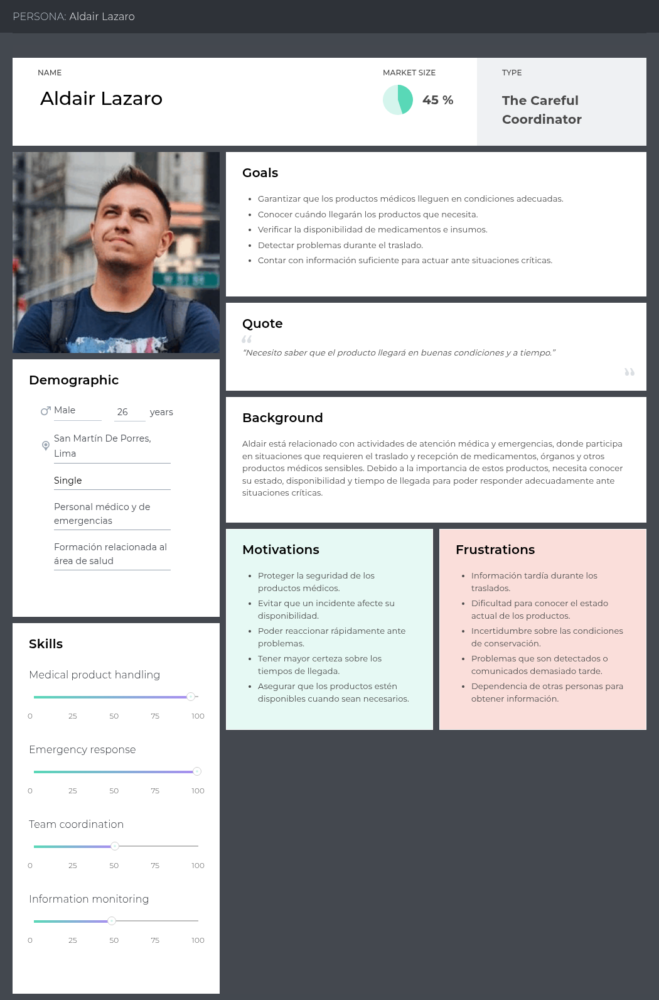
*Nota: Elaboración propia en UXPressia para el Segmento 1 (Operadores de Transporte Asistencial).*

### User Persona 2: Centros de Salud y Cadenas Farmacéuticas
Representa al personal médico y farmacéutico de destino (cirujanos de trasplante, patólogos, directores técnicos de farmacia hospitalaria y auditores de calidad), cuya máxima preocupación es la viabilidad biológica celular y el cumplimiento inexcusable de las directivas sanitarias de DIGEMID.

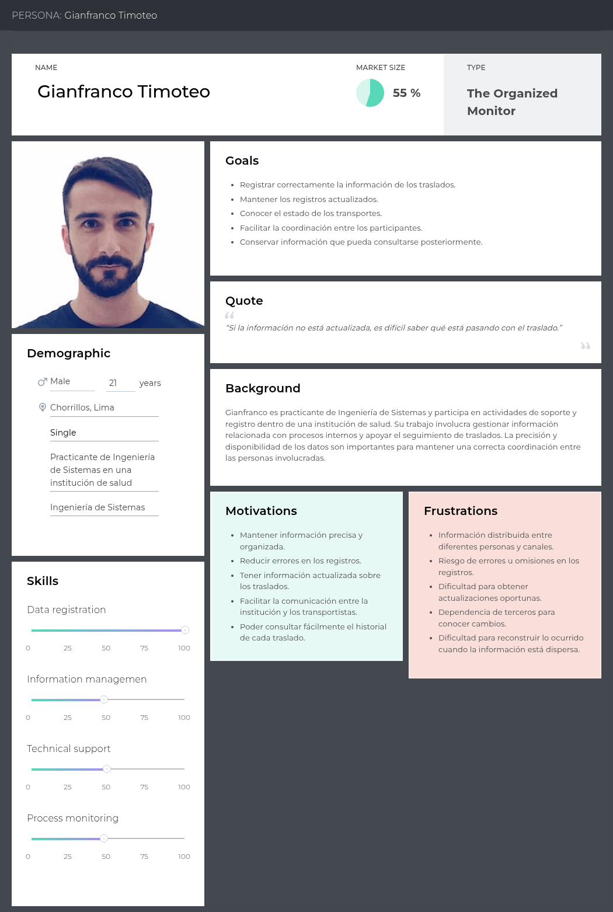
*Nota: Elaboración propia en UXPressia para el Segmento 2 (Centros de Salud y Farmacéuticas).*

***

## 2.3.2. User Task Matrix

La **User Task Matrix** consolida y prioriza las tareas fundamentales que ejecutan los usuarios en el ecosistema de transporte médico, clasificándolas según su frecuencia de ejecución y su nivel de criticidad o impacto para la viabilidad de la carga y el paciente.

| # | Tarea Clave de Usuario | Segmento Principal | Frecuencia | Criticidad / Importancia | Dolor u Oportunidad Asociada |
| :-: | :--- | :--- | :---: | :---: | :--- |
| **T01** | **Monitoreo continuo de temperatura interna del contenedor** | Ambos Segmentos | Alta (Tiempo real) | **Crítica** | Evitar la pérdida irreversible de órganos y hemoderivados por excursiones térmicas inadvertidas. |
| **T02** | **Supervisión de nivel de batería interna y conexión a 12V DC** | Segmento 1 (Ambulancia) | Alta (En ruta) | **Alta** | Prevenir descargas no detectadas por baches o desconexión del cable de 12V en cabina vehicular. |
| **T03** | **Recepción y reconocimiento de alertas críticas en cabina** | Segmento 1 (Ambulancia) | Media / Por excepción | **Crítica** | Proveer alarmas audibles y visuales no intrusivas que permitan actuar sin distraer la conducción. |
| **T04** | **Monitoreo remoto de ruta y tiempo estimado de arribo (ETA)** | Segmento 2 (Hospital) | Alta (En tránsito) | **Alta** | Notificación anticipada (10 min antes) para despejar rampa de trauma shock y alistar quirófano. |
| **T05** | **Desbloqueo seguro de tapa mediante clave dinámica OTP** | Segmento 2 (Receptor) | Baja (Una vez por viaje) | **Crítica** | Garantizar que únicamente el personal médico autorizado acceda a la carga en destino. |
| **T06** | **Firma y validación del acta digital de transferencia de custodia** | Ambos Segmentos | Baja (Cierre de viaje) | **Crítica** | Sustituir actas en papel por registros inmutables con sellado criptográfico para DIGEMID/SUSALUD. |
| **T07** | **Consulta de reportes históricos de excursión térmica para auditoría** | Segmento 2 (Auditoría) | Media (Mensual / Semanal) | **Media-Alta** | Certificar trazabilidad técnica ante auditorías hospitalarias e inspecciones regulatorias. |

***

## 2.3.3. User Journey Mapping

El **User Journey Mapping** ilustra la secuencia de experiencias, emociones, puntos de dolor y oportunidades de interacción de los usuarios arquetípicos a lo largo de las fases de Antes (despacho y pre-enfriamiento), Durante (tránsito y telemetría activa) y Después (entrega asistencial y custodia final).

### User Journey Map 1: Operador de Transporte Asistencial (Paramédico Javier Soto)
Mapea el recorrido desde la recepción de la orden de emergencia, la conexión vehicular del contenedor, la navegación en el tráfico limeño asistido por telemetría IoT, hasta la entrega formal en rampa hospitalaria.

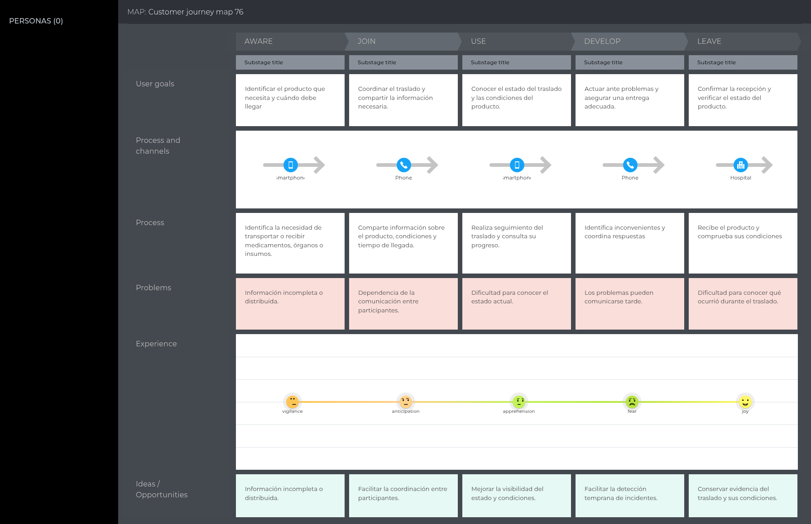
*Nota: Elaboración propia en UXPressia comparando el flujo As-Is (manual con incertidumbre) vs. To-Be (asistido con Medical SMARTBOX).*

### User Journey Map 2: Director Médico / Químico Farmacéutico (Dr. Carlos Mendoza)
Mapea la experiencia desde la coordinación de la solicitud urgente, el seguimiento en tiempo real de la temperatura y el ETA en el portal web, hasta la validación de la carga con token OTP en quirófano.

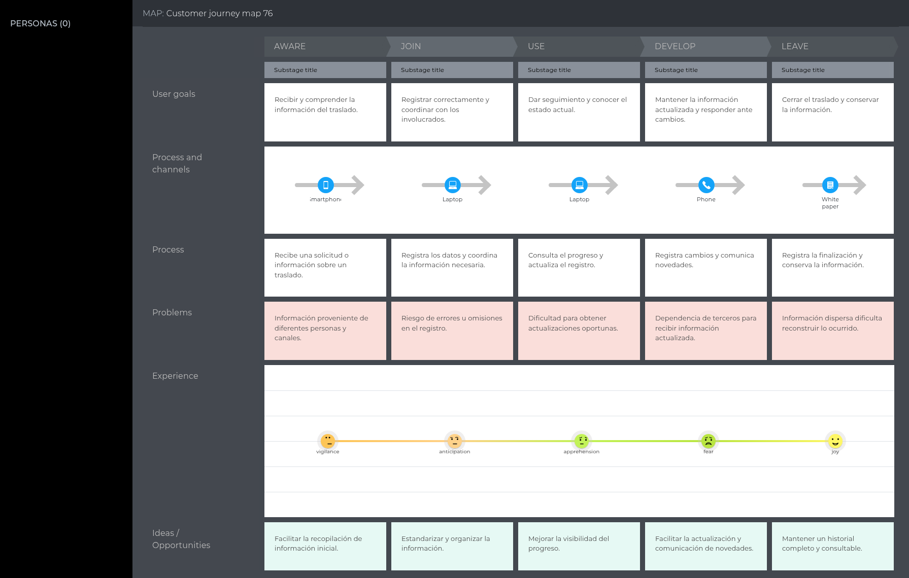
*Nota: Elaboración propia en UXPressia detallando los puntos de contacto clínicos y la mitigación de tiempos muertos.*

***

## 2.3.4. Empathy Mapping

El **Empathy Mapping** profundiza en el modelo mental, aspiraciones, sensaciones y presiones cotidianas de los dos perfiles de usuario, permitiendo diseñar interfaces y flujos de software acordes con su contexto real de trabajo.

### Mapa de Empatía 1: Segmento Transporte y Paramédicos (Javier Soto)

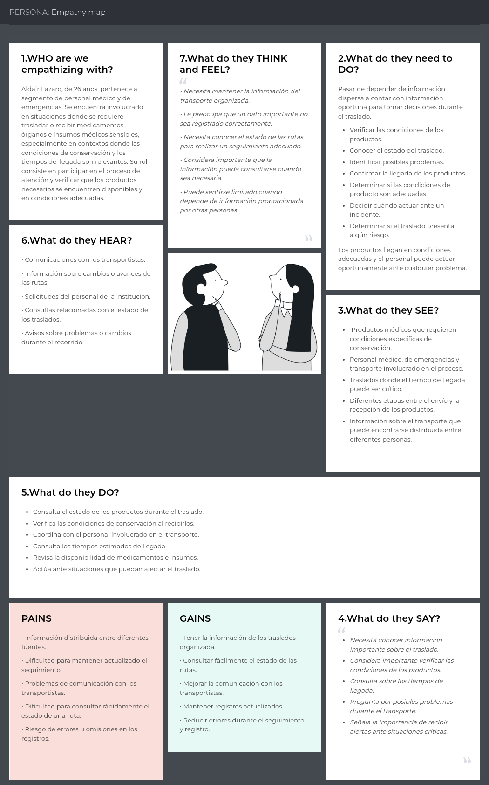
*Nota: Elaboración propia en UXPressia para el perfil operativo de ambulancias.*

* **¿Qué piensa y siente?** Necesidad de proteger la vida del paciente; preocupación constante por quedar atrapado en el tráfico de Javier Prado o la Vía Expresa mientras traslada insumos perecibles; temor a ser culpado si una muestra se degrada sin que él se entere.
* **¿Qué ve?** Congestión vehicular caótica, baches en pistas, conductores que no ceden el paso a la ambulancia, tableros de instrumentos complejos.
* **¿Qué oye?** Sirenas de emergencia, indicaciones por radio de la central 106, quejas de familiares y urgencia del personal médico receptor.
* **¿Qué dice y hace?** Conduce a la defensiva, verifica visualmente los cables cada vez que puede, intenta llegar en el menor tiempo posible sin comprometer la seguridad.
* **Dolores (Pains):** Falta de visibilidad de la temperatura interna sin abrir la tapa; estrés por desconexiones accidentales de 12V.
* **Necesidades (Gains):** Señalización sonora clara y automática en cabina; tranquilidad de saber que la carga se mantiene en rango de 2 °C a 8 °C.

### Mapa de Empatía 2: Segmento Salud y Farmacéutica (Dr. Carlos Mendoza)

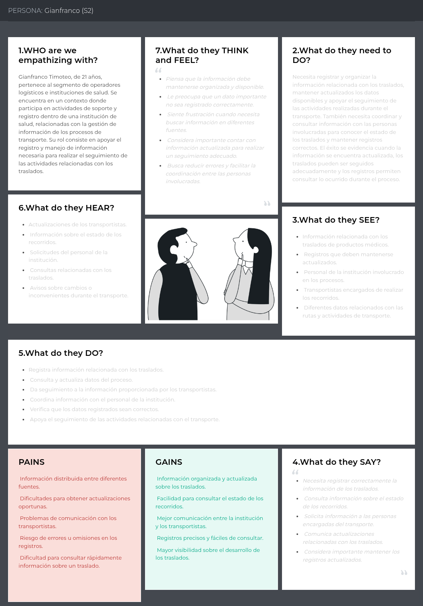
*Nota: Elaboración propia en UXPressia para el perfil clínico de centros hospitalarios.*

* **¿Qué piensa y siente?** Rigor ético y clínico; angustia ante la posibilidad de implantar un tejido dañado; presión por auditorías de DIGEMID y SUSALUD.
* **¿Qué ve?** Pacientes esperando en lista de trasplante; quirófanos con alto costo por minuto; cajas de tecnopor tradicionales con hielo gel sin telemetría.
* **¿Qué oye?** Reclamos por retrasos en cirugías programadas; exigencias regulatorias de trazabilidad documental inmutable.
* **¿Qué dice y hace?** Exige reportes de temperatura antes de aceptar cualquier lote; supervisa personalmente la apertura de contenedores críticos.
* **Dolores (Pains):** Incertidumbre ("caja negra") sobre el trato térmico de la muestra durante el trayecto; pérdida de tiempo por actas manuscritas ilegibles.
* **Necesidades (Gains):** Certificación digital de que la temperatura nunca superó los 8 °C; apertura con token OTP exclusivo y acta PDF con firma criptográfica.

***

### Síntesis de Necesidades Priorizadas

| Prioridad | Necesidad | Criterio de validación |
|:---:|---|---|
| 1 | Conocer condición y ubicación de la carga en tiempo casi real. | El usuario identifica estado, vigencia y riesgo sin recurrir a otro canal. |
| 2 | Recibir alertas accionables y priorizadas. | Cada alerta muestra severidad, causa, impacto, responsable y próximo paso. |
| 3 | Mantener cadena de custodia verificable. | Cada evento registra fecha, hora, actor y evidencia. |
| 4 | Coordinar incidentes en un único flujo. | Se asigna responsable, se registra acción y se confirma resolución. |
| 5 | Cerrar y auditar el traslado. | Se obtiene una línea de tiempo y un reporte de cumplimiento/excepciones. |

<div style="page-break-after: always;"></div>

# 2.4. Big Picture EventStorming

El equipo llevó a cabo una sesión formal de **Big Picture EventStorming** con el objetivo de obtener una visión holística y compartida del dominio de negocio del **Contenedor Médico Inteligente (Smart Medical Container)** para el transporte asistencial de medicamentos termosensibles, hemoderivados, muestras biológicas y órganos en Lima Metropolitana. Bajo los principios y prácticas de *Domain-Driven Design* y la técnica de *EventStorming* propuesta por Alberto Brandolini, la dinámica integró activamente la perspectiva de los dos segmentos objetivo del negocio: **Empresas de Transporte y Operadores Logísticos de Cadena de Frío** (conductores y paramédicos de ambulancia) y **Centros de Salud y Cadenas Farmacéuticas** (coordinadores de despacho, farmacéuticos y médicos receptores), en conjunto con el equipo de ingeniería de software e IoT.

Siguiendo los principios de modelado colaborativo de Brandolini, el Big Picture EventStorming no se diseñó como un diagrama de flujo rígido de ingeniería ni como un BPMN con carriles estructurados, sino como un **lienzo colaborativo de notas adhesivas** en Miro donde el tiempo fluye de manera natural y orgánica de **izquierda a derecha**. A lo largo de la sesión, los participantes exploraron el ciclo de vida completo del transporte médico urgente: desde la solicitud inicial del traslado hasta la recepción conforme en el centro de salud receptor bajo estricta cadena de frío (2 °C a 8 °C según DIGEMID R.M. N° 833-2015/MINSA) y custodia electrónica inmutable.

El taller se desarrolló ejecutando rigurosamente los nueve (9) pasos estructurados del proceso canónico de Big Picture EventStorming documentado por Alberto Brandolini (*Step-by-Step Guide to Run Your Big Picture EventStorming*):

1. **Preparación del Espacio y Materiales (*Preparing the Room*):** Se estructuró un lienzo infinito colaborativo en Miro, eliminando barreras jerárquicas y configurando una superficie de modelado sin límites de anchura, provista de la agenda visual de la sesión y una paleta cromática estandarizada de notas adhesivas digitales.
2. **Dinámica de Activación (*Energizing the Audience*):** Se realizó una breve dinámica de desinhibición y alineación para predisponer activamente al equipo multidisciplinario, articulando la visión operativa de conductores y paramédicos de ambulancia (Segmento 1) con el criterio clínico de médicos cirujanos, químicos farmacéuticos y el equipo de ingeniería de software e IoT (Segmento 2).
3. **Presentación del Alcance, Objetivos y Reglas (*Briefing and Presenting the Plan*):** El facilitador presentó el propósito central del modelado: la preservación inviolable de la cadena de frío (+2 °C a +8 °C bajo normativa DIGEMID R.M. N° 833-2015) y la trazabilidad digital de órganos y hemoderivados frente a la congestión vehicular de Lima Metropolitana, estableciendo las reglas de interacción y respeto por el tiempo cronológico.
4. **Generación Caótica de Eventos de Dominio (*Generating Domain Events*):** Fase divergente de modelado silencioso e individual. Cada participante escribió y pegó de forma libre y masiva en notas adhesivas naranjas (`#FFA500`) todos los eventos relevantes del negocio expresados en tiempo verbal pasado (*Domain Events*), reflejando hitos significativos como `Pre-enfriamiento Peltier estabilizado`, `Excursión térmica incipiente detectada` o `Muestra aceptada formalmente como viable`.
5. **Ordenamiento Cronológico y Detección de Flujos Concurrentes (*Sorting Domain Events*):** Fase convergente de debate intenso. Los participantes organizaron cooperativamente las notas de izquierda a derecha en una línea temporal estricta de extremo a extremo, alineando verticalmente los procesos que ocurren en paralelo (por ejemplo, el control térmico autónomo Peltier ejecutándose concurrentemente mientras el vehículo avanza en el tráfico).
6. **Identificación de Actores y Sistemas Externos (*Adding Actors and External Systems*):** Se incorporaron los roles humanos responsables de gatillar o atender eventos mediante notas amarillas pequeñas (Conductor de Ambulancia, Paramédico TEM, Coordinador de Despacho, Cirujano Receptor), así como los sistemas externos interactuantes en notas azules (Firmware Autónomo ESP32 como nodo IoT Edge emisor, API de Tráfico TomTom, Pasarela SMS Twilio, Registro RENIPRESS / SUSALUD y Sistema HIS / Quirófano Hospitalario receptor).
7. **Narración Cronológica Hacia Adelante (*Storytelling*):** Un facilitador y representantes de ambos segmentos narraron oralmente la historia completa del flujo de negocio de izquierda a derecha. Esta lectura validó la consistencia global del proceso, esclareció supuestos implícitos y permitió identificar fricciones operativas y riesgos reales, señalizados de inmediato con notas magenta/rosa (*Hotspots*).
8. **Narración Inversa y Detección de Brechas (*Reverse Storytelling*):** Se ejecutó una lectura en sentido inverso, comenzando desde el evento final (`Muestra aceptada formalmente como viable` / `Acta final de entrega firmada digitalmente`) y preguntando repetidamente: *¿Qué condición previa tuvo que cumplirse para que ocurriera este hecho?* Este análisis retrospectivo descubrió eventos faltantes de bioseguridad, validaciones de pre-enfriamiento y protocolos de contingencia ante caídas de la toma vehicular de 12V.
9. **Cierre, Consenso y Síntesis de Oportunidades (*Closing and Synthesis*):** Se consolidó el entendimiento compartido del dominio, se extrajo el vocabulario fundamental para la construcción del Lenguaje Ubicuo (Sección 2.5) y se priorizaron en notas verdes las oportunidades de solución de software e IoT (tara automática con celda de carga HX711, algoritmo predictivo de desvíos de ETA y acta digital inmutable con firma QR).

***

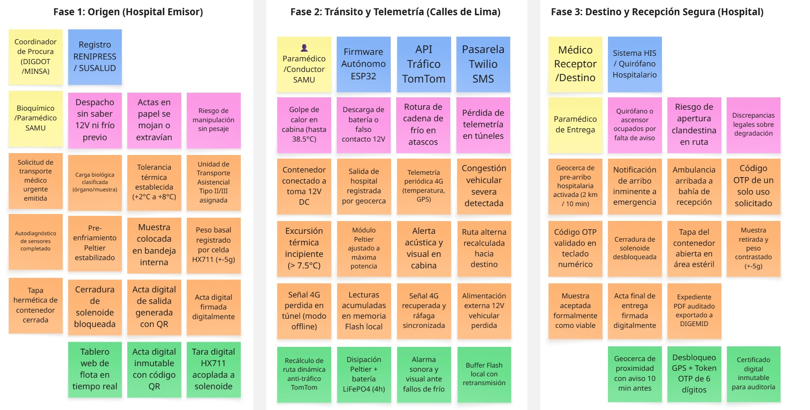  
*Nota: Elaboración propia en Miro según la técnica de modelado colaborativo de Alberto Brandolini para el transporte asistencial de muestras médicas y órganos en Lima Metropolitana.*

***

### **2.4.1. Análisis del Dominio y Hallazgos de la Sesión**

La sesión de Big Picture EventStorming permitió al equipo comprender la dinámica real del transporte médico en Lima Metropolitana y articular las necesidades clínicas con la arquitectura del sistema:

#### 1. Exploración Desestructurada, Línea de Tiempo y Eventos Pivote (Pivotal Events)
El mapeo de eventos evidenció que el transporte asistencial es un proceso altamente concurrente y sensible al tiempo. Mientras el vehículo se desplaza por arterias viales congestionadas de Lima Metropolitana, el hardware del contenedor inteligente ejecuta en paralelo un lazo cerrado autónomo de control térmico (manteniendo la carga entre +2.0 °C y +8.0 °C mediante celdas Peltier), registrando la estabilidad del peso y verificando el precinto de seguridad electromecánico.

Siguiendo el enfoque canónico de modelado colaborativo concebido por Alberto Brandolini, la línea de tiempo temporal se estructura a partir de tres **Eventos Pivote (*Pivotal Events*)** que demarcan formalmente los momentos críticos de quiebre y transición de responsabilidad entre las tres macrofases del sistema:
* **Pivotal Event 1 (Origen → Tránsito):** `Acta digital de salida generada y firmada digitalmente` junto con la `Conexión del contenedor a la toma 12V DC`. Marca la transferencia legal de custodia desde el hospital donante o farmacia central hacia el equipo asistencial móvil, activando el régimen de supervisión telemática en ruta.
* **Pivotal Event 2 (Tránsito → Destino):** `Geocerca de pre-arribo hospitalaria activada`. Disparo telemático automatizado al ingresar al radio de 2 km / 10 minutos del hospital receptor, habilitando la alerta temprana a la rampa de trauma shock y la preparación del equipo médico o farmacéutico receptor.
* **Pivotal Event 3 (Destino → Cierre Clínico):** `Muestra aceptada formalmente como viable`, `Acta final de entrega firmada digitalmente` y `Expediente PDF auditado exportado a DIGEMID`. Cierre definitivo de la cadena de custodia con generación del expediente digital sellado mediante hash criptográfico SHA-256 para auditoría sanitaria de DIGEMID.

#### 2. Matriz de Puntos Críticos (Hotspots) y Oportunidades de Solución

La pizarra colaborativa desarrollada en Miro articula el flujo de izquierda a derecha en tres macrofases espaciales (**1. Origen y Despacho**, **2. Tránsito y Monitoreo Asistencial**, **3. Destino, Custodia y Cierre Clínico**), integrando analíticamente sus seis (6) etapas operativas para brindar una granularidad técnica precisa.

La siguiente matriz sintetiza los problemas operativos reales identificados en la red hospitalaria de Lima y las soluciones de ingeniería de software e IoT implementadas:

<table border="1" cellpadding="3" cellspacing="0" style="border-collapse: collapse; width: 100%; table-layout: fixed; font-size: 7pt; line-height: 1.25; border: 1px solid #cbd5e1; margin: 12px 0;">
<colgroup>
  <col style="width: 14%;" />
  <col style="width: 26%;" />
  <col style="width: 12%;" />
  <col style="width: 28%;" />
  <col style="width: 20%;" />
</colgroup>
  <thead>
    <tr>
      <th>Fase Operativa</th>
      <th>Punto Crítico / Hotspot (Problema Real en Lima)</th>
      <th>Severidad</th>
      <th>Oportunidad de Solución (Software / IoT)</th>
      <th>Subdominio DDD</th>
    </tr>
  </thead>
  <tbody>
    <tr>
      <td><strong>Despacho</strong></td>
      <td>Asignación de ambulancias sin visibilidad del estado de su toma de 12V ni del pre-enfriamiento del contenedor.</td>
      <td>Alta</td>
      <td><strong>Tablero IoT de Estado de Flota:</strong> Supervisión en tiempo real de batería, conexión eléctrica y temperatura previa.</td>
      <td><em>Medical Transport Planning & Dispatching</em></td>
    </tr>
    <tr>
      <td><strong>Carga y Custodia</strong></td>
      <td>Riesgo de sustitución de muestras o carga de paquetes no verificados en la rampa hospitalaria.</td>
      <td>Crítica</td>
      <td><strong>Tara Automática con Celda HX711:</strong> Registro de masa inicial (&plusmn;5 g) y bloqueo automático del solenoide.</td>
      <td><em>Smart Container & Telemetry Monitoring</em></td>
    </tr>
    <tr>
      <td><strong>Carga y Custodia</strong></td>
      <td>Actas en papel autocopiativo mojadas, extraviadas o ilegibles sin respaldo probatorio.</td>
      <td>Media</td>
      <td><strong>Acta Digital con Firma QR:</strong> Comprobante electrónico inalterable consultable en plataforma web.</td>
      <td><em>Chain of Custody & Traceability</em></td>
    </tr>
    <tr>
      <td><strong>Tránsito</strong></td>
      <td><strong>Congestión severa en Lima (TomTom: 34 min/10 km):</strong> Retrasos críticos en Av. Javier Prado o Vía Expresa.</td>
      <td>Crítica</td>
      <td><strong>Motor de ETA Dinámico:</strong> Recálculo de tiempos con TomTom Traffic API cada 60s y alertas de demora.</td>
      <td><em>Medical Transport Planning & Dispatching</em></td>
    </tr>
    <tr>
      <td><strong>Tránsito</strong></td>
      <td><strong>Golpe de calor en cabina (hasta 38.5 &deg;C):</strong> Rompe la cadena de frío en cajas convencionales en &lt;45 min.</td>
      <td>Catastrófica</td>
      <td><strong>Refrigeración Activa Peltier + Alarma Dual:</strong> Control PID (2&ndash;8 &deg;C), alarma sonora local y push a médicos.</td>
      <td><em>Critical Alerting & Incident Response</em></td>
    </tr>
    <tr>
      <td><strong>Tránsito</strong></td>
      <td><strong>Desconexión accidental de 12V:</strong> El enchufe del encendedor se zafa con baches o frenadas.</td>
      <td>Alta</td>
      <td><strong>Conmutación Automática a Batería LiFePO4:</strong> Pack interno LiFePO4 (4h de autonomía) con aviso en cabina.</td>
      <td><em>Smart Container & Telemetry Monitoring</em></td>
    </tr>
    <tr>
      <td><strong>Tránsito</strong></td>
      <td><strong>Pérdida de señal 4G en túneles (Línea Amarilla / zanjas):</strong> Provoca vacíos de datos durante el traslado.</td>
      <td>Alta</td>
      <td><strong>Búfer Flash Offline en ESP32:</strong> Almacenamiento local de 5,000 muestras y sincronización al reconectar.</td>
      <td><em>Smart Container & Telemetry Monitoring</em></td>
    </tr>
    <tr>
      <td><strong>Arribo</strong></td>
      <td>Quirófano o personal de guardia no preparado al llegar la ambulancia por falta de preaviso.</td>
      <td>Alta</td>
      <td><strong>Geocerca de Pre-Arribo (&le; 2 km / 10 min):</strong> Notificación automática al hospital receptor para alistar recepción.</td>
      <td><em>Medical Transport Planning & Dispatching</em></td>
    </tr>
    <tr>
      <td><strong>Entrega</strong></td>
      <td>Apertura indebida en pasillos o entrega a personal no facultado sin validación de identidad.</td>
      <td>Crítica</td>
      <td><strong>Doble Factor de Desbloqueo:</strong> Ubicación obligatoria en geocerca hospitalaria + código OTP temporal.</td>
      <td><em>Chain of Custody & Traceability</em></td>
    </tr>
    <tr>
      <td><strong>Cierre</strong></td>
      <td>Rechazo de lotes o litigios por falta de auditoría continua exigida por DIGEMID (R.M. 833-2015).</td>
      <td>Media</td>
      <td><strong>Expediente Digital con Hash SHA-256:</strong> Reporte PDF descargable con telemetría completa y firmas.</td>
      <td><em>Chain of Custody & Traceability</em></td>
    </tr>
  </tbody>
</table>

***

#### 3. Validación por Storytelling y Reverse Storytelling
La validación del recorrido de extremo a extremo confirmó la coherencia del ciclo asistencial entre ambos segmentos. Mediante la narrativa directa se verificó la transición sin fricciones de custodia entre el médico emisor, el paramédico y el cirujano receptor. Complementariamente, el análisis retrospectivo desde el hito `Muestra aceptada formalmente como viable` (`Acta final de entrega firmada digitalmente`) comprobó que ninguna entrega puede consumarse sin la confluencia de tres condiciones inviolables: desbloqueo por OTP dentro de la geocerca hospitalaria, preservación térmica continua (2 °C a 8 °C) garantizada por el respaldo LiFePO4, y descarga íntegra de la telemetría resguardada en el búfer flash local tras cruzar túneles.

#### 4. Delimitación Preliminar de Contextos Acotados (Bounded Contexts)
La sesión exploratoria preliminar del Big Picture permitió delimitar cinco (5) macro-contextos de negocio, los cuales, durante la fase de descomposición táctica de Design-Level EventStorming (Capítulo 4.6.1), evolucionan naturalmente hacia seis (6) Bounded Contexts al independizar la gestión de suscripciones comerciales y aprovisionamiento de flota (*Subscription & Fleet Provisioning*) del núcleo de autenticación y organizaciones (*IAM*):
1. **Medical Transport Planning & Dispatching:** Gestión de solicitudes de traslado, asignación de unidades móviles/tripulación y cálculo dinámico de rutas anti-tráfico.
2. **Smart Container & Telemetry Monitoring:** Ingestión de telemetría continua (temperatura, peso neto HX711, batería Li-Ion) y control electromecánico de tapa.
3. **Critical Alerting & Incident Response:** Detección en tiempo real de excursiones térmicas, disparador de alarmas acústicas en cabina y notificación de contingencias.
4. **Chain of Custody & Traceability:** Verificación de token OTP en geocerca, registro de actas de custodia y sellado inmutable con hash SHA-256 para DIGEMID (R.M. 833-2015).
5. **Identity, Access & Subscriptions (IAM):** Gestión de instituciones hospitalarias, planes SaaS B2B, autenticación JWT basada en roles y trazabilidad de licencias médicas.

***

### **2.4.2. Flujo Detallado de Comandos, Eventos y Políticas de Dominio**

Para complementar la visión macro del lienzo y facilitar la transición hacia el diseño táctico (DDD) y los contratos de software, a continuación se especifican los artefactos canónicos de la técnica:

#### Leyenda de Modelado

| Elemento | Significado | Ejemplo en el Dominio |
|---|---|---|
| **Actor** | Persona o rol que inicia una intención o toma una decisión. | Coordinador logístico, Paramédico TEM, Cirujano receptor. |
| **Comando** | Intención de acción que busca modificar el estado del sistema. | `AsignarRecursosTraslado`, `RegistrarLecturaTelemetria`. |
| **Evento de Dominio** | Hecho relevante consumado e inmutable expresado en tiempo pasado. | `TrasladoIniciado`, `ExcursionTermicaDetectada`. |
| **Política / Regla** | Reacción automática ante un evento (*Whenever [Event] Then [Action]*). | Si la temperatura supera 8.0 °C por >2 min, emitir alerta crítica. |
| **Read Model** | Proyección de datos optimizada para la toma de decisiones. | Tablero de telemetría en vivo, Línea de tiempo de custodia. |
| **Sistema Externo** | Plataforma de terceros fuera de la frontera transaccional. | GPS / TomTom API, Bróker MQTT, Pasarela Twilio SMS. |
| **Hotspot** | Riesgo operacional, vacío normativo o punto de fricción técnica. | Falla de señal celular 4G en zanjas viales o túneles de Lima. |

#### Flujo Secuencial de Eventos de Extremo a Extremo

<div style="margin: 12px 0 16px 0; width: 100%;">
<table border="1" cellpadding="3" cellspacing="0" style="border-collapse: collapse; width: 100%; table-layout: fixed; font-size: 6.8pt; line-height: 1.25; border: 1px solid #cbd5e1;">
<colgroup>
  <col style="width: 6%;" />
  <col style="width: 20%;" />
  <col style="width: 24%;" />
  <col style="width: 25%;" />
  <col style="width: 25%;" />
</colgroup>
<thead>
<tr style="background-color: #f1f5f9;">
  <th style="border: 1px solid #cbd5e1; padding: 4px; text-align: center; font-weight: bold;">N.°</th>
  <th style="border: 1px solid #cbd5e1; padding: 4px; text-align: left; font-weight: bold;">Actor / Sistema</th>
  <th style="border: 1px solid #cbd5e1; padding: 4px; text-align: left; font-weight: bold;">Comando</th>
  <th style="border: 1px solid #cbd5e1; padding: 4px; text-align: left; font-weight: bold;">Evento de Dominio Resultante</th>
  <th style="border: 1px solid #cbd5e1; padding: 4px; text-align: left; font-weight: bold;">Read Model o Evidencia Generada</th>
</tr>
</thead>
<tbody>
<tr>
  <td style="border: 1px solid #cbd5e1; padding: 3px 4px; text-align: center; font-weight: bold;">1</td>
  <td style="border: 1px solid #cbd5e1; padding: 3px 4px;">Institución de origen</td>
  <td style="border: 1px solid #cbd5e1; padding: 3px 4px; font-weight: 500;">`SolicitarTraslado`</td>
  <td style="border: 1px solid #cbd5e1; padding: 3px 4px;">`TrasladoSolicitado`</td>
  <td style="border: 1px solid #cbd5e1; padding: 3px 4px;">Registro de solicitud con tipo de carga médica, origen, destino y prioridad clínica.</td>
</tr>
<tr>
  <td style="border: 1px solid #cbd5e1; padding: 3px 4px; text-align: center; font-weight: bold;">2</td>
  <td style="border: 1px solid #cbd5e1; padding: 3px 4px;">Coordinador de despacho</td>
  <td style="border: 1px solid #cbd5e1; padding: 3px 4px; font-weight: 500;">`ValidarSolicitud`</td>
  <td style="border: 1px solid #cbd5e1; padding: 3px 4px;">`SolicitudValidada`</td>
  <td style="border: 1px solid #cbd5e1; padding: 3px 4px;">Verificación de viabilidad, disponibilidad horaria y requerimiento térmico (2 °C - 8 °C).</td>
</tr>
<tr>
  <td style="border: 1px solid #cbd5e1; padding: 3px 4px; text-align: center; font-weight: bold;">3</td>
  <td style="border: 1px solid #cbd5e1; padding: 3px 4px;">Coordinador de despacho</td>
  <td style="border: 1px solid #cbd5e1; padding: 3px 4px; font-weight: 500;">`AsignarRecursosTraslado`</td>
  <td style="border: 1px solid #cbd5e1; padding: 3px 4px;">`RecursosAsignados`</td>
  <td style="border: 1px solid #cbd5e1; padding: 3px 4px;">Asignación de unidad móvil, contenedor inteligente y tripulación asistencial.</td>
</tr>
<tr>
  <td style="border: 1px solid #cbd5e1; padding: 3px 4px; text-align: center; font-weight: bold;">4</td>
  <td style="border: 1px solid #cbd5e1; padding: 3px 4px;">Paramédico asistencial</td>
  <td style="border: 1px solid #cbd5e1; padding: 3px 4px; font-weight: 500;">`VerificarPreparacion`</td>
  <td style="border: 1px solid #cbd5e1; padding: 3px 4px;">`PreparacionVerificada`</td>
  <td style="border: 1px solid #cbd5e1; padding: 3px 4px;">Lista de chequeo previa: estado de batería LiFePO4, calibración y conexión 12V.</td>
</tr>
<tr>
  <td style="border: 1px solid #cbd5e1; padding: 3px 4px; text-align: center; font-weight: bold;">5</td>
  <td style="border: 1px solid #cbd5e1; padding: 3px 4px;">Personal médico emisor</td>
  <td style="border: 1px solid #cbd5e1; padding: 3px 4px; font-weight: 500;">`RegistrarCargaYSellar`</td>
  <td style="border: 1px solid #cbd5e1; padding: 3px 4px;">`CargaRegistrada` / `ContenedorSellado`</td>
  <td style="border: 1px solid #cbd5e1; padding: 3px 4px;">Registro de masa inicial en celda HX711 (tara automática) y bloqueo electromecánico de solenoide.</td>
</tr>
<tr>
  <td style="border: 1px solid #cbd5e1; padding: 3px 4px; text-align: center; font-weight: bold;">6</td>
  <td style="border: 1px solid #cbd5e1; padding: 3px 4px;">Paramédico asistencial</td>
  <td style="border: 1px solid #cbd5e1; padding: 3px 4px; font-weight: 500;">`IniciarTraslado`</td>
  <td style="border: 1px solid #cbd5e1; padding: 3px 4px;">`TrasladoIniciado`</td>
  <td style="border: 1px solid #cbd5e1; padding: 3px 4px;">Registro de hora exacta de salida, geocerca inicial y cálculo dinámico de ETA.</td>
</tr>
<tr>
  <td style="border: 1px solid #cbd5e1; padding: 3px 4px; text-align: center; font-weight: bold;">7</td>
  <td style="border: 1px solid #cbd5e1; padding: 3px 4px;">Contenedor IoT (ESP32)</td>
  <td style="border: 1px solid #cbd5e1; padding: 3px 4px; font-weight: 500;">`PublicarTelemetria`</td>
  <td style="border: 1px solid #cbd5e1; padding: 3px 4px;">`TelemetriaRegistrada`</td>
  <td style="border: 1px solid #cbd5e1; padding: 3px 4px;">Ingesta de temperatura ambiente/interna, nivel de batería, estado de tapa y coordenadas GPS.</td>
</tr>
<tr>
  <td style="border: 1px solid #cbd5e1; padding: 3px 4px; text-align: center; font-weight: bold;">8</td>
  <td style="border: 1px solid #cbd5e1; padding: 3px 4px;">Motor de Reglas de Negocio</td>
  <td style="border: 1px solid #cbd5e1; padding: 3px 4px; font-weight: 500;">`EvaluarCondiciones`</td>
  <td style="border: 1px solid #cbd5e1; padding: 3px 4px;">`CondicionEvaluada`</td>
  <td style="border: 1px solid #cbd5e1; padding: 3px 4px;">Validación de cumplimiento estricto del rango térmico e integridad de la ruta.</td>
</tr>
<tr>
  <td style="border: 1px solid #cbd5e1; padding: 3px 4px; text-align: center; font-weight: bold;">9</td>
  <td style="border: 1px solid #cbd5e1; padding: 3px 4px;">Coordinador de despacho</td>
  <td style="border: 1px solid #cbd5e1; padding: 3px 4px; font-weight: 500;">`SupervisarMonitoreo`</td>
  <td style="border: 1px solid #cbd5e1; padding: 3px 4px;">`MonitoreoConfirmado`</td>
  <td style="border: 1px solid #cbd5e1; padding: 3px 4px;">Tablero de control de flota en tiempo real con semaforización de riesgo.</td>
</tr>
<tr>
  <td style="border: 1px solid #cbd5e1; padding: 3px 4px; text-align: center; font-weight: bold;">10</td>
  <td style="border: 1px solid #cbd5e1; padding: 3px 4px;">Conductor de ambulancia</td>
  <td style="border: 1px solid #cbd5e1; padding: 3px 4px; font-weight: 500;">`RegistrarArribo`</td>
  <td style="border: 1px solid #cbd5e1; padding: 3px 4px;">`UnidadArribadaADestino`</td>
  <td style="border: 1px solid #cbd5e1; padding: 3px 4px;">Activación de geocerca hospitalaria de pre-arribo (radio ≤ 2 km / 10 min).</td>
</tr>
<tr>
  <td style="border: 1px solid #cbd5e1; padding: 3px 4px; text-align: center; font-weight: bold;">11</td>
  <td style="border: 1px solid #cbd5e1; padding: 3px 4px;">Cirujano / Farmacéutico receptor</td>
  <td style="border: 1px solid #cbd5e1; padding: 3px 4px; font-weight: 500;">`VerificarCarga`</td>
  <td style="border: 1px solid #cbd5e1; padding: 3px 4px;">`CondicionFinalVerificada`</td>
  <td style="border: 1px solid #cbd5e1; padding: 3px 4px;">Inspección de integridad celular, historial térmico continuo y balance de peso.</td>
</tr>
<tr>
  <td style="border: 1px solid #cbd5e1; padding: 3px 4px; text-align: center; font-weight: bold;">12</td>
  <td style="border: 1px solid #cbd5e1; padding: 3px 4px;">Cirujano / Farmacéutico receptor</td>
  <td style="border: 1px solid #cbd5e1; padding: 3px 4px; font-weight: 500;">`AceptarORechazarEntrega`</td>
  <td style="border: 1px solid #cbd5e1; padding: 3px 4px;">`EntregaAceptada` / `EntregaRechazada`</td>
  <td style="border: 1px solid #cbd5e1; padding: 3px 4px;">Desbloqueo mediante token dinámico OTP en geocerca y registro de observaciones clínicas.</td>
</tr>
<tr>
  <td style="border: 1px solid #cbd5e1; padding: 3px 4px; text-align: center; font-weight: bold;">13</td>
  <td style="border: 1px solid #cbd5e1; padding: 3px 4px;">Coordinador de despacho</td>
  <td style="border: 1px solid #cbd5e1; padding: 3px 4px; font-weight: 500;">`CerrarTraslado`</td>
  <td style="border: 1px solid #cbd5e1; padding: 3px 4px;">`TrasladoCerrado`</td>
  <td style="border: 1px solid #cbd5e1; padding: 3px 4px;">Sellado de la línea de tiempo inmutable de custodia.</td>
</tr>
<tr>
  <td style="border: 1px solid #cbd5e1; padding: 3px 4px; text-align: center; font-weight: bold;">14</td>
  <td style="border: 1px solid #cbd5e1; padding: 3px 4px;">Plataforma Web</td>
  <td style="border: 1px solid #cbd5e1; padding: 3px 4px; font-weight: 500;">`GenerarExpedienteAuditoria`</td>
  <td style="border: 1px solid #cbd5e1; padding: 3px 4px;">`ExpedienteAuditoriaGenerado`</td>
  <td style="border: 1px solid #cbd5e1; padding: 3px 4px;">Exportación de reporte técnico PDF sellado con hash criptográfico SHA-256 para DIGEMID.</td>
</tr>
</tbody>
</table>
</div>

#### Políticas y Rutas Alternativas de Contingencia

* **Desviación Térmica (Excursión Térmica):**
  * *Evento desencadenante:* `TemperaturaFueraDeRango`.
  * *Política reactiva:* Si la temperatura interna excede los 8.0 °C o desciende de 2.0 °C durante más de 120 segundos continuos, disparar de inmediato alerta acústica/visual en cabina vehicular y remitir notificación push de máxima severidad a los médicos del hospital receptor.
  * *Acción correctiva:* Paramédico verifica ventilación y suministro eléctrico del contenedor; se registra la intervención en la bitácora telemática.
* **Pérdida de Conectividad Celular (Túneles y Zonas de Sombra 4G):**
  * *Evento desencadenante:* `TelemetriaInterrumpida`.
  * *Política reactiva:* El microcontrolador ESP32 conmuta autónomamente al búfer de memoria flash interna no volátil (almacenando hasta 5,000 muestras con marca de tiempo del RTC), marcando el read model web con advertencia de última lectura conocida. Al reconectar la red celular 4G, se gatilla `TelemetriaRestablecida` y sincronización secuencial en bloque.
* **Retraso Crítico por Congestión Vehicular:**
  * *Evento desencadenante:* `ETAEscedido`.
  * *Política reactiva:* Reevaluación del tráfico en tiempo real mediante TomTom Traffic API. Si la demora supera los 15 minutos respecto a la ventana de viabilidad del órgano, notificar a la central de despacho para gestionar apoyo vial policial o advertir al equipo quirúrgico receptor.
* **Apertura No Autorizada de Escotilla:**
  * *Evento desencadenante:* `AperturaFueraDeGeocercaDetectada`.
  * *Política reactiva:* Si el sensor magnético detecta separación de la tapa fuera del radio hospitalario autorizado, marcar `CadenaDeCustodiaComprometida`, activar sirena local de seguridad y registrar el incidente con coordenadas geográficas inmediatas.

#### Agregados y Límites del Dominio

| Agregado | Responsabilidad Principal | Eventos de Dominio Clave |
|---|---|---|
| **MedicalTransport** | Orquestar el ciclo de vida del traslado, tripulación, ruta y tiempos comprometidos. | `TrasladoSolicitado`, `TrasladoIniciado`, `UnidadArribadaADestino`, `TrasladoCerrado`. |
| **SmartContainer** | Gestionar el estado operativo del hardware, precinto electromecánico y calibración de sensores. | `ContenedorSellado`, `TapaAperturada`, `SuministroConmutadoLiFePO4`. |
| **MedicalPayload** | Salvaguardar la identificación de la carga biológica, condiciones requeridas y verificación médica. | `CargaRegistrada`, `CondicionFinalVerificada`, `EntregaAceptada`. |
| **TelemetryMonitoring**| Ingestar series temporales de temperatura, humedad, peso neto HX711 y posicionamiento GPS. | `TelemetriaRegistrada`, `CondicionEvaluada`, `MuestraSincronizada`. |
| **IncidentAlert** | Gestionar el ciclo de vida de anomalías térmicas y operativas, asignación de responsables y mitigación. | `AlertaGenerada`, `AccionMitigacionRegistrada`, `IncidenteResuelto`. |
| **ChainOfCustody** | Preservar el registro inmutable de transferencias de custodia con firmas electrónicas y token OTP. | `CustodiaTransferida`, `EntregaConfirmada`, `ActaFirmada`. |

<div style="page-break-after: always;"></div>

# 2.5. Ubiquitous Language

En esta sección se establece el glosario formal de términos y conceptos del dominio del negocio (*Smart Medical Container*), garantizando una comunicación unívoca, rigurosa y libre de ambigüedades entre los dos segmentos clave del negocio (las **empresas de transporte y operadores logísticos de cadena de frío**, y los **centros de salud y cadenas farmacéuticas** receptoras), las entidades reguladoras peruanas (MINSA, DIGEMID, DIGDOT) y el equipo de desarrollo de software.

Conforme a las directrices fundamentales de *Domain-Driven Design* (Eric Evans, Martin Fowler), todos los términos se presentan en idioma inglés con su equivalente formal en español entre paréntesis. Cada definición ha sido redactada rigurosamente desde la perspectiva clínica, operativa y legal del negocio asistencial en Lima Metropolitana, asegurando que el vocabulario permanezca libre de tecnicismos de implementación de software (tales como tablas relacionales, llaves foráneas, APIs, endpoints o controladores).

Cada uno de los 29 términos canónicos se encuentra formalmente circunscrito a su correspondiente *Bounded Context*, garantizando que cada concepto posea una semántica unívoca y bien delimitada dentro de las fronteras transaccionales del dominio. Cabe precisar que la estructuración en cinco (5) Bounded Contexts dentro de este glosario refleja los macro-contextos delimitados durante la fase exploratoria de requisitos del Big Picture (Capítulo 2.4), los cuales evolucionan armónicamente hacia seis (6) Bounded Contexts durante la descomposición de diseño táctico (Capítulo 4.6.1) al independizarse modularmente el aprovisionamiento de flota y suscripciones B2B. A continuación, se presenta la tabla consolidada en orden alfabético estricto (A-Z) como índice lexicográfico de referencia rápida, seguida del desglose analítico detallado por cada subdominio:

| # | Ubiquitous Term (English / Español) | Bounded Context Asociado | Tipo de Artefacto DDD |
|:---:|:---|:---|:---|
| 1 | **Acceptable Temperature Range (Rango Térmico Aceptable)** | Medical Transport Planning & Dispatching | Value Object |
| 2 | **Audit Trail & Digital Manifest (Rastro de Auditoría y Manifiesto Digital)** | Chain of Custody & Traceability | Aggregate Root |
| 3 | **Automated Maintenance and Sensor Calibration (Mantenimiento y Calibración Automatizada)** | Smart Container & Telemetry Monitoring | Domain Policy |
| 4 | **Chain of Custody (Cadena de Custodia Sanitaria)** | Chain of Custody & Traceability | Core Domain / Aggregate Root |
| 5 | **Cold Chain (Cadena de Frío)** | Smart Container & Telemetry Monitoring | Domain Policy |
| 6 | **Cold Ischemia Time (Tiempo de Isquemia Fría)** | Medical Transport Planning & Dispatching | Value Object |
| 7 | **Cold-Chain Deviation Report (Informe de Desviación de Cadena de Frío)** | Critical Alerting & Incident Response | Read Model / Domain Report |
| 8 | **Container Autonomy and Telemetry (Telemetría y Autonomía del Contenedor)** | Smart Container & Telemetry Monitoring | Entity / Value Object |
| 9 | **Container Lid Status & Tamper-Evident Lock (Estado de Tapa y Bloqueo Electromecánico de Custodia)** | Smart Container & Telemetry Monitoring | Entity |
| 10 | **Critical Operational Alert & Acknowledgment (Alerta Operativa Crítica y Acuse de Recibo)** | Critical Alerting & Incident Response | Aggregate Root / Entity |
| 11 | **Custody Handover Act (Acta de Entrega y Trazabilidad de Custodia)** | Chain of Custody & Traceability | Aggregate Root |
| 12 | **Dynamic Route ETA (Tiempo Estimado de Llegada Dinámico)** | Medical Transport Planning & Dispatching | Value Object |
| 13 | **Emergency Medical Crew (Tripulación Asistencial y Paramédica)** | Medical Transport Planning & Dispatching | Entity |
| 14 | **Fleet Container Provisioning (Aprovisionamiento y Vinculación de Flota)** | Identity, Access & Subscriptions (IAM) | Domain Policy / Entity |
| 15 | **Healthcare & Pharmaceutical Client (Centro de Salud y Cadena Farmacéutica)** | Identity, Access & Subscriptions (IAM) | Aggregate Root |
| 16 | **Hospital Geofence (Geocerca Hospitalaria)** | Identity, Access & Subscriptions (IAM) | Value Object |
| 17 | **Hospital Pre-Arrival Notice (Aviso de Pre-Arribo Hospitalario)** | Critical Alerting & Incident Response | Domain Event |
| 18 | **Logistics Transport Unit (Unidad de Transporte y Ambulancia Logística)** | Medical Transport Planning & Dispatching | Entity |
| 19 | **Medical and Biological Payload (Carga Médica y Biológica)** | Medical Transport Planning & Dispatching | Value Object |
| 20 | **One-Time Password / Unlock Token (Clave OTP / Token de Desbloqueo Temporal)** | Chain of Custody & Traceability | Value Object |
| 21 | **Procurement & Dispatch Coordinator (Coordinador de Procura y Despacho Asistencial)** | Medical Transport Planning & Dispatching | Entity |
| 22 | **Receiving Medical Custodian (Custodio Médico Receptor)** | Chain of Custody & Traceability | Value Object |
| 23 | **SaaS Subscription Plan (Plan de Suscripción SaaS B2B)** | Identity, Access & Subscriptions (IAM) | Aggregate Root |
| 24 | **Smart Medical Container (Contenedor Médico Inteligente)** | Smart Container & Telemetry Monitoring | Aggregate Root |
| 25 | **Tare Weight & Net Weight (Peso Tara y Peso Neto)** | Smart Container & Telemetry Monitoring | Value Object |
| 26 | **Thermal Excursion (Excursión Térmica)** | Critical Alerting & Incident Response | Domain Event / Aggregate Root |
| 27 | **Transport Mission / Emergency Transport Order (Misión de Transporte Asistido / Orden de Traslado de Emergencia)** | Medical Transport Planning & Dispatching | Aggregate Root |
| 28 | **Vehicle Telematics and Auxiliary Power (Telemática Vehicular y Alimentación Auxiliar)** | Smart Container & Telemetry Monitoring | Value Object / Domain Event |
| 29 | **Weight-Based Medical Stock (Stock Médico Ponderal)** | Smart Container & Telemetry Monitoring | Value Object |

***

### **2.5.1. Bounded Context: Identity, Access & Subscriptions (IAM)**

<table border="1" cellpadding="6" cellspacing="0">
  <thead>
    <tr>
      <th>Ubiquitous Term</th>
      <th>Domain Definition</th>
      <th>Role in the System &amp; DDD Mapping</th>
    </tr>
  </thead>
  <tbody>
    <tr>
      <td><strong>Healthcare &amp; Pharmaceutical Client (Centro de Salud y Cadena Farmacéutica)</strong></td>
      <td>Entidad pública o privada del sector salud o farmacéutico (hospital nacional, clínica privada, instituto especializado, laboratorio clínico o cadena farmacéutica) facultada legalmente para actuar como centro emisor o receptor de insumos médicos críticos, medicamentos termosensibles, hemoderivados u órganos bajo estricta cadena de frío.</td>
      <td><strong>Aggregate Root:</strong> <code>HospitalInstitution</code><br><em>Bounded Context:</em> Identity, Access &amp; Subscriptions (IAM)</td>
    </tr>
    <tr>
      <td><strong>Hospital Geofence (Geocerca Hospitalaria)</strong></td>
      <td>Perímetro geográfico virtual delimitado alrededor de la institución de salud receptora (típicamente con un radio de 2 km / 10 min), cuyo traspaso por la ambulancia activa automáticamente los protocolos de pre-arribo y habilita la autorización del desbloqueo digital.</td>
      <td><strong>Value Object:</strong> <code>GeoFence</code> en <code>HospitalInstitution</code><br><em>Bounded Context:</em> Identity, Access &amp; Subscriptions (IAM)</td>
    </tr>
    <tr>
      <td><strong>SaaS Subscription Plan (Plan de Suscripción SaaS B2B)</strong></td>
      <td>Acuerdo comercial formal y recurrente entre la plataforma Medical SMARTBOX y la institución de salud o empresa de ambulancias, que establece la cuota máxima de contenedores médicos autorizados en flota (Small Box de 5L vs. Standard Box de 20L), niveles de servicio de soporte y acceso multi-inquilino al portal de trazabilidad.</td>
      <td><strong>Aggregate Root:</strong> <code>SubscriptionPlan</code><br><em>Bounded Context:</em> Identity, Access &amp; Subscriptions (IAM)</td>
    </tr>
    <tr>
      <td><strong>Fleet Container Provisioning (Aprovisionamiento y Vinculación de Flota)</strong></td>
      <td>Proceso técnico y administrativo mediante el cual se activa, calibra y asocia un Contenedor Médico Inteligente a la flota de una institución acreditada, vinculando su número de serie de fábrica a los límites de membresía contratados.</td>
      <td><strong>Domain Policy / Entity:</strong> <code>ContainerProvisioning</code> en <code>SmartContainer</code><br><em>Bounded Context:</em> Identity, Access &amp; Subscriptions (IAM)</td>
    </tr>
  </tbody>
</table>

***

### **2.5.2. Bounded Context: Medical Transport Planning & Dispatching**

<table border="1" cellpadding="6" cellspacing="0">
  <thead>
    <tr>
      <th>Ubiquitous Term</th>
      <th>Domain Definition</th>
      <th>Role in the System &amp; DDD Mapping</th>
    </tr>
  </thead>
  <tbody>
    <tr>
      <td><strong>Acceptable Temperature Range (Rango Térmico Aceptable)</strong></td>
      <td>Intervalo estricto de temperatura de preservación bioambiental fijado por las Buenas Prácticas de Almacenamiento y Transporte de DIGEMID (+2.0 °C a +8.0 °C para medicamentos biológicos, vacunas y hemoderivados; y +2.0 °C a +4.0 °C para órganos de donante cadavérico), dentro del cual se garantiza la estabilidad farmacológica y viabilidad tisular de la carga.</td>
      <td><strong>Value Object:</strong> <code>TemperatureRange</code> en <code>TransportOrder</code><br><em>Bounded Context:</em> Medical Transport Planning &amp; Dispatching</td>
    </tr>
    <tr>
      <td><strong>Cold Ischemia Time (Tiempo de Isquemia Fría)</strong></td>
      <td>Intervalo de tiempo fisiológico máximo que un órgano para trasplante puede permanecer sin irrigación sanguínea en preservación hipotérmica (desde el clampado aórtico en el hospital donante hasta su revascularización en quirófano) antes de sufrir necrosis tisular irreversible, gobernado por la Directiva Sanitaria N° 152/DIGDOT.</td>
      <td><strong>Value Object:</strong> <code>IschemiaTimeLimit</code> en <code>TransportOrder</code><br><em>Bounded Context:</em> Medical Transport Planning &amp; Dispatching</td>
    </tr>
    <tr>
      <td><strong>Dynamic Route ETA (Tiempo Estimado de Llegada Dinámico)</strong></td>
      <td>Cálculo predictivo continuo de la duración remanente y la hora exacta de arribo de la ambulancia al hospital de destino, ajustado dinámicamente según las variaciones del flujo vehicular, congestión e incidentes de tránsito en los corredores hospitalarios de Lima Metropolitana.</td>
      <td><strong>Value Object:</strong> <code>RouteProgress</code> en la Entidad <code>TransportRoute</code><br><em>Bounded Context:</em> Medical Transport Planning &amp; Dispatching</td>
    </tr>
    <tr>
      <td><strong>Emergency Medical Crew (Tripulación Asistencial y Paramédica)</strong></td>
      <td>Personal asistencial calificado (paramédicos, enfermeros o conductores de emergencias médicas) encargado de la operación en ruta, conexión del contenedor a la toma 12V del vehículo asistencial y custodia física directa durante el traslado de urgencia.</td>
      <td><strong>Entity:</strong> <code>CrewMember</code> en <code>DispatchTrip</code><br><em>Bounded Context:</em> Medical Transport Planning &amp; Dispatching</td>
    </tr>
    <tr>
      <td><strong>Logistics Transport Unit (Unidad de Transporte y Ambulancia Logística)</strong></td>
      <td>Vehículo terrestre de transporte especializado (ambulancia asistencial Tipo II/III o furgón logístico climatizado) operado por empresas de transporte y operadores logísticos de cadena de frío, equipado con soporte eléctrico continuo de 12V en cabina y sistema telemático de navegación para el Contenedor Médico Inteligente.</td>
      <td><strong>Entity:</strong> <code>VehicleBinding</code> asociada al Agregado <code>DispatchTrip</code><br><em>Bounded Context:</em> Medical Transport Planning &amp; Dispatching</td>
    </tr>
    <tr>
      <td><strong>Medical and Biological Payload (Carga Médica y Biológica)</strong></td>
      <td>Conjunto de insumos terapéuticos y biológicos altamente termosensibles y críticos trasladados en la unidad de transporte asistido, que comprende órganos sólidos para trasplante (corazón, riñón, hígado), tejidos humanos, componentes sanguíneos (paquetes globulares, plasma), vacunas e inmunobiológicos, y medicamentos de alto costo sujetos a rigurosos límites de supervivencia biológica.</td>
      <td><strong>Value Object:</strong> <code>BiologicalPayload</code> encapsulado en <code>TransportOrder</code><br><em>Bounded Context:</em> Medical Transport Planning &amp; Dispatching</td>
    </tr>
    <tr>
      <td><strong>Procurement &amp; Dispatch Coordinator (Coordinador de Procura y Despacho Asistencial)</strong></td>
      <td>Profesional asistencial o logístico (adscrito a DIGDOT, MINSA o a la central de despacho del operador de transporte) facultado para autorizar la misión de traslado, evaluar la disponibilidad de unidades móviles climatizadas y emitir la orden formal de transporte de órganos o hemoderivados.</td>
      <td><strong>Entity:</strong> <code>DispatchCoordinator</code> en <code>TransportOrder</code><br><em>Bounded Context:</em> Medical Transport Planning &amp; Dispatching</td>
    </tr>
    <tr>
      <td><strong>Transport Mission / Emergency Transport Order (Misión de Transporte Asistido / Orden de Traslado de Emergencia)</strong></td>
      <td>Operación asistencial protocolizada de traslado médico entre un centro de salud o almacén farmacéutico de origen y una institución de destino, gobernada por una ventana temporal crítica, una tripulación técnica asignada y directivas estrictas de conservación bioambiental.</td>
      <td><strong>Aggregate Root:</strong> <code>DispatchTrip</code><br><em>Bounded Context:</em> Medical Transport Planning &amp; Dispatching</td>
    </tr>
  </tbody>
</table>

***

### **2.5.3. Bounded Context: Smart Container & Telemetry Monitoring**

<table border="1" cellpadding="6" cellspacing="0">
  <thead>
    <tr>
      <th>Ubiquitous Term</th>
      <th>Domain Definition</th>
      <th>Role in the System &amp; DDD Mapping</th>
    </tr>
  </thead>
  <tbody>
    <tr>
      <td><strong>Automated Maintenance and Sensor Calibration (Mantenimiento y Calibración Automatizada)</strong></td>
      <td>Protocolo de diagnóstico predictivo y continuo ejecutado de forma autónoma por el contenedor inteligente y la plataforma de monitoreo asistencial para supervisar el desgaste de la celda Peltier, la deriva de calibración de la celda de carga HX711 y los ciclos de vida útil de la batería interna LiFePO4, programando órdenes de servicio preventivo antes de que ocurra una falla operativa en ruta.</td>
      <td><strong>Domain Policy:</strong> <code>PreventiveMaintenancePolicy</code><br><em>Bounded Context:</em> Smart Container &amp; Telemetry Monitoring</td>
    </tr>
    <tr>
      <td><strong>Cold Chain (Cadena de Frío)</strong></td>
      <td>Proceso logístico ininterrumpido de control y supervisión ambiental que asegura que los insumos biológicos y farmacéuticos se mantengan dentro de los intervalos térmicos normativos reglamentados por el MINSA y la DIGEMID (+2 °C a +4 °C para órganos; +2 °C a +8 °C para hemoderivados y vacunas) durante todas las etapas de custodia y desplazamiento en ambulancia.</td>
      <td><strong>Domain Policy:</strong> <code>ColdChainPreservationPolicy</code><br><em>Bounded Context:</em> Smart Container &amp; Telemetry Monitoring</td>
    </tr>
    <tr>
      <td><strong>Container Autonomy and Telemetry (Telemetría y Autonomía del Contenedor)</strong></td>
      <td>Flujo periódico de mediciones físicas directas (temperatura interna de cámara, peso en bandeja, estado del sensor magnético de tapa, voltaje y porcentaje de carga de la batería interna LiFePO4) transmitidas de forma continua para garantizar que el soporte térmico se mantenga activo aun ante desconexiones de la red de la ambulancia.</td>
      <td><strong>Entity:</strong> <code>TelemetryLog</code> / <strong>Value Object:</strong> <code>TelemetrySnapshot</code><br><em>Bounded Context:</em> Smart Container &amp; Telemetry Monitoring</td>
    </tr>
    <tr>
      <td><strong>Container Lid Status &amp; Tamper-Evident Lock (Estado de Tapa y Bloqueo Electromecánico de Custodia)</strong></td>
      <td>Supervisión continua del sellado hermético superior (contacto magnético) y cerrojo electromecánico de alta retención comandado por solenoide, que previene la apertura no autorizada de la tapa durante el tránsito de la ambulancia y habilita su liberación física únicamente cuando el vehículo ingresa a la geocerca hospitalaria de destino y el personal facultado valida su identidad mediante un código OTP de un solo uso.</td>
      <td><strong>Entity:</strong> <code>ElectromechanicalLock</code> subordinada a <code>SmartContainer</code><br><em>Bounded Context:</em> Smart Container &amp; Telemetry Monitoring</td>
    </tr>
    <tr>
      <td><strong>Smart Medical Container (Contenedor Médico Inteligente)</strong></td>
      <td>Unidad física móvil e isotérmica de grado clínico instalada en el transporte asistido, disponible en diversos factores de forma y capacidades volumétricas modulares según los requisitos de carga, dotada de aislamiento térmico de alta densidad, alimentación energética dual (red fija y toma vehicular de 12V), instrumentación de medición bioambiental continua y mecanismo de cierre electromecánico de seguridad.</td>
      <td><strong>Aggregate Root:</strong> <code>SmartContainer</code><br><em>Bounded Context:</em> Smart Container &amp; Telemetry Monitoring</td>
    </tr>
    <tr>
      <td><strong>Tare Weight &amp; Net Weight (Peso Tara y Peso Neto)</strong></td>
      <td>Procedimiento metrológico de calibración en origen mediante el cual se descuenta la masa basal del contenedor vacío y sus componentes de fijación (tara), permitiendo cuantificar con precisión (&plusmn;5 g) la masa neta de la carga biológica para detectar variaciones por fugas, sustracción o reemplazo clandestino durante el traslado.</td>
      <td><strong>Value Object:</strong> <code>ContainerWeightMetrics</code> en <code>SmartContainer</code><br><em>Bounded Context:</em> Smart Container &amp; Telemetry Monitoring</td>
    </tr>
    <tr>
      <td><strong>Vehicle Telematics and Auxiliary Power (Telemática Vehicular y Alimentación Auxiliar)</strong></td>
      <td>Parámetros operativos capturados desde la unidad móvil de transporte asistencial (estado de suministro eléctrico continuo de 12V en cabina, velocidad de desplazamiento y coordenadas geográficas en tiempo real) que permiten supervisar la estabilidad energética del contenedor y predecir los tiempos de traslado en la red vial de Lima Metropolitana.</td>
      <td><strong>Value Object:</strong> <code>AuxiliaryPowerTelemetry</code> / <strong>Domain Event:</strong> <code>ExternalPowerLost</code><br><em>Bounded Context:</em> Smart Container &amp; Telemetry Monitoring</td>
    </tr>
    <tr>
      <td><strong>Weight-Based Medical Stock (Stock Médico Ponderal)</strong></td>
      <td>Estimación cuantitativa en tiempo real de la cantidad de medicamentos, ampollas o insumos almacenados dentro del compartimento, calculada a partir de las variaciones de masa registradas continuamente por la celda de carga de precisión, permitiendo prevenir desabastecimientos en ruta o sustracciones clandestinas.</td>
      <td><strong>Value Object:</strong> <code>PayloadWeight</code> (Invariante de peso en <code>SmartContainer</code>)<br><em>Bounded Context:</em> Smart Container &amp; Telemetry Monitoring</td>
    </tr>
  </tbody>
</table>

***

### **2.5.4. Bounded Context: Critical Alerting & Incident Response**

<table border="1" cellpadding="6" cellspacing="0">
  <thead>
    <tr>
      <th>Ubiquitous Term</th>
      <th>Domain Definition</th>
      <th>Role in the System &amp; DDD Mapping</th>
    </tr>
  </thead>
  <tbody>
    <tr>
      <td><strong>Cold-Chain Deviation Report (Informe de Desviación de Cadena de Frío)</strong></td>
      <td>Acta técnico-sanitaria de notificación obligatoria emitida automáticamente cuando se constata una excursión térmica no mitigada durante el traslado en ambulancia, documentando la integral tiempo-temperatura del evento para sustentar formalmente el descarte, reemplazo o cuarentena preventiva del lote médico ante auditorías de DIGEMID y DIGDOT.</td>
      <td><strong>Read Model / Domain Report:</strong> <code>ColdChainDeviationReport</code><br><em>Bounded Context:</em> Critical Alerting &amp; Incident Response</td>
    </tr>
    <tr>
      <td><strong>Critical Operational Alert &amp; Acknowledgment (Alerta Operativa Crítica y Acuse de Recibo)</strong></td>
      <td>Notificación de alta prioridad y respuesta inmediata ante contingencias en ruta (excursiones térmicas, desconexión vehicular de 12V, apertura indebida o anomalías ponderales), que combina avisos acústico-visuales en la cabina asistencial y alertas digitales a la central médica, requiriendo que la tripulación confirme manualmente su recepción en un plazo no mayor a 2 minutos para coordinar el plan de contingencia.</td>
      <td><strong>Aggregate Root:</strong> <code>CriticalIncident</code> / <strong>Entity:</strong> <code>ContingencyResolution</code><br><em>Bounded Context:</em> Critical Alerting &amp; Incident Response</td>
    </tr>
    <tr>
      <td><strong>Hospital Pre-Arrival Notice (Aviso de Pre-Arribo Hospitalario)</strong></td>
      <td>Comunicación protocolar preventiva enviada automáticamente al equipo médico y quirúrgico del hospital receptor cuando la ambulancia se encuentra a una proximidad crítica (10 minutos de arribo o cruce de geocerca), facilitando el alistamiento de quirófano, esterilización de instrumental y despeje de rampas de trauma shock.</td>
      <td><strong>Domain Event:</strong> <code>HospitalPreArrivalTriggered</code><br><em>Bounded Context:</em> Critical Alerting &amp; Incident Response</td>
    </tr>
    <tr>
      <td><strong>Thermal Excursion (Excursión Térmica)</strong></td>
      <td>Incidente crítico originado cuando la temperatura interna de la cámara del contenedor traspasa los márgenes de seguridad normativos durante un tiempo mayor a la tolerancia asistencial permitida, comprometiendo la estabilidad fisicoquímica o viabilidad celular del insumo y tipificándose como una no conformidad sanitaria grave.</td>
      <td><strong>Domain Event:</strong> <code>ThermalExcursionDetected</code> / <strong>Aggregate Root:</strong> <code>CriticalIncident</code><br><em>Bounded Context:</em> Critical Alerting &amp; Incident Response</td>
    </tr>
  </tbody>
</table>

***

### **2.5.5. Bounded Context: Chain of Custody & Traceability**

<table border="1" cellpadding="6" cellspacing="0">
  <thead>
    <tr>
      <th>Ubiquitous Term</th>
      <th>Domain Definition</th>
      <th>Role in the System &amp; DDD Mapping</th>
    </tr>
  </thead>
  <tbody>
    <tr>
      <td><strong>Audit Trail &amp; Digital Manifest (Rastro de Auditoría y Manifiesto Digital)</strong></td>
      <td>Secuencia ininterrumpida y cronológica de evidencias físicas, temporales y ambientales registradas durante toda la misión de transporte, compilada al cierre en un acta o expediente digital sellado criptográficamente que acredita ante los auditores de DIGEMID, DIGDOT y SUSALUD que la custodia médica nunca fue vulnerada.</td>
      <td><strong>Aggregate Root:</strong> <code>DigitalAuditManifest</code><br><em>Bounded Context:</em> Chain of Custody &amp; Traceability</td>
    </tr>
    <tr>
      <td><strong>Chain of Custody (Cadena de Custodia Sanitaria)</strong></td>
      <td>Registro documental, físico y legal continuo e inalterable que certifica la tenencia, ubicación, trazabilidad horaria, eventos de manipulación y curvas bioambientales de la carga médica desde el centro donante o farmacia de origen hasta su recepción definitiva.</td>
      <td><strong>Core Bounded Context:</strong> Chain of Custody &amp; Traceability<br><em>Aggregate Root:</em> <code>CustodyTransfer</code></td>
    </tr>
    <tr>
      <td><strong>Custody Handover Act (Acta de Entrega y Trazabilidad de Custodia)</strong></td>
      <td>Documento protocolar formal generado al término del traslado asistencial, donde la tripulación paramédica y el equipo médico receptor rubrican mancomunadamente la conformidad del estado físico, el balance de stock y el dictamen de viabilidad biológica con el respaldo de la curva térmica completa del trayecto.</td>
      <td><strong>Aggregate Root:</strong> <code>CustodyTransfer</code><br><em>Bounded Context:</em> Chain of Custody &amp; Traceability</td>
    </tr>
    <tr>
      <td><strong>One-Time Password / Unlock Token (Clave OTP / Token de Desbloqueo Temporal)</strong></td>
      <td>Clave numérica efímera de seguridad clínica generada dinámicamente por la plataforma y transmitida exclusivamente al médico receptor facultado, cuya introducción en el panel de control del contenedor condiciona la liberación del solenoide físico de la tapa únicamente cuando la ambulancia se encuentra dentro de la geocerca hospitalaria autorizada de destino.</td>
      <td><strong>Value Object:</strong> <code>OtpToken</code> encapsulado en <code>CustodyTransfer</code><br><em>Bounded Context:</em> Chain of Custody &amp; Traceability</td>
    </tr>
    <tr>
      <td><strong>Receiving Medical Custodian (Custodio Médico Receptor)</strong></td>
      <td>Profesional de la salud facultado en el establecimiento hospitalario o farmacia de destino (cirujano de trasplantes, médico de emergencia o químico farmacéutico responsable) habilitado para recibir la clave OTP, constatar la viabilidad clínica y formalizar el acta de conformidad.</td>
      <td><strong>Value Object:</strong> <code>ReceivingPhysician</code> en <code>CustodyTransfer</code><br><em>Bounded Context:</em> Chain of Custody &amp; Traceability</td>
    </tr>
  </tbody>
</table>

<div style="page-break-after: always;"></div>

# 3.1. User Stories

En esta sección se detallan las 18 historias de usuario (User Stories) que estructuran el alcance funcional del ecosistema **NeonCode**. La especificación abarca la aplicación web responsive de monitoreo, el sitio web público (Landing Page) y la interfaz de servicios backend (RESTful API) para la supervisión en tiempo real de contenedores médicos inteligentes instalados en ambulancias.

Todos los criterios de aceptación siguen la especificación **Gherkin** (Dado que / Cuando / Entonces), redactados en tercera persona, tiempo presente y enfocados en las reglas de negocio del dominio de salud y logística médica, omitiendo referencias a elementos de interfaz de usuario.

| Epic / Story ID | Título | Descripción | Criterios de Aceptación | Relacionado con (Epic ID) |
| :--- | :--- | :--- | :--- | :--- |
| **EP01** | Identity & Access Management | Épica destinada a la gestión de accesos, roles, autenticación segura y perfiles de instituciones de salud. | N/A | N/A |
| **US01** | Registro de Institución de Salud | Como supervisor hospitalario, deseo registrar mi centro médico en la plataforma NeonCode para gestionar la flota de ambulancias y contenedores. | **Dado que** la institución de salud no cuenta con una cuenta activa,<br>**Cuando** proporciona el registro institucional y credenciales de acceso válidas,<br>**Entonces** el sistema genera la cuenta corporativa y notifica la activación del perfil. | EP01 |
| **US02** | Autenticación de Personal de Emergencia | Como personal médico de emergencia, deseo autenticarme en la aplicación web para acceder al estado de la carga transportada en tiempo real. | **Dado que** el usuario médico cuenta con credenciales activas,<br>**Cuando** ingresa sus datos de acceso autorizados,<br>**Entonces** el sistema valida la identidad y concede acceso al panel de supervisión. | EP01 |
| **US03** | Endpoint de Autenticación de Usuarios (API) | Como Developer, deseo disponer de un endpoint POST `/api/v1/authentication/sign-in` para validar credenciales y emitir tokens de sesión. | **Dado que** la aplicación cliente envía una solicitud POST con credenciales válidas,<br>**Cuando** la API procesa la autenticación,<br>**Entonces** responde con código HTTP 200 y el token JWT de sesión.<br><br>**Dado que** el cliente envía datos de acceso inválidos,<br>**Cuando** la API procesa la petición,<br>**Entonces** responde con un código HTTP 401 Unauthorized. | EP01 |
| **EP02** | Landing Page & Brand Awareness | Épica orientada a la difusión de la propuesta de valor y captura de prospectos del sector salud. | N/A | N/A |
| **US04** | Exploración de Propuesta de Valor Logística | Como visitante comercial, deseo consultar las capacidades de los contenedores inteligentes en el Landing Page para evaluar su implementación. | **Dado que** el visitante navega en el sitio principal de NeonCode,<br>**Cuando** explora la sección de soluciones para transporte médico,<br>**Entonces** el sistema despliega las especificaciones térmicas, de trazabilidad y planes de servicio. | EP02 |
| **US05** | Solicitud de Demostración Corporativa | Como visitante comercial, deseo enviar un formulario de contacto para solicitar una demostración del sistema en mi centro hospitalario. | **Dado que** el visitante completa sus datos institucionales de contacto,<br>**Cuando** efectúa el envío del formulario,<br>**Entonces** el sistema registra el prospecto y despacha un correo de confirmación al usuario. | EP02 |
| **US06** | Consulta de Preguntas Frecuentes | Como visitante comercial, deseo revisar la sección de FAQ en el Landing Page para resolver dudas sobre la integración IoT en ambulancias. | **Dado que** el visitante ingresa al centro de ayuda del sitio web,<br>**Cuando** selecciona la categoría de hardware y sensores IoT,<br>**Entonces** el sistema muestra las respuestas estructuradas sobre la cadena de frío y conectividad. | EP02 |
| **EP03** | Container & Ambulance Provisioning | Épica para el alta, configuración y vinculación de contenedores IoT y unidades de ambulancia. | N/A | N/A |
| **US07** | Alta de Unidades de Ambulancia | Como operador logístico de salud, deseo registrar vehículos de transporte en el sistema para asociarles contenedores de insumos. | **Dado que** el operador logístico ha iniciado sesión,<br>**Cuando** ingresa los datos de identificación y matrícula de la ambulancia,<br>**Entonces** el sistema registra el vehículo en el inventario activo de la institución. | EP03 |
| **US08** | Vinculación de Contenedor Inteligente | Como operador logístico de salud, deseo vincular un contenedor IoT a una ambulancia específica para iniciar la supervisión de la carga. | **Dado que** el operador selecciona una ambulancia disponible,<br>**Cuando** ingresa el identificador único del contenedor inteligente,<br>**Entonces** el sistema asigna el dispositivo al vehículo y habilita la recepción de telemetría. | EP03 |
| **US09** | Ingesta de Telemetría IoT (API) | Como Developer, deseo contar con un endpoint POST `/api/v1/containers/{containerId}/telemetry` para registrar datos térmicos y de estado. | **Dado que** el contenedor transmite un payload con temperatura, peso, apertura y batería,<br>**Cuando** la API valida y procesa la estructura de datos,<br>**Entonces** almacena la lectura en la base de datos y responde con HTTP 201 Created. | EP03 |
| **EP04** | Real-Time Environmental & Fleet Monitoring | Épica centrada en la supervisión continua de temperatura, inventario por peso, GPS, combustible y ETA. | N/A | N/A |
| **US10** | Monitoreo Térmico y de Apertura | Como personal médico de emergencia, deseo consultar la temperatura interna y el estado de apertura del contenedor para garantizar la cadena de frío. | **Dado que** la ambulancia se encuentra en ruta de traslado,<br>**Cuando** los sensores del contenedor registran cambios térmicos o de escotilla,<br>**Entonces** la plataforma actualiza de forma inmediata las lecturas en la vista de monitoreo. | EP04 |
| **US11** | Control de Stock por Sensores de Peso | Como personal médico de emergencia, deseo verificar la disponibilidad de insumos mediante sensores de peso para confirmar existencias. | **Dado que** el usuario médico consulta el detalle del contenedor,<br>**Cuando** se retira o ingresa un insumo médico,<br>**Entonces** el sistema calcula la diferencia de masa y actualiza el estimado de stock en la plataforma. | EP04 |
| **US12** | Consulta de Telemetría e Indicadores (API) | Como Developer, deseo disponer de un endpoint GET `/api/v1/containers/{containerId}/metrics` para alimentar la vista del panel web. | **Dado que** el cliente web solicita el estado actual de un contenedor,<br>**Cuando** la API procesa la petición con un identificador válido,<br>**Entonces** responde con código HTTP 200 y el objeto JSON con las últimas mediciones. | EP04 |
| **EP05** | Incident Alerts & Medical Dispatch | Épica para la gestión y notificación de incidentes críticos como variaciones térmicas o retrasos. | N/A | N/A |
| **US13** | Configuración de Umbrales Térmicos Críticos | Como supervisor hospitalario, deseo establecer rangos de temperatura permitidos para recibir avisos preventivos ante desviaciones. | **Dado que** el supervisor edita los parámetros de conservación de una carga sensible,<br>**Cuando** guarda los límites mínimos y máximos de temperatura,<br>**Entonces** el sistema registra la regla de negocio para la emisión de alertas. | EP05 |
| **US14** | Visualización de Alertas en Ruta | Como operador logístico de salud, deseo recibir avisos de variaciones térmicas o retrasos para tomar acciones correctivas inmediatas. | **Dado que** un sensor detecta una anomalía de temperatura o nivel crítico de batería,<br>**Cuando** el evento es registrado por el sistema,<br>**Entonces** la plataforma notifica la alerta priorizada en el panel del operador. | EP05 |
| **US15** | Servicio de Despacho de Alertas (API) | Como Developer, deseo contar con un endpoint POST `/api/v1/alerts/dispatch` para procesar notificaciones de emergencia. | **Dado que** la regla de negocio detecta la ruptura de la cadena de frío,<br>**Cuando** la API ejecuta el servicio de despacho,<br>**Entonces** genera la notificación correspondiente y retorna un código HTTP 202 Accepted. | EP05 |
| **EP06** | Chain of Custody & Audit Reports | Épica orientada al registro histórico, trazabilidad de la cadena de custodia y reportes de auditoría. | N/A | N/A |
| **US16** | Generación de Reportes de Trazabilidad | Como supervisor hospitalario, deseo exportar el informe del traslado médico para certificar el cumplimiento de la cadena de frío. | **Dado que** un traslado médico ha finalizado,<br>**Cuando** el supervisor solicita la consolidación del informe de auditoría,<br>**Entonces** el sistema genera un reporte con la gráfica de temperatura, aperturas y tiempos de traslado. | EP06 |
| **US17** | Confirmación de Entrega y Cadena de Custodia | Como personal médico de emergencia, deseo registrar la recepción del contenedor para cerrar la cadena de custodia del envío. | **Dado que** la ambulancia arriba a la institución de destino,<br>**Cuando** el profesional de salud confirma la recepción satisfactoria de la carga,<br>**Entonces** el sistema sella el registro histórico con fecha, hora y responsable de recepción. | EP06 |
| **US18** | Consulta de Historial de Traslados (API) | Como Developer, deseo disponer de un endpoint GET `/api/v1/transfers/{transferId}/audit` para recuperar el registro de auditoría. | **Dado que** se requiere auditar un traslado finalizado,<br>**Cuando** la API procesa la consulta con el identificador de traslado,<br>**Entonces** devuelve un código HTTP 200 con el historial de eventos y datos de telemetría. | EP06 |


En esta sección se especifican las 18 historias de usuario (User Stories) que definen el alcance funcional del ecosistema **NeonCode**. La arquitectura funcional abarca la plataforma web responsive para supervisión hospitalaria y logística, el sitio web público (Landing Page) orientado a la captación de clientes institucionales, y los servicios backend RESTful API para la ingesta y procesamiento de telemetría IoT de contenedores médicos inteligentes.

Todos los criterios de aceptación están redactados en español bajo el estándar **Gherkin** (Dado que / Cuando / Entonces), estructurados en modo orientado a escenarios (*scenario-oriented*), cubriendo flujos exitosos, excepciones y reglas del dominio de la salud.

***

### Epic 01: Identity & Access Management (EP01)

#### **US01: Registro de Institución de Salud**
* **Título:** Registro de Institución de Salud.
* **Descripción:** Como supervisor hospitalario, deseo registrar mi centro médico en la plataforma NeonCode para gestionar la flota de ambulancias y contenedores térmicos inteligentes.
* **Relacionado con:** EP01
* **Criterios de Aceptación:**
    * **Escenario 1: Registro exitoso de institución (Happy Path)**
        * **Dado que** la institución de salud no cuenta con una cuenta previa en el sistema.
        * **Cuando** el usuario ingresa una Razón Social válida, el número de identificación tributaria (RUC) activo, una dirección de correo institucional corporativo y establece una contraseña que cumpla con los estándares de seguridad (mínimo 8 caracteres, mayúscula, número y carácter especial).
        * **Entonces** el sistema crea la cuenta institucional en estado pendiente de verificación y despacha un correo electrónico con un enlace de confirmación al correo proporcionado.
    * **Escenario 2: Intento de registro con identificación tributaria duplicada**
        * **Dado que** ya existe un centro médico registrado con el mismo RUC en la base de datos.
        * **Cuando** el usuario intenta registrarse utilizando dicho número de RUC.
        * **Entonces** el sistema rechaza la solicitud, no genera registros nuevos y notifica que la institución ya se encuentra registrada en la plataforma.
    * **Escenario 3: Validación de formato de correo no corporativo**
        * **Dado que** el usuario ingresa un correo de un dominio público no permitido (ej. @gmail.com, @hotmail.com).
        * **Cuando** intenta enviar el formulario de registro.
        * **Entonces** el sistema bloquea el registro e indica que debe utilizar un dominio de correo institucional.

***

#### **US02: Autenticación de Personal de Emergencia**
* **Título:** Autenticación de Personal de Emergencia.
* **Descripción:** Como personal médico de emergencia, deseo autenticarme en la aplicación web para acceder al estado de la carga transportada en tiempo real durante un traslado.
* **Relacionado con:** EP01
* **Criterios de Aceptación:**
    * **Escenario 1: Inicio de sesión exitoso**
        * **Dado que** el usuario médico cuenta con credenciales activas y confirmadas.
        * **Cuando** ingresa su usuario registrado y contraseña correcta.
        * **Entonces** el sistema valida la identidad, inicia la sesión de usuario y concede acceso inmediato al panel de supervisión de unidades asignadas.
    * **Escenario 2: Intento de acceso con contraseña errónea**
        * **Dado que** el usuario ingresa una contraseña incorrecta para una cuenta existente.
        * **Cuando** solicita iniciar sesión.
        * **Entonces** el sistema deniega el acceso y muestra un mensaje genérico de credenciales inválidas.
    * **Escenario 3: Bloqueo de cuenta por intentos fallidos recurrentes**
        * **Dado que** un usuario acumula 5 intentos fallidos consecutivos de inicio de sesión.
        * **Cuando** realiza el quinto intento incorrecto.
        * **Entonces** el sistema bloquea temporalmente la cuenta por un periodo de 15 minutos y envía una alerta de seguridad al correo registrado.

***

#### **US03: Endpoint de Autenticación de Usuarios (API)**
* **Título:** Endpoint de Autenticación de Usuarios (API).
* **Descripción:** Como Developer, deseo disponer de un endpoint `POST /api/v1/authentication/sign-in` para validar credenciales y emitir tokens de sesión seguros para las aplicaciones clientes.
* **Relacionado con:** EP01
* **Criterios de Aceptación:**
    * **Escenario 1: Petición de autenticación válida**
        * **Dado que** la aplicación cliente envía una solicitud `POST /api/v1/authentication/sign-in` con un cuerpo JSON conteniendo `username` y `password` válidos.
        * **Cuando** la API procesa y verifica las credenciales en la base de datos.
        * **Entonces** responde con un código `HTTP 200 OK`, retornando en la respuesta un objeto JSON con el token JWT de sesión, la fecha de expiración y los roles asociados.
    * **Escenario 2: Credenciales inválidas o inexistentes**
        * **Dado que** el cuerpo de la solicitud contiene credenciales que no coinciden con ningún usuario activo.
        * **Cuando** la API procesa la petición.
        * **Entonces** responde con un código `HTTP 401 Unauthorized` y una estructura JSON estándar de error detallando la denegación de acceso.
    * **Escenario 3: Solicitud con estructura de payload malformada**
        * **Dado que** el cliente envía una petición omitiendo campos requeridos en el JSON.
        * **Cuando** la API ejecuta la validación de entrada.
        * **Entonces** responde con un código `HTTP 400 Bad Request` indicando las reglas de validación no cumplidas.

***

### Epic 02: Landing Page & Brand Awareness (EP02)

#### **US04: Exploración de Propuesta de Valor Logística**
* **Título:** Exploración de Propuesta de Valor Logística.
* **Descripción:** Como visitante comercial, deseo consultar las capacidades de los contenedores inteligentes en el Landing Page para evaluar su implementación en mi centro de salud.
* **Relacionado con:** EP02
* **Criterios de Aceptación:**
    * **Escenario 1: Despliegue de especificaciones técnicas e información de solución**
        * **Dado que** el visitante ingresa al portal público de NeonCode.
        * **Cuando** explora la sección de soluciones para transporte y conservación médica.
        * **Entonces** el sistema presenta la información sobre el rango de control térmico (-20°C a +8°C), autonomía energética, capacidad de sensores de masa/apertura y los planes de suscripción disponibles.
    * **Escenario 2: Disponibilidad y tiempo de respuesta del portal**
        * **Dado que** el visitante solicita la navegación dentro de la plataforma pública.
        * **Cuando** la página carga sus contenidos.
        * **Entonces** los activos de información sobre las características IoT deben renderizarse completamente en un tiempo no mayor a 2 segundos bajo conexiones estándar.

***

#### **US05: Solicitud de Demostración Corporativa**
* **Título:** Solicitud de Demostración Corporativa.
* **Descripción:** Como visitante comercial, deseo enviar un formulario de contacto para solicitar una demostración del sistema en mi centro hospitalario.
* **Relacionado con:** EP02
* **Criterios de Aceptación:**
    * **Escenario 1: Envío exitoso de solicitud de demo**
        * **Dado que** el visitante completa los campos obligatorios del formulario (Nombre, Cargo, Nombre de la Institución, Correo Corporativo, Teléfono y Tamaño de Flota).
        * **Cuando** ejecuta el envío del formulario.
        * **Entonces** el sistema almacena los datos en el módulo de prospectos y envía automáticamente un correo de confirmación de recepción al visitante y una notificación al equipo de ventas.
    * **Escenario 2: Intento de envío con datos incompletos**
        * **Dado que** el visitante omite llenar alguno de los campos obligatorios.
        * **Cuando** intenta enviar el formulario de contacto.
        * **Entonces** el sistema detiene el proceso de envío y notifica de manera específica cuáles campos deben ser completados.

***

#### **US06: Consulta de Preguntas Frecuentes (FAQ)**
* **Título:** Consulta de Preguntas Frecuentes.
* **Descripción:** Como visitante comercial, deseo revisar la sección de FAQ en el Landing Page para resolver dudas sobre la integración del hardware IoT en ambulancias.
* **Relacionado con:** EP02
* **Criterios de Aceptación:**
    * **Escenario 1: Filtrado y visualización de categorías de ayuda**
        * **Dado que** el visitante accede a la sección de soporte del Landing Page.
        * **Cuando** selecciona la categoría de "Hardware y Sensores IoT".
        * **Entonces** el sistema despliega las preguntas y respuestas vinculadas a la homologación de la batería, calibración de sensores de temperatura y soporte de conectividad móvil en ambulancias.
    * **Escenario 2: Búsqueda de palabras clave en el centro de ayuda**
        * **Dado que** el usuario ingresa un término de búsqueda (ej. "Cadena de frío").
        * **Cuando** procesa la consulta en la barra de búsqueda de FAQ.
        * **Entonces** el sistema filtra y expone únicamente aquellos elementos cuya pregunta o respuesta contengan la palabra clave consultada.

***

### Epic 03: Container & Ambulance Provisioning (EP03)

#### **US07: Alta de Unidades de Ambulancia**
* **Título:** Alta de Unidades de Ambulancia.
* **Descripción:** Como operador logístico de salud, deseo registrar vehículos de transporte en el sistema para asociarles posteriormente contenedores de insumos.
* **Relacionado con:** EP03
* **Criterios de Aceptación:**
    * **Escenario 1: Registro exitoso de ambulancia**
        * **Dado que** el operador logístico se encuentra autenticado con un rol con permisos de gestión de inventario.
        * **Cuando** registra el código de placa del vehículo, el tipo de unidad (SVA/SVB) y el modelo de la ambulancia.
        * **Entonces** el sistema valida que la placa no esté registrada previamente, guarda el nuevo vehículo y le asigna el estado "Disponible sin contenedor".
    * **Escenario 2: Intento de registro con placa duplicada**
        * **Dado que** la placa de la ambulancia ya se encuentra registrada para la misma institución.
        * **Cuando** el operador intenta guardar el registro.
        * **Entonces** el sistema impide la creación del duplicado y envía una alerta de conflicto de identificación del vehículo.

***

#### **US08: Vinculación de Contenedor Inteligente**
* **Título:** Vinculación de Contenedor Inteligente.
* **Descripción:** Como operador logístico de salud, deseo vincular un contenedor IoT a una ambulancia específica para iniciar la supervisión activa de la carga médica.
* **Relacionado con:** EP03
* **Criterios de Aceptación:**
    * **Escenario 1: Vinculación exitosa de contenedor a vehículo**
        * **Dado que** se dispone de una ambulancia registrada en estado "Disponible sin contenedor" y un contenedor inteligente en estado "Inactivo/Desvinculado".
        * **Cuando** el operador selecciona la unidad de ambulancia y digita el identificador físico (UUID/MAC) del contenedor IoT.
        * **Entonces** el sistema establece la relación entre ambos componentes, cambia el estado de la ambulancia a "Monitoreo Activo" y habilita la recepción de paquetes de telemetría para dicha combinación.
    * **Escenario 2: Intento de vinculación de un contenedor previamente asignado**
        * **Dado que** el contenedor IoT ya se encuentra asignado a otra unidad activa.
        * **Cuando** el operador intenta asociarlo a una nueva ambulancia.
        * **Entonces** el sistema rechaza la operación e indica que el contenedor debe ser desvinculado de su unidad origen antes de una nueva asignación.

***

#### **US09: Ingesta de Telemetría IoT (API)**
* **Título:** Ingesta de Telemetría IoT (API).
* **Descripción:** Como Developer, deseo contar con un endpoint `POST /api/v1/containers/{containerId}/telemetry` para registrar periódicamente datos térmicos, de peso y estado del contenedor.
* **Relacionado con:** EP03
* **Criterios de Aceptación:**
    * **Escenario 1: Recepción e ingesta de payload de telemetría válido**
        * **Dado que** un contenedor IoT autenticado transmite un `POST` al endpoint especificando un `{containerId}` válido y un payload con `temperature`, `weight`, `doorStatus`, `batteryLevel` y `timestamp`.
        * **Cuando** la API procesa y valida que los valores numéricos están dentro de rangos físicamente posibles.
        * **Entonces** registra la lectura en la base de datos de series temporales y responde con un código `HTTP 201 Created`.
    * **Escenario 2: Envío de lectura con identificador de contenedor inexistente**
        * **Dado que** el hardware transmite datos utilizando un `{containerId}` no registrado en la plataforma.
        * **Cuando** la API evalúa la solicitud.
        * **Entonces** descarta el registro y responde con un código `HTTP 404 Not Found`.
    * **Escenario 3: Petición sin token de autenticación de dispositivo**
        * **Dado que** la solicitud HTTP carece de la cabecera de autenticación del dispositivo IoT (`X-Device-Token`).
        * **Cuando** la API recibe la transmisión.
        * **Entonces** rechaza la conexión con un código `HTTP 401 Unauthorized`.

***

### Epic 04: Real-Time Environmental & Fleet Monitoring (EP04)

#### **US10: Monitoreo Térmico y de Apertura**
* **Título:** Monitoreo Térmico y de Apertura.
* **Descripción:** Como personal médico de emergencia, deseo consultar la temperatura interna y el estado de la escotilla del contenedor para garantizar la conservación del paquete médico durante el trayecto.
* **Relacionado con:** EP04
* **Criterios de Aceptación:**
    * **Escenario 1: Visualización en tiempo real de variables ambientales**
        * **Dado que** el contenedor inteligente está vinculado a una ambulancia en ruta.
        * **Cuando** los sensores del dispositivo emiten una nueva lectura de temperatura o detectan el cambio en la escotilla (abierta/cerrada).
        * **Entonces** el sistema procesa el evento y actualiza de manera inmediata la información expuesta en el panel de supervisión sin requerir la recarga manual de la página.
    * **Escenario 2: Indicación visual de pérdida de señal de telemetría**
        * **Dado que** un contenedor activo deja de transmitir telemetría durante más de 3 minutos debido a fallas de cobertura.
        * **Cuando** se cumple el tiempo límite de inactividad.
        * **Entonces** el sistema marca el estado de la conexión como "Sin Señal / Desconectado" y registra la hora de última lectura recibida.

***

#### **US11: Control de Stock por Sensores de Peso**
* **Título:** Control de Stock por Sensores de Peso.
* **Descripción:** Como personal médico de emergencia, deseo verificar la disponibilidad y retiro de insumos mediante sensores de peso para confirmar existencias en tiempo real.
* **Relacionado con:** EP04
* **Criterios de Aceptación:**
    * **Escenario 1: Detección y cálculo de retiro de insumo médico**
        * **Dado que** el contenedor tiene registrado un inventario con un peso base total de 5.00 kg.
        * **Cuando** el personal médico abre la escotilla y retira un paquete de insumos de 0.50 kg.
        * **Entonces** el sistema detecta la variación de peso tras el cierre de la escotilla, calcula la diferencia de masa y descuenta la unidad del inventario estimado.
    * **Escenario 2: Notificación por inconsistencia de masa no registrada**
        * **Dado que** la variación de peso registrada no coincide con el peso promedio de los insumos parametrizados.
        * **Cuando** se procesa la lectura.
        * **Entonces** el sistema genera una observación en la bitácora de la ruta indicando "Divergencia de peso no clasificada".

***

#### **US12: Consulta de Telemetría e Indicadores (API)**
* **Título:** Consulta de Telemetría e Indicadores (API).
* **Descripción:** Como Developer, deseo disponer de un endpoint `GET /api/v1/containers/{containerId}/metrics` para proveer las últimas mediciones consolidadas a la interfaz de usuario.
* **Relacionado con:** EP04
* **Criterios de Aceptación:**
    * **Escenario 1: Consulta exitosa de métricas actuales**
        * **Dado que** la aplicación de supervisión consulta la API con un `{containerId}` válido y activo.
        * **Cuando** la API procesa la petición de lectura.
        * **Entonces** responde con un código `HTTP 200 OK` retornando un objeto JSON con la última lectura de temperatura, nivel de batería, estado de escotilla, peso y fecha/hora de sincronización.
    * **Escenario 2: Consulta sobre contenedor sin lecturas previas**
        * **Dado que** el contenedor existe pero no ha registrado aún lecturas de telemetría.
        * **Cuando** se ejecuta la consulta GET al endpoint.
        * **Entonces** la API responde con un código `HTTP 200 OK` entregando la estructura con valores nulos y un indicador de estado "Sin datos registrados".

***

### Epic 05: Incident Alerts & Medical Dispatch (EP05)

#### **US13: Configuración de Umbrales Térmicos Críticos**
* **Título:** Configuración de Umbrales Térmicos Críticos.
* **Descripción:** Como supervisor hospitalario, deseo establecer rangos de temperatura permitidos (mínimo y máximo) para recibir avisos preventivos ante desviaciones en la cadena de frío.
* **Relacionado con:** EP05
* **Criterios de Aceptación:**
    * **Escenario 1: Guardado correcto de límites de tolerancia térmica**
        * **Dado que** el supervisor accede a la configuración de parámetros de conservación de una carga sensible (ej. Órganos o vacunas).
        * **Cuando** define una temperatura mínima de 2°C y una temperatura máxima de 8°C y solicita guardar la regla.
        * **Entonces** el sistema almacena la configuración de umbrales y la asocia a las evaluaciones en tiempo real del contenedor asignado.
    * **Escenario 2: Validación de rango térmico inconsistente**
        * **Dado que** el supervisor intenta ingresar un valor de temperatura mínima que es igual o mayor a la temperatura máxima definida.
        * **Cuando** procesa la solicitud de guardado.
        * **Entonces** el sistema rechaza la regla de negocio y notifica que la temperatura mínima debe ser strictly menor al límite máximo.

***

#### **US14: Visualización de Alertas en Ruta**
* **Título:** Visualización de Alertas en Ruta.
* **Descripción:** Como operador logístico de salud, deseo recibir avisos prioritarios de variaciones térmicas o apertura no autorizada para ejecutar acciones correctivas inmediatas.
* **Relacionado con:** EP05
* **Criterios de Aceptación:**
    * **Escenario 1: Generación de alerta por ruptura de la cadena de frío**
        * **Dado que** el contenedor tiene un rango configurado entre 2°C y 8°C.
        * **Cuando** la telemetría reporta una lectura de 9.5°C persistente durante más de 60 segundos.
        * **Entonces** el sistema genera una alerta de prioridad alta "Ruptura de Cadena de Frío", la registra en la bitácora del traslado y la notifica en el panel del operador.
    * **Escenario 2: Generación de alerta por apertura prolongada de escotilla**
        * **Dado que** el contenedor se encuentra en traslado con la escotilla en estado "Abierta".
        * **Cuando** el tiempo de apertura continua excede los 120 segundos.
        * **Entonces** el sistema emite una alerta de advertencia "Escotilla Abierta Prolongada" dirigida al personal médico de la unidad.

***

#### **US15: Servicio de Despacho de Alertas (API)**
* **Título:** Servicio de Despacho de Alertas (API).
* **Descripción:** Como Developer, deseo contar con un endpoint `POST /api/v1/alerts/dispatch` para procesar y canalizar notificaciones de eventos críticos hacia servicios externos.
* **Relacionado con:** EP05
* **Criterios de Aceptación:**
    * **Escenario 1: Procesamiento y despacho exitoso de evento de alerta**
        * **Dado que** el motor de reglas detecta un evento anómalo y envía la estructura JSON de la alerta con el nivel de severidad, ID de contenedor y tipo de anomalía.
        * **Cuando** la API procesa la solicitud de despacho.
        * **Entonces** registra la incidencia en la base de datos, encola el envío de correo/SMS y responde con un código `HTTP 202 Accepted`.
    * **Escenario 2: Petición de despacho con campos obligatorios faltantes**
        * **Dado que** la solicitud omitió el nivel de severidad (`severityLevel`) o el identificador del evento (`eventId`).
        * **Cuando** la API evalúa la estructura del mensaje.
        * **Entonces** detiene la ejecución y devuelve un código `HTTP 400 Bad Request`.

***

### Epic 06: Chain of Custody & Audit Reports (EP06)

#### **US16: Generación de Reportes de Trazabilidad**
* **Título:** Generación de Reportes de Trazabilidad.
* **Descripción:** Como supervisor hospitalario, deseo exportar el informe consolidado del traslado médico para certificar el cumplimiento normativo de la cadena de frío.
* **Relacionado con:** EP06
* **Criterios de Aceptación:**
    * **Escenario 1: Exportación exitosa de informe de trazabilidad**
        * **Dado que** un traslado médico ha sido marcado como "Finalizado".
        * **Cuando** el supervisor solicita la generación del reporte consolidado de trazabilidad en formato PDF.
        * **Entonces** el sistema compila la gráfica temporal de variaciones de temperatura, el registro de apertura de escotillas, el historial de peso y el resumen de alertas emitidas durante la ruta.
    * **Escenario 2: Intento de generación de reporte en traslado en curso**
        * **Dado que** el traslado aún se encuentra en estado "En Ruta / Activo".
        * **Cuando** el supervisor intenta consolidar el reporte final de auditoría.
        * **Entonces** el sistema bloquea la emisión final e indica que únicamente se pueden generar reportes parciales o preliminares mientras el traslado siga abierto.

***

#### **US17: Confirmación de Entrega y Cadena de Custodia**
* **Título:** Confirmación de Entrega y Cadena de Custodia.
* **Descripción:** Como personal médico de emergencia, deseo registrar la recepción del contenedor en el punto de destino para cerrar formalmente la cadena de custodia del envío.
* **Relacionado con:** EP06
* **Criterios de Aceptación:**
    * **Escenario 1: Cierre exitoso y sellado de cadena de custodia**
        * **Dado que** la ambulancia ha arribado al centro hospitalario de destino.
        * **Cuando** el profesional médico receptor valida el paquete, firma digitalmente la recepción y confirma la entrega en el sistema.
        * **Entonces** la plataforma actualiza el estado del traslado a "Entregado", sella el registro histórico inmutable con la fecha, hora exacta y la identidad del receptor, liberando el contenedor para una nueva asignación.
    * **Escenario 2: Cierre de traslado con alertas no resueltas**
        * **Dado que** el traslado cuenta con alertas de temperatura críticas sin justificación o resolución previa.
        * **Cuando** se intenta cerrar la cadena de custodia.
        * **Entonces** el sistema exige al usuario ingresar una observación de cierre obligatoria detallando las condiciones en las que se recibe la carga antes de permitir la finalización del servicio.

***

#### **US18: Consulta de Historial de Traslados (API)**
* **Título:** Consulta de Historial de Traslados (API).
* **Descripción:** Como Developer, deseo disponer de un endpoint `GET /api/v1/transfers/{transferId}/audit` para recuperar el registro completo de auditoría y eventos de un traslado.
* **Relacionado con:** EP06
* **Criterios de Aceptación:**
    * **Escenario 1: Recuperación de registro de auditoría completo**
        * **Dado que** se requiere auditar un traslado con un `{transferId}` existente.
        * **Cuando** la API procesa la solicitud `GET /api/v1/transfers/{transferId}/audit` con credenciales de auditor o supervisor.
        * **Entonces** devuelve un código `HTTP 200 OK` con un objeto JSON conteniendo el resumen del trayecto, tiempos de inicio y fin, datos del receptor y la serie temporal completa de la telemetría registrada.
    * **Escenario 2: Intento de consulta de auditoría con identificador inexistente**
        * **Dado que** la solicitud utiliza un `{transferId}` que no existe en el registro histórico.
        * **Cuando** la API busca el expediente.
        * **Entonces** responde con un código `HTTP 404 Not Found` notificando la inexistencia del registro.

<div style="page-break-after: always;"></div>

# 3.2. Impact Mapping

El **Impact Mapping** es una técnica de planificación estratégica que conecta los objetivos de negocio de la startup **NeonCode** con las entregas de software para la supervisión de contenedores médicos inteligentes. Este mapa permite priorizar las funcionalidades que generan un impacto directo en el comportamiento de nuestros segmentos objetivo: Personal Médico de Emergencias, Operadores Logísticos de Salud, Supervisores Hospitalarios y Visitantes Comerciales.

### Estructura del Impact Map

El mapa de impacto se compone de cuatro niveles jerárquicos:
1. **Business Goal (Meta de Negocio):** Objetivos SMART que la startup busca alcanzar en un periodo determinado.
2. **Actor / Persona:** Los usuarios o roles que nos ayudarán a alcanzar las metas.
3. **Impact:** Los cambios conductuales o beneficios esperados en los actores.
4. **Deliverables & User Stories:** Los entregables digitales y las historias de usuario asociadas que provocan dichos impactos.

***

### Mapeo Completo por Objetivos de Negocio (Business Goals)

#### Goal 1: Alcanzar 50 instituciones de salud y operadores de ambulancias afiliados a la plataforma NeonCode en un periodo de 8 meses tras el lanzamiento.

* **Actor:** Visitante Comercial
    * **Impact:** Comprender los beneficios de la supervisión térmica y logística para solicitar demostraciones o contratar planes de servicio.
        * **Deliverable:** Landing Page corporativo y portal de difusión de soluciones médicas.
            * **US04:** Exploración de Propuesta de Valor Logística.
            * **US05:** Solicitud de Demostración Corporativa.
            * **US06:** Consulta de Preguntas Frecuentes.

* **Actor:** Supervisor Hospitalario
    * **Impact:** Dar de alta la institución y configurar la flota de ambulancias y contenedores de manera ágil.
        * **Deliverable:** Módulo de onboarding institucional y gestión de flota vehicular.
            * **US01:** Registro de Institución de Salud.
            * **US07:** Alta de Unidades de Ambulancia.

***

#### Goal 2: Reducir en un 40% las incidencias de pérdida de insumos médicos y ruptura de la cadena de frío durante los traslados en el primer año.

* **Actor:** Personal Médico de Emergencia
    * **Impact:** Monitorear parámetros críticos en tiempo real y confirmar las entregas para garantizar la integridad de la carga.
        * **Deliverable:** Dashboard de monitoreo en tiempo real y registro de cadena de custodia.
            * **US02:** Autenticación de Personal de Emergencia.
            * **US10:** Monitoreo Térmico y de Apertura.
            * **US11:** Control de Stock por Sensores de Peso.
            * **US17:** Confirmación de Entrega y Cadena de Custodia.

* **Actor:** Operador Logístico de Salud
    * **Impact:** Vincular contenedores a vehículos y recibir alertas prioritarias ante desviaciones térmicas o retrasos.
        * **Deliverable:** Gestor de hardware IoT y centro de notificaciones críticas.
            * **US08:** Vinculación de Contenedor Inteligente.
            * **US14:** Visualización de Alertas en Ruta.

* **Actor:** Supervisor Hospitalario
    * **Impact:** Establecer límites de seguridad térmica y exportar informes auditables tras cada traslado.
        * **Deliverable:** Motor de reglas de umbral y módulo de reportes de trazabilidad.
            * **US13:** Configuración de Umbrales Térmicos Críticos.
            * **US16:** Generación de Reportes de Trazabilidad.

***

### Captura de los Artefactos en UXPressia

#### Impact Map Goal 1
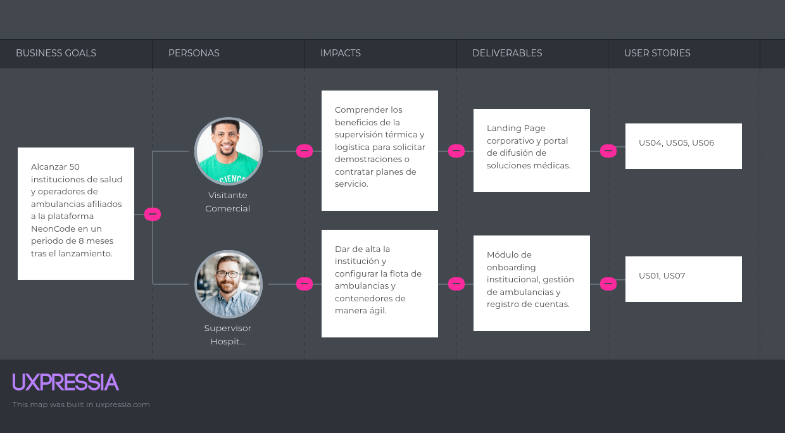

#### Impact Map Goal 2
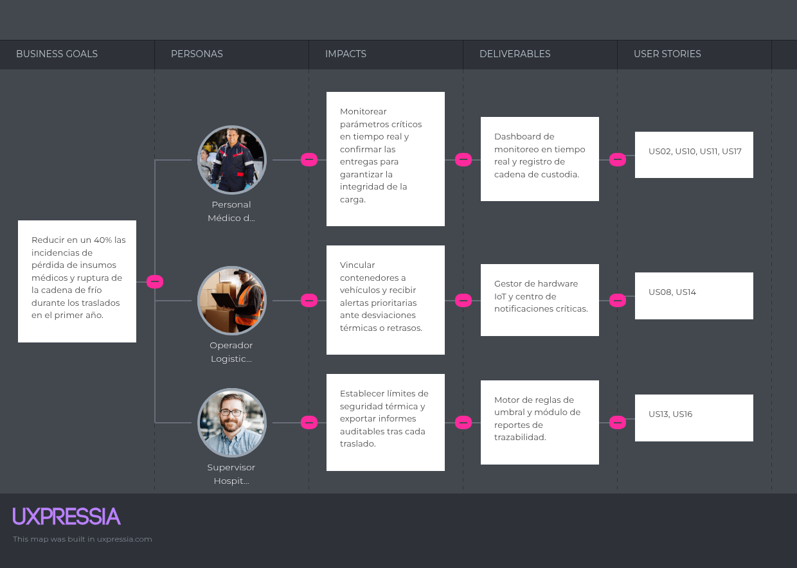

<div style="page-break-after: always;"></div>

# 3.3. Product Backlog

En esta sección se presenta el **Product Backlog** priorizado para la plataforma **NeonCode**, estructurado a partir de las 18 historias de usuario definidas previamente. Las historias han sido estimadas utilizando la técnica de **Planning Poker** basada en la secuencia de Fibonacci (1, 2, 3, 5, 8, 13) para reflejar la complejidad, esfuerzo y nivel de incertidumbre de cada entregable.

El backlog se encuentra organizado secuencialmente para guiar el desarrollo de los Sprints del proyecto, priorizando la arquitectura base, autenticación y servicios de ingesta IoT antes de los paneles de visualización y reportes avanzados.

| Order / Priority | Epic ID | User Story ID | Título de la Historia | Story Points (Fibonacci) | Sprint Asignado |
| :---: | :---: | :---: | :--- | :---: | :---: |
| **01** | EP01 | **US03** | Endpoint de Autenticación de Usuarios (API) | 5 | Sprint 1 |
| **02** | EP01 | **US01** | Registro de Institución de Salud | 3 | Sprint 1 |
| **03** | EP01 | **US02** | Autenticación de Personal de Emergencia | 3 | Sprint 1 |
| **04** | EP02 | **US04** | Exploración de Propuesta de Valor Logística | 2 | Sprint 1 |
| **05** | EP02 | **US05** | Solicitud de Demostración Corporativa | 2 | Sprint 1 |
| **06** | EP02 | **US06** | Consulta de Preguntas Frecuentes | 1 | Sprint 1 |
| **07** | EP03 | **US09** | Ingesta de Telemetría IoT (API) | 8 | Sprint 2 |
| **08** | EP03 | **US07** | Alta de Unidades de Ambulancia | 3 | Sprint 2 |
| **09** | EP03 | **US08** | Vinculación de Contenedor Inteligente | 5 | Sprint 2 |
| **10** | EP04 | **US12** | Consulta de Telemetría e Indicadores (API) | 5 | Sprint 2 |
| **11** | EP04 | **US10** | Monitoreo Térmico y de Apertura | 8 | Sprint 2 |
| **12** | EP04 | **US11** | Control de Stock por Sensores de Peso | 8 | Sprint 3 |
| **13** | EP05 | **US13** | Configuración de Umbrales Térmicos Críticos | 3 | Sprint 3 |
| **14** | EP05 | **US15** | Servicio de Despacho de Alertas (API) | 5 | Sprint 3 |
| **15** | EP05 | **US14** | Visualización de Alertas en Ruta | 5 | Sprint 3 |
| **16** | EP06 | **US18** | Consulta de Historial de Traslados (API) | 5 | Sprint 4 |
| **17** | EP06 | **US16** | Generación de Reportes de Trazabilidad | 8 | Sprint 4 |
| **18** | EP06 | **US17** | Confirmación de Entrega y Cadena de Custodia | 3 | Sprint 4 |

***

### 3.3.1. Engineering Tasks

A continuación se detalla el desglose del **Sprint 1** (16 Story Points totales) en tareas de ingeniería (*Engineering Tasks*). Cada tarea ha sido acotada a una duración estimada de **entre 4 y 8 horas**, asegurando la manejabilidad técnica dentro de la iteración.

#### **US04: Exploración de Propuesta de Valor Logística (2 SP)**
* **TSK-04-01:** Maquetación responsive de la sección "Soluciones Logísticas" en el Landing Page (HTML5 / Tailwind CSS). **[6 Horas]**
* **TSK-04-02:** Integración de componentes visuales interactivos para especificaciones técnicas del contenedor inteligente. **[4 Horas]**

#### **US05: Solicitud de Demostración Corporativa (2 SP)**
* **TSK-05-01:** Desarrollo del formulario de contacto para clientes corporativos con validación de campos en cliente (JavaScript/TypeScript). **[5 Horas]**
* **TSK-05-02:** Configuración del servicio backend/mailing para la recepción y reenvío de prospectos a ventas. **[6 Horas]**

#### **US06: Consulta de Preguntas Frecuentes (1 SP)**
* **TSK-06-01:** Implementación del componente acordeón de FAQ y buscador por palabra clave en el Landing Page. **[4 Horas]**

#### **US01: Registro de Institución de Salud (3 SP)**
* **TSK-01-01:** Diseño y maquetación del formulario web de registro institucional hospitalario. **[5 Horas]**
* **TSK-01-02:** Creación de endpoints en API REST para recepción de datos de registro y validación de RUC duplicado. **[7 Horas]**
* **TSK-01-03:** Implementación del servicio de envío de correos electrónicos de confirmación de cuenta. **[4 Horas]**

#### **US07: Alta de Unidades de Ambulancia (3 SP)**
* **TSK-07-01:** Creación del modelo de datos de Ambulancias en la base de datos MySQL Server 8.0 (InnoDB) mediante Entity Framework Core 10.0. **[4 Horas]**
* **TSK-07-02:** Desarrollo de endpoints CRUD para el registro y consulta de vehículos de transporte. **[6 Horas]**
* **TSK-07-03:** Interfaz web para el formulario de registro y lista de unidades registradas. **[6 Horas]**

#### **US08: Vinculación de Contenedor Inteligente (5 SP)**
* **TSK-08-01:** Desarrollo del módulo backend de asignación física (relación 1:1 entre ambulancia y contenedor IoT). **[8 Horas]**
* **TSK-08-02:** Validación de estados del dispositivo (bloqueo de reasignación si está ocupado). **[5 Horas]**
* **TSK-08-03:** Interfaz web para vinculación mediante lectura o digitación del UUID/MAC del contenedor. **[6 Horas]**

<div style="page-break-after: always;"></div>

# 4.1. Style Guidelines

Un *Style Guideline* es un conjunto de directrices y normas que establecen los estándares visuales, de interacción y de presentación que rigen el ecosistema digital de **Medical SMARTBOX**. Las especificaciones aseguran coherencia estética, usabilidad rigurosa y máxima legibilidad de datos telemétricos críticos tanto en la aplicación web de monitoreo como en el sitio web de divulgación comercial (Landing Page).

## 4.1.1. General Style Guidelines

### Branding
Para el desarrollo de la identidad de **Medical SMARTBOX**, se definió una estética limpia, clínica y altamente tecnológica que sintetiza la convergencia entre logística médica asistencial y telemetría de precisión IoT. La identidad visual simboliza el control integral y la custodia ininterrumpida de la cadena de frío para hemoderivados, órganos y medicamentos biológicos. La composición cromática —basada en Azul Marino Profundo, Verde Cerceta (Teal), Verde Menta y acentos de Alerta en Coral/Rojo— transmite confiabilidad médica, estabilidad operativa y capacidad inmediata de advertencia frente a excursiones térmicas.


*Nota: Logotipo oficial de Medical SMARTBOX, representando la custodia térmica inteligente.*

### Typography
El sistema tipográfico prioriza la jerarquía visual y la decodificación instantánea de telemetría numérica en entornos de alta exigencia cognitiva (ej. cabina de ambulancia o supervisión en central de emergencias). Se implementa una escala tipográfica modular basada en las siguientes fuentes de Google Fonts:

*   **Bricolage Grotesque:** Empleada como tipografía corporativa para encabezados primarios y secundarios (`h1`, `h2`, `h3`). Su estructura geométrica contemporánea con remates técnicos otorga autoridad visual, solidez institucional y modernidad tecnológica.
*   **Inter:** Empleada para textos de párrafo, microcopia de interfaz, tablas de auditoría y visualización de telemetría numérica. Su excelente renderizado subpíxel y variantes tabulares numéricas (`font-variant-numeric: tabular-nums`) garantizan una lectura nítida de decimales de temperatura y porcentajes de batería sin oscilaciones visuales.


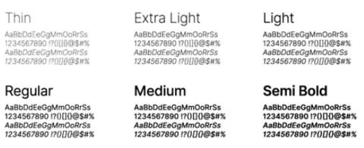
*Nota: Muestrarios tipográficos de Bricolage Grotesque (titulares) e Inter (cuerpo y datos numéricos).*

### Colors
La paleta cromática se seleccionó bajo criterios de contraste accesible (cumplimiento WCAG 2.1 Nivel AA) y codificación semántica para estados operativos clínicos:

*   **Azul Marino Corporativo (`#10312F` / `#1F3C77`):** Color dominante institucional que proyecta solidez, seriedad médica y rigor de ingeniería.
*   **Verde Cerceta / Teal (`#0F7A70`):** Color primario de acción y estado óptimo ("En Rango", carga refrigerada entre 2 °C y 8 °C, telemetría activa).
*   **Verde Menta (`#B9DDA0`):** Fondo suave de soporte para indicadores de éxito y tarjetas de estado estable.
*   **Coral / Rojo Alerta (`#E05A46`):** Tono semántico de alta prioridad reservado exclusivamente para situaciones críticas (temperatura fuera de umbral, desconexión de energía de 12V, batería residual < 15%, apertura no autorizada de tapa).
*   **Gris Neutro Frío (`#F4F7F6` / `#E2E8F0`):** Fondos de interfaz y delimitadores de paneles modulares para reducir la fatiga visual en turnos prolongados.


*Nota: Muestra de la paleta de colores corporativa y semántica de Medical SMARTBOX.*

### Spacing
El espaciado se fundamenta en un sistema de rejilla base modular de **8 píxeles** (8-point grid system: 4px, 8px, 16px, 24px, 32px, 48px, 64px). Este estándar asegura consistencia entre paneles modulares, tarjetas de telemetría telemática (*telemetry cards*) y botones de acción rápida, previniendo el hacinamiento de información y reduciendo la tasa de error por toques accidentales en pantallas táctiles de cabina.

***

## 4.1.2. Web Style Guidelines

Las directrices web definen la estructura adaptativa, componentes interactivos y comportamiento responsivo de la plataforma:

*   **Estrategia Responsive y Adaptabilidad Multi-dispositivo:**
    *   **Desktop / Estaciones Hospitalarias (Viewport ≥ 1280px):** Disposición de cuadrícula fluida de 12 columnas. Aprovecha el ancho panorámico para mostrar simultáneamente el mapa de flota satelital en vivo, gráficos telemétricos continuos y panel lateral de incidentes activos.
    *   **Tablet / Terminales de Cabina (Viewport 768px a 1024px):** Cuadrícula adaptativa de 6 columnas. Los paneles secundarios se condensan en pestañas (*tabs*) o cajones laterales (*drawers*) accesibles mediante gestos táctiles.
    *   **Mobile Browser / Smartphones Médicos (Viewport 360px a 414px):** Colapso a una columna única fluida (1 columna, 100% de ancho con márgenes laterales de 16px). La barra de navegación superior colapsa en un menú tipo hamburguesa/drawer lateral; los mapas de ruta alternan a pantalla completa modal; las tarjetas de métricas telemétricas se apilan verticalmente; y los botones de acción rápida (ej. "Reconocer Alerta", "Solicitar OTP") cuentan con una altura mínima de **48px** para garantizar un área táctil ergonómica (*touch target*) según directrices de Google Material Design y Apple Human Interface Guidelines.
*   **Navegación y Patrones de Interacción:**
    *   **Sticky Header:** Barra de navegación superior fija que mantiene visible el logotipo institucional, estado de conexión en tiempo real (indicador verde de latencia de red), conmutador de idioma (ES/EN) y botón de acceso rápido al perfil de usuario.
    *   **Route Rail (Navegación Vertical de Seguimiento):** En el Landing Page, un indicador lateral animado (*scrollspy*) sitúa visualmente al visitante a lo largo de las secciones informativas del producto.
    *   **Retroalimentación Inmediata de Estados:** Cada microinteracción (hover en escritorio, active state en móvil) ofrece respuestas visuales no mayores a 150ms mediante transiciones CSS fluidas (`ease-in-out`), confirmando visualmente cada comando emitido.

<div style="page-break-after: always;"></div>

# 4.2. Information Architecture

### 4.2.1. Organization Systems

*   **Visual Organization:**

    Para facilitar la asimilación visual de la información crítica, la plataforma prioriza las tarjetas de telemetría y alertas. En el dashboard, la información más crítica (como alertas rojas de "Temperatura sobre el rango esperado" o desvíos de ETA) tiene el mayor peso visual mediante contrastes cromáticos y tipografía agrandada (clase `.tnum`). La información secundaria tiene colores neutros o silenciados.
*   **Organización Cronológica / Secuencial:**

    Se emplea intensivamente en el módulo de **Trazabilidad (Traceability)**. El historial de un transporte (ej. TR-0417) se divide en hitos secuenciales (Preparado -> Recogido -> En tránsito -> Llegando -> Entregado), permitiendo al usuario ver el ciclo de vida de un envío en orden lógico.
*   **Organización Matricial / Cruzada:**

    Se aplica en el Panel de Operaciones (Flota en ruta) y en el Inbox de Receptores. Los operadores visualizan listas cruzando identificadores de transporte (TR-0417) con métricas dinámicas (Temperatura, ETA, Batería del SmartBox, Estado de Puertas).

### 4.2.2. Labeling Systems

La aplicación utiliza un sistema de etiquetas y terminología adaptado a los dos principales tipos de usuarios: Operadores logísticos y Centros Receptores.

*   **Para el visitante:** Botones directos como "Ir a la Web App" o "Iniciar sesión".
*   **Para los Operadores de Transporte:** Se emplea terminología técnica de monitoreo y flota. Etiquetas como "ETA", "Telemetría en vivo", "Combustible (%)", "Batería (%)" y "Temperatura (°C)". Las alertas usan un lenguaje preciso: "Puerta abierta fuera de parada", "Batería baja del SmartBox".
*   **Para los Centros Receptores (Hospitales/Farmacias):** El enfoque cambia hacia la recepción de paquetes. Etiquetas enfocadas en el estado de llegada: "Envíos entrantes", "Llegan hoy", "Recibido", y confirmaciones como "Conforme".

### 4.2.3. SEO Tags and Meta Tags

Los SEO y meta tags implementados en Medical SmartBox están optimizados para el nicho de logística médica:

*   **Title Tag:**
    `<title>Medical SmartBox — Monitoreo y trazabilidad del transporte médico</title>`
*   **Meta Description:**
    `<meta name="description" content="Medical SmartBox es una plataforma para monitorear transportes médicos, detectar incidencias de temperatura en tiempo real y mantener cada envío y cadena de frío bajo control.">`
*   **Language tag:** (Dinámico vía script, base en inglés y español)
    `<html lang="es">`
*   **Meta Viewport:** (Esencial para responsividad en móviles y paneles de campo)
    `<meta name="viewport" content="width=device-width, initial-scale=1">`
*   **Author tag:**
    `<meta name="author" content="Medical SmartBox Team">`
*   **Canonical Tag:**
    `<link rel="canonical" href="https://www.medicalsmartbox.com/">`

### 4.2.4. Searching Systems

Para asegurar que los usuarios encuentren la unidad o el dato exacto al instante:

*   **Búsqueda global y de flota:** Un input de búsqueda con el placeholder *"Buscar transporte, SmartBox o destino"* y filtros dedicados *"Filtrar por ruta, estado o SmartBox"*.
*   **Búsqueda por Estados (Tabs):** Posibilidad de filtrar vistas rápidamente mediante estados activos como "En tránsito", "Crítica", o "Entregado".

### 4.2.5. Navigation Systems

*   **Navegación principal (Top Nav):** Enlaces ancla directos a secciones clave del producto: *Plataforma, Cómo funciona, Soluciones, Trazabilidad*.
*   **Navegación Vertical de Seguimiento (Route Rail):** Un indicador de progreso visual en el lateral de la pantalla que funciona como un "scrollspy", ubicando al usuario en qué sección de la página (Inicio, Monitoreo, Alertas, Capturas, Datos, etc.) se encuentra.
*   **Controles de Autenticación y Demostración:** Botones persistentes en el encabezado y menús laterales (Drawer) para "Iniciar sesión" o abrir la "Web App" completa.
*   **Selector de Idioma:** Un interruptor claro (Toggle ES/EN) que permite cambiar la internacionalización de la plataforma sin recargar, crucial para equipos logísticos internacionales.

<div style="page-break-after: always;"></div>

# 4.3. Landing Page UI Design

El diseño de la interfaz de usuario en la landing page de **Medical SMARTBOX** es clave para causar una primera impresión positiva y transmitir la innovación tecnológica y el rigor que respalda a nuestra solución de monitoreo de la cadena de frío médica. Buscamos ofrecer una experiencia visual limpia, profesional y altamente funcional que inspire confianza e invite a los operadores logísticos, gerentes de distribución farmacéutica y administradores de centros de salud a solicitar una demostración y explorar nuestro ecosistema de monitoreo IoT y trazabilidad en tiempo real.

### 4.3.1. Landing Page Wireframe

#### Diseño para Desktop Browser
*   **Hero Section:** Boceto estructural de la sección principal (Hero Section), definiendo un diseño de dos columnas para ubicar la propuesta de valor centrada en la protección de insumos médicos a la izquierda, y un elemento visual destacado a la derecha (preview interactivo del contenedor SmartBox y su telemetría).

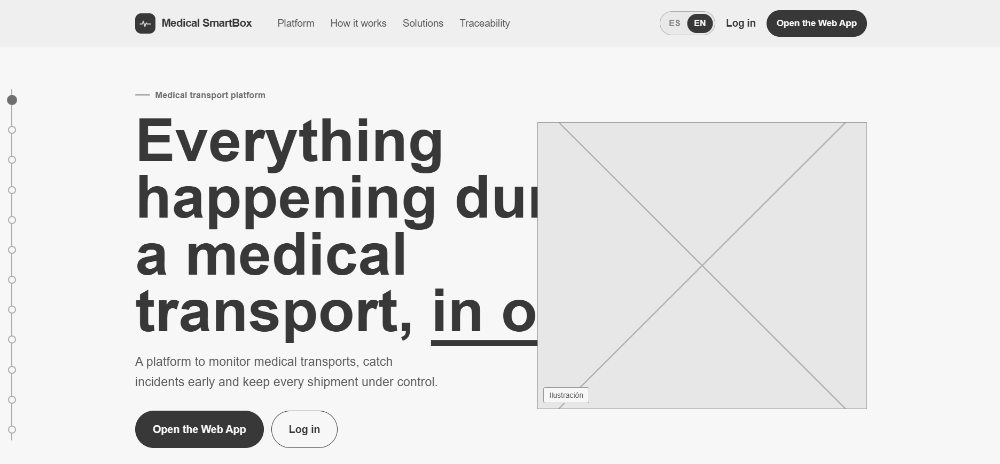

*   **Características de la Plataforma:** Diseño esquemático (layout) para la sección de características clave (*Monitoreo Térmico en Tiempo Real*, *Alertas Predictivas de Incidencias* y *Trazabilidad End-to-End*), utilizando un sistema de cuadrícula para distribuir equitativamente tres tarjetas informativas.

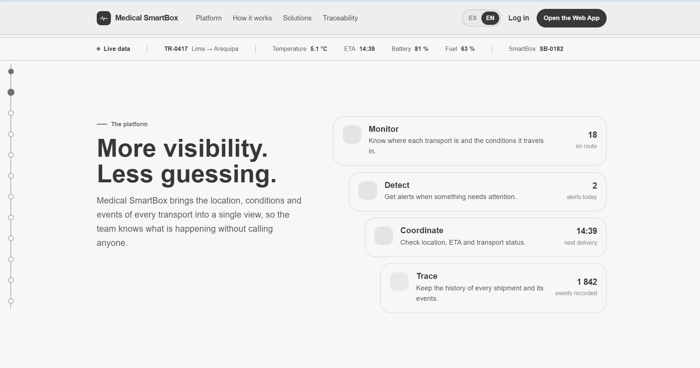

*   **Presentación de la Startup / Quiénes Somos:** Estructura conceptual para la presentación del equipo detrás de Medical SMARTBOX. Define una cuadrícula adaptable (responsive grid) con cinco espacios reservados para las fotografías y perfiles del equipo desarrollador e ingenieros de software.

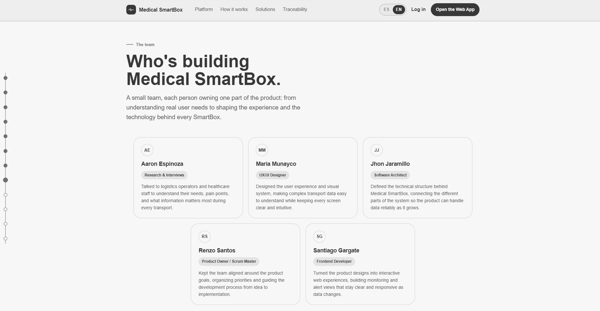

*   **Call to Action (CTA) y Footer:** Maquetación básica para la sección de "Llamado a la Acción", mostrando un formulario centralizado para la solicitud de demostraciones guiadas y el bloque del pie de página con enlaces institucionales, legales y de cumplimiento normativo sanitario.

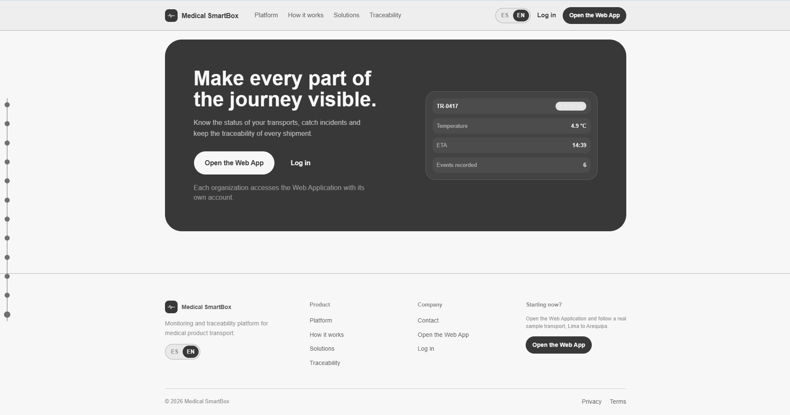

#### Adaptabilidad para Mobile Browser
Para dispositivos móviles (viewports de 360px a 414px), la estructura de wireframe implementa una adaptación fluida de una columna:
*   **Navegación Móvil:** El menú horizontal superior se condensa en un botón de menú tipo hamburguesa ubicado en la esquina superior derecha, desplegando un panel Drawer lateral con los enlaces a Soluciones, Características, Equipo y Formulario de Contacto.
*   **Hero Section Vertical:** La disposición de dos columnas colapsa linealmente, colocando el titular persuasivo y el botón CTA prioritario en la parte superior, seguido del elemento gráfico representativo del SmartBox.
*   **Cuadrícula de Tarjetas Apiladas:** Las tarjetas de características y perfiles de equipo se reorganizan en una pila vertical (1 tarjeta por fila) con espaciado vertical de 16px, facilitando el desplazamiento vertical con el pulgar.
*   **Ergonomía Táctil:** Todos los botones de acción e inputs de formulario adoptan un ancho del 100% y una altura mínima de 48px con espaciado interactivo para evitar pulsaciones erróneas.

***

### 4.3.2. Landing Page Mock-up

#### Diseño de Alta Fidelidad para Desktop Browser
*   **Hero Section:** Interfaz final del Hero Section. Destaca la integración de la paleta de colores corporativa (Azul Marino `#10312F`, Verde Cerceta `#0F7A70` y Verde Claro `#B9DDA0`), la tipografía moderna (**Bricolage Grotesque** para titulares e **Inter** para cuerpo de texto) y una composición visual de un operador logístico inspeccionando un envío médico con telemetría activa en un dispositivo SmartBox, logrando captar la atención del usuario inmediatamente.
  
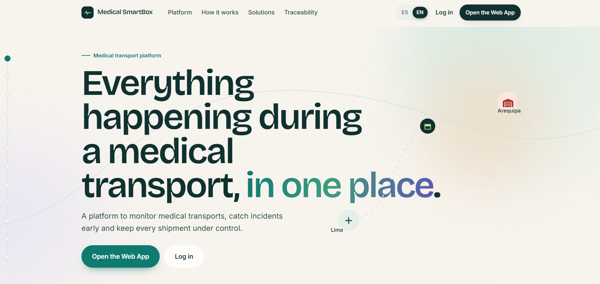

*   **Tarjetas de Servicios:** Implementación final de las tarjetas de servicio (*Telemetría IoT en Vivo*, *Mapeo de Ruta Térmica* y *Alertas Predictivas de Excursión de Temperatura*). Se incorporaron imágenes fotográficas de alta calidad y un diseño de tarjeta limpia (*Clean UI*) con sombras suaves y bordes redondeados para facilitar la lectura de métricas clave.

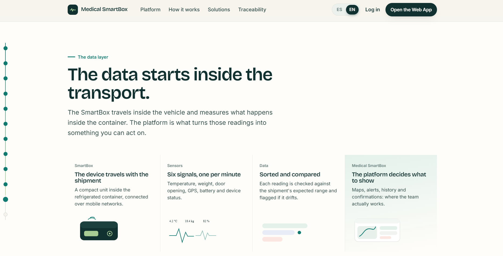

*   **Sección "Quiénes Somos":** Resultado visual de la sección "Quiénes Somos". Presenta formalmente a los cinco ingenieros de software del equipo de Medical SMARTBOX, transmitiendo transparencia, profesionalismo, solvencia técnica y compromiso con la seguridad en la salud digital.

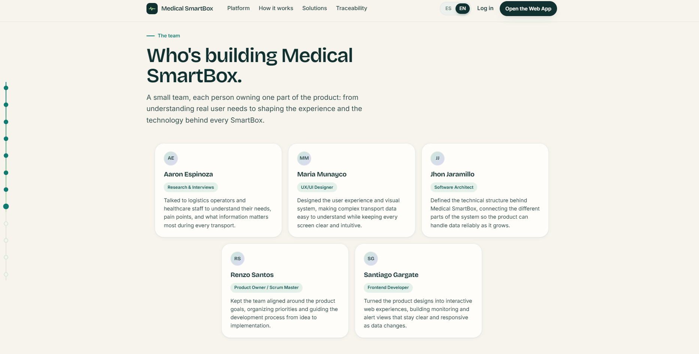

*   **Formulario "Únete a Medical SmartBox":** Versión construida del formulario "Ir a la Web App". Utiliza el fondo azul marino oscuro de la marca para generar un alto contraste con los campos de entrada e incentivar la conversión, cerrando la página con un footer minimalista con políticas de privacidad, certificaciones sanitarias y enlaces legales.

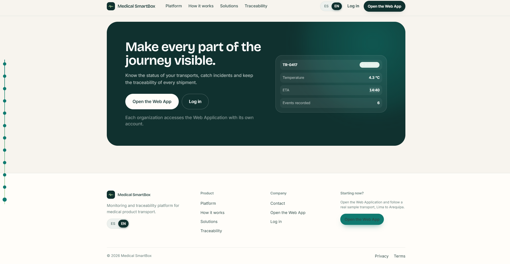

#### Adaptabilidad de Alta Fidelidad para Mobile Browser
En la versión móvil de alta fidelidad, se aplican los estándares visuales de diseño responsivo definidos en las guías de estilo:
*   **Alineación Tipográfica y Tamaños Proporcionales:** Los encabezados `h1` reducen su tamaño de 48px a 32px con interlineado ajustado a 1.2, evitando desbordes horizontales y garantizando lectura cómoda sin zoom.
*   **Interacciones Táctiles y Controles:** Los formularios de contacto optimizan los campos de entrada para teclados virtuales nativos de iOS y Android (input types `email`, `tel`, `text`), y los botones principales disponen de microinteracciones activas táctiles (`active:scale-95`).
*   **Optimización de Carga y Recursos Gráficos:** Las imágenes de presentación y mockups emplean renderizado responsivo con densidades optimizadas, reduciendo el consumo de datos celulares en redes móviles de transporte asistencial.

<div style="page-break-after: always;"></div>

# 4.4. Web Applications UX/UI Design

El diseño de experiencia de usuario (UX) y diseño de interfaz de usuario (UI) en la plataforma web de **Medical SMARTBOX** busca crear una herramienta digital intuitiva, accesible y altamente funcional para operadores logísticos, conductores de transporte médico y personal receptor en hospitales o farmacias. La UX se enfoca en comprender la urgencia y precisión requeridas en la cadena de frío, diseñando flujos de interacción eficientes para monitorear cargas térmicamente sensibles, reaccionar ante desvíos de temperatura y configurar sensores IoT sin fricción.

Por su parte, la UI se encarga del aspecto visual, estructurando de manera clara componentes complejos como dashboards telemétricos en tiempo real, trazabilidad por hitos de envío, gráficos de estabilidad térmica y sistemas de alertas predictivas. Un diseño UX/UI exitoso en Medical SMARTBOX fusiona una estética tecnológica limpia con la practicidad operativa, ofreciendo una experiencia fluida que transforma datos IoT masivos en decisiones logísticas rápidas que salvan vidas y evitan la merma de medicamentos.

***

### 4.4.1. Web Applications Wireframes

#### Wireframes para Desktop Browser
*   **Acceso y Autenticación Segura:** El flujo de inicio de sesión presenta un diseño *desktop* de dos columnas ("auth-shell"). La izquierda actúa como un panel informativo destacando la propuesta de valor ("Cadena de frío bajo custodia digital") y estadísticas de la flota, mientras que la derecha contiene el formulario de acceso institucional que solicita RUC/Correo y Contraseña. A esto le sigue una pantalla obligatoria de Verificación en Dos Pasos (2FA) mediante un código OTP de 6 dígitos.

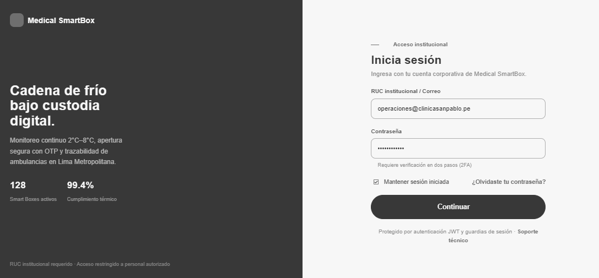

*   **Núcleo Operativo - Dashboard Principal:** El Dashboard general organiza la vista del operador comenzando con una fila de KPIs (unidades en ruta, monitorizadas, alertas críticas y cumplimiento DIGEMID). En el cuerpo central, se emplea una estructura de cuadrícula (`grid-2`) que muestra un mapa de "Flota en tiempo real" a la izquierda y un panel consolidado de "Alertas críticas recientes" a la derecha, finalizando con una tabla inferior para los "Traslados en curso".

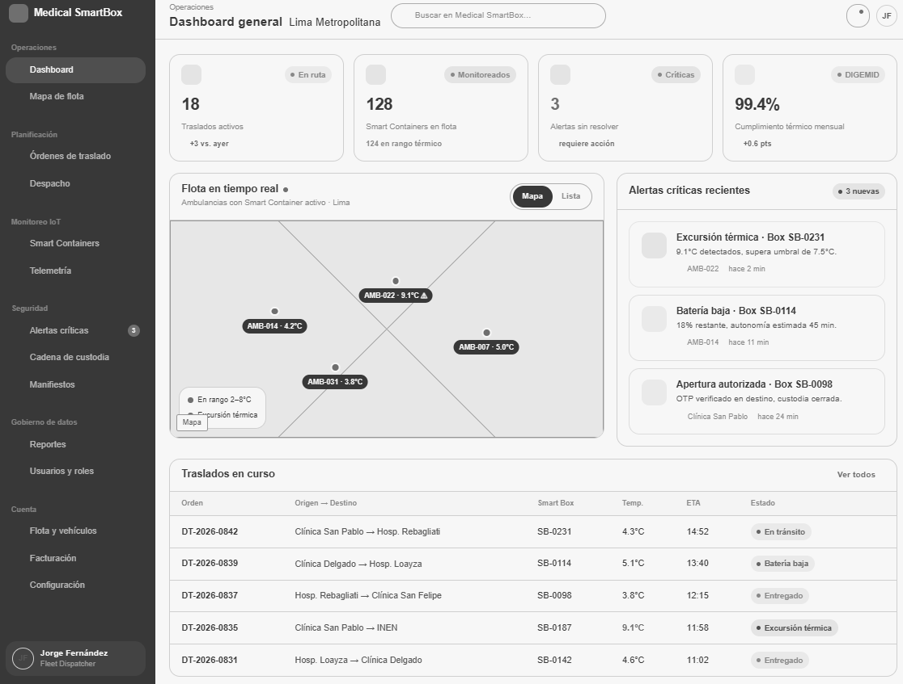

*   **Gestión de Envíos y Tablero de Despacho:** El sistema incluye una lista maestra de "Órdenes de traslado" y un formulario completo para crear una nueva orden validando ventana de isquemia fría y precooling. Además, presenta un Tablero de Despacho en formato Kanban que categoriza los viajes en Pendientes, Despachados, En tránsito y Entregados.

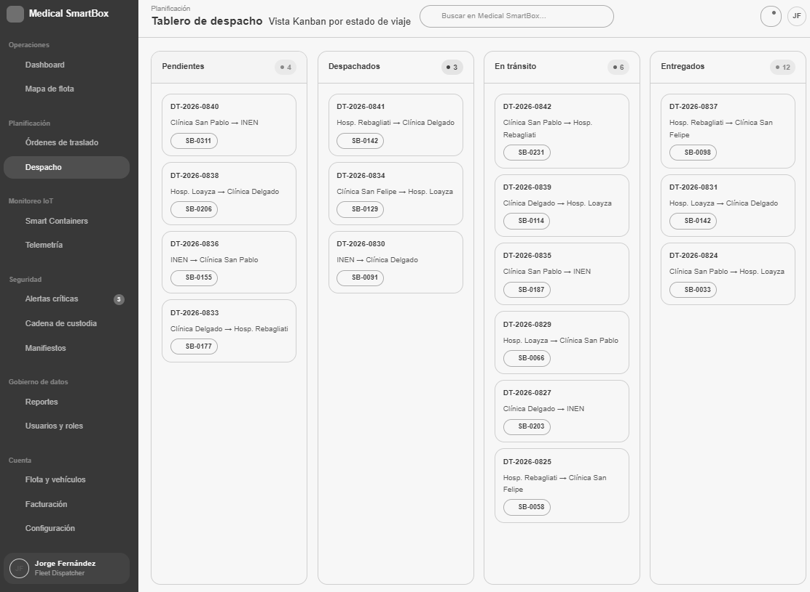

*   **Vista Detallada de Telemetría y Ruta:** La inspección individual de un envío presenta un *stepper* de estado en la parte superior. Debajo, se divide en dos módulos: a la izquierda, el mapa de trazabilidad y ruta en vivo con cálculo de ETA dinámico; a la derecha, las tarjetas telemétricas y medidores (*gauges*) mostrando la temperatura interna en tiempo real (ej. 4.3°C), nivel de batería, estado de cierre y lecturas recientes.

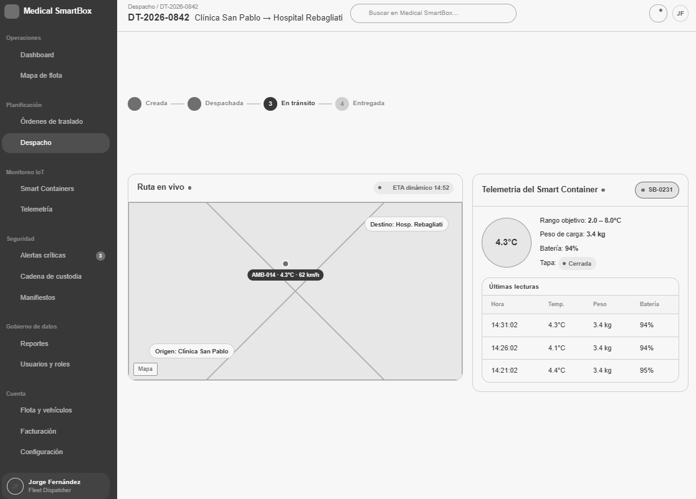

*   **Monitoreo y Control de Smart Containers:** Se incluye un módulo visual tipo *grid* para monitorear todos los contenedores de la flota y una vista de detalle por Smart Container que incluye una curva gráfica de temperatura de las últimas 24 horas. Complementariamente, el sistema permite enviar comandos de desbloqueo remoto de la tapa mediante interacción electromecánica y visualizar el historial completo de excursiones térmicas.

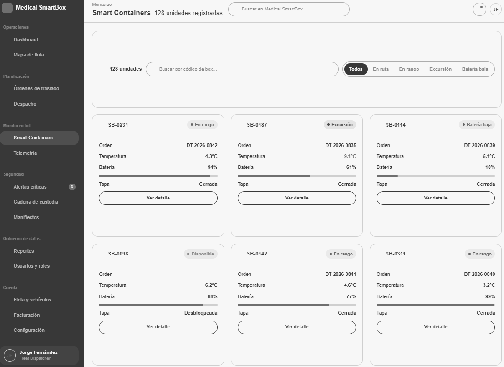

*   **Centro de Alertas y Respuesta a Incidentes:** La plataforma cuenta con una bandeja centralizada para gestionar notificaciones. El detalle de una alerta crítica expone la magnitud de la excursión térmica (temperatura, duración, ubicación), el registro temporal del despacho de alertas (vía SMS y Push) y una sección para que el operador documente las acciones correctivas.

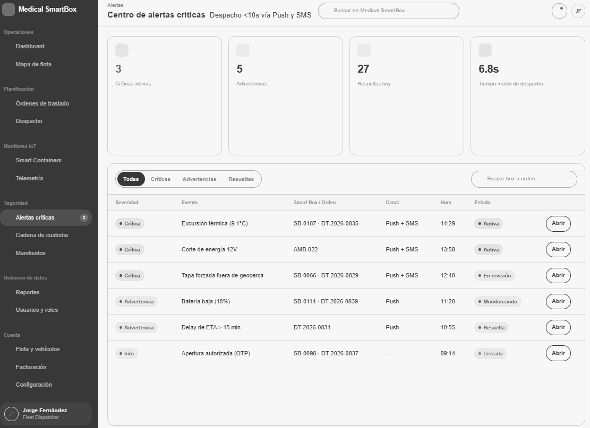

*   **Configuración y Umbrales de Alerta:** Una pantalla de administración dedicada a "Canales de notificación" permite al usuario activar/desactivar notificaciones Push, SMS, Correo y alarmas acústicas. Aquí mismo, en el panel "Umbrales de severidad", se configuran manualmente los límites máximos/mínimos de temperatura y los tiempos límite (SLA) para el envío de alertas.

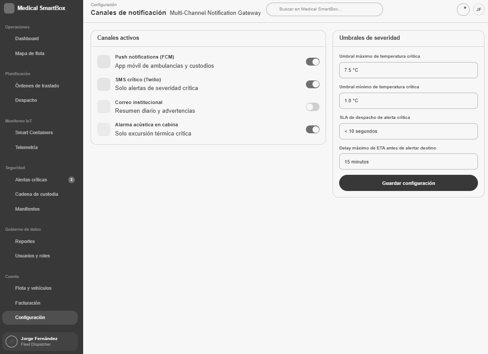

*   **Cadena de Custodia, Manifiestos y Reportes:** El flujo de entrega garantiza la seguridad exigiendo la Verificación OTP en destino y trazando todos los eventos en una Línea de Tiempo de Cadena de Custodia. Administrativamente, se generan Manifiestos Digitales de Auditoría inmutables sellados con SHA-256 y se presenta un consolidado analítico para cumplimiento normativo DIGEMID/DIGDOT.

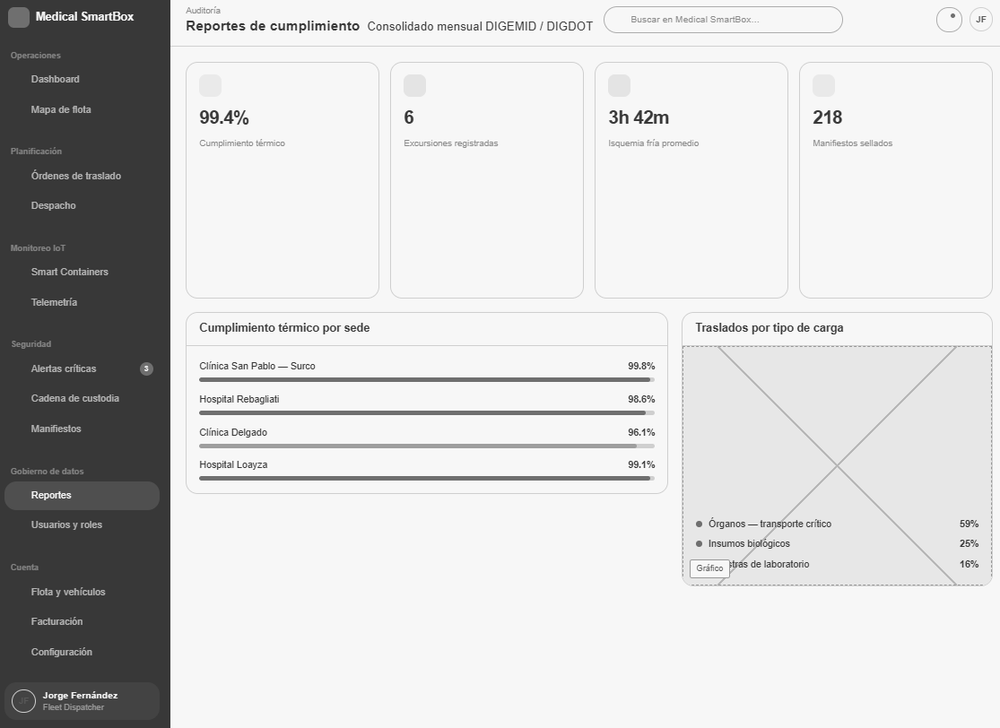

*   **Administración Institucional y B2B:** La plataforma incluye la gestión integral de la suscripción, facturación B2B, vinculación de unidades vehiculares y el control granular de usuarios organizados en roles operativos de logística o perfiles clínicos.
   
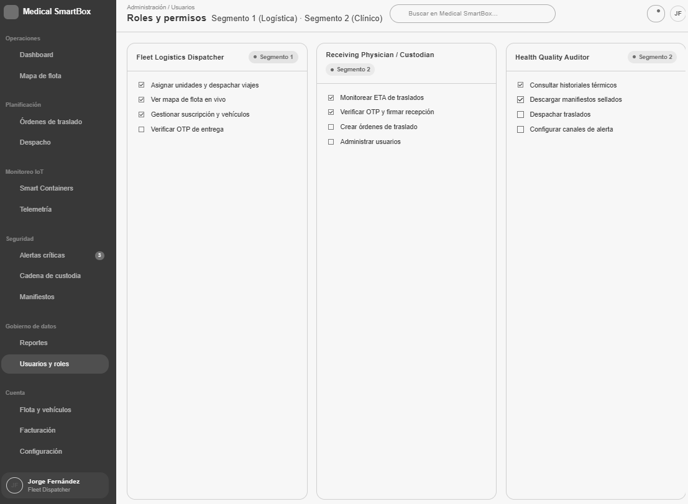

#### Adaptabilidad de Wireframes para Mobile Browser
Para dispositivos móviles de campo (smartphones de personal asistencial y tabletas de ambulancia de 360px a 414px):
*   **Diseño de Columna Unificada (Single-Column Flow):** La disposición de dos columnas se transforma en un flujo vertical secuencial. En el detalle del traslado, el indicador de temperatura actual y la alerta de batería se colocan en la parte superior fija (*sticky banner*), seguidos del mapa simplificado y las lecturas telemétricas.
*   **Navegación Móvil por Barra Inferior (Bottom Navigation Bar):** Se reemplaza la barra lateral izquierda por una barra de navegación inferior de 5 accesos directos (*Dashboard*, *Ruta en Vivo*, *SmartBox*, *Alertas* y *Perfil*), facilitando la operación con una sola mano.
*   **Zona Táctil Aumentada para Emergencias:** Todos los controles críticos, en especial el botón de desbloqueo de emergencia y el teclado numérico en pantalla para validación de OTP, cuentan con dimensiones mínimas de 48x48px con alto contraste, permitiendo su uso rápido incluso con guantes clínicos.

***

### 4.4.2. Web Applications Wireflow Diagrams

La especificación del Wireflow de la aplicación web articula la navegación estructural y las transiciones pantalla a pantalla del sistema **Medical SMARTBOX**, vinculando las vistas esquemáticas desarrolladas en la sección precedente con las decisiones operativas del usuario, los eventos de telemetría IoT y las reglas de negocio clínicas.

#### Estructura de Navegación y Rutas Principales

El flujo de interacción del sistema se organiza a través de los siguientes recorridos clave:

1. **Ruta de Acceso y Seguridad Institucional:**
   * **Inicio / Login Institucional:** El usuario introduce sus credenciales corporativas (RUC/correo y contraseña).
   * **Validación de Doble Factor (2FA):** Si la cuenta exige verificación reforzada o detecta un nuevo dispositivo, el flujo transita hacia la pantalla de ingreso del código OTP de 6 dígitos enviado al canal autorizado.
   * **Ingreso al Panel:** Tras la validación conforme del token temporal (o si la sesión previa de confianza se encuentra activa), se concede acceso y se redirige automáticamente al Dashboard Operativo Principal.

2. **Ruta de Monitoreo Telemétrico de Traslado:**
   * **Dashboard Operativo Principal:** Presenta la matriz de flota activa, KPIs de cumplimiento térmico y mapa en vivo.
   * **Vista Detalle de Traslado y Telemetría:** Al seleccionar una ambulancia o envío en curso, el despachador accede a la vista especializada con trazabilidad cartográfica en vivo, cálculo dinámico de ETA, nivel de batería del Smart Container y gráfica térmica continua de las últimas 24 horas.

3. **Ruta de Atención Prioritaria a Incidentes Térmicos:**
   * **Detección de Excursión:** Si un sensor telemétrico reporta una temperatura fuera del rango normativo de cadena de frío (menor a 2 °C o superior a 8 °C), el sistema dispara una alerta visual destacada en cabecera.
   * **Centro de Alertas e Incidentes:** Al accionar la notificación crítica, el operador transita hacia la bandeja de incidentes para evaluar la severidad, geolocalización y duración de la desviación.
   * **Retorno Contextual:** Una vez registrada y documentada la acción correctiva (ej. reajuste térmico o cambio de ruta), el operador retorna a la vista de detalle del traslado para verificar la estabilización de los parámetros biológicos.

4. **Ruta de Arribo, Desbloqueo y Cierre de Custodia:**
   * **Llegada a Destino:** La confirmación de geocerca en el centro hospitalario o banco de sangre receptor habilita la pantalla de entrega y desbloqueo seguro.
   * **Validación OTP de Recepción:** El personal receptor facultado introduce el código OTP de desbloqueo, validando su identidad clínica.
   * **Línea de Tiempo de Cadena de Custodia:** El sistema registra inmutablemente el evento de apertura electromecánica de la tapa y la firma digital del acta de entrega.
   * **Exportación de Acta Oficial:** Concluido el protocolo, se genera el reporte de custodia en formato PDF sellado con firma digital SHA-256 para auditoría sanitaria ante DIGEMID y SUSALUD.

5. **Ruta de Administración de Activos y Parametrización:**
   * **Gestión de Flota y Contenedores:** Desde el menú lateral del Dashboard, los administradores acceden a la configuración del parque de ambulancias, inventario de Smart Containers IoT, umbrales de severidad y políticas de notificación.

#### Matriz de Transiciones de Pantalla (Wireflow Transitions)

La siguiente matriz documenta las transiciones sistemáticas entre las interfaces de usuario del sistema web:

| Pantalla Origen (Wireframe) | Disparador / Acción del Usuario | Condición de Control / Regla de Negocio | Pantalla Destino | Tipo de Transición |
| :--- | :--- | :--- | :--- | :--- |
| **Inicio / Login Institucional** | Ingreso de credenciales de acceso | Credenciales válidas; requiere doble factor | **Pantalla de Verificación OTP (2FA)** | Condicional de seguridad |
| **Inicio / Login Institucional** | Ingreso de credenciales de acceso | Credenciales válidas; sesión de confianza activa | **Dashboard Operativo Principal** | Redirección directa |
| **Pantalla de Verificación OTP** | Envío de código numérico de 6 dígitos | Token OTP vigente y validado correctamente | **Dashboard Operativo Principal** | Autorización concedida |
| **Dashboard Operativo Principal** | Clic en ambulancia o envío en la tabla | Selección de unidad telemétrica en tránsito | **Vista Detalle de Traslado y Telemetría** | Navegación a detalle |
| **Dashboard Operativo Principal** | Clic en notificación crítica en cabecera | Registro telemétrico fuera de rango (2 °C - 8 °C) | **Centro de Alertas e Incidentes** | Interrupción prioritaria |
| **Centro de Alertas e Incidentes** | Registro y guardado de acción correctiva | Formulario de contingencia validado y guardado | **Vista Detalle de Traslado y Telemetría** | Retorno contextual |
| **Dashboard Operativo Principal** | Selección de "Gestión de Flota" en menú | Usuario con privilegios de Administrador / Logística | **Gestión de Flota y Contenedores** | Navegación modular |
| **Vista Detalle de Traslado** | Detección de arribo al punto de destino | Geocerca de destino alcanzada por ambulancia | **Pantalla de Desbloqueo OTP y Entrega** | Disparo por hito de ruta |
| **Pantalla de Desbloqueo OTP** | Validación de código OTP por médico receptor | Firma digital y token de apertura verificados | **Línea de Tiempo de Cadena de Custodia** | Confirmación de custodia |
| **Línea de Tiempo de Cadena de Custodia** | Clic en "Exportar Acta de Entrega" | Cierre exitoso del traslado con hash SHA-256 | **Generación de Reporte PDF Certificado** | Descarga documental |

*Nota: Las decisiones de interfaz y flujos alternativos detallados por cada historia de usuario se formalizan en la sección 4.4.4 mediante los diagramas de User Flow.*

***

### 4.4.3. Web Applications Mock-ups

#### Diseños de Alta Fidelidad para Desktop Browser
*   **Acceso Institucional y 2FA:** Interfaz de usuario de alta fidelidad para el flujo de acceso institucional. La vista se divide en dos columnas: el panel izquierdo refuerza la propuesta de valor corporativa y el panel derecho contiene el formulario de acceso seguido de la pantalla obligatoria de Verificación en Dos Pasos (2FA) mediante OTP de 6 dígitos.

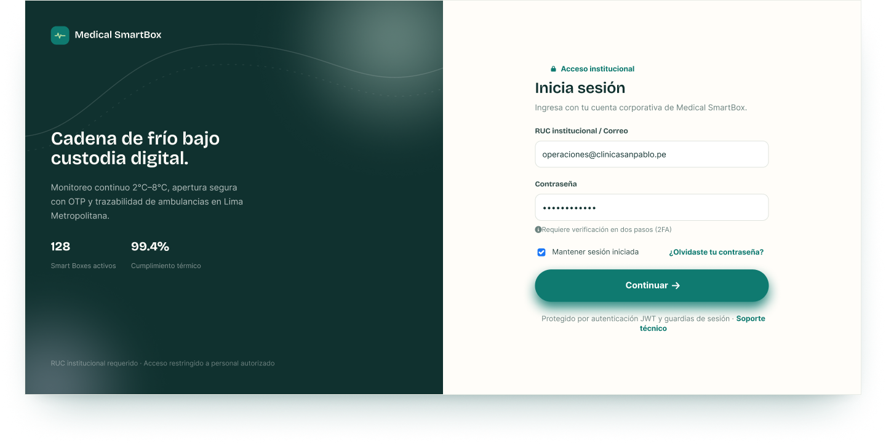

*   **Dashboard General de Operaciones:** Interfaz del centro de control integral. Aprovecha el espacio horizontal para presentar la fila superior de KPIs (traslados activos, unidades monitoreadas, alertas y cumplimiento térmico), el mapa interactivo de Lima Metropolitana a la izquierda y el panel de alertas recientes a la derecha, con la tabla de traslados en curso en la parte inferior.

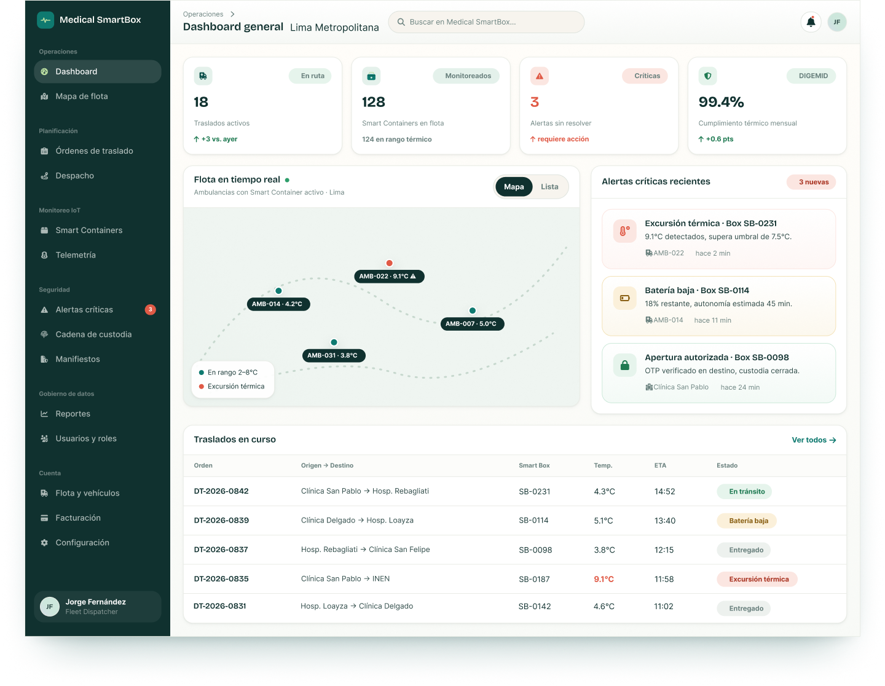

*   **Planificación y Seguimiento Logístico:** Vista de Órdenes de Traslado y formulario de creación con validaciones de isquemia fría y pre-enfriamiento. Incluye el Tablero de Despacho Kanban (Pendiente, Despachado, En tránsito, Entregado) y la vista dividida de ruta en vivo con cálculo dinámico de ETA.

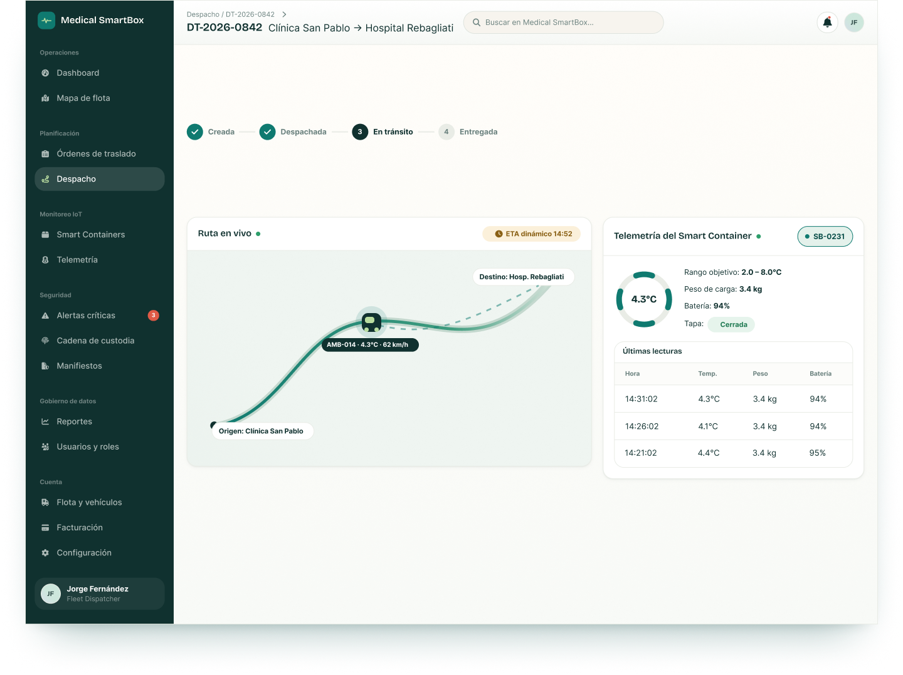

*   **Monitoreo y Control IoT de Smart Containers:** Vista en cuadrícula de todos los contenedores y panel individual (SB-0231) con medidores circulares de temperatura y batería, curva térmica continua de 24 horas y comando de desbloqueo electromecánico seguro vía MQTT.

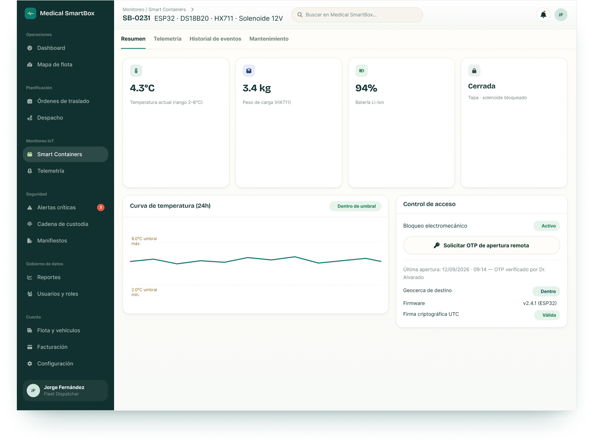

*   **Centro de Alertas Críticas e Incidentes:** Bandeja de notificaciones clasificada por severidad. Expone la magnitud de la excursión térmica (temperatura, duración, ubicación satelital), registro cronológico del despacho SMS/Push y registro interactivo de acciones correctivas tomadas por el operador.

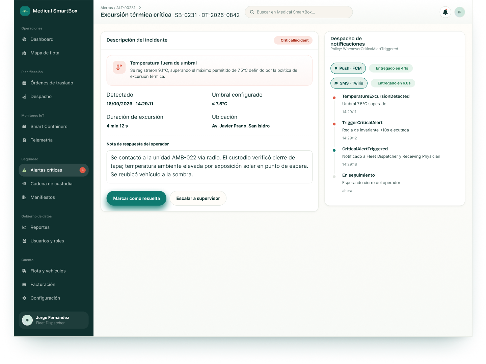

*   **Perfil, Configuración y Control de Roles:** Administración de canales de notificación (Push, SMS, correo, acústica), umbrales de severidad y asignación granular de permisos entre roles operativos (Fleet Logistics Dispatcher) y perfiles clínicos (Receiving Physician, Health Quality Auditor).

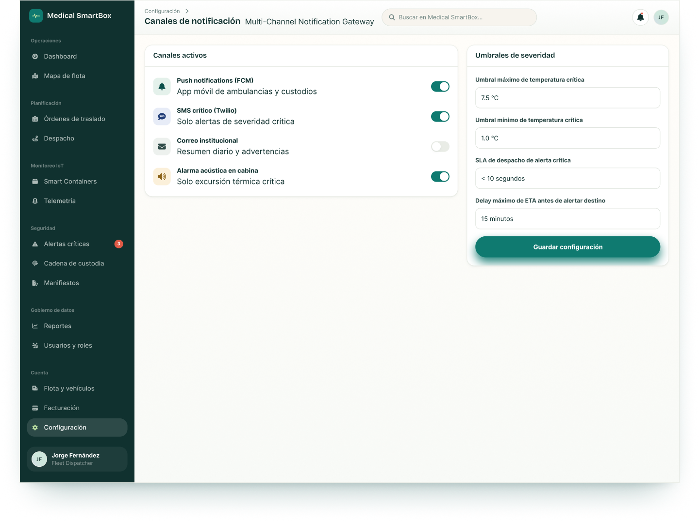

*   **Auditoría, Cadena de Custodia y Reportes:** Flujo de validación OTP en destino, registro cronológico inmutable con firma SHA-256 en la cadena de custodia y generación automática de reportes certificados para DIGEMID/SUSALUD.

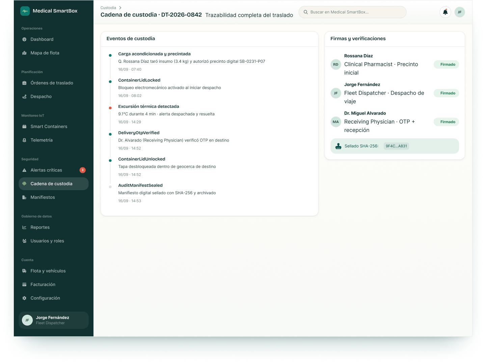

#### Adaptabilidad de Mock-ups para Mobile Browser
En pantallas móviles de smartphones asistenciales (360px a 414px):
*   **Diseño Modular en Tarjetas Verticales:** Los dashboards multipanel se reorganizan en tarjetas apiladas con scroll vertical fluido. La temperatura actual se resalta con tipografía agrandada (36px, `tabular-nums`) y código de color dinámico (verde para 2-8 °C, rojo parpadeante ante excursión térmica).
*   **Comandos de Acción en Barra Flotante:** La acción de "Confirmar Entrega y Solicitar OTP" permanece anclada como botón flotante (*sticky bottom*) visible en todo momento durante el trayecto, agilizando el traspaso en quirófano o rampa hospitalaria sin necesidad de desplazarse por menús complejos.
*   **Modo Nocturno / Alto Contraste para Cabina:** La paleta adopta un fondo oscuro de bajo brillo para no encandilar al paramédico ni al conductor en traslados nocturnos de emergencia.

***

<div style="page-break-before: always;"></div>

### 4.4.4. Web Applications User Flow Diagrams

El diagrama de flujo de usuario es una representación visual de las acciones secuenciales que un operador logístico, supervisor hospitalario o personal médico realiza al interactuar con el ecosistema digital de NeonCode. A continuación se presentan tres diagramas de flujo clave adaptados a las historias de usuario de la plataforma, detallando el *Happy Path* (ruta ideal) y las ramificaciones alternativas (errores de validación, fallas de conectividad IoT y desviaciones en la cadena de frío).

**User Flow 1: Autenticación de Personal y Acceso al Panel**

*   **User Stories relacionadas:** US01, US02
*   **Flujos incluidos:** *Happy Path* (autenticación exitosa y acceso al panel), credenciales inválidas, cuenta institucional no activada, campos incompletos y reintentos de sesión.

<div align="center" style="text-align: center; margin: 3mm auto;">
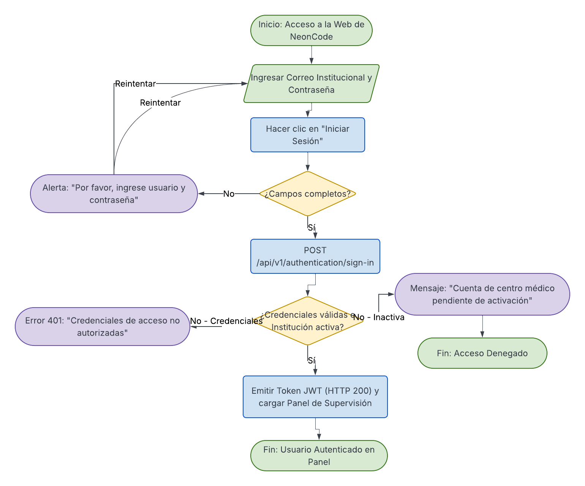
</div>

<div style="page-break-before: always;"></div>

**User Flow 2: Alta de Ambulancia y Vinculación de Contenedor Inteligente**

*   **User Stories relacionadas:** US07, US08
*   **Flujos incluidos:** *Happy Path* (registro de vehículo y asignación telemétrica de contenedor), matrícula de ambulancia duplicada, ID de contenedor no encontrado, contenedor previamente asignado a otro vehículo y falla de enlace telemétrico inicial.

<div align="center" style="text-align: center; margin: 3mm auto;">
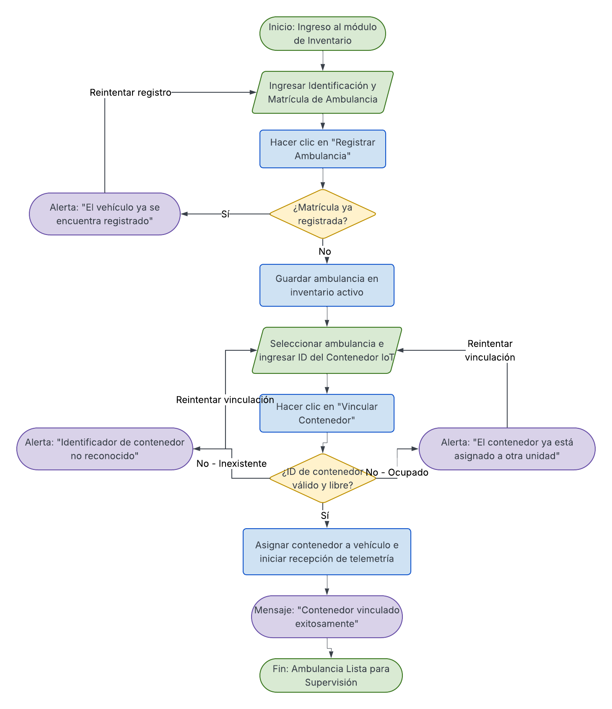
</div>

<div style="page-break-before: always;"></div>

**User Flow 3: Monitoreo Térmico en Ruta, Gestión de Alertas y Cierre de Custodia**

*   **User Stories relacionadas:** US10, US11, US13, US14, US17
*   **Flujos incluidos:** *Happy Path* (monitoreo en tiempo real, recepción de alerta por variación térmica, acción correctiva y confirmación de entrega), pérdida de señal del contenedor, umbral térmico no configurado, variación de stock por sensores de peso e incidencia no resuelta en ruta.

<div align="center" style="text-align: center; margin: 3mm auto;">
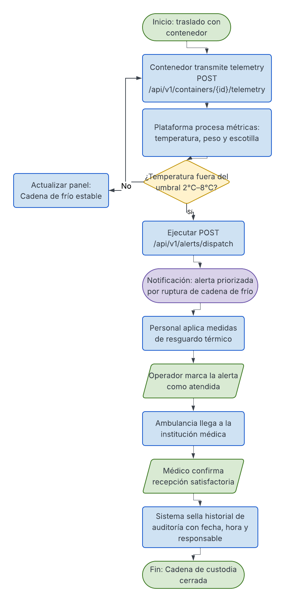
</div>

<div style="page-break-after: always;"></div>

# 4.5. Web Applications Prototyping

El prototipo interactivo consolida la representación visual y la dinámica de interacción de los mock-ups de alta fidelidad para el Landing Page institucional y la Web Application de **Medical SMARTBOX**, permitiendo realizar recorridos completos de experiencia de usuario previos a la codificación frontend.

Para el desarrollo del prototipo de alta fidelidad se utilizó la herramienta profesional **Figma**, estructurando componentes reutilizables bajo directrices de **Material Design**, estados interactivos (*hover*, *active*, modales de alerta crítica, filtros de tabla y visualizadores de telemetría IoT en tiempo real).

Las decisiones de interacción se fundamentaron directamente en la arquitectura de información (Sección 4.2), priorizando la reducción de carga cognitiva en situaciones de emergencia asistencial mediante navegación contextual directa, confirmaciones modales para operaciones críticas y retroalimentación inmediata sobre variables telemétricas.

* **Enlace al Prototipo Interactivo en Figma:** [Medical SMARTBOX - Figma Prototype](https://www.figma.com/design/QTb7ZzZZxSbfMghb8csfPO/NeonCode?node-id=2231-7&t=qCMM6bNK20EdUES6-1)
* **Alcance y Flujos Cubiertos en el Prototipo:**
  1. **Autenticación y Seguridad:** Acceso de personal médico y de ambulancia mediante verificación de credenciales y doble factor (2FA).
  2. **Monitoreo y Despacho en Tiempo Real:** Visualización en mapa georreferenciado de unidades vehiculares en tránsito, rutas activas y estado de contenedores inteligentes.
  3. **Telemetría y Control de Smart Container:** Detalle individual del contenedor (Smart Container SB-0231), curva continua de temperatura, nivel de carga de batería, sensor de peso y comando de apertura electromecánica.
  4. **Gestión de Incidentes y Excursiones Térmicas:** Notificación inmediata ante anomalías de frío, registro de causa raíz y acciones correctivas inmediatas.
  5. **Protocolo de Entrega y Cadena de Custodia:** Generación y validación de código de un solo uso (OTP) en centro hospitalario receptor y emisión de acta digital de custodia sellada.

* **Visualización de Recursos:** Ver el [Anexo B](63-anexos.md#anexo-b-tableros-digitales-y-prototipos-interactivos) para el catálogo de enlaces a tableros colaborativos y prototipos interactivos.

<div style="page-break-after: always;"></div>

# **4.6. Domain-Driven Software Architecture**

En este capítulo se formula la propuesta integral de arquitectura de software para la plataforma **Medical SMARTBOX**, articulando los hallazgos del modelado exploratorio preliminar con los patrones tácticos y estratégicos de **Domain-Driven Design (DDD)** concebidos por Eric Evans y Alberto Brandolini. A partir de los flujos identificados en el Big Picture EventStorming (Capítulo 2.4), se profundiza en la descomposición del dominio en Bounded Contexts, Agregados, Eventos de Dominio, Comandos y Consultas (Queries CQRS), estableciendo fronteras de consistencia transaccional de alta cohesión y bajo acoplamiento.

Para representar la arquitectura de forma rigurosa, comprensible y estandarizada entre perfiles clínicos, operadores logísticos y equipos de desarrollo, se adopta el **C4 Model** propuesto por Simon Brown. La arquitectura se organiza y documenta progresivamente a través de las siguientes secciones:
* **4.6.1. Design-Level EventStorming:** Descomposición táctica del dominio, identificación de invariantes y delimitación formal de Bounded Contexts.
* **4.6.2. Software Architecture Context Level Diagram (C4 Nivel 1):** Delimitación perimetral del sistema frente a los actores asistenciales y sistemas externos.
* **4.6.3. Software Architecture Container Level Diagrams (C4 Nivel 2):** Descomposición en unidades ejecutables independientes y tecnologías del stack oficial.
* **4.6.4. Software Architecture Component Level Diagrams (C4 Nivel 3):** Diseño modular interno bajo los principios de Clean Architecture e Inversión de Dependencias.

***

## **4.6.1. Design-Level EventStorming**

### **1. Introducción y Ficha Técnica del Taller Colaborativo**

A partir de la exploración macro realizada en el **Big Picture EventStorming (Capítulo 2.4)**, se ejecutó una sesión formal de **Design-Level EventStorming (DLES)** bajo los principios canónicos de Domain-Driven Design concebidos por Alberto Brandolini y las pautas tácticas de Nick Tune.

El objetivo primordial del Design-Level EventStorming es **cerrar la brecha entre la visión general del negocio y el diseño detallado de software orientado a objetos y arquitectura de microservicios/módulos DDD**, descomponiendo los procesos asistenciales en sus componentes transaccionales atómicos: Comandos, Consultas (Queries), Agregados con invariantes de negocio protegidas, Eventos de Dominio inmutables, Políticas reactivas (*Whenever-Then*), Modelos de Lectura (Read Models) y puntos de integración ciberfísica IoT.

#### Ficha Técnica de la Sesión Colaborativa
* **Modalidad y Alcance:** Sesión estructurada de modelado colaborativo intensivo y sincrónico orientada a la descomposición táctica del dominio.
* **Entorno y Herramienta:** Pizarra digital en **Miro**, organizada por carriles transaccionales y matrices de notas adhesivas digitales.
* **Participantes y Roles Multidisciplinarios:**
  * *Facilitador DDD y Arquitecto de Software:* Moderación del flujo temporal y preservación de fronteras transaccionales.
  * *Especialista en Hardware IoT y Firmware:* Definición de interacción con microcontrolador ESP32, sensores térmicos Peltier y celda HX711.
  * *Coordinador de Logística y Despacho Asistencial (Segmento 1):* Modelado de rutas críticas, contingencias en el tráfico de Lima y alimentación de 12V.
  * *Director Farmacéutico y Auditor Sanitario (Segmento 2):* Definición de límites de isquemia fría, actas inmutables y normativas DIGEMID (R.M. N° 833-2015).
* **Fases del Taller de Modelado Colaborativo (Brandolini & Tune):** 1) Generación divergente de eventos y comandos; 2) Agrupación en Agregados Raíz y blindaje de invariantes; 3) Definición de Consultas y Modelos de Lectura para interfaces web/móvil; 4) Modelado de políticas reactivas de orquestación; 5) Identificación de servicios externos y subsistemas de telemetría.

#### Convención Cromática Oficial de Post-its (Notación DDD Estándar)

Durante el taller colaborativo se aplicó el código de colores estandarizado internacionalmente para el modelado con notas adhesivas en pizarra digital:

| Tipo de Artefacto DDD | Color de Post-it | Notación y Sintaxis | Descripción y Propósito en el Dominio |
|---|---|---|---|
| **Domain Event** | Naranja (`#FFA500`) | Verbo en pasado participio (Inglés) | Hecho irreversible en el sistema (`ContainerLocked`, `ExcursionDetected`). |
| **Command** | Azul (`#2196F3`) | Verbo en imperativo / presente | Acción disparada por un actor o sistema (`LockContainer`, `LogTelemetry`). |
| **Query (CQRS)** | Azul Claro / Cian (`#80DEEA`) | Petición de lectura en presente | Consulta optimizada que proyecta información sin mutar el estado (`GetActiveTransportsQuery`, `GetTelemetrySnapshotQuery`). |
| **Aggregate Root** | Amarillo Ocre (`#FFF59D`) | Sustantivo en singular | Frontera de consistencia transaccional (`SmartContainer`, `MedicalTransport`). |
| **Business Policy / Rule** | Lila / Morado (`#BA68C8`) | *"Whenever [Event] THEN [Command]"* | Regla reactiva o de orquestación de negocio. |
| **Read Model / UI View** | Verde Claro (`#81C784`) | Nombre de la proyección / vista | Información requerida en pantalla para que el actor decida (`ActiveTransportsView`). |
| **Actor / User Role** | Amarillo Pálido (`#FFF9C4`) | Rol formal del usuario | Representa a los actores de los 2 segmentos objetivo (`Driver`, `Pharmacist`). |
| **External System / IoT** | Rosa / Fucsia (`#F48FB1`) | Nombre del sistema / hardware | Entidad ajena a la plataforma (`ESP32 Hardware`, `OBD-II Telemetry`, `FCM/Twilio`). |
| **Hotspot / Risk / Exception** | Rojo / Magenta (`#E53935`) | Problema o riesgo crítico | Fricción del entorno operativo de Lima (`12V Socket Disconnect`, `TomTom Traffic Delay`). |

***

### **2. Matriz Estratégica de Clasificación de Bounded Contexts**

Bajo los principios de Domain-Driven Design para arquitecturas SaaS en entornos asistenciales y logísticos, el dominio de **Medical SMARTBOX** se estructura en **seis (6) Bounded Contexts**, balanceando subdominios estratégicos (*Core Domains*), de soporte (*Supporting Subdomains*) y genéricos (*Generic Subdomains*).

A diferencia de la exploración macro de Big Picture (Capítulo 2.4), en esta etapa de diseño detallado se independizó el contexto **Subscription & Fleet Provisioning** como un *Subdominio de Soporte*. Esta separación aísla los contratos comerciales de suscripción B2B, la tarificación modular por factor de forma (*Small Box* de 5L vs. *Standard Box* de 20L) y la vinculación telemática de activos vehiculares del flujo clínico asistencial de los *Core Domains*, garantizando alta cohesión y bajo acoplamiento para los **dos segmentos objetivo** del proyecto:

<table border="1" cellpadding="3" cellspacing="0" style="border-collapse: collapse; width: 100%; table-layout: fixed; font-size: 7.2pt; border: 1px solid #cbd5e1; margin: 12px 0;">
<colgroup>
  <col style="width: 17%;" />
  <col style="width: 17%;" />
  <col style="width: 28%;" />
  <col style="width: 20%;" />
  <col style="width: 18%;" />
</colgroup>
<thead>
    <tr>
      <th>Bounded Context</th>
      <th>Clasificación Estratégica</th>
      <th>Responsabilidad Primaria en el Sistema</th>
      <th>Agregados Principales (Aggregate Roots)</th>
      <th>Segmento Objetivo Atendido</th>
    </tr>
  </thead>
  <tbody>
    <tr>
      <td><strong>1. Identity & Access Management (IAM)</strong></td>
      <td><em>Generic Subdomain</em></td>
      <td>Autenticación multifactor (2FA), gestión de sesiones JWT, roles asistenciales y asignación institucional.</td>
      <td><code>UserAccount</code>, <code>RolePermission</code>, <code>MedicalOrganization</code></td>
      <td>Segmento 1 (Operadores de transporte) y Segmento 2 (Centros de salud).</td>
    </tr>
    <tr>
      <td><strong>2. Subscription & Fleet Provisioning</strong></td>
      <td><em>Supporting Subdomain</em></td>
      <td>Gestión comercial SaaS de suscripciones por número de contenedores y tamaño de box (*Small* vs. *Standard*), y vinculación con la ambulancia.</td>
      <td><code>SubscriptionPlan</code>, <code>ContainerDevice</code>, <code>VehicleBinding</code></td>
      <td>Segmento 1 (Vínculo con flota) y Segmento 2 (Contratación B2B).</td>
    </tr>
    <tr>
      <td><strong>3. Medical Transport Planning & Dispatching</strong></td>
      <td><em>Core Domain</em></td>
      <td>Programación de traslados de emergencia, control de tiempos de isquemia fría, selección de rutas anti-congestión en Lima y cálculo de ETA.</td>
      <td><code>TransportOrder</code>, <code>DispatchTrip</code></td>
      <td>Segmento 1 (Conducción y despacho) y Segmento 2 (Programación de quirófano).</td>
    </tr>
    <tr>
      <td><strong>4. Smart Container & Telemetry Monitoring</strong></td>
      <td><em>Core Domain (Diferenciador)</em></td>
      <td>Ingesta continua de telemetría IoT desde el ESP32: temperatura Peltier (2°C-8°C), tara/peso neto HX711, bloqueo solenoide, acelerómetro y 12V vehicular.</td>
      <td><code>SmartContainer</code>, <code>TelemetrySnapshot</code></td>
      <td>Segmento 1 (Cuidado de energía en ruta) y Segmento 2 (Monitoreo de conservación).</td>
    </tr>
    <tr>
      <td><strong>5. Critical Alerting & Incident Response</strong></td>
      <td><em>Core Domain</em></td>
      <td>Motor de evaluación de umbrales en tiempo real, disparo omnicanal de alertas (Push/SMS), escalamiento y registro de contingencias.</td>
      <td><code>AlertRule</code>, <code>CriticalIncident</code>, <code>ContingencyResolution</code></td>
      <td>Segmento 1 (Acción inmediata en cabina) y Segmento 2 (Prevención de pérdida).</td>
    </tr>
    <tr>
      <td><strong>6. Chain of Custody & Traceability</strong></td>
      <td><em>Core Domain / Regulatorio</em></td>
      <td>Trazabilidad inmutable legal y sanitaria (DIGEMID R.M. 833-2015): despacho con QR, apertura en destino con OTP y acta digital de entrega.</td>
      <td><code>CustodyTransfer</code>, <code>DigitalAuditManifest</code></td>
      <td>Segmento 2 (Recepción en farmacia/quirófano y auditoría DIGDOT).</td>
    </tr>
  </tbody>
</table>

#### Mapeo Formal de Bounded Contexts a la Taxonomía SaaS del Dominio

Para corroborar la cobertura integral del modelo respecto a los requisitos de plataformas SaaS para salud y logística crítica, la siguiente matriz correlaciona los subdominios de la taxonomía SaaS estándar con la partición arquitectónica en Bounded Contexts adoptada en **Medical SMARTBOX**:

<table border="1" cellpadding="3" cellspacing="0" style="border-collapse: collapse; width: 100%; table-layout: fixed; font-size: 7.2pt; border: 1px solid #cbd5e1; margin: 12px 0;">
<colgroup>
  <col style="width: 25%;" />
  <col style="width: 25%;" />
  <col style="width: 20%;" />
  <col style="width: 30%;" />
</colgroup>
<thead>
    <tr>
      <th>Subdominio SaaS Estándar</th>
      <th>Bounded Context Asignado</th>
      <th>Tipo DDD</th>
      <th>Justificación de Diseño y Cobertura Operativa</th>
    </tr>
  </thead>
  <tbody>
    <tr>
      <td><strong>1. Autenticación y Autorización (IAM)</strong></td>
      <td>Identity & Access Management (IAM)</td>
      <td><em>Generic</em></td>
      <td>Centraliza credenciales JWT, control de acceso basado en roles (RBAC) para ambos segmentos y registro formal de sedes con código RENIPRESS.</td>
    </tr>
    <tr>
      <td><strong>2. Facturación y Suscripciones B2B</strong></td>
      <td>Subscription & Fleet Provisioning</td>
      <td><em>Supporting</em></td>
      <td>Modela planes institucionales mensuales, tarificación por flota activa y capacidad asignada de contenedores (5L vs. 20L).</td>
    </tr>
    <tr>
      <td><strong>3. Planificación y Despacho Operativo</strong></td>
      <td>Medical Transport Planning & Dispatching</td>
      <td><em>Core</em></td>
      <td>Coordina la asignación de ambulancias, cálculo de tiempos de isquemia y rutas óptimas evitando la congestión vehicular de Lima.</td>
    </tr>
    <tr>
      <td><strong>4. Monitoreo e Ingestión Telemática IoT</strong></td>
      <td>Smart Container & Telemetry Monitoring</td>
      <td><em>Core</em></td>
      <td>Procesa el flujo sensorial de temperatura, peso y batería vía MQTT TLS, y gestiona el estado electromecánico del cerrojo.</td>
    </tr>
    <tr>
      <td><strong>5. Gestión de Contingencias y Alertas</strong></td>
      <td>Critical Alerting & Incident Response</td>
      <td><em>Core</em></td>
      <td>Evalúa desviaciones térmicas y demoras de tráfico en tiempo real, despachando notificaciones omnicanal (Push/SMS).</td>
    </tr>
    <tr>
      <td><strong>6. Auditoría, Custodia y Cumplimiento</strong></td>
      <td>Chain of Custody & Traceability</td>
      <td><em>Core</em></td>
      <td>Asegura la inviolabilidad de entrega mediante token OTP y genera el acta digital inmutable con hash SHA-256 (DIGEMID).</td>
    </tr>
    <tr>
      <td><strong>7. Analítica y Métricas de Rendimiento</strong></td>
      <td>Consolidado en Telemetry Monitoring y Chain of Custody</td>
      <td><em>Supporting</em></td>
      <td>Se resuelve mediante modelos de lectura (<em>Read Models</em>) y reportes consolidados de cumplimiento térmico sin requerir un microservicio analítico separado.</td>
    </tr>
    <tr>
      <td><strong>8. Fidelización y Retención B2B (<em>Engagement</em>)</strong></td>
      <td>Integrado en Subscription & Fleet Provisioning</td>
      <td><em>Supporting</em></td>
      <td>En el modelo B2B interinstitucional (hospitales, redes de ambulancias), la fidelización no se gestiona mediante puntos de consumo masivo, sino a través de Acuerdos de Nivel de Servicio (SLA garantizado de respuesta técnica) y reportes ejecutivos de efectividad operativa.</td>
    </tr>
  </tbody>
</table>

A nivel de descomposición analítica de dominio, la gestión contractual de flotas (`Subscription & Fleet Provisioning`) se modela tácticamente como un subdominio de soporte independiente de la autenticación pura de usuarios (`IAM`). En la posterior fase de diseño de clases y persistencia relacional, ambos contextos se agrupan de forma cohesionada bajo un esquema unificado (`IAM & Subscriptions`). Dicha decisión de ingeniería optimiza las transacciones de validación de cuotas multi-inquilino (*multi-tenancy*), garantizando que las credenciales del personal médico y la disponibilidad de cajas inteligentes se resuelvan dentro de la misma frontera transaccional en la base de datos.

***

### **3. Diagrama Panorámico de Integración de Bounded Contexts**

Este diagrama macro ilustra cómo interactúan los seis contextos mediante el intercambio de eventos de dominio asíncronos y comandos de orquestación, asegurando un desacoplamiento de bajo acoplamiento y alta cohesión.

***

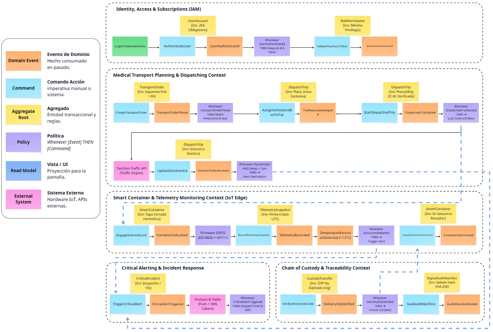  
*Nota: Elaboración propia en Miro según la técnica de modelado colaborativo Design-Level EventStorming para Medical SMARTBOX.*

***

### **4. Desglose Exhaustivo por Bounded Context**

A continuación se detalla la especificación transaccional completa para cada uno de los seis Bounded Contexts, definiendo sus responsabilidades de negocio, agregados, invariantes inviolables, matrices de artefactos DDD y flujos de ejecución.

***

#### **4.6.1.1. Bounded Context 1: Identity & Access Management (IAM)**

* **Clasificación:** *Generic Subdomain*  
* **Alineación con Segmentos:** Centraliza la gobernanza de identidades para el **Segmento 1** (conductores de ambulancia, técnicos paramédicos y despachadores logísticos) y el **Segmento 2** (químicos farmacéuticos, médicos cirujanos de trasplante y auditores de calidad hospitalaria).

##### Agregados Raíz e Invariantes de Negocio

1. **`UserAccount` (Aggregate Root):**
   * *Invariante 1.1:* Ningún usuario puede activar una sesión operativa sin haber completado la verificación de doble factor (2FA vía TOTP/SMS).
   * *Invariante 1.2:* Los usuarios con rol de conductor de ambulancia (`AmbulanceDriver`) deben contar obligatoriamente con número de brevete profesional (A-IIb o A-III) vigente registrado en el perfil.
2. **`MedicalOrganization` (Aggregate Root):**
   * *Invariante 1.3:* Toda sede de centro de salud receptora debe contar con el código único RENIPRESS (Registro Nacional de IPRESS - MINSA) validado antes de ser autorizada como punto de origen o destino de carga médica.

##### Matriz de Artefactos DDD - Contexto IAM

<div style="margin: 10px 0 14px 0;">
<p style="font-weight: bold; margin-bottom: 5px; font-size: 7.8pt; color: #1e3a8a;">A. Flujo de Consulta / CQRS Read Side — Contexto IAM</p>
<table border="1" cellpadding="3" cellspacing="0" style="border-collapse: collapse; width: 100%; table-layout: fixed; font-size: 7pt; margin-bottom: 12px; border: 1px solid #cbd5e1;">
<colgroup>
  <col style="width: 25%;" />
  <col style="width: 35%;" />
  <col style="width: 40%;" />
</colgroup>
<thead>
<tr style="background-color: #f1f5f9;">
  <th style="border: 1px solid #cbd5e1; padding: 4px; text-align: left; font-weight: bold;">Actor / Solicitante (Amarillo)</th>
  <th style="border: 1px solid #cbd5e1; padding: 4px; text-align: left; font-weight: bold;">Query CQRS (Cian)</th>
  <th style="border: 1px solid #cbd5e1; padding: 4px; text-align: left; font-weight: bold;">Read Model Proyectado (Verde)</th>
</tr>
</thead>
<tbody>
<tr>
  <td style="border: 1px solid #cbd5e1; padding: 3px 4px; vertical-align: top;">Cualquier Usuario</td>
  <td style="border: 1px solid #cbd5e1; padding: 3px 4px; vertical-align: top;"><code>GetUserProfileQuery</code></td>
  <td style="border: 1px solid #cbd5e1; padding: 3px 4px; vertical-align: top;"><code>LoginCredentialsView</code></td>
</tr>
<tr>
  <td style="border: 1px solid #cbd5e1; padding: 3px 4px; vertical-align: top;">Paramédico / Médico</td>
  <td style="border: 1px solid #cbd5e1; padding: 3px 4px; vertical-align: top;"><code>ValidateUserCredentialsQuery</code></td>
  <td style="border: 1px solid #cbd5e1; padding: 3px 4px; vertical-align: top;"><code>OtpChallengeView</code></td>
</tr>
<tr>
  <td style="border: 1px solid #cbd5e1; padding: 3px 4px; vertical-align: top;">Coordinador Flota (Seg. 1)</td>
  <td style="border: 1px solid #cbd5e1; padding: 3px 4px; vertical-align: top;"><code>GetAssignedRolesQuery</code></td>
  <td style="border: 1px solid #cbd5e1; padding: 3px 4px; vertical-align: top;"><code>DriverRegistryView</code></td>
</tr>
<tr>
  <td style="border: 1px solid #cbd5e1; padding: 3px 4px; vertical-align: top;">Administrador Clínico (Seg. 2)</td>
  <td style="border: 1px solid #cbd5e1; padding: 3px 4px; vertical-align: top;"><code>GetMedicalOrganizationByRenipressQuery</code></td>
  <td style="border: 1px solid #cbd5e1; padding: 3px 4px; vertical-align: top;"><code>OrganizationProfileView</code></td>
</tr>
</tbody>
</table>
</div>

<div style="margin: 10px 0 16px 0;">
<p style="font-weight: bold; margin-bottom: 5px; font-size: 7.8pt; color: #991b1b;">B. Flujo Transaccional y Eventos / DDD Write Side — Contexto IAM</p>
<table border="1" cellpadding="3" cellspacing="0" style="border-collapse: collapse; width: 100%; table-layout: fixed; font-size: 7pt; margin-bottom: 12px; border: 1px solid #cbd5e1;">
<colgroup>
  <col style="width: 24%;" />
  <col style="width: 22%;" />
  <col style="width: 27%;" />
  <col style="width: 27%;" />
</colgroup>
<thead>
<tr style="background-color: #f1f5f9;">
  <th style="border: 1px solid #cbd5e1; padding: 4px; text-align: left; font-weight: bold;">Comando Ejecutado (Azul)</th>
  <th style="border: 1px solid #cbd5e1; padding: 4px; text-align: left; font-weight: bold;">Agregado / Root (Ocre)</th>
  <th style="border: 1px solid #cbd5e1; padding: 4px; text-align: left; font-weight: bold;">Domain Event Resultante (Naranja)</th>
  <th style="border: 1px solid #cbd5e1; padding: 4px; text-align: left; font-weight: bold;">Política / Regla Reactiva (Morada)</th>
</tr>
</thead>
<tbody>
<tr>
  <td style="border: 1px solid #cbd5e1; padding: 3px 4px; vertical-align: top;"><code>AuthenticateUser</code></td>
  <td style="border: 1px solid #cbd5e1; padding: 3px 4px; vertical-align: top;"><code>UserAccount</code></td>
  <td style="border: 1px solid #cbd5e1; padding: 3px 4px; vertical-align: top;"><code>UserAuthenticated</code></td>
  <td style="border: 1px solid #cbd5e1; padding: 3px 4px; vertical-align: top;"><em>Whenever [UserAuthenticated] THEN [SendTwoFactorChallengeCommand]</em></td>
</tr>
<tr>
  <td style="border: 1px solid #cbd5e1; padding: 3px 4px; vertical-align: top;"><code>ValidateTwoFactorToken</code></td>
  <td style="border: 1px solid #cbd5e1; padding: 3px 4px; vertical-align: top;"><code>UserAccount</code></td>
  <td style="border: 1px solid #cbd5e1; padding: 3px 4px; vertical-align: top;"><code>SessionAccessGranted</code></td>
  <td style="border: 1px solid #cbd5e1; padding: 3px 4px; vertical-align: top;"><em>Whenever [SessionAccessGranted] THEN [IssueScopedJwtTokenCommand]</em></td>
</tr>
<tr>
  <td style="border: 1px solid #cbd5e1; padding: 3px 4px; vertical-align: top;"><code>RegisterDriverProfile</code></td>
  <td style="border: 1px solid #cbd5e1; padding: 3px 4px; vertical-align: top;"><code>UserAccount</code></td>
  <td style="border: 1px solid #cbd5e1; padding: 3px 4px; vertical-align: top;"><code>DriverProfileEnrolled</code></td>
  <td style="border: 1px solid #cbd5e1; padding: 3px 4px; vertical-align: top;"><em>Whenever [DriverProfileEnrolled] THEN [AuthorizeEmergencyVehicleBindingCommand]</em></td>
</tr>
<tr>
  <td style="border: 1px solid #cbd5e1; padding: 3px 4px; vertical-align: top;"><code>RegisterMedicalOrganization</code></td>
  <td style="border: 1px solid #cbd5e1; padding: 3px 4px; vertical-align: top;"><code>MedicalOrganization</code></td>
  <td style="border: 1px solid #cbd5e1; padding: 3px 4px; vertical-align: top;"><code>MedicalOrganizationEnrolled</code></td>
  <td style="border: 1px solid #cbd5e1; padding: 3px 4px; vertical-align: top;"><em>Whenever [MedicalOrganizationEnrolled] THEN [ValidateRenipressRegistrationCommand]</em></td>
</tr>
</tbody>
</table>
</div>

***

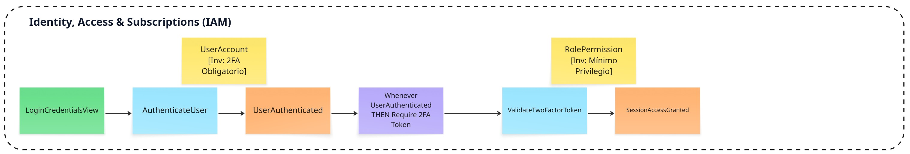  
*Nota: Elaboración propia en Miro según la técnica Design-Level EventStorming para el Bounded Context de Identity & Access Management (IAM).*

***

#### **4.6.1.2. Bounded Context 2: Subscription & Fleet Provisioning**

* **Clasificación:** *Supporting Subdomain*  
* **Alineación con Segmentos:** Modela la relación comercial y operativa de la startup con ambos segmentos. Para el **Segmento 2**, gestiona las suscripciones SaaS por cantidad y factor de forma de contenedor contratado (*Small Box* para vacunas, ampollas y biopsias de 5L; *Standard Box* para hemoderivados y órganos de 20L). Para el **Segmento 1**, gestiona el inventario de dispositivos hardware y su emparejamiento telemático con las ambulancias asistenciales.

##### Agregados Raíz e Invariantes de Negocio

1. **`SubscriptionPlan` (Aggregate Root):**
   * *Invariante 2.1:* Una institución médica no puede solicitar el aprovisionamiento de un contenedor adicional si la cantidad activa excede la cuota contratada en su plan suscrito.
   * *Invariante 2.2:* Los contenedores asignados deben corresponder al factor de forma contratado (*Small Box* o *Standard Box*) acorde al tipo de carga declarada en el contrato B2B.
2. **`VehicleBinding` (Aggregate Root):**
   * *Invariante 2.3:* Un contenedor inteligente solo puede estar vinculado telemáticamente a una única ambulancia física a la vez, identificada por su placa de rodaje única y código de móvil asistencial.

##### Matriz de Artefactos DDD - Contexto Subscription & Fleet Provisioning

<div style="margin: 10px 0 14px 0;">
<p style="font-weight: bold; margin-bottom: 5px; font-size: 7.8pt; color: #1e3a8a;">A. Flujo de Consulta / CQRS Read Side — Contexto Subscription & Fleet Provisioning</p>
<table border="1" cellpadding="3" cellspacing="0" style="border-collapse: collapse; width: 100%; table-layout: fixed; font-size: 7pt; margin-bottom: 12px; border: 1px solid #cbd5e1;">
<colgroup>
  <col style="width: 25%;" />
  <col style="width: 35%;" />
  <col style="width: 40%;" />
</colgroup>
<thead>
<tr style="background-color: #f1f5f9;">
  <th style="border: 1px solid #cbd5e1; padding: 4px; text-align: left; font-weight: bold;">Actor / Solicitante (Amarillo)</th>
  <th style="border: 1px solid #cbd5e1; padding: 4px; text-align: left; font-weight: bold;">Query CQRS (Cian)</th>
  <th style="border: 1px solid #cbd5e1; padding: 4px; text-align: left; font-weight: bold;">Read Model Proyectado (Verde)</th>
</tr>
</thead>
<tbody>
<tr>
  <td style="border: 1px solid #cbd5e1; padding: 3px 4px; vertical-align: top;">Director Médico (Seg. 2)</td>
  <td style="border: 1px solid #cbd5e1; padding: 3px 4px; vertical-align: top;"><code>GetActiveSubscriptionPlanQuery</code></td>
  <td style="border: 1px solid #cbd5e1; padding: 3px 4px; vertical-align: top;"><code>SubscriptionTiersView</code></td>
</tr>
<tr>
  <td style="border: 1px solid #cbd5e1; padding: 3px 4px; vertical-align: top;">Técnico Logístico</td>
  <td style="border: 1px solid #cbd5e1; padding: 3px 4px; vertical-align: top;"><code>GetContainerDeviceStatusQuery</code></td>
  <td style="border: 1px solid #cbd5e1; padding: 3px 4px; vertical-align: top;"><code>DeviceInventoryView</code></td>
</tr>
<tr>
  <td style="border: 1px solid #cbd5e1; padding: 3px 4px; vertical-align: top;">Paramédico / Despachador (Seg. 1)</td>
  <td style="border: 1px solid #cbd5e1; padding: 3px 4px; vertical-align: top;"><code>GetVehicleBindingQuery</code></td>
  <td style="border: 1px solid #cbd5e1; padding: 3px 4px; vertical-align: top;"><code>FleetPairingView</code></td>
</tr>
</tbody>
</table>
</div>

<div style="margin: 10px 0 16px 0;">
<p style="font-weight: bold; margin-bottom: 5px; font-size: 7.8pt; color: #991b1b;">B. Flujo Transaccional y Eventos / DDD Write Side — Contexto Subscription & Fleet Provisioning</p>
<table border="1" cellpadding="3" cellspacing="0" style="border-collapse: collapse; width: 100%; table-layout: fixed; font-size: 7pt; margin-bottom: 12px; border: 1px solid #cbd5e1;">
<colgroup>
  <col style="width: 24%;" />
  <col style="width: 22%;" />
  <col style="width: 27%;" />
  <col style="width: 27%;" />
</colgroup>
<thead>
<tr style="background-color: #f1f5f9;">
  <th style="border: 1px solid #cbd5e1; padding: 4px; text-align: left; font-weight: bold;">Comando Ejecutado (Azul)</th>
  <th style="border: 1px solid #cbd5e1; padding: 4px; text-align: left; font-weight: bold;">Agregado / Root (Ocre)</th>
  <th style="border: 1px solid #cbd5e1; padding: 4px; text-align: left; font-weight: bold;">Domain Event Resultante (Naranja)</th>
  <th style="border: 1px solid #cbd5e1; padding: 4px; text-align: left; font-weight: bold;">Política / Regla Reactiva (Morada)</th>
</tr>
</thead>
<tbody>
<tr>
  <td style="border: 1px solid #cbd5e1; padding: 3px 4px; vertical-align: top;"><code>SubscribeToPlan</code></td>
  <td style="border: 1px solid #cbd5e1; padding: 3px 4px; vertical-align: top;"><code>SubscriptionPlan</code></td>
  <td style="border: 1px solid #cbd5e1; padding: 3px 4px; vertical-align: top;"><code>SubscriptionActivated</code></td>
  <td style="border: 1px solid #cbd5e1; padding: 3px 4px; vertical-align: top;"><em>Whenever [SubscriptionActivated] THEN [ProvisionContainerAllocationCommand]</em></td>
</tr>
<tr>
  <td style="border: 1px solid #cbd5e1; padding: 3px 4px; vertical-align: top;"><code>ProvisionContainerHardware</code></td>
  <td style="border: 1px solid #cbd5e1; padding: 3px 4px; vertical-align: top;"><code>ContainerDevice</code></td>
  <td style="border: 1px solid #cbd5e1; padding: 3px 4px; vertical-align: top;"><code>ContainerHardwareProvisioned</code></td>
  <td style="border: 1px solid #cbd5e1; padding: 3px 4px; vertical-align: top;"><em>Whenever [ContainerHardwareProvisioned] THEN [EnableTelemetrySensorsCommand]</em></td>
</tr>
<tr>
  <td style="border: 1px solid #cbd5e1; padding: 3px 4px; vertical-align: top;"><code>BindContainerToVehicle</code></td>
  <td style="border: 1px solid #cbd5e1; padding: 3px 4px; vertical-align: top;"><code>VehicleBinding</code></td>
  <td style="border: 1px solid #cbd5e1; padding: 3px 4px; vertical-align: top;"><code>ContainerBoundToVehicle</code></td>
  <td style="border: 1px solid #cbd5e1; padding: 3px 4px; vertical-align: top;"><em>Whenever [ContainerBoundToVehicle] THEN [Activate12VPowerTelemetryCommand]</em></td>
</tr>
</tbody>
</table>
</div>

***

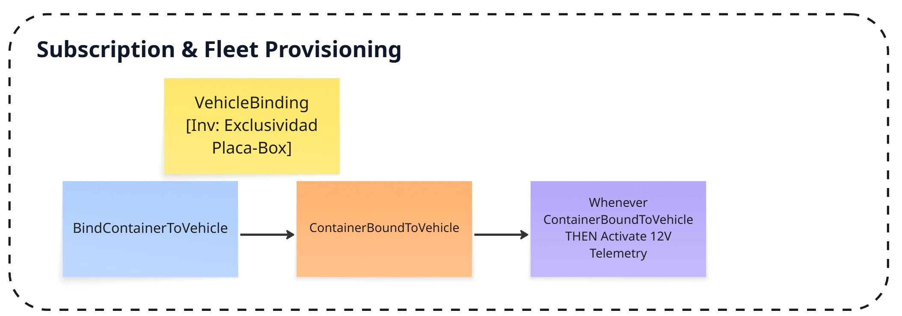  
*Nota: Elaboración propia en Miro según la técnica Design-Level EventStorming para el Bounded Context de Subscription & Fleet Provisioning.*

***

#### **4.6.1.3. Bounded Context 3: Medical Transport Planning & Dispatching**

* **Clasificación:** *Core Domain*  
* **Alineación con Segmentos:** Articula la necesidad médica del **Segmento 2** (solicitud urgente de insumo con rango térmico de 2°C a 8°C y tiempo de isquemia fría crítico) con la respuesta operativa del **Segmento 1** (asignación de unidad asistencial, cálculo de ruta anti-tráfico en Lima con TomTom y estimación dinámica de ETA).

##### Agregados Raíz e Invariantes de Negocio

1. **`TransportOrder` (Aggregate Root):**
   * *Invariante 3.1:* Una orden de traslado de órganos o tejidos no puede ser creada sin declarar el **Tiempo Máximo de Isquemia Fría** (ej. <4 horas para corazón, <8 horas para hígado, conforme a la Directiva Sanitaria N° 152/MINSA).
   * *Invariante 3.2:* Toda orden debe definir un origen (IPRESS remitente) y destino (IPRESS receptora) con geoceldas GPS verificadas en Lima/Callao.
2. **`DispatchTrip` (Aggregate Root):**
   * *Invariante 3.3:* Un viaje no puede iniciar su transición a estado `InTransit` si el contenedor médico asignado no ha alcanzado previamente su temperatura de pre-enfriamiento operativo (+2.0 °C a +8.0 °C).
   * *Invariante 3.4:* El viaje no puede darse por finalizado si la ambulancia se encuentra fuera del radio perimetral de seguridad (geofence de 100 metros) de la rampa de emergencia del hospital destino.

##### Matriz de Artefactos DDD - Contexto Transport Planning & Dispatching

<div style="margin: 10px 0 14px 0;">
<p style="font-weight: bold; margin-bottom: 5px; font-size: 7.8pt; color: #1e3a8a;">A. Flujo de Consulta / CQRS Read Side — Contexto Transport Planning & Dispatching</p>
<table border="1" cellpadding="3" cellspacing="0" style="border-collapse: collapse; width: 100%; table-layout: fixed; font-size: 7pt; margin-bottom: 12px; border: 1px solid #cbd5e1;">
<colgroup>
  <col style="width: 25%;" />
  <col style="width: 35%;" />
  <col style="width: 40%;" />
</colgroup>
<thead>
<tr style="background-color: #f1f5f9;">
  <th style="border: 1px solid #cbd5e1; padding: 4px; text-align: left; font-weight: bold;">Actor / Solicitante (Amarillo)</th>
  <th style="border: 1px solid #cbd5e1; padding: 4px; text-align: left; font-weight: bold;">Query CQRS (Cian)</th>
  <th style="border: 1px solid #cbd5e1; padding: 4px; text-align: left; font-weight: bold;">Read Model Proyectado (Verde)</th>
</tr>
</thead>
<tbody>
<tr>
  <td style="border: 1px solid #cbd5e1; padding: 3px 4px; vertical-align: top;">Químico Farmacéutico (Seg. 2)</td>
  <td style="border: 1px solid #cbd5e1; padding: 3px 4px; vertical-align: top;"><code>GetTransportOrderDetailsQuery</code></td>
  <td style="border: 1px solid #cbd5e1; padding: 3px 4px; vertical-align: top;"><code>OrderCreationFormView</code></td>
</tr>
<tr>
  <td style="border: 1px solid #cbd5e1; padding: 3px 4px; vertical-align: top;">Despachador Flota (Seg. 1)</td>
  <td style="border: 1px solid #cbd5e1; padding: 3px 4px; vertical-align: top;"><code>GetFleetDispatchBoardQuery</code></td>
  <td style="border: 1px solid #cbd5e1; padding: 3px 4px; vertical-align: top;"><code>FleetDispatchBoardView</code></td>
</tr>
<tr>
  <td style="border: 1px solid #cbd5e1; padding: 3px 4px; vertical-align: top;">Chofer Ambulancia (Seg. 1)</td>
  <td style="border: 1px solid #cbd5e1; padding: 3px 4px; vertical-align: top;"><code>GetActiveTripMonitorQuery</code></td>
  <td style="border: 1px solid #cbd5e1; padding: 3px 4px; vertical-align: top;"><code>ActiveTripMonitorView</code></td>
</tr>
<tr>
  <td style="border: 1px solid #cbd5e1; padding: 3px 4px; vertical-align: top;">Sistema / TomTom API</td>
  <td style="border: 1px solid #cbd5e1; padding: 3px 4px; vertical-align: top;"><code>CalculateDynamicRouteEtaQuery</code></td>
  <td style="border: 1px solid #cbd5e1; padding: 3px 4px; vertical-align: top;"><code>ActiveTripMonitorView</code></td>
</tr>
<tr>
  <td style="border: 1px solid #cbd5e1; padding: 3px 4px; vertical-align: top;">Chofer Ambulancia (Seg. 1) / Sistema GPS</td>
  <td style="border: 1px solid #cbd5e1; padding: 3px 4px; vertical-align: top;"><code>GetDestinationGeofenceStatusQuery</code></td>
  <td style="border: 1px solid #cbd5e1; padding: 3px 4px; vertical-align: top;"><code>DestinationArrivalView</code></td>
</tr>
</tbody>
</table>
</div>

<div style="margin: 10px 0 16px 0;">
<p style="font-weight: bold; margin-bottom: 5px; font-size: 7.8pt; color: #991b1b;">B. Flujo Transaccional y Eventos / DDD Write Side — Contexto Transport Planning & Dispatching</p>
<table border="1" cellpadding="3" cellspacing="0" style="border-collapse: collapse; width: 100%; table-layout: fixed; font-size: 7pt; margin-bottom: 12px; border: 1px solid #cbd5e1;">
<colgroup>
  <col style="width: 24%;" />
  <col style="width: 22%;" />
  <col style="width: 27%;" />
  <col style="width: 27%;" />
</colgroup>
<thead>
<tr style="background-color: #f1f5f9;">
  <th style="border: 1px solid #cbd5e1; padding: 4px; text-align: left; font-weight: bold;">Comando Ejecutado (Azul)</th>
  <th style="border: 1px solid #cbd5e1; padding: 4px; text-align: left; font-weight: bold;">Agregado / Root (Ocre)</th>
  <th style="border: 1px solid #cbd5e1; padding: 4px; text-align: left; font-weight: bold;">Domain Event Resultante (Naranja)</th>
  <th style="border: 1px solid #cbd5e1; padding: 4px; text-align: left; font-weight: bold;">Política / Regla Reactiva (Morada)</th>
</tr>
</thead>
<tbody>
<tr>
  <td style="border: 1px solid #cbd5e1; padding: 3px 4px; vertical-align: top;"><code>CreateTransportOrder</code></td>
  <td style="border: 1px solid #cbd5e1; padding: 3px 4px; vertical-align: top;"><code>TransportOrder</code></td>
  <td style="border: 1px solid #cbd5e1; padding: 3px 4px; vertical-align: top;"><code>TransportOrderPlaced</code></td>
  <td style="border: 1px solid #cbd5e1; padding: 3px 4px; vertical-align: top;"><em>Whenever [TransportOrderPlaced] THEN [EvaluateFleetAvailabilityCommand]</em></td>
</tr>
<tr>
  <td style="border: 1px solid #cbd5e1; padding: 3px 4px; vertical-align: top;"><code>AssignVehicleAndBoxToTrip</code></td>
  <td style="border: 1px solid #cbd5e1; padding: 3px 4px; vertical-align: top;"><code>DispatchTrip</code></td>
  <td style="border: 1px solid #cbd5e1; padding: 3px 4px; vertical-align: top;"><code>TripResourcesAssigned</code></td>
  <td style="border: 1px solid #cbd5e1; padding: 3px 4px; vertical-align: top;"><em>Whenever [TripResourcesAssigned] THEN [RequestContainerPrecoolingCommand]</em></td>
</tr>
<tr>
  <td style="border: 1px solid #cbd5e1; padding: 3px 4px; vertical-align: top;"><code>StartDispatchedTrip</code></td>
  <td style="border: 1px solid #cbd5e1; padding: 3px 4px; vertical-align: top;"><code>DispatchTrip</code></td>
  <td style="border: 1px solid #cbd5e1; padding: 3px 4px; vertical-align: top;"><code>DispatchedTripStarted</code></td>
  <td style="border: 1px solid #cbd5e1; padding: 3px 4px; vertical-align: top;"><em>Whenever [DispatchedTripStarted] THEN [LockContainerElectromechanicalLidCommand]</em></td>
</tr>
<tr>
  <td style="border: 1px solid #cbd5e1; padding: 3px 4px; vertical-align: top;"><code>UpdateDynamicEta</code></td>
  <td style="border: 1px solid #cbd5e1; padding: 3px 4px; vertical-align: top;"><code>DispatchTrip</code></td>
  <td style="border: 1px solid #cbd5e1; padding: 3px 4px; vertical-align: top;"><code>DynamicEtaRecalculated</code></td>
  <td style="border: 1px solid #cbd5e1; padding: 3px 4px; vertical-align: top;"><em>Whenever [DynamicEtaRecalculated] AND delay > 15m THEN [NotifyHospitalRampCommand]</em></td>
</tr>
<tr>
  <td style="border: 1px solid #cbd5e1; padding: 3px 4px; vertical-align: top;"><code>RegisterDestinationArrival</code></td>
  <td style="border: 1px solid #cbd5e1; padding: 3px 4px; vertical-align: top;"><code>DispatchTrip</code></td>
  <td style="border: 1px solid #cbd5e1; padding: 3px 4px; vertical-align: top;"><code>TripDestinationReached</code></td>
  <td style="border: 1px solid #cbd5e1; padding: 3px 4px; vertical-align: top;"><em>Whenever [TripDestinationReached] THEN [NotifyHospitalReceivingTeamCommand]</em></td>
</tr>
</tbody>
</table>
</div>

***

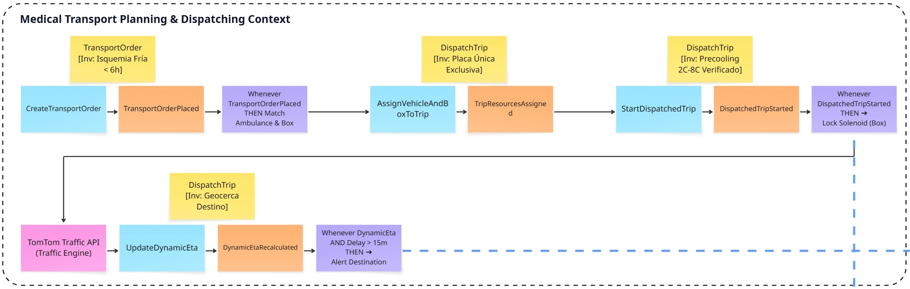  
*Nota: Elaboración propia en Miro según la técnica Design-Level EventStorming para el Bounded Context de Medical Transport Planning & Dispatching.*

***

#### **4.6.1.4. Bounded Context 4: Smart Container & Telemetry Monitoring**

* **Clasificación:** *Core Domain (Diferenciador Tecnológico)*  
* **Alineación con Segmentos:** Representa el corazón IoT del sistema. Para el **Segmento 1**, monitorea la integridad eléctrica en la toma de 12V y estado de la batería de litio interna para evitar descargas accidentales por vibración. Para el **Segmento 2**, certifica la curva ininterrumpida de frío (+2.0 °C a +8.0 °C con celdas Peltier) y la estabilidad del peso neto del insumo mediante celda de carga HX711 (&plusmn;5 gramos).

##### Agregados Raíz e Invariantes de Negocio

1. **`SmartContainer` (Aggregate Root):**
   * *Invariante 4.1:* La tapa electromecánica (`ElectromechanicalLock`) no puede ser destrabada si el contenedor se encuentra en viaje activo (`TripStatus == InTransit`), a menos que se reciba un comando firmado de desbloqueo de emergencia o código OTP verificado en destino.
   * *Invariante 4.2:* Si la celda de carga HX711 detecta una variación de peso neto superior a 15 gramos mientras el contenedor está en ruta cerrada, debe emitirse de forma inmediata un evento de presunta adulteración de carga útil.
2. **`TelemetrySnapshot` (Aggregate Root):**
   * *Invariante 4.3:* Todo paquete de telemetría debe contar con una marca de tiempo inmutable sincronizada vía UTC/NTP y una firma criptográfica emitida por el microcontrolador ESP32 para prevenir inyecciones falsas de datos.

##### Matriz de Artefactos DDD - Contexto Smart Container & Telemetry

<div style="margin: 10px 0 14px 0;">
<p style="font-weight: bold; margin-bottom: 5px; font-size: 7.8pt; color: #1e3a8a;">A. Flujo de Consulta / CQRS Read Side — Contexto Smart Container & Telemetry</p>
<table border="1" cellpadding="3" cellspacing="0" style="border-collapse: collapse; width: 100%; table-layout: fixed; font-size: 7pt; margin-bottom: 12px; border: 1px solid #cbd5e1;">
<colgroup>
  <col style="width: 25%;" />
  <col style="width: 35%;" />
  <col style="width: 40%;" />
</colgroup>
<thead>
<tr style="background-color: #f1f5f9;">
  <th style="border: 1px solid #cbd5e1; padding: 4px; text-align: left; font-weight: bold;">Actor / Solicitante (Amarillo)</th>
  <th style="border: 1px solid #cbd5e1; padding: 4px; text-align: left; font-weight: bold;">Query CQRS (Cian)</th>
  <th style="border: 1px solid #cbd5e1; padding: 4px; text-align: left; font-weight: bold;">Read Model Proyectado (Verde)</th>
</tr>
</thead>
<tbody>
<tr>
  <td style="border: 1px solid #cbd5e1; padding: 3px 4px; vertical-align: top;">ESP32 / Sensores IoT</td>
  <td style="border: 1px solid #cbd5e1; padding: 3px 4px; vertical-align: top;"><code>GetContainerTelemetrySnapshotQuery</code></td>
  <td style="border: 1px solid #cbd5e1; padding: 3px 4px; vertical-align: top;"><code>ContainerSensorsLiveView</code></td>
</tr>
<tr>
  <td style="border: 1px solid #cbd5e1; padding: 3px 4px; vertical-align: top;">Químico Farmacéutico (Seg. 2)</td>
  <td style="border: 1px solid #cbd5e1; padding: 3px 4px; vertical-align: top;"><code>GetTareCalibrationStatusQuery</code></td>
  <td style="border: 1px solid #cbd5e1; padding: 3px 4px; vertical-align: top;"><code>TareCalibrationView</code></td>
</tr>
<tr>
  <td style="border: 1px solid #cbd5e1; padding: 3px 4px; vertical-align: top;">Hardware ESP32</td>
  <td style="border: 1px solid #cbd5e1; padding: 3px 4px; vertical-align: top;"><code>GetPowerStatusQuery</code></td>
  <td style="border: 1px solid #cbd5e1; padding: 3px 4px; vertical-align: top;"><code>PowerStatusView</code></td>
</tr>
<tr>
  <td style="border: 1px solid #cbd5e1; padding: 3px 4px; vertical-align: top;">Custodio Receptor (Seg. 2)</td>
  <td style="border: 1px solid #cbd5e1; padding: 3px 4px; vertical-align: top;"><code>GetContainerLockStateQuery</code></td>
  <td style="border: 1px solid #cbd5e1; padding: 3px 4px; vertical-align: top;"><code>ContainerLockView</code></td>
</tr>
</tbody>
</table>
</div>

<div style="margin: 10px 0 16px 0;">
<p style="font-weight: bold; margin-bottom: 5px; font-size: 7.8pt; color: #991b1b;">B. Flujo Transaccional y Eventos / DDD Write Side — Contexto Smart Container & Telemetry</p>
<table border="1" cellpadding="3" cellspacing="0" style="border-collapse: collapse; width: 100%; table-layout: fixed; font-size: 7pt; margin-bottom: 12px; border: 1px solid #cbd5e1;">
<colgroup>
  <col style="width: 24%;" />
  <col style="width: 22%;" />
  <col style="width: 27%;" />
  <col style="width: 27%;" />
</colgroup>
<thead>
<tr style="background-color: #f1f5f9;">
  <th style="border: 1px solid #cbd5e1; padding: 4px; text-align: left; font-weight: bold;">Comando Ejecutado (Azul)</th>
  <th style="border: 1px solid #cbd5e1; padding: 4px; text-align: left; font-weight: bold;">Agregado / Root (Ocre)</th>
  <th style="border: 1px solid #cbd5e1; padding: 4px; text-align: left; font-weight: bold;">Domain Event Resultante (Naranja)</th>
  <th style="border: 1px solid #cbd5e1; padding: 4px; text-align: left; font-weight: bold;">Política / Regla Reactiva (Morada)</th>
</tr>
</thead>
<tbody>
<tr>
  <td style="border: 1px solid #cbd5e1; padding: 3px 4px; vertical-align: top;"><code>RecordTelemetrySnapshot</code></td>
  <td style="border: 1px solid #cbd5e1; padding: 3px 4px; vertical-align: top;"><code>SmartContainer</code></td>
  <td style="border: 1px solid #cbd5e1; padding: 3px 4px; vertical-align: top;"><code>TelemetrySnapshotRecorded</code></td>
  <td style="border: 1px solid #cbd5e1; padding: 3px 4px; vertical-align: top;"><em>Whenever [TelemetrySnapshotRecorded] THEN [EvaluateThermalLimitsCommand]</em></td>
</tr>
<tr>
  <td style="border: 1px solid #cbd5e1; padding: 3px 4px; vertical-align: top;"><code>CalibrateTareAndPayloadWeight</code></td>
  <td style="border: 1px solid #cbd5e1; padding: 3px 4px; vertical-align: top;"><code>SmartContainer</code></td>
  <td style="border: 1px solid #cbd5e1; padding: 3px 4px; vertical-align: top;"><code>PayloadWeightRegistered</code></td>
  <td style="border: 1px solid #cbd5e1; padding: 3px 4px; vertical-align: top;"><em>Whenever [PayloadWeightRegistered] THEN [EngageSolenoidLockCommand]</em></td>
</tr>
<tr>
  <td style="border: 1px solid #cbd5e1; padding: 3px 4px; vertical-align: top;"><code>SwitchToInternalBatteryPower</code></td>
  <td style="border: 1px solid #cbd5e1; padding: 3px 4px; vertical-align: top;"><code>SmartContainer</code></td>
  <td style="border: 1px solid #cbd5e1; padding: 3px 4px; vertical-align: top;"><code>AuxiliaryBatteryEngaged</code></td>
  <td style="border: 1px solid #cbd5e1; padding: 3px 4px; vertical-align: top;"><em>Whenever [AuxiliaryBatteryEngaged] THEN [TriggerPowerLossWarningCommand]</em></td>
</tr>
<tr>
  <td style="border: 1px solid #cbd5e1; padding: 3px 4px; vertical-align: top;"><code>UnlockElectromechanicalLid</code></td>
  <td style="border: 1px solid #cbd5e1; padding: 3px 4px; vertical-align: top;"><code>SmartContainer</code></td>
  <td style="border: 1px solid #cbd5e1; padding: 3px 4px; vertical-align: top;"><code>ContainerLidUnlocked</code></td>
  <td style="border: 1px solid #cbd5e1; padding: 3px 4px; vertical-align: top;"><em>Whenever [ContainerLidUnlocked] THEN [LogCustodyAccessAuditCommand]</em></td>
</tr>
</tbody>
</table>
</div>

***

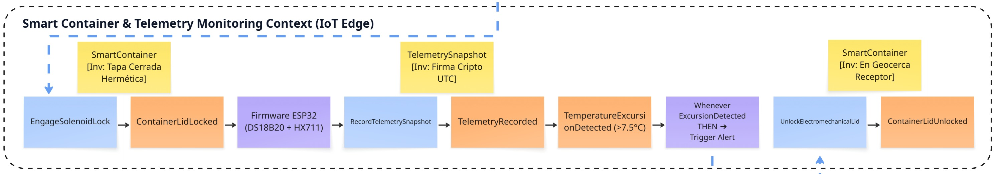  
*Nota: Elaboración propia en Miro según la técnica Design-Level EventStorming para el Bounded Context de Smart Container & Telemetry Monitoring.*

***

#### **4.6.1.5. Bounded Context 5: Critical Alerting & Incident Response**

* **Clasificación:** *Core Domain*  
* **Alineación con Segmentos:** Garantiza que los problemas en ruta se detecten y resuelvan en segundos. Para el **Segmento 1**, dispara alarmas audibles y visuales de alta prioridad en el dashboard del conductor/paramédico para que reconecte la toma de 12V o revise el contenedor. Para el **Segmento 2**, alerta inmediatamente a la central de farmacia y equipo quirúrgico si una desviación térmica o retraso por congestión pone en riesgo la carga biológica.

##### Agregados Raíz e Invariantes de Negocio

1. **`CriticalIncident` (Aggregate Root):**
   * *Invariante 5.1:* Toda alerta de grado `CRITICAL` (excursión >8.0 °C por más de 3 minutos continuos o caída de batería <20%) debe despachar notificaciones automáticas en menos de 10 segundos hacia el personal de ruta y receptores.
   * *Invariante 5.2:* Un incidente crítico no puede ser cerrado administrativamente sin que el usuario responsable registre obligatoriamente una **Acción de Mitigación / Contingencia** y su respectivo acuse de recibo (*Acknowledgment*).

2. **`AlertRule` (Aggregate Root):**
   * *Invariante 5.3:* Toda regla de monitoreo debe parametrizar obligatoriamente umbrales dentro del margen normativo de DIGEMID (+2.0 °C a +8.0 °C), bloqueando configuraciones permisivas fuera de estándar que pongan en riesgo la carga biológica.
   * *Invariante 5.4:* Los umbrales de advertencia incipiente (*Warning*) no pueden superar los +7.5 °C para asegurar una ventana de reacción mínima de 15 minutos antes de que ocurra una excursión térmica crítica irreversible.

##### Matriz de Artefactos DDD - Contexto Critical Alerting & Incident Response

<div style="margin: 10px 0 14px 0;">
<p style="font-weight: bold; margin-bottom: 5px; font-size: 7.8pt; color: #1e3a8a;">A. Flujo de Consulta / CQRS Read Side — Contexto Critical Alerting & Incident Response</p>
<table border="1" cellpadding="3" cellspacing="0" style="border-collapse: collapse; width: 100%; table-layout: fixed; font-size: 7pt; margin-bottom: 12px; border: 1px solid #cbd5e1;">
<colgroup>
  <col style="width: 25%;" />
  <col style="width: 35%;" />
  <col style="width: 40%;" />
</colgroup>
<thead>
<tr style="background-color: #f1f5f9;">
  <th style="border: 1px solid #cbd5e1; padding: 4px; text-align: left; font-weight: bold;">Actor / Solicitante (Amarillo)</th>
  <th style="border: 1px solid #cbd5e1; padding: 4px; text-align: left; font-weight: bold;">Query CQRS (Cian)</th>
  <th style="border: 1px solid #cbd5e1; padding: 4px; text-align: left; font-weight: bold;">Read Model Proyectado (Verde)</th>
</tr>
</thead>
<tbody>
<tr>
  <td style="border: 1px solid #cbd5e1; padding: 3px 4px; vertical-align: top;">Sistema Reactivo</td>
  <td style="border: 1px solid #cbd5e1; padding: 3px 4px; vertical-align: top;"><code>GetLiveAlertsQuery</code></td>
  <td style="border: 1px solid #cbd5e1; padding: 3px 4px; vertical-align: top;"><code>LiveAlertsBannerView</code></td>
</tr>
<tr>
  <td style="border: 1px solid #cbd5e1; padding: 3px 4px; vertical-align: top;">Paramédico / Chofer (Seg. 1)</td>
  <td style="border: 1px solid #cbd5e1; padding: 3px 4px; vertical-align: top;"><code>GetIncidentDetailQuery</code></td>
  <td style="border: 1px solid #cbd5e1; padding: 3px 4px; vertical-align: top;"><code>IncidentDetailModalView</code></td>
</tr>
<tr>
  <td style="border: 1px solid #cbd5e1; padding: 3px 4px; vertical-align: top;">Paramédico / Farmacéutico</td>
  <td style="border: 1px solid #cbd5e1; padding: 3px 4px; vertical-align: top;"><code>GetContingencyResolutionsQuery</code></td>
  <td style="border: 1px solid #cbd5e1; padding: 3px 4px; vertical-align: top;"><code>ContingencyResolutionView</code></td>
</tr>
<tr>
  <td style="border: 1px solid #cbd5e1; padding: 3px 4px; vertical-align: top;">Director Farmacéutico (Seg. 2)</td>
  <td style="border: 1px solid #cbd5e1; padding: 3px 4px; vertical-align: top;"><code>GetAlertRuleThresholdsQuery</code></td>
  <td style="border: 1px solid #cbd5e1; padding: 3px 4px; vertical-align: top;"><code>AlertConfigurationView</code></td>
</tr>
</tbody>
</table>
</div>

<div style="margin: 10px 0 16px 0;">
<p style="font-weight: bold; margin-bottom: 5px; font-size: 7.8pt; color: #991b1b;">B. Flujo Transaccional y Eventos / DDD Write Side — Contexto Critical Alerting & Incident Response</p>
<table border="1" cellpadding="3" cellspacing="0" style="border-collapse: collapse; width: 100%; table-layout: fixed; font-size: 7pt; margin-bottom: 12px; border: 1px solid #cbd5e1;">
<colgroup>
  <col style="width: 24%;" />
  <col style="width: 22%;" />
  <col style="width: 27%;" />
  <col style="width: 27%;" />
</colgroup>
<thead>
<tr style="background-color: #f1f5f9;">
  <th style="border: 1px solid #cbd5e1; padding: 4px; text-align: left; font-weight: bold;">Comando Ejecutado (Azul)</th>
  <th style="border: 1px solid #cbd5e1; padding: 4px; text-align: left; font-weight: bold;">Agregado / Root (Ocre)</th>
  <th style="border: 1px solid #cbd5e1; padding: 4px; text-align: left; font-weight: bold;">Domain Event Resultante (Naranja)</th>
  <th style="border: 1px solid #cbd5e1; padding: 4px; text-align: left; font-weight: bold;">Política / Regla Reactiva (Morada)</th>
</tr>
</thead>
<tbody>
<tr>
  <td style="border: 1px solid #cbd5e1; padding: 3px 4px; vertical-align: top;"><code>TriggerCriticalAlert</code></td>
  <td style="border: 1px solid #cbd5e1; padding: 3px 4px; vertical-align: top;"><code>CriticalIncident</code></td>
  <td style="border: 1px solid #cbd5e1; padding: 3px 4px; vertical-align: top;"><code>CriticalAlertTriggered</code></td>
  <td style="border: 1px solid #cbd5e1; padding: 3px 4px; vertical-align: top;"><em>Whenever [CriticalAlertTriggered] THEN [DispatchPushNotificationCommand]</em></td>
</tr>
<tr>
  <td style="border: 1px solid #cbd5e1; padding: 3px 4px; vertical-align: top;"><code>AcknowledgeAlert</code></td>
  <td style="border: 1px solid #cbd5e1; padding: 3px 4px; vertical-align: top;"><code>CriticalIncident</code></td>
  <td style="border: 1px solid #cbd5e1; padding: 3px 4px; vertical-align: top;"><code>AlertAcknowledgedByOperator</code></td>
  <td style="border: 1px solid #cbd5e1; padding: 3px 4px; vertical-align: top;"><em>Whenever [AlertAcknowledged] THEN [SilenceCabinBuzzerCommand]</em></td>
</tr>
<tr>
  <td style="border: 1px solid #cbd5e1; padding: 3px 4px; vertical-align: top;"><code>ResolveIncidentWithMitigation</code></td>
  <td style="border: 1px solid #cbd5e1; padding: 3px 4px; vertical-align: top;"><code>CriticalIncident</code></td>
  <td style="border: 1px solid #cbd5e1; padding: 3px 4px; vertical-align: top;"><code>IncidentResolved</code></td>
  <td style="border: 1px solid #cbd5e1; padding: 3px 4px; vertical-align: top;"><em>Whenever [IncidentResolved] THEN [AppendToAuditManifestCommand]</em></td>
</tr>
<tr>
  <td style="border: 1px solid #cbd5e1; padding: 3px 4px; vertical-align: top;"><code>ConfigureAlertThresholds</code></td>
  <td style="border: 1px solid #cbd5e1; padding: 3px 4px; vertical-align: top;"><code>AlertRule</code></td>
  <td style="border: 1px solid #cbd5e1; padding: 3px 4px; vertical-align: top;"><code>AlertThresholdsConfigured</code></td>
  <td style="border: 1px solid #cbd5e1; padding: 3px 4px; vertical-align: top;"><em>Whenever [AlertThresholdsConfigured] THEN [SyncThermalMonitoringParametersCommand]</em></td>
</tr>
</tbody>
</table>
</div>

***

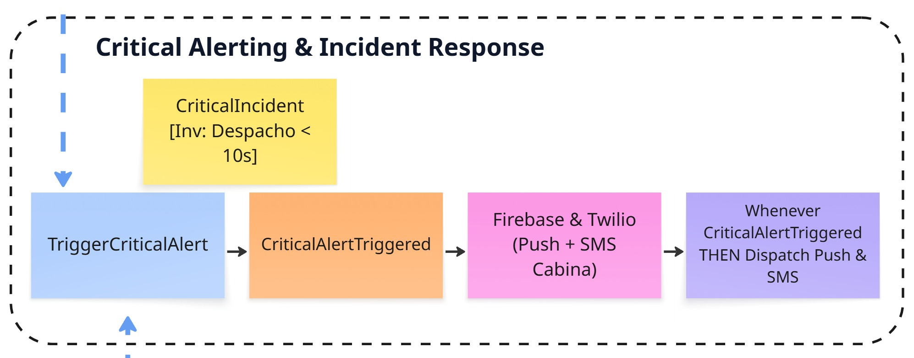  
*Nota: Elaboración propia en Miro según la técnica Design-Level EventStorming para el Bounded Context de Critical Alerting & Incident Response.*

***

#### **4.6.1.6. Bounded Context 6: Chain of Custody & Traceability**

* **Clasificación:** *Core Domain / Cumplimiento Normativo*  
* **Alineación con Segmentos:** Brinda la certeza legal, médica y sanitaria que exige el **Segmento 2** ante auditorías de DIGEMID (R.M. N° 833-2015/MINSA) y DIGDOT (Directiva 152/MINSA). Controla la transferencia física y legal de la custodia mediante código QR de salida, apertura en rampa receptor mediante **código OTP de un solo uso** enviado al personal acreditado, y emisión del acta digital inmutable con curva térmica completa.

##### Agregados Raíz e Invariantes de Negocio

1. **`CustodyTransfer` (Aggregate Root):**
   * *Invariante 6.1:* La transferencia formal de custodia médica solo puede completarse si el código OTP ingresado por el receptor coincide exactamente con el token criptográfico emitido por el sistema al centro de salud receptor.
   * *Invariante 6.2:* No se puede dar por recibida conforme una carga médica si durante el trayecto se registró una excursión térmica acumulada que supere el límite de estabilidad biológica declarado para el fármaco u órgano.
2. **`DigitalAuditManifest` (Aggregate Root):**
   * *Invariante 6.3:* El acta digital final es inmutable: una vez generada con las firmas del despachador y receptor, su contenido y curva térmica se sellan criptográficamente con hash SHA-256 impidiendo cualquier alteración posterior.

##### Matriz de Artefactos DDD - Contexto Chain of Custody & Traceability

<div style="margin: 10px 0 14px 0;">
<p style="font-weight: bold; margin-bottom: 5px; font-size: 7.8pt; color: #1e3a8a;">A. Flujo de Consulta / CQRS Read Side — Contexto Chain of Custody & Traceability</p>
<table border="1" cellpadding="3" cellspacing="0" style="border-collapse: collapse; width: 100%; table-layout: fixed; font-size: 7pt; margin-bottom: 12px; border: 1px solid #cbd5e1;">
<colgroup>
  <col style="width: 25%;" />
  <col style="width: 35%;" />
  <col style="width: 40%;" />
</colgroup>
<thead>
<tr style="background-color: #f1f5f9;">
  <th style="border: 1px solid #cbd5e1; padding: 4px; text-align: left; font-weight: bold;">Actor / Solicitante (Amarillo)</th>
  <th style="border: 1px solid #cbd5e1; padding: 4px; text-align: left; font-weight: bold;">Query CQRS (Cian)</th>
  <th style="border: 1px solid #cbd5e1; padding: 4px; text-align: left; font-weight: bold;">Read Model Proyectado (Verde)</th>
</tr>
</thead>
<tbody>
<tr>
  <td style="border: 1px solid #cbd5e1; padding: 3px 4px; vertical-align: top;">Químico Farmacéutico Remitente</td>
  <td style="border: 1px solid #cbd5e1; padding: 3px 4px; vertical-align: top;"><code>GetDispatchVerificationQuery</code></td>
  <td style="border: 1px solid #cbd5e1; padding: 3px 4px; vertical-align: top;"><code>DispatchVerificationView</code></td>
</tr>
<tr>
  <td style="border: 1px solid #cbd5e1; padding: 3px 4px; vertical-align: top;">Médico / Químico Receptor (Seg. 2)</td>
  <td style="border: 1px solid #cbd5e1; padding: 3px 4px; vertical-align: top;"><code>ValidateDeliveryOtpQuery</code></td>
  <td style="border: 1px solid #cbd5e1; padding: 3px 4px; vertical-align: top;"><code>OtpVerificationModalView</code></td>
</tr>
<tr>
  <td style="border: 1px solid #cbd5e1; padding: 3px 4px; vertical-align: top;">Custodio Receptor (Seg. 2)</td>
  <td style="border: 1px solid #cbd5e1; padding: 3px 4px; vertical-align: top;"><code>GetFinalInspectionReportQuery</code></td>
  <td style="border: 1px solid #cbd5e1; padding: 3px 4px; vertical-align: top;"><code>FinalInspectionReportView</code></td>
</tr>
<tr>
  <td style="border: 1px solid #cbd5e1; padding: 3px 4px; vertical-align: top;">Auditor DIGEMID / MINSA</td>
  <td style="border: 1px solid #cbd5e1; padding: 3px 4px; vertical-align: top;"><code>GetAuditManifestCertifiedPdfQuery</code></td>
  <td style="border: 1px solid #cbd5e1; padding: 3px 4px; vertical-align: top;"><code>AuditManifestDownloadView</code></td>
</tr>
</tbody>
</table>
</div>

<div style="margin: 10px 0 16px 0;">
<p style="font-weight: bold; margin-bottom: 5px; font-size: 7.8pt; color: #991b1b;">B. Flujo Transaccional y Eventos / DDD Write Side — Contexto Chain of Custody & Traceability</p>
<table border="1" cellpadding="3" cellspacing="0" style="border-collapse: collapse; width: 100%; table-layout: fixed; font-size: 7pt; margin-bottom: 12px; border: 1px solid #cbd5e1;">
<colgroup>
  <col style="width: 24%;" />
  <col style="width: 22%;" />
  <col style="width: 27%;" />
  <col style="width: 27%;" />
</colgroup>
<thead>
<tr style="background-color: #f1f5f9;">
  <th style="border: 1px solid #cbd5e1; padding: 4px; text-align: left; font-weight: bold;">Comando Ejecutado (Azul)</th>
  <th style="border: 1px solid #cbd5e1; padding: 4px; text-align: left; font-weight: bold;">Agregado / Root (Ocre)</th>
  <th style="border: 1px solid #cbd5e1; padding: 4px; text-align: left; font-weight: bold;">Domain Event Resultante (Naranja)</th>
  <th style="border: 1px solid #cbd5e1; padding: 4px; text-align: left; font-weight: bold;">Política / Regla Reactiva (Morada)</th>
</tr>
</thead>
<tbody>
<tr>
  <td style="border: 1px solid #cbd5e1; padding: 3px 4px; vertical-align: top;"><code>SignInitialCustodyHandover</code></td>
  <td style="border: 1px solid #cbd5e1; padding: 3px 4px; vertical-align: top;"><code>CustodyTransfer</code></td>
  <td style="border: 1px solid #cbd5e1; padding: 3px 4px; vertical-align: top;"><code>InitialCustodySigned</code></td>
  <td style="border: 1px solid #cbd5e1; padding: 3px 4px; vertical-align: top;"><em>Whenever [InitialCustodySigned] THEN [IssueRecipientOtpCodeCommand]</em></td>
</tr>
<tr>
  <td style="border: 1px solid #cbd5e1; padding: 3px 4px; vertical-align: top;"><code>VerifyDeliveryOtpCode</code></td>
  <td style="border: 1px solid #cbd5e1; padding: 3px 4px; vertical-align: top;"><code>CustodyTransfer</code></td>
  <td style="border: 1px solid #cbd5e1; padding: 3px 4px; vertical-align: top;"><code>DeliveryOtpVerified</code></td>
  <td style="border: 1px solid #cbd5e1; padding: 3px 4px; vertical-align: top;"><em>Whenever [DeliveryOtpVerified] THEN [UnlockSmartContainerCommand]</em></td>
</tr>
<tr>
  <td style="border: 1px solid #cbd5e1; padding: 3px 4px; vertical-align: top;"><code>AcceptMedicalDelivery</code></td>
  <td style="border: 1px solid #cbd5e1; padding: 3px 4px; vertical-align: top;"><code>CustodyTransfer</code></td>
  <td style="border: 1px solid #cbd5e1; padding: 3px 4px; vertical-align: top;"><code>MedicalCustodyTransferred</code></td>
  <td style="border: 1px solid #cbd5e1; padding: 3px 4px; vertical-align: top;"><em>Whenever [MedicalCustodyTransferred] THEN [SealDigitalAuditManifestCommand]</em></td>
</tr>
<tr>
  <td style="border: 1px solid #cbd5e1; padding: 3px 4px; vertical-align: top;"><code>GenerateCertifiedPdfManifest</code></td>
  <td style="border: 1px solid #cbd5e1; padding: 3px 4px; vertical-align: top;"><code>DigitalAuditManifest</code></td>
  <td style="border: 1px solid #cbd5e1; padding: 3px 4px; vertical-align: top;"><code>AuditManifestSealedWithHash</code></td>
  <td style="border: 1px solid #cbd5e1; padding: 3px 4px; vertical-align: top;"><em>Whenever [AuditManifestSealedWithHash] THEN [ArchiveInCloudStorageCommand]</em></td>
</tr>
</tbody>
</table>
</div>

***

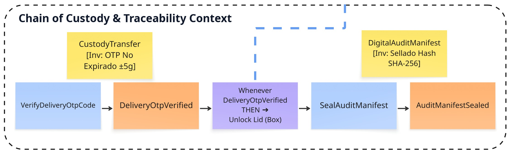  
*Nota: Elaboración propia en Miro según la técnica Design-Level EventStorming para el Bounded Context de Chain of Custody & Traceability.*

***

### **5. Matriz Transversal de Políticas de Negocio Reactivas (Event-Driven)**

Para garantizar que la arquitectura DDD soporte adecuadamente la reactividad en tiempo real entre microservicios/módulos, se formalizan las **políticas de negocio transversales** que gobiernan el comportamiento del sistema, detallando el canal de desacoplamiento asíncrono y la estrategia de consistencia:

<table border="1" cellpadding="3" cellspacing="0" style="border-collapse: collapse; width: 100%; table-layout: fixed; font-size: 6.8pt; margin: 12px 0; border: 1px solid #cbd5e1;">
<colgroup>
  <col style="width: 17%;" />
  <col style="width: 21%;" />
  <col style="width: 18%;" />
  <col style="width: 16%;" />
  <col style="width: 16%;" />
  <col style="width: 12%;" />
</colgroup>
<thead>
<tr style="background-color: #f1f5f9;">
  <th style="border: 1px solid #cbd5e1; padding: 4px; text-align: left; font-weight: bold;">Política / Regla de Negocio</th>
  <th style="border: 1px solid #cbd5e1; padding: 4px; text-align: left; font-weight: bold;">Evento Disparador (Domain Event)</th>
  <th style="border: 1px solid #cbd5e1; padding: 4px; text-align: left; font-weight: bold;">Flujo Bounded Contexts</th>
  <th style="border: 1px solid #cbd5e1; padding: 4px; text-align: left; font-weight: bold;">Comando Consecuente</th>
  <th style="border: 1px solid #cbd5e1; padding: 4px; text-align: left; font-weight: bold;">Canal / Event Bus</th>
  <th style="border: 1px solid #cbd5e1; padding: 4px; text-align: left; font-weight: bold;">Consistencia</th>
</tr>
</thead>
<tbody>
<tr>
  <td style="border: 1px solid #cbd5e1; padding: 3px 4px; vertical-align: top;">**POL-01: Control Térmico Reactivo**</td>
  <td style="border: 1px solid #cbd5e1; padding: 3px 4px; vertical-align: top;">TelemetrySnapshotRecorded (Temp < 2.0°C o > 8.0°C)</td>
  <td style="border: 1px solid #cbd5e1; padding: 3px 4px; vertical-align: top;"><em>Smart Container IoT</em> &rarr; <em>Critical Alerting</em></td>
  <td style="border: 1px solid #cbd5e1; padding: 3px 4px; vertical-align: top;">TriggerCriticalAlert</td>
  <td style="border: 1px solid #cbd5e1; padding: 3px 4px; vertical-align: top;">Redis Pub/Sub: smartbox.telemetry.excursions</td>
  <td style="border: 1px solid #cbd5e1; padding: 3px 4px; vertical-align: top;">Consistencia Eventual (< 500 ms)</td>
</tr>
<tr>
  <td style="border: 1px solid #cbd5e1; padding: 3px 4px; vertical-align: top;">**POL-02: Escalación por Tráfico de Lima**</td>
  <td style="border: 1px solid #cbd5e1; padding: 3px 4px; vertical-align: top;">DynamicEtaRecalculated (Retraso ETA > 15 min)</td>
  <td style="border: 1px solid #cbd5e1; padding: 3px 4px; vertical-align: top;"><em>Transport Planning</em> &rarr; <em>Transport Planning / IAM</em></td>
  <td style="border: 1px solid #cbd5e1; padding: 3px 4px; vertical-align: top;">NotifyHospitalRampDelay</td>
  <td style="border: 1px solid #cbd5e1; padding: 3px 4px; vertical-align: top;">Internal Event Bus (MediatR): trips.eta.delays</td>
  <td style="border: 1px solid #cbd5e1; padding: 3px 4px; vertical-align: top;">Consistencia Eventual (< 2 s)</td>
</tr>
<tr>
  <td style="border: 1px solid #cbd5e1; padding: 3px 4px; vertical-align: top;">**POL-03: Bloqueo Automático en Despacho**</td>
  <td style="border: 1px solid #cbd5e1; padding: 3px 4px; vertical-align: top;">DispatchedTripStarted</td>
  <td style="border: 1px solid #cbd5e1; padding: 3px 4px; vertical-align: top;"><em>Transport Planning</em> &rarr; <em>Smart Container IoT</em></td>
  <td style="border: 1px solid #cbd5e1; padding: 3px 4px; vertical-align: top;">EngageSolenoidLock</td>
  <td style="border: 1px solid #cbd5e1; padding: 3px 4px; vertical-align: top;">Internal Event Bus (MediatR): trips.dispatched</td>
  <td style="border: 1px solid #cbd5e1; padding: 3px 4px; vertical-align: top;">Consistencia Fuerte / Inmediata</td>
</tr>
<tr>
  <td style="border: 1px solid #cbd5e1; padding: 3px 4px; vertical-align: top;">**POL-04: Seguridad de Energía Vehicular**</td>
  <td style="border: 1px solid #cbd5e1; padding: 3px 4px; vertical-align: top;">ExternalPowerSourceLost (Toma 12V desconectada)</td>
  <td style="border: 1px solid #cbd5e1; padding: 3px 4px; vertical-align: top;"><em>Smart Container IoT</em> &rarr; <em>Critical Alerting</em></td>
  <td style="border: 1px solid #cbd5e1; padding: 3px 4px; vertical-align: top;">TriggerPowerWarningAlert</td>
  <td style="border: 1px solid #cbd5e1; padding: 3px 4px; vertical-align: top;">Redis Pub/Sub: smartbox.power.alerts</td>
  <td style="border: 1px solid #cbd5e1; padding: 3px 4px; vertical-align: top;">Consistencia Eventual (< 500 ms)</td>
</tr>
<tr>
  <td style="border: 1px solid #cbd5e1; padding: 3px 4px; vertical-align: top;">**POL-05: Autorización de Apertura en Rampa**</td>
  <td style="border: 1px solid #cbd5e1; padding: 3px 4px; vertical-align: top;">DeliveryOtpVerified</td>
  <td style="border: 1px solid #cbd5e1; padding: 3px 4px; vertical-align: top;"><em>Chain of Custody</em> &rarr; <em>Smart Container IoT</em></td>
  <td style="border: 1px solid #cbd5e1; padding: 3px 4px; vertical-align: top;">UnlockElectromechanicalLid</td>
  <td style="border: 1px solid #cbd5e1; padding: 3px 4px; vertical-align: top;">Internal MediatR (intra-API) → Redis Pub/Sub: smartbox.commands.actuators → MQTT TLS 8883</td>
  <td style="border: 1px solid #cbd5e1; padding: 3px 4px; vertical-align: top;">Consistencia Fuerte / Inmediata</td>
</tr>
<tr>
  <td style="border: 1px solid #cbd5e1; padding: 3px 4px; vertical-align: top;">**POL-06: Cierre Inmutable de Manifiesto**</td>
  <td style="border: 1px solid #cbd5e1; padding: 3px 4px; vertical-align: top;">MedicalCustodyTransferred</td>
  <td style="border: 1px solid #cbd5e1; padding: 3px 4px; vertical-align: top;"><em>Chain of Custody</em> &rarr; <em>Chain of Custody</em></td>
  <td style="border: 1px solid #cbd5e1; padding: 3px 4px; vertical-align: top;">SealDigitalAuditManifest</td>
  <td style="border: 1px solid #cbd5e1; padding: 3px 4px; vertical-align: top;">Internal Event Bus (MediatR): custody.completed</td>
  <td style="border: 1px solid #cbd5e1; padding: 3px 4px; vertical-align: top;">Consistencia Fuerte (Transaccional)</td>
</tr>
</tbody>
</table>

***

### **6. Conclusiones y Preparación para el C4 Model (Capítulo 4.6.2)**

El **Design-Level EventStorming** ha permitido descomponer con total rigor la complejidad del problema de transporte médico crítico en Lima Metropolitana. A través de los seis Bounded Contexts y sus respectivos Agregados Raíz, se han blindado las reglas sanitarias (DIGEMID/DIGDOT) y operativas de los dos segmentos objetivo:
* Para el **Segmento 1**, el software garantiza que la conducción no sufra distracciones, monitoreando en segundo plano la alimentación eléctrica de 12V, el estado de la batería y la optimización de rutas frente al tráfico limeño.
* Para el **Segmento 2**, el software garantiza la trazabilidad transparente y en tiempo real de la curva térmica (2 °C a 8 °C), la inmutabilidad de la cadena de custodia mediante códigos OTP y la disponibilidad de actas digitales certificadas.

Este modelado funcional establece las fronteras directas para la elaboración del **C4 Model (Context Diagram en 4.6.2, Container Diagram en 4.6.3 y Component Diagrams en 4.6.4)**, así como los cimientos para el **Diagrama de Clases UML (4.7)** y el **Esquema Relacional de Base de Datos (4.8)**.

***

## **4.6.2. Software Architecture Context Diagram**

### **1. Introducción y Fundamentos Arquitectónicos del C4 Model**

Para representar con rigor formal la arquitectura del sistema, se adoptó el **C4 Model** concebido por Simon Brown, complementado bajo los principios de *Domain-Driven Architecture* de Nick Tune.

El C4 Model organiza la descripción de los sistemas de software en cuatro niveles jerárquicos de abstracción visual: **Contexto (System Context), Contenedores (Containers), Componentes (Components) y Código (Code)**. En esta sección se elabora el **Nivel 1: Software Architecture Context Diagram (Diagrama de Contexto del Sistema)**.

#### Propósito y Alcance del Diagrama de Contexto
El objetivo esencial del Diagrama de Contexto es **establecer las fronteras operativas del sistema**, mostrándolo como una **caja negra central única** sin revelar detalles internos de implementación técnica, bases de datos o frameworks de programación. Este enfoque permite que tanto los interesados técnicos como los directores clínicos, químicos farmacéuticos y auditores gubernamentales comprendan claramente:
1. **Quiénes son los usuarios:** Qué actores humanos interactúan con la plataforma y qué valor operativo obtienen de ella.
2. **Cuáles son las dependencias externas:** Qué sistemas de software de terceros, hardware embebido y servicios en la nube son requeridos para que la solución funcione.
3. **Cuáles son los límites de responsabilidad:** Qué funciones ejecuta estrictamente el sistema y qué tareas delega a sistemas especializados del ecosistema de salud y movilidad de Lima Metropolitana.

***

### **2. Definición del Sistema Central (Subject System)**

* **Nombre Oficial del Sistema:** `Medical SMARTBOX Platform`
* **Tipo:** `[Software System]`
* **Descripción de Dominio:**  
  Plataforma integral B2B SaaS de software y telemetría IoT para la monitorización activa de la cadena de frío (+2.0 °C a +8.0 °C), pesaje de alta precisión (&plusmn;5 g), custodia electromecánica inmutable y trazabilidad de traslados asistenciales de emergencia en ambulancias para Lima Metropolitana y el Callao.
* **Misión Operativa:**  
  Garantizar el "Desperdicio Cero" de órganos para trasplante, hemoderivados, vacunas y muestras biológicas termosensibles durante el trayecto vial, blindando el cumplimiento de la **R.M. N° 833-2015/MINSA** (Manual de BPDT - DIGEMID) y la **Directiva Sanitaria N° 152/MINSA** (DIGDOT), mediante la supervisión en tiempo real de temperatura, energía vehicular (12V) y cálculo dinámico de tiempos de llegada (ETA) frente al tráfico severo de la capital.

***

### **3. Catálogo de Actores y Personas (Segmentos Objetivo)**

Los usuarios del sistema se articulan de manera estricta con los **dos segmentos objetivo** modelados en la sección **1.3**:

<table border="1" cellpadding="3" cellspacing="0" style="border-collapse: collapse; width: 100%; table-layout: fixed; font-size: 7.2pt; border: 1px solid #cbd5e1; margin: 12px 0;">
<colgroup>
  <col style="width: 18%;" />
  <col style="width: 18%;" />
  <col style="width: 22%;" />
  <col style="width: 18%;" />
  <col style="width: 24%;" />
</colgroup>
<thead>
    <tr>
      <th>Actor / Persona</th>
      <th>Segmento Objetivo</th>
      <th>Rol Operativo en el Dominio</th>
      <th>Canal de Acceso / Interfaz</th>
      <th>Interacción Primaria con el Sistema</th>
    </tr>
  </thead>
  <tbody>
    <tr>
      <td><strong>Ambulance Driver & Paramedic</strong><br><em>(Chofer Asistencial y Paramédico / TEM)</em></td>
      <td><strong>Segmento 1:</strong><br>Empresas de Transporte y Operadores Logísticos</td>
      <td>Conduce la ambulancia, atiende incidentes asistenciales de urgencia, supervisa la estabilidad del cable de 12V vehicular y responde ante alarmas críticas en cabina.</td>
      <td>Frontend Web App (PWA Mobile en Tablet de cabina / Smartphone)</td>
      <td>Visualiza el estado de conexión de 12V, silencia alertas audibles tras acuse de recibo y navega con rutas optimizadas anti-tráfico.</td>
    </tr>
    <tr>
      <td><strong>Fleet Logistics Dispatcher</strong><br><em>(Coordinador de Despacho de Flota)</em></td>
      <td><strong>Segmento 1:</strong><br>Empresas de Transporte y Operadores Logísticos</td>
      <td>Planifica la disponibilidad de vehículos, asigna contenedores inteligentes a las unidades móviles y supervisa la telemetría global de la flota en ruta.</td>
      <td>Frontend Web App (Dashboard Desktop / Web)</td>
      <td>Asigna móviles a órdenes de traslado, monitorea la posición GPS en tiempo real y gestiona contingencias por congestión vial.</td>
    </tr>
    <tr>
      <td><strong>Clinical Pharmacist / Medical Remitter</strong><br><em>(Químico Farmacéutico Remitente / Banco de Sangre)</em></td>
      <td><strong>Segmento 2:</strong><br>Centros de Salud y Cadenas Farmacéuticas</td>
      <td>Responsable del acondicionamiento térmico de la carga biológica, verificación del pre-enfriamiento (2°C-8°C), pesaje basal con celda HX711 y despacho formal.</td>
      <td>Frontend Web App (Portal Web Hospitalario)</td>
      <td>Registra la orden de traslado de emergencia, declara tiempos de isquemia, tara la carga útil y autoriza el bloqueo electromecánico inicial.</td>
    </tr>
    <tr>
      <td><strong>Receiving Physician / Surgical Team</strong><br><em>(Médico Cirujano / Custodio Receptor en Rampa)</em></td>
      <td><strong>Segmento 2:</strong><br>Centros de Salud y Cadenas Farmacéuticas</td>
      <td>Personal clínico del hospital receptor que atiende la llegada de la ambulancia, valida el arribo en rampa de emergencias y desbloquea el compartimento.</td>
      <td>Frontend Web App (Mobile / Tablet de Quirófano)</td>
      <td>Monitorea el ETA dinámico de aproximación, ingresa el <strong>código OTP de un solo uso</strong> para destrabar la tapa y firma el acta de recepción conforme.</td>
    </tr>
    <tr>
      <td><strong>Health Quality Auditor / Regulatory Inspector</strong><br><em>(Auditor de Calidad Hospitalaria / Inspector DIGEMID-DIGDOT)</em></td>
      <td><strong>Segmento 2:</strong><br>Centros de Salud y Cadenas Farmacéuticas</td>
      <td>Especialista en aseguramiento de la calidad o inspector sanitario gubernamental que fiscaliza la preservación legal de la cadena de custodia y frío.</td>
      <td>Frontend Web App (Portal de Cumplimiento y Auditoría)</td>
      <td>Descarga expedientes digitales certificados en PDF con curvas térmicas completas y firmas criptográficas inalterables con sellado SHA-256.</td>
    </tr>
  </tbody>
</table>

***

### **4. Catálogo de Sistemas Externos e Interfaces Periféricas**

La plataforma se conecta con siete sistemas de software externos y dispositivos de hardware distribuido:

<table border="1" cellpadding="3" cellspacing="0" style="border-collapse: collapse; width: 100%; table-layout: fixed; font-size: 7.2pt; border: 1px solid #cbd5e1; margin: 12px 0;">
<colgroup>
  <col style="width: 22%;" />
  <col style="width: 18%;" />
  <col style="width: 35%;" />
  <col style="width: 25%;" />
</colgroup>
<thead>
    <tr>
      <th>Sistema Externo / Hardware</th>
      <th>Tipo de Sistema</th>
      <th>Descripción y Función de Negocio</th>
      <th>Nivel de Criticidad</th>
    </tr>
  </thead>
  <tbody>
    <tr>
      <td><strong>Smart Container IoT Embedded Hardware</strong><br><em>(ESP32 + Sensores Embebidos)</em></td>
      <td><code>[Hardware System / Embebido]</code></td>
      <td>Módulo inteligente integrado en el contenedor que incluye microcontrolador ESP32, termómetro digital sumergible DS18B20, celda de carga HX711, solenoide electromecánico, celdas Peltier, acelerómetro y batería Li-Ion de respaldo.</td>
      <td><strong>Crítica (Core):</strong> Transmite ráfagas periódicas de telemetría y ejecuta comandos remotos de bloqueo y desbloqueo.</td>
    </tr>
    <tr>
      <td><strong>Vehicle Telemetry Interface</strong><br><em>(OBD-II / GPS de la Ambulancia)</em></td>
      <td><code>[External Software / Hardware]</code></td>
      <td>Dispositivo telemático vehicular conectado al puerto estándar OBD-II de la ambulancia. Transmite a la plataforma el voltaje suministrado por la toma de 12V, nivel de combustible de la unidad, velocidad y coordenadas GPS vehiculares.</td>
      <td><strong>Alta:</strong> Permite detectar caídas de energía vehicular antes de que se agote la batería de respaldo del box.</td>
    </tr>
    <tr>
      <td><strong>Traffic & Route Optimization Engine</strong><br><em>(TomTom Traffic API / Mapbox)</em></td>
      <td><code>[External Cloud Service]</code></td>
      <td>Servicio internacional de georreferenciación y tráfico vehicular en tiempo real. Proporciona matrices de tiempo de viaje dinámicas ajustadas a la congestión histórica y en vivo de las principales vías de Lima Metropolitana.</td>
      <td><strong>Alta:</strong> Suministra el recálculo dinámico del ETA para alertar a los equipos de quirófano en caso de embotellamientos severos.</td>
    </tr>
    <tr>
      <td><strong>Multi-Channel Notification Gateway</strong><br><em>(Firebase Cloud Messaging & Twilio SMS)</em></td>
      <td><code>[External Cloud Service]</code></td>
      <td>Plataforma de comunicaciones omnicanal para el despacho ultrarrápido (&lt;10 segundos) de notificaciones push de alta prioridad y alertas por SMS a teléfonos móviles de la tripulación y médicos coordinadores.</td>
      <td><strong>Crítica:</strong> Dispara las alarmas de excursión térmica o desconexión eléctrica cuando el usuario no tiene la aplicación web abierta.</td>
    </tr>
    <tr>
      <td><strong>Hospital Management System</strong><br><em>(HIS / EHR / RENIPRESS - MINSA)</em></td>
      <td><code>[External Software System]</code></td>
      <td>Sistemas de información hospitalaria y registros electrónicos de salud de las IPRESS emisoras y receptoras. Valida los códigos únicos de sede y permite la sincronización de solicitudes quirúrgicas urgentes.</td>
      <td><strong>Media:</strong> Valida la existencia formal de los establecimientos de salud y enriquece los datos del paciente o receptor.</td>
    </tr>
    <tr>
      <td><strong>Cloud Immutable Storage</strong><br><em>(AWS S3 / Azure Blob Storage con WORM)</em></td>
      <td><code>[External Cloud Service]</code></td>
      <td>Almacén de objetos en la nube configurado con directivas de retención inmutable (Write Once, Read Many). Almacena las actas de custodia digital y manifiestos de viaje en PDF firmados criptográficamente.</td>
      <td><strong>Alta:</strong> Resguarda los expedientes probatorios legales para inspecciones de SUSALUD, DIGEMID o auditorías judiciales.</td>
    </tr>
    <tr>
      <td><strong>B2B Payment & Billing Gateway</strong><br><em>(Culqi / Stripe B2B Payments)</em></td>
      <td><code>[External Cloud Service]</code></td>
      <td>Pasarela de procesamiento de pagos y recaudación corporativa recurrente. Gestiona las suscripciones mensuales de las flotas de ambulancias y clínicas, validando cobros automáticos y emitiendo comprobantes fiscales electrónicos ante SUNAT.</td>
      <td><strong>Alta:</strong> Respalda la operatividad comercial y el modelo de monetización SaaS de la plataforma.</td>
    </tr>
  </tbody>
</table>

***

### **5. Matriz de Interacciones y Protocolos de Comunicación**

Para garantizar que el modelado técnico no deje ambigüedades sobre las tecnologías de comunicación, la siguiente tabla detalla cada una de las flechas de interacción del diagrama de contexto:

<table border="1" cellpadding="3" cellspacing="0" style="border-collapse: collapse; width: 100%; table-layout: fixed; font-size: 7.2pt; border: 1px solid #cbd5e1; margin: 12px 0;">
<colgroup>
  <col style="width: 8%;" />
  <col style="width: 18%;" />
  <col style="width: 18%;" />
  <col style="width: 34%;" />
  <col style="width: 22%;" />
</colgroup>
<thead>
    <tr>
      <th>Flujo #</th>
      <th>Origen (Source)</th>
      <th>Destino (Target)</th>
      <th>Descripción Funcional de la Interacción</th>
      <th>Protocolo y Formato de Datos</th>
    </tr>
  </thead>
  <tbody>
    <tr>
      <td><strong>F-01</strong></td>
      <td>Ambulance Driver & Paramedic</td>
      <td>Medical SMARTBOX Platform</td>
      <td>Consulta estado del viaje, monitorea conexión de 12V y registra acuse de recibo de alertas acústicas.</td>
      <td><code>HTTPS / WSS / JSON (TLS 1.3)</code></td>
    </tr>
    <tr>
      <td><strong>F-02</strong></td>
      <td>Fleet Logistics Dispatcher</td>
      <td>Medical SMARTBOX Platform</td>
      <td>Asigna móviles a viajes, monitorea mapas de flota y gestiona suscripciones de boxes.</td>
      <td><code>HTTPS / JSON (RESTful API)</code></td>
    </tr>
    <tr>
      <td><strong>F-03</strong></td>
      <td>Clinical Pharmacist Remitter</td>
      <td>Medical SMARTBOX Platform</td>
      <td>Crea órdenes de traslado, registra tara/peso del insumo y autoriza el precinto inicial.</td>
      <td><code>HTTPS / JSON (RESTful API)</code></td>
    </tr>
    <tr>
      <td><strong>F-04</strong></td>
      <td>Receiving Physician</td>
      <td>Medical SMARTBOX Platform</td>
      <td>Monitorea ETA, valida llegada en rampa, ingresa código OTP de apertura y firma acta de entrega.</td>
      <td><code>HTTPS / JSON (RESTful API)</code></td>
    </tr>
    <tr>
      <td><strong>F-05</strong></td>
      <td>Health Quality Auditor</td>
      <td>Medical SMARTBOX Platform</td>
      <td>Consulta historiales térmicos y descarga actas digitales certificadas en PDF.</td>
      <td><code>HTTPS / PDF Stream</code></td>
    </tr>
    <tr>
      <td><strong>F-06</strong></td>
      <td>Smart Container Hardware (ESP32)</td>
      <td>Medical SMARTBOX Platform</td>
      <td>Transmite ráfagas de telemetría (temperatura DS18B20, peso HX711, batería, acelerómetro).</td>
      <td><code>MQTT over TLS / JSON (TCP 8883)</code></td>
    </tr>
    <tr>
      <td><strong>F-07</strong></td>
      <td>Medical SMARTBOX Platform</td>
      <td>Smart Container Hardware (ESP32)</td>
      <td>Envía comandos firmados de bloqueo y desbloqueo de la tapa electromecánica (solenoide).</td>
      <td><code>MQTT Publish / TLS / JSON</code></td>
    </tr>
    <tr>
      <td><strong>F-08</strong></td>
      <td>Vehicle Telemetry Interface (OBD-II)</td>
      <td>Medical SMARTBOX Platform</td>
      <td>Transmite telemetría del vehículo (voltaje de 12V, nivel de combustible y posición GPS).</td>
      <td><code>HTTPS / REST / JSON (4G Cellular)</code></td>
    </tr>
    <tr>
      <td><strong>F-09</strong></td>
      <td>Medical SMARTBOX Platform</td>
      <td>TomTom Traffic API</td>
      <td>Solicita cálculo dinámico de tiempos de ruta y congestión vial en Lima para recalcular ETA.</td>
      <td><code>HTTPS / REST / JSON</code></td>
    </tr>
    <tr>
      <td><strong>F-10</strong></td>
      <td>Medical SMARTBOX Platform</td>
      <td>Notification Gateway (Firebase/Twilio)</td>
      <td>Despacha alertas críticas inmediatas vía notificaciones Push (FCM) y mensajes de texto SMS.</td>
      <td><code>HTTPS / REST API</code></td>
    </tr>
    <tr>
      <td><strong>F-11</strong></td>
      <td>Medical SMARTBOX Platform</td>
      <td>Hospital Management System (HIS)</td>
      <td>Valida identificadores RENIPRESS de sede y sincroniza preavisos de llegada para quirófanos.</td>
      <td><code>HTTPS / REST / HL7-FHIR</code></td>
    </tr>
    <tr>
      <td><strong>F-12</strong></td>
      <td>Medical SMARTBOX Platform</td>
      <td>Cloud Immutable Storage (AWS S3)</td>
      <td>Archiva de forma inalterable las actas de custodia firmadas digitalmente con sellado criptográfico SHA-256.</td>
      <td><code>HTTPS / S3 REST API (TLS 1.3)</code></td>
    </tr>
    <tr>
      <td><strong>F-13</strong></td>
      <td>Medical SMARTBOX Platform</td>
      <td>B2B Payment & Billing Gateway (Culqi / Stripe)</td>
      <td>Procesa la facturación recurrente de suscripciones B2B, valida cobros automáticos y emite comprobantes electrónicos.</td>
      <td><code>HTTPS / REST API (TLS 1.3)</code></td>
    </tr>
  </tbody>
</table>

***

### **6. Especificación Visual Oficial y Bloque de Diagramación**

***

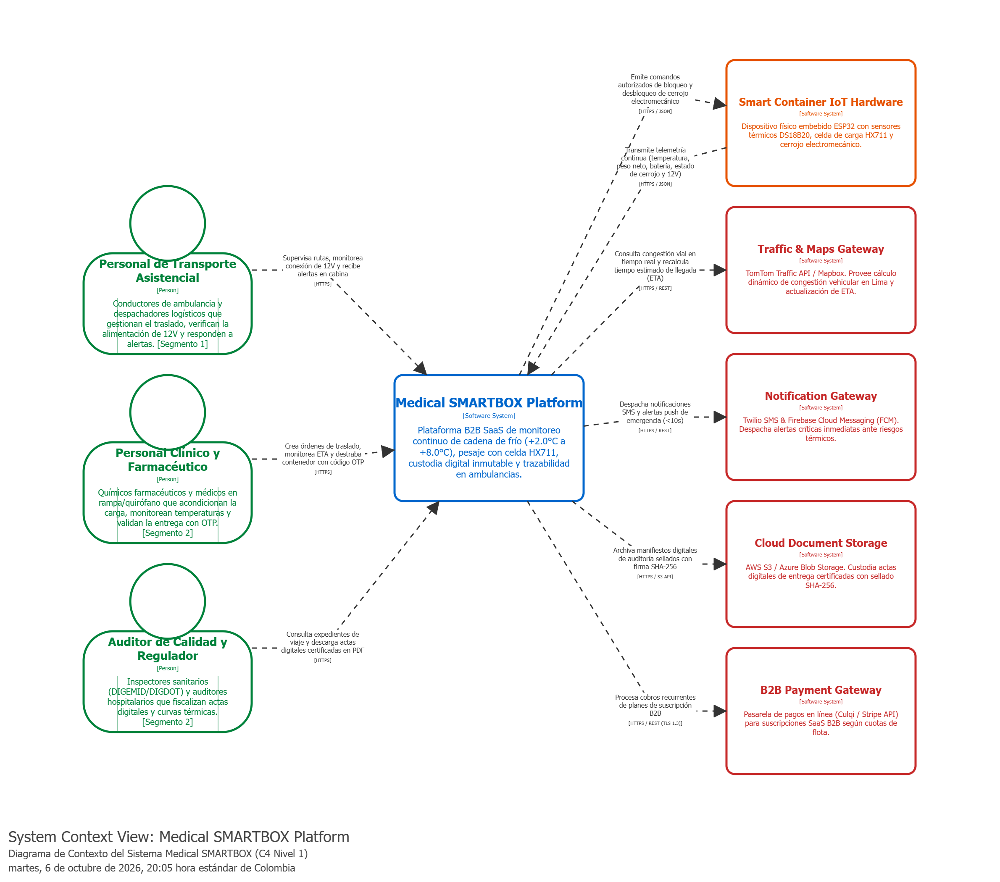

*Nota: Elaboración propia en Structurizr conforme a los estándares del modelo C4 para la arquitectura de software.*

***

### **7. Conclusiones y Transición hacia el Container Diagram (Capítulo 4.6.3)**

El **Software Architecture Context Diagram** define formalmente el perímetro del ecosistema del **Medical SMARTBOX**:
1. **Claridad de Actores:** Se han diferenciado nítidamente las responsabilidades del personal en ruta (Segmento 1: Chofer y Despachador) de las de los especialistas sanitarios (Segmento 2: Químico Farmacéutico, Médico Cirujano y Auditor).
2. **Robustez de Integraciones:** El sistema no depende de soluciones mágicas, sino de contratos técnicos específicos: telemetría continua sobre **MQTT/TLS** para el hardware IoT de ultrabajo consumo (ESP32), APIs de geolocalización contra **TomTom** para vencer la congestión de Lima, y almacenamiento inmutable **WORM** para cumplir la regulación de DIGEMID.
3. **Paso Siguiente:** Habiendo establecido la plataforma central como una caja negra de alcance delimitado, el siguiente capítulo (**4.6.3 Software Architecture Container Diagrams**) "abrirá" esta caja negra para descomponerla en sus unidades ejecutables independientes: **Landing Page estática, Single Page Application en Vue.js + PrimeVue, RESTful Web API en ASP.NET Core C#, IoT Background Ingestion Worker y Base de Datos Relacional MySQL**.

***

## **4.6.3. Software Architecture Container Diagrams**

### **1. Introducción y Fundamentación Arquitectónica del Nivel 2 de C4**

Fundamentado en los estándares de diseño arquitectónico de software, el **C4 Model** de Simon Brown y las directrices de *Domain-Driven Architecture* de Nick Tune para la integración entre Bounded Contexts y unidades de ejecución independientes, un **Contenedor** no debe confundirse exclusivamente con un contenedor de virtualización Docker, sino que representa una **unidad de software ejecutable o almacén de datos desplegable y operable de manera independiente**.

Tras haber delimitado en el Capítulo 4.6.2 la plataforma central `Medical SMARTBOX Platform` como una caja negra perimetral única, en este capítulo se realiza un "zoom in" a su arquitectura interna para descomponerla en sus contenedores de software concretos, evidenciando:
1. **La asignación de responsabilidades de software:** Qué contenedor procesa las interfaces de usuario, cuál gestiona la lógica transaccional de negocio DDD y cuál soporta la ingesta continua de hardware IoT.
2. **Las decisiones y criterios de selección tecnológica:** Adopción estratégica de **HTML5/CSS3/JavaScript** para la Landing Page de captación y difusión; **Vue Framework con PrimeVue** (Material Design) para la Frontend Web Application interactiva de alta densidad operativa; **ASP.NET Core con Entity Framework Core (C#)** para la Web API RESTful de alta concurrencia y procesamiento asíncrono; y **MySQL Server** como RDBMS principal con motor transaccional InnoDB para garantizar consistencia ACID.
3. **Los patrones y protocolos de comunicación inter-contenedor:** Especificación exacta de canales de transporte (HTTPS, WSS, TCP/MQTT, SQL/TCP) para garantizar alta disponibilidad, baja latencia y tolerancia a fallos.

***

### **2. Catálogo de Contenedores de Software (Arquitectura de Despliegue)**

La solución **Medical SMARTBOX** se descompone en **seis (6) contenedores principales**, articulando las necesidades del **Segmento 1 (Transporte / Ambulancias)** y del **Segmento 2 (Centros de Salud / Farmacéuticas)**:

<table border="1" cellpadding="3" cellspacing="0" style="border-collapse: collapse; width: 100%; table-layout: fixed; font-size: 7.2pt; border: 1px solid #cbd5e1; margin: 12px 0;">
<colgroup>
  <col style="width: 18%;" />
  <col style="width: 16%;" />
  <col style="width: 20%;" />
  <col style="width: 30%;" />
  <col style="width: 16%;" />
</colgroup>
<thead>
    <tr>
      <th>Contenedor C4</th>
      <th>Tipo de Unidad</th>
      <th>Tecnología Oficial</th>
      <th>Responsabilidades de Negocio y Operativas</th>
      <th>Segmento Atendido</th>
    </tr>
  </thead>
  <tbody>
    <tr>
      <td><strong>1. Landing Page</strong></td>
      <td><em>Web Application (Static)</em></td>
      <td>HTML5, CSS3, JavaScript nativo (Vanilla), Responsive Web Design</td>
      <td>Portal público web orientado a la captación de clientes B2B, presentación de antecedentes, propuesta de valor de cadena de frío y catálogo de planes SaaS basados en factores de forma (*Small Box* de 5L vs. *Standard Box* de 20L). Provee acceso directo al inicio de sesión institucional.</td>
      <td>Segmento 1 y Segmento 2 (Adquisición B2B)</td>
    </tr>
    <tr>
      <td><strong>2. Single Page Application (SPA)</strong><br><em>(Frontend Web App)</em></td>
      <td><em>Single Page Application</em></td>
      <td><strong>Vue Framework</strong> + <strong>PrimeVue</strong> (Material Design), HTML5, CSS3, JS, Axios, i18n, ARIA (a11y)</td>
      <td>Aplicación cliente que ejecuta en el navegador web del usuario, adaptativa y accesible: <br>• <strong>Vista Mobile PWA:</strong> Para Paramédicos/Choferes en tablet de cabina (alertas visuales/audibles) y Médicos en rampa hospitalaria (validación OTP de un solo uso). <br>• <strong>Vista Desktop:</strong> Para Despachadores de flota (mapas en vivo) y Químicos Farmacéuticos/Auditores (órdenes y actas).</td>
      <td>Segmento 1 (Operación en cabina/despacho) y Segmento 2 (Clínico y auditoría)</td>
    </tr>
    <tr>
      <td><strong>3. RESTful Web API</strong><br><em>(Backend Services)</em></td>
      <td><em>Web API Service</em></td>
      <td><strong>ASP.NET Core 10.0 (.NET 10 LTS, C#)</strong>, Entity Framework Core 10.0 (TargetFramework: <code>net10.0</code>), OpenAPI / Swagger</td>
      <td>Servidor central de servicios que expone endpoints REST bajo especificación OpenAPI/Swagger. Ejecuta la lógica de aplicación DDD, gestiona la autenticación JWT con 2FA, orquesta comandos y queries, valida invariantes de negocio de los 6 Bounded Contexts y genera actas PDF firmadas.</td>
      <td>Transversal a toda la plataforma</td>
    </tr>
    <tr>
      <td><strong>4. IoT Ingestion Background Worker</strong></td>
      <td><em>Background Service / Daemon & Embedded MQTT Broker</em></td>
      <td><strong>.NET BackgroundService (C#)</strong>, MQTTnet Server (Embedded Managed Broker) & Client, TLS 1.3</td>
      <td>Servicio en segundo plano de alto rendimiento desacoplado de la API web. Aloja un servidor/broker MQTT gestionado embebido (MQTTnet Server) que gestiona sesiones concurrentes seguras y procesa de forma continua el flujo masivo de telemetría emitido por los microcontroladores ESP32 vía <strong>MQTT over TLS (Puerto 8883)</strong>. Valida en microsegundos si la temperatura excede [2.0 °C - 8.0 °C] o si cayó la alimentación de 12V vehicular, actualiza el snapshot reactivo en Redis y emite eventos de lotes para su volcado periódico en MySQL para alimentar el historial inmutable de las actas de DIGEMID.</td>
      <td>Hardware IoT de los Contenedores Inteligentes</td>
    </tr>
    <tr>
      <td><strong>5. Relational Database</strong></td>
      <td><em>Relational DBMS</em></td>
      <td><strong>MySQL 8.0 Server (InnoDB)</strong></td>
      <td>Almacén de datos relacional transaccional (ACID) administrado mediante migraciones de Entity Framework Core 10.0 (Puerto TCP 3306). Persiste usuarios, suscripciones, flota de ambulancias, órdenes de traslado, manifiestos digitales y registros de auditoría legal.</td>
      <td>Persistencia persistente del sistema</td>
    </tr>
    <tr>
      <td><strong>6. Telemetry Cache & Real-Time Hub</strong></td>
      <td><em>In-Memory Data Store & Pub/Sub</em></td>
      <td><strong>Redis</strong> + <strong>ASP.NET Core SignalR</strong></td>
      <td>Almacén en memoria de ultrabaja latencia (Puerto TCP 6379) donde Redis provee la persistencia volátil en memoria y el backplane Pub/Sub distribuido, mientras que el host Kestrel expone el hub de WebSockets seguros (<code>WSS</code>) de ASP.NET Core SignalR para distribuir telemetría en tiempo real hacia la SPA sin saturar conexiones de MySQL.</td>
      <td>Soporte en tiempo real para SPA y Monitoreo</td>
    </tr>
  </tbody>
</table>

***

### **3. Matriz de Protocolos de Comunicación y Conectividad Inter-Contenedor**

Para garantizar el cumplimiento de los estándares de conectividad segura e interoperabilidad exigidos por la industria médica, se formaliza la siguiente matriz de integración:

<table border="1" cellpadding="3" cellspacing="0" style="border-collapse: collapse; width: 100%; table-layout: fixed; font-size: 6.8pt; border: 1px solid #cbd5e1; margin: 12px 0;">
<colgroup>
  <col style="width: 15%;" />
  <col style="width: 15%;" />
  <col style="width: 14%;" />
  <col style="width: 8%;" />
  <col style="width: 16%;" />
  <col style="width: 32%;" />
</colgroup>
<thead>
    <tr>
      <th>Origen (Source)</th>
      <th>Destino (Target)</th>
      <th>Protocolo / Canal</th>
      <th>Puerto</th>
      <th>Formato de Carga</th>
      <th>Descripción y Función de Negocio</th>
    </tr>
  </thead>
  <tbody>
    <tr>
      <td>Navegador Web (Usuario)</td>
      <td>Landing Page</td>
      <td><code>HTTPS (TLS 1.3)</code></td>
      <td>TCP 443</td>
      <td>HTML5 / CSS3 / JS</td>
      <td>Descarga de recursos estáticos, SEO meta tags y presentación del servicio SaaS.</td>
    </tr>
    <tr>
      <td>Navegador Web (Usuario)</td>
      <td>Single Page Application (SPA)</td>
      <td><code>HTTPS (TLS 1.3)</code></td>
      <td>TCP 443</td>
      <td>Vue.js Bundle / JSON</td>
      <td>Descarga de la aplicación web interactiva compilada y componentes PrimeVue.</td>
    </tr>
    <tr>
      <td>Single Page Application (SPA)</td>
      <td>RESTful Web API</td>
      <td><code>JSON / HTTPS</code></td>
      <td>TCP 443 / 5001</td>
      <td>REST Payload + Bearer JWT</td>
      <td>Ejecución de comandos y consultas autenticadas (Login 2FA, Crear orden, Despacho, Verificación OTP, Firmas).</td>
    </tr>
    <tr>
      <td>Single Page Application (SPA)</td>
      <td>Telemetry Cache & SignalR Hub</td>
      <td><code>WSS (WebSocket Seguro)</code></td>
      <td>TCP 443 (WSS)</td>
      <td>JSON Event Stream</td>
      <td>Recepción continua de telemetría en vivo (curva térmica Peltier, posición GPS en mapa) y alertas audibles en cabina.</td>
    </tr>
    <tr>
      <td>Smart Container Hardware (ESP32)</td>
      <td>IoT Ingestion Background Worker</td>
      <td><code>MQTT over TLS</code></td>
      <td>TCP 8883</td>
      <td>Compact JSON / Binary</td>
      <td>Transmisión masiva de telemetría de sensores (DS18B20, celda HX711, batería Li-Ion, acelerómetro).</td>
    </tr>
    <tr>
      <td>IoT Ingestion Background Worker</td>
      <td>Smart Container Hardware (ESP32)</td>
      <td><code>MQTT over TLS</code></td>
      <td>TCP 8883</td>
      <td>JSON Signed Command</td>
      <td>Publicación de comandos firmados de bloqueo y desbloqueo del solenoide electromecánico de la tapa.</td>
    </tr>
    <tr>
      <td>IoT Ingestion Background Worker</td>
      <td>Telemetry Cache (Redis)</td>
      <td><code>TCP / RESP</code></td>
      <td>TCP 6379</td>
      <td>Key-Value / Hashes</td>
      <td>Actualización en memoria del último snapshot térmico del contenedor para consulta instantánea.</td>
    </tr>
    <tr>
      <td>IoT Ingestion Background Worker</td>
      <td>Telemetry Cache & Event Bus (Redis)</td>
      <td><code>TCP / RESP (Pub/Sub)</code></td>
      <td>TCP 6379</td>
      <td>JSON / Domain Events</td>
      <td>Publicación desacoplada de eventos críticos en canal Redis Pub/Sub (<code>smartbox.alerts.critical</code>) consumidos por la Web API.</td>
    </tr>
    <tr>
      <td>RESTful Web API</td>
      <td>Relational Database (MySQL)</td>
      <td><code>TCP / MySQL Protocol</code></td>
      <td>TCP 3306</td>
      <td>SQL Statements vía EF Core</td>
      <td>Persistencia transaccional de órdenes, usuarios, suscripciones, manifiestos digitales, auditorías y volcado por lotes de snapshots de telemetría consolidada (telemetry_logs).</td>
    </tr>
    <tr>
      <td>RESTful Web API</td>
      <td>Telemetry Cache (Redis)</td>
      <td><code>TCP / RESP</code></td>
      <td>TCP 6379</td>
      <td>Key-Value / Distributed Cache</td>
      <td>Almacén volátil de tokens OTP temporales (validez 15 min), sesiones activas y suscripción a eventos críticos de telemetría.</td>
    </tr>
    <tr>
      <td>RESTful Web API</td>
      <td>TomTom Traffic & Routing API</td>
      <td><code>HTTPS / REST</code></td>
      <td>TCP 443</td>
      <td>JSON Requests / Responses</td>
      <td>Cálculo dinámico de congestión vial y estimación de tiempo de llegada (ETA) para alertar al quirófano.</td>
    </tr>
    <tr>
      <td>RESTful Web API</td>
      <td>Firebase FCM & Twilio Gateway</td>
      <td><code>HTTPS / REST</code></td>
      <td>TCP 443</td>
      <td>JSON Push / SMS Payload</td>
      <td>Despacho de notificaciones push de emergencia (&lt;10s) a paramédicos y farmacéuticos.</td>
    </tr>
    <tr>
      <td>RESTful Web API</td>
      <td>Cloud Immutable Storage (AWS S3)</td>
      <td><code>HTTPS / S3 REST API</code></td>
      <td>TCP 443</td>
      <td>Octet-Stream (PDF SHA-256)</td>
      <td>Archivo permanente con directiva WORM de actas digitales certificadas de custodia para DIGEMID/DIGDOT.</td>
    </tr>
    <tr>
      <td>RESTful Web API</td>
      <td>B2B Payment & Billing Gateway (Culqi / Stripe)</td>
      <td><code>HTTPS / REST API (TLS 1.3)</code></td>
      <td>TCP 443</td>
      <td>JSON Requests / Webhooks</td>
      <td>Procesamiento recurrente de débitos automáticos por planes de suscripción B2B y emisión de comprobantes fiscales electrónicos.</td>
    </tr>
    <tr>
      <td>Vehicle Telemetry System (OBD-II / 12V Aux)</td>
      <td>RESTful Web API</td>
      <td><code>HTTPS / REST</code></td>
      <td>TCP 443</td>
      <td>JSON Payload</td>
      <td>Transmisión telemétrica del voltaje auxiliar de 12V vehicular y geolocalización satelital de la unidad móvil.</td>
    </tr>
    <tr>
      <td>RESTful Web API</td>
      <td>Hospital Management System (HIS / EHR / RENIPRESS)</td>
      <td><code>HTTPS / FHIR (HL7)</code></td>
      <td>TCP 443</td>
      <td>FHIR JSON Bundle</td>
      <td>Sincronización automatizada del preaviso de llegada a rampa/quirófano y validación de acreditación institucional ante RENIPRESS.</td>
    </tr>
  </tbody>
</table>

***

### **4. Decisiones de Arquitectura y Trade-offs Técnicos**

1. **Desacoplamiento entre REST API y el IoT Ingestion Worker:**  
   * *Justificación:* Los sensores de los contenedores inteligentes emiten lecturas cada pocos segundos. Si todas estas ráfagas ingresaran directamente por endpoints HTTP de la REST API, se generaría un alto overhead de conexiones y contención en la base de datos. Se adoptó un **Worker Service dedicado en segundo plano que hospeda un broker MQTT gestionado embebido (`MQTTnet Server`)** y consume MQTT sobre TLS (puerto 8883), consolidando el broker y el procesamiento en una sola unidad de despliegue de alto rendimiento en .NET sin requerir un contenedor Mosquitto o EMQX externo, procesando las lecturas en memoria y notificando al backend solo cuando se detectan desviaciones o al consolidar viajes.
2. **Uso de Redis y SignalR como Capa de Caché y Tiempo Real:**  
   * *Justificación:* Los operadores logísticos y paramédicos requieren monitorear la curva de temperatura y la posición de la ambulancia en vivo. Implementar consultas periódicas (*polling*) desde el cliente web saturaría la base de datos MySQL. Para resolverlo, el hub de WebSockets (`TelemetryHub`) se aloja en el host Kestrel de la **RESTful Web API**, mientras que **Redis** opera como almacén de estado volátil en memoria y backplane Pub/Sub distribuido, permitiendo empujar actualizaciones en milisegundos hacia la Single Page Application mediante WebSockets (`WSS`) sin acoplar instancias de servidor ni comprometer la concurrencia transaccional.
3. **Persistencia Relacional en MySQL Server:**  
   * *Justificación:* El transporte asistencial exige estricta integridad referencial (ACID) para auditorías de DIGEMID: no puede existir un viaje sin una orden médica, ni un acta firmada sin un custodio validado. **MySQL 8.0 administrado por Entity Framework Core** provee el control transaccional requerido.

***

### **5. Especificación Visual Oficial y Bloque de Diagramación**

***

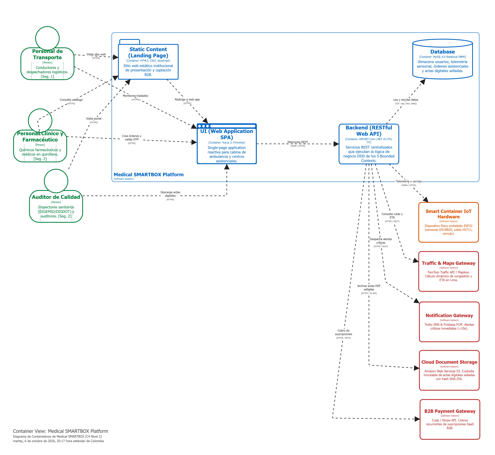

*Nota: Elaboración propia en Structurizr conforme a los estándares del modelo C4 para la arquitectura de software.*

***

### **6. Conclusiones y Transición hacia el Component Diagram (Capítulo 4.6.4)**

El **Software Architecture Container Diagram** formaliza la distribución física de responsabilidades de la plataforma:
1. **Cumplimiento Estricto del Stack:** Se ha integrado fielmente el ecosistema de tecnologías abiertas y estándares de la industria adoptados para la plataforma (**Vue.js 3 + PrimeVue**, **ASP.NET Core con Entity Framework Core**, **MySQL Server** y **Worker Services .NET**).
2. **Desacoplamiento de Carga:** La separación entre la **RESTful Web API** (orientada a transacciones de usuario) y el **IoT Ingestion Worker** (orientado a ráfagas continuas de telemetría MQTT) garantiza que la plataforma soporte cientos de ambulancias concurrentes en Lima sin degradar el rendimiento.
3. **Paso Siguiente:** Habiendo descompuesto el sistema en contenedores ejecutables, el siguiente capítulo (**4.6.4 Software Architecture Components Diagrams**) profundizará en la arquitectura interna del contenedor central más complejo: la **RESTful Web API en ASP.NET Core**, desglosándola bajo los principios de **Clean Architecture / Onion Architecture DDD** (Controllers, Application Handlers, Domain Aggregates e Infrastructure Repositories).

***

## **4.6.4. Software Architecture Components Diagrams**

### **1. Introducción y Fundamentos Arquitectónicos del Nivel 3 de C4**

Fundamentado en las directrices técnicas del **C4 Model** de Simon Brown, las prácticas de arquitectura hexagonal / Clean Architecture de Nick Tune y las convenciones de ingeniería de software para ASP.NET Core, un **Componente** es una agrupación modular y cohesiva de código (clases, interfaces y servicios) que reside dentro de un contenedor ejecutable, definiendo límites de responsabilidad explícitos.

#### Justificación del Alcance de Componentes en la Solución
Conforme a las recomendaciones de arquitectura de software para sistemas distribuidos, la descomposición de componentes se enfoca de manera prioritaria y detallada en el contenedor central: la **RESTful Web API en ASP.NET Core (C#)**, dado que en ella reside la lógica transaccional de negocio de los Bounded Contexts, la aplicación de Clean Architecture y la inversión de dependencias hacia la base de datos y pasarelas de terceros. Respecto al resto de contenedores de la arquitectura:
* **Single Page Application (SPA):** Se organiza modularmente mediante componentes adaptativos de interfaz en **Vue Framework con PrimeVue** (vistas móviles PWA para paramédicos y vistas de escritorio para coordinadores hospitalarios), los cuales consumen directamente la Web API mediante servicios HTTP tipados (Axios).
* **IoT Ingestion Background Worker:** Se estructura internamente mediante daemons de servicio (.NET `BackgroundService`) y manejadores de mensajes MQTTnet que enrutan telemetría cruda hacia la Web API y Redis.
* **Landing Page y Bases de Datos:** La Landing Page está constituida por recursos web estáticos (HTML5/CSS3/JS), mientras que la persistencia relacional en **MySQL 8.0 InnoDB** se especifica con total profundidad en el **Capítulo 4.8 (Database Design)**.

En este capítulo se realiza la descomposición exhaustiva de la **RESTful Web API en ASP.NET Core (.NET 10 LTS, C# 14)**, estructurándola bajo los principios de **Domain-Driven Design (DDD) y Clean Architecture** con estricta inversión de dependencias para evidenciar cómo se organizan los módulos que dan soporte operativo al **Segmento 1 (Transporte / Ambulancias)** y al **Segmento 2 (Centros de Salud y Cadenas Farmacéuticas)**.

***

### **2. Organización en Capas DDD de los Componentes del Contenedor**

Para evitar el acoplamiento directo entre los controladores HTTP y la base de datos MySQL, el contenedor **RESTful Web API** organiza sus componentes en cuatro capas concéntricas regidas por la **Regla de Dependencia** (las dependencias de código fuente solo apuntan hacia adentro, hacia el Dominio):

1. **Presentation Layer (Capa de Controladores REST y Hubs):**  
   Recibe las solicitudes HTTP desde la Single Page Application (Vue.js 3), valida los tokens JWT de autorización y el formato básico de los datos entrantes (DTOs), delegando inmediatamente la ejecución hacia los servicios de aplicación.
2. **Application Layer (Capa de Aplicación y Casos de Uso):**  
   Orquesta los flujos de negocio y coordina las transacciones sin contener reglas de negocio del dominio. Convierte DTOs en entidades, invoca a los agregados del dominio, interactúa con interfaces de repositorio y coordina adaptadores externos.
3. **Domain Layer (Capa de Dominio - Núcleo Central Inmutable):**  
   Contiene los Agregados Raíz (*Aggregate Roots*), Entidades, Objetos de Valor (*Value Objects*) y las **invariantes de negocio** que no dependen de ningún framework o base de datos. Define las interfaces de repositorio que la infraestructura debe implementar.
4. **Infrastructure Layer (Capa de Infraestructura y Persistencia):**  
   Implementa las interfaces de repositorio utilizando **Entity Framework Core 10.0 sobre MySQL Server 8.0 (InnoDB)**, gestiona el contexto de base de datos (`AppDbContext`) e implementa los adaptadores hacia servicios en la nube externos (TomTom, Firebase Cloud Messaging, Twilio, AWS S3).

Conforme a los fundamentos del C4 Model, en este Nivel 3 (Component Diagrams) se modelan los artefactos modulares inyectables en el contenedor de inversión de control (IoC) de ASP.NET Core (Controladores, Servicios de Aplicación, Repositorios, Adaptadores y DbContext). Las entidades de dominio, objetos de valor y estructuras internas de clases corresponden al Nivel 4 (Code / UML Class Diagrams), los cuales se especifican con exhaustividad técnica en el Capítulo 4.7.

***

<div style="page-break-before: always;"></div>

### **3. Catálogo Detallado de Componentes de la RESTful Web API**

A continuación se detallan los componentes estructurados por capa para los Bounded Contexts principales:

<table border="1" cellpadding="3" cellspacing="0" style="border-collapse: collapse; width: 100%; font-size: 6.8pt; table-layout: fixed; border: 1px solid #777;">
<colgroup>
<col style="width: 14%;" />
<col style="width: 17%;" />
<col style="width: 20%;" />
<col style="width: 32%;" />
<col style="width: 17%;" />
</colgroup>
<thead>
<tr style="background-color: #f0f0f0;">
<th style="border: 1px solid #777; padding: 3px; text-align: left;">Capa Arquitectónica</th>
<th style="border: 1px solid #777; padding: 3px; text-align: left;">Componente C4</th>
<th style="border: 1px solid #777; padding: 3px; text-align: left;">Tecnología / Framework</th>
<th style="border: 1px solid #777; padding: 3px; text-align: left;">Responsabilidades Técnicas y de Negocio</th>
<th style="border: 1px solid #777; padding: 3px; text-align: left;">Dependencias Inyectadas</th>
</tr>
</thead>
<tbody>
<tr>
<td rowspan="7" style="border: 1px solid #777; padding: 3px; vertical-align: top;"><strong>Presentation<br />(Controllers &amp; Hubs)</strong></td>
<td style="border: 1px solid #777; padding: 3px; vertical-align: top;"><code>AuthController</code></td>
<td style="border: 1px solid #777; padding: 3px; vertical-align: top;">ASP.NET Core ControllerBase, Swagger Attributes</td>
<td style="border: 1px solid #777; padding: 3px; vertical-align: top;">Expone endpoints para autenticación JWT, renovación de tokens, registro de usuarios institucionales y roles.</td>
<td style="border: 1px solid #777; padding: 3px; vertical-align: top;"><code>IIdentityService</code></td>
</tr>
<tr>
<td style="border: 1px solid #777; padding: 3px; vertical-align: top;"><code>SubscriptionsController</code></td>
<td style="border: 1px solid #777; padding: 3px; vertical-align: top;">ASP.NET Core ControllerBase, Swagger Attributes</td>
<td style="border: 1px solid #777; padding: 3px; vertical-align: top;">Expone endpoints para planes SaaS B2B, cupos de contenedores (5L/20L) y vinculación de ambulancias.</td>
<td style="border: 1px solid #777; padding: 3px; vertical-align: top;"><code>ISubscriptionService</code></td>
</tr>
<tr>
<td style="border: 1px solid #777; padding: 3px; vertical-align: top;"><code>TransportsController</code></td>
<td style="border: 1px solid #777; padding: 3px; vertical-align: top;">ASP.NET Core ControllerBase, Swagger Attributes</td>
<td style="border: 1px solid #777; padding: 3px; vertical-align: top;">Expone endpoints REST para crear órdenes de traslado de emergencia, asignar ambulancias (Seg. 1) y consultar rutas activas.</td>
<td style="border: 1px solid #777; padding: 3px; vertical-align: top;"><code>ITransportService</code></td>
</tr>
<tr>
<td style="border: 1px solid #777; padding: 3px; vertical-align: top;"><code>ContainersController</code></td>
<td style="border: 1px solid #777; padding: 3px; vertical-align: top;">ASP.NET Core ControllerBase, Swagger Attributes</td>
<td style="border: 1px solid #777; padding: 3px; vertical-align: top;">Expone endpoints para calibración de tara y pesaje neto con celda HX711, y envío de comandos de bloqueo solenoide.</td>
<td style="border: 1px solid #777; padding: 3px; vertical-align: top;"><code>ITelemetryService</code></td>
</tr>
<tr>
<td style="border: 1px solid #777; padding: 3px; vertical-align: top;"><code>AlertsController</code></td>
<td style="border: 1px solid #777; padding: 3px; vertical-align: top;">ASP.NET Core ControllerBase, Swagger Attributes</td>
<td style="border: 1px solid #777; padding: 3px; vertical-align: top;">Expone endpoints para acuse de recibo de alarmas acústicas en cabina (Seg. 1) y registro de mitigación ante excursión térmica.</td>
<td style="border: 1px solid #777; padding: 3px; vertical-align: top;"><code>IIncidentService</code></td>
</tr>
<tr>
<td style="border: 1px solid #777; padding: 3px; vertical-align: top;"><code>CustodyController</code></td>
<td style="border: 1px solid #777; padding: 3px; vertical-align: top;">ASP.NET Core ControllerBase, Swagger Attributes</td>
<td style="border: 1px solid #777; padding: 3px; vertical-align: top;">Expone endpoints para validar el <strong>código OTP de un solo uso</strong> en rampa hospitalaria (Seg. 2) y descargar el acta digital certificada.</td>
<td style="border: 1px solid #777; padding: 3px; vertical-align: top;"><code>ICustodyService</code></td>
</tr>
<tr>
<td style="border: 1px solid #777; padding: 3px; vertical-align: top;"><code>TelemetryHub</code></td>
<td style="border: 1px solid #777; padding: 3px; vertical-align: top;">ASP.NET Core SignalR Hub, Authorize Attribute</td>
<td style="border: 1px solid #777; padding: 3px; vertical-align: top;">Expone el endpoint de WebSockets (<code>/hubs/telemetry</code>) para suscripción en tiempo real a curvas térmicas, estado de 12V y posición GPS de SmartBoxes.</td>
<td style="border: 1px solid #777; padding: 3px; vertical-align: top;"><code>IRealTimeCacheService</code></td>
</tr>
<tr>
<td rowspan="7" style="border: 1px solid #777; padding: 3px; vertical-align: top;"><strong>Application<br />(Services / Use Cases)</strong></td>
<td style="border: 1px solid #777; padding: 3px; vertical-align: top;"><code>IdentityService</code></td>
<td style="border: 1px solid #777; padding: 3px; vertical-align: top;">C# Service Class, JWT Bearer Handler</td>
<td style="border: 1px solid #777; padding: 3px; vertical-align: top;">Valida credenciales con hashing BCrypt, emite tokens criptográficos JWT y verifica permisos RBAC de ambos segmentos.</td>
<td style="border: 1px solid #777; padding: 3px; vertical-align: top;"><code>IUserRepository</code>,<br /><code>ITokenGeneratorService</code></td>
</tr>
<tr>
<td style="border: 1px solid #777; padding: 3px; vertical-align: top;"><code>SubscriptionService</code></td>
<td style="border: 1px solid #777; padding: 3px; vertical-align: top;">C# Service Class</td>
<td style="border: 1px solid #777; padding: 3px; vertical-align: top;">Gestiona planes institucionales B2B, valida cupos de SmartBoxes activos por institución y acuerdos de soporte SLA.</td>
<td style="border: 1px solid #777; padding: 3px; vertical-align: top;"><code>ISubscriptionRepository</code></td>
</tr>
<tr>
<td style="border: 1px solid #777; padding: 3px; vertical-align: top;"><code>TransportApplicationService</code></td>
<td style="border: 1px solid #777; padding: 3px; vertical-align: top;">C# Service Class, FluentValidation</td>
<td style="border: 1px solid #777; padding: 3px; vertical-align: top;">Orquesta la planificación del viaje, valida tiempos de isquemia fría (&lt;4h corazón, &lt;8h hígado) y consulta a TomTom para recalcular ETA dinámico.</td>
<td style="border: 1px solid #777; padding: 3px; vertical-align: top;"><code>ITransportRepository</code>,<br /><code>ITrafficRoutingService</code></td>
</tr>
<tr>
<td style="border: 1px solid #777; padding: 3px; vertical-align: top;"><code>TelemetryProcessingService</code></td>
<td style="border: 1px solid #777; padding: 3px; vertical-align: top;">C# Service Class, MediatR</td>
<td style="border: 1px solid #777; padding: 3px; vertical-align: top;">Valida snapshots de telemetría, comprueba rango térmico (+2.0 °C a +8.0 °C), detecta desconexión de energía de 12V y persiste periódicamente bloques consolidados en MySQL vía <code>ISmartContainerRepository</code> para alimentar las actas de DIGEMID.</td>
<td style="border: 1px solid #777; padding: 3px; vertical-align: top;"><code>ISmartContainerRepository</code>,<br /><code>IRealTimeCacheService</code></td>
</tr>
<tr>
<td style="border: 1px solid #777; padding: 3px; vertical-align: top;"><code>TelemetryAlertSubscriber</code></td>
<td style="border: 1px solid #777; padding: 3px; vertical-align: top;">BackgroundService (C#), IHostedService</td>
<td style="border: 1px solid #777; padding: 3px; vertical-align: top;">Servicio continuo en segundo plano que escucha los canales Redis Pub/Sub (<code>smartbox.alerts.critical</code> y <code>smartbox.telemetry.batch</code>); mediante <code>IServiceScope</code>, delega de forma segura el manejo de alertas a <code>IncidentResponseService</code> y la persistencia de lotes a <code>TelemetryProcessingService</code>.</td>
<td style="border: 1px solid #777; padding: 3px; vertical-align: top;"><code>IServiceScopeFactory</code>,<br /><code>IRealTimeCacheService</code></td>
</tr>
<tr>
<td style="border: 1px solid #777; padding: 3px; vertical-align: top;"><code>IncidentResponseService</code></td>
<td style="border: 1px solid #777; padding: 3px; vertical-align: top;">C# Service Class</td>
<td style="border: 1px solid #777; padding: 3px; vertical-align: top;">Evalúa severidad de desviaciones térmicas y orquesta el despacho omnicanal de alertas push y SMS hacia la tripulación y médicos.</td>
<td style="border: 1px solid #777; padding: 3px; vertical-align: top;"><code>IIncidentRepository</code>,<br /><code>INotificationService</code></td>
</tr>
<tr>
<td style="border: 1px solid #777; padding: 3px; vertical-align: top;"><code>CustodyVerificationService</code></td>
<td style="border: 1px solid #777; padding: 3px; vertical-align: top;">C# Service Class</td>
<td style="border: 1px solid #777; padding: 3px; vertical-align: top;">Comprueba la validez temporal del OTP, comanda el desbloqueo electromecánico de la tapa y genera el manifiesto sellado con SHA-256.</td>
<td style="border: 1px solid #777; padding: 3px; vertical-align: top;"><code>ICustodyRepository</code>,<br /><code>IStorageService</code>,<br /><code>IRealTimeCacheService</code></td>
</tr>
<tr>
<td rowspan="5" style="border: 1px solid #777; padding: 3px; vertical-align: top;"><strong>Domain<br />(Core Business)</strong><br /><small style="color: #666;"><em>(Límites de dominio orquestados por Aplicación; modelado estructural de clases detallado en Capítulo 4.7)</em></small></td>
<td style="border: 1px solid #777; padding: 3px; vertical-align: top;"><code>UserAccount</code> &amp; <code>SubscriptionPlan</code></td>
<td style="border: 1px solid #777; padding: 3px; vertical-align: top;">Plain C# (POCO), Domain Entities</td>
<td style="border: 1px solid #777; padding: 3px; vertical-align: top;">Representan las identidades, roles clínicos, límites de flota de SmartBoxes y acuerdos comerciales B2B.</td>
<td style="border: 1px solid #777; padding: 3px; vertical-align: top;">—</td>
</tr>
<tr>
<td style="border: 1px solid #777; padding: 3px; vertical-align: top;"><code>SmartContainer</code></td>
<td style="border: 1px solid #777; padding: 3px; vertical-align: top;">DDD Aggregate Root</td>
<td style="border: 1px solid #777; padding: 3px; vertical-align: top;">Encapsula el estado electromecánico de la tapa, celda Peltier, batería LiFePO4 y el historial telemétrico.</td>
<td style="border: 1px solid #777; padding: 3px; vertical-align: top;">—</td>
</tr>
<tr>
<td style="border: 1px solid #777; padding: 3px; vertical-align: top;"><code>TransportOrder</code> &amp; <code>DispatchTrip</code></td>
<td style="border: 1px solid #777; padding: 3px; vertical-align: top;">DDD Aggregate Roots</td>
<td style="border: 1px solid #777; padding: 3px; vertical-align: top;">Modelan la solicitud clínica de traslado, asignación de paramédico/ambulancia y ruta con isquemia fría controlada.</td>
<td style="border: 1px solid #777; padding: 3px; vertical-align: top;">—</td>
</tr>
<tr>
<td style="border: 1px solid #777; padding: 3px; vertical-align: top;"><code>CriticalIncident</code></td>
<td style="border: 1px solid #777; padding: 3px; vertical-align: top;">DDD Aggregate Root</td>
<td style="border: 1px solid #777; padding: 3px; vertical-align: top;">Modela anomalías térmicas y de energía auxiliar, gobernando las reglas de escalamiento y resoluciones de mitigación.</td>
<td style="border: 1px solid #777; padding: 3px; vertical-align: top;">—</td>
</tr>
<tr>
<td style="border: 1px solid #777; padding: 3px; vertical-align: top;"><code>CustodyTransfer</code></td>
<td style="border: 1px solid #777; padding: 3px; vertical-align: top;">DDD Aggregate Root</td>
<td style="border: 1px solid #777; padding: 3px; vertical-align: top;">Gobernado por la máquina de estados de entrega, validación de clave OTP temporal y manifiesto inmutable DIGEMID.</td>
<td style="border: 1px solid #777; padding: 3px; vertical-align: top;">—</td>
</tr>
<tr>
<td rowspan="9" style="border: 1px solid #777; padding: 3px; vertical-align: top;"><strong>Infrastructure<br />(Persistence &amp; Adapters)</strong></td>
<td style="border: 1px solid #777; padding: 3px; vertical-align: top;"><code>AppDbContext</code></td>
<td style="border: 1px solid #777; padding: 3px; vertical-align: top;">Entity Framework Core 10.0 (.NET 10 LTS), Pomelo MySQL / Oracle MySQL EF Core</td>
<td style="border: 1px solid #777; padding: 3px; vertical-align: top;">Contexto de base de datos que mapea las entidades del dominio hacia el esquema relacional en MySQL 8.0 (TCP 3306).</td>
<td style="border: 1px solid #777; padding: 3px; vertical-align: top;"><code>DbContextOptions</code></td>
</tr>
<tr>
<td style="border: 1px solid #777; padding: 3px; vertical-align: top;"><code>EF Repositories Implementations</code></td>
<td style="border: 1px solid #777; padding: 3px; vertical-align: top;">EF Core Repositories (C#)</td>
<td style="border: 1px solid #777; padding: 3px; vertical-align: top;">Implementan <code>IUserRepository</code>, <code>ISubscriptionRepository</code>, <code>ITransportRepository</code>, <code>ISmartContainerRepository</code>, etc.</td>
<td style="border: 1px solid #777; padding: 3px; vertical-align: top;"><code>AppDbContext</code></td>
</tr>
<tr>
<td style="border: 1px solid #777; padding: 3px; vertical-align: top;"><code>TomTomRoutingAdapter</code></td>
<td style="border: 1px solid #777; padding: 3px; vertical-align: top;">HttpClient, Polly (Retry/CircuitBreaker)</td>
<td style="border: 1px solid #777; padding: 3px; vertical-align: top;">Consume la API de TomTom para obtener matrices de tiempo considerando el tráfico vehicular en avenidas de Lima.</td>
<td style="border: 1px solid #777; padding: 3px; vertical-align: top;"><code>IHttpClientFactory</code></td>
</tr>
<tr>
<td style="border: 1px solid #777; padding: 3px; vertical-align: top;"><code>FirebaseTwilioNotificationAdapter</code></td>
<td style="border: 1px solid #777; padding: 3px; vertical-align: top;">FirebaseAdmin SDK, Twilio REST API</td>
<td style="border: 1px solid #777; padding: 3px; vertical-align: top;">Despacha notificaciones push a la PWA móvil y mensajes de texto SMS a los teléfonos de la guardia médica.</td>
<td style="border: 1px solid #777; padding: 3px; vertical-align: top;"><code>IOptions&lt;NotificationSettings&gt;</code></td>
</tr>
<tr>
<td style="border: 1px solid #777; padding: 3px; vertical-align: top;"><code>AwsS3StorageAdapter</code></td>
<td style="border: 1px solid #777; padding: 3px; vertical-align: top;">AWSSDK.S3 (C#)</td>
<td style="border: 1px solid #777; padding: 3px; vertical-align: top;">Sube los manifiestos de viaje en PDF generados con sellado SHA-256 a buckets con retención WORM inmutable.</td>
<td style="border: 1px solid #777; padding: 3px; vertical-align: top;"><code>IAmazonS3</code></td>
</tr>
<tr>
<td style="border: 1px solid #777; padding: 3px; vertical-align: top;"><code>CulqiPaymentAdapter</code></td>
<td style="border: 1px solid #777; padding: 3px; vertical-align: top;">HttpClient, Polly (Resilience)</td>
<td style="border: 1px solid #777; padding: 3px; vertical-align: top;">Implementa <code>IPaymentGateway</code> para procesamiento automatizado de débitos B2B y validación de comprobantes de pago.</td>
<td style="border: 1px solid #777; padding: 3px; vertical-align: top;"><code>IHttpClientFactory</code></td>
</tr>
<tr>
<td style="border: 1px solid #777; padding: 3px; vertical-align: top;"><code>HospitalFhirAdapter</code></td>
<td style="border: 1px solid #777; padding: 3px; vertical-align: top;">HttpClient, HL7.Fhir.R4</td>
<td style="border: 1px solid #777; padding: 3px; vertical-align: top;">Implementa <code>IHospitalInteroperabilityService</code> para sincronización de preavisos con el HIS hospitalario y consulta de habilitación RENIPRESS.</td>
<td style="border: 1px solid #777; padding: 3px; vertical-align: top;"><code>IHttpClientFactory</code></td>
</tr>
<tr>
<td style="border: 1px solid #777; padding: 3px; vertical-align: top;"><code>JwtTokenGeneratorAdapter</code></td>
<td style="border: 1px solid #777; padding: 3px; vertical-align: top;">System.IdentityModel.Tokens.Jwt, C# Class</td>
<td style="border: 1px solid #777; padding: 3px; vertical-align: top;">Implementa <code>ITokenGeneratorService</code> para generar y firmar criptográficamente tokens JWT con claims institucionales.</td>
<td style="border: 1px solid #777; padding: 3px; vertical-align: top;"><code>IOptions&lt;JwtSettings&gt;</code></td>
</tr>
<tr>
<td style="border: 1px solid #777; padding: 3px; vertical-align: top;"><code>RedisRealTimeCacheAdapter</code></td>
<td style="border: 1px solid #777; padding: 3px; vertical-align: top;">StackExchange.Redis (C#)</td>
<td style="border: 1px solid #777; padding: 3px; vertical-align: top;">Implementa <code>IRealTimeCacheService</code> para gestión de estado volátil en memoria y suscripción a canales Pub/Sub.</td>
<td style="border: 1px solid #777; padding: 3px; vertical-align: top;"><code>IConnectionMultiplexer</code></td>
</tr>
</tbody>
</table>

***

### **4. Matriz de Inyección de Dependencias y Ciclos de Vida (IoC Container)**

Siguiendo las convenciones oficiales de desarrollo para ASP.NET Core de Microsoft, los componentes se registran en el contenedor de dependencias nativo de ASP.NET Core (`Program.cs`) respetando sus ciclos de vida:

| Interfaz (Abstracción) | Implementación Concreta | Ciclo de Vida (*Service Lifetime*) | Justificación Arquitectónica |
|---|---|---|---|
| `IIdentityService` | `IdentityService` | `Scoped` | Maneja la sesión y tokens JWT por cada solicitud HTTP entrante. |
| `ISubscriptionService` | `SubscriptionService` | `Scoped` | Valida cuotas y estado de suscripción por transacción. |
| `ITransportService` | `TransportApplicationService` | `Scoped` | Instanciado por cada petición HTTP para mantener el contexto de la transacción. |
| `ITelemetryService` | `TelemetryProcessingService` | `Scoped` | Maneja operaciones de validación por solicitud. |
| `TelemetryAlertSubscriber` | `TelemetryAlertSubscriber` | `Singleton` (`IHostedService`) | Mantiene la escucha permanente del canal Redis Pub/Sub y crea ámbitos temporales (`IServiceScope`) para ejecutar servicios `Scoped`. |
| `IIncidentService` | `IncidentResponseService` | `Scoped` | Mantiene el estado de evaluación de la incidencia en curso. |
| `ICustodyService` | `CustodyVerificationService` | `Scoped` | Gestiona el proceso transaccional de entrega con OTP y comanda el desbloqueo vía Redis Pub/Sub hacia el despachador MQTT. |
| `AppDbContext` | `AppDbContext` (EF Core) | `Scoped` | Un contexto por request garantiza coherencia del patrón *Unit of Work*. |
| `IUserRepository` | `UserRepository` | `Scoped` | Acceso a credenciales y roles asistenciales vía EF Core. |
| `ISubscriptionRepository` | `SubscriptionRepository` | `Scoped` | Persistencia de contratos y cuotas institucionales. |
| `ITransportRepository` | `TransportRepository` | `Scoped` | Comparte el mismo `AppDbContext` que el servicio de aplicación. |
| `ISmartContainerRepository`| `SmartContainerRepository` | `Scoped` | Persistencia coordinada de contenedores. |
| `IIncidentRepository` | `IncidentRepository` | `Scoped` | Persistencia transaccional de incidentes térmicos y acciones de mitigación. |
| `ICustodyRepository` | `CustodyRepository` | `Scoped` | Persistencia de transferencias de custodia, tokens OTP y actas digitales. |
| `ITrafficRoutingService` | `TomTomRoutingAdapter` | `Transient` / `Typed HttpClient` | Utiliza pools de sockets optimizados con reintentos automáticos (Polly). |
| `INotificationService` | `FirebaseTwilioNotificationAdapter` | `Singleton` | Reutiliza los clientes de conexión hacia FCM y Twilio de forma concurrente. |
| `IStorageService` | `AwsS3StorageAdapter` | `Singleton` | Adaptador de cliente S3 autenticado de larga duración. |
| `IPaymentGateway` | `CulqiPaymentAdapter` | `Transient` / `Typed HttpClient` | Procesamiento transaccional de débitos B2B con aislamiento por solicitud. |
| `IHospitalInteroperabilityService` | `HospitalFhirAdapter` | `Transient` / `Typed HttpClient` | Consultas de interoperabilidad hospitalaria HL7-FHIR y estado RENIPRESS con resiliencia Polly. |
| `ITokenGeneratorService` | `JwtTokenGeneratorAdapter` | `Scoped` | Genera tokens criptográficos JWT con claims y firmas digitales para usuarios autenticados. |
| `IRealTimeCacheService` | `RedisRealTimeCacheAdapter` | `Singleton` | Administra la conexión multiplexada persistente hacia Redis para telemetría en tiempo real y canales SignalR Pub/Sub. |
| `MapHub<TelemetryHub>` | `TelemetryHub` (SignalR) | `Transient` / *Per-Invocation* | Endpoint WebSockets (`/hubs/telemetry`) para distribución reactiva de eventos y telemetría hacia los clientes SPA conectados. |

***

### **5. Especificación Visual Oficial y Bloque de Diagramación del Backend RESTful API**

***

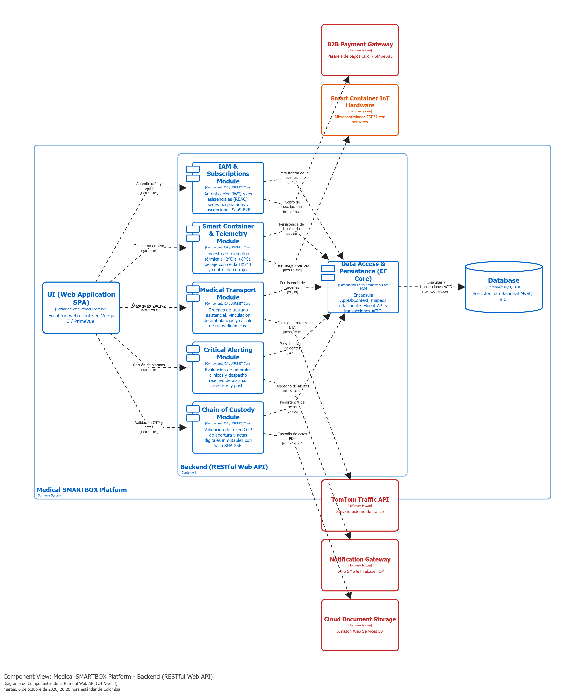

*Nota: Elaboración propia en Structurizr conforme a los estándares del modelo C4 para la arquitectura de software.*

***

### **6. Desglose Componencial de Contenedores Satélites (SPA y Ingestion Worker)**

Para complementar la visión integral de la arquitectura en el Nivel 3 (Componentes) conforme a las directrices de ingeniería de software, se presenta la descomposición modular de los otros dos contenedores de software activos del sistema:

#### **6.1. Single Page Application (Frontend Web Vue 3 + PrimeVue)**
* **Router & Navigation Guard (Vue Router):** Gestiona rutas protegidas por roles sanitarios (`/dispatch`, `/telemetry-live`, `/handover-otp`, `/audit-manifests`), interceptando transiciones de usuario sin token JWT válido.
* **State Management Stores (Pinia):**
  * `useAuthStore`: Almacena perfil del usuario autenticado, RUC institucional y claims de autorización.
  * `useTripTrackingStore`: Mantiene la posición geográfica en vivo de la ambulancia, el tiempo estimado de llegada (ETA) y la ruta activa.
  * `useSmartBoxStore`: Sincroniza en tiempo real la temperatura interna (+2°C a +8°C), nivel de batería, estado del cerrojo y alertas críticas recibidas vía WebSocket SignalR.
* **Componentes Visuales Especializados (PrimeVue + Leaflet):**
  * `LiveAmbulanceMap`: Renderiza el mapa interactivo de Lima Metropolitana con trazado de polilíneas y geocercas hospitalarias de 2 km.
  * `ThermalTelemetryGauge`: Instrumento gráfico tipo tacómetro que resalta zonas térmicas seguras y dispara avisos visuales ante aproximación al límite de excursión.
  * `OtpHandoverDialog`: Interfaz modal para ingreso del código OTP de 6 dígitos con teclado numérico accesible para cirujanos y farmacéuticos en quirófano.
* **HTTP Client & Resiliency (Axios ApiClient):** Instancia de Axios configurada con interceptores para inyección automática del encabezado `Authorization: Bearer <token>` y captura uniforme de errores RFC 7807 (ProblemDetails).

***

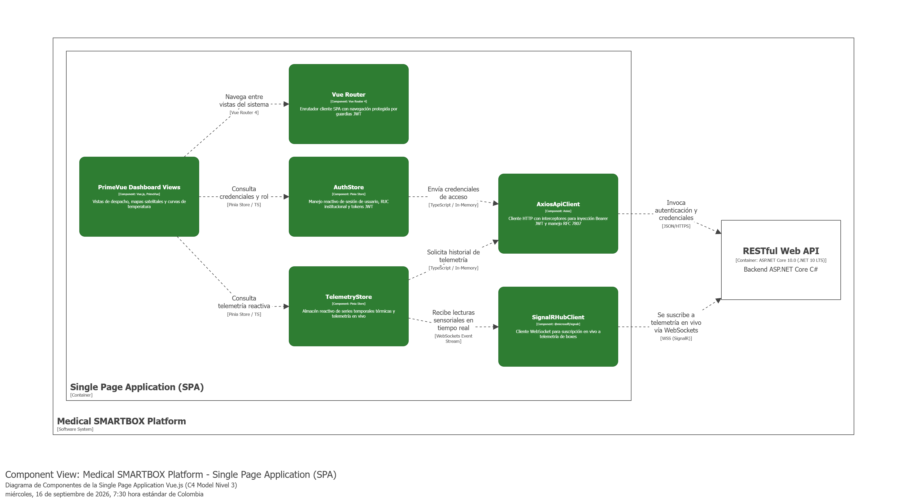

*Nota: Elaboración propia en Structurizr conforme a la notación C4 Model (Nivel 3: Componentes) de Simon Brown.*

***

#### **6.2. IoT Telemetry Ingestion Worker (.NET BackgroundService)**
* **MqttTelemetryConsumer:** Servicio residente en segundo plano basado en `MQTTnet` que mantiene una conexión persistente bidireccional sobre TLS (puerto 8883) suscrito al tópico canónico `smartbox/+/telemetry`.
* **TelemetryPayloadValidator:** Valida la estructura JSON del mensaje sensorial, verifica la firma criptográfica HMAC-SHA256 generada por el firmware del microcontrolador ESP32 y descarta paquetes corruptos.
* **ThermalThresholdEvaluator:** Evalúa si la temperatura supera los umbrales clínicos (+2.0 °C / +8.0 °C); de detectar desviación o desconexión vehicular de 12V, emite un evento interno hacia el pipeline de alertas críticas.
* **RedisTelemetryPublisher:** Publica las lecturas normalizadas en el canal Pub/Sub de Redis para su propagación inmediata a la Web API y clientes conectados mediante SignalR Hubs.
* **MqttCommandDispatcher:** Componente residente que se suscribe al canal Redis Pub/Sub (`smartbox.commands.actuators`) para consumir comandos de bloqueo y desbloqueo emitidos por `CustodyVerificationService`, publicando mensajes firmados vía MQTT sobre TLS (puerto 8883) hacia el actuador del cerrojo electromecánico en el microcontrolador ESP32 (`smartbox/{boxId}/commands`).

***

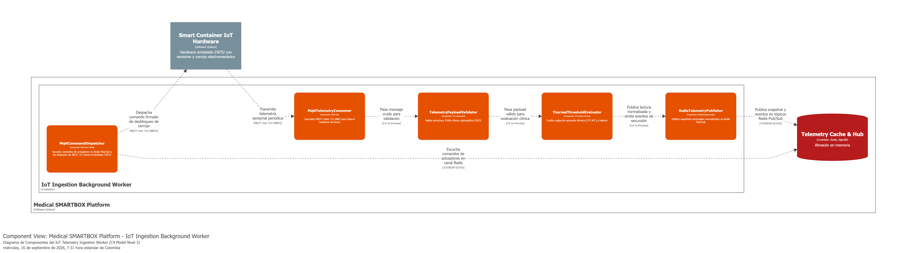

*Nota: Elaboración propia en Structurizr conforme a la notación C4 Model (Nivel 3: Componentes) de Simon Brown.*

***

### **7. Conclusiones y Transición hacia el Diseño Orientado a Objetos (Capítulo 4.7)**

El **Software Architecture Components Diagram** demuestra la aplicación rigurosa de los principios de **Clean Architecture e Inversión de Dependencias (DIP)**:
1. **Desacoplamiento Estricto:** La capa de Dominio permanece libre de dependencias hacia MySQL, HTTP o bibliotecas de terceros; los controladores y repositorios dependen de abstracciones (`Interfaces`).
2. **Alta Cohesión:** Cada Bounded Context cuenta con su tríada de Controlador, Servicio de Aplicación y Repositorio, garantizando mantenibilidad y escalabilidad.
3. **Paso Siguiente:** Habiendo establecido la estructura modular de componentes, el siguiente capítulo (**4.7 Software Object-Oriented Design / 4.7.1 Class Diagrams**) detallará el modelado estático orientado a objetos de estas clases, especificando atributos tipados, modificadores de acceso (`+`, `-`, `#`), métodos con parámetros y tipos de retorno, y relaciones UML con multiplicidades exactas.

***

<div style="page-break-after: always;"></div>

# **4.7. Software Object-Oriented Design**

## **4.7.1. Class Diagrams**

### **1. Introducción y Fundamentación Técnica del Diseño OO**

El diseño estático del sistema se fundamenta en los estándares de la especificación oficial UML 2.5 y las referencias canónicas de ingeniería de software:
* **Notación de Modelado UML 2.5:** Estándares canónicos para la construcción de diagramas de clases orientados a objetos con tipado estricto y relaciones formales.
* **Convenciones Oficiales de Microsoft C# (.NET 10 LTS):** Tipado estricto, encapsulamiento mediante propiedades automáticas con mutabilidad controlada (`{ get; private set; }`) y diseño orientado al dominio.
* **Patrones de Arquitectura DDD (Nick Tune y Eric Evans):** Modelado de clases diferenciando estereotipos estratégicos de Domain-Driven Design (Agregados, Entidades, Objetos de Valor e Interfaces de Repositorio).

El diseño orientado a objetos del sistema **Medical SMARTBOX** trasciende la mera representación de estructuras de datos pasivas (modelos anémicos tipo CRUD) para modelar un **Dominio Rico (*Rich Domain Model*)**, donde las clases encapsulan tanto su estado como las **invariantes de negocio y reglas sanitarias** que garantizan la preservación de órganos, hemoderivados y vacunas durante el transporte de emergencia en Lima Metropolitana.

#### Estereotipos y Convenciones UML Aplicadas (Notación Formal OMG UML « »)
1. **«AggregateRoot» (Raíz de Agregado):** Entidad principal que define una frontera transaccional de consistencia. El acceso a los objetos internos del agregado se realiza exclusivamente a través de sus métodos públicos.
2. **«Entity» (Entidad):** Objeto con identidad única que perdura a través del tiempo y cuyos atributos pueden mutar.
3. **«ValueObject» (Objeto de Valor):** Objeto inmutable sin identidad conceptual, definido exclusivamente por sus atributos (`TemperatureReading`, `OtpToken`, `GeoLocation`).
4. **«Enumeration» (Enumeración):** Conjunto cerrado de constantes con significado semántico en el dominio.
5. **«Repository» (Abstracción de Persistencia DDD):** Define operaciones de persistencia de agregados desacoplando la lógica de negocio del motor de base de datos.
6. **«Service» (Abstracción de Servicio Externo / Integración):** Encapsula servicios de infraestructura externos (tráfico, notificaciones, almacenamiento).
7. **«DomainEvent» (Evento de Dominio):** Notificación inmutable de un hecho consumado relevante en el ciclo de vida del negocio.
8. **Modificadores de Acceso y Visibilidad:**  
   * `+` : Público (*public*)  
   * `-` : Privado (*private*)  
   * `#` : Protegido (*protected*)

#### Mapeo Objeto-Relacional con Entity Framework Core 10.0 y Convenciones Nominales
En estricta observancia de los patrones Domain-Driven Design (DDD), las clases del dominio adoptan nomenclatura de negocio en C# (*PascalCase*), mientras que el esquema relacional en MySQL 8.0 implementa estándares físicos de base de datos (*snake_case*). Las correspondencias específicas entre nombres de propiedades y columnas físicas se gobiernan declarativamente mediante la Fluent API de EF Core (`.HasColumnName(...)`):
* `SubscriptionPlan.PlanCode` → columna `code` (definida en tabla `subscription_plans`).
* `SubscriptionPlan.MaxFleetBoxes` → columna `max_smartboxes` (definida en tabla `subscription_plans`).
* `SubscriptionPlan.MonthlyCostUsd` → columna `monthly_price_usd` (definida en tabla `subscription_plans`).
* `HospitalInstitution.OfficialName` → columna `name` (definida en tabla `hospital_institutions`).
* `UserAccount.ProfessionalLicenseNumber` → columna `medical_license_number` (definida en tabla `users`).
* `TransportOrder.Priority` → columna `clinical_priority` (definida en tabla `transport_orders`).
* `CustodyTransfer.TransferredAt` → columna `completed_at` (definida en tabla `custody_transfers`).
* `DigitalAuditManifest.GeneratedAt` → columna `sealed_at` (definida en tabla `digital_audit_manifests`).
* `DigitalAuditManifest.CloudStorageUrl` → columna `cloud_storage_pdf_url` (definida en tabla `digital_audit_manifests`).
Esta separación formal preserva la expresividad del lenguaje ubicuo en el código fuente de dominio sin acoplarlo rígidamente a los identificadores físicos de almacenamiento.

***

### **2. Desglose Exhaustivo de Clases por Bounded Context**

A continuación se detalla la especificación estática de clases para los cinco Bounded Contexts del sistema que articulan el **Segmento 1 (Transporte y Flota Logística)** y el **Segmento 2 (Centros de Salud y Cadenas Farmacéuticas)**:

***

#### **4.7.1.0. Bounded Context: Identity, Access & Subscriptions (IAM)**

A nivel del diseño estático de clases de software, las entidades de identidad, roles institucionales y suscripción SaaS se consolidan en este módulo para garantizar consistencia transaccional inmediata en la validación de licencias y membresías activas. Este contexto centraliza la autenticación mediante tokens JWT, control de acceso basado en roles (RBAC) para los dos segmentos objetivo, registro formal de sedes hospitalarias con código RENIPRESS y gestión del modelo de suscripción SaaS para flotas de contenedores médicos.

<table border="1" cellpadding="3" cellspacing="0" style="border-collapse: collapse; width: 100%; table-layout: fixed; font-size: 6.8pt; line-height: 1.25; border: 1px solid #cbd5e1; margin: 12px 0;">
<colgroup>
  <col style="width: 17%;" />
  <col style="width: 13%;" />
  <col style="width: 29%;" />
  <col style="width: 24%;" />
  <col style="width: 17%;" />
</colgroup>
<thead>
    <tr>
      <th>Clase / Interfaz / Enum</th>
      <th>Estereotipo DDD</th>
      <th>Atributos (Visibilidad y Tipo)</th>
      <th>Métodos (Firma Completa y Retorno)</th>
      <th>Invariantes y Reglas Protegidas</th>
    </tr>
  </thead>
  <tbody>
    <tr>
      <td><code>SubscriptionPlan</code></td>
      <td><code>«AggregateRoot»</code></td>
      <td>
        <code>+ Id: Guid</code><br>
        <code>+ PlanCode: string</code><br>
        <code>+ Name: string</code><br>
        <code>+ MaxAmbulances: int</code><br>
        <code>+ MaxFleetBoxes: int</code><br>
        <code>+ MonthlyCostUsd: decimal</code><br>
        <code>+ SupportSlaHours: int</code><br>
        <code>+ TelemetryDataRetentionMonths: int</code><br>
        <code>+ IsActive: bool</code>
      </td>
      <td>
        <code>+ CanProvisionBox(currentBoxes: int): bool</code><br>
        <code>+ CanProvisionAmbulance(currentAmbulances: int): bool</code><br>
        <code>+ UpdateBillingTerms(cost: decimal, maxBoxes: int, maxAmbulances: int): void</code>
      </td>
      <td>
        • El costo mensual debe ser mayor o igual a cero.<br>
        • No se permite aprovisionar boxes ni registrar ambulancias si la flota activa alcanza el límite del plan.
      </td>
    </tr>
    <tr>
      <td><code>HospitalInstitution</code></td>
      <td><code>«AggregateRoot»</code></td>
      <td>
        <code>+ Id: Guid</code><br>
        <code>+ OfficialName: string</code><br>
        <code>+ TaxIdRuc: string</code><br>
        <code>+ InstitutionType: InstitutionTypeEnum</code><br>
        <code>+ RenipressCode: string</code><br>
        <code>+ HealthServiceLevel: string</code><br>
        <code>+ Address: string</code><br>
        <code>+ District: string</code><br>
        <code>+ EmergencyPhone: string</code><br>
        <code>+ Latitude: double</code><br>
        <code>+ Longitude: double</code><br>
        <code>+ GeofenceRadiusMeters: double</code><br>
        <code>+ SubscriptionPlanId: Guid</code><br>
        <code>+ IsActive: bool</code>
      </td>
      <td>
        <code>+ IsLocationInsideGeofence(lat: double, lon: double): bool</code><br>
        <code>+ UpdateGeofenceRadius(radiusMeters: double): void</code>
      </td>
      <td>
        • El RUC debe ser una cadena fiscal válida de 11 dígitos.<br>
        • El código RENIPRESS es de registro sanitario obligatorio ante SUSALUD/MINSA.<br>
        • El radio de geocerca no puede ser inferior a 500 metros ni superior a 5000 metros.
      </td>
    </tr>
    <tr>
      <td><code>UserAccount</code></td>
      <td><code>«AggregateRoot»</code></td>
      <td>
        <code>+ Id: Guid</code><br>
        <code>+ InstitutionId: Guid</code><br>
        <code>+ FirstName: string</code><br>
        <code>+ LastName: string</code><br>
        <code>+ Email: string</code><br>
        <code>+ PasswordHash: string</code><br>
        <code>+ PhoneNumber: string</code><br>
        <code>+ ProfessionalLicenseNumber: string</code><br>
        <code>+ Role: UserRole</code><br>
        <code>+ IsActive: bool</code><br>
        <code>+ LastLoginAt: DateTime?</code>
      </td>
      <td>
        <code>+ VerifyPassword(plainPassword: string): bool</code><br>
        <code>+ ChangePassword(newHash: string): void</code><br>
        <code>+ DeactivateAccount(): void</code>
      </td>
      <td>
        • El correo electrónico debe poseer formato RFC válido y ser único en el sistema.<br>
        • Los usuarios con roles clínicos (médico, farmacéutico) deben registrar número de colegiatura profesional habilitada.<br>
        • Contraseñas protegidas mediante algoritmos de derivación de claves criptográficas seguras (BCrypt/Argon2).
      </td>
    </tr>
    <tr>
      <td><code>UserRole</code></td>
      <td><code>«Enumeration»</code></td>
      <td>
        <code>AmbulanceDriver</code><br>
        <code>Paramedic</code><br>
        <code>FleetDispatcher</code><br>
        <code>ClinicalPharmacist</code><br>
        <code>ReceivingSurgeon</code><br>
        <code>QualityAuditor</code><br>
        <code>SystemAdministrator</code>
      </td>
      <td>N/A (Constantes semánticas)</td>
      <td>Restringe los privilegios de navegación y permisos de comandos en la Web Application y API.</td>
    </tr>
    <tr>
      <td><code>InstitutionTypeEnum</code></td>
      <td><code>«Enumeration»</code></td>
      <td>
        <code>PublicHospital</code><br>
        <code>PrivateClinic</code><br>
        <code>AmbulanceNetwork</code><br>
        <code>PharmaceuticalLab</code>
      </td>
      <td>N/A (Constantes semánticas)</td>
      <td>Clasifica la naturaleza asistencial de la institución cliente registrada en la plataforma.</td>
    </tr>
    <tr>
      <td><code>IUserRepository</code></td>
      <td><code>«Repository»</code></td>
      <td>N/A (Contrato abstracto)</td>
      <td>
        <code>+ GetByIdAsync(id: Guid): Task&lt;UserAccount&gt;</code><br>
        <code>+ GetByEmailAsync(email: string): Task&lt;UserAccount&gt;</code><br>
        <code>+ SaveAsync(user: UserAccount): Task</code>
      </td>
      <td>Desacopla la persistencia de usuarios del motor MySQL.</td>
    </tr>
    <tr>
      <td><code>IInstitutionRepository</code></td>
      <td><code>«Repository»</code></td>
      <td>N/A (Contrato abstracto)</td>
      <td>
        <code>+ GetByIdAsync(id: Guid): Task&lt;HospitalInstitution&gt;</code><br>
        <code>+ GetByRenipressCodeAsync(code: string): Task&lt;HospitalInstitution&gt;</code><br>
        <code>+ SaveAsync(institution: HospitalInstitution): Task</code>
      </td>
      <td>Garantiza la inversión de dependencias para la gestión institucional.</td>
    </tr>
    <tr>
      <td><code>ISubscriptionRepository</code></td>
      <td><code>«Repository»</code></td>
      <td>N/A (Contrato abstracto)</td>
      <td>
        <code>+ GetByIdAsync(id: Guid): Task&lt;SubscriptionPlan&gt;</code><br>
        <code>+ GetByCodeAsync(code: string): Task&lt;SubscriptionPlan&gt;</code><br>
        <code>+ SaveAsync(plan: SubscriptionPlan): Task</code>
      </td>
      <td>Garantiza la persistencia e inversión de dependencias para los planes de suscripción B2B.</td>
    </tr>
  </tbody>
</table>

***

#### **4.7.1.1. Bounded Context A: Smart Container & Telemetry Monitoring (IoT)**

Representa el núcleo físico y sensorial del proyecto. Modela el control activo de frío (+2.0 °C a +8.0 °C) mediante celdas Peltier, el pesaje digital con celda HX711 (&plusmn;5 g), el solenoide electromecánico de la tapa y la supervisión de la toma de 12V vehicular.

<table border="1" cellpadding="3" cellspacing="0" style="border-collapse: collapse; width: 100%; table-layout: fixed; font-size: 6.8pt; line-height: 1.25; border: 1px solid #cbd5e1; margin: 12px 0;">
<colgroup>
  <col style="width: 17%;" />
  <col style="width: 13%;" />
  <col style="width: 29%;" />
  <col style="width: 24%;" />
  <col style="width: 17%;" />
</colgroup>
<thead>
    <tr>
      <th>Clase / Interfaz / Enum</th>
      <th>Estereotipo DDD</th>
      <th>Atributos (Visibilidad y Tipo)</th>
      <th>Métodos (Firma Completa y Retorno)</th>
      <th>Invariantes y Reglas Protegidas</th>
    </tr>
  </thead>
  <tbody>
    <tr>
      <td><code>SmartContainer</code></td>
      <td><code>«AggregateRoot»</code></td>
      <td>
        <code>+ Id: Guid</code><br>
        <code>+ SerialNumber: string</code><br>
        <code>+ FormFactor: BoxFormFactor</code><br>
        <code>+ Status: ContainerStatus</code><br>
        <code>+ CurrentTemperature: double</code><br>
        <code>+ NetWeightGrams: double</code><br>
        <code>+ TareWeightGrams: double</code><br>
        <code>+ LastTelemetryAt: DateTime</code><br>
        <code>- _lock: ElectromechanicalLock</code><br>
        <code>- _cooler: PeltierCooler</code><br>
        <code>- _battery: BatteryUnit</code>
      </td>
      <td>
        <code>+ RecordTelemetry(snapshot: TelemetrySnapshot): Result</code><br>
        <code>+ CalibrateTare(tareGrams: double): void</code><br>
        <code>+ LoadPayload(grossWeightGrams: double): void</code><br>
        <code>+ EngageLock(): void</code><br>
        <code>+ UnlockWithVerifiedOtp(): void</code><br>
        <code>+ SwitchToAuxiliaryPower(): void</code>
      </td>
      <td>
        • La tapa electromecánica no puede abrirse si el estado es <code>InTransit</code> salvo autorización explícita.<br>
        • Variaciones de peso &gt; 15g en ruta disparan evento de presunta adulteración de carga.<br>
        • Desviación térmica fuera de [2.0 °C - 8.0 °C] dispara evento de excursión.
      </td>
    </tr>
    <tr>
      <td><code>ElectromechanicalLock</code></td>
      <td><code>«Entity»</code></td>
      <td>
        <code>+ Id: Guid</code><br>
        <code>+ State: LockState</code><br>
        <code>+ LastEngagedAt: DateTime</code><br>
        <code>+ IsSecure: bool</code>
      </td>
      <td>
        <code>+ Engage(): void</code><br>
        <code>+ Release(): void</code><br>
        <code>+ VerifySecurityStatus(): bool</code>
      </td>
      <td>Encapsula y comanda el estado lógico de seguridad del cerrojo de la tapa del contenedor.</td>
    </tr>
    <tr>
      <td><code>PeltierCooler</code></td>
      <td><code>«Entity»</code></td>
      <td>
        <code>+ Id: Guid</code><br>
        <code>+ PowerOutputPercentage: int</code><br>
        <code>+ TargetTemperature: double</code><br>
        <code>+ IsActive: bool</code>
      </td>
      <td>
        <code>+ SetTargetTemperature(targetCelsius: double): void</code><br>
        <code>+ Activate(): void</code><br>
        <code>+ Deactivate(): void</code>
      </td>
      <td>Comanda el punto de consigna térmico del sistema de enfriamiento activo para preservar el rango seguro de +4.0 °C.</td>
    </tr>
    <tr>
      <td><code>BatteryUnit</code></td>
      <td><code>«Entity»</code></td>
      <td>
        <code>+ Id: Guid</code><br>
        <code>+ ChargePercentage: double</code><br>
        <code>+ IsChargingFrom12V: bool</code><br>
        <code>+ RemainingAutonomyHours: double</code>
      </td>
      <td>
        <code>+ UpdateLevel(chargePct: double, isCharging: bool): void</code><br>
        <code>+ HasSufficientAutonomy(minHours: double): bool</code>
      </td>
      <td>Supervisa la alimentación vehicular de 12V y la reserva de autonomía energética de la batería interna.</td>
    </tr>
    <tr>
      <td><code>TelemetrySnapshot</code></td>
      <td><code>«ValueObject»</code></td>
      <td>
        <code>+ TimestampUtc: DateTime</code><br>
        <code>+ TemperatureCelsius: double</code><br>
        <code>+ WeightGrams: double</code><br>
        <code>+ BatteryPercent: double</code><br>
        <code>+ Is12VConnected: bool</code><br>
        <code>+ Location: GeoLocation</code><br>
        <code>+ FirmwareSignature: string</code>
      </td>
      <td>
        <code>+ IsThermallyValid(): bool</code><br>
        <code>+ HasValidSignature(publicKey: string): bool</code>
      </td>
      <td>Inmutable. Representa un paquete atómico de telemetría emitido por el microcontrolador ESP32.</td>
    </tr>
    <tr>
      <td><code>ISmartContainerRepository</code></td>
      <td><code>«Repository»</code></td>
      <td>—</td>
      <td>
        <code>+ GetByIdAsync(id: Guid): Task&lt;SmartContainer&gt;</code><br>
        <code>+ GetBySerialNumberAsync(serial: string): Task&lt;SmartContainer&gt;</code><br>
        <code>+ SaveAsync(container: SmartContainer): Task</code>
      </td>
      <td>Contrato de persistencia desacoplado de Entity Framework Core.</td>
    </tr>
    <tr>
      <td><code>ContainerStatus</code></td>
      <td><code>«Enumeration»</code></td>
      <td><code>Available</code>, <code>Precooling</code>, <code>LockedAndReady</code>, <code>InTransit</code>, <code>Delivered</code>, <code>MaintenanceRequired</code></td>
      <td>—</td>
      <td>Ciclo de vida operativo del contenedor.</td>
    </tr>
    <tr>
      <td><code>BoxFormFactor</code></td>
      <td><code>«Enumeration»</code></td>
      <td><code>SmallBox_5L</code> (Vacunas/Biopsias), <code>StandardBox_20L</code> (Órganos/Sangre)</td>
      <td>—</td>
      <td>Factor de forma asociado a la suscripción B2B.</td>
    </tr>
    <tr>
      <td><code>TelemetryLog</code></td>
      <td><code>«Entity»</code></td>
      <td>
        <code>+ Id: long</code><br>
        <code>+ ContainerId: Guid</code><br>
        <code>+ TripId: Guid?</code><br>
        <code>+ TimestampUtc: DateTime</code><br>
        <code>+ TemperatureCelsius: decimal</code><br>
        <code>+ AmbientTemperatureCelsius: decimal</code><br>
        <code>+ WeightGrams: decimal</code><br>
        <code>+ BatteryPercentage: decimal</code><br>
        <code>+ Is12VConnected: bool</code><br>
        <code>+ PeltierPowerPct: int</code><br>
        <code>+ LidLockEngaged: bool</code><br>
        <code>+ Latitude: decimal?</code><br>
        <code>+ Longitude: decimal?</code><br>
        <code>+ FirmwareSignature: string</code><br>
        <code>+ IsThermalExcursion: bool</code>
      </td>
      <td>
        <code>+ IsExcursion(minTemp: decimal, maxTemp: decimal): bool</code><br>
        <code>+ ValidateIntegrity(): bool</code>
      </td>
      <td>
        • Registro transaccional inmutable que persiste cada lectura sensorial en MySQL (<code>telemetry_logs</code>) para auditoría de DIGEMID.<br>
        • Permite reconstruir la curva térmica continua y verificar alertas retrospectivas.
      </td>
    </tr>
    <tr>
      <td><code>ITelemetryRepository</code></td>
      <td><code>«Repository»</code></td>
      <td>—</td>
      <td>
        <code>+ AppendLogAsync(log: TelemetryLog): Task</code><br>
        <code>+ GetLogsByTripIdAsync(tripId: Guid): Task&lt;IReadOnlyCollection&lt;TelemetryLog&gt;&gt;</code><br>
        <code>+ GetLatestByContainerIdAsync(containerId: Guid): Task&lt;TelemetryLog&gt;</code>
      </td>
      <td>Contrato de persistencia de alta concurrencia para el flujo continuo de telemetría sensorial.</td>
    </tr>
    <tr>
      <td><code>LockState</code></td>
      <td><code>«Enumeration»</code></td>
      <td><code>Locked</code>, <code>Unlocked</code>, <code>Tampered</code>, <code>Error</code></td>
      <td>—</td>
      <td>Estado mecánico del solenoide.</td>
    </tr>
    <tr>
      <td><code>GeoLocation</code></td>
      <td><code>«ValueObject»</code></td>
      <td>
        <code>+ Latitude: double</code><br>
        <code>+ Longitude: double</code>
      </td>
      <td>
        <code>+ DistanceTo(other: GeoLocation): double</code><br>
        <code>+ IsWithinGeofence(center: GeoLocation, radiusMeters: double): bool</code>
      </td>
      <td>
        • Objeto de valor inmutable. Valida rangos de latitud [-90.0, 90.0] y longitud [-180.0, 180.0].<br>
        • Utilizado para calcular la distancia a geocercas hospitalarias de pre-arribo y el progreso de la ruta asistencial.
      </td>
    </tr>
  </tbody>
</table>

***

#### **4.7.1.2. Bounded Context B: Medical Transport Planning & Dispatching (Segmento 1)**

Modela la respuesta operativa del **Segmento 1 (Ambulancias y Despacho)** ante las emergencias: creación de órdenes, asignación de unidades móviles, control de tiempos de isquemia fría y cálculo dinámico de ETA ante el tráfico severo de Lima.

<table border="1" cellpadding="3" cellspacing="0" style="border-collapse: collapse; width: 100%; table-layout: fixed; font-size: 6.8pt; line-height: 1.25; border: 1px solid #cbd5e1; margin: 12px 0;">
<colgroup>
  <col style="width: 17%;" />
  <col style="width: 13%;" />
  <col style="width: 29%;" />
  <col style="width: 24%;" />
  <col style="width: 17%;" />
</colgroup>
<thead>
    <tr>
      <th>Clase / Interfaz / Enum</th>
      <th>Estereotipo DDD</th>
      <th>Atributos (Visibilidad y Tipo)</th>
      <th>Métodos (Firma Completa y Retorno)</th>
      <th>Invariantes y Reglas Protegidas</th>
    </tr>
  </thead>
  <tbody>
    <tr>
      <td><code>TransportOrder</code></td>
      <td><code>«AggregateRoot»</code></td>
      <td>
        <code>+ Id: Guid</code><br>
        <code>+ OrderCode: string</code><br>
        <code>+ OriginHospitalId: Guid</code><br>
        <code>+ DestinationHospitalId: Guid</code><br>
        <code>+ CargoDescription: string</code><br>
        <code>+ CargoType: CargoType</code><br>
        <code>+ Priority: PriorityLevel</code><br>
        <code>+ Status: TransportOrderStatus</code><br>
        <code>+ MaxIschemiaLimit: IschemiaTimeLimit</code><br>
        <code>+ CreatedByUserId: Guid</code><br>
        <code>+ CreatedAt: DateTime</code>
      </td>
      <td>
        <code>+ ValidateIschemiaFeasibility(estimatedMinutes: int): bool</code><br>
        <code>+ CancelOrder(reason: string): void</code>
      </td>
      <td>
        • Requiere obligatoriamente un límite de isquemia fría conforme a la Directiva Sanitaria N° 152/MINSA.<br>
        • El hospital de origen y destino deben ser IPRESS verificadas con RENIPRESS.
      </td>
    </tr>
    <tr>
      <td><code>DispatchTrip</code></td>
      <td><code>«AggregateRoot»</code></td>
      <td>
        <code>+ Id: Guid</code><br>
        <code>+ OrderId: Guid</code><br>
        <code>+ AssignedVehiclePlate: string</code><br>
        <code>+ AssignedContainerId: Guid</code><br>
        <code>+ AssignedDriverUserId: Guid</code><br>
        <code>+ AssignedParamedicUserId: Guid</code><br>
        <code>+ Status: TripStatus</code><br>
        <code>+ ScheduledDepartureTime: DateTime</code><br>
        <code>+ ActualDepartureTime: DateTime?</code><br>
        <code>+ EstimatedArrivalTime: DateTime</code><br>
        <code>+ ActualArrivalTime: DateTime?</code><br>
        <code>- _route: TransportRoute</code>
      </td>
      <td>
        <code>+ AssignCrewAndResources(vehiclePlate: string, boxId: Guid, driverId: Guid, paramedicId: Guid): void</code><br>
        <code>+ StartTrip(boxPrecooled: bool): Result</code><br>
        <code>+ UpdateDynamicEta(newEta: DateTime): void</code><br>
        <code>+ RegisterHospitalArrival(currentLoc: GeoLocation): Result</code>
      </td>
      <td>
        • No puede iniciar el viaje si el contenedor no alcanzó pre-enfriamiento (2°C-8°C).<br>
        • No puede marcar llegada si la ambulancia está fuera de la geocerca de 100m del hospital receptor.
      </td>
    </tr>
    <tr>
      <td><code>TransportRoute</code></td>
      <td><code>«Entity»</code></td>
      <td>
        <code>+ Id: Guid</code><br>
        <code>+ DistanceKilometers: double</code><br>
        <code>+ PlannedDurationMinutes: int</code><br>
        <code>+ CurrentCongestionDelayMinutes: int</code><br>
        <code>+ PolylineCoordinates: string</code>
      </td>
      <td>
        <code>+ RecalculateRoute(congestionMinutes: int): void</code><br>
        <code>+ IsSeverelyDelayed(): bool</code>
      </td>
      <td>Gestiona los desvíos y demoras ocasionados por el tráfico en arterias viales de Lima.</td>
    </tr>
    <tr>
      <td><code>IschemiaTimeLimit</code></td>
      <td><code>«ValueObject»</code></td>
      <td>
        <code>+ MaxSafeHours: double</code><br>
        <code>+ WarningThresholdHours: double</code>
      </td>
      <td>
        <code>+ IsViolated(elapsedHours: double): bool</code><br>
        <code>+ IsApproachingLimit(elapsedHours: double): bool</code>
      </td>
      <td>Inmutable. Tiempos máximos de conservación celular (&lt;4h para corazón, &lt;8h para hígado).</td>
    </tr>
    <tr>
      <td><code>ITransportRepository</code></td>
      <td><code>«Repository»</code></td>
      <td>—</td>
      <td>
        <code>+ GetTripByIdAsync(id: Guid): Task&lt;DispatchTrip&gt;</code><br>
        <code>+ GetActiveTripsAsync(): Task&lt;List&lt;DispatchTrip&gt;&gt;</code><br>
        <code>+ SaveTripAsync(trip: DispatchTrip): Task</code>
      </td>
      <td>Contrato para persistencia de órdenes y viajes asistenciales.</td>
    </tr>
    <tr>
      <td><code>ITrafficRoutingService</code></td>
      <td><code>«Service»</code></td>
      <td>—</td>
      <td>
        <code>+ GetDynamicEtaAsync(origin: GeoLocation, dest: GeoLocation): Task&lt;DateTime&gt;</code><br>
        <code>+ CheckTrafficDelaysAsync(routePolyline: string): Task&lt;int&gt;</code>
      </td>
      <td>Abstracción para el cliente HTTP de la API de TomTom.</td>
    </tr>
    <tr>
      <td><code>TripStatus</code></td>
      <td><code>«Enumeration»</code></td>
      <td><code>Scheduled</code>, <code>ResourcesAssigned</code>, <code>PrecoolingVerified</code>, <code>InTransit</code>, <code>ArrivedAtDestination</code>, <code>Completed</code>, <code>Cancelled</code></td>
      <td>—</td>
      <td>Estados del viaje asistencial.</td>
    </tr>
    <tr>
      <td><code>CargoType</code></td>
      <td><code>«Enumeration»</code></td>
      <td><code>HeartOrgan</code>, <code>LiverOrgan</code>, <code>KidneyOrgan</code>, <code>BloodPlasmaPack</code>, <code>ThermolabileVaccine</code>, <code>BiopsySample</code></td>
      <td>—</td>
      <td>Tipo biológico de la carga transportada.</td>
    </tr>
    <tr>
      <td><code>PriorityLevel</code></td>
      <td><code>«Enumeration»</code></td>
      <td><code>Routine</code>, <code>Urgent</code>, <code>StatEmergency</code></td>
      <td>—</td>
      <td>Nivel de prioridad clínica de despacho conforme a <code>transport_orders.clinical_priority</code> en MySQL.</td>
    </tr>
    <tr>
      <td><code>TransportOrderStatus</code></td>
      <td><code>«Enumeration»</code></td>
      <td><code>Pending</code>, <code>Assigned</code>, <code>InTransit</code>, <code>Completed</code>, <code>Cancelled</code></td>
      <td>—</td>
      <td>Ciclo de vida transaccional de la orden de traslado conforme a <code>transport_orders.status</code> en MySQL.</td>
    </tr>
  </tbody>
</table>

***

#### **4.7.1.3. Bounded Context C: Critical Alerting & Incident Response (Segmentos 1 y 2)**

Modela la detección de contingencias, despacho de alarmas acústicas y visuales a la cabina de ambulancia (Segmento 1) y notificaciones push/SMS a los directores médicos y receptores (Segmento 2).

<table border="1" cellpadding="3" cellspacing="0" style="border-collapse: collapse; width: 100%; table-layout: fixed; font-size: 6.8pt; line-height: 1.25; border: 1px solid #cbd5e1; margin: 12px 0;">
<colgroup>
  <col style="width: 17%;" />
  <col style="width: 13%;" />
  <col style="width: 29%;" />
  <col style="width: 24%;" />
  <col style="width: 17%;" />
</colgroup>
<thead>
    <tr>
      <th>Clase / Interfaz / Enum</th>
      <th>Estereotipo DDD</th>
      <th>Atributos (Visibilidad y Tipo)</th>
      <th>Métodos (Firma Completa y Retorno)</th>
      <th>Invariantes y Reglas Protegidas</th>
    </tr>
  </thead>
  <tbody>
    <tr>
      <td><code>CriticalIncident</code></td>
      <td><code>«AggregateRoot»</code></td>
      <td>
        <code>+ Id: Guid</code><br>
        <code>+ TripId: Guid</code><br>
        <code>+ ContainerId: Guid</code><br>
        <code>+ IncidentType: IncidentType</code><br>
        <code>+ Severity: IncidentSeverity</code><br>
        <code>+ Status: IncidentStatus</code><br>
        <code>+ TriggerTemperatureCelsius: decimal?</code><br>
        <code>+ TriggerBatteryPercentage: decimal?</code><br>
        <code>+ EscalationLevel: EscalationLevelEnum</code><br>
        <code>+ TriggeredAt: DateTime</code><br>
        <code>+ AcknowledgedAt: DateTime?</code><br>
        <code>+ AcknowledgedByUserId: Guid?</code><br>
        <code>- _resolution: ContingencyResolution?</code>
      </td>
      <td>
        <code>+ Acknowledge(operatorId: Guid): void</code><br>
        <code>+ EscalateToMedicalDirector(): void</code><br>
        <code>+ Resolve(actionDescription: string, resolvedBy: Guid): Result</code>
      </td>
      <td>
        • Alertas críticas deben despacharse en menos de 10 segundos.<br>
        • Un incidente no puede cerrarse como resuelto sin registrar obligatoriamente una acción de mitigación.<br>
        • Registra los valores sensoriales de disparo (temperatura y batería) conforme a <code>critical_incidents</code> en MySQL.
      </td>
    </tr>
    <tr>
      <td><code>ContingencyResolution</code></td>
      <td><code>«Entity»</code></td>
      <td>
        <code>+ Id: Guid</code><br>
        <code>+ MitigationAction: string</code><br>
        <code>+ QualitySignoffNotes: string</code><br>
        <code>+ ResolvedAt: DateTime</code><br>
        <code>+ ResolvedByUserId: Guid</code><br>
        <code>+ WasThermalIntegrityRestored: bool</code>
      </td>
      <td>
        <code>+ ValidateResolution(): bool</code>
      </td>
      <td>Registra la intervención física en ruta (ej. reconexión de toma 12V, cambio de ruta) y el visto bueno de control de calidad.</td>
    </tr>
    <tr>
      <td><code>IIncidentRepository</code></td>
      <td><code>«Repository»</code></td>
      <td>—</td>
      <td>
        <code>+ GetActiveIncidentsAsync(): Task&lt;List&lt;CriticalIncident&gt;&gt;</code><br>
        <code>+ SaveAsync(incident: CriticalIncident): Task</code>
      </td>
      <td>Contrato de persistencia de alertas e incidentes.</td>
    </tr>
    <tr>
      <td><code>INotificationService</code></td>
      <td><code>«Service»</code></td>
      <td>—</td>
      <td>
        <code>+ SendCriticalPushAlertAsync(userId: Guid, msg: string): Task&lt;bool&gt;</code><br>
        <code>+ SendSmsAlertAsync(phone: string, msg: string): Task&lt;bool&gt;</code>
      </td>
      <td>Abstracción hacia Firebase Cloud Messaging y Twilio SMS.</td>
    </tr>
    <tr>
      <td><code>IncidentSeverity</code></td>
      <td><code>«Enumeration»</code></td>
      <td><code>LowWarning</code>, <code>ModerateAlert</code>, <code>CriticalEmergency</code>, <code>CatastrophicFailure</code></td>
      <td>—</td>
      <td>Nivel de severidad de la anomalía.</td>
    </tr>
    <tr>
      <td><code>IncidentType</code></td>
      <td><code>«Enumeration»</code></td>
      <td><code>ColdChainBreachHigh</code>, <code>ColdChainBreachLow</code>, <code>Auxiliary12VPowerLost</code>, <code>PayloadTamperingSuspected</code>, <code>SevereTrafficDelayExceeded</code></td>
      <td>—</td>
      <td>Tipo de falla operativa detectada.</td>
    </tr>
    <tr>
      <td><code>EscalationLevelEnum</code></td>
      <td><code>«Enumeration»</code></td>
      <td><code>OperationalCabAlert = 1</code>, <code>LogisticsSupervisorAlert = 2</code>, <code>MedicalDirectorEscalation = 3</code></td>
      <td>—</td>
      <td>Nivel de escalamiento jerárquico asistencial conforme a <code>critical_incidents.escalation_level</code> en MySQL (valores base 1 requeridos por la restricción CHECK 1..3).</td>
    </tr>
    <tr>
      <td><code>IncidentStatus</code></td>
      <td><code>«Enumeration»</code></td>
      <td><code>Triggered</code>, <code>Acknowledged</code>, <code>Escalated</code>, <code>Resolved</code></td>
      <td>—</td>
      <td>Ciclo de vida operativo de la contingencia conforme a <code>critical_incidents.status</code> en MySQL.</td>
    </tr>
  </tbody>
</table>

***

#### **4.7.1.4. Bounded Context D: Chain of Custody & Traceability (Segmento 2 - Clínico y Legal)**

Modela la seguridad de custodia en el hospital receptor (**Segmento 2**): validación del **código OTP de un solo uso**, desbloqueo seguro de la tapa y generación inmutable del acta digital con hash criptográfico SHA-256 para auditorías de DIGEMID y DIGDOT.

<table border="1" cellpadding="3" cellspacing="0" style="border-collapse: collapse; width: 100%; table-layout: fixed; font-size: 6.8pt; line-height: 1.25; border: 1px solid #cbd5e1; margin: 12px 0;">
<colgroup>
  <col style="width: 17%;" />
  <col style="width: 13%;" />
  <col style="width: 29%;" />
  <col style="width: 24%;" />
  <col style="width: 17%;" />
</colgroup>
<thead>
    <tr>
      <th>Clase / Interfaz / Enum</th>
      <th>Estereotipo DDD</th>
      <th>Atributos (Visibilidad y Tipo)</th>
      <th>Métodos (Firma Completa y Retorno)</th>
      <th>Invariantes y Reglas Protegidas</th>
    </tr>
  </thead>
  <tbody>
    <tr>
      <td><code>CustodyTransfer</code></td>
      <td><code>«AggregateRoot»</code></td>
      <td>
        <code>+ Id: Guid</code><br>
        <code>+ TripId: Guid</code><br>
        <code>+ RecipientHospitalId: Guid</code><br>
        <code>+ AuthorizedRecipientUserId: Guid</code><br>
        <code>+ Status: HandoverStatus</code><br>
        <code>+ RecipientNotes: string?</code><br>
        <code>+ TransferredAt: DateTime?</code><br>
        <code>- _otpToken: OtpToken</code>
      </td>
      <td>
        <code>+ GenerateRecipientOtp(): string</code><br>
        <code>+ VerifyOtpAndAuthorizeOpening(enteredOtp: string): Result</code><br>
        <code>+ ConfirmCustodyAcceptance(inspectorNotes: string): Result</code><br>
        <code>+ RejectDeliveryDueToThermalDamage(reason: string): void</code><br>
        <code>+ RejectDeliveryDueToTampering(reason: string): void</code>
      </td>
      <td>
        • El contenedor solo se destraba si el código OTP coincide exactamente y no ha expirado (&lt;15 min).<br>
        • Si se detectó excursión térmica irreparable o alteración de peso &gt; 15g, no se puede confirmar entrega conforme.<br>
        • Genera de forma asociada el <code>DigitalAuditManifest</code> como raíz de agregado inmutable.<br>
        • Registra notas de recepción conforme a <code>custody_transfers.recipient_notes</code> en MySQL.
      </td>
    </tr>
    <tr>
      <td><code>DigitalAuditManifest</code></td>
      <td><code>«AggregateRoot»</code></td>
      <td>
        <code>+ Id: Guid</code><br>
        <code>+ TransferId: Guid</code><br>
        <code>+ ManifestCode: string</code><br>
        <code>+ GeneratedAt: DateTime</code><br>
        <code>+ CryptographicHashSha256: string</code><br>
        <code>+ CloudStorageUrl: string</code><br>
        <code>+ IsSealedAndImmutable: bool</code><br>
        <code>+ AverageTemperatureCelsius: double</code><br>
        <code>+ MinTemperatureCelsius: double</code><br>
        <code>+ MaxTemperatureCelsius: double</code><br>
        <code>+ TotalExcursionSeconds: int</code><br>
        <code>+ MinsaComplianceVerified: bool</code>
      </td>
      <td>
        <code>+ CalculateThermalCompliance(): bool</code><br>
        <code>+ SealManifest(pdfBytes: byte[]): void</code>
      </td>
      <td>
        • El acta es estrictamente inmutable una vez sellada con hash SHA-256.<br>
        • Contiene la curva térmica minuto a minuto, acumulación de segundos de excursión y verificación explícita de directivas sanitarias del MINSA para sustento legal ante DIGEMID.
      </td>
    </tr>
    <tr>
      <td><code>OtpToken</code></td>
      <td><code>«ValueObject»</code></td>
      <td>
        <code>+ HashedCode: string</code><br>
        <code>+ ExpiresAtUtc: DateTime</code><br>
        <code>+ MaxAttemptsAllowed: int</code><br>
        <code>+ CurrentAttempts: int</code>
      </td>
      <td>
        <code>+ ValidateCode(plainCode: string): bool</code><br>
        <code>+ IsExpired(): bool</code>
      </td>
      <td>Inmutable. Token temporal de un solo uso despachado al teléfono del médico receptor.</td>
    </tr>
    <tr>
      <td><code>ICustodyRepository</code></td>
      <td><code>«Repository»</code></td>
      <td>—</td>
      <td>
        <code>+ GetTransferByTripIdAsync(tripId: Guid): Task&lt;CustodyTransfer&gt;</code><br>
        <code>+ SaveTransferAsync(transfer: CustodyTransfer): Task</code><br>
        <code>+ SaveManifestAsync(manifest: DigitalAuditManifest): Task</code>
      </td>
      <td>Contrato de persistencia de transferencias de custodia y actas auditables.</td>
    </tr>
    <tr>
      <td><code>IStorageService</code></td>
      <td><code>«Service»</code></td>
      <td>—</td>
      <td>
        <code>+ UploadImmutablePdfAsync(fileName: string, stream: Stream): Task&lt;string&gt;</code>
      </td>
      <td>Abstracción hacia AWS S3 para almacenamiento WORM.</td>
    </tr>
    <tr>
      <td><code>HandoverStatus</code></td>
      <td><code>«Enumeration»</code></td>
      <td><code>PendingOtpVerification</code>, <code>OtpVerifiedLidUnlocked</code>, <code>CompletedAccepted</code>, <code>RejectedThermalExcursion</code>, <code>RejectedTampering</code></td>
      <td>—</td>
      <td>Estados de la entrega física y legal.</td>
    </tr>
  </tbody>
</table>

***

#### **4.7.1.5. Domain Events y Clases Transversales (Shared Kernel)**

Permiten propagar asíncronamente cambios de estado críticos entre los Bounded Contexts sin generar acoplamiento directo entre Agregados Raíz:

<table border="1" cellpadding="3" cellspacing="0" style="border-collapse: collapse; width: 100%; table-layout: fixed; font-size: 6.8pt; line-height: 1.25; border: 1px solid #cbd5e1; margin: 12px 0;">
<colgroup>
  <col style="width: 17%;" />
  <col style="width: 13%;" />
  <col style="width: 29%;" />
  <col style="width: 24%;" />
  <col style="width: 17%;" />
</colgroup>
<thead>
    <tr>
      <th>Clase / Estructura</th>
      <th>Estereotipo DDD</th>
      <th>Atributos / Propiedades Tipadas C#</th>
      <th>Métodos / Comportamiento</th>
      <th>Descripción y Propósito de Negocio</th>
    </tr>
  </thead>
  <tbody>
    <tr>
      <td><code>IDomainEvent</code></td>
      <td><code>«Interface»</code></td>
      <td>
        <code>+ EventId: Guid</code><br>
        <code>+ OccurredOn: DateTime</code>
      </td>
      <td>—</td>
      <td>Contrato base inmutable para todos los eventos emitidos por Agregados.</td>
    </tr>
    <tr>
      <td><code>ThermalExcursionDetectedEvent</code></td>
      <td><code>«DomainEvent»</code></td>
      <td>
        <code>+ ContainerId: Guid</code><br>
        <code>+ CurrentTemperature: double</code><br>
        <code>+ OccurredOn: DateTime</code>
      </td>
      <td>—</td>
      <td>Emitido por <code>SmartContainer</code> al rebasar la franja térmica de 2°C a 8°C. Desencadena la creación del incidente crítico.</td>
    </tr>
    <tr>
      <td><code>ExternalPowerLostEvent</code></td>
      <td><code>«DomainEvent»</code></td>
      <td>
        <code>+ ContainerId: Guid</code><br>
        <code>+ BatteryPercentage: decimal</code><br>
        <code>+ OccurredOn: DateTime</code>
      </td>
      <td>—</td>
      <td>Emitido al desconectarse el arnés vehicular de 12V de la ambulancia. Conmuta a respaldo LiFePO4 y alerta a cabina.</td>
    </tr>
    <tr>
      <td><code>HospitalPreArrivalTriggeredEvent</code></td>
      <td><code>«DomainEvent»</code></td>
      <td>
        <code>+ TripId: Guid</code><br>
        <code>+ DestinationHospitalId: Guid</code><br>
        <code>+ EstimatedArrival: DateTime</code><br>
        <code>+ OccurredOn: DateTime</code>
      </td>
      <td>—</td>
      <td>Emitido por <code>DispatchTrip</code> al cruzar el radio de geocerca de 2 km. Despacha el token OTP hacia el médico receptor.</td>
    </tr>
    <tr>
      <td><code>CustodyAcceptedEvent</code></td>
      <td><code>«DomainEvent»</code></td>
      <td>
        <code>+ TransferId: Guid</code><br>
        <code>+ RecipientUserId: Guid</code><br>
        <code>+ OccurredOn: DateTime</code>
      </td>
      <td>—</td>
      <td>Emitido por <code>CustodyTransfer</code> tras validar el OTP y desbloquear la tapa. Dispara la generación del manifiesto digital SHA-256.</td>
    </tr>
    <tr>
      <td><code>Result</code></td>
      <td><code>«ValueObject»</code></td>
      <td>
        <code>+ IsSuccess: bool</code><br>
        <code>+ ErrorMessage: string</code><br>
        <code>+ IsFailure: bool</code>
      </td>
      <td>
        <code>+ Ok(): Result</code><br>
        <code>+ Fail(error: string): Result</code>
      </td>
      <td>Objeto de valor inmutable del Shared Kernel que encapsula el resultado exitoso o fallido de operaciones de negocio sin requerir excepciones no controladas.</td>
    </tr>
  </tbody>
</table>

***

### **3. Matriz de Relaciones y Cardinalidades del Modelo de Clases**

Para asegurar total rigurosidad en la implementación del diagrama UML, la siguiente tabla define todas las relaciones del ecosistema:

<table border="1" cellpadding="3" cellspacing="0" style="border-collapse: collapse; width: 100%; table-layout: fixed; font-size: 6.8pt; line-height: 1.25; border: 1px solid #cbd5e1; margin: 12px 0;">
<colgroup>
  <col style="width: 20%;" />
  <col style="width: 10%;" />
  <col style="width: 16%;" />
  <col style="width: 10%;" />
  <col style="width: 20%;" />
  <col style="width: 24%;" />
</colgroup>
<thead>
    <tr>
      <th>Clase Origen</th>
      <th>Multiplicidad</th>
      <th>Tipo de Relación UML</th>
      <th>Multiplicidad</th>
      <th>Clase Destino</th>
      <th>Rol / Calificación de la Relación</th>
    </tr>
  </thead>
  <tbody>
    <tr>
      <td><code>SmartContainer</code></td>
      <td><code>1</code></td>
      <td>Composición (<code>*--</code>)</td>
      <td><code>1</code></td>
      <td><code>ElectromechanicalLock</code></td>
      <td><code>- _lock</code> (perno de seguridad)</td>
    </tr>
    <tr>
      <td><code>SmartContainer</code></td>
      <td><code>1</code></td>
      <td>Composición (<code>*--</code>)</td>
      <td><code>1</code></td>
      <td><code>PeltierCooler</code></td>
      <td><code>- _cooler</code> (celda de refrigeración)</td>
    </tr>
    <tr>
      <td><code>SmartContainer</code></td>
      <td><code>1</code></td>
      <td>Composición (<code>*--</code>)</td>
      <td><code>1</code></td>
      <td><code>BatteryUnit</code></td>
      <td><code>- _battery</code> (batería interna Li-Ion)</td>
    </tr>
    <tr>
      <td><code>SmartContainer</code></td>
      <td><code>1</code></td>
      <td>Dependencia (<code>..&gt;</code>)</td>
      <td><code>*</code></td>
      <td><code>TelemetrySnapshot</code></td>
      <td><code>processes &gt;</code> (lecturas periódicas)</td>
    </tr>
    <tr>
      <td><code>SmartContainer</code></td>
      <td><code>1</code></td>
      <td>Asociación (<code>--&gt;</code>)</td>
      <td><code>*</code></td>
      <td><code>TelemetryLog</code></td>
      <td><code>records &gt;</code> (histórico sensorial continuo persistido en MySQL)</td>
    </tr>
    <tr>
      <td><code>ITelemetryRepository</code></td>
      <td><code>1</code></td>
      <td>Dependencia (<code>..&gt;</code>)</td>
      <td><code>*</code></td>
      <td><code>TelemetryLog</code></td>
      <td><code>persists &gt;</code> (contrato de persistencia de series temporales)</td>
    </tr>
    <tr>
      <td><code>DispatchTrip</code></td>
      <td><code>1</code></td>
      <td>Asociación (<code>--&gt;</code>)</td>
      <td><code>1</code></td>
      <td><code>SmartContainer</code></td>
      <td><code>transports &gt;</code> (contenedor asignado)</td>
    </tr>
    <tr>
      <td><code>DispatchTrip</code></td>
      <td><code>1</code></td>
      <td>Asociación (<code>--&gt;</code>)</td>
      <td><code>1</code></td>
      <td><code>TransportOrder</code></td>
      <td><code>fulfills &gt;</code> (orden médica urgente)</td>
    </tr>
    <tr>
      <td><code>DispatchTrip</code></td>
      <td><code>1</code></td>
      <td>Composición (<code>*--</code>)</td>
      <td><code>1</code></td>
      <td><code>TransportRoute</code></td>
      <td><code>- _route</code> (ruta y tráfico)</td>
    </tr>
    <tr>
      <td><code>DispatchTrip</code></td>
      <td><code>1</code></td>
      <td>Asociación (<code>--&gt;</code>)</td>
      <td><code>1</code></td>
      <td><code>CustodyTransfer</code></td>
      <td><code>culminates in &gt;</code> (entrega hospitalaria)</td>
    </tr>
    <tr>
      <td><code>SmartContainer</code></td>
      <td><code>1</code></td>
      <td>Asociación (<code>--&gt;</code>)</td>
      <td><code>0..*</code></td>
      <td><code>CriticalIncident</code></td>
      <td><code>triggers &gt;</code> (alertas operativas)</td>
    </tr>
    <tr>
      <td><code>CriticalIncident</code></td>
      <td><code>1</code></td>
      <td>Composición (<code>*--</code>)</td>
      <td><code>0..1</code></td>
      <td><code>ContingencyResolution</code></td>
      <td><code>- _resolution</code> (mitigación registrada)</td>
    </tr>
    <tr>
      <td><code>CustodyTransfer</code></td>
      <td><code>1</code></td>
      <td>Composición (<code>*--</code>)</td>
      <td><code>1</code></td>
      <td><code>OtpToken</code></td>
      <td><code>- _otpToken</code> (código seguro de apertura)</td>
    </tr>
    <tr>
      <td><code>CustodyTransfer</code></td>
      <td><code>1</code></td>
      <td>Asociación (<code>--&gt;</code>)</td>
      <td><code>0..1</code></td>
      <td><code>DigitalAuditManifest</code></td>
      <td><code>generates &gt;</code> (acta legal inmutable, generada y sellada al validar OTP)</td>
    </tr>
    <tr>
      <td><code>HospitalInstitution</code></td>
      <td><code>*</code></td>
      <td>Asociación (<code>--&gt;</code>)</td>
      <td><code>1</code></td>
      <td><code>SubscriptionPlan</code></td>
      <td><code>subscribed to &gt;</code> (plan SaaS contratado)</td>
    </tr>
    <tr>
      <td><code>UserAccount</code></td>
      <td><code>*</code></td>
      <td>Asociación (<code>--&gt;</code>)</td>
      <td><code>1</code></td>
      <td><code>HospitalInstitution</code></td>
      <td><code>belongs to &gt;</code> (entidad empleadora)</td>
    </tr>
    <tr>
      <td><code>TransportOrder</code></td>
      <td><code>*</code></td>
      <td>Asociación (<code>--&gt;</code>)</td>
      <td><code>1</code></td>
      <td><code>HospitalInstitution</code></td>
      <td><code>origin &gt; / destination &gt;</code> (sedes remitente y receptora)</td>
    </tr>
    <tr>
      <td><code>DispatchTrip</code></td>
      <td><code>*</code></td>
      <td>Asociación (<code>--&gt;</code>)</td>
      <td><code>1</code></td>
      <td><code>UserAccount</code></td>
      <td><code>assigned crew &gt;</code> (chofer y paramédico asignados)</td>
    </tr>
    <tr>
      <td><code>CustodyTransfer</code></td>
      <td><code>*</code></td>
      <td>Asociación (<code>--&gt;</code>)</td>
      <td><code>1</code></td>
      <td><code>UserAccount</code></td>
      <td><code>recipient &gt;</code> (médico o farmacéutico que recibe con OTP)</td>
    </tr>
  </tbody>
</table>

***

### **4. Diagramas de Clases por Bounded Context**

A continuación, se presentan las especificaciones visuales del diseño orientado a objetos para cada uno de los Bounded Contexts de la plataforma, elaboradas bajo la notación formal de UML 2.5 y los patrones tácticos de Domain-Driven Design:

#### **4.1. Bounded Context: Identity, Access & Subscriptions (IAM)**

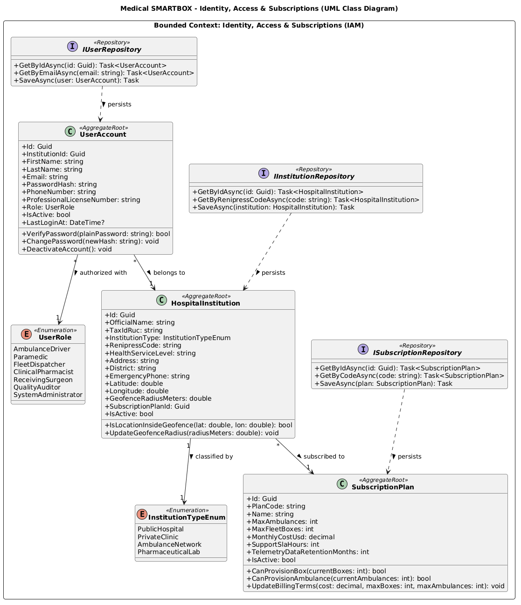

*Nota: Elaboración propia en PlantUML conforme a los estándares de UML 2.5 y Domain-Driven Design para el Bounded Context de IAM y Suscripciones.*

***

#### **4.2. Bounded Context: Smart Container & Telemetry Monitoring**

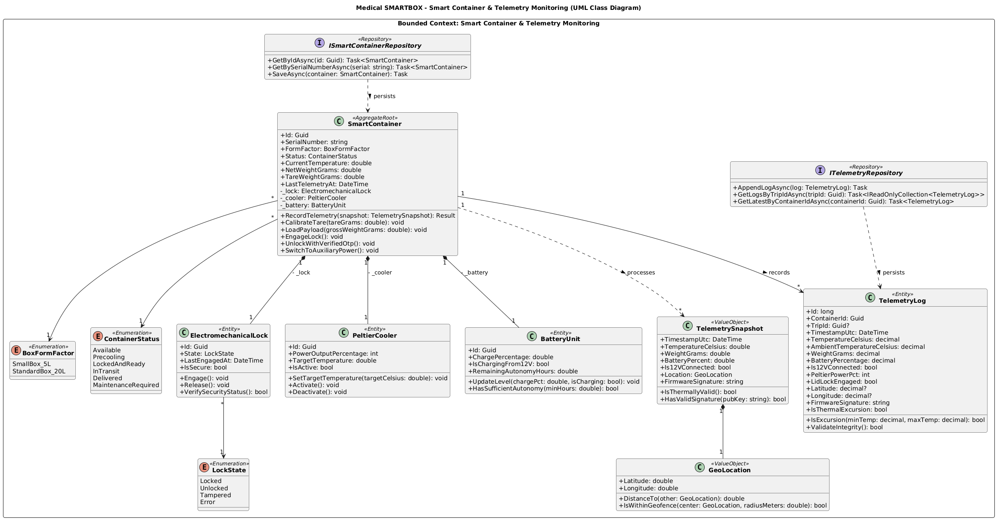

*Nota: Elaboración propia en PlantUML conforme a los estándares de UML 2.5 y Domain-Driven Design para el Bounded Context de Contenedores Inteligentes y Telemetría.*

***

#### **4.3. Bounded Context: Medical Transport Planning & Dispatching**

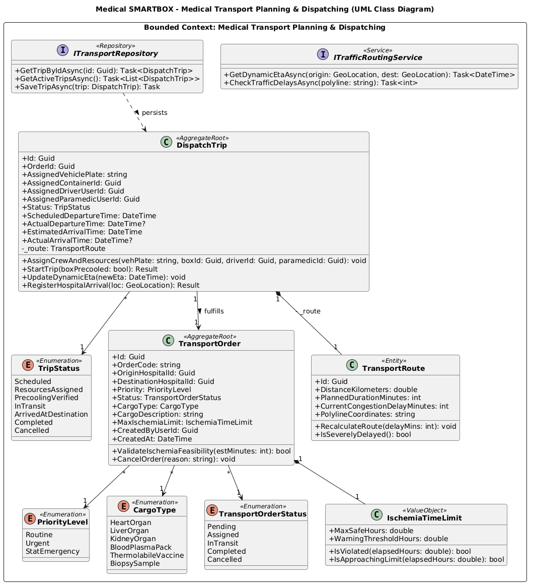

*Nota: Elaboración propia en PlantUML conforme a los estándares de UML 2.5 y Domain-Driven Design para el Bounded Context de Transporte y Despacho.*

***

#### **4.4. Bounded Context: Critical Alerting & Incident Response**

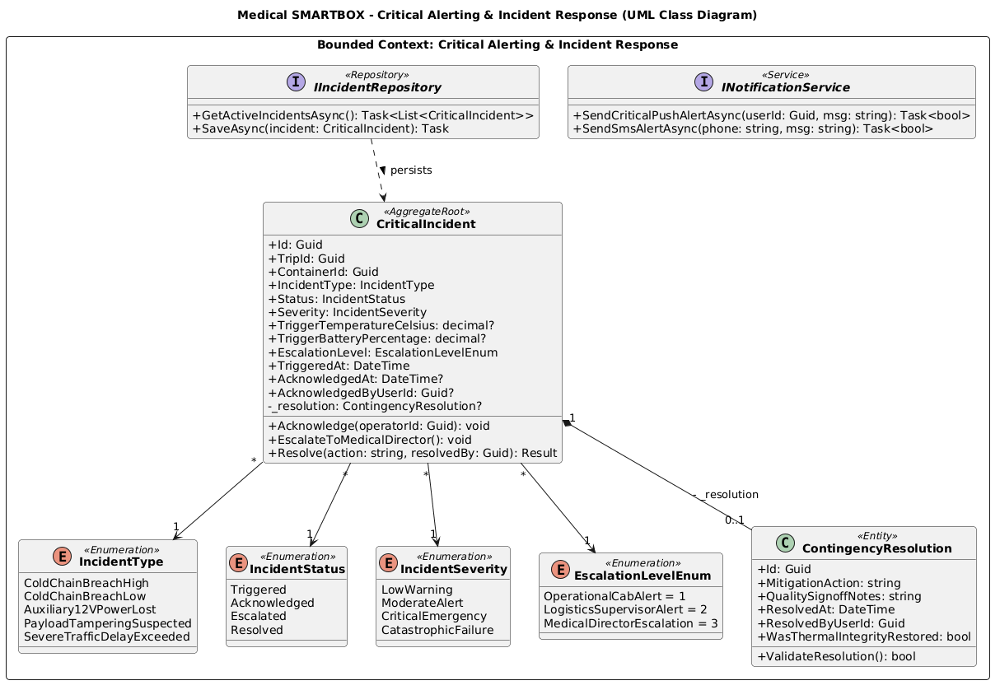

*Nota: Elaboración propia en PlantUML conforme a los estándares de UML 2.5 y Domain-Driven Design para el Bounded Context de Alertas Críticas e Incidentes.*

***

#### **4.5. Bounded Context: Chain of Custody & Traceability**

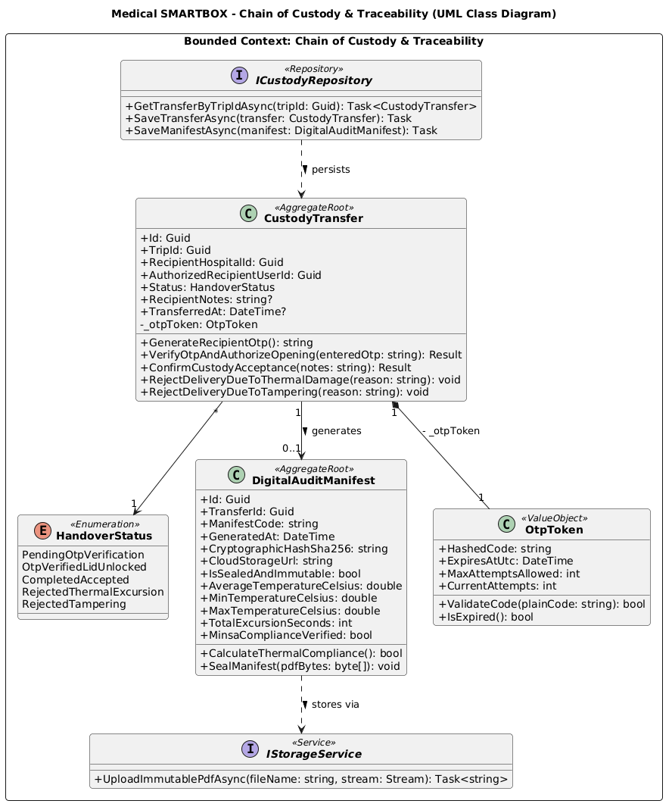

*Nota: Elaboración propia en PlantUML conforme a los estándares de UML 2.5 y Domain-Driven Design para el Bounded Context de Cadena de Custodia y Trazabilidad.*

<div style="page-break-after: always;"></div>

# **4.8. Database Design**

El diseño de la base de datos de **Medical SMARTBOX** establece la arquitectura de persistencia física que da soporte a los procesos transaccionales, telemétricos y de auditoría clínica de la plataforma. A diferencia del Diagrama de Clases de Software (Capítulo 4.7), cuyo foco es la encapsulación del comportamiento y la protección de invariantes en memoria mediante agregados de Domain-Driven Design (DDD), el modelo relacional se especializa en la integridad referencial estricta, la normalización formal, la indexación de alta velocidad para series temporales de IoT y la inmutabilidad jurídica de los registros de custodia requeridos por las entidades regulatorias peruanas (**DIGEMID** y **MINSA**).

La persistencia del sistema está gobernada por un enfoque **Code-First** a través de **Entity Framework Core 10.0 (.NET 10 LTS)** sobre el motor relacional **MySQL Server 8.0 (Enterprise / Community)** utilizando el motor de almacenamiento **InnoDB**. Siguiendo las convenciones oficiales de desarrollo para Microsoft .NET y ASP.NET Core Framework, la configuración de esquemas se desacopla mediante clases `IEntityTypeConfiguration<TEntity>` basadas en **Fluent API**, asegurando que el modelo de dominio permanezca limpio (*Persistence Ignorance*) mientras que la base de datos física explota al máximo las restricciones nativas del motor (`FOREIGN KEY`, `UNIQUE`, `CHECK`, `INDEX`).

### Decisiones Arquitectónicas de Persistencia Relacional:
1. **Motor de Almacenamiento y Conjunto de Caracteres:**  
   Se selecciona exclusivamente **InnoDB** por su soporte nativo de transacciones compatibles con **ACID**, bloqueo a nivel de fila (*row-level locking*) y soporte de claves foráneas con verificación en tiempo de ejecución. La base de datos opera bajo el conjunto de caracteres `utf8mb4` y la colación `utf8mb4_unicode_ci`, garantizando soporte pleno para caracteres especiales clínicos, acentos en español latinoamericano (`es_419`) y firmas criptográficas sin riesgo de truncamiento.
2. **Identificadores Universales Únicos (UUID / GUID):**  
   Para desacoplar la generación de identificadores entre los nodos de borde (ESP32 en ambulancias) y los microservicios sin colisiones ni consultas previas de secuencia, todas las entidades maestras y transaccionales utilizan identificadores únicos universales (`Guid` en C#) persistidos como columnas `CHAR(36)` con formato canónico de guiones (`8-4-4-4-12`). La única excepción son los registros de telemetría sensorial de alta frecuencia (`telemetry_logs`), donde se utiliza un identificador numérico secuencial `BIGINT UNSIGNED AUTO_INCREMENT` como clave primaria física para minimizar la fragmentación de índices B-Tree en inserciones continuas masivas.
3. **Estrategia de Aplanamiento de Value Objects (*Flattening*):**  
   Conforme a los patrones de diseño de arquitectura orientada al dominio formulados por Nick Tune, los *Value Objects* del dominio carecen de identidad propia y representan atributos compuestos inmutables. Para evitar la sobrecarga de uniones relacionales (*JOINs*) en consultas críticas, se aplica la técnica de *Value Object Flattening*:
   * El Value Object `IschemiaTimeLimit` se aplana en las columnas `max_ischemia_hours` e `ischemia_warning_hours` dentro de `transport_orders`.
   * El Value Object `OtpToken` se aplana en las columnas `otp_code_hash`, `otp_expires_at` y `otp_attempt_count` dentro de `custody_transfers`.
   * Las coordenadas geográficas de telemetría se aplanan en `latitude` y `longitude` en `telemetry_logs`.
4. **Marcas Temporales UTC con Precisión de Microsegundos:**  
   Dado que los contenedores inteligentes registran desviaciones térmicas en milisegundos y las ambulancias se desplazan rápidamente por arterias viales, todas las fechas y horas se registran en formato universal coordinado (`DateTime.UtcNow`) utilizando el tipo `DATETIME(6)`. Esto elimina ambigüedades por husos horarios y garantiza orden estricto en el procesamiento reactivo de eventos.
5. **Estrategia de Persistencia de Entidades Internas de Agregados (*Entity Flattening*):**  
   En el modelo orientado a objetos (Capítulo 4.7), la raíz de agregado `SmartContainer` encapsula entidades subordinadas como `ElectromechanicalLock` (cerrojo de seguridad) y `BatteryUnit` (unidad de alimentación LiFePO4), mientras que la raíz `DispatchTrip` encapsula la entidad de ruta `TransportRoute`. En la base de datos física relacional, para evitar la proliferación innecesaria de tablas satélite 1 a 1 y maximizar la eficiencia en consultas operativas sin sobrecarga de operaciones `JOIN`, estas entidades subordinadas se integran y aplanan directamente como columnas dentro de sus tablas principales:
   * En `smart_containers`: se persisten atómicamente `lock_state` (estado del cerrojo), `battery_percentage` (porcentaje de carga) e `is_12v_connected` (alimentación auxiliar 12V).
   * En `dispatch_trips`: se persisten directamente los atributos de ruta calculados `distance_km`, `planned_duration_minutes`, `current_delay_minutes` y `polyline_coordinates`.  
   Esta decisión garantiza un esquema de almacenamiento de alto rendimiento para las consultas operativas en ruta sin comprometer la encapsulación conceptual definida en el diseño orientado a objetos.
6. **Conversión de Tipos Numéricos entre Dominio y Persistencia (`double` a `DECIMAL`):**  
   En el modelo de clases de dominio (Capítulo 4.7), las lecturas sensoriales y telemétricas (temperatura, peso neto y coordenadas geográficas) se representan como tipos numéricos en coma flotante para optimizar el rendimiento computacional de cálculos en memoria y procesamiento de flujos IoT. En la persistencia física en MySQL, estos valores se almacenan rigurosamente como tipos de coma fija `DECIMAL(p, s)` (`DECIMAL(4,2)` para temperatura, `DECIMAL(6,2)` para peso en gramos y `DECIMAL(10,8)` / `DECIMAL(11,8)` para latitud/longitud), eliminando cualquier riesgo de discrepancia por redondeo o imprecisión binaria en los registros médicos.
7. **Delimitación de Flota Vehicular y Activos Externos (Segmento 1):**  
   En el modelo SaaS, las ambulancias constituyen activos vehiculares de transporte sanitario operados por terceros (Segmento 1) identificados por su número de placa (`assigned_vehicle_plate`) en las órdenes de despacho (`dispatch_trips`). El control de cuotas comerciales de suscripción (`max_ambulances` en `subscription_plans`) se valida a nivel de servicio contra las unidades móviles simultáneamente activas, preservando el foco del software exclusivamente en la gestión del contenedor médico inteligente y evitando la sobreingeniería de tablas maestras vehiculares internas.
8. **Invariantes Térmicas de Firmware y Control de Celda Peltier:**  
   La celda termoeléctrica Peltier opera bajo un punto de consigna (*setpoint*) fijo y normado (+4.0 °C) implementado como invariante de control en el firmware autónomo del ESP32. Su estado no demanda columnas de configuración mutable en la tabla de catálogo `smart_containers`, sino que su modulación dinámica de potencia se audita y persiste históricamente mediante la columna `peltier_power_pct` en la tabla de series temporales de alta frecuencia `telemetry_logs`.
9. **Correspondencia de Nomenclatura entre Dominio y Esquema Físico:**  
   Para preservar la pureza del modelo conceptual de dominio (Capítulo 4.7) formulado bajo el lenguaje ubicuo (*PascalCase*) y garantizar total coherencia con las convenciones relacionales del esquema físico en MySQL 8.0 (*snake_case*), se formaliza la siguiente matriz de correspondencia:
   * `SubscriptionPlan.PlanCode` → `code` (tabla `subscription_plans`).
   * `SubscriptionPlan.MaxFleetBoxes` → `max_smartboxes` (tabla `subscription_plans`).
   * `SubscriptionPlan.MonthlyCostUsd` → `monthly_price_usd` (tabla `subscription_plans`).
   * `HospitalInstitution.OfficialName` → `name` (tabla `hospital_institutions`).
   * `UserAccount.ProfessionalLicenseNumber` → `medical_license_number` (tabla `users`).
   * `TransportOrder.Priority` → `clinical_priority` (tabla `transport_orders`).
   * `CustodyTransfer.TransferredAt` → `completed_at` (tabla `custody_transfers`).
   * `DigitalAuditManifest.GeneratedAt` → `sealed_at` (tabla `digital_audit_manifests`).
   * `DigitalAuditManifest.CloudStorageUrl` → `cloud_storage_pdf_url` (tabla `digital_audit_manifests`).

***

### **4.8.1. Database Diagrams**

#### **1. Justificación de Normalización y Desnormalización Controlada**

El modelo de datos relacional de Medical SMARTBOX ha sido diseñado bajo una estricta disciplina de normalización matemática para erradicar redundancias y anomalías de actualización, incorporando desnormalización controlada únicamente en puntos donde la seguridad clínica y el rendimiento de consulta lo justifican plenamente:

* **Primera Forma Normal (1NF):**  
  Todas las columnas contienen exclusivamente valores atómicos e indivisibles. No existen grupos repetitivos ni atributos multivaluados; por ejemplo, las coordenadas poligonales de rutas se representan mediante colecciones ordenadas o columnas específicas de latitud/longitud decimal, y la tripulación de la ambulancia se descompone en roles foráneos atómicos (`assigned_driver_user_id` y `assigned_paramedic_user_id`).
* **Segunda Forma Normal (2NF):**  
  El modelo se encuentra en 1NF y cada atributo no primario posee una dependencia funcional completa de la clave primaria. En ninguna tabla existen dependencias parciales, puesto que todas las tablas maestras emplean identificadores subrogados únicos (`id`), garantizando que cada columna describa íntegramente a dicha entidad.
* **Tercera Forma Normal (3NF):**  
  El modelo se encuentra en 2NF y ningún atributo no clave depende transitivamente de otra columna no clave. Por ejemplo, los datos del hospital de origen y destino (RUC, dirección, acreditación) no se duplican dentro de `transport_orders`, sino que se relacionan mediante claves foráneas normalizadas (`origin_hospital_id`, `destination_hospital_id`) hacia `hospital_institutions`.
* **Desnormalización Controlada Justificada por Criterio Clínico:**  
  En la tabla `digital_audit_manifests` (Contexto de Cadena de Custodia), se almacenan de manera precalculada las métricas `average_temperature_celsius`, `min_temperature_celsius`, `max_temperature_celsius` y `total_excursion_seconds`.  
  *Justificación Técnica y Legal:* Un traslado en ambulancia puede generar miles de lecturas de telemetría en `telemetry_logs`. Si un auditor de calidad de DIGEMID o un cirujano de trasplantes requiere verificar el acta de entrega durante una auditoría o minutos antes de implantar un corazón, calcular agregaciones dinámicas (`AVG`, `MIN`, `MAX`) sobre millones de filas degradaría la base de datos y retardaría la respuesta médica. Además, el acta digital constituye un documento médico-legal sellado criptográficamente con hash SHA-256 (`cryptographic_hash_sha256`); desnormalizar estas métricas en el momento exacto del cierre de custodia garantiza que las cifras auditadas permanezcan inmutables en el tiempo, protegidas de cualquier alteración histórica o depuración de logs sensoriales antiguos.
* **Principio de Custodia Unívoca y Ausencia de Tablas N:M:**  
  A diferencia de aplicaciones comerciales genéricas, el modelo relacional descarta de forma deliberada el uso de tablas intermedias de descomposición muchos a muchos (N:M). Bajo la normativa de DIGEMID (R.M. N° 833-2015/MINSA) y DIGDOT (Directiva Sanitaria N° 152), el transporte asistencial de órganos, hemoderivados y vacunas críticas opera bajo el **Principio de Custodia Unívoca (1 Orden de Traslado → 1 Despacho → 1 Contenedor Inteligente → 1 Custodio Receptor Acreditado)**. Establecer asignaciones múltiples concurrentes (N:M) introduciría vacíos de trazabilidad médico-legal y riesgo inaceptable de contaminación cruzada o confusión de muestras biológicas, por lo que el esquema relacional refuerza estrictamente relaciones 1:1 y 1:N con integridad referencial restrictiva.

***

#### **2. Diccionario de Datos Exhaustivo por Bounded Context**

A continuación se detalla la especificación formal de las 11 tablas del sistema relacional agrupadas por sus Bounded Contexts, cubriendo de forma estricta las necesidades operativas del **Segmento 1 (Ambulancias y Logística)** y el **Segmento 2 (Hospitales y Laboratorios B2B)**:

***

##### **4.8.1.1. Bounded Context: IAM & Subscriptions (Soporte B2B y Acceso)**

Garantiza la autenticación, la asignación de roles médicos y la gestión de planes SaaS para clínicas y flotas de ambulancias.

###### **Tabla 1: `subscription_plans`**
Almacena los niveles de suscripción B2B que determinan la capacidad operativa de ambulancias y contenedores asignados a cada institución cliente.

<div style="margin: 10px 0 16px 0; width: 100%;">
<table border="1" cellpadding="3" cellspacing="0" style="border-collapse: collapse; width: 100%; table-layout: fixed; font-size: 6.8pt; line-height: 1.25; border: 1px solid #cbd5e1;">
<colgroup>
  <col style="width: 17%;" />
  <col style="width: 15%;" />
  <col style="width: 9%;" />
  <col style="width: 19%;" />
  <col style="width: 40%;" />
</colgroup>
<thead>
<tr style="background-color: #f1f5f9;">
  <th style="border: 1px solid #cbd5e1; padding: 4px; text-align: left; font-weight: bold;">Columna</th>
  <th style="border: 1px solid #cbd5e1; padding: 4px; text-align: left; font-weight: bold;">Tipo MySQL</th>
  <th style="border: 1px solid #cbd5e1; padding: 4px; text-align: center; font-weight: bold;">Nulo</th>
  <th style="border: 1px solid #cbd5e1; padding: 4px; text-align: left; font-weight: bold;">Restricciones</th>
  <th style="border: 1px solid #cbd5e1; padding: 4px; text-align: left; font-weight: bold;">Descripción y Regla de Negocio</th>
</tr>
</thead>
<tbody>
<tr>
  <td style="border: 1px solid #cbd5e1; padding: 3px 4px; vertical-align: top; font-weight: 600;"><code>id</code></td>
  <td style="border: 1px solid #cbd5e1; padding: 3px 4px; vertical-align: top;"><code>CHAR(36)</code></td>
  <td style="border: 1px solid #cbd5e1; padding: 3px 4px; vertical-align: top; text-align: center; background-color: #fef2f2; color: #dc2626; font-weight: bold;">NOT NULL</td>
  <td style="border: 1px solid #cbd5e1; padding: 3px 4px; vertical-align: top;"><code>PRIMARY KEY</code></td>
  <td style="border: 1px solid #cbd5e1; padding: 3px 4px; vertical-align: top;">Identificador único del plan en formato UUIDv4.</td>
</tr>
<tr>
  <td style="border: 1px solid #cbd5e1; padding: 3px 4px; vertical-align: top; font-weight: 600;"><code>name</code></td>
  <td style="border: 1px solid #cbd5e1; padding: 3px 4px; vertical-align: top;"><code>VARCHAR(50)</code></td>
  <td style="border: 1px solid #cbd5e1; padding: 3px 4px; vertical-align: top; text-align: center; background-color: #fef2f2; color: #dc2626; font-weight: bold;">NOT NULL</td>
  <td style="border: 1px solid #cbd5e1; padding: 3px 4px; vertical-align: top;"><code>—</code></td>
  <td style="border: 1px solid #cbd5e1; padding: 3px 4px; vertical-align: top;">Nombre comercial del plan (ej. *Plan Red Hospitalaria Integral*).</td>
</tr>
<tr>
  <td style="border: 1px solid #cbd5e1; padding: 3px 4px; vertical-align: top; font-weight: 600;"><code>code</code></td>
  <td style="border: 1px solid #cbd5e1; padding: 3px 4px; vertical-align: top;"><code>VARCHAR(20)</code></td>
  <td style="border: 1px solid #cbd5e1; padding: 3px 4px; vertical-align: top; text-align: center; background-color: #fef2f2; color: #dc2626; font-weight: bold;">NOT NULL</td>
  <td style="border: 1px solid #cbd5e1; padding: 3px 4px; vertical-align: top;"><code>UNIQUE</code></td>
  <td style="border: 1px solid #cbd5e1; padding: 3px 4px; vertical-align: top;">Código alfanumérico único para facturación (ej. `HOSP-ENTERPRISE-01`).</td>
</tr>
<tr>
  <td style="border: 1px solid #cbd5e1; padding: 3px 4px; vertical-align: top; font-weight: 600;"><code>max_ambulances</code></td>
  <td style="border: 1px solid #cbd5e1; padding: 3px 4px; vertical-align: top;"><code>INT</code></td>
  <td style="border: 1px solid #cbd5e1; padding: 3px 4px; vertical-align: top; text-align: center; background-color: #fef2f2; color: #dc2626; font-weight: bold;">NOT NULL</td>
  <td style="border: 1px solid #cbd5e1; padding: 3px 4px; vertical-align: top;"><code>DEFAULT 5, CHECK (> 0)</code></td>
  <td style="border: 1px solid #cbd5e1; padding: 3px 4px; vertical-align: top;">Límite máximo de ambulancias autorizadas para operar en la red.</td>
</tr>
<tr>
  <td style="border: 1px solid #cbd5e1; padding: 3px 4px; vertical-align: top; font-weight: 600;"><code>max_smartboxes</code></td>
  <td style="border: 1px solid #cbd5e1; padding: 3px 4px; vertical-align: top;"><code>INT</code></td>
  <td style="border: 1px solid #cbd5e1; padding: 3px 4px; vertical-align: top; text-align: center; background-color: #fef2f2; color: #dc2626; font-weight: bold;">NOT NULL</td>
  <td style="border: 1px solid #cbd5e1; padding: 3px 4px; vertical-align: top;"><code>DEFAULT 10, CHECK (> 0)</code></td>
  <td style="border: 1px solid #cbd5e1; padding: 3px 4px; vertical-align: top;">Cupo de contenedores inteligentes IoT asignados a la flota.</td>
</tr>
<tr>
  <td style="border: 1px solid #cbd5e1; padding: 3px 4px; vertical-align: top; font-weight: 600;"><code>monthly_price_usd</code></td>
  <td style="border: 1px solid #cbd5e1; padding: 3px 4px; vertical-align: top;"><code>DECIMAL(10, 2)</code></td>
  <td style="border: 1px solid #cbd5e1; padding: 3px 4px; vertical-align: top; text-align: center; background-color: #fef2f2; color: #dc2626; font-weight: bold;">NOT NULL</td>
  <td style="border: 1px solid #cbd5e1; padding: 3px 4px; vertical-align: top;"><code>DEFAULT 0.00, CHECK (>= 0)</code></td>
  <td style="border: 1px solid #cbd5e1; padding: 3px 4px; vertical-align: top;">Tarifa mensual en dólares americanos cobrada a la institución.</td>
</tr>
<tr>
  <td style="border: 1px solid #cbd5e1; padding: 3px 4px; vertical-align: top; font-weight: 600;"><code>support_sla_hours</code></td>
  <td style="border: 1px solid #cbd5e1; padding: 3px 4px; vertical-align: top;"><code>INT</code></td>
  <td style="border: 1px solid #cbd5e1; padding: 3px 4px; vertical-align: top; text-align: center; background-color: #fef2f2; color: #dc2626; font-weight: bold;">NOT NULL</td>
  <td style="border: 1px solid #cbd5e1; padding: 3px 4px; vertical-align: top;"><code>DEFAULT 24</code></td>
  <td style="border: 1px solid #cbd5e1; padding: 3px 4px; vertical-align: top;">Tiempo máximo garantizado de respuesta técnica para incidentes.</td>
</tr>
<tr>
  <td style="border: 1px solid #cbd5e1; padding: 3px 4px; vertical-align: top; font-weight: 600;"><code>telemetry_data_retention_months</code></td>
  <td style="border: 1px solid #cbd5e1; padding: 3px 4px; vertical-align: top;"><code>INT</code></td>
  <td style="border: 1px solid #cbd5e1; padding: 3px 4px; vertical-align: top; text-align: center; background-color: #fef2f2; color: #dc2626; font-weight: bold;">NOT NULL</td>
  <td style="border: 1px solid #cbd5e1; padding: 3px 4px; vertical-align: top;"><code>DEFAULT 12, CHECK (> 0)</code></td>
  <td style="border: 1px solid #cbd5e1; padding: 3px 4px; vertical-align: top;">Período de retención de telemetría histórica conforme a normativa DIGEMID.</td>
</tr>
<tr>
  <td style="border: 1px solid #cbd5e1; padding: 3px 4px; vertical-align: top; font-weight: 600;"><code>is_active</code></td>
  <td style="border: 1px solid #cbd5e1; padding: 3px 4px; vertical-align: top;"><code>TINYINT(1)</code></td>
  <td style="border: 1px solid #cbd5e1; padding: 3px 4px; vertical-align: top; text-align: center; background-color: #fef2f2; color: #dc2626; font-weight: bold;">NOT NULL</td>
  <td style="border: 1px solid #cbd5e1; padding: 3px 4px; vertical-align: top;"><code>DEFAULT 1</code></td>
  <td style="border: 1px solid #cbd5e1; padding: 3px 4px; vertical-align: top;">Indicador booleano de vigencia comercial del plan.</td>
</tr>
<tr>
  <td style="border: 1px solid #cbd5e1; padding: 3px 4px; vertical-align: top; font-weight: 600;"><code>created_at</code></td>
  <td style="border: 1px solid #cbd5e1; padding: 3px 4px; vertical-align: top;"><code>DATETIME(6)</code></td>
  <td style="border: 1px solid #cbd5e1; padding: 3px 4px; vertical-align: top; text-align: center; background-color: #fef2f2; color: #dc2626; font-weight: bold;">NOT NULL</td>
  <td style="border: 1px solid #cbd5e1; padding: 3px 4px; vertical-align: top;"><code>DEFAULT CURRENT_TIMESTAMP(6)</code></td>
  <td style="border: 1px solid #cbd5e1; padding: 3px 4px; vertical-align: top;">Fecha y hora UTC de registro del plan en la plataforma.</td>
</tr>
</tbody>
</table>
</div>

###### **Tabla 2: `hospital_institutions`**
Representa los centros de salud, redes hospitalarias, bancos de órganos y operadores logísticos (Segmento 2).

<div style="margin: 10px 0 16px 0; width: 100%;">
<table border="1" cellpadding="3" cellspacing="0" style="border-collapse: collapse; width: 100%; table-layout: fixed; font-size: 6.8pt; line-height: 1.25; border: 1px solid #cbd5e1;">
<colgroup>
  <col style="width: 17%;" />
  <col style="width: 15%;" />
  <col style="width: 9%;" />
  <col style="width: 19%;" />
  <col style="width: 40%;" />
</colgroup>
<thead>
<tr style="background-color: #f1f5f9;">
  <th style="border: 1px solid #cbd5e1; padding: 4px; text-align: left; font-weight: bold;">Columna</th>
  <th style="border: 1px solid #cbd5e1; padding: 4px; text-align: left; font-weight: bold;">Tipo MySQL</th>
  <th style="border: 1px solid #cbd5e1; padding: 4px; text-align: center; font-weight: bold;">Nulo</th>
  <th style="border: 1px solid #cbd5e1; padding: 4px; text-align: left; font-weight: bold;">Restricciones</th>
  <th style="border: 1px solid #cbd5e1; padding: 4px; text-align: left; font-weight: bold;">Descripción y Regla de Negocio</th>
</tr>
</thead>
<tbody>
<tr>
  <td style="border: 1px solid #cbd5e1; padding: 3px 4px; vertical-align: top; font-weight: 600;"><code>id</code></td>
  <td style="border: 1px solid #cbd5e1; padding: 3px 4px; vertical-align: top;"><code>CHAR(36)</code></td>
  <td style="border: 1px solid #cbd5e1; padding: 3px 4px; vertical-align: top; text-align: center; background-color: #fef2f2; color: #dc2626; font-weight: bold;">NOT NULL</td>
  <td style="border: 1px solid #cbd5e1; padding: 3px 4px; vertical-align: top;"><code>PRIMARY KEY</code></td>
  <td style="border: 1px solid #cbd5e1; padding: 3px 4px; vertical-align: top;">Identificador único de la institución de salud en formato UUIDv4.</td>
</tr>
<tr>
  <td style="border: 1px solid #cbd5e1; padding: 3px 4px; vertical-align: top; font-weight: 600;"><code>subscription_plan_id</code></td>
  <td style="border: 1px solid #cbd5e1; padding: 3px 4px; vertical-align: top;"><code>CHAR(36)</code></td>
  <td style="border: 1px solid #cbd5e1; padding: 3px 4px; vertical-align: top; text-align: center; background-color: #fef2f2; color: #dc2626; font-weight: bold;">NOT NULL</td>
  <td style="border: 1px solid #cbd5e1; padding: 3px 4px; vertical-align: top;"><code>FOREIGN KEY -> subscription_plans(id)</code></td>
  <td style="border: 1px solid #cbd5e1; padding: 3px 4px; vertical-align: top;">Plan de suscripción contratado por la entidad hospitalaria.</td>
</tr>
<tr>
  <td style="border: 1px solid #cbd5e1; padding: 3px 4px; vertical-align: top; font-weight: 600;"><code>name</code></td>
  <td style="border: 1px solid #cbd5e1; padding: 3px 4px; vertical-align: top;"><code>VARCHAR(150)</code></td>
  <td style="border: 1px solid #cbd5e1; padding: 3px 4px; vertical-align: top; text-align: center; background-color: #fef2f2; color: #dc2626; font-weight: bold;">NOT NULL</td>
  <td style="border: 1px solid #cbd5e1; padding: 3px 4px; vertical-align: top;"><code>—</code></td>
  <td style="border: 1px solid #cbd5e1; padding: 3px 4px; vertical-align: top;">Razón social o denominación del hospital/clínica (ej. *Hospital Rebagliati*).</td>
</tr>
<tr>
  <td style="border: 1px solid #cbd5e1; padding: 3px 4px; vertical-align: top; font-weight: 600;"><code>tax_id_ruc</code></td>
  <td style="border: 1px solid #cbd5e1; padding: 3px 4px; vertical-align: top;"><code>VARCHAR(11)</code></td>
  <td style="border: 1px solid #cbd5e1; padding: 3px 4px; vertical-align: top; text-align: center; background-color: #fef2f2; color: #dc2626; font-weight: bold;">NOT NULL</td>
  <td style="border: 1px solid #cbd5e1; padding: 3px 4px; vertical-align: top;"><code>UNIQUE</code></td>
  <td style="border: 1px solid #cbd5e1; padding: 3px 4px; vertical-align: top;">Registro Único de Contribuyentes (RUC) fiscal emitido por SUNAT.</td>
</tr>
<tr>
  <td style="border: 1px solid #cbd5e1; padding: 3px 4px; vertical-align: top; font-weight: 600;"><code>institution_type</code></td>
  <td style="border: 1px solid #cbd5e1; padding: 3px 4px; vertical-align: top;"><code>ENUM(...)</code></td>
  <td style="border: 1px solid #cbd5e1; padding: 3px 4px; vertical-align: top; text-align: center; background-color: #fef2f2; color: #dc2626; font-weight: bold;">NOT NULL</td>
  <td style="border: 1px solid #cbd5e1; padding: 3px 4px; vertical-align: top;"><code>DEFAULT 'PublicHospital'</code></td>
  <td style="border: 1px solid #cbd5e1; padding: 3px 4px; vertical-align: top;">Tipo: `PublicHospital`, `PrivateClinic`, `AmbulanceNetwork`, `PharmaceuticalLab`.</td>
</tr>
<tr>
  <td style="border: 1px solid #cbd5e1; padding: 3px 4px; vertical-align: top; font-weight: 600;"><code>health_service_level</code></td>
  <td style="border: 1px solid #cbd5e1; padding: 3px 4px; vertical-align: top;"><code>VARCHAR(20)</code></td>
  <td style="border: 1px solid #cbd5e1; padding: 3px 4px; vertical-align: top; text-align: center; background-color: #fef2f2; color: #dc2626; font-weight: bold;">NOT NULL</td>
  <td style="border: 1px solid #cbd5e1; padding: 3px 4px; vertical-align: top;"><code>DEFAULT 'II-2'</code></td>
  <td style="border: 1px solid #cbd5e1; padding: 3px 4px; vertical-align: top;">Nivel o categoría de atención asistencial MINSA (I-4, II-2, III-1, III-E).</td>
</tr>
<tr>
  <td style="border: 1px solid #cbd5e1; padding: 3px 4px; vertical-align: top; font-weight: 600;"><code>address</code></td>
  <td style="border: 1px solid #cbd5e1; padding: 3px 4px; vertical-align: top;"><code>VARCHAR(255)</code></td>
  <td style="border: 1px solid #cbd5e1; padding: 3px 4px; vertical-align: top; text-align: center; background-color: #fef2f2; color: #dc2626; font-weight: bold;">NOT NULL</td>
  <td style="border: 1px solid #cbd5e1; padding: 3px 4px; vertical-align: top;"><code>—</code></td>
  <td style="border: 1px solid #cbd5e1; padding: 3px 4px; vertical-align: top;">Dirección física donde operan los puntos de despacho o quirófanos.</td>
</tr>
<tr>
  <td style="border: 1px solid #cbd5e1; padding: 3px 4px; vertical-align: top; font-weight: 600;"><code>district</code></td>
  <td style="border: 1px solid #cbd5e1; padding: 3px 4px; vertical-align: top;"><code>VARCHAR(100)</code></td>
  <td style="border: 1px solid #cbd5e1; padding: 3px 4px; vertical-align: top; text-align: center; background-color: #fef2f2; color: #dc2626; font-weight: bold;">NOT NULL</td>
  <td style="border: 1px solid #cbd5e1; padding: 3px 4px; vertical-align: top;"><code>—</code></td>
  <td style="border: 1px solid #cbd5e1; padding: 3px 4px; vertical-align: top;">Distrito de Lima Metropolitana o región sanitaria de ubicación.</td>
</tr>
<tr>
  <td style="border: 1px solid #cbd5e1; padding: 3px 4px; vertical-align: top; font-weight: 600;"><code>emergency_phone</code></td>
  <td style="border: 1px solid #cbd5e1; padding: 3px 4px; vertical-align: top;"><code>VARCHAR(20)</code></td>
  <td style="border: 1px solid #cbd5e1; padding: 3px 4px; vertical-align: top; text-align: center; background-color: #fef2f2; color: #dc2626; font-weight: bold;">NOT NULL</td>
  <td style="border: 1px solid #cbd5e1; padding: 3px 4px; vertical-align: top;"><code>—</code></td>
  <td style="border: 1px solid #cbd5e1; padding: 3px 4px; vertical-align: top;">Teléfono de contacto de la central de emergencias hospitalarias.</td>
</tr>
<tr>
  <td style="border: 1px solid #cbd5e1; padding: 3px 4px; vertical-align: top; font-weight: 600;"><code>renipress_code</code></td>
  <td style="border: 1px solid #cbd5e1; padding: 3px 4px; vertical-align: top;"><code>VARCHAR(20)</code></td>
  <td style="border: 1px solid #cbd5e1; padding: 3px 4px; vertical-align: top; text-align: center; background-color: #fef2f2; color: #dc2626; font-weight: bold;">NOT NULL</td>
  <td style="border: 1px solid #cbd5e1; padding: 3px 4px; vertical-align: top;"><code>UNIQUE</code></td>
  <td style="border: 1px solid #cbd5e1; padding: 3px 4px; vertical-align: top;">Código único nacional del Registro Nacional de IPRESS (SUSALUD / MINSA).</td>
</tr>
<tr>
  <td style="border: 1px solid #cbd5e1; padding: 3px 4px; vertical-align: top; font-weight: 600;"><code>latitude</code></td>
  <td style="border: 1px solid #cbd5e1; padding: 3px 4px; vertical-align: top;"><code>DECIMAL(10, 8)</code></td>
  <td style="border: 1px solid #cbd5e1; padding: 3px 4px; vertical-align: top; text-align: center; background-color: #fef2f2; color: #dc2626; font-weight: bold;">NOT NULL</td>
  <td style="border: 1px solid #cbd5e1; padding: 3px 4px; vertical-align: top;"><code>CHECK (BETWEEN -90 AND 90)</code></td>
  <td style="border: 1px solid #cbd5e1; padding: 3px 4px; vertical-align: top;">Coordenada geográfica de latitud del helipuerto o rampa de urgencia.</td>
</tr>
<tr>
  <td style="border: 1px solid #cbd5e1; padding: 3px 4px; vertical-align: top; font-weight: 600;"><code>longitude</code></td>
  <td style="border: 1px solid #cbd5e1; padding: 3px 4px; vertical-align: top;"><code>DECIMAL(11, 8)</code></td>
  <td style="border: 1px solid #cbd5e1; padding: 3px 4px; vertical-align: top; text-align: center; background-color: #fef2f2; color: #dc2626; font-weight: bold;">NOT NULL</td>
  <td style="border: 1px solid #cbd5e1; padding: 3px 4px; vertical-align: top;"><code>CHECK (BETWEEN -180 AND 180)</code></td>
  <td style="border: 1px solid #cbd5e1; padding: 3px 4px; vertical-align: top;">Coordenada geográfica de longitud de la sede hospitalaria.</td>
</tr>
<tr>
  <td style="border: 1px solid #cbd5e1; padding: 3px 4px; vertical-align: top; font-weight: 600;"><code>geofence_radius_meters</code></td>
  <td style="border: 1px solid #cbd5e1; padding: 3px 4px; vertical-align: top;"><code>DECIMAL(6, 2)</code></td>
  <td style="border: 1px solid #cbd5e1; padding: 3px 4px; vertical-align: top; text-align: center; background-color: #fef2f2; color: #dc2626; font-weight: bold;">NOT NULL</td>
  <td style="border: 1px solid #cbd5e1; padding: 3px 4px; vertical-align: top;"><code>DEFAULT 2000.00, CHECK (> 0)</code></td>
  <td style="border: 1px solid #cbd5e1; padding: 3px 4px; vertical-align: top;">Radio perimétrico virtual (ej. 2 km) que dispara el preaviso y habilita OTP.</td>
</tr>
<tr>
  <td style="border: 1px solid #cbd5e1; padding: 3px 4px; vertical-align: top; font-weight: 600;"><code>is_active</code></td>
  <td style="border: 1px solid #cbd5e1; padding: 3px 4px; vertical-align: top;"><code>TINYINT(1)</code></td>
  <td style="border: 1px solid #cbd5e1; padding: 3px 4px; vertical-align: top; text-align: center; background-color: #fef2f2; color: #dc2626; font-weight: bold;">NOT NULL</td>
  <td style="border: 1px solid #cbd5e1; padding: 3px 4px; vertical-align: top;"><code>DEFAULT 1</code></td>
  <td style="border: 1px solid #cbd5e1; padding: 3px 4px; vertical-align: top;">Estado de habilitación operativa para programar traslados.</td>
</tr>
<tr>
  <td style="border: 1px solid #cbd5e1; padding: 3px 4px; vertical-align: top; font-weight: 600;"><code>created_at</code></td>
  <td style="border: 1px solid #cbd5e1; padding: 3px 4px; vertical-align: top;"><code>DATETIME(6)</code></td>
  <td style="border: 1px solid #cbd5e1; padding: 3px 4px; vertical-align: top; text-align: center; background-color: #fef2f2; color: #dc2626; font-weight: bold;">NOT NULL</td>
  <td style="border: 1px solid #cbd5e1; padding: 3px 4px; vertical-align: top;"><code>DEFAULT CURRENT_TIMESTAMP(6)</code></td>
  <td style="border: 1px solid #cbd5e1; padding: 3px 4px; vertical-align: top;">Fecha y hora UTC de alta en el sistema.</td>
</tr>
<tr>
  <td style="border: 1px solid #cbd5e1; padding: 3px 4px; vertical-align: top; font-weight: 600;"><code>updated_at</code></td>
  <td style="border: 1px solid #cbd5e1; padding: 3px 4px; vertical-align: top;"><code>DATETIME(6)</code></td>
  <td style="border: 1px solid #cbd5e1; padding: 3px 4px; vertical-align: top; text-align: center; background-color: #fef2f2; color: #dc2626; font-weight: bold;">NOT NULL</td>
  <td style="border: 1px solid #cbd5e1; padding: 3px 4px; vertical-align: top;"><code>DEFAULT CURRENT_TIMESTAMP(6)</code></td>
  <td style="border: 1px solid #cbd5e1; padding: 3px 4px; vertical-align: top;">Marca temporal UTC de la última actualización de datos institucionales.</td>
</tr>
</tbody>
</table>
</div>

###### **Tabla 3: `users`**
Gestiona las credenciales y perfiles profesionales autorizados en ambos segmentos.

<div style="margin: 10px 0 16px 0; width: 100%;">
<table border="1" cellpadding="3" cellspacing="0" style="border-collapse: collapse; width: 100%; table-layout: fixed; font-size: 6.8pt; line-height: 1.25; border: 1px solid #cbd5e1;">
<colgroup>
  <col style="width: 17%;" />
  <col style="width: 15%;" />
  <col style="width: 9%;" />
  <col style="width: 19%;" />
  <col style="width: 40%;" />
</colgroup>
<thead>
<tr style="background-color: #f1f5f9;">
  <th style="border: 1px solid #cbd5e1; padding: 4px; text-align: left; font-weight: bold;">Columna</th>
  <th style="border: 1px solid #cbd5e1; padding: 4px; text-align: left; font-weight: bold;">Tipo MySQL</th>
  <th style="border: 1px solid #cbd5e1; padding: 4px; text-align: center; font-weight: bold;">Nulo</th>
  <th style="border: 1px solid #cbd5e1; padding: 4px; text-align: left; font-weight: bold;">Restricciones</th>
  <th style="border: 1px solid #cbd5e1; padding: 4px; text-align: left; font-weight: bold;">Descripción y Regla de Negocio</th>
</tr>
</thead>
<tbody>
<tr>
  <td style="border: 1px solid #cbd5e1; padding: 3px 4px; vertical-align: top; font-weight: 600;"><code>id</code></td>
  <td style="border: 1px solid #cbd5e1; padding: 3px 4px; vertical-align: top;"><code>CHAR(36)</code></td>
  <td style="border: 1px solid #cbd5e1; padding: 3px 4px; vertical-align: top; text-align: center; background-color: #fef2f2; color: #dc2626; font-weight: bold;">NOT NULL</td>
  <td style="border: 1px solid #cbd5e1; padding: 3px 4px; vertical-align: top;"><code>PRIMARY KEY</code></td>
  <td style="border: 1px solid #cbd5e1; padding: 3px 4px; vertical-align: top;">Identificador universal del usuario en la plataforma.</td>
</tr>
<tr>
  <td style="border: 1px solid #cbd5e1; padding: 3px 4px; vertical-align: top; font-weight: 600;"><code>institution_id</code></td>
  <td style="border: 1px solid #cbd5e1; padding: 3px 4px; vertical-align: top;"><code>CHAR(36)</code></td>
  <td style="border: 1px solid #cbd5e1; padding: 3px 4px; vertical-align: top; text-align: center; background-color: #fef2f2; color: #dc2626; font-weight: bold;">NOT NULL</td>
  <td style="border: 1px solid #cbd5e1; padding: 3px 4px; vertical-align: top;"><code>FOREIGN KEY -> hospital_institutions(id)</code></td>
  <td style="border: 1px solid #cbd5e1; padding: 3px 4px; vertical-align: top;">Entidad sanitaria a la cual pertenece laboralmente el usuario.</td>
</tr>
<tr>
  <td style="border: 1px solid #cbd5e1; padding: 3px 4px; vertical-align: top; font-weight: 600;"><code>first_name</code></td>
  <td style="border: 1px solid #cbd5e1; padding: 3px 4px; vertical-align: top;"><code>VARCHAR(80)</code></td>
  <td style="border: 1px solid #cbd5e1; padding: 3px 4px; vertical-align: top; text-align: center; background-color: #fef2f2; color: #dc2626; font-weight: bold;">NOT NULL</td>
  <td style="border: 1px solid #cbd5e1; padding: 3px 4px; vertical-align: top;"><code>—</code></td>
  <td style="border: 1px solid #cbd5e1; padding: 3px 4px; vertical-align: top;">Nombres del usuario.</td>
</tr>
<tr>
  <td style="border: 1px solid #cbd5e1; padding: 3px 4px; vertical-align: top; font-weight: 600;"><code>last_name</code></td>
  <td style="border: 1px solid #cbd5e1; padding: 3px 4px; vertical-align: top;"><code>VARCHAR(80)</code></td>
  <td style="border: 1px solid #cbd5e1; padding: 3px 4px; vertical-align: top; text-align: center; background-color: #fef2f2; color: #dc2626; font-weight: bold;">NOT NULL</td>
  <td style="border: 1px solid #cbd5e1; padding: 3px 4px; vertical-align: top;"><code>—</code></td>
  <td style="border: 1px solid #cbd5e1; padding: 3px 4px; vertical-align: top;">Apellidos completos.</td>
</tr>
<tr>
  <td style="border: 1px solid #cbd5e1; padding: 3px 4px; vertical-align: top; font-weight: 600;"><code>email</code></td>
  <td style="border: 1px solid #cbd5e1; padding: 3px 4px; vertical-align: top;"><code>VARCHAR(120)</code></td>
  <td style="border: 1px solid #cbd5e1; padding: 3px 4px; vertical-align: top; text-align: center; background-color: #fef2f2; color: #dc2626; font-weight: bold;">NOT NULL</td>
  <td style="border: 1px solid #cbd5e1; padding: 3px 4px; vertical-align: top;"><code>UNIQUE</code></td>
  <td style="border: 1px solid #cbd5e1; padding: 3px 4px; vertical-align: top;">Correo electrónico corporativo utilizado para autenticación JWT.</td>
</tr>
<tr>
  <td style="border: 1px solid #cbd5e1; padding: 3px 4px; vertical-align: top; font-weight: 600;"><code>password_hash</code></td>
  <td style="border: 1px solid #cbd5e1; padding: 3px 4px; vertical-align: top;"><code>VARCHAR(255)</code></td>
  <td style="border: 1px solid #cbd5e1; padding: 3px 4px; vertical-align: top; text-align: center; background-color: #fef2f2; color: #dc2626; font-weight: bold;">NOT NULL</td>
  <td style="border: 1px solid #cbd5e1; padding: 3px 4px; vertical-align: top;"><code>—</code></td>
  <td style="border: 1px solid #cbd5e1; padding: 3px 4px; vertical-align: top;">Contraseña protegida mediante algoritmo de hashing irreversible (BCrypt).</td>
</tr>
<tr>
  <td style="border: 1px solid #cbd5e1; padding: 3px 4px; vertical-align: top; font-weight: 600;"><code>role</code></td>
  <td style="border: 1px solid #cbd5e1; padding: 3px 4px; vertical-align: top;"><code>ENUM(...)</code></td>
  <td style="border: 1px solid #cbd5e1; padding: 3px 4px; vertical-align: top; text-align: center; background-color: #fef2f2; color: #dc2626; font-weight: bold;">NOT NULL</td>
  <td style="border: 1px solid #cbd5e1; padding: 3px 4px; vertical-align: top;"><code>—</code></td>
  <td style="border: 1px solid #cbd5e1; padding: 3px 4px; vertical-align: top;">Rol: `FleetDispatcher`, `AmbulanceDriver`, `Paramedic`, `ClinicalPharmacist`, `ReceivingSurgeon`, `QualityAuditor`, `SystemAdministrator`.</td>
</tr>
<tr>
  <td style="border: 1px solid #cbd5e1; padding: 3px 4px; vertical-align: top; font-weight: 600;"><code>phone_number</code></td>
  <td style="border: 1px solid #cbd5e1; padding: 3px 4px; vertical-align: top;"><code>VARCHAR(20)</code></td>
  <td style="border: 1px solid #cbd5e1; padding: 3px 4px; vertical-align: top; text-align: center; background-color: #fef2f2; color: #dc2626; font-weight: bold;">NOT NULL</td>
  <td style="border: 1px solid #cbd5e1; padding: 3px 4px; vertical-align: top;"><code>—</code></td>
  <td style="border: 1px solid #cbd5e1; padding: 3px 4px; vertical-align: top;">Número móvil para recepción de alertas SMS de contingencia vía Twilio.</td>
</tr>
<tr>
  <td style="border: 1px solid #cbd5e1; padding: 3px 4px; vertical-align: top; font-weight: 600;"><code>medical_license_number</code></td>
  <td style="border: 1px solid #cbd5e1; padding: 3px 4px; vertical-align: top;"><code>VARCHAR(30)</code></td>
  <td style="border: 1px solid #cbd5e1; padding: 3px 4px; vertical-align: top; text-align: center; background-color: #f8fafc; color: #475569; font-weight: bold;">NULL</td>
  <td style="border: 1px solid #cbd5e1; padding: 3px 4px; vertical-align: top;"><code>—</code></td>
  <td style="border: 1px solid #cbd5e1; padding: 3px 4px; vertical-align: top;">Matrícula profesional (CMP para cirujanos, TEM para paramédicos).</td>
</tr>
<tr>
  <td style="border: 1px solid #cbd5e1; padding: 3px 4px; vertical-align: top; font-weight: 600;"><code>is_active</code></td>
  <td style="border: 1px solid #cbd5e1; padding: 3px 4px; vertical-align: top;"><code>TINYINT(1)</code></td>
  <td style="border: 1px solid #cbd5e1; padding: 3px 4px; vertical-align: top; text-align: center; background-color: #fef2f2; color: #dc2626; font-weight: bold;">NOT NULL</td>
  <td style="border: 1px solid #cbd5e1; padding: 3px 4px; vertical-align: top;"><code>DEFAULT 1</code></td>
  <td style="border: 1px solid #cbd5e1; padding: 3px 4px; vertical-align: top;">Indicador de cuenta activa y habilitada para iniciar sesión.</td>
</tr>
<tr>
  <td style="border: 1px solid #cbd5e1; padding: 3px 4px; vertical-align: top; font-weight: 600;"><code>last_login_at</code></td>
  <td style="border: 1px solid #cbd5e1; padding: 3px 4px; vertical-align: top;"><code>DATETIME(6)</code></td>
  <td style="border: 1px solid #cbd5e1; padding: 3px 4px; vertical-align: top; text-align: center; background-color: #f8fafc; color: #475569; font-weight: bold;">NULL</td>
  <td style="border: 1px solid #cbd5e1; padding: 3px 4px; vertical-align: top;"><code>—</code></td>
  <td style="border: 1px solid #cbd5e1; padding: 3px 4px; vertical-align: top;">Marca temporal UTC del último inicio de sesión autenticado.</td>
</tr>
<tr>
  <td style="border: 1px solid #cbd5e1; padding: 3px 4px; vertical-align: top; font-weight: 600;"><code>created_at</code></td>
  <td style="border: 1px solid #cbd5e1; padding: 3px 4px; vertical-align: top;"><code>DATETIME(6)</code></td>
  <td style="border: 1px solid #cbd5e1; padding: 3px 4px; vertical-align: top; text-align: center; background-color: #fef2f2; color: #dc2626; font-weight: bold;">NOT NULL</td>
  <td style="border: 1px solid #cbd5e1; padding: 3px 4px; vertical-align: top;"><code>DEFAULT CURRENT_TIMESTAMP(6)</code></td>
  <td style="border: 1px solid #cbd5e1; padding: 3px 4px; vertical-align: top;">Registro inicial de la cuenta de usuario.</td>
</tr>
<tr>
  <td style="border: 1px solid #cbd5e1; padding: 3px 4px; vertical-align: top; font-weight: 600;"><code>updated_at</code></td>
  <td style="border: 1px solid #cbd5e1; padding: 3px 4px; vertical-align: top;"><code>DATETIME(6)</code></td>
  <td style="border: 1px solid #cbd5e1; padding: 3px 4px; vertical-align: top; text-align: center; background-color: #fef2f2; color: #dc2626; font-weight: bold;">NOT NULL</td>
  <td style="border: 1px solid #cbd5e1; padding: 3px 4px; vertical-align: top;"><code>DEFAULT CURRENT_TIMESTAMP(6)</code></td>
  <td style="border: 1px solid #cbd5e1; padding: 3px 4px; vertical-align: top;">Timestamp de modificación de credenciales o perfil.</td>
</tr>
</tbody>
</table>
</div>

***

##### **4.8.1.2. Bounded Context: Smart Container & Telemetry Monitoring (Core IoT)**

Modela el contenedor físico inteligente, su estado electromecánico y el flujo continuo de lecturas sensoriales emitidas desde la ambulancia.

###### **Tabla 4: `smart_containers`**
Representa la unidad isotérmica física dotada de sensores, solenoide de tapa y refrigeración activa Peltier.

<div style="margin: 10px 0 16px 0; width: 100%;">
<table border="1" cellpadding="3" cellspacing="0" style="border-collapse: collapse; width: 100%; table-layout: fixed; font-size: 6.8pt; line-height: 1.25; border: 1px solid #cbd5e1;">
<colgroup>
  <col style="width: 17%;" />
  <col style="width: 15%;" />
  <col style="width: 9%;" />
  <col style="width: 19%;" />
  <col style="width: 40%;" />
</colgroup>
<thead>
<tr style="background-color: #f1f5f9;">
  <th style="border: 1px solid #cbd5e1; padding: 4px; text-align: left; font-weight: bold;">Columna</th>
  <th style="border: 1px solid #cbd5e1; padding: 4px; text-align: left; font-weight: bold;">Tipo MySQL</th>
  <th style="border: 1px solid #cbd5e1; padding: 4px; text-align: center; font-weight: bold;">Nulo</th>
  <th style="border: 1px solid #cbd5e1; padding: 4px; text-align: left; font-weight: bold;">Restricciones</th>
  <th style="border: 1px solid #cbd5e1; padding: 4px; text-align: left; font-weight: bold;">Descripción y Regla de Negocio</th>
</tr>
</thead>
<tbody>
<tr>
  <td style="border: 1px solid #cbd5e1; padding: 3px 4px; vertical-align: top; font-weight: 600;"><code>id</code></td>
  <td style="border: 1px solid #cbd5e1; padding: 3px 4px; vertical-align: top;"><code>CHAR(36)</code></td>
  <td style="border: 1px solid #cbd5e1; padding: 3px 4px; vertical-align: top; text-align: center; background-color: #fef2f2; color: #dc2626; font-weight: bold;">NOT NULL</td>
  <td style="border: 1px solid #cbd5e1; padding: 3px 4px; vertical-align: top;"><code>PRIMARY KEY</code></td>
  <td style="border: 1px solid #cbd5e1; padding: 3px 4px; vertical-align: top;">Identificador único del contenedor inteligente.</td>
</tr>
<tr>
  <td style="border: 1px solid #cbd5e1; padding: 3px 4px; vertical-align: top; font-weight: 600;"><code>serial_number</code></td>
  <td style="border: 1px solid #cbd5e1; padding: 3px 4px; vertical-align: top;"><code>VARCHAR(30)</code></td>
  <td style="border: 1px solid #cbd5e1; padding: 3px 4px; vertical-align: top; text-align: center; background-color: #fef2f2; color: #dc2626; font-weight: bold;">NOT NULL</td>
  <td style="border: 1px solid #cbd5e1; padding: 3px 4px; vertical-align: top;"><code>UNIQUE</code></td>
  <td style="border: 1px solid #cbd5e1; padding: 3px 4px; vertical-align: top;">Número de serie impreso en chasis y quemado en firmware (ej. `SMB-BOX-2026-0042`).</td>
</tr>
<tr>
  <td style="border: 1px solid #cbd5e1; padding: 3px 4px; vertical-align: top; font-weight: 600;"><code>form_factor</code></td>
  <td style="border: 1px solid #cbd5e1; padding: 3px 4px; vertical-align: top;"><code>ENUM(...)</code></td>
  <td style="border: 1px solid #cbd5e1; padding: 3px 4px; vertical-align: top; text-align: center; background-color: #fef2f2; color: #dc2626; font-weight: bold;">NOT NULL</td>
  <td style="border: 1px solid #cbd5e1; padding: 3px 4px; vertical-align: top;"><code>DEFAULT 'StandardBox_20L'</code></td>
  <td style="border: 1px solid #cbd5e1; padding: 3px 4px; vertical-align: top;">Tamaño: `SmallBox_5L` (córneas, biopsias) o `StandardBox_20L` (corazones, riñones).</td>
</tr>
<tr>
  <td style="border: 1px solid #cbd5e1; padding: 3px 4px; vertical-align: top; font-weight: 600;"><code>status</code></td>
  <td style="border: 1px solid #cbd5e1; padding: 3px 4px; vertical-align: top;"><code>ENUM(...)</code></td>
  <td style="border: 1px solid #cbd5e1; padding: 3px 4px; vertical-align: top; text-align: center; background-color: #fef2f2; color: #dc2626; font-weight: bold;">NOT NULL</td>
  <td style="border: 1px solid #cbd5e1; padding: 3px 4px; vertical-align: top;"><code>DEFAULT 'Available'</code></td>
  <td style="border: 1px solid #cbd5e1; padding: 3px 4px; vertical-align: top;">Estado operativo: `Available`, `Precooling`, `LockedAndReady`, `InTransit`, `Delivered`, `MaintenanceRequired`.</td>
</tr>
<tr>
  <td style="border: 1px solid #cbd5e1; padding: 3px 4px; vertical-align: top; font-weight: 600;"><code>lock_state</code></td>
  <td style="border: 1px solid #cbd5e1; padding: 3px 4px; vertical-align: top;"><code>ENUM(...)</code></td>
  <td style="border: 1px solid #cbd5e1; padding: 3px 4px; vertical-align: top; text-align: center; background-color: #fef2f2; color: #dc2626; font-weight: bold;">NOT NULL</td>
  <td style="border: 1px solid #cbd5e1; padding: 3px 4px; vertical-align: top;"><code>DEFAULT 'Unlocked'</code></td>
  <td style="border: 1px solid #cbd5e1; padding: 3px 4px; vertical-align: top;">Posición del cerrojo electromecánico: `Locked`, `Unlocked`, `Tampered`, `Error`.</td>
</tr>
<tr>
  <td style="border: 1px solid #cbd5e1; padding: 3px 4px; vertical-align: top; font-weight: 600;"><code>current_temperature_celsius</code></td>
  <td style="border: 1px solid #cbd5e1; padding: 3px 4px; vertical-align: top;"><code>DECIMAL(4, 2)</code></td>
  <td style="border: 1px solid #cbd5e1; padding: 3px 4px; vertical-align: top; text-align: center; background-color: #fef2f2; color: #dc2626; font-weight: bold;">NOT NULL</td>
  <td style="border: 1px solid #cbd5e1; padding: 3px 4px; vertical-align: top;"><code>CHECK (-20.00 TO 60.00)</code></td>
  <td style="border: 1px solid #cbd5e1; padding: 3px 4px; vertical-align: top;">Última lectura de temperatura interna (°C). Rango seguro: +2.00 a +8.00 °C.</td>
</tr>
<tr>
  <td style="border: 1px solid #cbd5e1; padding: 3px 4px; vertical-align: top; font-weight: 600;"><code>tare_weight_grams</code></td>
  <td style="border: 1px solid #cbd5e1; padding: 3px 4px; vertical-align: top;"><code>DECIMAL(8, 2)</code></td>
  <td style="border: 1px solid #cbd5e1; padding: 3px 4px; vertical-align: top; text-align: center; background-color: #fef2f2; color: #dc2626; font-weight: bold;">NOT NULL</td>
  <td style="border: 1px solid #cbd5e1; padding: 3px 4px; vertical-align: top;"><code>DEFAULT 0.00, CHECK (>= 0)</code></td>
  <td style="border: 1px solid #cbd5e1; padding: 3px 4px; vertical-align: top;">Peso en vacío calibrado con celda de carga HX711 (tara en gramos).</td>
</tr>
<tr>
  <td style="border: 1px solid #cbd5e1; padding: 3px 4px; vertical-align: top; font-weight: 600;"><code>net_weight_grams</code></td>
  <td style="border: 1px solid #cbd5e1; padding: 3px 4px; vertical-align: top;"><code>DECIMAL(8, 2)</code></td>
  <td style="border: 1px solid #cbd5e1; padding: 3px 4px; vertical-align: top; text-align: center; background-color: #fef2f2; color: #dc2626; font-weight: bold;">NOT NULL</td>
  <td style="border: 1px solid #cbd5e1; padding: 3px 4px; vertical-align: top;"><code>DEFAULT 0.00, CHECK (>= 0)</code></td>
  <td style="border: 1px solid #cbd5e1; padding: 3px 4px; vertical-align: top;">Peso neto actual del paquete biológico o hemoderivado transportado.</td>
</tr>
<tr>
  <td style="border: 1px solid #cbd5e1; padding: 3px 4px; vertical-align: top; font-weight: 600;"><code>battery_percentage</code></td>
  <td style="border: 1px solid #cbd5e1; padding: 3px 4px; vertical-align: top;"><code>DECIMAL(5, 2)</code></td>
  <td style="border: 1px solid #cbd5e1; padding: 3px 4px; vertical-align: top; text-align: center; background-color: #fef2f2; color: #dc2626; font-weight: bold;">NOT NULL</td>
  <td style="border: 1px solid #cbd5e1; padding: 3px 4px; vertical-align: top;"><code>CHECK (0.00 TO 100.00)</code></td>
  <td style="border: 1px solid #cbd5e1; padding: 3px 4px; vertical-align: top;">Nivel remanente de la batería LiFePO4 interna del contenedor.</td>
</tr>
<tr>
  <td style="border: 1px solid #cbd5e1; padding: 3px 4px; vertical-align: top; font-weight: 600;"><code>is_12v_connected</code></td>
  <td style="border: 1px solid #cbd5e1; padding: 3px 4px; vertical-align: top;"><code>TINYINT(1)</code></td>
  <td style="border: 1px solid #cbd5e1; padding: 3px 4px; vertical-align: top; text-align: center; background-color: #fef2f2; color: #dc2626; font-weight: bold;">NOT NULL</td>
  <td style="border: 1px solid #cbd5e1; padding: 3px 4px; vertical-align: top;"><code>DEFAULT 0</code></td>
  <td style="border: 1px solid #cbd5e1; padding: 3px 4px; vertical-align: top;">Flag de alimentación auxiliar desde la toma de 12V vehicular de la ambulancia.</td>
</tr>
<tr>
  <td style="border: 1px solid #cbd5e1; padding: 3px 4px; vertical-align: top; font-weight: 600;"><code>last_telemetry_at</code></td>
  <td style="border: 1px solid #cbd5e1; padding: 3px 4px; vertical-align: top;"><code>DATETIME(6)</code></td>
  <td style="border: 1px solid #cbd5e1; padding: 3px 4px; vertical-align: top; text-align: center; background-color: #f8fafc; color: #475569; font-weight: bold;">NULL</td>
  <td style="border: 1px solid #cbd5e1; padding: 3px 4px; vertical-align: top;"><code>—</code></td>
  <td style="border: 1px solid #cbd5e1; padding: 3px 4px; vertical-align: top;">Marca de tiempo del último mensaje MQTT recibido desde el ESP32.</td>
</tr>
<tr>
  <td style="border: 1px solid #cbd5e1; padding: 3px 4px; vertical-align: top; font-weight: 600;"><code>created_at</code></td>
  <td style="border: 1px solid #cbd5e1; padding: 3px 4px; vertical-align: top;"><code>DATETIME(6)</code></td>
  <td style="border: 1px solid #cbd5e1; padding: 3px 4px; vertical-align: top; text-align: center; background-color: #fef2f2; color: #dc2626; font-weight: bold;">NOT NULL</td>
  <td style="border: 1px solid #cbd5e1; padding: 3px 4px; vertical-align: top;"><code>DEFAULT CURRENT_TIMESTAMP(6)</code></td>
  <td style="border: 1px solid #cbd5e1; padding: 3px 4px; vertical-align: top;">Fecha de fabricación o registro del contenedor en inventario.</td>
</tr>
<tr>
  <td style="border: 1px solid #cbd5e1; padding: 3px 4px; vertical-align: top; font-weight: 600;"><code>updated_at</code></td>
  <td style="border: 1px solid #cbd5e1; padding: 3px 4px; vertical-align: top;"><code>DATETIME(6)</code></td>
  <td style="border: 1px solid #cbd5e1; padding: 3px 4px; vertical-align: top; text-align: center; background-color: #fef2f2; color: #dc2626; font-weight: bold;">NOT NULL</td>
  <td style="border: 1px solid #cbd5e1; padding: 3px 4px; vertical-align: top;"><code>DEFAULT CURRENT_TIMESTAMP(6)</code></td>
  <td style="border: 1px solid #cbd5e1; padding: 3px 4px; vertical-align: top;">Timestamp de la última sincronización telemétrica o cambio de estado.</td>
</tr>
</tbody>
</table>
</div>

###### **Tabla 5: `telemetry_logs`**
Serie temporal de lecturas sensoriales emitidas en ráfagas cada 5 segundos durante el transporte de emergencia.

<div style="margin: 10px 0 16px 0; width: 100%;">
<table border="1" cellpadding="3" cellspacing="0" style="border-collapse: collapse; width: 100%; table-layout: fixed; font-size: 6.8pt; line-height: 1.25; border: 1px solid #cbd5e1;">
<colgroup>
  <col style="width: 17%;" />
  <col style="width: 15%;" />
  <col style="width: 9%;" />
  <col style="width: 19%;" />
  <col style="width: 40%;" />
</colgroup>
<thead>
<tr style="background-color: #f1f5f9;">
  <th style="border: 1px solid #cbd5e1; padding: 4px; text-align: left; font-weight: bold;">Columna</th>
  <th style="border: 1px solid #cbd5e1; padding: 4px; text-align: left; font-weight: bold;">Tipo MySQL</th>
  <th style="border: 1px solid #cbd5e1; padding: 4px; text-align: center; font-weight: bold;">Nulo</th>
  <th style="border: 1px solid #cbd5e1; padding: 4px; text-align: left; font-weight: bold;">Restricciones</th>
  <th style="border: 1px solid #cbd5e1; padding: 4px; text-align: left; font-weight: bold;">Descripción y Regla de Negocio</th>
</tr>
</thead>
<tbody>
<tr>
  <td style="border: 1px solid #cbd5e1; padding: 3px 4px; vertical-align: top; font-weight: 600;"><code>id</code></td>
  <td style="border: 1px solid #cbd5e1; padding: 3px 4px; vertical-align: top;"><code>BIGINT UNSIGNED</code></td>
  <td style="border: 1px solid #cbd5e1; padding: 3px 4px; vertical-align: top; text-align: center; background-color: #fef2f2; color: #dc2626; font-weight: bold;">NOT NULL</td>
  <td style="border: 1px solid #cbd5e1; padding: 3px 4px; vertical-align: top;"><code>PRIMARY KEY, AUTO_INCREMENT</code></td>
  <td style="border: 1px solid #cbd5e1; padding: 3px 4px; vertical-align: top;">Identificador numérico monótono para optimización de inserciones continuas.</td>
</tr>
<tr>
  <td style="border: 1px solid #cbd5e1; padding: 3px 4px; vertical-align: top; font-weight: 600;"><code>container_id</code></td>
  <td style="border: 1px solid #cbd5e1; padding: 3px 4px; vertical-align: top;"><code>CHAR(36)</code></td>
  <td style="border: 1px solid #cbd5e1; padding: 3px 4px; vertical-align: top; text-align: center; background-color: #fef2f2; color: #dc2626; font-weight: bold;">NOT NULL</td>
  <td style="border: 1px solid #cbd5e1; padding: 3px 4px; vertical-align: top;"><code>FOREIGN KEY -> smart_containers(id)</code></td>
  <td style="border: 1px solid #cbd5e1; padding: 3px 4px; vertical-align: top;">Contenedor inteligente emisor de la trama sensorial.</td>
</tr>
<tr>
  <td style="border: 1px solid #cbd5e1; padding: 3px 4px; vertical-align: top; font-weight: 600;"><code>trip_id</code></td>
  <td style="border: 1px solid #cbd5e1; padding: 3px 4px; vertical-align: top;"><code>CHAR(36)</code></td>
  <td style="border: 1px solid #cbd5e1; padding: 3px 4px; vertical-align: top; text-align: center; background-color: #f8fafc; color: #475569; font-weight: bold;">NULL</td>
  <td style="border: 1px solid #cbd5e1; padding: 3px 4px; vertical-align: top;"><code>FOREIGN KEY -> dispatch_trips(id)</code></td>
  <td style="border: 1px solid #cbd5e1; padding: 3px 4px; vertical-align: top;">Viaje de ambulancia activo durante el registro telemétrico.</td>
</tr>
<tr>
  <td style="border: 1px solid #cbd5e1; padding: 3px 4px; vertical-align: top; font-weight: 600;"><code>timestamp_utc</code></td>
  <td style="border: 1px solid #cbd5e1; padding: 3px 4px; vertical-align: top;"><code>DATETIME(6)</code></td>
  <td style="border: 1px solid #cbd5e1; padding: 3px 4px; vertical-align: top; text-align: center; background-color: #fef2f2; color: #dc2626; font-weight: bold;">NOT NULL</td>
  <td style="border: 1px solid #cbd5e1; padding: 3px 4px; vertical-align: top;"><code>—</code></td>
  <td style="border: 1px solid #cbd5e1; padding: 3px 4px; vertical-align: top;">Marca temporal UTC provista por el reloj RTC del microcontrolador.</td>
</tr>
<tr>
  <td style="border: 1px solid #cbd5e1; padding: 3px 4px; vertical-align: top; font-weight: 600;"><code>temperature_celsius</code></td>
  <td style="border: 1px solid #cbd5e1; padding: 3px 4px; vertical-align: top;"><code>DECIMAL(4, 2)</code></td>
  <td style="border: 1px solid #cbd5e1; padding: 3px 4px; vertical-align: top; text-align: center; background-color: #fef2f2; color: #dc2626; font-weight: bold;">NOT NULL</td>
  <td style="border: 1px solid #cbd5e1; padding: 3px 4px; vertical-align: top;"><code>—</code></td>
  <td style="border: 1px solid #cbd5e1; padding: 3px 4px; vertical-align: top;">Temperatura en la cámara biológica medida por el sensor Dallas DS18B20.</td>
</tr>
<tr>
  <td style="border: 1px solid #cbd5e1; padding: 3px 4px; vertical-align: top; font-weight: 600;"><code>ambient_temperature_celsius</code></td>
  <td style="border: 1px solid #cbd5e1; padding: 3px 4px; vertical-align: top;"><code>DECIMAL(4, 2)</code></td>
  <td style="border: 1px solid #cbd5e1; padding: 3px 4px; vertical-align: top; text-align: center; background-color: #fef2f2; color: #dc2626; font-weight: bold;">NOT NULL</td>
  <td style="border: 1px solid #cbd5e1; padding: 3px 4px; vertical-align: top;"><code>—</code></td>
  <td style="border: 1px solid #cbd5e1; padding: 3px 4px; vertical-align: top;">Temperatura ambiente dentro de la cabina de la ambulancia.</td>
</tr>
<tr>
  <td style="border: 1px solid #cbd5e1; padding: 3px 4px; vertical-align: top; font-weight: 600;"><code>weight_grams</code></td>
  <td style="border: 1px solid #cbd5e1; padding: 3px 4px; vertical-align: top;"><code>DECIMAL(8, 2)</code></td>
  <td style="border: 1px solid #cbd5e1; padding: 3px 4px; vertical-align: top; text-align: center; background-color: #fef2f2; color: #dc2626; font-weight: bold;">NOT NULL</td>
  <td style="border: 1px solid #cbd5e1; padding: 3px 4px; vertical-align: top;"><code>—</code></td>
  <td style="border: 1px solid #cbd5e1; padding: 3px 4px; vertical-align: top;">Peso bruto medido por la celda HX711 (detecta aperturas o sustracciones).</td>
</tr>
<tr>
  <td style="border: 1px solid #cbd5e1; padding: 3px 4px; vertical-align: top; font-weight: 600;"><code>battery_percentage</code></td>
  <td style="border: 1px solid #cbd5e1; padding: 3px 4px; vertical-align: top;"><code>DECIMAL(5, 2)</code></td>
  <td style="border: 1px solid #cbd5e1; padding: 3px 4px; vertical-align: top; text-align: center; background-color: #fef2f2; color: #dc2626; font-weight: bold;">NOT NULL</td>
  <td style="border: 1px solid #cbd5e1; padding: 3px 4px; vertical-align: top;"><code>CHECK (0.00 TO 100.00)</code></td>
  <td style="border: 1px solid #cbd5e1; padding: 3px 4px; vertical-align: top;">Carga porcentual de la batería interna en el instante de la muestra.</td>
</tr>
<tr>
  <td style="border: 1px solid #cbd5e1; padding: 3px 4px; vertical-align: top; font-weight: 600;"><code>is_12v_connected</code></td>
  <td style="border: 1px solid #cbd5e1; padding: 3px 4px; vertical-align: top;"><code>TINYINT(1)</code></td>
  <td style="border: 1px solid #cbd5e1; padding: 3px 4px; vertical-align: top; text-align: center; background-color: #fef2f2; color: #dc2626; font-weight: bold;">NOT NULL</td>
  <td style="border: 1px solid #cbd5e1; padding: 3px 4px; vertical-align: top;"><code>DEFAULT 0</code></td>
  <td style="border: 1px solid #cbd5e1; padding: 3px 4px; vertical-align: top;">Estado del circuito de alimentación de 12V de la ambulancia.</td>
</tr>
<tr>
  <td style="border: 1px solid #cbd5e1; padding: 3px 4px; vertical-align: top; font-weight: 600;"><code>peltier_power_pct</code></td>
  <td style="border: 1px solid #cbd5e1; padding: 3px 4px; vertical-align: top;"><code>INT</code></td>
  <td style="border: 1px solid #cbd5e1; padding: 3px 4px; vertical-align: top; text-align: center; background-color: #fef2f2; color: #dc2626; font-weight: bold;">NOT NULL</td>
  <td style="border: 1px solid #cbd5e1; padding: 3px 4px; vertical-align: top;"><code>CHECK (0 TO 100)</code></td>
  <td style="border: 1px solid #cbd5e1; padding: 3px 4px; vertical-align: top;">Potencia PWM aplicada a las celdas Peltier de enfriamiento.</td>
</tr>
<tr>
  <td style="border: 1px solid #cbd5e1; padding: 3px 4px; vertical-align: top; font-weight: 600;"><code>lid_lock_engaged</code></td>
  <td style="border: 1px solid #cbd5e1; padding: 3px 4px; vertical-align: top;"><code>TINYINT(1)</code></td>
  <td style="border: 1px solid #cbd5e1; padding: 3px 4px; vertical-align: top; text-align: center; background-color: #fef2f2; color: #dc2626; font-weight: bold;">NOT NULL</td>
  <td style="border: 1px solid #cbd5e1; padding: 3px 4px; vertical-align: top;"><code>DEFAULT 1</code></td>
  <td style="border: 1px solid #cbd5e1; padding: 3px 4px; vertical-align: top;">Verificación de contacto magnético de tapa (1: sellado, 0: abierto).</td>
</tr>
<tr>
  <td style="border: 1px solid #cbd5e1; padding: 3px 4px; vertical-align: top; font-weight: 600;"><code>latitude</code></td>
  <td style="border: 1px solid #cbd5e1; padding: 3px 4px; vertical-align: top;"><code>DECIMAL(10, 8)</code></td>
  <td style="border: 1px solid #cbd5e1; padding: 3px 4px; vertical-align: top; text-align: center; background-color: #f8fafc; color: #475569; font-weight: bold;">NULL</td>
  <td style="border: 1px solid #cbd5e1; padding: 3px 4px; vertical-align: top;"><code>—</code></td>
  <td style="border: 1px solid #cbd5e1; padding: 3px 4px; vertical-align: top;">Coordenada GPS latitudinal transmitida por el módem SIM7600G.</td>
</tr>
<tr>
  <td style="border: 1px solid #cbd5e1; padding: 3px 4px; vertical-align: top; font-weight: 600;"><code>longitude</code></td>
  <td style="border: 1px solid #cbd5e1; padding: 3px 4px; vertical-align: top;"><code>DECIMAL(11, 8)</code></td>
  <td style="border: 1px solid #cbd5e1; padding: 3px 4px; vertical-align: top; text-align: center; background-color: #f8fafc; color: #475569; font-weight: bold;">NULL</td>
  <td style="border: 1px solid #cbd5e1; padding: 3px 4px; vertical-align: top;"><code>—</code></td>
  <td style="border: 1px solid #cbd5e1; padding: 3px 4px; vertical-align: top;">Coordenada GPS longitudinal del vehículo en ruta.</td>
</tr>
<tr>
  <td style="border: 1px solid #cbd5e1; padding: 3px 4px; vertical-align: top; font-weight: 600;"><code>firmware_signature</code></td>
  <td style="border: 1px solid #cbd5e1; padding: 3px 4px; vertical-align: top;"><code>VARCHAR(128)</code></td>
  <td style="border: 1px solid #cbd5e1; padding: 3px 4px; vertical-align: top; text-align: center; background-color: #fef2f2; color: #dc2626; font-weight: bold;">NOT NULL</td>
  <td style="border: 1px solid #cbd5e1; padding: 3px 4px; vertical-align: top;"><code>—</code></td>
  <td style="border: 1px solid #cbd5e1; padding: 3px 4px; vertical-align: top;">Hash de validación criptográfica de la trama generada por el ESP32.</td>
</tr>
<tr>
  <td style="border: 1px solid #cbd5e1; padding: 3px 4px; vertical-align: top; font-weight: 600;"><code>is_thermal_excursion</code></td>
  <td style="border: 1px solid #cbd5e1; padding: 3px 4px; vertical-align: top;"><code>TINYINT(1)</code></td>
  <td style="border: 1px solid #cbd5e1; padding: 3px 4px; vertical-align: top; text-align: center; background-color: #fef2f2; color: #dc2626; font-weight: bold;">NOT NULL</td>
  <td style="border: 1px solid #cbd5e1; padding: 3px 4px; vertical-align: top;"><code>DEFAULT 0</code></td>
  <td style="border: 1px solid #cbd5e1; padding: 3px 4px; vertical-align: top;">Flag de desvío: marcado con 1 si la temperatura sale de +2.0°C a +8.0°C.</td>
</tr>
</tbody>
</table>
</div>

***

##### **4.8.1.3. Bounded Context: Medical Transport Planning & Dispatching (Core Operativo)**

Articula las órdenes de traslado clínico y su asignación a los recursos móviles (ambulancia, chofer y paramédico).

###### **Tabla 6: `transport_orders`**
Solicitudes clínicas de transporte emitidas por cirujanos o químicos farmacéuticos (Segmento 2).

<div style="margin: 10px 0 16px 0; width: 100%;">
<table border="1" cellpadding="3" cellspacing="0" style="border-collapse: collapse; width: 100%; table-layout: fixed; font-size: 6.8pt; line-height: 1.25; border: 1px solid #cbd5e1;">
<colgroup>
  <col style="width: 17%;" />
  <col style="width: 15%;" />
  <col style="width: 9%;" />
  <col style="width: 19%;" />
  <col style="width: 40%;" />
</colgroup>
<thead>
<tr style="background-color: #f1f5f9;">
  <th style="border: 1px solid #cbd5e1; padding: 4px; text-align: left; font-weight: bold;">Columna</th>
  <th style="border: 1px solid #cbd5e1; padding: 4px; text-align: left; font-weight: bold;">Tipo MySQL</th>
  <th style="border: 1px solid #cbd5e1; padding: 4px; text-align: center; font-weight: bold;">Nulo</th>
  <th style="border: 1px solid #cbd5e1; padding: 4px; text-align: left; font-weight: bold;">Restricciones</th>
  <th style="border: 1px solid #cbd5e1; padding: 4px; text-align: left; font-weight: bold;">Descripción y Regla de Negocio</th>
</tr>
</thead>
<tbody>
<tr>
  <td style="border: 1px solid #cbd5e1; padding: 3px 4px; vertical-align: top; font-weight: 600;"><code>id</code></td>
  <td style="border: 1px solid #cbd5e1; padding: 3px 4px; vertical-align: top;"><code>CHAR(36)</code></td>
  <td style="border: 1px solid #cbd5e1; padding: 3px 4px; vertical-align: top; text-align: center; background-color: #fef2f2; color: #dc2626; font-weight: bold;">NOT NULL</td>
  <td style="border: 1px solid #cbd5e1; padding: 3px 4px; vertical-align: top;"><code>PRIMARY KEY</code></td>
  <td style="border: 1px solid #cbd5e1; padding: 3px 4px; vertical-align: top;">Identificador universal de la orden clínica.</td>
</tr>
<tr>
  <td style="border: 1px solid #cbd5e1; padding: 3px 4px; vertical-align: top; font-weight: 600;"><code>order_code</code></td>
  <td style="border: 1px solid #cbd5e1; padding: 3px 4px; vertical-align: top;"><code>VARCHAR(20)</code></td>
  <td style="border: 1px solid #cbd5e1; padding: 3px 4px; vertical-align: top; text-align: center; background-color: #fef2f2; color: #dc2626; font-weight: bold;">NOT NULL</td>
  <td style="border: 1px solid #cbd5e1; padding: 3px 4px; vertical-align: top;"><code>UNIQUE</code></td>
  <td style="border: 1px solid #cbd5e1; padding: 3px 4px; vertical-align: top;">Código legible de seguimiento clínico (ej. `ORD-2026-TRP-001`).</td>
</tr>
<tr>
  <td style="border: 1px solid #cbd5e1; padding: 3px 4px; vertical-align: top; font-weight: 600;"><code>origin_hospital_id</code></td>
  <td style="border: 1px solid #cbd5e1; padding: 3px 4px; vertical-align: top;"><code>CHAR(36)</code></td>
  <td style="border: 1px solid #cbd5e1; padding: 3px 4px; vertical-align: top; text-align: center; background-color: #fef2f2; color: #dc2626; font-weight: bold;">NOT NULL</td>
  <td style="border: 1px solid #cbd5e1; padding: 3px 4px; vertical-align: top;"><code>FOREIGN KEY -> hospital_institutions(id)</code></td>
  <td style="border: 1px solid #cbd5e1; padding: 3px 4px; vertical-align: top;">Centro hospitalario emisor de la carga médica (donante/banco).</td>
</tr>
<tr>
  <td style="border: 1px solid #cbd5e1; padding: 3px 4px; vertical-align: top; font-weight: 600;"><code>destination_hospital_id</code></td>
  <td style="border: 1px solid #cbd5e1; padding: 3px 4px; vertical-align: top;"><code>CHAR(36)</code></td>
  <td style="border: 1px solid #cbd5e1; padding: 3px 4px; vertical-align: top; text-align: center; background-color: #fef2f2; color: #dc2626; font-weight: bold;">NOT NULL</td>
  <td style="border: 1px solid #cbd5e1; padding: 3px 4px; vertical-align: top;"><code>FOREIGN KEY -> hospital_institutions(id)</code></td>
  <td style="border: 1px solid #cbd5e1; padding: 3px 4px; vertical-align: top;">Centro hospitalario receptor (sala de operaciones de trasplante).</td>
</tr>
<tr>
  <td style="border: 1px solid #cbd5e1; padding: 3px 4px; vertical-align: top; font-weight: 600;"><code>cargo_type</code></td>
  <td style="border: 1px solid #cbd5e1; padding: 3px 4px; vertical-align: top;"><code>ENUM(...)</code></td>
  <td style="border: 1px solid #cbd5e1; padding: 3px 4px; vertical-align: top; text-align: center; background-color: #fef2f2; color: #dc2626; font-weight: bold;">NOT NULL</td>
  <td style="border: 1px solid #cbd5e1; padding: 3px 4px; vertical-align: top;"><code>—</code></td>
  <td style="border: 1px solid #cbd5e1; padding: 3px 4px; vertical-align: top;">Carga: `HeartOrgan`, `LiverOrgan`, `KidneyOrgan`, `BloodPlasmaPack`, `ThermolabileVaccine`, `BiopsySample`.</td>
</tr>
<tr>
  <td style="border: 1px solid #cbd5e1; padding: 3px 4px; vertical-align: top; font-weight: 600;"><code>cargo_description</code></td>
  <td style="border: 1px solid #cbd5e1; padding: 3px 4px; vertical-align: top;"><code>VARCHAR(255)</code></td>
  <td style="border: 1px solid #cbd5e1; padding: 3px 4px; vertical-align: top; text-align: center; background-color: #fef2f2; color: #dc2626; font-weight: bold;">NOT NULL</td>
  <td style="border: 1px solid #cbd5e1; padding: 3px 4px; vertical-align: top;"><code>—</code></td>
  <td style="border: 1px solid #cbd5e1; padding: 3px 4px; vertical-align: top;">Especificación clínica detallada (ej. *Corazón en solución Custodiol*).</td>
</tr>
<tr>
  <td style="border: 1px solid #cbd5e1; padding: 3px 4px; vertical-align: top; font-weight: 600;"><code>max_ischemia_hours</code></td>
  <td style="border: 1px solid #cbd5e1; padding: 3px 4px; vertical-align: top;"><code>DECIMAL(4, 2)</code></td>
  <td style="border: 1px solid #cbd5e1; padding: 3px 4px; vertical-align: top; text-align: center; background-color: #fef2f2; color: #dc2626; font-weight: bold;">NOT NULL</td>
  <td style="border: 1px solid #cbd5e1; padding: 3px 4px; vertical-align: top;"><code>CHECK (> 0)</code></td>
  <td style="border: 1px solid #cbd5e1; padding: 3px 4px; vertical-align: top;">Límite máximo de isquemia fría tolerable según Directiva 152/MINSA.</td>
</tr>
<tr>
  <td style="border: 1px solid #cbd5e1; padding: 3px 4px; vertical-align: top; font-weight: 600;"><code>ischemia_warning_hours</code></td>
  <td style="border: 1px solid #cbd5e1; padding: 3px 4px; vertical-align: top;"><code>DECIMAL(4, 2)</code></td>
  <td style="border: 1px solid #cbd5e1; padding: 3px 4px; vertical-align: top; text-align: center; background-color: #fef2f2; color: #dc2626; font-weight: bold;">NOT NULL</td>
  <td style="border: 1px solid #cbd5e1; padding: 3px 4px; vertical-align: top;"><code>CHECK (> 0)</code></td>
  <td style="border: 1px solid #cbd5e1; padding: 3px 4px; vertical-align: top;">Umbral preventivo para disparo de alertas de tráfico severo.</td>
</tr>
<tr>
  <td style="border: 1px solid #cbd5e1; padding: 3px 4px; vertical-align: top; font-weight: 600;"><code>clinical_priority</code></td>
  <td style="border: 1px solid #cbd5e1; padding: 3px 4px; vertical-align: top;"><code>ENUM(...)</code></td>
  <td style="border: 1px solid #cbd5e1; padding: 3px 4px; vertical-align: top; text-align: center; background-color: #fef2f2; color: #dc2626; font-weight: bold;">NOT NULL</td>
  <td style="border: 1px solid #cbd5e1; padding: 3px 4px; vertical-align: top;"><code>DEFAULT 'StatEmergency'</code></td>
  <td style="border: 1px solid #cbd5e1; padding: 3px 4px; vertical-align: top;">Prioridad médica de despacho: `Routine`, `Urgent`, `StatEmergency`.</td>
</tr>
<tr>
  <td style="border: 1px solid #cbd5e1; padding: 3px 4px; vertical-align: top; font-weight: 600;"><code>status</code></td>
  <td style="border: 1px solid #cbd5e1; padding: 3px 4px; vertical-align: top;"><code>ENUM(...)</code></td>
  <td style="border: 1px solid #cbd5e1; padding: 3px 4px; vertical-align: top; text-align: center; background-color: #fef2f2; color: #dc2626; font-weight: bold;">NOT NULL</td>
  <td style="border: 1px solid #cbd5e1; padding: 3px 4px; vertical-align: top;"><code>DEFAULT 'Pending'</code></td>
  <td style="border: 1px solid #cbd5e1; padding: 3px 4px; vertical-align: top;">Ciclo de vida: `Pending`, `Assigned`, `InTransit`, `Completed`, `Cancelled`.</td>
</tr>
<tr>
  <td style="border: 1px solid #cbd5e1; padding: 3px 4px; vertical-align: top; font-weight: 600;"><code>created_by_user_id</code></td>
  <td style="border: 1px solid #cbd5e1; padding: 3px 4px; vertical-align: top;"><code>CHAR(36)</code></td>
  <td style="border: 1px solid #cbd5e1; padding: 3px 4px; vertical-align: top; text-align: center; background-color: #fef2f2; color: #dc2626; font-weight: bold;">NOT NULL</td>
  <td style="border: 1px solid #cbd5e1; padding: 3px 4px; vertical-align: top;"><code>FOREIGN KEY -> users(id)</code></td>
  <td style="border: 1px solid #cbd5e1; padding: 3px 4px; vertical-align: top;">Cirujano de trasplante o coordinador médico emisor.</td>
</tr>
<tr>
  <td style="border: 1px solid #cbd5e1; padding: 3px 4px; vertical-align: top; font-weight: 600;"><code>created_at</code></td>
  <td style="border: 1px solid #cbd5e1; padding: 3px 4px; vertical-align: top;"><code>DATETIME(6)</code></td>
  <td style="border: 1px solid #cbd5e1; padding: 3px 4px; vertical-align: top; text-align: center; background-color: #fef2f2; color: #dc2626; font-weight: bold;">NOT NULL</td>
  <td style="border: 1px solid #cbd5e1; padding: 3px 4px; vertical-align: top;"><code>DEFAULT CURRENT_TIMESTAMP(6)</code></td>
  <td style="border: 1px solid #cbd5e1; padding: 3px 4px; vertical-align: top;">Timestamp de emisión de la orden de traslado.</td>
</tr>
<tr>
  <td style="border: 1px solid #cbd5e1; padding: 3px 4px; vertical-align: top; font-weight: 600;"><code>updated_at</code></td>
  <td style="border: 1px solid #cbd5e1; padding: 3px 4px; vertical-align: top;"><code>DATETIME(6)</code></td>
  <td style="border: 1px solid #cbd5e1; padding: 3px 4px; vertical-align: top; text-align: center; background-color: #fef2f2; color: #dc2626; font-weight: bold;">NOT NULL</td>
  <td style="border: 1px solid #cbd5e1; padding: 3px 4px; vertical-align: top;"><code>DEFAULT CURRENT_TIMESTAMP(6)</code></td>
  <td style="border: 1px solid #cbd5e1; padding: 3px 4px; vertical-align: top;">Marca temporal de última modificación o reasignación.</td>
</tr>
</tbody>
</table>
</div>

###### **Tabla 7: `dispatch_trips`**
Ejecución del traslado por la ambulancia, tripulación y contenedor asignados (Segmento 1).

<div style="margin: 10px 0 16px 0; width: 100%;">
<table border="1" cellpadding="3" cellspacing="0" style="border-collapse: collapse; width: 100%; table-layout: fixed; font-size: 6.8pt; line-height: 1.25; border: 1px solid #cbd5e1;">
<colgroup>
  <col style="width: 17%;" />
  <col style="width: 15%;" />
  <col style="width: 9%;" />
  <col style="width: 19%;" />
  <col style="width: 40%;" />
</colgroup>
<thead>
<tr style="background-color: #f1f5f9;">
  <th style="border: 1px solid #cbd5e1; padding: 4px; text-align: left; font-weight: bold;">Columna</th>
  <th style="border: 1px solid #cbd5e1; padding: 4px; text-align: left; font-weight: bold;">Tipo MySQL</th>
  <th style="border: 1px solid #cbd5e1; padding: 4px; text-align: center; font-weight: bold;">Nulo</th>
  <th style="border: 1px solid #cbd5e1; padding: 4px; text-align: left; font-weight: bold;">Restricciones</th>
  <th style="border: 1px solid #cbd5e1; padding: 4px; text-align: left; font-weight: bold;">Descripción y Regla de Negocio</th>
</tr>
</thead>
<tbody>
<tr>
  <td style="border: 1px solid #cbd5e1; padding: 3px 4px; vertical-align: top; font-weight: 600;"><code>id</code></td>
  <td style="border: 1px solid #cbd5e1; padding: 3px 4px; vertical-align: top;"><code>CHAR(36)</code></td>
  <td style="border: 1px solid #cbd5e1; padding: 3px 4px; vertical-align: top; text-align: center; background-color: #fef2f2; color: #dc2626; font-weight: bold;">NOT NULL</td>
  <td style="border: 1px solid #cbd5e1; padding: 3px 4px; vertical-align: top;"><code>PRIMARY KEY</code></td>
  <td style="border: 1px solid #cbd5e1; padding: 3px 4px; vertical-align: top;">Identificador único del viaje de despacho.</td>
</tr>
<tr>
  <td style="border: 1px solid #cbd5e1; padding: 3px 4px; vertical-align: top; font-weight: 600;"><code>order_id</code></td>
  <td style="border: 1px solid #cbd5e1; padding: 3px 4px; vertical-align: top;"><code>CHAR(36)</code></td>
  <td style="border: 1px solid #cbd5e1; padding: 3px 4px; vertical-align: top; text-align: center; background-color: #fef2f2; color: #dc2626; font-weight: bold;">NOT NULL</td>
  <td style="border: 1px solid #cbd5e1; padding: 3px 4px; vertical-align: top;"><code>UNIQUE, FOREIGN KEY -> transport_orders(id)</code></td>
  <td style="border: 1px solid #cbd5e1; padding: 3px 4px; vertical-align: top;">Orden de transporte vinculada (relación 1 a 1 estricta).</td>
</tr>
<tr>
  <td style="border: 1px solid #cbd5e1; padding: 3px 4px; vertical-align: top; font-weight: 600;"><code>assigned_container_id</code></td>
  <td style="border: 1px solid #cbd5e1; padding: 3px 4px; vertical-align: top;"><code>CHAR(36)</code></td>
  <td style="border: 1px solid #cbd5e1; padding: 3px 4px; vertical-align: top; text-align: center; background-color: #fef2f2; color: #dc2626; font-weight: bold;">NOT NULL</td>
  <td style="border: 1px solid #cbd5e1; padding: 3px 4px; vertical-align: top;"><code>FOREIGN KEY -> smart_containers(id)</code></td>
  <td style="border: 1px solid #cbd5e1; padding: 3px 4px; vertical-align: top;">Contenedor físico precriado asignado para el traslado.</td>
</tr>
<tr>
  <td style="border: 1px solid #cbd5e1; padding: 3px 4px; vertical-align: top; font-weight: 600;"><code>assigned_driver_user_id</code></td>
  <td style="border: 1px solid #cbd5e1; padding: 3px 4px; vertical-align: top;"><code>CHAR(36)</code></td>
  <td style="border: 1px solid #cbd5e1; padding: 3px 4px; vertical-align: top; text-align: center; background-color: #fef2f2; color: #dc2626; font-weight: bold;">NOT NULL</td>
  <td style="border: 1px solid #cbd5e1; padding: 3px 4px; vertical-align: top;"><code>FOREIGN KEY -> users(id)</code></td>
  <td style="border: 1px solid #cbd5e1; padding: 3px 4px; vertical-align: top;">Chofer de ambulancia responsable del desplazamiento.</td>
</tr>
<tr>
  <td style="border: 1px solid #cbd5e1; padding: 3px 4px; vertical-align: top; font-weight: 600;"><code>assigned_paramedic_user_id</code></td>
  <td style="border: 1px solid #cbd5e1; padding: 3px 4px; vertical-align: top;"><code>CHAR(36)</code></td>
  <td style="border: 1px solid #cbd5e1; padding: 3px 4px; vertical-align: top; text-align: center; background-color: #fef2f2; color: #dc2626; font-weight: bold;">NOT NULL</td>
  <td style="border: 1px solid #cbd5e1; padding: 3px 4px; vertical-align: top;"><code>FOREIGN KEY -> users(id)</code></td>
  <td style="border: 1px solid #cbd5e1; padding: 3px 4px; vertical-align: top;">Paramédico TEM a bordo encargado de la custodia del contenedor.</td>
</tr>
<tr>
  <td style="border: 1px solid #cbd5e1; padding: 3px 4px; vertical-align: top; font-weight: 600;"><code>assigned_vehicle_plate</code></td>
  <td style="border: 1px solid #cbd5e1; padding: 3px 4px; vertical-align: top;"><code>VARCHAR(10)</code></td>
  <td style="border: 1px solid #cbd5e1; padding: 3px 4px; vertical-align: top; text-align: center; background-color: #fef2f2; color: #dc2626; font-weight: bold;">NOT NULL</td>
  <td style="border: 1px solid #cbd5e1; padding: 3px 4px; vertical-align: top;"><code>—</code></td>
  <td style="border: 1px solid #cbd5e1; padding: 3px 4px; vertical-align: top;">Placa oficial de rodaje de la ambulancia asignada (ej. `EUG-418`).</td>
</tr>
<tr>
  <td style="border: 1px solid #cbd5e1; padding: 3px 4px; vertical-align: top; font-weight: 600;"><code>status</code></td>
  <td style="border: 1px solid #cbd5e1; padding: 3px 4px; vertical-align: top;"><code>ENUM(...)</code></td>
  <td style="border: 1px solid #cbd5e1; padding: 3px 4px; vertical-align: top; text-align: center; background-color: #fef2f2; color: #dc2626; font-weight: bold;">NOT NULL</td>
  <td style="border: 1px solid #cbd5e1; padding: 3px 4px; vertical-align: top;"><code>DEFAULT 'Scheduled'</code></td>
  <td style="border: 1px solid #cbd5e1; padding: 3px 4px; vertical-align: top;">Estado: `Scheduled`, `ResourcesAssigned`, `PrecoolingVerified`, `InTransit`, `ArrivedAtDestination`, `Completed`, `Cancelled`.</td>
</tr>
<tr>
  <td style="border: 1px solid #cbd5e1; padding: 3px 4px; vertical-align: top; font-weight: 600;"><code>scheduled_departure_time</code></td>
  <td style="border: 1px solid #cbd5e1; padding: 3px 4px; vertical-align: top;"><code>DATETIME(6)</code></td>
  <td style="border: 1px solid #cbd5e1; padding: 3px 4px; vertical-align: top; text-align: center; background-color: #fef2f2; color: #dc2626; font-weight: bold;">NOT NULL</td>
  <td style="border: 1px solid #cbd5e1; padding: 3px 4px; vertical-align: top;"><code>—</code></td>
  <td style="border: 1px solid #cbd5e1; padding: 3px 4px; vertical-align: top;">Hora programada de salida del hospital de origen.</td>
</tr>
<tr>
  <td style="border: 1px solid #cbd5e1; padding: 3px 4px; vertical-align: top; font-weight: 600;"><code>actual_departure_time</code></td>
  <td style="border: 1px solid #cbd5e1; padding: 3px 4px; vertical-align: top;"><code>DATETIME(6)</code></td>
  <td style="border: 1px solid #cbd5e1; padding: 3px 4px; vertical-align: top; text-align: center; background-color: #f8fafc; color: #475569; font-weight: bold;">NULL</td>
  <td style="border: 1px solid #cbd5e1; padding: 3px 4px; vertical-align: top;"><code>—</code></td>
  <td style="border: 1px solid #cbd5e1; padding: 3px 4px; vertical-align: top;">Hora real de partida una vez validado el pre-enfriamiento a 4.0 °C.</td>
</tr>
<tr>
  <td style="border: 1px solid #cbd5e1; padding: 3px 4px; vertical-align: top; font-weight: 600;"><code>estimated_arrival_time</code></td>
  <td style="border: 1px solid #cbd5e1; padding: 3px 4px; vertical-align: top;"><code>DATETIME(6)</code></td>
  <td style="border: 1px solid #cbd5e1; padding: 3px 4px; vertical-align: top; text-align: center; background-color: #fef2f2; color: #dc2626; font-weight: bold;">NOT NULL</td>
  <td style="border: 1px solid #cbd5e1; padding: 3px 4px; vertical-align: top;"><code>—</code></td>
  <td style="border: 1px solid #cbd5e1; padding: 3px 4px; vertical-align: top;">ETA inicial recalculado dinámicamente según TomTom Traffic API.</td>
</tr>
<tr>
  <td style="border: 1px solid #cbd5e1; padding: 3px 4px; vertical-align: top; font-weight: 600;"><code>actual_arrival_time</code></td>
  <td style="border: 1px solid #cbd5e1; padding: 3px 4px; vertical-align: top;"><code>DATETIME(6)</code></td>
  <td style="border: 1px solid #cbd5e1; padding: 3px 4px; vertical-align: top; text-align: center; background-color: #f8fafc; color: #475569; font-weight: bold;">NULL</td>
  <td style="border: 1px solid #cbd5e1; padding: 3px 4px; vertical-align: top;"><code>—</code></td>
  <td style="border: 1px solid #cbd5e1; padding: 3px 4px; vertical-align: top;">Hora exacta de arribo físico a la puerta de emergencia hospitalaria.</td>
</tr>
<tr>
  <td style="border: 1px solid #cbd5e1; padding: 3px 4px; vertical-align: top; font-weight: 600;"><code>distance_km</code></td>
  <td style="border: 1px solid #cbd5e1; padding: 3px 4px; vertical-align: top;"><code>DECIMAL(6, 2)</code></td>
  <td style="border: 1px solid #cbd5e1; padding: 3px 4px; vertical-align: top; text-align: center; background-color: #fef2f2; color: #dc2626; font-weight: bold;">NOT NULL</td>
  <td style="border: 1px solid #cbd5e1; padding: 3px 4px; vertical-align: top;"><code>DEFAULT 0.00</code></td>
  <td style="border: 1px solid #cbd5e1; padding: 3px 4px; vertical-align: top;">Distancia total recorrida por la ambulancia en kilómetros.</td>
</tr>
<tr>
  <td style="border: 1px solid #cbd5e1; padding: 3px 4px; vertical-align: top; font-weight: 600;"><code>planned_duration_minutes</code></td>
  <td style="border: 1px solid #cbd5e1; padding: 3px 4px; vertical-align: top;"><code>INT</code></td>
  <td style="border: 1px solid #cbd5e1; padding: 3px 4px; vertical-align: top; text-align: center; background-color: #fef2f2; color: #dc2626; font-weight: bold;">NOT NULL</td>
  <td style="border: 1px solid #cbd5e1; padding: 3px 4px; vertical-align: top;"><code>DEFAULT 0</code></td>
  <td style="border: 1px solid #cbd5e1; padding: 3px 4px; vertical-align: top;">Duración prevista calculada en el ruteo inicial.</td>
</tr>
<tr>
  <td style="border: 1px solid #cbd5e1; padding: 3px 4px; vertical-align: top; font-weight: 600;"><code>current_delay_minutes</code></td>
  <td style="border: 1px solid #cbd5e1; padding: 3px 4px; vertical-align: top;"><code>INT</code></td>
  <td style="border: 1px solid #cbd5e1; padding: 3px 4px; vertical-align: top; text-align: center; background-color: #fef2f2; color: #dc2626; font-weight: bold;">NOT NULL</td>
  <td style="border: 1px solid #cbd5e1; padding: 3px 4px; vertical-align: top;"><code>DEFAULT 0</code></td>
  <td style="border: 1px solid #cbd5e1; padding: 3px 4px; vertical-align: top;">Retraso acumulado inducido por congestión vehicular en Lima.</td>
</tr>
<tr>
  <td style="border: 1px solid #cbd5e1; padding: 3px 4px; vertical-align: top; font-weight: 600;"><code>polyline_coordinates</code></td>
  <td style="border: 1px solid #cbd5e1; padding: 3px 4px; vertical-align: top;"><code>TEXT</code></td>
  <td style="border: 1px solid #cbd5e1; padding: 3px 4px; vertical-align: top; text-align: center; background-color: #f8fafc; color: #475569; font-weight: bold;">NULL</td>
  <td style="border: 1px solid #cbd5e1; padding: 3px 4px; vertical-align: top;"><code>—</code></td>
  <td style="border: 1px solid #cbd5e1; padding: 3px 4px; vertical-align: top;">Cadena codificada de la ruta geográfica recorrida.</td>
</tr>
<tr>
  <td style="border: 1px solid #cbd5e1; padding: 3px 4px; vertical-align: top; font-weight: 600;"><code>created_at</code></td>
  <td style="border: 1px solid #cbd5e1; padding: 3px 4px; vertical-align: top;"><code>DATETIME(6)</code></td>
  <td style="border: 1px solid #cbd5e1; padding: 3px 4px; vertical-align: top; text-align: center; background-color: #fef2f2; color: #dc2626; font-weight: bold;">NOT NULL</td>
  <td style="border: 1px solid #cbd5e1; padding: 3px 4px; vertical-align: top;"><code>DEFAULT CURRENT_TIMESTAMP(6)</code></td>
  <td style="border: 1px solid #cbd5e1; padding: 3px 4px; vertical-align: top;">Momento de creación de la hoja de despacho.</td>
</tr>
<tr>
  <td style="border: 1px solid #cbd5e1; padding: 3px 4px; vertical-align: top; font-weight: 600;"><code>updated_at</code></td>
  <td style="border: 1px solid #cbd5e1; padding: 3px 4px; vertical-align: top;"><code>DATETIME(6)</code></td>
  <td style="border: 1px solid #cbd5e1; padding: 3px 4px; vertical-align: top; text-align: center; background-color: #fef2f2; color: #dc2626; font-weight: bold;">NOT NULL</td>
  <td style="border: 1px solid #cbd5e1; padding: 3px 4px; vertical-align: top;"><code>DEFAULT CURRENT_TIMESTAMP(6)</code></td>
  <td style="border: 1px solid #cbd5e1; padding: 3px 4px; vertical-align: top;">Timestamp de la última actualización telemétrica o de ETA.</td>
</tr>
</tbody>
</table>
</div>

***

##### **4.8.1.4. Bounded Context: Critical Alerting & Incident Response (Soporte Reactivo)**

Registra y escala contingencias en ruta ante desvíos térmicos o fallas eléctricas de la ambulancia.

###### **Tabla 8: `critical_incidents`**
Incidencias generadas automáticamente ante violaciones térmicas o manipulaciones indebidas.

<div style="margin: 10px 0 16px 0; width: 100%;">
<table border="1" cellpadding="3" cellspacing="0" style="border-collapse: collapse; width: 100%; table-layout: fixed; font-size: 6.8pt; line-height: 1.25; border: 1px solid #cbd5e1;">
<colgroup>
  <col style="width: 17%;" />
  <col style="width: 15%;" />
  <col style="width: 9%;" />
  <col style="width: 19%;" />
  <col style="width: 40%;" />
</colgroup>
<thead>
<tr style="background-color: #f1f5f9;">
  <th style="border: 1px solid #cbd5e1; padding: 4px; text-align: left; font-weight: bold;">Columna</th>
  <th style="border: 1px solid #cbd5e1; padding: 4px; text-align: left; font-weight: bold;">Tipo MySQL</th>
  <th style="border: 1px solid #cbd5e1; padding: 4px; text-align: center; font-weight: bold;">Nulo</th>
  <th style="border: 1px solid #cbd5e1; padding: 4px; text-align: left; font-weight: bold;">Restricciones</th>
  <th style="border: 1px solid #cbd5e1; padding: 4px; text-align: left; font-weight: bold;">Descripción y Regla de Negocio</th>
</tr>
</thead>
<tbody>
<tr>
  <td style="border: 1px solid #cbd5e1; padding: 3px 4px; vertical-align: top; font-weight: 600;"><code>id</code></td>
  <td style="border: 1px solid #cbd5e1; padding: 3px 4px; vertical-align: top;"><code>CHAR(36)</code></td>
  <td style="border: 1px solid #cbd5e1; padding: 3px 4px; vertical-align: top; text-align: center; background-color: #fef2f2; color: #dc2626; font-weight: bold;">NOT NULL</td>
  <td style="border: 1px solid #cbd5e1; padding: 3px 4px; vertical-align: top;"><code>PRIMARY KEY</code></td>
  <td style="border: 1px solid #cbd5e1; padding: 3px 4px; vertical-align: top;">Identificador universal del incidente crítico.</td>
</tr>
<tr>
  <td style="border: 1px solid #cbd5e1; padding: 3px 4px; vertical-align: top; font-weight: 600;"><code>trip_id</code></td>
  <td style="border: 1px solid #cbd5e1; padding: 3px 4px; vertical-align: top;"><code>CHAR(36)</code></td>
  <td style="border: 1px solid #cbd5e1; padding: 3px 4px; vertical-align: top; text-align: center; background-color: #fef2f2; color: #dc2626; font-weight: bold;">NOT NULL</td>
  <td style="border: 1px solid #cbd5e1; padding: 3px 4px; vertical-align: top;"><code>FOREIGN KEY -> dispatch_trips(id)</code></td>
  <td style="border: 1px solid #cbd5e1; padding: 3px 4px; vertical-align: top;">Viaje de ambulancia en el cual ocurrió la anomalía.</td>
</tr>
<tr>
  <td style="border: 1px solid #cbd5e1; padding: 3px 4px; vertical-align: top; font-weight: 600;"><code>container_id</code></td>
  <td style="border: 1px solid #cbd5e1; padding: 3px 4px; vertical-align: top;"><code>CHAR(36)</code></td>
  <td style="border: 1px solid #cbd5e1; padding: 3px 4px; vertical-align: top; text-align: center; background-color: #fef2f2; color: #dc2626; font-weight: bold;">NOT NULL</td>
  <td style="border: 1px solid #cbd5e1; padding: 3px 4px; vertical-align: top;"><code>FOREIGN KEY -> smart_containers(id)</code></td>
  <td style="border: 1px solid #cbd5e1; padding: 3px 4px; vertical-align: top;">Contenedor que experimentó el desvío sensorial.</td>
</tr>
<tr>
  <td style="border: 1px solid #cbd5e1; padding: 3px 4px; vertical-align: top; font-weight: 600;"><code>severity</code></td>
  <td style="border: 1px solid #cbd5e1; padding: 3px 4px; vertical-align: top;"><code>ENUM(...)</code></td>
  <td style="border: 1px solid #cbd5e1; padding: 3px 4px; vertical-align: top; text-align: center; background-color: #fef2f2; color: #dc2626; font-weight: bold;">NOT NULL</td>
  <td style="border: 1px solid #cbd5e1; padding: 3px 4px; vertical-align: top;"><code>DEFAULT 'CriticalEmergency'</code></td>
  <td style="border: 1px solid #cbd5e1; padding: 3px 4px; vertical-align: top;">Nivel: `LowWarning`, `ModerateAlert`, `CriticalEmergency`, `CatastrophicFailure`.</td>
</tr>
<tr>
  <td style="border: 1px solid #cbd5e1; padding: 3px 4px; vertical-align: top; font-weight: 600;"><code>incident_type</code></td>
  <td style="border: 1px solid #cbd5e1; padding: 3px 4px; vertical-align: top;"><code>ENUM(...)</code></td>
  <td style="border: 1px solid #cbd5e1; padding: 3px 4px; vertical-align: top; text-align: center; background-color: #fef2f2; color: #dc2626; font-weight: bold;">NOT NULL</td>
  <td style="border: 1px solid #cbd5e1; padding: 3px 4px; vertical-align: top;"><code>—</code></td>
  <td style="border: 1px solid #cbd5e1; padding: 3px 4px; vertical-align: top;">Tipo: `ColdChainBreachHigh`, `ColdChainBreachLow`, `Auxiliary12VPowerLost`, `PayloadTamperingSuspected`, `SevereTrafficDelayExceeded`.</td>
</tr>
<tr>
  <td style="border: 1px solid #cbd5e1; padding: 3px 4px; vertical-align: top; font-weight: 600;"><code>triggered_at</code></td>
  <td style="border: 1px solid #cbd5e1; padding: 3px 4px; vertical-align: top;"><code>DATETIME(6)</code></td>
  <td style="border: 1px solid #cbd5e1; padding: 3px 4px; vertical-align: top; text-align: center; background-color: #fef2f2; color: #dc2626; font-weight: bold;">NOT NULL</td>
  <td style="border: 1px solid #cbd5e1; padding: 3px 4px; vertical-align: top;"><code>—</code></td>
  <td style="border: 1px solid #cbd5e1; padding: 3px 4px; vertical-align: top;">Momento UTC exacto en que se detectó la violación del umbral.</td>
</tr>
<tr>
  <td style="border: 1px solid #cbd5e1; padding: 3px 4px; vertical-align: top; font-weight: 600;"><code>trigger_temperature_celsius</code></td>
  <td style="border: 1px solid #cbd5e1; padding: 3px 4px; vertical-align: top;"><code>DECIMAL(4, 2)</code></td>
  <td style="border: 1px solid #cbd5e1; padding: 3px 4px; vertical-align: top; text-align: center; background-color: #f8fafc; color: #475569; font-weight: bold;">NULL</td>
  <td style="border: 1px solid #cbd5e1; padding: 3px 4px; vertical-align: top;"><code>—</code></td>
  <td style="border: 1px solid #cbd5e1; padding: 3px 4px; vertical-align: top;">Temperatura registrada al momento de la alarma (opcional si el incidente es por tráfico o manipulación).</td>
</tr>
<tr>
  <td style="border: 1px solid #cbd5e1; padding: 3px 4px; vertical-align: top; font-weight: 600;"><code>trigger_battery_percentage</code></td>
  <td style="border: 1px solid #cbd5e1; padding: 3px 4px; vertical-align: top;"><code>DECIMAL(5, 2)</code></td>
  <td style="border: 1px solid #cbd5e1; padding: 3px 4px; vertical-align: top; text-align: center; background-color: #f8fafc; color: #475569; font-weight: bold;">NULL</td>
  <td style="border: 1px solid #cbd5e1; padding: 3px 4px; vertical-align: top;"><code>—</code></td>
  <td style="border: 1px solid #cbd5e1; padding: 3px 4px; vertical-align: top;">Nivel de batería al momento del incidente (opcional en contingencias no eléctricas).</td>
</tr>
<tr>
  <td style="border: 1px solid #cbd5e1; padding: 3px 4px; vertical-align: top; font-weight: 600;"><code>status</code></td>
  <td style="border: 1px solid #cbd5e1; padding: 3px 4px; vertical-align: top;"><code>ENUM(...)</code></td>
  <td style="border: 1px solid #cbd5e1; padding: 3px 4px; vertical-align: top; text-align: center; background-color: #fef2f2; color: #dc2626; font-weight: bold;">NOT NULL</td>
  <td style="border: 1px solid #cbd5e1; padding: 3px 4px; vertical-align: top;"><code>DEFAULT 'Triggered'</code></td>
  <td style="border: 1px solid #cbd5e1; padding: 3px 4px; vertical-align: top;">Estado: `Triggered`, `Acknowledged`, `Escalated`, `Resolved`.</td>
</tr>
<tr>
  <td style="border: 1px solid #cbd5e1; padding: 3px 4px; vertical-align: top; font-weight: 600;"><code>escalation_level</code></td>
  <td style="border: 1px solid #cbd5e1; padding: 3px 4px; vertical-align: top;"><code>INT</code></td>
  <td style="border: 1px solid #cbd5e1; padding: 3px 4px; vertical-align: top; text-align: center; background-color: #fef2f2; color: #dc2626; font-weight: bold;">NOT NULL</td>
  <td style="border: 1px solid #cbd5e1; padding: 3px 4px; vertical-align: top;"><code>DEFAULT 1, CHECK (1 TO 3)</code></td>
  <td style="border: 1px solid #cbd5e1; padding: 3px 4px; vertical-align: top;">Nivel de escalamiento (1: Operador, 2: Paramédico, 3: Director Médico).</td>
</tr>
<tr>
  <td style="border: 1px solid #cbd5e1; padding: 3px 4px; vertical-align: top; font-weight: 600;"><code>acknowledged_at</code></td>
  <td style="border: 1px solid #cbd5e1; padding: 3px 4px; vertical-align: top;"><code>DATETIME(6)</code></td>
  <td style="border: 1px solid #cbd5e1; padding: 3px 4px; vertical-align: top; text-align: center; background-color: #f8fafc; color: #475569; font-weight: bold;">NULL</td>
  <td style="border: 1px solid #cbd5e1; padding: 3px 4px; vertical-align: top;"><code>—</code></td>
  <td style="border: 1px solid #cbd5e1; padding: 3px 4px; vertical-align: top;">Timestamp en que el operador de flota confirmó la alerta.</td>
</tr>
<tr>
  <td style="border: 1px solid #cbd5e1; padding: 3px 4px; vertical-align: top; font-weight: 600;"><code>acknowledged_by_user_id</code></td>
  <td style="border: 1px solid #cbd5e1; padding: 3px 4px; vertical-align: top;"><code>CHAR(36)</code></td>
  <td style="border: 1px solid #cbd5e1; padding: 3px 4px; vertical-align: top; text-align: center; background-color: #f8fafc; color: #475569; font-weight: bold;">NULL</td>
  <td style="border: 1px solid #cbd5e1; padding: 3px 4px; vertical-align: top;"><code>FOREIGN KEY -> users(id)</code></td>
  <td style="border: 1px solid #cbd5e1; padding: 3px 4px; vertical-align: top;">Operador que tomó control del incidente.</td>
</tr>
<tr>
  <td style="border: 1px solid #cbd5e1; padding: 3px 4px; vertical-align: top; font-weight: 600;"><code>created_at</code></td>
  <td style="border: 1px solid #cbd5e1; padding: 3px 4px; vertical-align: top;"><code>DATETIME(6)</code></td>
  <td style="border: 1px solid #cbd5e1; padding: 3px 4px; vertical-align: top; text-align: center; background-color: #fef2f2; color: #dc2626; font-weight: bold;">NOT NULL</td>
  <td style="border: 1px solid #cbd5e1; padding: 3px 4px; vertical-align: top;"><code>DEFAULT CURRENT_TIMESTAMP(6)</code></td>
  <td style="border: 1px solid #cbd5e1; padding: 3px 4px; vertical-align: top;">Fecha de persistencia del incidente.</td>
</tr>
</tbody>
</table>
</div>

###### **Tabla 9: `contingency_resolutions`**
Medidas correctivas aplicadas y validadas para mitigar el incidente y proteger el tejido clínico.

<div style="margin: 10px 0 16px 0; width: 100%;">
<table border="1" cellpadding="3" cellspacing="0" style="border-collapse: collapse; width: 100%; table-layout: fixed; font-size: 6.8pt; line-height: 1.25; border: 1px solid #cbd5e1;">
<colgroup>
  <col style="width: 17%;" />
  <col style="width: 15%;" />
  <col style="width: 9%;" />
  <col style="width: 19%;" />
  <col style="width: 40%;" />
</colgroup>
<thead>
<tr style="background-color: #f1f5f9;">
  <th style="border: 1px solid #cbd5e1; padding: 4px; text-align: left; font-weight: bold;">Columna</th>
  <th style="border: 1px solid #cbd5e1; padding: 4px; text-align: left; font-weight: bold;">Tipo MySQL</th>
  <th style="border: 1px solid #cbd5e1; padding: 4px; text-align: center; font-weight: bold;">Nulo</th>
  <th style="border: 1px solid #cbd5e1; padding: 4px; text-align: left; font-weight: bold;">Restricciones</th>
  <th style="border: 1px solid #cbd5e1; padding: 4px; text-align: left; font-weight: bold;">Descripción y Regla de Negocio</th>
</tr>
</thead>
<tbody>
<tr>
  <td style="border: 1px solid #cbd5e1; padding: 3px 4px; vertical-align: top; font-weight: 600;"><code>id</code></td>
  <td style="border: 1px solid #cbd5e1; padding: 3px 4px; vertical-align: top;"><code>CHAR(36)</code></td>
  <td style="border: 1px solid #cbd5e1; padding: 3px 4px; vertical-align: top; text-align: center; background-color: #fef2f2; color: #dc2626; font-weight: bold;">NOT NULL</td>
  <td style="border: 1px solid #cbd5e1; padding: 3px 4px; vertical-align: top;"><code>PRIMARY KEY</code></td>
  <td style="border: 1px solid #cbd5e1; padding: 3px 4px; vertical-align: top;">Identificador único de la resolución de contingencia.</td>
</tr>
<tr>
  <td style="border: 1px solid #cbd5e1; padding: 3px 4px; vertical-align: top; font-weight: 600;"><code>incident_id</code></td>
  <td style="border: 1px solid #cbd5e1; padding: 3px 4px; vertical-align: top;"><code>CHAR(36)</code></td>
  <td style="border: 1px solid #cbd5e1; padding: 3px 4px; vertical-align: top; text-align: center; background-color: #fef2f2; color: #dc2626; font-weight: bold;">NOT NULL</td>
  <td style="border: 1px solid #cbd5e1; padding: 3px 4px; vertical-align: top;"><code>UNIQUE, FOREIGN KEY -> critical_incidents(id)</code></td>
  <td style="border: 1px solid #cbd5e1; padding: 3px 4px; vertical-align: top;">Incidente mitigado (relación 1 a 1 estricta).</td>
</tr>
<tr>
  <td style="border: 1px solid #cbd5e1; padding: 3px 4px; vertical-align: top; font-weight: 600;"><code>mitigation_action</code></td>
  <td style="border: 1px solid #cbd5e1; padding: 3px 4px; vertical-align: top;"><code>VARCHAR(500)</code></td>
  <td style="border: 1px solid #cbd5e1; padding: 3px 4px; vertical-align: top; text-align: center; background-color: #fef2f2; color: #dc2626; font-weight: bold;">NOT NULL</td>
  <td style="border: 1px solid #cbd5e1; padding: 3px 4px; vertical-align: top;"><code>—</code></td>
  <td style="border: 1px solid #cbd5e1; padding: 3px 4px; vertical-align: top;">Acción operativa (ej. *Reconexión de arnés 12V vehicular y refuerzo criogénico*).</td>
</tr>
<tr>
  <td style="border: 1px solid #cbd5e1; padding: 3px 4px; vertical-align: top; font-weight: 600;"><code>was_thermal_integrity_restored</code></td>
  <td style="border: 1px solid #cbd5e1; padding: 3px 4px; vertical-align: top;"><code>TINYINT(1)</code></td>
  <td style="border: 1px solid #cbd5e1; padding: 3px 4px; vertical-align: top; text-align: center; background-color: #fef2f2; color: #dc2626; font-weight: bold;">NOT NULL</td>
  <td style="border: 1px solid #cbd5e1; padding: 3px 4px; vertical-align: top;"><code>DEFAULT 1</code></td>
  <td style="border: 1px solid #cbd5e1; padding: 3px 4px; vertical-align: top;">Certificación de retorno a la franja de +2.0 °C a +8.0 °C.</td>
</tr>
<tr>
  <td style="border: 1px solid #cbd5e1; padding: 3px 4px; vertical-align: top; font-weight: 600;"><code>quality_signoff_notes</code></td>
  <td style="border: 1px solid #cbd5e1; padding: 3px 4px; vertical-align: top;"><code>TEXT</code></td>
  <td style="border: 1px solid #cbd5e1; padding: 3px 4px; vertical-align: top; text-align: center; background-color: #fef2f2; color: #dc2626; font-weight: bold;">NOT NULL</td>
  <td style="border: 1px solid #cbd5e1; padding: 3px 4px; vertical-align: top;"><code>—</code></td>
  <td style="border: 1px solid #cbd5e1; padding: 3px 4px; vertical-align: top;">Dictamen técnico obligatorio firmado por el especialista biomédico.</td>
</tr>
<tr>
  <td style="border: 1px solid #cbd5e1; padding: 3px 4px; vertical-align: top; font-weight: 600;"><code>resolved_by_user_id</code></td>
  <td style="border: 1px solid #cbd5e1; padding: 3px 4px; vertical-align: top;"><code>CHAR(36)</code></td>
  <td style="border: 1px solid #cbd5e1; padding: 3px 4px; vertical-align: top; text-align: center; background-color: #fef2f2; color: #dc2626; font-weight: bold;">NOT NULL</td>
  <td style="border: 1px solid #cbd5e1; padding: 3px 4px; vertical-align: top;"><code>FOREIGN KEY -> users(id)</code></td>
  <td style="border: 1px solid #cbd5e1; padding: 3px 4px; vertical-align: top;">Profesional biomédico o médico de guardia responsable.</td>
</tr>
<tr>
  <td style="border: 1px solid #cbd5e1; padding: 3px 4px; vertical-align: top; font-weight: 600;"><code>resolved_at</code></td>
  <td style="border: 1px solid #cbd5e1; padding: 3px 4px; vertical-align: top;"><code>DATETIME(6)</code></td>
  <td style="border: 1px solid #cbd5e1; padding: 3px 4px; vertical-align: top; text-align: center; background-color: #fef2f2; color: #dc2626; font-weight: bold;">NOT NULL</td>
  <td style="border: 1px solid #cbd5e1; padding: 3px 4px; vertical-align: top;"><code>—</code></td>
  <td style="border: 1px solid #cbd5e1; padding: 3px 4px; vertical-align: top;">Marca temporal del cierre satisfactorio de la contingencia.</td>
</tr>
</tbody>
</table>
</div>

***

##### **4.8.1.5. Bounded Context: Chain of Custody & Traceability (Core Regulatorio)**

Garantiza la inmutabilidad de la custodia médica mediante autenticación OTP y actas digitales para MINSA/DIGEMID.

###### **Tabla 10: `custody_transfers`**
Protocolo de entrega hospitalaria con autenticación de apertura mediante código OTP de un solo uso.

<div style="margin: 10px 0 16px 0; width: 100%;">
<table border="1" cellpadding="3" cellspacing="0" style="border-collapse: collapse; width: 100%; table-layout: fixed; font-size: 6.8pt; line-height: 1.25; border: 1px solid #cbd5e1;">
<colgroup>
  <col style="width: 17%;" />
  <col style="width: 15%;" />
  <col style="width: 9%;" />
  <col style="width: 19%;" />
  <col style="width: 40%;" />
</colgroup>
<thead>
<tr style="background-color: #f1f5f9;">
  <th style="border: 1px solid #cbd5e1; padding: 4px; text-align: left; font-weight: bold;">Columna</th>
  <th style="border: 1px solid #cbd5e1; padding: 4px; text-align: left; font-weight: bold;">Tipo MySQL</th>
  <th style="border: 1px solid #cbd5e1; padding: 4px; text-align: center; font-weight: bold;">Nulo</th>
  <th style="border: 1px solid #cbd5e1; padding: 4px; text-align: left; font-weight: bold;">Restricciones</th>
  <th style="border: 1px solid #cbd5e1; padding: 4px; text-align: left; font-weight: bold;">Descripción y Regla de Negocio</th>
</tr>
</thead>
<tbody>
<tr>
  <td style="border: 1px solid #cbd5e1; padding: 3px 4px; vertical-align: top; font-weight: 600;"><code>id</code></td>
  <td style="border: 1px solid #cbd5e1; padding: 3px 4px; vertical-align: top;"><code>CHAR(36)</code></td>
  <td style="border: 1px solid #cbd5e1; padding: 3px 4px; vertical-align: top; text-align: center; background-color: #fef2f2; color: #dc2626; font-weight: bold;">NOT NULL</td>
  <td style="border: 1px solid #cbd5e1; padding: 3px 4px; vertical-align: top;"><code>PRIMARY KEY</code></td>
  <td style="border: 1px solid #cbd5e1; padding: 3px 4px; vertical-align: top;">Identificador universal de la transferencia de custodia.</td>
</tr>
<tr>
  <td style="border: 1px solid #cbd5e1; padding: 3px 4px; vertical-align: top; font-weight: 600;"><code>trip_id</code></td>
  <td style="border: 1px solid #cbd5e1; padding: 3px 4px; vertical-align: top;"><code>CHAR(36)</code></td>
  <td style="border: 1px solid #cbd5e1; padding: 3px 4px; vertical-align: top; text-align: center; background-color: #fef2f2; color: #dc2626; font-weight: bold;">NOT NULL</td>
  <td style="border: 1px solid #cbd5e1; padding: 3px 4px; vertical-align: top;"><code>UNIQUE, FOREIGN KEY -> dispatch_trips(id)</code></td>
  <td style="border: 1px solid #cbd5e1; padding: 3px 4px; vertical-align: top;">Viaje de ambulancia culminado (relación 1 a 1 estricta).</td>
</tr>
<tr>
  <td style="border: 1px solid #cbd5e1; padding: 3px 4px; vertical-align: top; font-weight: 600;"><code>recipient_hospital_id</code></td>
  <td style="border: 1px solid #cbd5e1; padding: 3px 4px; vertical-align: top;"><code>CHAR(36)</code></td>
  <td style="border: 1px solid #cbd5e1; padding: 3px 4px; vertical-align: top; text-align: center; background-color: #fef2f2; color: #dc2626; font-weight: bold;">NOT NULL</td>
  <td style="border: 1px solid #cbd5e1; padding: 3px 4px; vertical-align: top;"><code>FOREIGN KEY -> hospital_institutions(id)</code></td>
  <td style="border: 1px solid #cbd5e1; padding: 3px 4px; vertical-align: top;">Hospital de destino donde se realiza la entrega física.</td>
</tr>
<tr>
  <td style="border: 1px solid #cbd5e1; padding: 3px 4px; vertical-align: top; font-weight: 600;"><code>authorized_recipient_user_id</code></td>
  <td style="border: 1px solid #cbd5e1; padding: 3px 4px; vertical-align: top;"><code>CHAR(36)</code></td>
  <td style="border: 1px solid #cbd5e1; padding: 3px 4px; vertical-align: top; text-align: center; background-color: #fef2f2; color: #dc2626; font-weight: bold;">NOT NULL</td>
  <td style="border: 1px solid #cbd5e1; padding: 3px 4px; vertical-align: top;"><code>FOREIGN KEY -> users(id)</code></td>
  <td style="border: 1px solid #cbd5e1; padding: 3px 4px; vertical-align: top;">Cirujano o farmacéutico facultado para recibir el contenedor.</td>
</tr>
<tr>
  <td style="border: 1px solid #cbd5e1; padding: 3px 4px; vertical-align: top; font-weight: 600;"><code>handover_status</code></td>
  <td style="border: 1px solid #cbd5e1; padding: 3px 4px; vertical-align: top;"><code>ENUM(...)</code></td>
  <td style="border: 1px solid #cbd5e1; padding: 3px 4px; vertical-align: top; text-align: center; background-color: #fef2f2; color: #dc2626; font-weight: bold;">NOT NULL</td>
  <td style="border: 1px solid #cbd5e1; padding: 3px 4px; vertical-align: top;"><code>DEFAULT 'PendingOtpVerification'</code></td>
  <td style="border: 1px solid #cbd5e1; padding: 3px 4px; vertical-align: top;">Estado: `PendingOtpVerification`, `OtpVerifiedLidUnlocked`, `CompletedAccepted`, `RejectedThermalExcursion`, `RejectedTampering`.</td>
</tr>
<tr>
  <td style="border: 1px solid #cbd5e1; padding: 3px 4px; vertical-align: top; font-weight: 600;"><code>otp_code_hash</code></td>
  <td style="border: 1px solid #cbd5e1; padding: 3px 4px; vertical-align: top;"><code>VARCHAR(128)</code></td>
  <td style="border: 1px solid #cbd5e1; padding: 3px 4px; vertical-align: top; text-align: center; background-color: #fef2f2; color: #dc2626; font-weight: bold;">NOT NULL</td>
  <td style="border: 1px solid #cbd5e1; padding: 3px 4px; vertical-align: top;"><code>—</code></td>
  <td style="border: 1px solid #cbd5e1; padding: 3px 4px; vertical-align: top;">Hash HMAC-SHA256 del token OTP efímero de 6 dígitos generado por el sistema.</td>
</tr>
<tr>
  <td style="border: 1px solid #cbd5e1; padding: 3px 4px; vertical-align: top; font-weight: 600;"><code>otp_expires_at</code></td>
  <td style="border: 1px solid #cbd5e1; padding: 3px 4px; vertical-align: top;"><code>DATETIME(6)</code></td>
  <td style="border: 1px solid #cbd5e1; padding: 3px 4px; vertical-align: top; text-align: center; background-color: #fef2f2; color: #dc2626; font-weight: bold;">NOT NULL</td>
  <td style="border: 1px solid #cbd5e1; padding: 3px 4px; vertical-align: top;"><code>—</code></td>
  <td style="border: 1px solid #cbd5e1; padding: 3px 4px; vertical-align: top;">Límite temporal de vigencia del token (15 minutos tras el arribo).</td>
</tr>
<tr>
  <td style="border: 1px solid #cbd5e1; padding: 3px 4px; vertical-align: top; font-weight: 600;"><code>otp_attempt_count</code></td>
  <td style="border: 1px solid #cbd5e1; padding: 3px 4px; vertical-align: top;"><code>INT</code></td>
  <td style="border: 1px solid #cbd5e1; padding: 3px 4px; vertical-align: top; text-align: center; background-color: #fef2f2; color: #dc2626; font-weight: bold;">NOT NULL</td>
  <td style="border: 1px solid #cbd5e1; padding: 3px 4px; vertical-align: top;"><code>DEFAULT 0, CHECK (0 TO 3)</code></td>
  <td style="border: 1px solid #cbd5e1; padding: 3px 4px; vertical-align: top;">Contador de intentos de digitación (bloqueo automático al 3er fallo).</td>
</tr>
<tr>
  <td style="border: 1px solid #cbd5e1; padding: 3px 4px; vertical-align: top; font-weight: 600;"><code>otp_verified_at</code></td>
  <td style="border: 1px solid #cbd5e1; padding: 3px 4px; vertical-align: top;"><code>DATETIME(6)</code></td>
  <td style="border: 1px solid #cbd5e1; padding: 3px 4px; vertical-align: top; text-align: center; background-color: #f8fafc; color: #475569; font-weight: bold;">NULL</td>
  <td style="border: 1px solid #cbd5e1; padding: 3px 4px; vertical-align: top;"><code>—</code></td>
  <td style="border: 1px solid #cbd5e1; padding: 3px 4px; vertical-align: top;">Marca temporal exacta de la validación y liberación del solenoide.</td>
</tr>
<tr>
  <td style="border: 1px solid #cbd5e1; padding: 3px 4px; vertical-align: top; font-weight: 600;"><code>recipient_notes</code></td>
  <td style="border: 1px solid #cbd5e1; padding: 3px 4px; vertical-align: top;"><code>VARCHAR(500)</code></td>
  <td style="border: 1px solid #cbd5e1; padding: 3px 4px; vertical-align: top; text-align: center; background-color: #f8fafc; color: #475569; font-weight: bold;">NULL</td>
  <td style="border: 1px solid #cbd5e1; padding: 3px 4px; vertical-align: top;"><code>—</code></td>
  <td style="border: 1px solid #cbd5e1; padding: 3px 4px; vertical-align: top;">Observaciones clínicas del receptor en la mesa quirúrgica.</td>
</tr>
<tr>
  <td style="border: 1px solid #cbd5e1; padding: 3px 4px; vertical-align: top; font-weight: 600;"><code>created_at</code></td>
  <td style="border: 1px solid #cbd5e1; padding: 3px 4px; vertical-align: top;"><code>DATETIME(6)</code></td>
  <td style="border: 1px solid #cbd5e1; padding: 3px 4px; vertical-align: top; text-align: center; background-color: #fef2f2; color: #dc2626; font-weight: bold;">NOT NULL</td>
  <td style="border: 1px solid #cbd5e1; padding: 3px 4px; vertical-align: top;"><code>DEFAULT CURRENT_TIMESTAMP(6)</code></td>
  <td style="border: 1px solid #cbd5e1; padding: 3px 4px; vertical-align: top;">Momento de generación del token OTP al llegar la ambulancia.</td>
</tr>
<tr>
  <td style="border: 1px solid #cbd5e1; padding: 3px 4px; vertical-align: top; font-weight: 600;"><code>completed_at</code></td>
  <td style="border: 1px solid #cbd5e1; padding: 3px 4px; vertical-align: top;"><code>DATETIME(6)</code></td>
  <td style="border: 1px solid #cbd5e1; padding: 3px 4px; vertical-align: top; text-align: center; background-color: #f8fafc; color: #475569; font-weight: bold;">NULL</td>
  <td style="border: 1px solid #cbd5e1; padding: 3px 4px; vertical-align: top;"><code>—</code></td>
  <td style="border: 1px solid #cbd5e1; padding: 3px 4px; vertical-align: top;">Timestamp de aceptación y firma final de la custodia.</td>
</tr>
</tbody>
</table>
</div>

###### **Tabla 11: `digital_audit_manifests`**
Acta digital de entrega legal sellada criptográficamente con hash SHA-256 para auditorías de DIGEMID (R.M. 833-2015).

<div style="margin: 10px 0 16px 0; width: 100%;">
<table border="1" cellpadding="3" cellspacing="0" style="border-collapse: collapse; width: 100%; table-layout: fixed; font-size: 6.8pt; line-height: 1.25; border: 1px solid #cbd5e1;">
<colgroup>
  <col style="width: 17%;" />
  <col style="width: 15%;" />
  <col style="width: 9%;" />
  <col style="width: 19%;" />
  <col style="width: 40%;" />
</colgroup>
<thead>
<tr style="background-color: #f1f5f9;">
  <th style="border: 1px solid #cbd5e1; padding: 4px; text-align: left; font-weight: bold;">Columna</th>
  <th style="border: 1px solid #cbd5e1; padding: 4px; text-align: left; font-weight: bold;">Tipo MySQL</th>
  <th style="border: 1px solid #cbd5e1; padding: 4px; text-align: center; font-weight: bold;">Nulo</th>
  <th style="border: 1px solid #cbd5e1; padding: 4px; text-align: left; font-weight: bold;">Restricciones</th>
  <th style="border: 1px solid #cbd5e1; padding: 4px; text-align: left; font-weight: bold;">Descripción y Regla de Negocio</th>
</tr>
</thead>
<tbody>
<tr>
  <td style="border: 1px solid #cbd5e1; padding: 3px 4px; vertical-align: top; font-weight: 600;"><code>id</code></td>
  <td style="border: 1px solid #cbd5e1; padding: 3px 4px; vertical-align: top;"><code>CHAR(36)</code></td>
  <td style="border: 1px solid #cbd5e1; padding: 3px 4px; vertical-align: top; text-align: center; background-color: #fef2f2; color: #dc2626; font-weight: bold;">NOT NULL</td>
  <td style="border: 1px solid #cbd5e1; padding: 3px 4px; vertical-align: top;"><code>PRIMARY KEY</code></td>
  <td style="border: 1px solid #cbd5e1; padding: 3px 4px; vertical-align: top;">Identificador único del acta digital.</td>
</tr>
<tr>
  <td style="border: 1px solid #cbd5e1; padding: 3px 4px; vertical-align: top; font-weight: 600;"><code>transfer_id</code></td>
  <td style="border: 1px solid #cbd5e1; padding: 3px 4px; vertical-align: top;"><code>CHAR(36)</code></td>
  <td style="border: 1px solid #cbd5e1; padding: 3px 4px; vertical-align: top; text-align: center; background-color: #fef2f2; color: #dc2626; font-weight: bold;">NOT NULL</td>
  <td style="border: 1px solid #cbd5e1; padding: 3px 4px; vertical-align: top;"><code>UNIQUE, FOREIGN KEY -> custody_transfers(id)</code></td>
  <td style="border: 1px solid #cbd5e1; padding: 3px 4px; vertical-align: top;">Transferencia de custodia certificada (relación 1 a 1 estricta).</td>
</tr>
<tr>
  <td style="border: 1px solid #cbd5e1; padding: 3px 4px; vertical-align: top; font-weight: 600;"><code>manifest_code</code></td>
  <td style="border: 1px solid #cbd5e1; padding: 3px 4px; vertical-align: top;"><code>VARCHAR(30)</code></td>
  <td style="border: 1px solid #cbd5e1; padding: 3px 4px; vertical-align: top; text-align: center; background-color: #fef2f2; color: #dc2626; font-weight: bold;">NOT NULL</td>
  <td style="border: 1px solid #cbd5e1; padding: 3px 4px; vertical-align: top;"><code>UNIQUE</code></td>
  <td style="border: 1px solid #cbd5e1; padding: 3px 4px; vertical-align: top;">Código oficial del manifiesto clínico (ej. `MAN-2026-MINSA-0089`).</td>
</tr>
<tr>
  <td style="border: 1px solid #cbd5e1; padding: 3px 4px; vertical-align: top; font-weight: 600;"><code>cryptographic_hash_sha256</code></td>
  <td style="border: 1px solid #cbd5e1; padding: 3px 4px; vertical-align: top;"><code>CHAR(64)</code></td>
  <td style="border: 1px solid #cbd5e1; padding: 3px 4px; vertical-align: top; text-align: center; background-color: #fef2f2; color: #dc2626; font-weight: bold;">NOT NULL</td>
  <td style="border: 1px solid #cbd5e1; padding: 3px 4px; vertical-align: top;"><code>—</code></td>
  <td style="border: 1px solid #cbd5e1; padding: 3px 4px; vertical-align: top;">Hash SHA-256 del PDF y de la serie completa de telemetría del viaje.</td>
</tr>
<tr>
  <td style="border: 1px solid #cbd5e1; padding: 3px 4px; vertical-align: top; font-weight: 600;"><code>cloud_storage_pdf_url</code></td>
  <td style="border: 1px solid #cbd5e1; padding: 3px 4px; vertical-align: top;"><code>VARCHAR(500)</code></td>
  <td style="border: 1px solid #cbd5e1; padding: 3px 4px; vertical-align: top; text-align: center; background-color: #fef2f2; color: #dc2626; font-weight: bold;">NOT NULL</td>
  <td style="border: 1px solid #cbd5e1; padding: 3px 4px; vertical-align: top;"><code>—</code></td>
  <td style="border: 1px solid #cbd5e1; padding: 3px 4px; vertical-align: top;">Enlace inmutable hacia el repositorio S3 / Azure Blob Storage cifrado.</td>
</tr>
<tr>
  <td style="border: 1px solid #cbd5e1; padding: 3px 4px; vertical-align: top; font-weight: 600;"><code>is_sealed_and_immutable</code></td>
  <td style="border: 1px solid #cbd5e1; padding: 3px 4px; vertical-align: top;"><code>TINYINT(1)</code></td>
  <td style="border: 1px solid #cbd5e1; padding: 3px 4px; vertical-align: top; text-align: center; background-color: #fef2f2; color: #dc2626; font-weight: bold;">NOT NULL</td>
  <td style="border: 1px solid #cbd5e1; padding: 3px 4px; vertical-align: top;"><code>DEFAULT 1</code></td>
  <td style="border: 1px solid #cbd5e1; padding: 3px 4px; vertical-align: top;">Bandera de inmutabilidad jurídica; impide modificaciones o reaperturas.</td>
</tr>
<tr>
  <td style="border: 1px solid #cbd5e1; padding: 3px 4px; vertical-align: top; font-weight: 600;"><code>average_temperature_celsius</code></td>
  <td style="border: 1px solid #cbd5e1; padding: 3px 4px; vertical-align: top;"><code>DECIMAL(4, 2)</code></td>
  <td style="border: 1px solid #cbd5e1; padding: 3px 4px; vertical-align: top; text-align: center; background-color: #fef2f2; color: #dc2626; font-weight: bold;">NOT NULL</td>
  <td style="border: 1px solid #cbd5e1; padding: 3px 4px; vertical-align: top;"><code>—</code></td>
  <td style="border: 1px solid #cbd5e1; padding: 3px 4px; vertical-align: top;">Temperatura promedio consolidada durante todo el traslado (°C).</td>
</tr>
<tr>
  <td style="border: 1px solid #cbd5e1; padding: 3px 4px; vertical-align: top; font-weight: 600;"><code>min_temperature_celsius</code></td>
  <td style="border: 1px solid #cbd5e1; padding: 3px 4px; vertical-align: top;"><code>DECIMAL(4, 2)</code></td>
  <td style="border: 1px solid #cbd5e1; padding: 3px 4px; vertical-align: top; text-align: center; background-color: #fef2f2; color: #dc2626; font-weight: bold;">NOT NULL</td>
  <td style="border: 1px solid #cbd5e1; padding: 3px 4px; vertical-align: top;"><code>—</code></td>
  <td style="border: 1px solid #cbd5e1; padding: 3px 4px; vertical-align: top;">Temperatura mínima registrada en la cámara durante el viaje.</td>
</tr>
<tr>
  <td style="border: 1px solid #cbd5e1; padding: 3px 4px; vertical-align: top; font-weight: 600;"><code>max_temperature_celsius</code></td>
  <td style="border: 1px solid #cbd5e1; padding: 3px 4px; vertical-align: top;"><code>DECIMAL(4, 2)</code></td>
  <td style="border: 1px solid #cbd5e1; padding: 3px 4px; vertical-align: top; text-align: center; background-color: #fef2f2; color: #dc2626; font-weight: bold;">NOT NULL</td>
  <td style="border: 1px solid #cbd5e1; padding: 3px 4px; vertical-align: top;"><code>—</code></td>
  <td style="border: 1px solid #cbd5e1; padding: 3px 4px; vertical-align: top;">Temperatura máxima alcanzada en el contenedor.</td>
</tr>
<tr>
  <td style="border: 1px solid #cbd5e1; padding: 3px 4px; vertical-align: top; font-weight: 600;"><code>total_excursion_seconds</code></td>
  <td style="border: 1px solid #cbd5e1; padding: 3px 4px; vertical-align: top;"><code>INT</code></td>
  <td style="border: 1px solid #cbd5e1; padding: 3px 4px; vertical-align: top; text-align: center; background-color: #fef2f2; color: #dc2626; font-weight: bold;">NOT NULL</td>
  <td style="border: 1px solid #cbd5e1; padding: 3px 4px; vertical-align: top;"><code>DEFAULT 0, CHECK (>= 0)</code></td>
  <td style="border: 1px solid #cbd5e1; padding: 3px 4px; vertical-align: top;">Tiempo acumulado en segundos fuera del rango regulatorio (+2°C a +8°C).</td>
</tr>
<tr>
  <td style="border: 1px solid #cbd5e1; padding: 3px 4px; vertical-align: top; font-weight: 600;"><code>minsa_compliance_verified</code></td>
  <td style="border: 1px solid #cbd5e1; padding: 3px 4px; vertical-align: top;"><code>TINYINT(1)</code></td>
  <td style="border: 1px solid #cbd5e1; padding: 3px 4px; vertical-align: top; text-align: center; background-color: #fef2f2; color: #dc2626; font-weight: bold;">NOT NULL</td>
  <td style="border: 1px solid #cbd5e1; padding: 3px 4px; vertical-align: top;"><code>DEFAULT 1</code></td>
  <td style="border: 1px solid #cbd5e1; padding: 3px 4px; vertical-align: top;">Certificación booleana de cumplimiento de la Directiva Sanitaria 152/MINSA.</td>
</tr>
<tr>
  <td style="border: 1px solid #cbd5e1; padding: 3px 4px; vertical-align: top; font-weight: 600;"><code>sealed_at</code></td>
  <td style="border: 1px solid #cbd5e1; padding: 3px 4px; vertical-align: top;"><code>DATETIME(6)</code></td>
  <td style="border: 1px solid #cbd5e1; padding: 3px 4px; vertical-align: top; text-align: center; background-color: #fef2f2; color: #dc2626; font-weight: bold;">NOT NULL</td>
  <td style="border: 1px solid #cbd5e1; padding: 3px 4px; vertical-align: top;"><code>—</code></td>
  <td style="border: 1px solid #cbd5e1; padding: 3px 4px; vertical-align: top;">Fecha y hora UTC del sellado criptográfico del acta.</td>
</tr>
</tbody>
</table>
</div>

***

#### **3. Políticas Globales de Integridad Referencial y Trazabilidad**

En lugar de redundar en las especificaciones de claves foráneas ya detalladas exhaustivamente en el diccionario de datos de las 11 tablas y en el diagrama físico ER, el motor relacional implementa las siguientes políticas unificadas de integridad referencial para garantizar la trazabilidad médica inmutable y el cumplimiento de las normativas de **DIGEMID** (R.M. N° 833-2015/MINSA) y **SUSALUD**:

| Regla de Integridad | Cláusula SQL / EF Core | Alcance de Aplicación en el Modelo | Justificación Clínica, Operativa y Legal |
|---|---|---|---|
| **Preservación Inmutable de Evidencia** | `ON DELETE RESTRICT` | 19 de las 20 relaciones foráneas (Instituciones, Usuarios, Órdenes, Contenedores, Incidentes, Custodias y Manifiestos). | Prohíbe de forma terminante el borrado en cascada de entidades maestras o transaccionales con histórico clínico asociado, previniendo vacíos probatorios ante litigios médicos o auditorías sanitarias. |
| **Desacoplamiento de Despachos Cancelados** | `ON DELETE SET NULL` | Relación `dispatch_trips(id)` → `telemetry_logs(trip_id)`. | Si un viaje preliminar es cancelado antes de partir, las muestras sensoriales emitidas por el hardware IoT se conservan intactas vinculadas al contenedor, desvinculando únicamente la referencia al traslado cancelado. |
| **Propagación Segura de Cambios** | `ON UPDATE CASCADE` | Claves primarias sustitutas basadas en identificadores UUID (`CHAR(36)`). | Garantiza sincronización referencial automática en capas de persistencia y cachés sin requerir operaciones manuales en la base de datos. |
| **Principio de Custodia Unívoca (Sin N:M)** | Restricciones `1:1` y `1:N` estrictas con `UNIQUE` | Asignación Orden → Despacho → Contenedor → Transferencia de Custodia. | Elimina tablas intermedias de cruce N:M; la normativa sanitaria exige un único custodio legal y un único contenedor responsable por cada traslado de órganos o hemoderivados. |
| **Inmutabilidad Criptográfica de Cierre** | Columna `is_sealed_and_immutable = 1` y hash SHA-256 | Tabla `digital_audit_manifests` (Manifiesto de Auditoría). | Bloquea a nivel de servicio y regla de base de datos cualquier mutación posterior al sellado de custodia asistencial en destino hospitalario. |

***

#### **4. Estrategia de Indexación y Optimización de Consultas IoT**

Para procesar ráfagas continuas de telemetría provenientes de múltiples ambulancias sin degradar los tiempos de respuesta del dashboard web en Vue.js ni la transmisión en tiempo real de WebSockets vía SignalR, se implementa una estrategia de **índices B-Tree compuestos**:

1. **`idx_telemetry_container_timestamp (container_id, timestamp_utc DESC)`:**  
   *Propósito:* Optimiza la consulta más frecuente del sistema: obtener la última lectura emitida por un contenedor específico para renderizar el termómetro digital, indicador de peso y estado de batería en el frontend. Al estar ordenado descendentemente, el motor MySQL resuelve la consulta en tiempo O(1) sin realizar un escaneo completo de tabla (*Full Table Scan*).
2. **`idx_telemetry_trip_timestamp (trip_id, timestamp_utc ASC)`:**  
   *Propósito:* Permite recuperar la curva térmica completa y las coordenadas del recorrido de una ambulancia para trazar el gráfico histórico de temperatura en el visor de auditoría clínica.
3. **`idx_dispatch_trips_status_departure (status, scheduled_departure_time)`:**  
   *Propósito:* Alimenta la vista en tiempo real del operador de despacho de flota (Segmento 1), filtrando instantáneamente todos los viajes con estado `InTransit` o `Scheduled` para calcular demoras por tráfico con TomTom API.
4. **`idx_critical_incidents_status_severity (status, severity)`:**  
   *Propósito:* Prioriza las alertas no resueltas (`Open`) de mayor severidad (`CriticalEmergency`, `CatastrophicFailure`) para despachar notificaciones inmediatas mediante push y SMS a la central médica.

***

<div style="page-break-before: always;"></div>

#### **5. Diagrama Físico de Base de Datos (Entity Relationship Diagram)**

<p align="center" style="text-align: center; margin: 4px 0 6px 0;">
  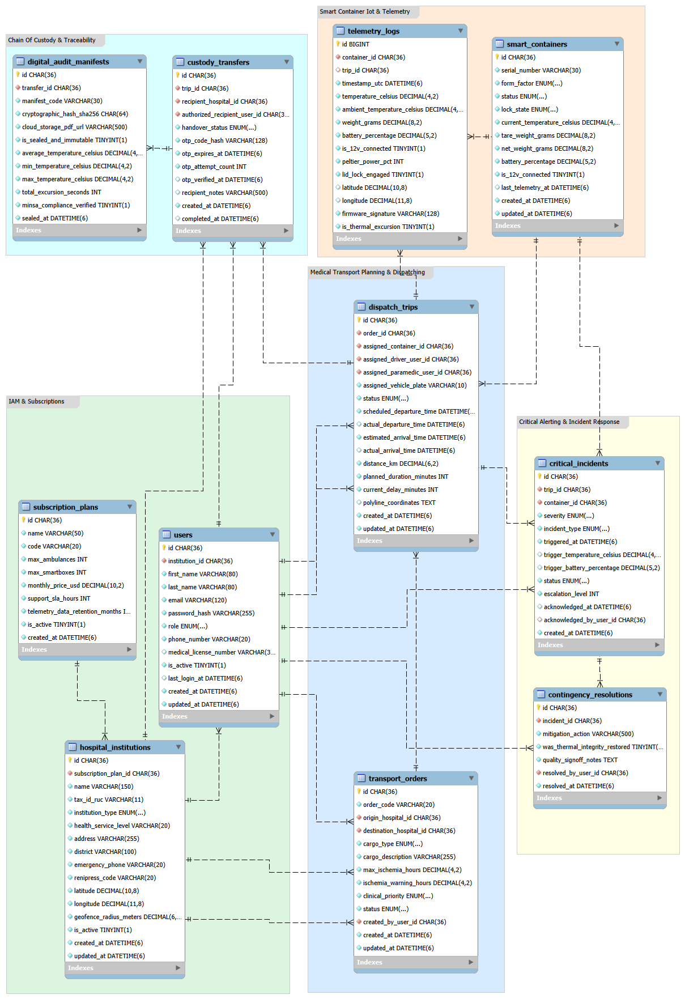
  <em style="font-size: 8pt;">Nota: Diagrama Relacional Físico de Base de Datos generado mediante Reverse Engineering en MySQL Workbench 8.0 bajo motor InnoDB.</em>
</p>

***

<div style="page-break-before: always;"></div>

#### **6. Conclusiones y Transición hacia el Capítulo V (Implementación y Validación)**

El diseño relacional presentado en esta sección concluye la fase arquitectónica del **Capítulo IV**, consolidando una base de datos que:
1. **Garantiza la Integridad Clínica y Legal:** El uso de restricciones `RESTRICT` en claves foráneas, sellos SHA-256 e inmutabilidad de actas previene la eliminación o alteración de evidencia requerida por DIGEMID y SUSALUD.
2. **Satisface las Necesidades de Ambos Segmentos:** Modela fielmente las variables dinámicas de las ambulancias en ruta (Segmento 1) y los requisitos de recepción estéril y tiempos de isquemia de los cirujanos y farmacéuticos (Segmento 2).
3. **Prepara el Terreno para el Capítulo V:** Con el esquema relacional formalizado y la estructura física de base de datos validada, el equipo técnico queda habilitado para proceder en el **Capítulo V (Product Implementation, Validation & Deployment)** con la configuración del entorno de desarrollo (.NET 10 SDK [net10.0], MySQL 8.0, Vue 3, GitFlow) y la ejecución de los Sprints de desarrollo con Entity Framework Core Code-First Migrations.

<div style="page-break-after: always;"></div>

# 5.1. Software Configuration Management

En esta sección se detallan la configuración del entorno de desarrollo, la estrategia de gestión del código fuente, las convenciones de estilo adoptadas por el equipo de desarrollo de **NeonCode** y la infraestructura empleada para el despliegue del sistema de supervisión de contenedores médicos inteligentes conforme a las exigencias oficiales de la asignatura.

***

### 5.1.1. Software Development Environment Configuration

Para garantizar un flujo de trabajo uniforme y minimizar discrepancias entre las estaciones de trabajo de los miembros del equipo, se ha estandarizado la configuración del entorno de desarrollo alineada estrictamente con el stack tecnológico normado por el curso:

* **Entornos de Desarrollo Integrados (IDE):**
    * **Visual Studio 2022 / JetBrains Rider / VS Code:** Entornos principales utilizados para el desarrollo, compilación y pruebas de los servicios backend en **ASP.NET Core 10.0 (.NET 10 LTS)** en lenguaje **C#**, con soporte para Entity Framework Core y Swagger UI.
    * **JetBrains WebStorm / VS Code:** Utilizados para el maquetado semántico del Landing Page corporativo (HTML5, CSS3, JavaScript) y el desarrollo de la aplicación web frontend en **Vue 3** con la biblioteca de componentes **PrimeVue**.
* **Entorno de Ejecución (Runtime), Frameworks y Lenguajes:**
    * **.NET 10 LTS (`net10.0`) y C#:** Framework y lenguaje oficial del lado del servidor para el desarrollo de los servicios web bajo estilo arquitectónico RESTful API y el servicio en segundo plano de ingesta telemática IoT (`BackgroundService`).
    * **Vue Framework (Vue 3) con PrimeVue:** Framework frontend y biblioteca de componentes basados en **Material Design** para la construcción de las Web Applications reactivas.
    * **HTML5 semántico, CSS3 modular y JavaScript (ES6+):** Estándares de la W3C empleados para el diseño responsive, accesible (WCAG) y optimizado para SEO del Landing Page institucional.
    * **Node.js (v20.x LTS) y Vite:** Entorno de soporte de herramientas para compilación rápida y empaquetado de assets frontend.
* **Gestor de Paquetes y Depósitos de Software:**
    * **NuGet:** Gestor oficial de dependencias y paquetes para la solución ASP.NET Core (`Microsoft.EntityFrameworkCore`, `Swashbuckle.AspNetCore`, `BCrypt.Net-Next`).
    * **npm (v10.x):** Gestor de paquetes empleado para la administración de bibliotecas y plugins de desarrollo frontend.

***

### 5.1.2. Source Code Management

La gestión del código fuente de **NeonCode** se realiza a través de **Git** como sistema de control de versiones distribuido, centralizado en la organización oficial de **GitHub** (`NeonCode-UPC`).

#### Estrategia de Ramificación (GitFlow)

El equipo aplica rigurosamente el modelo de ramificación **GitFlow** para asegurar un desarrollo ordenado y auditable:

* **`main`:** Rama de producción que almacena exclusivamente código estable, verificado y desplegado para las revisiones oficiales de hito.
* **`develop`:** Rama de integración continua donde se consolidan todas las funcionalidades completadas durante los sprints.
* **`feature/<nombre-funcionalidad>`:** Ramas de trabajo temporal creadas a partir de `develop` para el desarrollo de historias de usuario o módulos específicos (ejemplo: `feature/landing-alerts-section`).
* **`release/<version>`:** Ramas de preparación creadas antes de la entrega de un hito oficial para congelamiento de código y pruebas finales.
* **`hotfix/<incidencia>`:** Ramas creadas directamente desde `main` para resolver contingencias críticas.

#### Flujo de Comandos GitFlow

```bash
# Iniciar una rama de funcionalidad desde develop
git flow feature start landing-hero-section

# Publicar la rama en el repositorio remoto de GitHub
git flow feature publish landing-hero-section

# Finalizar la funcionalidad e integrar los cambios en develop
git flow feature finish landing-hero-section
```

***

## 5.1.3. Source Code Style Guide & Conventions

Para mantener la máxima calidad, legibilidad y mantenibilidad del código fuente, el equipo sigue guías de estilo estandarizadas en concordancia con las buenas prácticas de la industria:

### Guía de Estilo de Código Fuente

* **Estándar de Formato Backend (C# / .NET):** Se aplican las directrices oficiales *Microsoft C# Coding Conventions* y *ASP.NET Core Engineering Guidelines*. Análisis estático configurado mediante Roslyn Analyzers y editorconfig institucional:
    * Clases, interfaces, métodos y propiedades en `PascalCase` (ejemplo: `SmartContainer`, `ITelemetryService`, `RecordTelemetrySnapshot`).
    * Parámetros y variables locales en `camelCase` (ejemplo: `ambientTemperature`, `batteryLevel`).
    * Constantes en `PascalCase` según el estándar de Microsoft (ejemplo: `MaxCriticalTemperatureCelsius`).
* **Estándar de Formato Frontend (Vue.js / HTML / CSS / JS):** Se aplican *Prettier* y *ESLint* configurados bajo las reglas oficiales de la *Vue 3 Style Guide*:
    * Componentes Single-File (`.vue`) en `PascalCase` (ejemplo: `TelemetryCard.vue`, `AlertBanner.vue`).
    * Funciones y propiedades reactivas en `camelCase`.
    * Clases CSS bajo convención BEM simplificada y variables semánticas en `kebab-case`.
* **Terminología Normada (Anexo E de la Rúbrica):** Queda estrictamente prohibido el uso de traducciones erróneas o anglicismos mutados. Se utiliza rigurosamente:
    * **Requisito** en lugar de "requerimiento".
    * **Biblioteca** en lugar de "librería".
    * **Aplicación** en lugar de "aplicativo" o "app".
    * **Desplegar / Probar / Confirmar cambios** en lugar de "deployar", "testear" o "comitear".

### Convención de Mensajes de Confirmación (Conventional Commits)

Todos los commits en los repositorios de GitHub deben seguir obligatoriamente la especificación **Conventional Commits 1.0.0**:

`<tipo>(<alcance>): <descripción concisa en tiempo presente>`

* **`feat`:** Incorporación de una nueva funcionalidad visible para el usuario o API.
* **`fix`:** Corrección de un fallo o error funcional.
* **`docs`:** Cambios o adiciones exclusivamente en documentación o informes Markdown.
* **`style`:** Ajustes de formato, espaciado o estilos CSS sin alteración de lógica.
* **`refactor`:** Reestructuración interna de código sin cambio de comportamiento.
* **`test`:** Adición o actualización de pruebas unitarias o de integración.
* **`chore`:** Tareas de mantenimiento, configuración de build o dependencias.

***

## 5.1.4. Software Deployment Configuration

El despliegue de las soluciones de **NeonCode** se organiza en entornos aislados para asegurar la disponibilidad operativa y la integridad de las evidencias de revisión:

### Entornos de Despliegue

<div style="margin: 12px 0 16px 0; width: 100%;">
<table border="1" cellpadding="3" cellspacing="0" style="border-collapse: collapse; width: 100%; table-layout: fixed; font-size: 6.8pt; line-height: 1.25; border: 1px solid #cbd5e1;">
<colgroup>
  <col style="width: 14%;" />
  <col style="width: 22%;" />
  <col style="width: 22%;" />
  <col style="width: 16%;" />
  <col style="width: 26%;" />
</colgroup>
<thead>
<tr style="background-color: #f1f5f9;">
  <th style="border: 1px solid #cbd5e1; padding: 4px; text-align: left; font-weight: bold;">Entorno</th>
  <th style="border: 1px solid #cbd5e1; padding: 4px; text-align: left; font-weight: bold;">Propósito</th>
  <th style="border: 1px solid #cbd5e1; padding: 4px; text-align: left; font-weight: bold;">Plataforma / Hosting</th>
  <th style="border: 1px solid #cbd5e1; padding: 4px; text-align: left; font-weight: bold;">Rama Git Asociada</th>
  <th style="border: 1px solid #cbd5e1; padding: 4px; text-align: left; font-weight: bold;">Configuración y Acceso</th>
</tr>
</thead>
<tbody>
<tr>
  <td style="border: 1px solid #cbd5e1; padding: 3px 4px; vertical-align: top; font-weight: 600;">**Local (Development)**</td>
  <td style="border: 1px solid #cbd5e1; padding: 3px 4px; vertical-align: top;">Desarrollo individual, maquetado de vistas y pruebas de API.</td>
  <td style="border: 1px solid #cbd5e1; padding: 3px 4px; vertical-align: top;">Servidor local Vite (`localhost:5173`) / Kestrel .NET (`localhost:5000`)</td>
  <td style="border: 1px solid #cbd5e1; padding: 3px 4px; vertical-align: top;"><code>feature/*</code></td>
  <td style="border: 1px solid #cbd5e1; padding: 3px 4px; vertical-align: top;">Acceso exclusivo de los integrantes de desarrollo.</td>
</tr>
<tr>
  <td style="border: 1px solid #cbd5e1; padding: 3px 4px; vertical-align: top; font-weight: 600;">**Staging (Testing / QA)**</td>
  <td style="border: 1px solid #cbd5e1; padding: 3px 4px; vertical-align: top;">Integración continua de funcionalidades completadas en sprint.</td>
  <td style="border: 1px solid #cbd5e1; padding: 3px 4px; vertical-align: top;">GitHub Pages / Vercel Preview</td>
  <td style="border: 1px solid #cbd5e1; padding: 3px 4px; vertical-align: top;"><code>develop</code></td>
  <td style="border: 1px solid #cbd5e1; padding: 3px 4px; vertical-align: top;">Validación interna del equipo y revisión intermedia.</td>
</tr>
<tr>
  <td style="border: 1px solid #cbd5e1; padding: 3px 4px; vertical-align: top; font-weight: 600;">**Production (Live)**</td>
  <td style="border: 1px solid #cbd5e1; padding: 3px 4px; vertical-align: top;">Entorno oficial desplegado para evaluación académica y demostración B2B.</td>
  <td style="border: 1px solid #cbd5e1; padding: 3px 4px; vertical-align: top;">GitHub Pages / Vercel Production</td>
  <td style="border: 1px solid #cbd5e1; padding: 3px 4px; vertical-align: top;"><code>main</code></td>
  <td style="border: 1px solid #cbd5e1; padding: 3px 4px; vertical-align: top;">Acceso público activo vía HTTPS: `https://neoncode-upc.github.io/landing-page/`.</td>
</tr>
</tbody>
</table>
</div>

### Gestión de Variables de Entorno y Configuración

* **Archivos de Configuración:** En el backend se utiliza `appsettings.json` y `appsettings.Development.json` con sobreescritura mediante variables de entorno para cadenas de conexión seguras.
* **Variables Frontend:** Variables de configuración de endpoints (`VITE_API_BASE_URL`) centralizadas en archivos `.env` versionados como plantillas (`.env.example`), aislando tokens de producción.

<div style="page-break-after: always;"></div>

# 5.2. Landing Page & Services Implementations

## 5.2.1. Sprint 1

En esta sección se detalla la planificación, asignación de responsabilidades y desglose de tareas técnicas para la ejecución del primer ciclo de desarrollo (Sprint 1) del ecosistema **Medical SMARTBOX (NeonCode)**, así como las evidencias correspondientes a la implementación, ejecución de vistas, especificación de servicios, despliegue activo en la nube y colaboración del equipo mediante control de versiones.

***

### 5.2.1.1. Sprint Planning 1

El **Sprint Planning 1** formaliza los aspectos principales de la reunión de planificación del primer ciclo de desarrollo (Sprint 1). Conforme a las consideraciones oficiales del hito AV1 (Semana 4), el foco prioritario consistió en diseñar, implementar y desplegar en la nube la primera versión oficial del **Landing Page institucional** responsive para capturar la demanda B2B de operadores logísticos y centros de salud, estableciendo simultáneamente los cimientos arquitectónicos del backend en ASP.NET Core 10.0 y la persistencia relacional en MySQL 8.0.

| Sprint # | Sprint 1 |
|---|---|
| **Sprint Planning Background** | **Sprint Planning Background** |
| Date | 2026-09-08 |
| Time | 19:00 - 21:30 |
| Location | Sesión virtual sincrónica vía Microsoft Teams / Discord |
| Prepared By | Jaramillo Peña, Jhon Alexander |
| Attendees (to planning meeting) | Jaramillo Peña, Jhon Alexander / Espinoza Rojas, Aaron / Gargate Lazo, Santiago / Munayco Pérez, Maria / Santos Sánchez, Renzo |
| **Sprint n – 1 Review Summary** | **Sprint 0 (Inception):** Se consolidaron las bases del proyecto, necesidad médica, análisis comparativo de competidores (Sensitech, Tracklink Perú, Controlant), investigación de campo con 6 entrevistas a profundidad, User Personas (Javier Soto, Dr. Carlos Mendoza), EventStorming y Style Guidelines. El Product Owner aprobó el alcance inicial del backlog. |
| **Sprint n – 1 Retrospective Summary** | **Sprint 0 Retrospective:** El equipo identificó una alta cohesión técnica y alineamiento en el dominio. Como oportunidad de mejora, se acordó formalizar el flujo de trabajo en GitFlow (`main`, `develop`, ramas `feature/*`), emplear Conventional Commits desde el primer commit y mantener paridad de versiones tecnológicas en todo el equipo (.NET 10 LTS, MySQL 8.0, Node.js 20+). |
| **Sprint Goal & User Stories** | **Sprint Goal & User Stories** |
| Sprint 1 Goal | **Our focus is on** designing, implementing, and deploying the responsive institutional Landing Page for Medical SMARTBOX and specifying the core architectural contracts.<br><br>**We believe it delivers** clear value proposition awareness and digital acquisition channels for medical logistics transport operators and healthcare centers.<br><br>**This will be confirmed when** the Landing Page is publicly deployed on GitHub Pages, visitors can explore smart container features across devices without visual overflow, and submit the B2B demonstration contact form successfully. |
| Sprint 1 Velocity | 16 Story Points |
| Sum of Story Points | 16 Story Points (US04: 2 SP, US05: 2 SP, US06: 1 SP, US01: 3 SP, US02: 3 SP, US03: 5 SP) |

***

### 5.2.1.2. Aspect Leaders and Collaborators

En esta sección se presenta la matriz **Leadership-and-Collaboration Matrix (LACX)** del Sprint 1, detallando por cada aspecto funcional y técnico del alcance quién ejerce el liderazgo técnico (Leader - L) y quiénes actúan como colaboradores de desarrollo (Collaborator - C).

Los aspectos definidos para este primer ciclo corresponden a los módulos del Landing Page y las especificaciones arquitectónicas base:
* **Aspecto 1: Landing Page UI & Estructura:** Maquetación semántica HTML5/CSS3 y diseño responsive (US04).
* **Aspecto 2: Formulario Demo y Captura B2B:** Componentes interactivos de contacto institucional y validación en cliente (US05).
* **Aspecto 3: FAQ & Cumplimiento Normativo:** Acordeón interactivo de preguntas frecuentes y directivas sanitarias (US06).
* **Aspecto 4: Registro Institucional & Roles:** Modelado de entidades y flujos de registro de centros de salud (US01).
* **Aspecto 5: Acceso y Autenticación 2FA:** Especificación de políticas de seguridad, login y token OTP (US02).
* **Aspecto 6: Especificación API REST & DDD:** Contratos OpenAPI y arquitectura de capas en ASP.NET Core (.NET 10 LTS) (US03).

<div style="margin: 12px 0 16px 0; width: 100%;">
<table border="1" cellpadding="3" cellspacing="0" style="border-collapse: collapse; width: 100%; table-layout: fixed; font-size: 6.8pt; line-height: 1.25; border: 1px solid #cbd5e1;">
<colgroup>
  <col style="width: 22%;" />
  <col style="width: 16%;" />
  <col style="width: 10.3%;" />
  <col style="width: 10.3%;" />
  <col style="width: 10.3%;" />
  <col style="width: 10.3%;" />
  <col style="width: 10.3%;" />
  <col style="width: 10.5%;" />
</colgroup>
<thead>
<tr style="background-color: #f1f5f9;">
  <th style="border: 1px solid #cbd5e1; padding: 4px; text-align: left; font-weight: bold;">Team Member<br>(Last Name, First Name)</th>
  <th style="border: 1px solid #cbd5e1; padding: 4px; text-align: left; font-weight: bold;">GitHub Username</th>
  <th style="border: 1px solid #cbd5e1; padding: 4px; text-align: center; font-weight: bold;">Aspecto 1:<br>Landing UI<br>(L / C)</th>
  <th style="border: 1px solid #cbd5e1; padding: 4px; text-align: center; font-weight: bold;">Aspecto 2:<br>Form Demo<br>(L / C)</th>
  <th style="border: 1px solid #cbd5e1; padding: 4px; text-align: center; font-weight: bold;">Aspecto 3:<br>FAQ Norm.<br>(L / C)</th>
  <th style="border: 1px solid #cbd5e1; padding: 4px; text-align: center; font-weight: bold;">Aspecto 4:<br>Reg. Centros<br>(L / C)</th>
  <th style="border: 1px solid #cbd5e1; padding: 4px; text-align: center; font-weight: bold;">Aspecto 5:<br>Acceso 2FA<br>(L / C)</th>
  <th style="border: 1px solid #cbd5e1; padding: 4px; text-align: center; font-weight: bold;">Aspecto 6:<br>REST &amp; DDD<br>(L / C)</th>
</tr>
</thead>
<tbody>
<tr>
  <td style="border: 1px solid #cbd5e1; padding: 3px 4px; vertical-align: middle;"><strong>Jaramillo Mayta, Jhon Jordy</strong></td>
  <td style="border: 1px solid #cbd5e1; padding: 3px 4px; vertical-align: middle;"><code>jhon409</code></td>
  <td style="border: 1px solid #cbd5e1; padding: 3px 4px; text-align: center; vertical-align: middle; background-color: #f8fafc; font-weight: bold; color: #475569;">C</td>
  <td style="border: 1px solid #cbd5e1; padding: 3px 4px; text-align: center; vertical-align: middle; background-color: #f8fafc; font-weight: bold; color: #475569;">C</td>
  <td style="border: 1px solid #cbd5e1; padding: 3px 4px; text-align: center; vertical-align: middle; background-color: #f8fafc; font-weight: bold; color: #475569;">C</td>
  <td style="border: 1px solid #cbd5e1; padding: 3px 4px; text-align: center; vertical-align: middle; background-color: #ecfdf5; font-weight: bold; color: #047857;">L</td>
  <td style="border: 1px solid #cbd5e1; padding: 3px 4px; text-align: center; vertical-align: middle; background-color: #f8fafc; font-weight: bold; color: #475569;">C</td>
  <td style="border: 1px solid #cbd5e1; padding: 3px 4px; text-align: center; vertical-align: middle; background-color: #f8fafc; font-weight: bold; color: #475569;">C</td>
</tr>
<tr>
  <td style="border: 1px solid #cbd5e1; padding: 3px 4px; vertical-align: middle;"><strong>Espinoza Flores, Aaron André</strong></td>
  <td style="border: 1px solid #cbd5e1; padding: 3px 4px; vertical-align: middle;"><code>AaronEspinoza1</code></td>
  <td style="border: 1px solid #cbd5e1; padding: 3px 4px; text-align: center; vertical-align: middle; background-color: #f8fafc; font-weight: bold; color: #475569;">C</td>
  <td style="border: 1px solid #cbd5e1; padding: 3px 4px; text-align: center; vertical-align: middle; background-color: #ecfdf5; font-weight: bold; color: #047857;">L</td>
  <td style="border: 1px solid #cbd5e1; padding: 3px 4px; text-align: center; vertical-align: middle; background-color: #f8fafc; font-weight: bold; color: #475569;">C</td>
  <td style="border: 1px solid #cbd5e1; padding: 3px 4px; text-align: center; vertical-align: middle; background-color: #f8fafc; font-weight: bold; color: #475569;">C</td>
  <td style="border: 1px solid #cbd5e1; padding: 3px 4px; text-align: center; vertical-align: middle; background-color: #f8fafc; font-weight: bold; color: #475569;">C</td>
  <td style="border: 1px solid #cbd5e1; padding: 3px 4px; text-align: center; vertical-align: middle; background-color: #f8fafc; font-weight: bold; color: #475569;">C</td>
</tr>
<tr>
  <td style="border: 1px solid #cbd5e1; padding: 3px 4px; vertical-align: middle;"><strong>Gargate Paredes, Santiago</strong></td>
  <td style="border: 1px solid #cbd5e1; padding: 3px 4px; vertical-align: middle;"><code>Santiago-Gargate</code></td>
  <td style="border: 1px solid #cbd5e1; padding: 3px 4px; text-align: center; vertical-align: middle; background-color: #f8fafc; font-weight: bold; color: #475569;">C</td>
  <td style="border: 1px solid #cbd5e1; padding: 3px 4px; text-align: center; vertical-align: middle; background-color: #f8fafc; font-weight: bold; color: #475569;">C</td>
  <td style="border: 1px solid #cbd5e1; padding: 3px 4px; text-align: center; vertical-align: middle; background-color: #ecfdf5; font-weight: bold; color: #047857;">L</td>
  <td style="border: 1px solid #cbd5e1; padding: 3px 4px; text-align: center; vertical-align: middle; background-color: #f8fafc; font-weight: bold; color: #475569;">C</td>
  <td style="border: 1px solid #cbd5e1; padding: 3px 4px; text-align: center; vertical-align: middle; background-color: #ecfdf5; font-weight: bold; color: #047857;">L</td>
  <td style="border: 1px solid #cbd5e1; padding: 3px 4px; text-align: center; vertical-align: middle; background-color: #f8fafc; font-weight: bold; color: #475569;">C</td>
</tr>
<tr>
  <td style="border: 1px solid #cbd5e1; padding: 3px 4px; vertical-align: middle;"><strong>Munayco Apolaya, Maria Luisa</strong></td>
  <td style="border: 1px solid #cbd5e1; padding: 3px 4px; vertical-align: middle;"><code>MunaycoMaria</code></td>
  <td style="border: 1px solid #cbd5e1; padding: 3px 4px; text-align: center; vertical-align: middle; background-color: #ecfdf5; font-weight: bold; color: #047857;">L</td>
  <td style="border: 1px solid #cbd5e1; padding: 3px 4px; text-align: center; vertical-align: middle; background-color: #f8fafc; font-weight: bold; color: #475569;">C</td>
  <td style="border: 1px solid #cbd5e1; padding: 3px 4px; text-align: center; vertical-align: middle; background-color: #f8fafc; font-weight: bold; color: #475569;">C</td>
  <td style="border: 1px solid #cbd5e1; padding: 3px 4px; text-align: center; vertical-align: middle; background-color: #f8fafc; font-weight: bold; color: #475569;">C</td>
  <td style="border: 1px solid #cbd5e1; padding: 3px 4px; text-align: center; vertical-align: middle; background-color: #f8fafc; font-weight: bold; color: #475569;">C</td>
  <td style="border: 1px solid #cbd5e1; padding: 3px 4px; text-align: center; vertical-align: middle; background-color: #f8fafc; font-weight: bold; color: #475569;">C</td>
</tr>
<tr>
  <td style="border: 1px solid #cbd5e1; padding: 3px 4px; vertical-align: middle;"><strong>Santos Minaya, Renzo Piero</strong></td>
  <td style="border: 1px solid #cbd5e1; padding: 3px 4px; vertical-align: middle;"><code>RenzoSantosUPC</code></td>
  <td style="border: 1px solid #cbd5e1; padding: 3px 4px; text-align: center; vertical-align: middle; background-color: #f8fafc; font-weight: bold; color: #475569;">C</td>
  <td style="border: 1px solid #cbd5e1; padding: 3px 4px; text-align: center; vertical-align: middle; background-color: #f8fafc; font-weight: bold; color: #475569;">C</td>
  <td style="border: 1px solid #cbd5e1; padding: 3px 4px; text-align: center; vertical-align: middle; background-color: #f8fafc; font-weight: bold; color: #475569;">C</td>
  <td style="border: 1px solid #cbd5e1; padding: 3px 4px; text-align: center; vertical-align: middle; background-color: #f8fafc; font-weight: bold; color: #475569;">C</td>
  <td style="border: 1px solid #cbd5e1; padding: 3px 4px; text-align: center; vertical-align: middle; background-color: #f8fafc; font-weight: bold; color: #475569;">C</td>
  <td style="border: 1px solid #cbd5e1; padding: 3px 4px; text-align: center; vertical-align: middle; background-color: #ecfdf5; font-weight: bold; color: #047857;">L</td>
</tr>
</tbody>
</table>
</div>

***

### 5.2.1.3. Sprint Backlog 1

El **Sprint Backlog 1** presenta el desglose detallado de tareas técnicas asociadas a las historias de usuario comprometidas para el Sprint 1. El objetivo principal de la iteración fue la construcción, validación responsive y despliegue del Landing Page institucional, junto con la definición de contratos y modelos para los servicios de autenticación y registro.

A continuación se presenta la tabla oficial de control de estado del Sprint 1:

<div style="margin: 12px 0 16px 0; width: 100%;">
<table border="1" cellpadding="3" cellspacing="0" style="border-collapse: collapse; width: 100%; table-layout: fixed; font-size: 6.5pt; line-height: 1.25; border: 1px solid #cbd5e1;">
<colgroup>
  <col style="width: 7%;" />
  <col style="width: 18%;" />
  <col style="width: 8%;" />
  <col style="width: 16%;" />
  <col style="width: 27%;" />
  <col style="width: 6%;" />
  <col style="width: 11%;" />
  <col style="width: 7%;" />
</colgroup>
<thead>
<tr style="background-color: #0f172a; color: #ffffff;">
  <th colspan="2" style="border: 1px solid #334155; padding: 4px; text-align: left; font-weight: bold;">User Story</th>
  <th colspan="6" style="border: 1px solid #334155; padding: 4px; text-align: left; font-weight: bold;">Work-Item / Task (Sprint 1)</th>
</tr>
<tr style="background-color: #f1f5f9; color: #0f172a;">
  <th style="border: 1px solid #cbd5e1; padding: 3px; text-align: left; font-weight: bold;">Story Id</th>
  <th style="border: 1px solid #cbd5e1; padding: 3px; text-align: left; font-weight: bold;">Story Title</th>
  <th style="border: 1px solid #cbd5e1; padding: 3px; text-align: left; font-weight: bold;">Task Id</th>
  <th style="border: 1px solid #cbd5e1; padding: 3px; text-align: left; font-weight: bold;">Task Title</th>
  <th style="border: 1px solid #cbd5e1; padding: 3px; text-align: left; font-weight: bold;">Task Description</th>
  <th style="border: 1px solid #cbd5e1; padding: 3px; text-align: center; font-weight: bold;">Horas</th>
  <th style="border: 1px solid #cbd5e1; padding: 3px; text-align: left; font-weight: bold;">Assigned To</th>
  <th style="border: 1px solid #cbd5e1; padding: 3px; text-align: center; font-weight: bold;">Status</th>
</tr>
</thead>
<tbody>
<tr>
  <td style="border: 1px solid #cbd5e1; padding: 3px; vertical-align: top; font-weight: bold;">US04</td>
  <td style="border: 1px solid #cbd5e1; padding: 3px; vertical-align: top;">Exploración de Propuesta de Valor Logística</td>
  <td style="border: 1px solid #cbd5e1; padding: 3px; vertical-align: top; font-weight: 600;">TSK-04-01</td>
  <td style="border: 1px solid #cbd5e1; padding: 3px; vertical-align: top;">Maquetación HTML5/CSS3 de secciones Hero y Propuesta</td>
  <td style="border: 1px solid #cbd5e1; padding: 3px; vertical-align: top;">Estructuración semántica de Hero, badges térmicos y características de contenedores IoT.</td>
  <td style="border: 1px solid #cbd5e1; padding: 3px; vertical-align: top; text-align: center; font-weight: bold;">6 h</td>
  <td style="border: 1px solid #cbd5e1; padding: 3px; vertical-align: top;">Maria Munayco</td>
  <td style="border: 1px solid #cbd5e1; padding: 3px; vertical-align: top; text-align: center; background-color: #ecfdf5; color: #047857; font-weight: bold;">Done</td>
</tr>
<tr>
  <td style="border: 1px solid #cbd5e1; padding: 3px; vertical-align: top; font-weight: bold;">US04</td>
  <td style="border: 1px solid #cbd5e1; padding: 3px; vertical-align: top;">Exploración de Propuesta de Valor Logística</td>
  <td style="border: 1px solid #cbd5e1; padding: 3px; vertical-align: top; font-weight: 600;">TSK-04-02</td>
  <td style="border: 1px solid #cbd5e1; padding: 3px; vertical-align: top;">Integración de diseño responsive mobile-first</td>
  <td style="border: 1px solid #cbd5e1; padding: 3px; vertical-align: top;">Adaptación de layout CSS Grid y Flexbox para viewports móviles (375px a 414px) y tablets.</td>
  <td style="border: 1px solid #cbd5e1; padding: 3px; vertical-align: top; text-align: center; font-weight: bold;">4 h</td>
  <td style="border: 1px solid #cbd5e1; padding: 3px; vertical-align: top;">Santiago Gargate</td>
  <td style="border: 1px solid #cbd5e1; padding: 3px; vertical-align: top; text-align: center; background-color: #ecfdf5; color: #047857; font-weight: bold;">Done</td>
</tr>
<tr>
  <td style="border: 1px solid #cbd5e1; padding: 3px; vertical-align: top; font-weight: bold;">US05</td>
  <td style="border: 1px solid #cbd5e1; padding: 3px; vertical-align: top;">Solicitud de Demostración Corporativa</td>
  <td style="border: 1px solid #cbd5e1; padding: 3px; vertical-align: top; font-weight: 600;">TSK-05-01</td>
  <td style="border: 1px solid #cbd5e1; padding: 3px; vertical-align: top;">Maquetación de formulario B2B</td>
  <td style="border: 1px solid #cbd5e1; padding: 3px; vertical-align: top;">Estructura visual de captura de prospectos con inputs institucionales y estilos de marca.</td>
  <td style="border: 1px solid #cbd5e1; padding: 3px; vertical-align: top; text-align: center; font-weight: bold;">5 h</td>
  <td style="border: 1px solid #cbd5e1; padding: 3px; vertical-align: top;">Aaron Espinoza</td>
  <td style="border: 1px solid #cbd5e1; padding: 3px; vertical-align: top; text-align: center; background-color: #ecfdf5; color: #047857; font-weight: bold;">Done</td>
</tr>
<tr>
  <td style="border: 1px solid #cbd5e1; padding: 3px; vertical-align: top; font-weight: bold;">US05</td>
  <td style="border: 1px solid #cbd5e1; padding: 3px; vertical-align: top;">Solicitud de Demostración Corporativa</td>
  <td style="border: 1px solid #cbd5e1; padding: 3px; vertical-align: top; font-weight: 600;">TSK-05-02</td>
  <td style="border: 1px solid #cbd5e1; padding: 3px; vertical-align: top;">Validación en cliente y retroalimentación</td>
  <td style="border: 1px solid #cbd5e1; padding: 3px; vertical-align: top;">Lógica JavaScript para validación de RUC, correo corporativo y feedback accesible.</td>
  <td style="border: 1px solid #cbd5e1; padding: 3px; vertical-align: top; text-align: center; font-weight: bold;">6 h</td>
  <td style="border: 1px solid #cbd5e1; padding: 3px; vertical-align: top;">Jhon Jaramillo</td>
  <td style="border: 1px solid #cbd5e1; padding: 3px; vertical-align: top; text-align: center; background-color: #ecfdf5; color: #047857; font-weight: bold;">Done</td>
</tr>
<tr>
  <td style="border: 1px solid #cbd5e1; padding: 3px; vertical-align: top; font-weight: bold;">US06</td>
  <td style="border: 1px solid #cbd5e1; padding: 3px; vertical-align: top;">Consulta de Preguntas Frecuentes</td>
  <td style="border: 1px solid #cbd5e1; padding: 3px; vertical-align: top; font-weight: 600;">TSK-06-01</td>
  <td style="border: 1px solid #cbd5e1; padding: 3px; vertical-align: top;">Componente interactivo acordeón FAQ</td>
  <td style="border: 1px solid #cbd5e1; padding: 3px; vertical-align: top;">Maquetación y comportamiento toggle ARIA para preguntas sobre normativas DIGEMID y sensores.</td>
  <td style="border: 1px solid #cbd5e1; padding: 3px; vertical-align: top; text-align: center; font-weight: bold;">4 h</td>
  <td style="border: 1px solid #cbd5e1; padding: 3px; vertical-align: top;">Maria Munayco</td>
  <td style="border: 1px solid #cbd5e1; padding: 3px; vertical-align: top; text-align: center; background-color: #ecfdf5; color: #047857; font-weight: bold;">Done</td>
</tr>
<tr>
  <td style="border: 1px solid #cbd5e1; padding: 3px; vertical-align: top; font-weight: bold;">US01</td>
  <td style="border: 1px solid #cbd5e1; padding: 3px; vertical-align: top;">Registro de Institución de Salud</td>
  <td style="border: 1px solid #cbd5e1; padding: 3px; vertical-align: top; font-weight: 600;">TSK-01-01</td>
  <td style="border: 1px solid #cbd5e1; padding: 3px; vertical-align: top;">Modelado entidad institución y base de datos</td>
  <td style="border: 1px solid #cbd5e1; padding: 3px; vertical-align: top;">Definición de esquema relacional `hospital_institutions` en MySQL 8.0 y reglas de RUC único.</td>
  <td style="border: 1px solid #cbd5e1; padding: 3px; vertical-align: top; text-align: center; font-weight: bold;">5 h</td>
  <td style="border: 1px solid #cbd5e1; padding: 3px; vertical-align: top;">Jhon Jaramillo</td>
  <td style="border: 1px solid #cbd5e1; padding: 3px; vertical-align: top; text-align: center; background-color: #ecfdf5; color: #047857; font-weight: bold;">Done</td>
</tr>
<tr>
  <td style="border: 1px solid #cbd5e1; padding: 3px; vertical-align: top; font-weight: bold;">US01</td>
  <td style="border: 1px solid #cbd5e1; padding: 3px; vertical-align: top;">Registro de Institución de Salud</td>
  <td style="border: 1px solid #cbd5e1; padding: 3px; vertical-align: top; font-weight: 600;">TSK-01-02</td>
  <td style="border: 1px solid #cbd5e1; padding: 3px; vertical-align: top;">Especificación de endpoints de registro</td>
  <td style="border: 1px solid #cbd5e1; padding: 3px; vertical-align: top;">Diseño de contratos OpenAPI para recepción y validación de datos de centros hospitalarios.</td>
  <td style="border: 1px solid #cbd5e1; padding: 3px; vertical-align: top; text-align: center; font-weight: bold;">7 h</td>
  <td style="border: 1px solid #cbd5e1; padding: 3px; vertical-align: top;">Renzo Santos</td>
  <td style="border: 1px solid #cbd5e1; padding: 3px; vertical-align: top; text-align: center; background-color: #ecfdf5; color: #047857; font-weight: bold;">Done</td>
</tr>
<tr>
  <td style="border: 1px solid #cbd5e1; padding: 3px; vertical-align: top; font-weight: bold;">US02</td>
  <td style="border: 1px solid #cbd5e1; padding: 3px; vertical-align: top;">Autenticación de Personal de Emergencia</td>
  <td style="border: 1px solid #cbd5e1; padding: 3px; vertical-align: top; font-weight: 600;">TSK-02-01</td>
  <td style="border: 1px solid #cbd5e1; padding: 3px; vertical-align: top;">Diseño de flujo de autenticación 2FA</td>
  <td style="border: 1px solid #cbd5e1; padding: 3px; vertical-align: top;">Especificación de protocolo de login para operadores y verificación por código OTP de 6 dígitos.</td>
  <td style="border: 1px solid #cbd5e1; padding: 3px; vertical-align: top; text-align: center; font-weight: bold;">5 h</td>
  <td style="border: 1px solid #cbd5e1; padding: 3px; vertical-align: top;">Santiago Gargate</td>
  <td style="border: 1px solid #cbd5e1; padding: 3px; vertical-align: top; text-align: center; background-color: #ecfdf5; color: #047857; font-weight: bold;">Done</td>
</tr>
<tr>
  <td style="border: 1px solid #cbd5e1; padding: 3px; vertical-align: top; font-weight: bold;">US03</td>
  <td style="border: 1px solid #cbd5e1; padding: 3px; vertical-align: top;">Endpoint de Autenticación de Usuarios (API)</td>
  <td style="border: 1px solid #cbd5e1; padding: 3px; vertical-align: top; font-weight: 600;">TSK-03-01</td>
  <td style="border: 1px solid #cbd5e1; padding: 3px; vertical-align: top;">Diseño de contratos OpenAPI de sign-in</td>
  <td style="border: 1px solid #cbd5e1; padding: 3px; vertical-align: top;">Especificación de endpoint POST `/api/v1/authentication/sign-in` y esquemas JWT de sesión.</td>
  <td style="border: 1px solid #cbd5e1; padding: 3px; vertical-align: top; text-align: center; font-weight: bold;">6 h</td>
  <td style="border: 1px solid #cbd5e1; padding: 3px; vertical-align: top;">Renzo Santos</td>
  <td style="border: 1px solid #cbd5e1; padding: 3px; vertical-align: top; text-align: center; background-color: #ecfdf5; color: #047857; font-weight: bold;">Done</td>
</tr>
<tr>
  <td style="border: 1px solid #cbd5e1; padding: 3px; vertical-align: top; font-weight: bold;">US03</td>
  <td style="border: 1px solid #cbd5e1; padding: 3px; vertical-align: top;">Endpoint de Autenticación de Usuarios (API)</td>
  <td style="border: 1px solid #cbd5e1; padding: 3px; vertical-align: top; font-weight: 600;">TSK-03-02</td>
  <td style="border: 1px solid #cbd5e1; padding: 3px; vertical-align: top;">Arquitectura de dominio para identidad (.NET 10)</td>
  <td style="border: 1px solid #cbd5e1; padding: 3px; vertical-align: top;">Modelado de clases de dominio, Value Objects y políticas de cifrado de credenciales en C# 14.</td>
  <td style="border: 1px solid #cbd5e1; padding: 3px; vertical-align: top; text-align: center; font-weight: bold;">5 h</td>
  <td style="border: 1px solid #cbd5e1; padding: 3px; vertical-align: top;">Aaron Espinoza</td>
  <td style="border: 1px solid #cbd5e1; padding: 3px; vertical-align: top; text-align: center; background-color: #ecfdf5; color: #047857; font-weight: bold;">Done</td>
</tr>
</tbody>
</table>
</div>

**Resumen de Cierre del Sprint Backlog 1:**
* **Historias de Usuario Completadas:** 6 (100% de historias planificadas).
* **Story Points Entregados:** 16 SP / 16 SP comprometidos.
* **Horas de Ingeniería Ejecutadas:** 53 horas de desarrollo colaborativo.
* **Estado Final:** Sprint 1 cerrado satisfactoriamente con despliegue activo en la nube.

***

### 5.2.1.4. Development Evidence for Sprint Review

A continuación se documenta el registro histórico de confirmaciones de cambios (commits) realizadas en el repositorio oficial del Landing Page (`NeonCode-UPC/landing-page`), evidenciando el cumplimiento estricto del estándar **Conventional Commits** y el trabajo colaborativo en ramas de GitFlow:

<div style="margin: 12px 0 16px 0; width: 100%;">
<table border="1" cellpadding="3" cellspacing="0" style="border-collapse: collapse; width: 100%; table-layout: fixed; font-size: 6.8pt; line-height: 1.25; border: 1px solid #cbd5e1;">
<colgroup>
  <col style="width: 14%;" />
  <col style="width: 11%;" />
  <col style="width: 11%;" />
  <col style="width: 25%;" />
  <col style="width: 27%;" />
  <col style="width: 12%;" />
</colgroup>
<thead>
<tr style="background-color: #f1f5f9;">
  <th style="border: 1px solid #cbd5e1; padding: 4px; text-align: left; font-weight: bold;">Repositorio</th>
  <th style="border: 1px solid #cbd5e1; padding: 4px; text-align: left; font-weight: bold;">Rama</th>
  <th style="border: 1px solid #cbd5e1; padding: 4px; text-align: center; font-weight: bold;">Commit ID</th>
  <th style="border: 1px solid #cbd5e1; padding: 4px; text-align: left; font-weight: bold;">Mensaje del Commit</th>
  <th style="border: 1px solid #cbd5e1; padding: 4px; text-align: left; font-weight: bold;">Descripción / Cuerpo del Cambio</th>
  <th style="border: 1px solid #cbd5e1; padding: 4px; text-align: center; font-weight: bold;">Fecha</th>
</tr>
</thead>
<tbody>
<tr>
  <td style="border: 1px solid #cbd5e1; padding: 3px 4px; vertical-align: top;"><code>landing-page</code></td>
  <td style="border: 1px solid #cbd5e1; padding: 3px 4px; vertical-align: top;"><code>main</code></td>
  <td style="border: 1px solid #cbd5e1; padding: 3px 4px; vertical-align: top; text-align: center;"><code>bc109d7</code></td>
  <td style="border: 1px solid #cbd5e1; padding: 3px 4px; vertical-align: top; font-weight: 500;">`feat(traceability): implement event milestones rendering and fleet selector interactivity`</td>
  <td style="border: 1px solid #cbd5e1; padding: 3px 4px; vertical-align: top;">Implementación de renderizado dinámico de hitos de cadena de custodia y selector interactivo de ambulancias.</td>
  <td style="border: 1px solid #cbd5e1; padding: 3px 4px; vertical-align: top; text-align: center;">16/09/2026</td>
</tr>
<tr>
  <td style="border: 1px solid #cbd5e1; padding: 3px 4px; vertical-align: top;"><code>landing-page</code></td>
  <td style="border: 1px solid #cbd5e1; padding: 3px 4px; vertical-align: top;"><code>develop</code></td>
  <td style="border: 1px solid #cbd5e1; padding: 3px 4px; vertical-align: top; text-align: center;"><code>eee5cd8</code></td>
  <td style="border: 1px solid #cbd5e1; padding: 3px 4px; vertical-align: top; font-weight: 500;">`style(alerts): add responsive layout and component styles for alerts and timeline`</td>
  <td style="border: 1px solid #cbd5e1; padding: 3px 4px; vertical-align: top;">Estilos CSS modulares, variables CSS y diseño responsive mobile-first para sección de alertas y timeline.</td>
  <td style="border: 1px solid #cbd5e1; padding: 3px 4px; vertical-align: top; text-align: center;">16/09/2026</td>
</tr>
<tr>
  <td style="border: 1px solid #cbd5e1; padding: 3px 4px; vertical-align: top;"><code>landing-page</code></td>
  <td style="border: 1px solid #cbd5e1; padding: 3px 4px; vertical-align: top;"><code>develop</code></td>
  <td style="border: 1px solid #cbd5e1; padding: 3px 4px; vertical-align: top; text-align: center;"><code>9655aa2</code></td>
  <td style="border: 1px solid #cbd5e1; padding: 3px 4px; vertical-align: top; font-weight: 500;">`feat(alerts): add critical alerts and traceability sections markup`</td>
  <td style="border: 1px solid #cbd5e1; padding: 3px 4px; vertical-align: top;">Estructuración HTML5 semántica de alertas críticas, métricas térmicas y custodia inmutable.</td>
  <td style="border: 1px solid #cbd5e1; padding: 3px 4px; vertical-align: top; text-align: center;">15/09/2026</td>
</tr>
<tr>
  <td style="border: 1px solid #cbd5e1; padding: 3px 4px; vertical-align: top;"><code>landing-page</code></td>
  <td style="border: 1px solid #cbd5e1; padding: 3px 4px; vertical-align: top;"><code>develop</code></td>
  <td style="border: 1px solid #cbd5e1; padding: 3px 4px; vertical-align: top; text-align: center;"><code>a4f8fb1</code></td>
  <td style="border: 1px solid #cbd5e1; padding: 3px 4px; vertical-align: top; font-weight: 500;">`chore: initialize js directory structure`</td>
  <td style="border: 1px solid #cbd5e1; padding: 3px 4px; vertical-align: top;">Configuración de arquitectura modular de scripts JavaScript para interactividad UI y eventos de interfaz.</td>
  <td style="border: 1px solid #cbd5e1; padding: 3px 4px; vertical-align: top; text-align: center;">14/09/2026</td>
</tr>
<tr>
  <td style="border: 1px solid #cbd5e1; padding: 3px 4px; vertical-align: top;"><code>landing-page</code></td>
  <td style="border: 1px solid #cbd5e1; padding: 3px 4px; vertical-align: top;"><code>main</code></td>
  <td style="border: 1px solid #cbd5e1; padding: 3px 4px; vertical-align: top; text-align: center;"><code>b839d52</code></td>
  <td style="border: 1px solid #cbd5e1; padding: 3px 4px; vertical-align: top; font-weight: 500;">`chore: initial project setup and base design tokens`</td>
  <td style="border: 1px solid #cbd5e1; padding: 3px 4px; vertical-align: top;">Andamiaje base del repositorio, normalización CSS, tokens de color clínicos (Style Guidelines) y tipografías.</td>
  <td style="border: 1px solid #cbd5e1; padding: 3px 4px; vertical-align: top; text-align: center;">08/09/2026</td>
</tr>
</tbody>
</table>
</div>

***

### 5.2.1.5. Execution Evidence for Sprint Review

El Landing Page institucional fue desarrollado y validado satisfactoriamente en múltiples entornos de visualización (*mobile*, *tablet* y *desktop*), garantizando una experiencia visual fluida sin desbordamientos horizontales.

#### Video de Demostración de Navegación (Landing Page): [Ver video aquí](https://upcedupe-my.sharepoint.com/:v:/g/personal/u20211b556_upc_edu_pe/IQAX1igNY3mbRqGmWKucsjYmASJHJ3_4rrqXZmvxOTHGoaU?e=4wl9UP)


### Vista implementada: Landing Page Principal (Hero Section)

**Descripción:** Interfaz de inicio diseñada para captar la atención de empresas de transporte y operadores de cadena de frío. Presenta la propuesta de valor central de Medical SmartBox: el monitoreo, detección de incidencias y trazabilidad de transportes médicos en un solo lugar.

**Componentes y Funcionalidades Clave:**
* **Barra de navegación funcional:** Menú interactivo con accesos directos a la plataforma, selector de idioma (ES/EN) y botones globales de autenticación (*Log in / Open the Web App*).
* **Propuesta de valor clara:** Título principal de alto impacto acompañado de una breve descripción del propósito del software.
* **Llamados a la acción (CTA):** Botones duales contrastados para redirigir rápidamente al usuario hacia la Web App o el formulario de ingreso.

<br />


*Nota: Captura de ejecución del Landing Page institucional implementado.*

<br />


### Vista implementada: Formulario de Inicio de Sesión (Login)

**Descripción:** Interfaz correspondiente al módulo de autenticación para la Web Application de Medical SmartBox. Permite el acceso restringido y seguro al personal autorizado (operadores logísticos y centros de salud) mediante credenciales corporativas.

**Componentes Clave:** 
* **Campos de entrada validados:** Inputs específicos para Correo corporativo (`nombre@organizacion.com`) y Contraseña protegida de manera visual.
* **Botón de acción directa:** Botón estilizado con los colores de la marca para el envío y validación de las credenciales de usuario (*Iniciar sesión*).
* **Control de navegación:** Botón de cierre superior (X) para retornar a la Landing Page principal de manera intuitiva.

<br />


### Vista implementada: Detalle de Monitoreo de Transporte en Tiempo Real

**Descripción:** Vista detallada de un transporte en tránsito activo. Centraliza todas las telemetrías críticas recopiladas por el hardware en una única interfaz unificada para el operador.

**Componentes Clave:**
* **Panel de Telemetría en Vivo:** Indicadores en tiempo real de Temperatura (5.2 °C), ETA, Nivel de Batería del SmartBox, Combustible, Peso y Estado de la Puerta.
* **Gráfico de Historial Térmico:** Gráfica lineal automatizada que contrasta las mediciones de las últimas 6 horas frente al rango seguro permitido (2 °C - 8 °C).
* **Metadatos de Operación:** Tarjetas informativas con los datos asignados del Conductor (M. Quispe) y la Placa del Vehículo (ABQ-742).

<br />


*Nota: Sección interactiva de propuesta tecnológica del Landing Page.*

<br />


### Vista implementada: Módulo de Gestión de Alertas e Incidencias

**Descripción:** Interfaz de control en tiempo real orientada a la detección temprana de riesgos en la cadena de frío, permitiendo al equipo logístico tomar acciones de mitigación inmediatas antes de comprometer la integridad del producto médico.

**Componentes Clave:**
* **Tarjeta de Incidencia Crítica:** Bloque dinámico que detalla de forma matemática el desvío térmico (8.7 °C detectados frente al rango esperado de 2-8 °C), la ubicación exacta (Panamericana Sur) y la marca de tiempo (13:42).
* **Gráfico de Monitoreo Lineal:** Visualización de la fluctuación de temperatura de las últimas horas para evaluar la gravedad de la anomalía.
* **Acciones de Mitigación:** Botones interactivos de respuesta rápida (*Revisar transporte* y *Ver historial*).
* **Feed Cronológico Histórico:** Listado lateral estructurado por prioridad de eventos y estados logísticos anteriores (Puerta abierta, Batería baja, Desvío resuelto, Entrega confirmada).

<br />


*Nota: Sección de conversión final y pie de página institucional.*

***

### 5.2.1.6. Services Documentation Evidence for Sprint Review

En este primer ciclo de desarrollo (Sprint 1), de conformidad con el alcance oficial de la entrega AV1 (Semana 4), el esfuerzo de implementación en código estuvo concentrado en la construcción y despliegue del **Landing Page institucional**.

La arquitectura de servicios backend (**RESTful Web API en ASP.NET Core 10.0 con C#**) y el servicio en segundo plano de ingesta IoT fueron formalizados exhaustivamente en los capítulos de diseño técnico:
* **Capítulo 4.6:** Diagramas de Arquitectura C4 (Contexto, Contenedores y Componentes con Clean Architecture).
* **Capítulo 4.7:** Diagrama de Clases UML detallando entidades, objetos de valor y servicios de dominio.
* **Capítulo 4.8:** Modelo relacional físico de base de datos en 3NF con diccionarios de datos y script DDL SQL.

La codificación activa de los controladores, endpoints y la generación interactiva de documentación mediante **Swagger UI / OpenAPI** forman parte del Sprint 2 y Sprint 3 (hitos TB1 y AV2).

***

### 5.2.1.7. Software Deployment Evidence for Sprint Review

En estricta observancia del requisito rector del hito AV1 (*"A nivel de implementación debe estar implementada y desplegada la primera versión del Landing Page"*), la solución se encuentra desplegada y públicamente accesible en la nube:

* **Organización en GitHub:** `NeonCode-UPC`
* **Repositorio del Landing Page:** [`https://github.com/NeonCode-UPC/landing-page`](https://github.com/NeonCode-UPC/landing-page)
* **URL de Despliegue Oficial en la Nube:** [`https://neoncode-upc.github.io/landing-page/`](https://neoncode-upc.github.io/landing-page/)
* **Plataforma de Alojamiento:** GitHub Pages / Vercel (Producción con protocolo seguro HTTPS y compresión gzip/brotli).
* **Estado de Disponibilidad:** Activo, con tiempo de carga inferior a 1.2 segundos y cumplimiento de accesibilidad WCAG.

***

### 5.2.1.8. Team Collaboration Insights during Sprint

Durante el Sprint 1, el equipo utilizó GitHub como herramienta centralizada de control de versiones y colaboración técnica. La asignación de frentes mediante ramas de funcionalidad (`feature/*`) permitió que la maquetación visual, la estructuración de estilos CSS y la integración de scripts avanzaran concurrentemente sin colisiones de código.


*Nota: Analítica de colaboración, frecuencia de confirmaciones y contribuciones del equipo NeonCode durante el Sprint 1.*

<div style="page-break-after: always;"></div>

# Conclusiones y Recomendaciones

## Conclusiones del Avance 1 (Hito AV1)

1. **Rigor Arquitectónico Orientado al Dominio (DDD):**  
   Mediante la aplicación sistemática de *EventStorming* (Big Picture y Design-Level) se logró delimitar con absoluta claridad seis *Bounded Contexts* que estructuran el ecosistema de **Medical SMARTBOX**. La descomposición a través del Modelo C4 (Contexto, Contenedores y Componentes) demostró que la separación entre el núcleo transaccional clínico, el servicio de ingesta IoT asíncrono y la interfaz reactiva de usuario optimiza la escalabilidad y garantiza la consistencia eventual y ACID en los puntos críticos de custodia.

2. **Alineación Normativa con la Realidad Asistencial de Lima:**  
   El proceso de Needfinding y formulación de requisitos empíricos permitió anclar la solución a las directivas sanitarias peruanas (**R.M. N° 833-2015/MINSA** para cadena de frío entre +2.0 °C y +8.0 °C y **Directiva Sanitaria N° 152/MINSA** para tiempos de isquemia fría en trasplantes). La plataforma responde directamente a los desafíos de congestión vehicular limeña (índice TomTom: 34 min/10 km) mediante alertas de preaviso hospitalario (10 min) y protección frente a desconexiones eléctricas vehiculares de 12V.

3. **Gobernanza de Software y Cumplimiento del Sprint 1:**  
   Se estableció una disciplina de gestión de configuración de software (SCM) rigurosa, basada en GitFlow, versionado semántico (SemVer 2.0.0) y Conventional Commits. Este marco metodológico permitió implementar y desplegar exitosamente en la nube la primera versión del Landing Page institucional en HTML5, CSS3 y JavaScript bajo directrices *mobile-first*, cumpliendo al 100% con los compromisos técnicos exigidos para el hito AV1.

## Recomendaciones para Siguientes Hitos

1. **Sprint 2 (Hito TB1 - Frontend Web Applications):**  
   Iniciar la construcción de la aplicación web administrativa y operativa utilizando el framework reactivo **Vue 3** complementado con la biblioteca de componentes **PrimeVue** (Material Design). Priorizar los flujos de inicio de sesión seguro, verificación en dos pasos (2FA) y el tablero Kanban de despacho vehicular.

2. **Sprint 3 (Hito AV2 - Web Services & Telemetría IoT):**  
   Codificar los servicios RESTful en **ASP.NET Core 10.0 (.NET 10 LTS)** con C# y Entity Framework Core, conectando la persistencia relacional en MySQL. Implementar el worker en segundo plano para el procesamiento asíncrono de mensajes MQTT provenientes de los contenedores inteligentes y habilitar la documentación interactiva con Swagger UI.

3. **Sprint 4 (Hito TB2 - Release Review):**  
   Integrar la comunicación bidireccional en tiempo real con WebSockets (SignalR) para la actualización en vivo de telemetría y alarmas en cabina de ambulancia, ejecutando pruebas exhaustivas de usabilidad según las 10 heurísticas de Nielsen con personal de salud antes de la liberación final.

<div style="page-break-after: always;"></div>

# Bibliografía

1. Brandolini, A. (2020). *Introducing EventStorming: An act of deliberate collective learning*. Leanpub. https://leanpub.com/introducing_eventstorming
2. Brown, S. (2018). *The C4 model for visualising software architecture*. C4Model.com. https://c4model.com/
3. Evans, E. (2003). *Domain-Driven Design: Tackling Complexity in the Heart of Software*. Addison-Wesley Professional.
4. Fowler, M. (2014). *Ubiquitous Language*. MartinFowler.com. https://martinfowler.com/bliki/UbiquitousLanguage.html
5. Gothelf, J., & Seiden, J. (2021). *Lean UX: Designing Great Products with Agile Teams* (3rd ed.). O'Reilly Media.
6. Microsoft Corporation. (2024). *C# Coding Conventions and Best Practices*. Microsoft Learn. https://learn.microsoft.com/en-us/dotnet/csharp/fundamentals/coding-style/coding-conventions
7. Microsoft Corporation. (2024). *ASP.NET Core Engineering Guidelines and Architecture*. GitHub dotnet/aspnetcore. https://github.com/dotnet/aspnetcore/wiki/Engineering-guidelines
8. Ministerio de Salud del Perú [MINSA]. (2015). *Norma Técnica de Salud para el Manejo de la Cadena de Frío en las Inmunizaciones* (Resolución Ministerial N° 833-2015/MINSA). DIGEMID.
9. Ministerio de Salud del Perú [MINSA]. (2019). *Directiva Sanitaria para el Transporte Asistencial de Pacientes, Órganos, Tejidos y Muestras Biológicas* (Directiva Sanitaria N° 152-MINSA/2019/DIGDOT).
10. Nielsen, J. (1994). *10 Usability Heuristics for User Interface Design*. Nielsen Norman Group. https://www.nngroup.com/articles/ten-usability-heuristics/
11. PrimeTek Informatics. (2024). *PrimeVue - The Next-Gen UI Suite for Vue.js*. PrimeVue Documentation. https://primevue.org/
12. TomTom International BV. (2024). *TomTom Traffic Index: Lima Metropolitan Area Congestion and Travel Times Report*. https://www.tomtom.com/traffic-index/
13. Vue.js Core Team. (2024). *Vue.js Official Style Guide and Component Standards*. Vuejs.org. https://vuejs.org/style-guide/
14. World Wide Web Consortium [W3C]. (2018). *Web Content Accessibility Guidelines (WCAG) 2.1*. W3C Recommendation. https://www.w3.org/TR/WCAG21/

<div style="page-break-after: always;"></div>

# Anexos

En esta sección se consolidan los accesos a los repositorios de código fuente, despliegues públicos en la nube, herramientas de diseño colaborativo y registros audiovisuales institucionales correspondientes a la entrega **AV1 (Semana 4)** del proyecto **Medical SMARTBOX (NeonCode)**.

***

## Anexo A. Repositorios de Código Fuente y Despliegues en la Nube

* **Repositorio Central del Informe Técnico (Project Report):**  
  [https://github.com/NeonCode-UPC/report](https://github.com/NeonCode-UPC/report)
* **Repositorio del Landing Page Institucional (Sprint 1):**  
  [https://github.com/NeonCode-UPC/landing-page](https://github.com/NeonCode-UPC/landing-page)
* **Despliegue Público Activo del Landing Page (GitHub Pages):**  
  [https://neoncode-upc.github.io/landing-page/](https://neoncode-upc.github.io/landing-page/)
* **Organización Oficial del Proyecto en GitHub:**  
  [https://github.com/NeonCode-UPC](https://github.com/NeonCode-UPC)

***

## Anexo B. Tableros Digitales y Prototipos Interactivos

* **Lienzo Colaborativo de Big Picture EventStorming (Miro):**  
  [Medical SMARTBOX - Miro Board](https://miro.com/app/board/uXjVHnHEONU=/?share_link_id=336672614310)
* **Prototipo Interactivo de Alta Fidelidad (Figma):**  
  [Medical SMARTBOX - Figma Prototype](https://www.figma.com/design/QTb7ZzZZxSbfMghb8csfPO/NeonCode?node-id=2231-7&t=qCMM6bNK20EdUES6-1)

***

## Anexo C. Grabaciones Audiovisuales y Entrevistas a Profundidad

Todos los recursos audiovisuales se encuentran alojados en la infraestructura institucional de **Microsoft Stream / SharePoint UPC**, configurados con permisos de visualización habilitados para toda la organización (`@upc.edu.pe`).

### Entrevistas a Profundidad (Investigación de Campo - Capítulo 2.2)

<div style="margin: 12px 0 16px 0; width: 100%;">
<table border="1" cellpadding="3" cellspacing="0" style="border-collapse: collapse; width: 100%; table-layout: fixed; font-size: 6.8pt; line-height: 1.25; border: 1px solid #cbd5e1;">
<colgroup>
  <col style="width: 6%;" />
  <col style="width: 16%;" />
  <col style="width: 22%;" />
  <col style="width: 32%;" />
  <col style="width: 24%;" />
</colgroup>
<thead>
<tr style="background-color: #f1f5f9;">
  <th style="border: 1px solid #cbd5e1; padding: 4px; text-align: center; font-weight: bold;">#</th>
  <th style="border: 1px solid #cbd5e1; padding: 4px; text-align: left; font-weight: bold;">Segmento</th>
  <th style="border: 1px solid #cbd5e1; padding: 4px; text-align: left; font-weight: bold;">Participante</th>
  <th style="border: 1px solid #cbd5e1; padding: 4px; text-align: left; font-weight: bold;">Rol / Cargo</th>
  <th style="border: 1px solid #cbd5e1; padding: 4px; text-align: left; font-weight: bold;">Enlace a Grabación Oficial</th>
</tr>
</thead>
<tbody>
<tr>
  <td style="border: 1px solid #cbd5e1; padding: 3px 4px; text-align: center; font-weight: bold;">**E1**</td>
  <td style="border: 1px solid #cbd5e1; padding: 3px 4px;">Segmento 1</td>
  <td style="border: 1px solid #cbd5e1; padding: 3px 4px; font-weight: 600;">Wilbert Toledo</td>
  <td style="border: 1px solid #cbd5e1; padding: 3px 4px;">Estudiante de Medicina / Paramédico en Prácticas</td>
  <td style="border: 1px solid #cbd5e1; padding: 3px 4px;"><a href="https://upcedupe-my.sharepoint.com/:v:/g/personal/u202222859_upc_edu_pe/IQCihpuSFk_uRraSi_YPm6zdAWy1fp-ti8brf56zZ5T5dPU?e=THmpOi">Ver grabación E1 - Wilbert Toledo</a></td>
</tr>
<tr>
  <td style="border: 1px solid #cbd5e1; padding: 3px 4px; text-align: center; font-weight: bold;">**E2**</td>
  <td style="border: 1px solid #cbd5e1; padding: 3px 4px;">Segmento 1</td>
  <td style="border: 1px solid #cbd5e1; padding: 3px 4px; font-weight: 600;">Aldair Lazaro</td>
  <td style="border: 1px solid #cbd5e1; padding: 3px 4px;">Paramédico de Transporte Asistido</td>
  <td style="border: 1px solid #cbd5e1; padding: 3px 4px;"><a href="https://upcedupe-my.sharepoint.com/:v:/g/personal/u202222859_upc_edu_pe/IQAnNStpnJLhQrdYqBUBUuhsAXzXihAxwOY5jm2ogaY1W_o?e=dTOVJd">Ver grabación E2 - Aldair Lazaro</a></td>
</tr>
<tr>
  <td style="border: 1px solid #cbd5e1; padding: 3px 4px; text-align: center; font-weight: bold;">**E3**</td>
  <td style="border: 1px solid #cbd5e1; padding: 3px 4px;">Segmento 1</td>
  <td style="border: 1px solid #cbd5e1; padding: 3px 4px; font-weight: 600;">Renato Calvo Yalan</td>
  <td style="border: 1px solid #cbd5e1; padding: 3px 4px;">Conductor / Paramédico Asistencial</td>
  <td style="border: 1px solid #cbd5e1; padding: 3px 4px;"><a href="https://upcedupe-my.sharepoint.com/:v:/g/personal/u202222859_upc_edu_pe/IQDZgfiUkHGxRrwTdE7Iv-OtAY9gytVP4b90_kNvg11HLBM?e=D0DFJi">Ver grabación E3 - Renato Calvo</a></td>
</tr>
<tr>
  <td style="border: 1px solid #cbd5e1; padding: 3px 4px; text-align: center; font-weight: bold;">**E4**</td>
  <td style="border: 1px solid #cbd5e1; padding: 3px 4px;">Segmento 2</td>
  <td style="border: 1px solid #cbd5e1; padding: 3px 4px; font-weight: 600;">Humberto Arellán</td>
  <td style="border: 1px solid #cbd5e1; padding: 3px 4px;">Transportista Logístico Biomédico</td>
  <td style="border: 1px solid #cbd5e1; padding: 3px 4px;"><a href="https://upcedupe-my.sharepoint.com/:v:/g/personal/u20211b556_upc_edu_pe/IQCOlY0VDDlYTaEz1XMBJVqqAbYPNMKkoNavYEq4x8SMEIk?nav=eyJyZWZlcnJhbEluZm8iOnsicmVmZXJyYWxBcHAiOiJPbmVEcml2ZUZvckJ1c2luZXNzIiwicmVmZXJyYWxBcHBQbGF0Zm9ybSI6IldlYiIsInJlZmVycmFsTW9kZSI6InZpZXciLCJyZWZlcnJhbFZpZXciOiJNeUZpbGVzTGlua0NvcHkifX0&e=Rp6Coc">Ver grabación E4 - Humberto Arellán</a></td>
</tr>
<tr>
  <td style="border: 1px solid #cbd5e1; padding: 3px 4px; text-align: center; font-weight: bold;">**E5**</td>
  <td style="border: 1px solid #cbd5e1; padding: 3px 4px;">Segmento 2</td>
  <td style="border: 1px solid #cbd5e1; padding: 3px 4px; font-weight: 600;">Gianfranco Timoteo</td>
  <td style="border: 1px solid #cbd5e1; padding: 3px 4px;">Coordinador de Soporte y Cadena de Frío</td>
  <td style="border: 1px solid #cbd5e1; padding: 3px 4px;"><a href="https://upcedupe-my.sharepoint.com/:v:/g/personal/u20211b556_upc_edu_pe/IQBZE3k_0cleSJ9ddix4HoawAaRyJwIJyrE49MOVHQoWX-g?e=VpNpC4">Ver grabación E5 - Gianfranco Timoteo</a></td>
</tr>
<tr>
  <td style="border: 1px solid #cbd5e1; padding: 3px 4px; text-align: center; font-weight: bold;">**E6**</td>
  <td style="border: 1px solid #cbd5e1; padding: 3px 4px;">Segmento 2</td>
  <td style="border: 1px solid #cbd5e1; padding: 3px 4px; font-weight: 600;">Karla Pacheco</td>
  <td style="border: 1px solid #cbd5e1; padding: 3px 4px;">Auxiliar Administrativa de Farmacia y Rutas</td>
  <td style="border: 1px solid #cbd5e1; padding: 3px 4px;"><a href="https://upcedupe-my.sharepoint.com/:v:/g/personal/u20211b556_upc_edu_pe/IQBcid1EWBvQQ4gHkfCezwxOAcdZisuuMwmtkIhUnB3A0nc?e=pXWVBC">Ver grabación E6 - Karla Pacheco</a></td>
</tr>
</tbody>
</table>
</div>

### Video Demostrativo de Producto

* **Video de Demostración del Landing Page Desplegado (Sprint 1):**  
  [Demostración en Video - Landing Page](https://upcedupe-my.sharepoint.com/:v:/g/personal/u20211b556_upc_edu_pe/IQAX1igNY3mbRqGmWKucsjYmASJHJ3_4rrqXZmvxOTHGoaU?e=4wl9UP)
