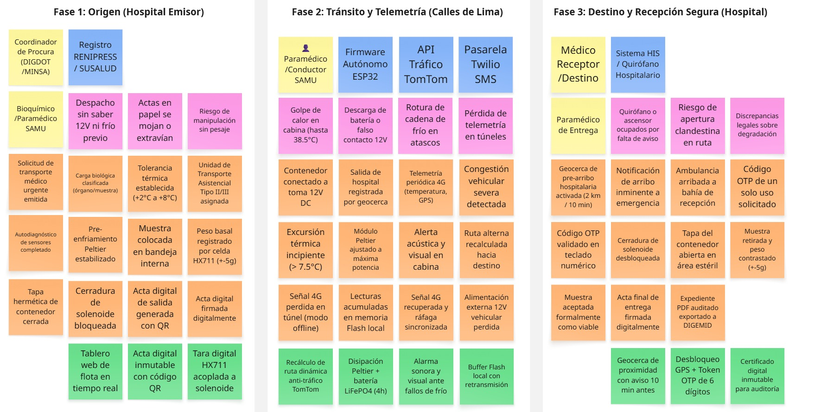

# 2.4. Big Picture EventStorming

El equipo llevó a cabo una sesión formal de **Big Picture Event Storming** con el objetivo de obtener una visión holística y compartida del dominio de negocio del **Contenedor Médico Inteligente (Smart Medical Container)** para el transporte asistencial de muestras biológicas y órganos en Lima Metropolitana. Conforme a las directrices de la rúbrica ABET (Páginas 13 y 29 del documento rector) y las pautas metodológicas de Alberto Brandolini (*EventStorming Journal*, `bit.ly/bpes-guide`), la dinámica integró a especialistas clínicos y logísticos (coordinadores de trasplante de DIGDOT/MINSA, personal de laboratorio y paramédicos de SAMU 106) junto con los ingenieros de software e IoT.

Siguiendo la filosofía original de Brandolini, el Big Picture EventStorming no se diseñó como un diagrama de flujo rígido de ingeniería ni como un BPMN con carriles estructurados, sino como un **lienzo infinito de notas adhesivas (post-its)** en Miro donde el tiempo fluye de manera natural y orgánica de **izquierda a derecha**. A lo largo de la sesión, los participantes exploraron el ciclo de vida completo del transporte médico urgente: desde la solicitud inicial del traslado hasta la recepción conforme en quirófano o laboratorio receptor bajo estricta cadena de frío (2 °C a 8 °C según DIGEMID R.M. N° 833-2015/MINSA) y custodia electrónica inmutable.

El taller transitó por las siguientes etapas:
* **Identificación de Eventos de Dominio (Post-its Naranjas):** Se plasmaron en tiempo pasado los hechos significativos del negocio que marcan cambios de estado irreversibles.
* **Identificación de Puntos Críticos y Dolores Operativos (Post-its Magenta/Rosa - Hotspots):** Se pegaron notas en los puntos del recorrido donde ocurren fricciones reales en Lima (atascos viales severos, calor en cabina de ambulancia, cortes de energía de 12V o pérdida de señal 4G).
* **Identificación de Oportunidades y Actores Clave:** Se ubicaron soluciones de software y hardware IoT para resolver los cuellos de botella detectados.

---

  
*Nota: Elaboración propia en Miro según la metodología de Alberto Brandolini para el transporte asistencial de muestras médicas y órganos en Lima Metropolitana.*

---

### 2.4.1. Análisis del Dominio y Hallazgos de la Sesión

La sesión de Big Picture EventStorming permitió al equipo comprender la dinámica real del transporte médico en Lima Metropolitana y articular las necesidades clínicas con la arquitectura del sistema:

#### 1. Exploración Desestructurada y Línea de Tiempo
El mapeo de eventos evidenció que el transporte asistencial es un proceso altamente concurrente y sensible al tiempo. Mientras el vehículo se desplaza por arterias viales congestionadas, el hardware del contenedor inteligente ejecuta en paralelo un lazo cerrado autónomo de control térmico (manteniendo la carga entre +2.0 °C y +8.0 °C mediante celdas Peltier), registrando la estabilidad del peso y verificando el precinto de seguridad.

#### 2. Matriz de Puntos Críticos (Hotspots) y Oportunidades de Solución

La siguiente matriz sintetiza los problemas operativos reales identificados en la red hospitalaria de Lima y las soluciones de ingeniería de software e IoT implementadas:

<table border="1" cellpadding="6" cellspacing="0">
  <thead>
    <tr>
      <th>Fase Operativa</th>
      <th>Punto Crítico / Hotspot (Problema Real en Lima)</th>
      <th>Severidad</th>
      <th>Oportunidad de Solución (Software / IoT)</th>
      <th>Subdominio DDD</th>
    </tr>
  </thead>
  <tbody>
    <tr>
      <td><strong>Despacho</strong></td>
      <td>Asignación de ambulancias sin visibilidad del estado de su toma de 12V ni del pre-enfriamiento del contenedor.</td>
      <td>Alta</td>
      <td><strong>Tablero IoT de Estado de Flota:</strong> Supervisión en tiempo real de batería, conexión eléctrica y temperatura previa.</td>
      <td><em>Transport Planning</em></td>
    </tr>
    <tr>
      <td><strong>Carga y Custodia</strong></td>
      <td>Riesgo de sustitución de muestras o carga de paquetes no verificados en la rampa hospitalaria.</td>
      <td>Crítica</td>
      <td><strong>Tara Automática con Celda HX711:</strong> Registro de masa inicial (&plusmn;5 g) y bloqueo automático del solenoide.</td>
      <td><em>Smart Container IoT</em></td>
    </tr>
    <tr>
      <td><strong>Carga y Custodia</strong></td>
      <td>Actas en papel autocopiativo mojadas, extraviadas o ilegibles sin respaldo probatorio.</td>
      <td>Media</td>
      <td><strong>Acta Digital con Firma QR:</strong> Comprobante electrónico inalterable consultable en plataforma web.</td>
      <td><em>Chain of Custody</em></td>
    </tr>
    <tr>
      <td><strong>Tránsito</strong></td>
      <td><strong>Congestión severa en Lima (TomTom: 34 min/10 km):</strong> Retrasos críticos en Av. Javier Prado o Vía Expresa.</td>
      <td>Crítica</td>
      <td><strong>Motor de ETA Dinámico:</strong> Recálculo de tiempos con TomTom Traffic API cada 60s y alertas de demora.</td>
      <td><em>Transport Planning</em></td>
    </tr>
    <tr>
      <td><strong>Tránsito</strong></td>
      <td><strong>Golpe de calor en cabina (hasta 38.5 &deg;C):</strong> Rompe la cadena de frío en cajas convencionales en &lt;45 min.</td>
      <td>Catastrófica</td>
      <td><strong>Refrigeración Activa Peltier + Alarma Dual:</strong> Control PID (2&ndash;8 &deg;C), alarma sonora local y push a médicos.</td>
      <td><em>Critical Alerts</em></td>
    </tr>
    <tr>
      <td><strong>Tránsito</strong></td>
      <td><strong>Desconexión accidental de 12V:</strong> El enchufe del encendedor se zafa con baches o frenadas.</td>
      <td>Alta</td>
      <td><strong>Conmutación Automática a Batería Li-Ion:</strong> Pack interno 18650 (6h de autonomía) con aviso en cabina.</td>
      <td><em>Smart Container IoT</em></td>
    </tr>
    <tr>
      <td><strong>Tránsito</strong></td>
      <td><strong>Pérdida de señal 4G en túneles (Línea Amarilla / zanjas):</strong> Provoca vacíos de datos durante el traslado.</td>
      <td>Alta</td>
      <td><strong>Búfer Flash Offline en ESP32:</strong> Almacenamiento local de 5,000 muestras y sincronización al reconectar.</td>
      <td><em>Smart Container IoT</em></td>
    </tr>
    <tr>
      <td><strong>Arribo</strong></td>
      <td>Quirófano o personal de guardia no preparado al llegar la ambulancia por falta de preaviso.</td>
      <td>Alta</td>
      <td><strong>Geocerca de Pre-Arribo (&le; 2 km / 10 min):</strong> Notificación automática al hospital receptor para alistar recepción.</td>
      <td><em>Transport Planning</em></td>
    </tr>
    <tr>
      <td><strong>Entrega</strong></td>
      <td>Apertura indebida en pasillos o entrega a personal no facultado sin validación de identidad.</td>
      <td>Crítica</td>
      <td><strong>Doble Factor de Desbloqueo:</strong> Ubicación obligatoria en geocerca hospitalaria + código OTP temporal.</td>
      <td><em>IAM Context</em></td>
    </tr>
    <tr>
      <td><strong>Cierre</strong></td>
      <td>Rechazo de lotes o litigios por falta de auditoría continua exigida por DIGEMID (R.M. 833-2015).</td>
      <td>Media</td>
      <td><strong>Expediente Digital con Hash SHA-256:</strong> Reporte PDF descargable con telemetría completa y firmas.</td>
      <td><em>Chain of Custody</em></td>
    </tr>
  </tbody>
</table>

---

#### 3. Validación por Storytelling (Narrativa Directa e Inversa)
* **Narrativa Directa (*Forward Storytelling*):** Se repasó la historia de inicio a fin (solicitud en hospital emisor $\rightarrow$ acondicionamiento $\rightarrow$ carga y pesaje $\rightarrow$ viaje con telemetría continua $\rightarrow$ preaviso por geocerca $\rightarrow$ entrega con OTP). Se confirmó que no existen vacíos de responsabilidad entre el médico emisor, el paramédico y el receptor.
* **Narrativa Inversa (*Reverse Storytelling*):** Se tomó el evento final `Muestra Biológica Aceptada` retrocediendo: para ser aceptada, el contenedor debió desbloquearse con OTP verificado dentro de la geocerca hospitalaria; para llegar a destino con frío intacto en pleno tráfico de Lima, debió operar la refrigeración Peltier con respaldo de batería interna; y para registrar la telemetría completa tras pasar túneles, debió operar el búfer flash local.

#### 4. Delimitación de Contextos Delimitados (Bounded Contexts)
La sesión permitió definir con precisión los límites de los cinco **Bounded Contexts** para la arquitectura de software del proyecto:
1. **Transport Planning Context:** Gestión de solicitudes de misión, estado de ambulancias y cálculo de rutas con tráfico en tiempo real.
2. **Smart Container IoT Context:** Ingestión de telemetría de temperatura y peso, gestión de energía y control electromecánico de apertura.
3. **Critical Alerts Context:** Detección de excursiones térmicas, disparador de alarmas locales y notificaciones push de emergencia.
4. **Chain of Custody Context:** Registro de actas digitales, precintos de seguridad con QR y generación de reportes auditables para DIGEMID/DIGDOT.
5. **IAM (Identity & Access Management) Context:** Gestión de roles clínicos y generación de credenciales OTP temporales de un solo uso.
