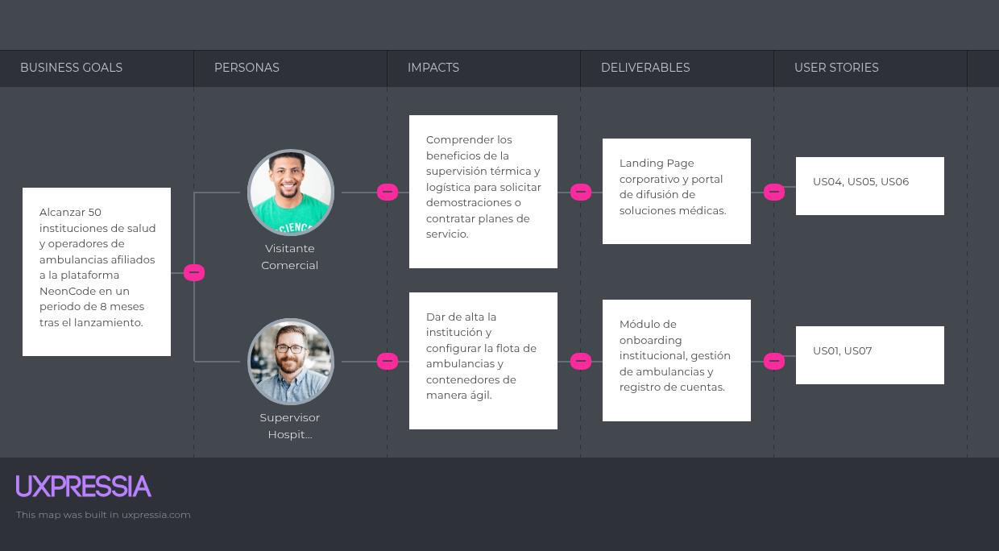
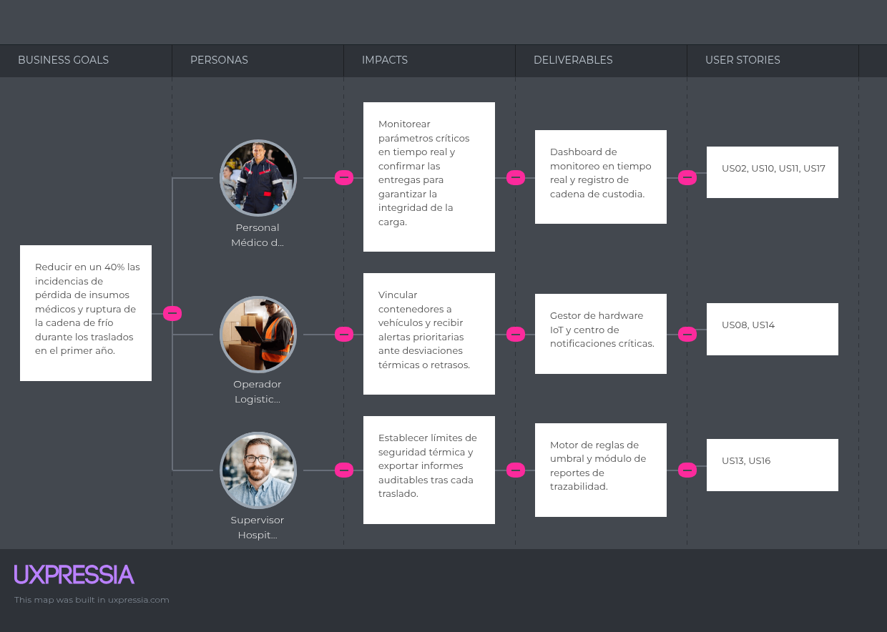

# 3.2. Impact Mapping

El **Impact Mapping** es una técnica de planificación estratégica que conecta los objetivos de negocio de la startup **NeonCode** con las entregas de software para la supervisión de contenedores médicos inteligentes. Este mapa permite priorizar las funcionalidades que generan un impacto directo en el comportamiento de nuestros segmentos objetivo: Personal Médico de Emergencias, Operadores Logísticos de Salud, Supervisores Hospitalarios y Visitantes Comerciales.

### Estructura del Impact Map

El mapa de impacto se compone de cuatro niveles jerárquicos:
1. **Business Goal (Meta de Negocio):** Objetivos SMART que la startup busca alcanzar en un periodo determinado.
2. **Actor / Persona:** Los usuarios o roles que nos ayudarán a alcanzar las metas.
3. **Impact:** Los cambios conductuales o beneficios esperados en los actores.
4. **Deliverables & User Stories:** Los entregables digitales y las historias de usuario asociadas que provocan dichos impactos.

---

### Mapeo Completo por Objetivos de Negocio (Business Goals)

#### Goal 1: Alcanzar 50 instituciones de salud y operadores de ambulancias afiliados a la plataforma NeonCode en un periodo de 8 meses tras el lanzamiento.

* **Actor:** Visitante Comercial
    * **Impact:** Comprender los beneficios de la supervisión térmica y logística para solicitar demostraciones o contratar planes de servicio.
        * **Deliverable:** Landing Page corporativo y portal de difusión de soluciones médicas.
            * **US04:** Exploración de Propuesta de Valor Logística.
            * **US05:** Solicitud de Demostración Corporativa.
            * **US06:** Consulta de Preguntas Frecuentes.

* **Actor:** Supervisor Hospitalario
    * **Impact:** Dar de alta la institución y configurar la flota de ambulancias y contenedores de manera ágil.
        * **Deliverable:** Módulo de onboarding institucional y gestión de flota vehicular.
            * **US01:** Registro de Institución de Salud.
            * **US07:** Alta de Unidades de Ambulancia.

---

#### Goal 2: Reducir en un 40% las incidencias de pérdida de insumos médicos y ruptura de la cadena de frío durante los traslados en el primer año.

* **Actor:** Personal Médico de Emergencia
    * **Impact:** Monitorear parámetros críticos en tiempo real y confirmar las entregas para garantizar la integridad de la carga.
        * **Deliverable:** Dashboard de monitoreo en tiempo real y registro de cadena de custodia.
            * **US02:** Autenticación de Personal de Emergencia.
            * **US10:** Monitoreo Térmico y de Apertura.
            * **US11:** Control de Stock por Sensores de Peso.
            * **US17:** Confirmación de Entrega y Cadena de Custodia.

* **Actor:** Operador Logístico de Salud
    * **Impact:** Vincular contenedores a vehículos y recibir alertas prioritarias ante desviaciones térmicas o retrasos.
        * **Deliverable:** Gestor de hardware IoT y centro de notificaciones críticas.
            * **US08:** Vinculación de Contenedor Inteligente.
            * **US14:** Visualización de Alertas en Ruta.

* **Actor:** Supervisor Hospitalario
    * **Impact:** Establecer límites de seguridad térmica y exportar informes auditables tras cada traslado.
        * **Deliverable:** Motor de reglas de umbral y módulo de reportes de trazabilidad.
            * **US13:** Configuración de Umbrales Térmicos Críticos.
            * **US16:** Generación de Reportes de Trazabilidad.

---

### Captura de los Artefactos en UXPressia

#### Impact Map Goal 1

#### Impact Map Goal 2

