# 4.1. Style Guidelines
Un "Style Guideline" es un conjunto de directrices y normas que establecen los estándares y criterios a seguir en la redacción, diseño y presentación de documentos, contenido web, software y otros productos creativos. A continuación, se presentan las especificaciones detalladas de los parámetros implementados en la estructura de **Medical SmartBox**.

## 4.1.1. General Style Guidelines

### Branding
Para el desarrollo de la identidad de Medical SmartBox, hemos elegido un diseño que encapsula la esencia de la logística médica y la monitorización de precisión. El logotipo y la interfaz presentan una estética limpia y tecnológica, aportando modernidad y máxima legibilidad. La identidad visual fusiona la salud con la tecnología IoT, simbolizando el control total y la trazabilidad de la cadena de frío. La elección de colores, en una combinación de azul marino, verde cerceta (teal) y acentos en coral/rojo, transmite una sensación de confianza, estabilidad técnica y la capacidad de alerta inmediata frente a incidencias. 

### Typography
Para el diseño tipográfico de Medical SmartBox, se ha seleccionado una combinación de fuentes que refleja modernidad y claridad de datos, priorizando la lectura rápida en dashboards operativos.
*   **Bricolage Grotesque:** Fue elegida como la tipografía principal para nuestros encabezados (`h1`, `h2`, `h3`). Su estructura sólida y geométrica otorga al diseño un aire profesional, tecnológico y contemporáneo.
*   **Inter:** Para los párrafos, etiquetas de la interfaz y la visualización de datos numéricos (como telemetría y temperaturas), hemos optado por Inter, una fuente destacada por su altísima legibilidad en pantallas digitales e interfaces ricas en datos, favoreciendo una lectura ágil para los operadores logísticos y personal de salud.

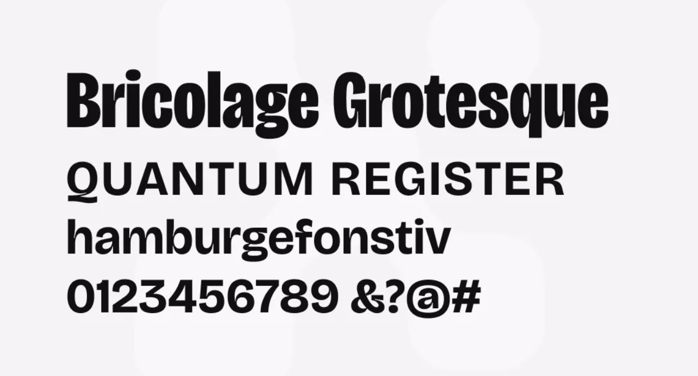
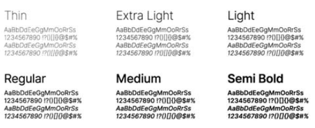

### Colors
La paleta de colores de Medical SmartBox fue seleccionada para reflejar los valores de seguridad, precisión técnica y prevención operativa.
*   **Verde Cerceta (Teal - `#0F7A70`) y Verde Claro (`#B9DDA0`):** Representan el estado óptimo, la salud y las operaciones estables ("En rango").
*   **Azul Marino (`#10312F` / `#1F3C77`):** Evocan profesionalismo, tecnología y la solidez institucional del sector médico.
*   **Coral / Rojo (`#E05A46`):** Utilizado estratégicamente como color de acento para alertas críticas (ej. "Temperatura fuera de rango" o "Batería baja"), garantizando que los incidentes destaquen inmediatamente visualmente.

### Spacing
El espaciado en Medical SmartBox está cuidadosamente definido para garantizar una interfaz limpia, enfocada en la visualización de métricas. Se emplea un diseño modular con separaciones claras (paneles y tarjetas flotantes), lo que mejora la jerarquía de la telemetría en vivo, evita confusiones al monitorear múltiples transportes y aporta equilibrio visual en vistas saturadas de datos.

# 4.1.2. Web Style Guidelines

Medical SmartBox cuenta con un diseño web responsivo para garantizar una experiencia fluida en cualquier dispositivo, permitiendo su uso tanto en paneles de control (operadores logísticos) como en dispositivos móviles (centros de salud recibiendo despachos). Se utiliza un diseño lineal con un "Route Rail" (navegación vertical) que guía al usuario por la narrativa del producto. La barra de navegación superior (pegajosa) mantiene el logotipo a la izquierda, y los controles críticos como el cambio de idioma (ES/EN), el inicio de sesión y el llamado a la acción ("Ir a la Web App") a la derecha.

---

## 4.2. Information Architecture

### 4.2.1. Organization Systems

*   **Visual Organization:**

    Para facilitar la asimilación visual de la información crítica, la plataforma prioriza las tarjetas de telemetría y alertas. En el dashboard, la información más crítica (como alertas rojas de "Temperatura sobre el rango esperado" o desvíos de ETA) tiene el mayor peso visual mediante contrastes cromáticos y tipografía agrandada (clase `.tnum`). La información secundaria tiene colores neutros o silenciados.
*   **Organización Cronológica / Secuencial:**

    Se emplea intensivamente en el módulo de **Trazabilidad (Traceability)**. El historial de un transporte (ej. TR-0417) se divide en hitos secuenciales (Preparado -> Recogido -> En tránsito -> Llegando -> Entregado), permitiendo al usuario ver el ciclo de vida de un envío en orden lógico.
*   **Organización Matricial / Cruzada:**

    Se aplica en el Panel de Operaciones (Flota en ruta) y en el Inbox de Receptores. Los operadores visualizan listas cruzando identificadores de transporte (TR-0417) con métricas dinámicas (Temperatura, ETA, Batería del SmartBox, Estado de Puertas).

### 4.2.2. Labeling Systems

La aplicación utiliza un sistema de etiquetas y terminología adaptado a los dos principales tipos de usuarios: Operadores logísticos y Centros Receptores.

*   **Para el visitante:** Botones directos como "Ir a la Web App" o "Iniciar sesión".
*   **Para los Operadores de Transporte:** Se emplea terminología técnica de monitoreo y flota. Etiquetas como "ETA", "Telemetría en vivo", "Combustible (%)", "Batería (%)" y "Temperatura (°C)". Las alertas usan un lenguaje preciso: "Puerta abierta fuera de parada", "Batería baja del SmartBox".
*   **Para los Centros Receptores (Hospitales/Farmacias):** El enfoque cambia hacia la recepción de paquetes. Etiquetas enfocadas en el estado de llegada: "Envíos entrantes", "Llegan hoy", "Recibido", y confirmaciones como "Conforme".

### 4.2.3. SEO Tags and Meta Tags

Los SEO y meta tags implementados en Medical SmartBox están optimizados para el nicho de logística médica:

*   **Title Tag:**
    `<title>Medical SmartBox — Monitoreo y trazabilidad del transporte médico</title>`
*   **Meta Description:**
    `<meta name="description" content="Medical SmartBox es una plataforma para monitorear transportes médicos, detectar incidencias de temperatura en tiempo real y mantener cada envío y cadena de frío bajo control.">`
*   **Language tag:** (Dinámico vía script, base en inglés y español)
    `<html lang="es">`
*   **Meta Viewport:** (Esencial para responsividad en móviles y paneles de campo)
    `<meta name="viewport" content="width=device-width, initial-scale=1">`
*   **Author tag:**
    `<meta name="author" content="Medical SmartBox Team">`
*   **Canonical Tag:**
    `<link rel="canonical" href="https://www.medicalsmartbox.com/">`

### 4.2.4. Searching Systems

Para asegurar que los usuarios encuentren la unidad o el dato exacto al instante:

*   **Búsqueda global y de flota:** Un input de búsqueda con el placeholder *"Buscar transporte, SmartBox o destino"* y filtros dedicados *"Filtrar por ruta, estado o SmartBox"*.
*   **Búsqueda por Estados (Tabs):** Posibilidad de filtrar vistas rápidamente mediante estados activos como "En tránsito", "Crítica", o "Entregado".

### 4.2.5. Navigation Systems

*   **Navegación principal (Top Nav):** Enlaces ancla directos a secciones clave del producto: *Plataforma, Cómo funciona, Soluciones, Trazabilidad*.
*   **Navegación Vertical de Seguimiento (Route Rail):** Un indicador de progreso visual en el lateral de la pantalla que funciona como un "scrollspy", ubicando al usuario en qué sección de la página (Inicio, Monitoreo, Alertas, Capturas, Datos, etc.) se encuentra.
*   **Controles de Autenticación y Demostración:** Botones persistentes en el encabezado y menús laterales (Drawer) para "Iniciar sesión" o abrir la "Web App" completa.
*   **Selector de Idioma:** Un interruptor claro (Toggle ES/EN) que permite cambiar la internacionalización de la plataforma sin recargar, crucial para equipos logísticos internacionales.

## 4.3. Landing Page UI Design
El diseño de la interfaz de usuario en la landing page de **Medical SmartBox** es clave para causar una primera impresión positiva y transmitir la innovación tecnológica y el rigor que respalda a nuestra solución de monitoreo de la cadena de frío médica. Buscamos ofrecer una experiencia visual limpia, profesional y altamente funcional que inspire confianza e invite a los operadores logísticos, gerentes de distribución farmacéutica y administradores de centros de salud a solicitar una demostración y explorar nuestro ecosistema de monitoreo IoT y trazabilidad en tiempo real.

### 4.3.1. Landing Page Wireframe

*   **Landing Page para Desktop Browser:**
    *   **Hero Section:** Boceto estructural de la sección principal (Hero Section), definiendo un diseño de dos columnas para ubicar la propuesta de valor centrada en la protección de insumos médicos a la izquierda, y un elemento visual destacado a la derecha (preview interactivo del contenedor SmartBox y su telemetría).

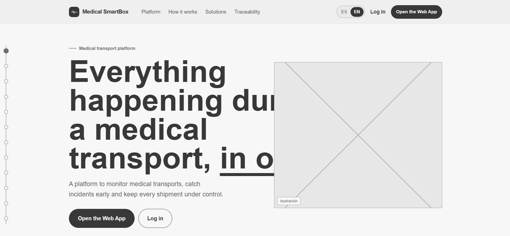

*   **Características de la Plataforma:** Diseño esquemático (layout) para la sección de características clave (*Monitoreo Térmico en Tiempo Real*, *Alertas Predictivas de Incidencias* y *Trazabilidad End-to-End*), utilizando un sistema de cuadrícula para distribuir equitativamente tres tarjetas informativas.

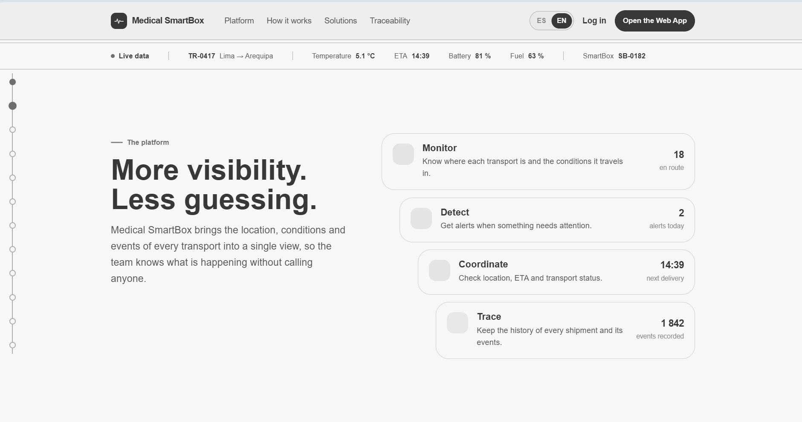

*   **Presentación de la Startup / Quiénes Somos:** Estructura conceptual para la presentación del equipo detrás de Medical SmartBox. Define una cuadrícula adaptable (responsive grid) con cinco espacios reservados para las fotografías y perfiles del equipo desarrollador e ingenieros de software.

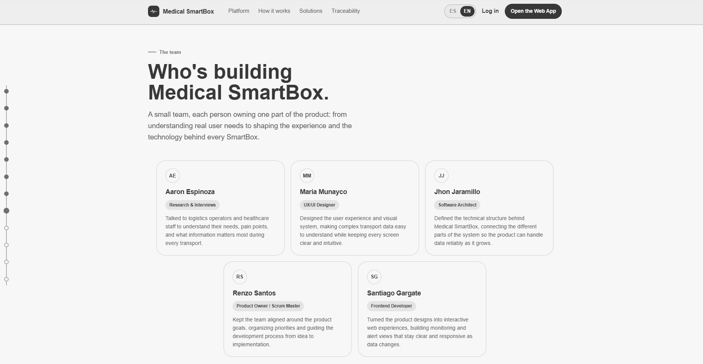

*   **Call to Action (CTA) y Footer:** Maquetación básica para la sección de "Llamado a la Acción", mostrando un formulario centralizado para la solicitud de demostraciones guiadas y el bloque del pie de página con enlaces institucionales, legales y de cumplimiento normativo sanitario.

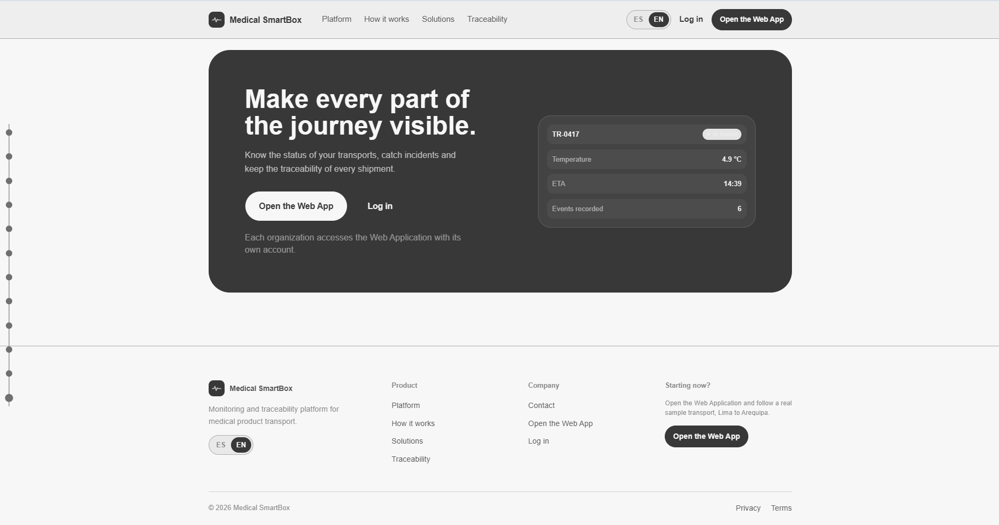

### 4.3.2. Landing Page Mock-up

*   **Hero Section:** Interfaz final del Hero Section. Destaca la integración de la paleta de colores corporativa (Azul Marino `#10312F`, Verde Cerceta `#0F7A70` y Verde Claro `#B9DDA0`), la tipografía moderna (**Bricolage Grotesque** para titulares e **Inter** para cuerpo de texto) y una composición visual de un operador logístico inspeccionando un envío médico con telemetría activa en un dispositivo SmartBox, logrando captar la atención del usuario inmediatamente.
  
* 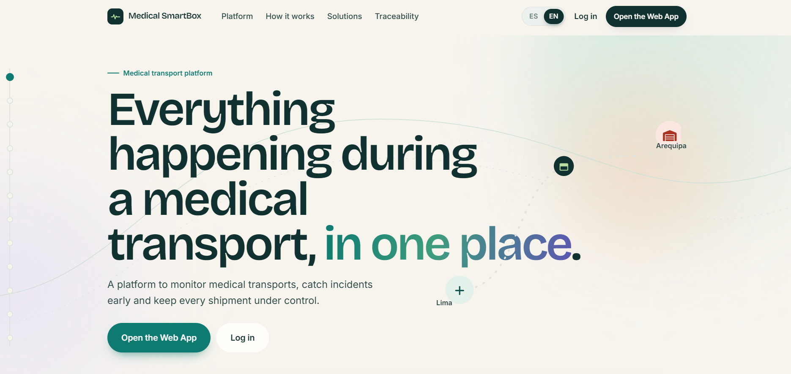

*   **Tarjetas de Servicios:** Implementación final de las tarjetas de servicio (*Telemetría IoT en Vivo*, *Mapeo de Ruta Térmica* y *Alertas Predictivas de Excursión de Temperatura*). Se incorporaron imágenes fotográficas de alta calidad y un diseño de tarjeta limpia (*Clean UI*) con sombras suaves y bordes redondeados para facilitar la lectura de métricas clave.

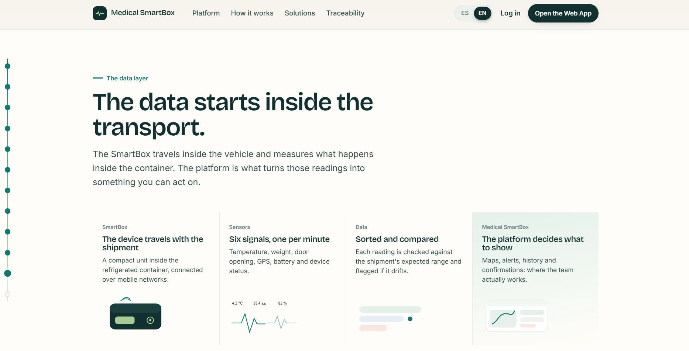

*   **Sección "Quiénes Somos":** Resultado visual de la sección "Quiénes Somos". Presenta formalmente a los cinco ingenieros de software del equipo de Medical SmartBox, transmitiendo transparencia, profesionalismo, solvencia técnica y compromiso con la seguridad en la salud digital.

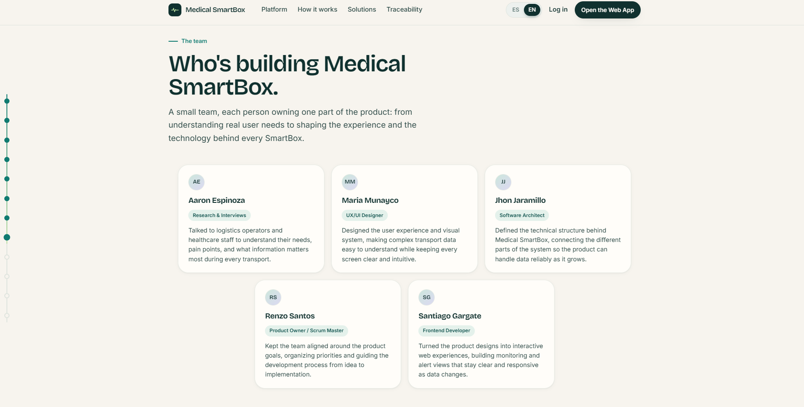

*   **Formulario "Únete a Medical SmartBox":** Versión construida del formulario "Ir a la Web App". Utiliza el fondo azul marino oscuro de la marca para generar un alto contraste con los campos de entrada e incentivar la conversión, cerrando la página con un footer minimalista con políticas de privacidad, certificaciones sanitarias y enlaces legales.

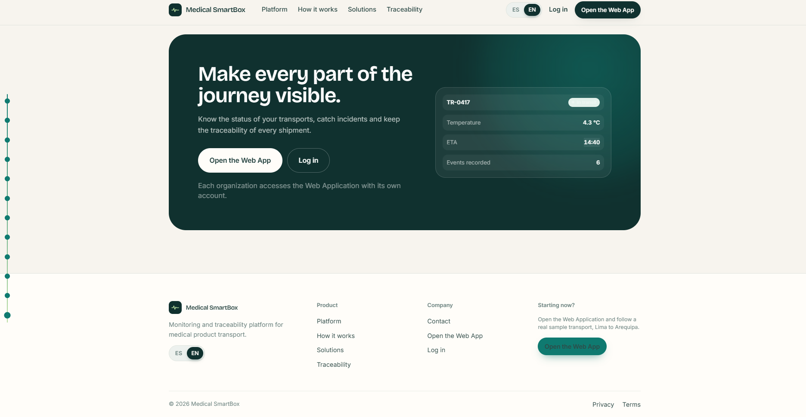
---

# 4.4. Web Applications UX/UI Design

El diseño de experiencia de usuario (UX) y diseño de interfaz de usuario (UI) en la plataforma web de **Medical SmartBox** busca crear una herramienta digital intuitiva, accesible y altamente funcional para operadores logísticos, conductores de transporte médico y personal receptor en hospitales o farmacias. La UX se enfoca en comprender la urgencia y precisión requeridas en la cadena de frío, diseñando flujos de interacción eficientes para monitorear cargas térmicamente sensibles, reaccionar ante desvíos de temperatura y configurar sensores IoT sin fricción.

Por su parte, la UI se encarga del aspecto visual, estructurando de manera clara componentes complejos como dashboards telemétricos en tiempo real, trazabilidad por hitos de envío, gráficos de estabilidad térmica y sistemas de alertas predictivas. Un diseño UX/UI exitoso en Medical SmartBox fusiona una estética tecnológica limpia con la practicidad operativa, ofreciendo una experiencia fluida que transforma datos IoT masivos en decisiones logísticas rápidas que salvan vidas y evitan la merma de medicamentos.

### 4.4.1. Web Applications Wireframes
*   **Acceso y Autenticación Segura:** El flujo de inicio de sesión presenta un diseño *desktop* de dos columnas ("auth-shell"). La izquierda actúa como un panel informativo destacando la propuesta de valor ("Cadena de frío bajo custodia digital") y estadísticas de la flota, mientras que la derecha contiene el formulario de acceso institucional que solicita RUC/Correo y Contraseña. A esto le sigue una pantalla obligatoria de Verificación en Dos Pasos (2FA) mediante un código OTP de 6 dígitos

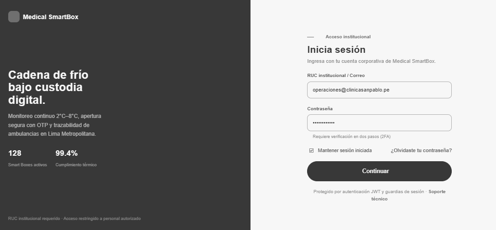

*   **Núcleo Operativo - Dashboard Principal:** El Dashboard general organiza la vista del operador comenzando con una fila de KPIs (unidades en ruta, monitorizadas, alertas críticas y cumplimiento DIGEMID). En el cuerpo central, se emplea una estructura de cuadrícula (`grid-2`) que muestra un mapa de "Flota en tiempo real" a la izquierda y un panel consolidado de "Alertas críticas recientes" a la derecha, finalizando con una tabla inferior para los "Traslados en curso"

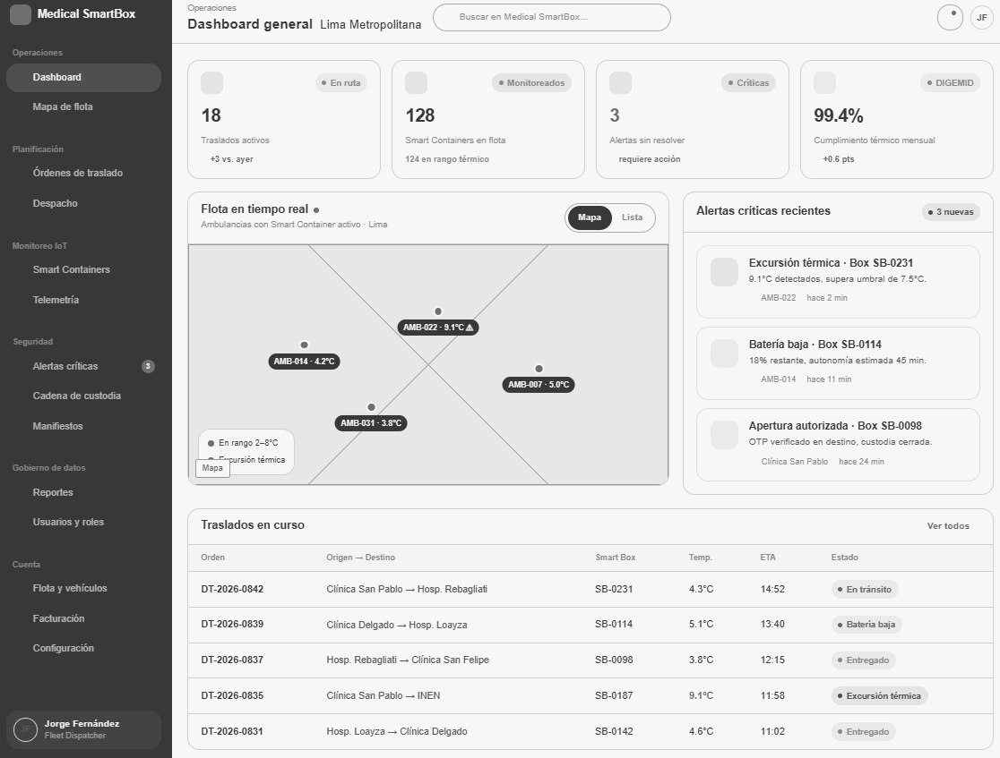

*   **Gestión de Envíos y Tablero de Despacho:** El sistema incluye una lista maestra de "Órdenes de traslado" y un formulario completo para crear una nueva orden validando ventana de isquemia fría y precooling. Además, presenta un Tablero de Despacho en formato Kanban que categoriza los viajes en Pendientes, Despachados, En tránsito y Entregados

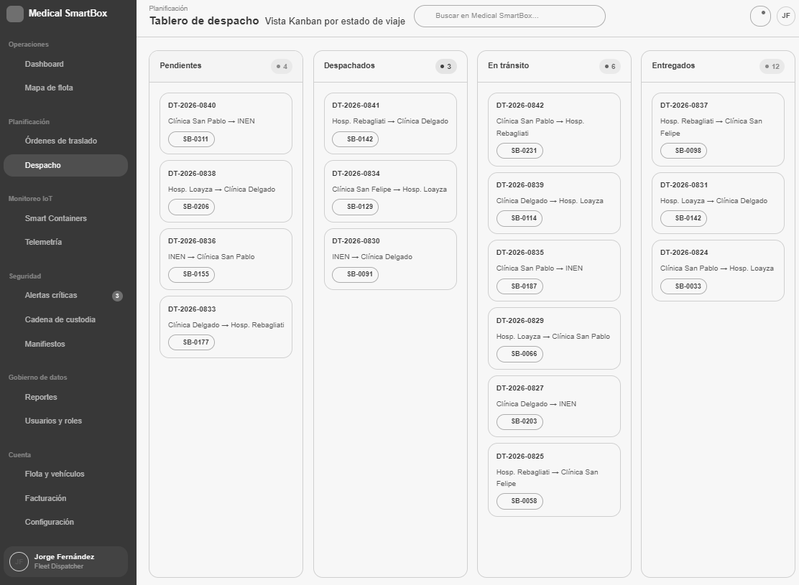

*   **Vista Detallada de Telemetría y Ruta:** La inspección individual de un envío presenta un *stepper* de estado en la parte superior. Debajo, se divide en dos módulos: a la izquierda, el mapa de trazabilidad y ruta en vivo con cálculo de ETA dinámico; a la derecha, las tarjetas telemétricas y medidores (*gauges*) mostrando la temperatura interna en tiempo real (ej. 4.3°C), nivel de batería, estado de cierre y lecturas recientes.

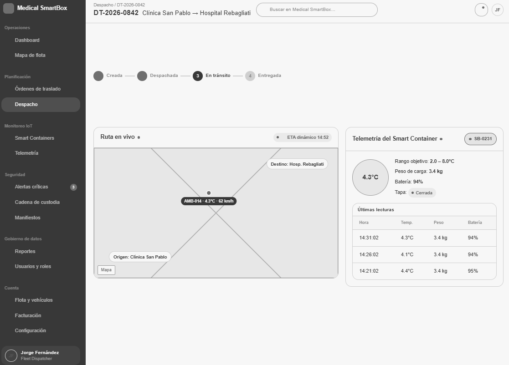

*   **Monitoreo y Control de Smart Containers:** Se incluye un módulo visual tipo *grid* para monitorear todos los contenedores de la flota y una vista de detalle por Smart Container que incluye una curva gráfica de temperatura de las últimas 24 horas. Complementariamente, el sistema permite enviar comandos de desbloqueo remoto de la tapa mediante interacción electromecánica y visualizar el historial completo de excursiones térmicas.

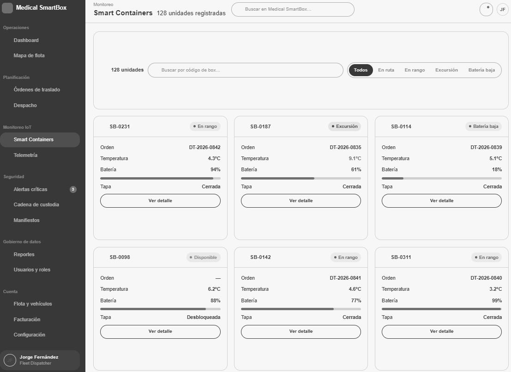

*   **Centro de Alertas y Respuesta a Incidentes:** La plataforma cuenta con una bandeja centralizada para gestionar notificaciones. El detalle de una alerta crítica expone la magnitud de la excursión térmica (temperatura, duración, ubicación), el registro temporal del despacho de alertas (vía SMS y Push) y una sección para que el operador documente las acciones correctivas.

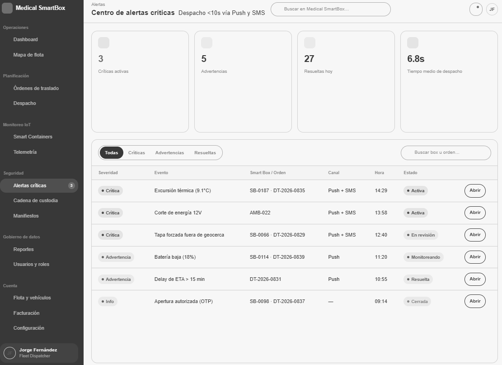

*   **Configuración y Umbrales de Alerta:** Una pantalla de administración dedicada a "Canales de notificación" permite al usuario activar/desactivar notificaciones Push, SMS, Correo y alarmas acústicas. Aquí mismo, en el panel "Umbrales de severidad", se configuran manualmente los límites máximos/mínimos de temperatura y los tiempos límite (SLA) para el envío de alertas.

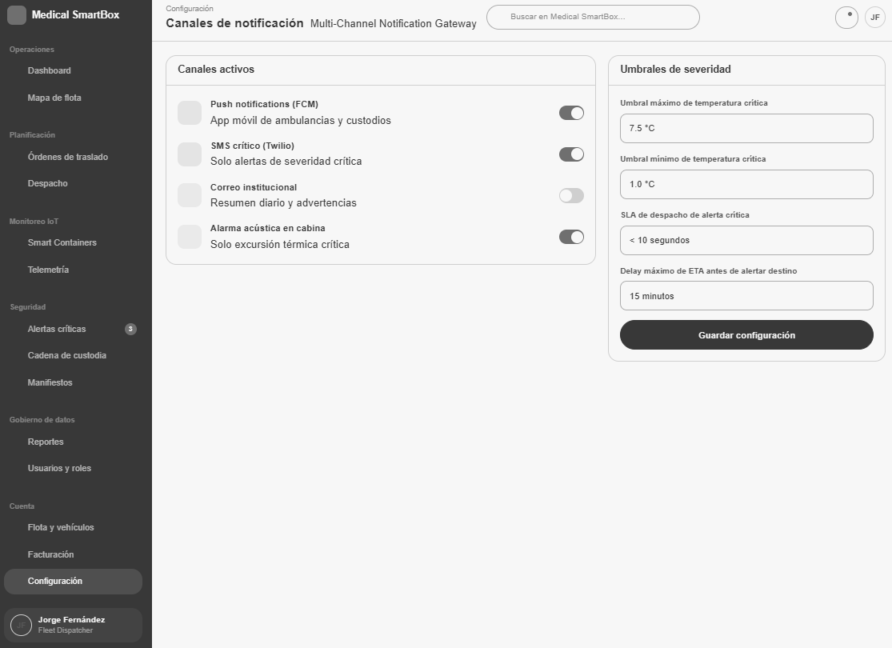

*   **Cadena de Custodia, Manifiestos y Reportes:** El flujo de entrega garantiza la seguridad exigiendo la Verificación OTP en destino y trazando todos los eventos en una Línea de Tiempo de Cadena de Custodia. Administrativamente, se generan Manifiestos Digitales de Auditoría inmutables sellados con SHA-256 y se presenta un consolidado analítico para cumplimiento normativo DIGEMID/DIGDOT

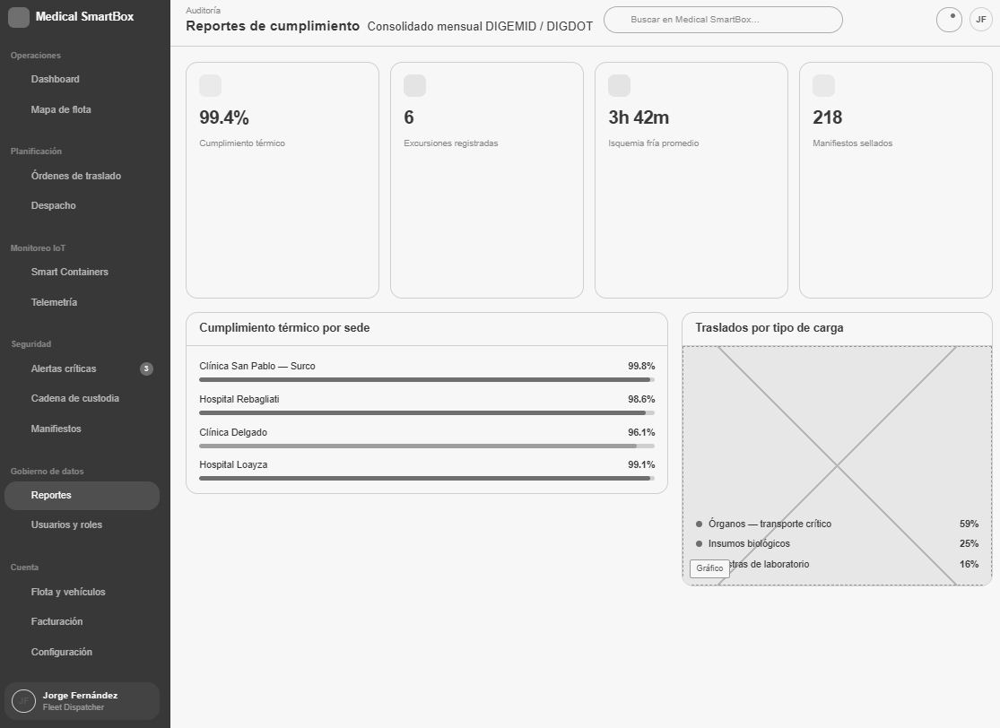

*   **Administración Institucional y B2B:** La plataforma incluye la gestión integral de la suscripción, facturación B2B, vinculación de unidades vehiculares y el control granular de usuarios organizados en roles operativos de logística o perfiles clínicos.
   
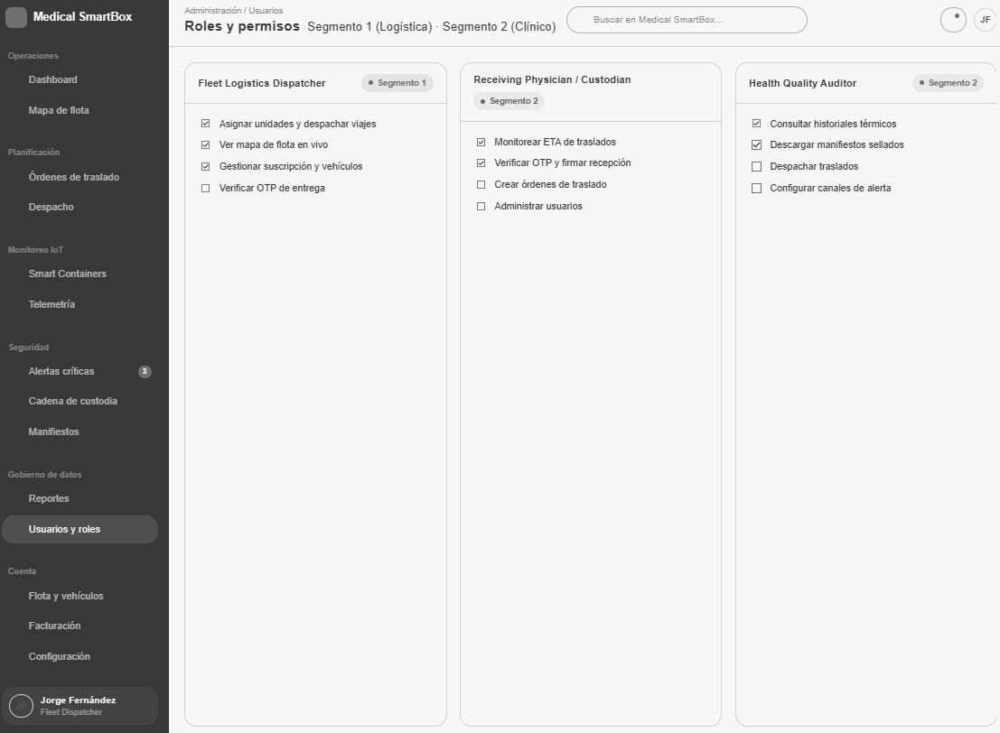

### 4.4.3. Web Applications Mock-ups

Esta imagen presenta el diseño de interfaz de usuario (UI) en alta fidelidad para el flujo de acceso institucional a Medical SmartBox. La vista se divide en dos columnas: el panel izquierdo refuerza la propuesta de valor de la plataforma ("Cadena de frío bajo custodia digital") y muestra estadísticas clave de la flota. El panel derecho contiene el formulario de inicio de sesión, seguido de un flujo obligatorio de Verificación en Dos Pasos (2FA), donde el operador debe ingresar un código OTP de 6 dígitos. Este diseño garantiza un acceso seguro restringido a personal autorizado, manteniendo una estética corporativa e intuitiva.

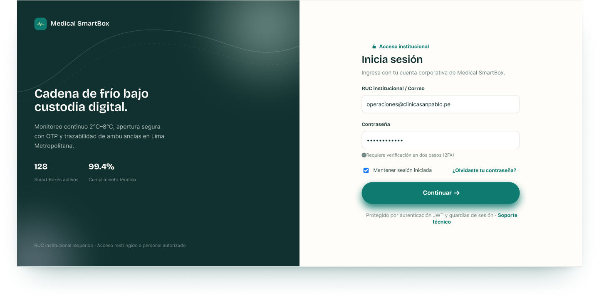

Esta imagen detalla el Dashboard General de Operaciones. La interfaz aprovecha el espacio horizontal para presentar una fila superior de indicadores clave de rendimiento (KPIs), como traslados activos, unidades monitorizadas, alertas críticas y cumplimiento térmico. El cuerpo central se divide en dos áreas principales: a la izquierda, un mapa interactivo que ubica la flota en tiempo real dentro de Lima Metropolitana; a la derecha, un panel que consolida las alertas críticas más recientes. En la parte inferior, una tabla estructurada permite visualizar rápidamente los traslados en curso, ofreciendo al operador logístico un centro de control integral en una sola vista.

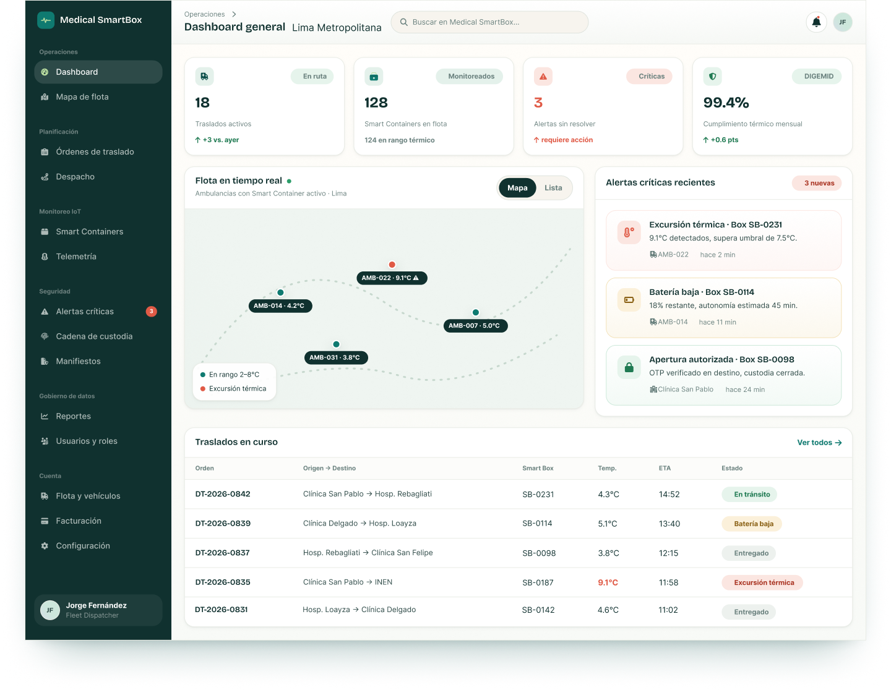

Esta imagen ilustra las interfaces dedicadas a la planificación y seguimiento logístico. El diseño incluye una lista navegable de Órdenes de Traslado y un formulario de creación que integra validaciones automáticas de isquemia fría y pre-enfriamiento del contenedor. Destaca el Tablero de Despacho en formato Kanban, que categoriza visualmente el estado de cada viaje (Pendiente, Despachado, En tránsito, Entregado). Además, la vista de detalle de un viaje específico divide la pantalla para mostrar, simultáneamente, la ruta en vivo con el cálculo de ETA dinámico y la telemetría en tiempo real del Smart Container asociado.

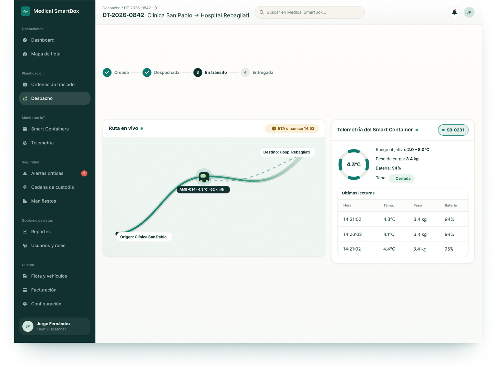

Esta imagen presenta los módulos de monitoreo y control a nivel de hardware IoT. La interfaz ofrece una vista en cuadrícula de todos los Smart Containers activos. Al inspeccionar una unidad individual (SB-0231), el usuario accede a un panel detallado que muestra medidores circulares (*gauges*) para la temperatura actual y el nivel de batería, junto con un gráfico que traza la curva térmica de las últimas 24 horas. Estos paneles también incluyen herramientas para revisar el historial completo de excursiones térmicas exportable para auditoría, y controles directos para accionar el bloqueo o desbloqueo electromecánico de la tapa del contenedor mediante comandos MQTT.

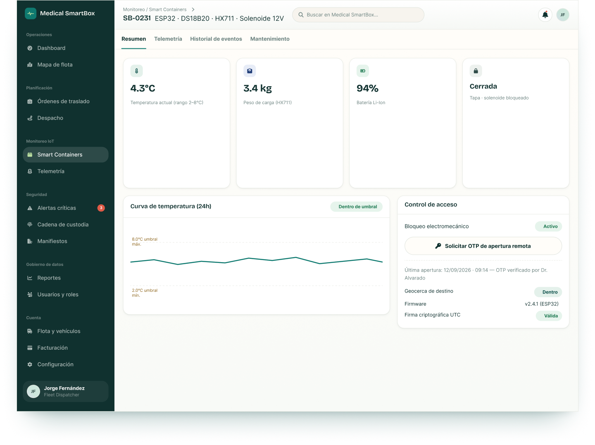

Esta imagen expone el Centro de Alertas Críticas y la gestión de incidentes. La bandeja principal clasifica las notificaciones por severidad, permitiendo al operador priorizar la atención. El detalle de un incidente (por ejemplo, una excursión térmica crítica) presenta una vista estructurada que documenta la temperatura registrada, la duración fuera del umbral, y un registro temporal (*timeline*) del despacho automático de notificaciones vía Push y SMS. La interfaz fomenta la resolución eficiente al incluir un campo de texto donde el operador puede registrar las acciones correctivas tomadas y un botón para marcar la alerta como resuelta.

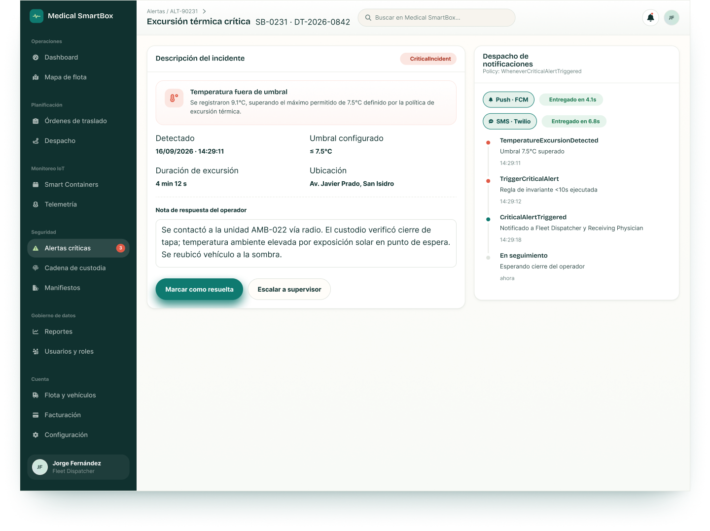

Esta imagen detalla el panel de Perfil, Configuración y roles de acceso. La interfaz de configuración permite al administrador gestionar los "Canales de notificación", activando o desactivando avisos vía SMS, Push, correo y alarma acústica, así como definir los umbrales de temperatura y SLA críticos. Complementariamente, se incluyen vistas para la gestión del personal, donde se listan los usuarios activos y se asignan permisos granulares a través de perfiles específicos, divididos entre el segmento operativo (Fleet Logistics Dispatcher) y el segmento clínico (Receiving Physician, Health Quality Auditor).

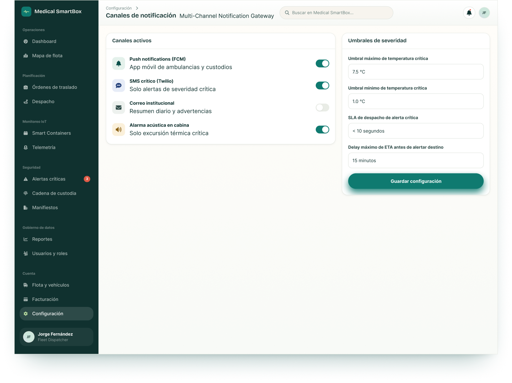

Esta imagen muestra los módulos orientados a la auditoría, la trazabilidad y el cumplimiento normativo. Destaca el flujo de entrega, que exige la validación de un código OTP en el punto de destino para desbloquear el contenedor, evento que queda registrado en la Línea de Tiempo de Cadena de Custodia. El sistema genera manifiestos digitales de cada traslado, los cuales son sellados criptográficamente (SHA-256) para garantizar su inmutabilidad. Finalmente, un panel de reportes consolida el rendimiento térmico mensual de las distintas sedes, facilitando la presentación de datos ante entidades regulatorias como DIGEMID.

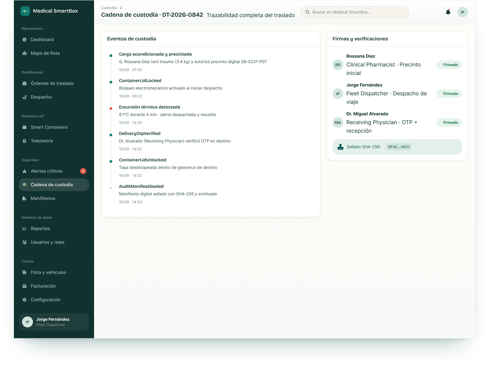

### 4.4.4. Web Applications User Flow Diagrams

El diagrama de flujo de usuario es una representación visual de las acciones secuenciales que un operador logístico, supervisor hospitalario o personal médico realiza al interactuar con el ecosistema digital de NeonCode. A continuación se presentan tres diagramas de flujo clave adaptados a las historias de usuario de la plataforma, detallando el *Happy Path* (ruta ideal) y las ramificaciones alternativas (errores de validación, fallas de conectividad IoT y desviaciones en la cadena de frío).

**User Flow 1: Autenticación de Personal y Acceso al Panel**
*   **User Stories relacionadas:** US01, US02
*   **Flujos incluidos:** *Happy Path* (autenticación exitosa y acceso al panel), credenciales inválidas, cuenta institucional no activada, campos incompletos y reintentos de sesión.

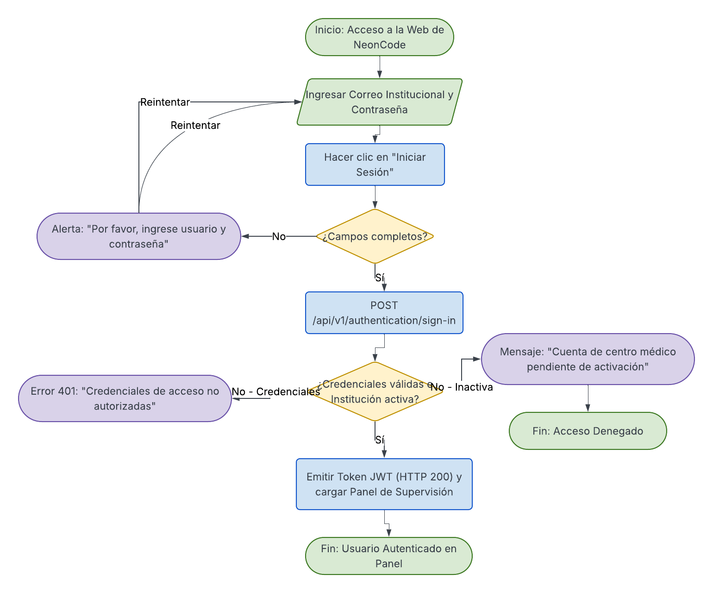

**User Flow 2: Alta de Ambulancia y Vinculación de Contenedor Inteligente**
*   **User Stories relacionadas:** US07, US08
*   **Flujos incluidos:** *Happy Path* (registro de vehículo y asignación telemétrica de contenedor), matrícula de ambulancia duplicada, ID de contenedor no encontrado, contenedor previamente asignado a otro vehículo y falla de enlace telemétrico inicial.

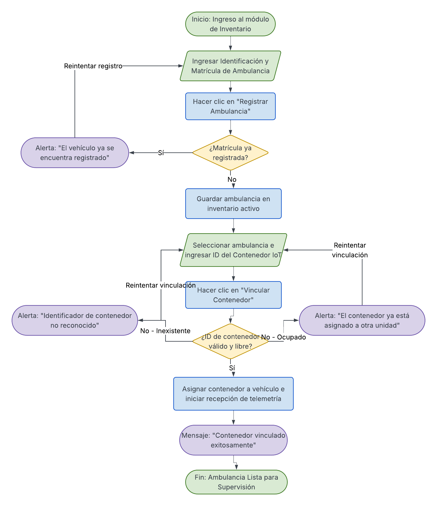

**User Flow 3: Monitoreo Térmico en Ruta, Gestión de Alertas y Cierre de Custodia**
*   **User Stories relacionadas:** US10, US11, US13, US14, US17
*   **Flujos incluidos:** *Happy Path* (monitoreo en tiempo real, recepción de alerta por variación térmica, acción correctiva y confirmación de entrega), pérdida de señal del contenedor, umbral térmico no configurado, variación de stock por sensores de peso e incidencia no resuelta en ruta.

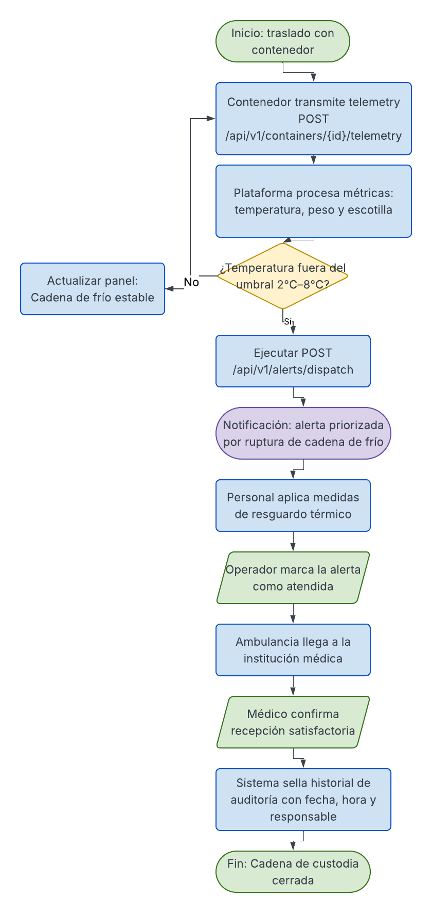

## 4.5. Web Applications Prototyping
El prototipo adjunta la representación visual de los mock-ups anteriormente mostrados y diseños interactivos, pero no cuenta con código real detrás.

Para este proyecto usamos la herramienta de Figma. Véase el anexo 3 para mayor información
