# **4.6. Domain-Driven Software Architecture**

En este capítulo se formula la propuesta integral de arquitectura de software para la plataforma **Medical SMARTBOX**, articulando los hallazgos del modelado exploratorio preliminar con los patrones tácticos y estratégicos de **Domain-Driven Design (DDD)** concebidos por Eric Evans y Alberto Brandolini. A partir de los flujos identificados en el Big Picture EventStorming (Capítulo 2.4), se profundiza en la descomposición del dominio en Bounded Contexts, Agregados, Eventos de Dominio, Comandos y Consultas (Queries CQRS), estableciendo fronteras de consistencia transaccional de alta cohesión y bajo acoplamiento.

Para representar la arquitectura de forma rigurosa, comprensible y estandarizada entre perfiles clínicos, operadores logísticos y equipos de desarrollo, se adopta el **C4 Model** propuesto por Simon Brown. La arquitectura se organiza y documenta progresivamente a través de las siguientes secciones:
* **4.6.1. Design-Level EventStorming:** Descomposición táctica del dominio, identificación de invariantes y delimitación formal de Bounded Contexts.
* **4.6.2. Software Architecture Context Level Diagram (C4 Nivel 1):** Delimitación perimetral del sistema frente a los actores asistenciales y sistemas externos.
* **4.6.3. Software Architecture Container Level Diagrams (C4 Nivel 2):** Descomposición en unidades ejecutables independientes y tecnologías del stack oficial.
* **4.6.4. Software Architecture Component Level Diagrams (C4 Nivel 3):** Diseño modular interno bajo los principios de Clean Architecture e Inversión de Dependencias.

---

## **4.6.1. Design-Level EventStorming**

### **1. Introducción y Ficha Técnica del Taller Colaborativo**

A partir de la exploración macro realizada en el **Big Picture EventStorming (Capítulo 2.4)**, se ejecutó una sesión formal de **Design-Level EventStorming (DLES)** bajo los principios canónicos de Domain-Driven Design concebidos por Alberto Brandolini y las pautas tácticas de Nick Tune.

El objetivo primordial del Design-Level EventStorming es **cerrar la brecha entre la visión general del negocio y el diseño detallado de software orientado a objetos y arquitectura de microservicios/módulos DDD**, descomponiendo los procesos asistenciales en sus componentes transaccionales atómicos: Comandos, Consultas (Queries), Agregados con invariantes de negocio protegidas, Eventos de Dominio inmutables, Políticas reactivas (*Whenever-Then*), Modelos de Lectura (Read Models) y puntos de integración ciberfísica IoT.

#### Ficha Técnica de la Sesión Colaborativa
* **Modalidad y Alcance:** Sesión estructurada de modelado colaborativo intensivo y sincrónico orientada a la descomposición táctica del dominio.
* **Entorno y Herramienta:** Pizarra digital en **Miro**, organizada por carriles transaccionales y matrices de notas adhesivas digitales.
* **Participantes y Roles Multidisciplinarios:**
  * *Facilitador DDD y Arquitecto de Software:* Moderación del flujo temporal y preservación de fronteras transaccionales.
  * *Especialista en Hardware IoT y Firmware:* Definición de interacción con microcontrolador ESP32, sensores térmicos Peltier y celda HX711.
  * *Coordinador de Logística y Despacho Asistencial (Segmento 1):* Modelado de rutas críticas, contingencias en el tráfico de Lima y alimentación de 12V.
  * *Director Farmacéutico y Auditor Sanitario (Segmento 2):* Definición de límites de isquemia fría, actas inmutables y normativas DIGEMID (R.M. N° 833-2015).
* **Fases del Taller de Modelado Colaborativo (Brandolini & Tune):** 1) Generación divergente de eventos y comandos; 2) Agrupación en Agregados Raíz y blindaje de invariantes; 3) Definición de Consultas y Modelos de Lectura para interfaces web/móvil; 4) Modelado de políticas reactivas de orquestación; 5) Identificación de servicios externos y subsistemas de telemetría.

#### Convención Cromática Oficial de Post-its (Notación DDD Estándar)

Durante el taller colaborativo se aplicó el código de colores estandarizado internacionalmente para el modelado con notas adhesivas en pizarra digital:

| Tipo de Artefacto DDD | Color de Post-it | Notación y Sintaxis | Descripción y Propósito en el Dominio |
|---|---|---|---|
| **Domain Event** | Naranja (`#FFA500`) | Verbo en pasado participio (Inglés) | Hecho irreversible en el sistema (`ContainerLocked`, `ExcursionDetected`). |
| **Command** | Azul (`#2196F3`) | Verbo en imperativo / presente | Acción disparada por un actor o sistema (`LockContainer`, `LogTelemetry`). |
| **Query (CQRS)** | Azul Claro / Cian (`#80DEEA`) | Petición de lectura en presente | Consulta optimizada que proyecta información sin mutar el estado (`GetActiveTransportsQuery`, `GetTelemetrySnapshotQuery`). |
| **Aggregate Root** | Amarillo Ocre (`#FFF59D`) | Sustantivo en singular | Frontera de consistencia transaccional (`SmartContainer`, `MedicalTransport`). |
| **Business Policy / Rule** | Lila / Morado (`#BA68C8`) | *"Whenever [Event] THEN [Command]"* | Regla reactiva o de orquestación de negocio. |
| **Read Model / UI View** | Verde Claro (`#81C784`) | Nombre de la proyección / vista | Información requerida en pantalla para que el actor decida (`ActiveTransportsView`). |
| **Actor / User Role** | Amarillo Pálido (`#FFF9C4`) | Rol formal del usuario | Representa a los actores de los 2 segmentos objetivo (`Driver`, `Pharmacist`). |
| **External System / IoT** | Rosa / Fucsia (`#F48FB1`) | Nombre del sistema / hardware | Entidad ajena a la plataforma (`ESP32 Hardware`, `OBD-II Telemetry`, `FCM/Twilio`). |
| **Hotspot / Risk / Exception** | Rojo / Magenta (`#E53935`) | Problema o riesgo crítico | Fricción del entorno operativo de Lima (`12V Socket Disconnect`, `TomTom Traffic Delay`). |

---

### **2. Matriz Estratégica de Clasificación de Bounded Contexts**

Bajo los principios de Domain-Driven Design para arquitecturas SaaS en entornos asistenciales y logísticos, el dominio de **Medical SMARTBOX** se estructura en **seis (6) Bounded Contexts**, balanceando subdominios estratégicos (*Core Domains*), de soporte (*Supporting Subdomains*) y genéricos (*Generic Subdomains*).

A diferencia de la exploración macro de Big Picture (Capítulo 2.4), en esta etapa de diseño detallado se independizó el contexto **Subscription & Fleet Provisioning** como un *Subdominio de Soporte*. Esta separación aísla los contratos comerciales de suscripción B2B, la tarificación modular por factor de forma (*Small Box* de 5L vs. *Standard Box* de 20L) y la vinculación telemática de activos vehiculares del flujo clínico asistencial de los *Core Domains*, garantizando alta cohesión y bajo acoplamiento para los **dos segmentos objetivo** del proyecto:

<table border="1" cellpadding="6" cellspacing="0" style="border-collapse: collapse; width: 100%;">
  <thead>
    <tr>
      <th>Bounded Context</th>
      <th>Clasificación Estratégica</th>
      <th>Responsabilidad Primaria en el Sistema</th>
      <th>Agregados Principales (Aggregate Roots)</th>
      <th>Segmento Objetivo Atendido</th>
    </tr>
  </thead>
  <tbody>
    <tr>
      <td><strong>1. Identity & Access Management (IAM)</strong></td>
      <td><em>Generic Subdomain</em></td>
      <td>Autenticación multifactor (2FA), gestión de sesiones JWT, roles asistenciales y asignación institucional.</td>
      <td><code>UserAccount</code>, <code>RolePermission</code>, <code>MedicalOrganization</code></td>
      <td>Segmento 1 (Operadores de transporte) y Segmento 2 (Centros de salud).</td>
    </tr>
    <tr>
      <td><strong>2. Subscription & Fleet Provisioning</strong></td>
      <td><em>Supporting Subdomain</em></td>
      <td>Gestión comercial SaaS de suscripciones por número de contenedores y tamaño de box (*Small* vs. *Standard*), y vinculación con la ambulancia.</td>
      <td><code>SubscriptionPlan</code>, <code>ContainerDevice</code>, <code>VehicleBinding</code></td>
      <td>Segmento 1 (Vínculo con flota) y Segmento 2 (Contratación B2B).</td>
    </tr>
    <tr>
      <td><strong>3. Medical Transport Planning & Dispatching</strong></td>
      <td><em>Core Domain</em></td>
      <td>Programación de traslados de emergencia, control de tiempos de isquemia fría, selección de rutas anti-congestión en Lima y cálculo de ETA.</td>
      <td><code>TransportOrder</code>, <code>DispatchTrip</code></td>
      <td>Segmento 1 (Conducción y despacho) y Segmento 2 (Programación de quirófano).</td>
    </tr>
    <tr>
      <td><strong>4. Smart Container & Telemetry Monitoring</strong></td>
      <td><em>Core Domain (Diferenciador)</em></td>
      <td>Ingesta continua de telemetría IoT desde el ESP32: temperatura Peltier (2°C-8°C), tara/peso neto HX711, bloqueo solenoide, acelerómetro y 12V vehicular.</td>
      <td><code>SmartContainer</code>, <code>TelemetrySnapshot</code></td>
      <td>Segmento 1 (Cuidado de energía en ruta) y Segmento 2 (Monitoreo de conservación).</td>
    </tr>
    <tr>
      <td><strong>5. Critical Alerting & Incident Response</strong></td>
      <td><em>Core Domain</em></td>
      <td>Motor de evaluación de umbrales en tiempo real, disparo omnicanal de alertas (Push/SMS), escalamiento y registro de contingencias.</td>
      <td><code>AlertRule</code>, <code>CriticalIncident</code>, <code>ContingencyResolution</code></td>
      <td>Segmento 1 (Acción inmediata en cabina) y Segmento 2 (Prevención de pérdida).</td>
    </tr>
    <tr>
      <td><strong>6. Chain of Custody & Traceability</strong></td>
      <td><em>Core Domain / Regulatorio</em></td>
      <td>Trazabilidad inmutable legal y sanitaria (DIGEMID R.M. 833-2015): despacho con QR, apertura en destino con OTP y acta digital de entrega.</td>
      <td><code>CustodyTransfer</code>, <code>DigitalAuditManifest</code></td>
      <td>Segmento 2 (Recepción en farmacia/quirófano y auditoría DIGDOT).</td>
    </tr>
  </tbody>
</table>

#### Mapeo Formal de Bounded Contexts a la Taxonomía SaaS del Dominio

Para corroborar la cobertura integral del modelo respecto a los requisitos de plataformas SaaS para salud y logística crítica, la siguiente matriz correlaciona los subdominios de la taxonomía SaaS estándar con la partición arquitectónica en Bounded Contexts adoptada en **Medical SMARTBOX**:

<table border="1" cellpadding="6" cellspacing="0" style="border-collapse: collapse; width: 100%;">
  <thead>
    <tr>
      <th>Subdominio SaaS Estándar</th>
      <th>Bounded Context Asignado</th>
      <th>Tipo DDD</th>
      <th>Justificación de Diseño y Cobertura Operativa</th>
    </tr>
  </thead>
  <tbody>
    <tr>
      <td><strong>1. Autenticación y Autorización (IAM)</strong></td>
      <td>Identity & Access Management (IAM)</td>
      <td><em>Generic</em></td>
      <td>Centraliza credenciales JWT, control de acceso basado en roles (RBAC) para ambos segmentos y registro formal de sedes con código RENIPRESS.</td>
    </tr>
    <tr>
      <td><strong>2. Facturación y Suscripciones B2B</strong></td>
      <td>Subscription & Fleet Provisioning</td>
      <td><em>Supporting</em></td>
      <td>Modela planes institucionales mensuales, tarificación por flota activa y capacidad asignada de contenedores (5L vs. 20L).</td>
    </tr>
    <tr>
      <td><strong>3. Planificación y Despacho Operativo</strong></td>
      <td>Medical Transport Planning & Dispatching</td>
      <td><em>Core</em></td>
      <td>Coordina la asignación de ambulancias, cálculo de tiempos de isquemia y rutas óptimas evitando la congestión vehicular de Lima.</td>
    </tr>
    <tr>
      <td><strong>4. Monitoreo e Ingestión Telemática IoT</strong></td>
      <td>Smart Container & Telemetry Monitoring</td>
      <td><em>Core</em></td>
      <td>Procesa el flujo sensorial de temperatura, peso y batería vía MQTT TLS, y gestiona el estado electromecánico del cerrojo.</td>
    </tr>
    <tr>
      <td><strong>5. Gestión de Contingencias y Alertas</strong></td>
      <td>Critical Alerting & Incident Response</td>
      <td><em>Core</em></td>
      <td>Evalúa desviaciones térmicas y demoras de tráfico en tiempo real, despachando notificaciones omnicanal (Push/SMS).</td>
    </tr>
    <tr>
      <td><strong>6. Auditoría, Custodia y Cumplimiento</strong></td>
      <td>Chain of Custody & Traceability</td>
      <td><em>Core</em></td>
      <td>Asegura la inviolabilidad de entrega mediante token OTP y genera el acta digital inmutable con hash SHA-256 (DIGEMID).</td>
    </tr>
    <tr>
      <td><strong>7. Analítica y Métricas de Rendimiento</strong></td>
      <td>Consolidado en Telemetry Monitoring y Chain of Custody</td>
      <td><em>Supporting</em></td>
      <td>Se resuelve mediante modelos de lectura (<em>Read Models</em>) y reportes consolidados de cumplimiento térmico sin requerir un microservicio analítico separado.</td>
    </tr>
    <tr>
      <td><strong>8. Fidelización y Retención B2B (<em>Engagement</em>)</strong></td>
      <td>Integrado en Subscription & Fleet Provisioning</td>
      <td><em>Supporting</em></td>
      <td>En el modelo B2B interinstitucional (hospitales, redes de ambulancias), la fidelización no se gestiona mediante puntos de consumo masivo, sino a través de Acuerdos de Nivel de Servicio (SLA garantizado de respuesta técnica) y reportes ejecutivos de efectividad operativa.</td>
    </tr>
  </tbody>
</table>

A nivel de descomposición analítica de dominio, la gestión contractual de flotas (`Subscription & Fleet Provisioning`) se modela tácticamente como un subdominio de soporte independiente de la autenticación pura de usuarios (`IAM`). En la posterior fase de diseño de clases y persistencia relacional, ambos contextos se agrupan de forma cohesionada bajo un esquema unificado (`IAM & Subscriptions`). Dicha decisión de ingeniería optimiza las transacciones de validación de cuotas multi-inquilino (*multi-tenancy*), garantizando que las credenciales del personal médico y la disponibilidad de cajas inteligentes se resuelvan dentro de la misma frontera transaccional en la base de datos.

---

### **3. Diagrama Panorámico de Integración de Bounded Contexts**

Este diagrama macro ilustra cómo interactúan los seis contextos mediante el intercambio de eventos de dominio asíncronos y comandos de orquestación, asegurando un desacoplamiento de bajo acoplamiento y alta cohesión.

---

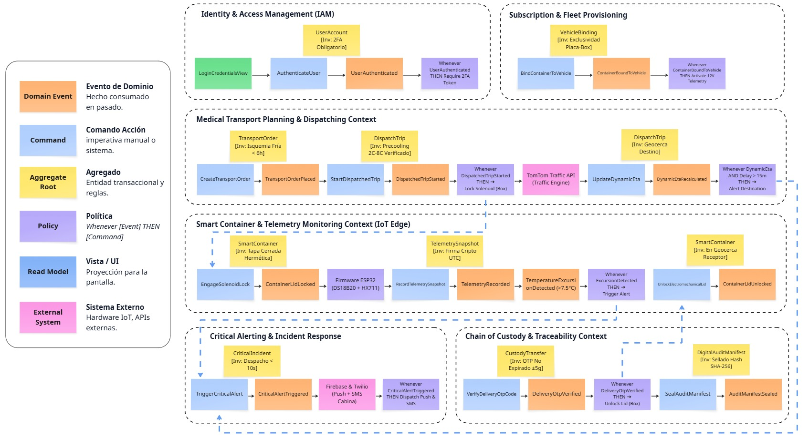  
*Nota: Elaboración propia en Miro según la técnica de modelado colaborativo Design-Level EventStorming para Medical SMARTBOX.*

---

### **4. Desglose Exhaustivo por Bounded Context**

A continuación se detalla la especificación transaccional completa para cada uno de los seis Bounded Contexts, definiendo sus responsabilidades de negocio, agregados, invariantes inviolables, matrices de artefactos DDD y flujos de ejecución.

---

#### **4.6.1.1. Bounded Context 1: Identity & Access Management (IAM)**

* **Clasificación:** *Generic Subdomain*  
* **Alineación con Segmentos:** Centraliza la gobernanza de identidades para el **Segmento 1** (conductores de ambulancia, técnicos paramédicos y despachadores logísticos) y el **Segmento 2** (químicos farmacéuticos, médicos cirujanos de trasplante y auditores de calidad hospitalaria).

##### Agregados Raíz e Invariantes de Negocio

1. **`UserAccount` (Aggregate Root):**
   * *Invariante 1.1:* Ningún usuario puede activar una sesión operativa sin haber completado la verificación de doble factor (2FA vía TOTP/SMS).
   * *Invariante 1.2:* Los usuarios con rol de conductor de ambulancia (`AmbulanceDriver`) deben contar obligatoriamente con número de brevete profesional (A-IIb o A-III) vigente registrado en el perfil.
2. **`MedicalOrganization` (Aggregate Root):**
   * *Invariante 1.3:* Toda sede de centro de salud receptora debe contar con el código único RENIPRESS (Registro Nacional de IPRESS - MINSA) validado antes de ser autorizada como punto de origen o destino de carga médica.

##### Matriz de Artefactos DDD - Contexto IAM

<table border="1" cellpadding="5" cellspacing="0" style="border-collapse: collapse; width: 100%;">
  <thead>
    <tr>
      <th>Query CQRS (Cian)</th>
      <th>Read Model (Verde)</th>
      <th>Actor (Amarillo)</th>
      <th>Command (Azul)</th>
      <th>Aggregate (Ocre)</th>
      <th>Domain Event (Naranja)</th>
      <th>Policy / Regla Reactiva (Morada)</th>
    </tr>
  </thead>
  <tbody>
    <tr>
      <td><code>GetUserProfileQuery</code></td>
      <td><code>LoginCredentialsView</code></td>
      <td>Cualquier Usuario</td>
      <td><code>AuthenticateUser</code></td>
      <td><code>UserAccount</code></td>
      <td><code>UserAuthenticated</code></td>
      <td><em>Whenever [UserAuthenticated] THEN [SendTwoFactorChallengeCommand]</em></td>
    </tr>
    <tr>
      <td><code>ValidateUserCredentialsQuery</code></td>
      <td><code>OtpChallengeView</code></td>
      <td>Paramédico / Médico</td>
      <td><code>ValidateTwoFactorToken</code></td>
      <td><code>UserAccount</code></td>
      <td><code>SessionAccessGranted</code></td>
      <td><em>Whenever [SessionAccessGranted] THEN [IssueScopedJwtTokenCommand]</em></td>
    </tr>
    <tr>
      <td><code>GetAssignedRolesQuery</code></td>
      <td><code>DriverRegistryView</code></td>
      <td>Coordinador Flota (Seg. 1)</td>
      <td><code>RegisterDriverProfile</code></td>
      <td><code>UserAccount</code></td>
      <td><code>DriverProfileEnrolled</code></td>
      <td><em>Whenever [DriverProfileEnrolled] THEN [AuthorizeEmergencyVehicleBindingCommand]</em></td>
    </tr>
    <tr>
      <td><code>GetMedicalOrganizationByRenipressQuery</code></td>
      <td><code>OrganizationProfileView</code></td>
      <td>Administrador Clínico (Seg. 2)</td>
      <td><code>RegisterMedicalOrganization</code></td>
      <td><code>MedicalOrganization</code></td>
      <td><code>MedicalOrganizationEnrolled</code></td>
      <td><em>Whenever [MedicalOrganizationEnrolled] THEN [ValidateRenipressRegistrationCommand]</em></td>
    </tr>
  </tbody>
</table>

---

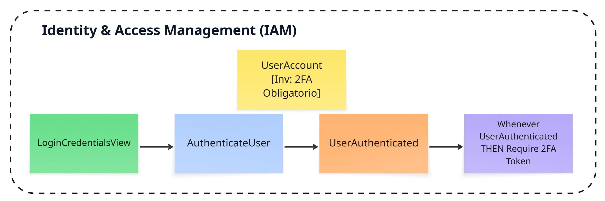  
*Nota: Elaboración propia en Miro según la técnica Design-Level EventStorming para el Bounded Context de Identity & Access Management (IAM).*

---

#### **4.6.1.2. Bounded Context 2: Subscription & Fleet Provisioning**

* **Clasificación:** *Supporting Subdomain*  
* **Alineación con Segmentos:** Modela la relación comercial y operativa de la startup con ambos segmentos. Para el **Segmento 2**, gestiona las suscripciones SaaS por cantidad y factor de forma de contenedor contratado (*Small Box* para vacunas, ampollas y biopsias de 5L; *Standard Box* para hemoderivados y órganos de 20L). Para el **Segmento 1**, gestiona el inventario de dispositivos hardware y su emparejamiento telemático con las ambulancias asistenciales.

##### Agregados Raíz e Invariantes de Negocio

1. **`SubscriptionPlan` (Aggregate Root):**
   * *Invariante 2.1:* Una institución médica no puede solicitar el aprovisionamiento de un contenedor adicional si la cantidad activa excede la cuota contratada en su plan suscrito.
   * *Invariante 2.2:* Los contenedores asignados deben corresponder al factor de forma contratado (*Small Box* o *Standard Box*) acorde al tipo de carga declarada en el contrato B2B.
2. **`VehicleBinding` (Aggregate Root):**
   * *Invariante 2.3:* Un contenedor inteligente solo puede estar vinculado telemáticamente a una única ambulancia física a la vez, identificada por su placa de rodaje única y código de móvil asistencial.

##### Matriz de Artefactos DDD - Contexto Subscription & Fleet Provisioning

<table border="1" cellpadding="5" cellspacing="0" style="border-collapse: collapse; width: 100%;">
  <thead>
    <tr>
      <th>Query CQRS (Cian)</th>
      <th>Read Model (Verde)</th>
      <th>Actor (Amarillo)</th>
      <th>Command (Azul)</th>
      <th>Aggregate (Ocre)</th>
      <th>Domain Event (Naranja)</th>
      <th>Policy / Regla Reactiva (Morada)</th>
    </tr>
  </thead>
  <tbody>
    <tr>
      <td><code>GetActiveSubscriptionPlanQuery</code></td>
      <td><code>SubscriptionTiersView</code></td>
      <td>Director Médico (Seg. 2)</td>
      <td><code>SubscribeToPlan</code></td>
      <td><code>SubscriptionPlan</code></td>
      <td><code>SubscriptionActivated</code></td>
      <td><em>Whenever [SubscriptionActivated] THEN [ProvisionContainerAllocationCommand]</em></td>
    </tr>
    <tr>
      <td><code>GetContainerDeviceStatusQuery</code></td>
      <td><code>DeviceInventoryView</code></td>
      <td>Técnico Logístico</td>
      <td><code>ProvisionContainerHardware</code></td>
      <td><code>ContainerDevice</code></td>
      <td><code>ContainerHardwareProvisioned</code></td>
      <td><em>Whenever [ContainerHardwareProvisioned] THEN [EnableTelemetrySensorsCommand]</em></td>
    </tr>
    <tr>
      <td><code>GetVehicleBindingQuery</code></td>
      <td><code>FleetPairingView</code></td>
      <td>Paramédico / Despachador (Seg. 1)</td>
      <td><code>BindContainerToVehicle</code></td>
      <td><code>VehicleBinding</code></td>
      <td><code>ContainerBoundToVehicle</code></td>
      <td><em>Whenever [ContainerBoundToVehicle] THEN [Activate12VPowerTelemetryCommand]</em></td>
    </tr>
  </tbody>
</table>

---

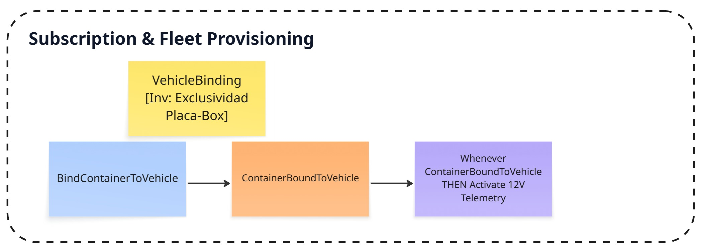  
*Nota: Elaboración propia en Miro según la técnica Design-Level EventStorming para el Bounded Context de Subscription & Fleet Provisioning.*

---

#### **4.6.1.3. Bounded Context 3: Medical Transport Planning & Dispatching**

* **Clasificación:** *Core Domain*  
* **Alineación con Segmentos:** Articula la necesidad médica del **Segmento 2** (solicitud urgente de insumo con rango térmico de 2°C a 8°C y tiempo de isquemia fría crítico) con la respuesta operativa del **Segmento 1** (asignación de unidad asistencial, cálculo de ruta anti-tráfico en Lima con TomTom y estimación dinámica de ETA).

##### Agregados Raíz e Invariantes de Negocio

1. **`TransportOrder` (Aggregate Root):**
   * *Invariante 3.1:* Una orden de traslado de órganos o tejidos no puede ser creada sin declarar el **Tiempo Máximo de Isquemia Fría** (ej. <4 horas para corazón, <8 horas para hígado, conforme a la Directiva Sanitaria N° 152/MINSA).
   * *Invariante 3.2:* Toda orden debe definir un origen (IPRESS remitente) y destino (IPRESS receptora) con geoceldas GPS verificadas en Lima/Callao.
2. **`DispatchTrip` (Aggregate Root):**
   * *Invariante 3.3:* Un viaje no puede iniciar su transición a estado `InTransit` si el contenedor médico asignado no ha alcanzado previamente su temperatura de pre-enfriamiento operativo (+2.0 °C a +8.0 °C).
   * *Invariante 3.4:* El viaje no puede darse por finalizado si la ambulancia se encuentra fuera del radio perimetral de seguridad (geofence de 100 metros) de la rampa de emergencia del hospital destino.

##### Matriz de Artefactos DDD - Contexto Transport Planning & Dispatching

<table border="1" cellpadding="5" cellspacing="0" style="border-collapse: collapse; width: 100%;">
  <thead>
    <tr>
      <th>Query CQRS (Cian)</th>
      <th>Read Model (Verde)</th>
      <th>Actor (Amarillo)</th>
      <th>Command (Azul)</th>
      <th>Aggregate (Ocre)</th>
      <th>Domain Event (Naranja)</th>
      <th>Policy / Regla Reactiva (Morada)</th>
    </tr>
  </thead>
  <tbody>
    <tr>
      <td><code>GetTransportOrderDetailsQuery</code></td>
      <td><code>OrderCreationFormView</code></td>
      <td>Químico Farmacéutico (Seg. 2)</td>
      <td><code>CreateTransportOrder</code></td>
      <td><code>TransportOrder</code></td>
      <td><code>TransportOrderPlaced</code></td>
      <td><em>Whenever [TransportOrderPlaced] THEN [EvaluateFleetAvailabilityCommand]</em></td>
    </tr>
    <tr>
      <td><code>GetFleetDispatchBoardQuery</code></td>
      <td><code>FleetDispatchBoardView</code></td>
      <td>Despachador Flota (Seg. 1)</td>
      <td><code>AssignVehicleAndBoxToTrip</code></td>
      <td><code>DispatchTrip</code></td>
      <td><code>TripResourcesAssigned</code></td>
      <td><em>Whenever [TripResourcesAssigned] THEN [RequestContainerPrecoolingCommand]</em></td>
    </tr>
    <tr>
      <td><code>GetActiveTripMonitorQuery</code></td>
      <td><code>ActiveTripMonitorView</code></td>
      <td>Chofer Ambulancia (Seg. 1)</td>
      <td><code>StartDispatchedTrip</code></td>
      <td><code>DispatchTrip</code></td>
      <td><code>DispatchedTripStarted</code></td>
      <td><em>Whenever [DispatchedTripStarted] THEN [LockContainerElectromechanicalLidCommand]</em></td>
    </tr>
    <tr>
      <td><code>CalculateDynamicRouteEtaQuery</code></td>
      <td><code>ActiveTripMonitorView</code></td>
      <td>Sistema / TomTom API</td>
      <td><code>UpdateDynamicEta</code></td>
      <td><code>DispatchTrip</code></td>
      <td><code>DynamicEtaRecalculated</code></td>
      <td><em>Whenever [DynamicEtaRecalculated] AND delay > 15m THEN [NotifyHospitalRampCommand]</em></td>
    </tr>
    <tr>
      <td><code>GetDestinationGeofenceStatusQuery</code></td>
      <td><code>DestinationArrivalView</code></td>
      <td>Chofer Ambulancia (Seg. 1) / Sistema GPS</td>
      <td><code>RegisterDestinationArrival</code></td>
      <td><code>DispatchTrip</code></td>
      <td><code>TripDestinationReached</code></td>
      <td><em>Whenever [TripDestinationReached] THEN [NotifyHospitalReceivingTeamCommand]</em></td>
    </tr>
  </tbody>
</table>

---

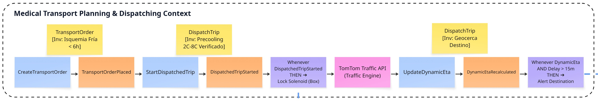  
*Nota: Elaboración propia en Miro según la técnica Design-Level EventStorming para el Bounded Context de Medical Transport Planning & Dispatching.*

---

#### **4.6.1.4. Bounded Context 4: Smart Container & Telemetry Monitoring**

* **Clasificación:** *Core Domain (Diferenciador Tecnológico)*  
* **Alineación con Segmentos:** Representa el corazón IoT del sistema. Para el **Segmento 1**, monitorea la integridad eléctrica en la toma de 12V y estado de la batería de litio interna para evitar descargas accidentales por vibración. Para el **Segmento 2**, certifica la curva ininterrumpida de frío (+2.0 °C a +8.0 °C con celdas Peltier) y la estabilidad del peso neto del insumo mediante celda de carga HX711 (&plusmn;5 gramos).

##### Agregados Raíz e Invariantes de Negocio

1. **`SmartContainer` (Aggregate Root):**
   * *Invariante 4.1:* La tapa electromecánica (`ElectromechanicalLock`) no puede ser destrabada si el contenedor se encuentra en viaje activo (`TripStatus == InTransit`), a menos que se reciba un comando firmado de desbloqueo de emergencia o código OTP verificado en destino.
   * *Invariante 4.2:* Si la celda de carga HX711 detecta una variación de peso neto superior a 15 gramos mientras el contenedor está en ruta cerrada, debe emitirse de forma inmediata un evento de presunta adulteración de carga útil.
2. **`TelemetrySnapshot` (Aggregate Root):**
   * *Invariante 4.3:* Todo paquete de telemetría debe contar con una marca de tiempo inmutable sincronizada vía UTC/NTP y una firma criptográfica emitida por el microcontrolador ESP32 para prevenir inyecciones falsas de datos.

##### Matriz de Artefactos DDD - Contexto Smart Container & Telemetry

<table border="1" cellpadding="5" cellspacing="0" style="border-collapse: collapse; width: 100%;">
  <thead>
    <tr>
      <th>Query CQRS (Cian)</th>
      <th>Read Model (Verde)</th>
      <th>Actor (Amarillo)</th>
      <th>Command (Azul)</th>
      <th>Aggregate (Ocre)</th>
      <th>Domain Event (Naranja)</th>
      <th>Policy / Regla Reactiva (Morada)</th>
    </tr>
  </thead>
  <tbody>
    <tr>
      <td><code>GetContainerTelemetrySnapshotQuery</code></td>
      <td><code>ContainerSensorsLiveView</code></td>
      <td>ESP32 / Sensores IoT</td>
      <td><code>RecordTelemetrySnapshot</code></td>
      <td><code>SmartContainer</code></td>
      <td><code>TelemetrySnapshotRecorded</code></td>
      <td><em>Whenever [TelemetrySnapshotRecorded] THEN [EvaluateThermalLimitsCommand]</em></td>
    </tr>
    <tr>
      <td><code>GetTareCalibrationStatusQuery</code></td>
      <td><code>TareCalibrationView</code></td>
      <td>Químico Farmacéutico (Seg. 2)</td>
      <td><code>CalibrateTareAndPayloadWeight</code></td>
      <td><code>SmartContainer</code></td>
      <td><code>PayloadWeightRegistered</code></td>
      <td><em>Whenever [PayloadWeightRegistered] THEN [EngageSolenoidLockCommand]</em></td>
    </tr>
    <tr>
      <td><code>GetPowerStatusQuery</code></td>
      <td><code>PowerStatusView</code></td>
      <td>Hardware ESP32</td>
      <td><code>SwitchToInternalBatteryPower</code></td>
      <td><code>SmartContainer</code></td>
      <td><code>AuxiliaryBatteryEngaged</code></td>
      <td><em>Whenever [AuxiliaryBatteryEngaged] THEN [TriggerPowerLossWarningCommand]</em></td>
    </tr>
    <tr>
      <td><code>GetContainerLockStateQuery</code></td>
      <td><code>ContainerLockView</code></td>
      <td>Custodio Receptor (Seg. 2)</td>
      <td><code>UnlockElectromechanicalLid</code></td>
      <td><code>SmartContainer</code></td>
      <td><code>ContainerLidUnlocked</code></td>
      <td><em>Whenever [ContainerLidUnlocked] THEN [LogCustodyAccessAuditCommand]</em></td>
    </tr>
  </tbody>
</table>

---

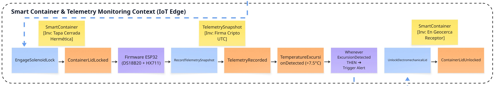  
*Nota: Elaboración propia en Miro según la técnica Design-Level EventStorming para el Bounded Context de Smart Container & Telemetry Monitoring.*

---

#### **4.6.1.5. Bounded Context 5: Critical Alerting & Incident Response**

* **Clasificación:** *Core Domain*  
* **Alineación con Segmentos:** Garantiza que los problemas en ruta se detecten y resuelvan en segundos. Para el **Segmento 1**, dispara alarmas audibles y visuales de alta prioridad en el dashboard del conductor/paramédico para que reconecte la toma de 12V o revise el contenedor. Para el **Segmento 2**, alerta inmediatamente a la central de farmacia y equipo quirúrgico si una desviación térmica o retraso por congestión pone en riesgo la carga biológica.

##### Agregados Raíz e Invariantes de Negocio

1. **`CriticalIncident` (Aggregate Root):**
   * *Invariante 5.1:* Toda alerta de grado `CRITICAL` (excursión >8.0 °C por más de 3 minutos continuos o caída de batería <20%) debe despachar notificaciones automáticas en menos de 10 segundos hacia el personal de ruta y receptores.
   * *Invariante 5.2:* Un incidente crítico no puede ser cerrado administrativamente sin que el usuario responsable registre obligatoriamente una **Acción de Mitigación / Contingencia** y su respectivo acuse de recibo (*Acknowledgment*).

2. **`AlertRule` (Aggregate Root):**
   * *Invariante 5.3:* Toda regla de monitoreo debe parametrizar obligatoriamente umbrales dentro del margen normativo de DIGEMID (+2.0 °C a +8.0 °C), bloqueando configuraciones permisivas fuera de estándar que pongan en riesgo la carga biológica.
   * *Invariante 5.4:* Los umbrales de advertencia incipiente (*Warning*) no pueden superar los +7.5 °C para asegurar una ventana de reacción mínima de 15 minutos antes de que ocurra una excursión térmica crítica irreversible.

##### Matriz de Artefactos DDD - Contexto Critical Alerting & Incident Response

<table border="1" cellpadding="5" cellspacing="0" style="border-collapse: collapse; width: 100%;">
  <thead>
    <tr>
      <th>Query CQRS (Cian)</th>
      <th>Read Model (Verde)</th>
      <th>Actor (Amarillo)</th>
      <th>Command (Azul)</th>
      <th>Aggregate (Ocre)</th>
      <th>Domain Event (Naranja)</th>
      <th>Policy / Regla Reactiva (Morada)</th>
    </tr>
  </thead>
  <tbody>
    <tr>
      <td><code>GetLiveAlertsQuery</code></td>
      <td><code>LiveAlertsBannerView</code></td>
      <td>Sistema Reactivo</td>
      <td><code>TriggerCriticalAlert</code></td>
      <td><code>CriticalIncident</code></td>
      <td><code>CriticalAlertTriggered</code></td>
      <td><em>Whenever [CriticalAlertTriggered] THEN [DispatchPushNotificationCommand]</em></td>
    </tr>
    <tr>
      <td><code>GetIncidentDetailQuery</code></td>
      <td><code>IncidentDetailModalView</code></td>
      <td>Paramédico / Chofer (Seg. 1)</td>
      <td><code>AcknowledgeAlert</code></td>
      <td><code>CriticalIncident</code></td>
      <td><code>AlertAcknowledgedByOperator</code></td>
      <td><em>Whenever [AlertAcknowledged] THEN [SilenceCabinBuzzerCommand]</em></td>
    </tr>
    <tr>
      <td><code>GetContingencyResolutionsQuery</code></td>
      <td><code>ContingencyResolutionView</code></td>
      <td>Paramédico / Farmacéutico</td>
      <td><code>ResolveIncidentWithMitigation</code></td>
      <td><code>CriticalIncident</code></td>
      <td><code>IncidentResolved</code></td>
      <td><em>Whenever [IncidentResolved] THEN [AppendToAuditManifestCommand]</em></td>
    </tr>
    <tr>
      <td><code>GetAlertRuleThresholdsQuery</code></td>
      <td><code>AlertConfigurationView</code></td>
      <td>Director Farmacéutico (Seg. 2)</td>
      <td><code>ConfigureAlertThresholds</code></td>
      <td><code>AlertRule</code></td>
      <td><code>AlertThresholdsConfigured</code></td>
      <td><em>Whenever [AlertThresholdsConfigured] THEN [SyncThermalMonitoringParametersCommand]</em></td>
    </tr>
  </tbody>
</table>

---

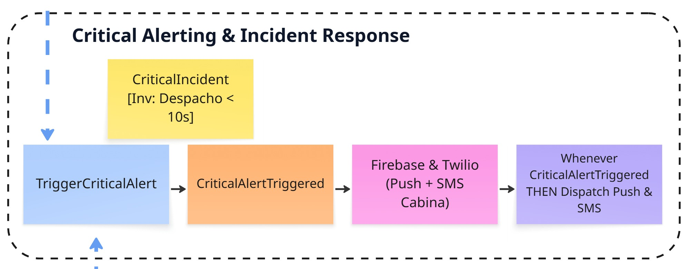  
*Nota: Elaboración propia en Miro según la técnica Design-Level EventStorming para el Bounded Context de Critical Alerting & Incident Response.*

---

#### **4.6.1.6. Bounded Context 6: Chain of Custody & Traceability**

* **Clasificación:** *Core Domain / Cumplimiento Normativo*  
* **Alineación con Segmentos:** Brinda la certeza legal, médica y sanitaria que exige el **Segmento 2** ante auditorías de DIGEMID (R.M. N° 833-2015/MINSA) y DIGDOT (Directiva 152/MINSA). Controla la transferencia física y legal de la custodia mediante código QR de salida, apertura en rampa receptor mediante **código OTP de un solo uso** enviado al personal acreditado, y emisión del acta digital inmutable con curva térmica completa.

##### Agregados Raíz e Invariantes de Negocio

1. **`CustodyTransfer` (Aggregate Root):**
   * *Invariante 6.1:* La transferencia formal de custodia médica solo puede completarse si el código OTP ingresado por el receptor coincide exactamente con el token criptográfico emitido por el sistema al centro de salud receptor.
   * *Invariante 6.2:* No se puede dar por recibida conforme una carga médica si durante el trayecto se registró una excursión térmica acumulada que supere el límite de estabilidad biológica declarado para el fármaco u órgano.
2. **`DigitalAuditManifest` (Aggregate Root):**
   * *Invariante 6.3:* El acta digital final es inmutable: una vez generada con las firmas del despachador y receptor, su contenido y curva térmica se sellan criptográficamente con hash SHA-256 impidiendo cualquier alteración posterior.

##### Matriz de Artefactos DDD - Contexto Chain of Custody & Traceability

<table border="1" cellpadding="5" cellspacing="0" style="border-collapse: collapse; width: 100%;">
  <thead>
    <tr>
      <th>Query CQRS (Cian)</th>
      <th>Read Model (Verde)</th>
      <th>Actor (Amarillo)</th>
      <th>Command (Azul)</th>
      <th>Aggregate (Ocre)</th>
      <th>Domain Event (Naranja)</th>
      <th>Policy / Regla Reactiva (Morada)</th>
    </tr>
  </thead>
  <tbody>
    <tr>
      <td><code>GetDispatchVerificationQuery</code></td>
      <td><code>DispatchVerificationView</code></td>
      <td>Químico Farmacéutico Remitente</td>
      <td><code>SignInitialCustodyHandover</code></td>
      <td><code>CustodyTransfer</code></td>
      <td><code>InitialCustodySigned</code></td>
      <td><em>Whenever [InitialCustodySigned] THEN [IssueRecipientOtpCodeCommand]</em></td>
    </tr>
    <tr>
      <td><code>ValidateDeliveryOtpQuery</code></td>
      <td><code>OtpVerificationModalView</code></td>
      <td>Médico / Químico Receptor (Seg. 2)</td>
      <td><code>VerifyDeliveryOtpCode</code></td>
      <td><code>CustodyTransfer</code></td>
      <td><code>DeliveryOtpVerified</code></td>
      <td><em>Whenever [DeliveryOtpVerified] THEN [UnlockSmartContainerCommand]</em></td>
    </tr>
    <tr>
      <td><code>GetFinalInspectionReportQuery</code></td>
      <td><code>FinalInspectionReportView</code></td>
      <td>Custodio Receptor (Seg. 2)</td>
      <td><code>AcceptMedicalDelivery</code></td>
      <td><code>CustodyTransfer</code></td>
      <td><code>MedicalCustodyTransferred</code></td>
      <td><em>Whenever [MedicalCustodyTransferred] THEN [SealDigitalAuditManifestCommand]</em></td>
    </tr>
    <tr>
      <td><code>GetAuditManifestCertifiedPdfQuery</code></td>
      <td><code>AuditManifestDownloadView</code></td>
      <td>Auditor DIGEMID / MINSA</td>
      <td><code>GenerateCertifiedPdfManifest</code></td>
      <td><code>DigitalAuditManifest</code></td>
      <td><code>AuditManifestSealedWithHash</code></td>
      <td><em>Whenever [AuditManifestSealedWithHash] THEN [ArchiveInCloudStorageCommand]</em></td>
    </tr>
  </tbody>
</table>

---

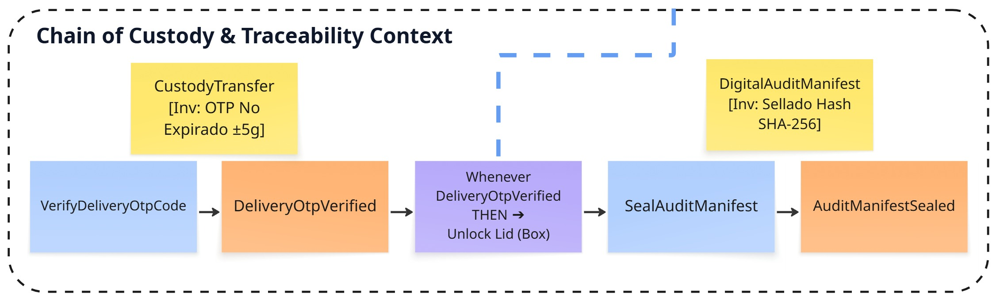  
*Nota: Elaboración propia en Miro según la técnica Design-Level EventStorming para el Bounded Context de Chain of Custody & Traceability.*

---

### **5. Matriz Transversal de Políticas de Negocio Reactivas (Event-Driven)**

Para garantizar que la arquitectura DDD soporte adecuadamente la reactividad en tiempo real entre microservicios/módulos, se formalizan las **políticas de negocio transversales** que gobiernan el comportamiento del sistema, detallando el canal de desacoplamiento asíncrono y la estrategia de consistencia:

| Política / Regla de Negocio | Evento Disparador (Triggering Domain Event) | Bounded Context Emisor | Comando Consecuente (Resulting Command) | Bounded Context Receptor | Canal de Integración / Event Bus | Estrategia de Consistencia |
|---|---|---|---|---|---|---|
| **POL-01: Control Térmico Reactivo** | TelemetrySnapshotRecorded (Temp < 2.0°C o > 8.0°C) | *Smart Container IoT* | TriggerCriticalAlert | *Critical Alerting* | Redis Pub/Sub: smartbox.telemetry.excursions | Consistencia Eventual (< 500 ms) |
| **POL-02: Escalación por Tráfico de Lima** | DynamicEtaRecalculated (Retraso ETA > 15 min) | *Transport Planning* | NotifyHospitalRampDelay | *Transport Planning / IAM* | Internal Event Bus (MediatR): trips.eta.delays | Consistencia Eventual (< 2 s) |
| **POL-03: Bloqueo Automático en Despacho** | DispatchedTripStarted | *Transport Planning* | EngageSolenoidLock | *Smart Container IoT* | Internal Event Bus (MediatR): trips.dispatched | Consistencia Fuerte / Inmediata |
| **POL-04: Seguridad de Energía Vehicular** | ExternalPowerSourceLost (Toma 12V desconectada) | *Smart Container IoT* | TriggerPowerWarningAlert | *Critical Alerting* | Redis Pub/Sub: smartbox.power.alerts | Consistencia Eventual (< 500 ms) |
| **POL-05: Autorización de Apertura en Rampa** | DeliveryOtpVerified | *Chain of Custody* | UnlockElectromechanicalLid | *Smart Container IoT* | Internal MediatR (intra-API) → Redis Pub/Sub: smartbox.commands.actuators → MQTT TLS 8883 | Consistencia Fuerte / Inmediata |
| **POL-06: Cierre Inmutable de Manifiesto** | MedicalCustodyTransferred | *Chain of Custody* | SealDigitalAuditManifest | *Chain of Custody* | Internal Event Bus (MediatR): custody.completed | Consistencia Fuerte (Transaccional) |

---

### **6. Conclusiones y Preparación para el C4 Model (Capítulo 4.6.2)**

El **Design-Level EventStorming** ha permitido descomponer con total rigor la complejidad del problema de transporte médico crítico en Lima Metropolitana. A través de los seis Bounded Contexts y sus respectivos Agregados Raíz, se han blindado las reglas sanitarias (DIGEMID/DIGDOT) y operativas de los dos segmentos objetivo:
* Para el **Segmento 1**, el software garantiza que la conducción no sufra distracciones, monitoreando en segundo plano la alimentación eléctrica de 12V, el estado de la batería y la optimización de rutas frente al tráfico limeño.
* Para el **Segmento 2**, el software garantiza la trazabilidad transparente y en tiempo real de la curva térmica (2 °C a 8 °C), la inmutabilidad de la cadena de custodia mediante códigos OTP y la disponibilidad de actas digitales certificadas.

Este modelado funcional establece las fronteras directas para la elaboración del **C4 Model (Context Diagram en 4.6.2, Container Diagram en 4.6.3 y Component Diagrams en 4.6.4)**, así como los cimientos para el **Diagrama de Clases UML (4.7)** y el **Esquema Relacional de Base de Datos (4.8)**.

---

## **4.6.2. Software Architecture Context Diagram**

### **1. Introducción y Fundamentos Arquitectónicos del C4 Model**

Para representar con rigor formal la arquitectura del sistema, se adoptó el **C4 Model** concebido por Simon Brown, complementado bajo los principios de *Domain-Driven Architecture* de Nick Tune.

El C4 Model organiza la descripción de los sistemas de software en cuatro niveles jerárquicos de abstracción visual: **Contexto (System Context), Contenedores (Containers), Componentes (Components) y Código (Code)**. En esta sección se elabora el **Nivel 1: Software Architecture Context Diagram (Diagrama de Contexto del Sistema)**.

#### Propósito y Alcance del Diagrama de Contexto
El objetivo esencial del Diagrama de Contexto es **establecer las fronteras operativas del sistema**, mostrándolo como una **caja negra central única** sin revelar detalles internos de implementación técnica, bases de datos o frameworks de programación. Este enfoque permite que tanto los interesados técnicos como los directores clínicos, químicos farmacéuticos y auditores gubernamentales comprendan claramente:
1. **Quiénes son los usuarios:** Qué actores humanos interactúan con la plataforma y qué valor operativo obtienen de ella.
2. **Cuáles son las dependencias externas:** Qué sistemas de software de terceros, hardware embebido y servicios en la nube son requeridos para que la solución funcione.
3. **Cuáles son los límites de responsabilidad:** Qué funciones ejecuta estrictamente el sistema y qué tareas delega a sistemas especializados del ecosistema de salud y movilidad de Lima Metropolitana.

---

### **2. Definición del Sistema Central (Subject System)**

* **Nombre Oficial del Sistema:** `Medical SMARTBOX Platform`
* **Tipo:** `[Software System]`
* **Descripción de Dominio:**  
  Plataforma integral B2B SaaS de software y telemetría IoT para la monitorización activa de la cadena de frío (+2.0 °C a +8.0 °C), pesaje de alta precisión (&plusmn;5 g), custodia electromecánica inmutable y trazabilidad de traslados asistenciales de emergencia en ambulancias para Lima Metropolitana y el Callao.
* **Misión Operativa:**  
  Garantizar el "Desperdicio Cero" de órganos para trasplante, hemoderivados, vacunas y muestras biológicas termosensibles durante el trayecto vial, blindando el cumplimiento de la **R.M. N° 833-2015/MINSA** (Manual de BPDT - DIGEMID) y la **Directiva Sanitaria N° 152/MINSA** (DIGDOT), mediante la supervisión en tiempo real de temperatura, energía vehicular (12V) y cálculo dinámico de tiempos de llegada (ETA) frente al tráfico severo de la capital.

---

### **3. Catálogo de Actores y Personas (Segmentos Objetivo)**

Los usuarios del sistema se articulan de manera estricta con los **dos segmentos objetivo** modelados en la sección **1.3**:

<table border="1" cellpadding="6" cellspacing="0" style="border-collapse: collapse; width: 100%;">
  <thead>
    <tr>
      <th>Actor / Persona</th>
      <th>Segmento Objetivo</th>
      <th>Rol Operativo en el Dominio</th>
      <th>Canal de Acceso / Interfaz</th>
      <th>Interacción Primaria con el Sistema</th>
    </tr>
  </thead>
  <tbody>
    <tr>
      <td><strong>Ambulance Driver & Paramedic</strong> <em>(Chofer Asistencial y Paramédico / TEM)</em></td>
      <td><strong>Segmento 1:</strong> Empresas de Transporte y Operadores Logísticos</td>
      <td>Conduce la ambulancia, atiende incidentes asistenciales de urgencia, supervisa la estabilidad del cable de 12V vehicular y responde ante alarmas críticas en cabina.</td>
      <td>Frontend Web App (PWA Mobile en Tablet de cabina / Smartphone)</td>
      <td>Visualiza el estado de conexión de 12V, silencia alertas audibles tras acuse de recibo y navega con rutas optimizadas anti-tráfico.</td>
    </tr>
    <tr>
      <td><strong>Fleet Logistics Dispatcher</strong> <em>(Coordinador de Despacho de Flota)</em></td>
      <td><strong>Segmento 1:</strong> Empresas de Transporte y Operadores Logísticos</td>
      <td>Planifica la disponibilidad de vehículos, asigna contenedores inteligentes a las unidades móviles y supervisa la telemetría global de la flota en ruta.</td>
      <td>Frontend Web App (Dashboard Desktop / Web)</td>
      <td>Asigna móviles a órdenes de traslado, monitorea la posición GPS en tiempo real y gestiona contingencias por congestión vial.</td>
    </tr>
    <tr>
      <td><strong>Clinical Pharmacist / Medical Remitter</strong> <em>(Químico Farmacéutico Remitente / Banco de Sangre)</em></td>
      <td><strong>Segmento 2:</strong> Centros de Salud y Cadenas Farmacéuticas</td>
      <td>Responsable del acondicionamiento térmico de la carga biológica, verificación del pre-enfriamiento (2°C-8°C), pesaje basal con celda HX711 y despacho formal.</td>
      <td>Frontend Web App (Portal Web Hospitalario)</td>
      <td>Registra la orden de traslado de emergencia, declara tiempos de isquemia, tara la carga útil y autoriza el bloqueo electromecánico inicial.</td>
    </tr>
    <tr>
      <td><strong>Receiving Physician / Surgical Team</strong> <em>(Médico Cirujano / Custodio Receptor en Rampa)</em></td>
      <td><strong>Segmento 2:</strong> Centros de Salud y Cadenas Farmacéuticas</td>
      <td>Personal clínico del hospital receptor que atiende la llegada de la ambulancia, valida el arribo en rampa de emergencias y desbloquea el compartimento.</td>
      <td>Frontend Web App (Mobile / Tablet de Quirófano)</td>
      <td>Monitorea el ETA dinámico de aproximación, ingresa el <strong>código OTP de un solo uso</strong> para destrabar la tapa y firma el acta de recepción conforme.</td>
    </tr>
    <tr>
      <td><strong>Health Quality Auditor / Regulatory Inspector</strong> <em>(Auditor de Calidad Hospitalaria / Inspector DIGEMID-DIGDOT)</em></td>
      <td><strong>Segmento 2:</strong> Centros de Salud y Cadenas Farmacéuticas</td>
      <td>Especialista en aseguramiento de la calidad o inspector sanitario gubernamental que fiscaliza la preservación legal de la cadena de custodia y frío.</td>
      <td>Frontend Web App (Portal de Cumplimiento y Auditoría)</td>
      <td>Descarga expedientes digitales certificados en PDF con curvas térmicas completas y firmas criptográficas inalterables con sellado SHA-256.</td>
    </tr>
  </tbody>
</table>

---

### **4. Catálogo de Sistemas Externos e Interfaces Periféricas**

La plataforma se conecta con siete sistemas de software externos y dispositivos de hardware distribuido:

<table border="1" cellpadding="6" cellspacing="0" style="border-collapse: collapse; width: 100%;">
  <thead>
    <tr>
      <th>Sistema Externo / Hardware</th>
      <th>Tipo de Sistema</th>
      <th>Descripción y Función de Negocio</th>
      <th>Nivel de Criticidad</th>
    </tr>
  </thead>
  <tbody>
    <tr>
      <td><strong>Smart Container IoT Embedded Hardware</strong> <em>(ESP32 + Sensores Embebidos)</em></td>
      <td><code>[Hardware System / Embebido]</code></td>
      <td>Módulo inteligente integrado en el contenedor que incluye microcontrolador ESP32, termómetro digital sumergible DS18B20, celda de carga HX711, solenoide electromecánico, celdas Peltier, acelerómetro y batería Li-Ion de respaldo.</td>
      <td><strong>Crítica (Core):</strong> Transmite ráfagas periódicas de telemetría y ejecuta comandos remotos de bloqueo y desbloqueo.</td>
    </tr>
    <tr>
      <td><strong>Vehicle Telemetry Interface</strong> <em>(OBD-II / GPS de la Ambulancia)</em></td>
      <td><code>[External Software / Hardware]</code></td>
      <td>Dispositivo telemático vehicular conectado al puerto estándar OBD-II de la ambulancia. Transmite a la plataforma el voltaje suministrado por la toma de 12V, nivel de combustible de la unidad, velocidad y coordenadas GPS vehiculares.</td>
      <td><strong>Alta:</strong> Permite detectar caídas de energía vehicular antes de que se agote la batería de respaldo del box.</td>
    </tr>
    <tr>
      <td><strong>Traffic & Route Optimization Engine</strong> <em>(TomTom Traffic API / Mapbox)</em></td>
      <td><code>[External Cloud Service]</code></td>
      <td>Servicio internacional de georreferenciación y tráfico vehicular en tiempo real. Proporciona matrices de tiempo de viaje dinámicas ajustadas a la congestión histórica y en vivo de las principales vías de Lima Metropolitana.</td>
      <td><strong>Alta:</strong> Suministra el recálculo dinámico del ETA para alertar a los equipos de quirófano en caso de embotellamientos severos.</td>
    </tr>
    <tr>
      <td><strong>Multi-Channel Notification Gateway</strong> <em>(Firebase Cloud Messaging & Twilio SMS)</em></td>
      <td><code>[External Cloud Service]</code></td>
      <td>Plataforma de comunicaciones omnicanal para el despacho ultrarrápido (&lt;10 segundos) de notificaciones push de alta prioridad y alertas por SMS a teléfonos móviles de la tripulación y médicos coordinadores.</td>
      <td><strong>Crítica:</strong> Dispara las alarmas de excursión térmica o desconexión eléctrica cuando el usuario no tiene la aplicación web abierta.</td>
    </tr>
    <tr>
      <td><strong>Hospital Management System</strong> <em>(HIS / EHR / RENIPRESS - MINSA)</em></td>
      <td><code>[External Software System]</code></td>
      <td>Sistemas de información hospitalaria y registros electrónicos de salud de las IPRESS emisoras y receptoras. Valida los códigos únicos de sede y permite la sincronización de solicitudes quirúrgicas urgentes.</td>
      <td><strong>Media:</strong> Valida la existencia formal de los establecimientos de salud y enriquece los datos del paciente o receptor.</td>
    </tr>
    <tr>
      <td><strong>Cloud Immutable Storage</strong> <em>(AWS S3 / Azure Blob Storage con WORM)</em></td>
      <td><code>[External Cloud Service]</code></td>
      <td>Almacén de objetos en la nube configurado con directivas de retención inmutable (Write Once, Read Many). Almacena las actas de custodia digital y manifiestos de viaje en PDF firmados criptográficamente.</td>
      <td><strong>Alta:</strong> Resguarda los expedientes probatorios legales para inspecciones de SUSALUD, DIGEMID o auditorías judiciales.</td>
    </tr>
    <tr>
      <td><strong>B2B Payment & Billing Gateway</strong> <em>(Culqi / Stripe B2B Payments)</em></td>
      <td><code>[External Cloud Service]</code></td>
      <td>Pasarela de procesamiento de pagos y recaudación corporativa recurrente. Gestiona las suscripciones mensuales de las flotas de ambulancias y clínicas, validando cobros automáticos y emitiendo comprobantes fiscales electrónicos ante SUNAT.</td>
      <td><strong>Alta:</strong> Respalda la operatividad comercial y el modelo de monetización SaaS de la plataforma.</td>
    </tr>
  </tbody>
</table>

---

### **5. Matriz de Interacciones y Protocolos de Comunicación**

Para garantizar que el modelado técnico no deje ambigüedades sobre las tecnologías de comunicación, la siguiente tabla detalla cada una de las flechas de interacción del diagrama de contexto:

<table border="1" cellpadding="5" cellspacing="0" style="border-collapse: collapse; width: 100%;">
  <thead>
    <tr>
      <th>Flujo #</th>
      <th>Origen (Source)</th>
      <th>Destino (Target)</th>
      <th>Descripción Funcional de la Interacción</th>
      <th>Protocolo y Formato de Datos</th>
    </tr>
  </thead>
  <tbody>
    <tr>
      <td><strong>F-01</strong></td>
      <td>Ambulance Driver & Paramedic</td>
      <td>Medical SMARTBOX Platform</td>
      <td>Consulta estado del viaje, monitorea conexión de 12V y registra acuse de recibo de alertas acústicas.</td>
      <td><code>HTTPS / WSS / JSON (TLS 1.3)</code></td>
    </tr>
    <tr>
      <td><strong>F-02</strong></td>
      <td>Fleet Logistics Dispatcher</td>
      <td>Medical SMARTBOX Platform</td>
      <td>Asigna móviles a viajes, monitorea mapas de flota y gestiona suscripciones de boxes.</td>
      <td><code>HTTPS / JSON (RESTful API)</code></td>
    </tr>
    <tr>
      <td><strong>F-03</strong></td>
      <td>Clinical Pharmacist Remitter</td>
      <td>Medical SMARTBOX Platform</td>
      <td>Crea órdenes de traslado, registra tara/peso del insumo y autoriza el precinto inicial.</td>
      <td><code>HTTPS / JSON (RESTful API)</code></td>
    </tr>
    <tr>
      <td><strong>F-04</strong></td>
      <td>Receiving Physician</td>
      <td>Medical SMARTBOX Platform</td>
      <td>Monitorea ETA, valida llegada en rampa, ingresa código OTP de apertura y firma acta de entrega.</td>
      <td><code>HTTPS / JSON (RESTful API)</code></td>
    </tr>
    <tr>
      <td><strong>F-05</strong></td>
      <td>Health Quality Auditor</td>
      <td>Medical SMARTBOX Platform</td>
      <td>Consulta historiales térmicos y descarga actas digitales certificadas en PDF.</td>
      <td><code>HTTPS / PDF Stream</code></td>
    </tr>
    <tr>
      <td><strong>F-06</strong></td>
      <td>Smart Container Hardware (ESP32)</td>
      <td>Medical SMARTBOX Platform</td>
      <td>Transmite ráfagas de telemetría (temperatura DS18B20, peso HX711, batería, acelerómetro).</td>
      <td><code>MQTT over TLS / JSON (TCP 8883)</code></td>
    </tr>
    <tr>
      <td><strong>F-07</strong></td>
      <td>Medical SMARTBOX Platform</td>
      <td>Smart Container Hardware (ESP32)</td>
      <td>Envía comandos firmados de bloqueo y desbloqueo de la tapa electromecánica (solenoide).</td>
      <td><code>MQTT Publish / TLS / JSON</code></td>
    </tr>
    <tr>
      <td><strong>F-08</strong></td>
      <td>Vehicle Telemetry Interface (OBD-II)</td>
      <td>Medical SMARTBOX Platform</td>
      <td>Transmite telemetría del vehículo (voltaje de 12V, nivel de combustible y posición GPS).</td>
      <td><code>HTTPS / REST / JSON (4G Cellular)</code></td>
    </tr>
    <tr>
      <td><strong>F-09</strong></td>
      <td>Medical SMARTBOX Platform</td>
      <td>TomTom Traffic API</td>
      <td>Solicita cálculo dinámico de tiempos de ruta y congestión vial en Lima para recalcular ETA.</td>
      <td><code>HTTPS / REST / JSON</code></td>
    </tr>
    <tr>
      <td><strong>F-10</strong></td>
      <td>Medical SMARTBOX Platform</td>
      <td>Notification Gateway (Firebase/Twilio)</td>
      <td>Despacha alertas críticas inmediatas vía notificaciones Push (FCM) y mensajes de texto SMS.</td>
      <td><code>HTTPS / REST API</code></td>
    </tr>
    <tr>
      <td><strong>F-11</strong></td>
      <td>Medical SMARTBOX Platform</td>
      <td>Hospital Management System (HIS)</td>
      <td>Valida identificadores RENIPRESS de sede y sincroniza preavisos de llegada para quirófanos.</td>
      <td><code>HTTPS / REST / HL7-FHIR</code></td>
    </tr>
    <tr>
      <td><strong>F-12</strong></td>
      <td>Medical SMARTBOX Platform</td>
      <td>Cloud Immutable Storage (AWS S3)</td>
      <td>Archiva de forma inalterable las actas de custodia firmadas digitalmente con sellado criptográfico SHA-256.</td>
      <td><code>HTTPS / S3 REST API (TLS 1.3)</code></td>
    </tr>
    <tr>
      <td><strong>F-13</strong></td>
      <td>Medical SMARTBOX Platform</td>
      <td>B2B Payment & Billing Gateway (Culqi / Stripe)</td>
      <td>Procesa la facturación recurrente de suscripciones B2B, valida cobros automáticos y emite comprobantes electrónicos.</td>
      <td><code>HTTPS / REST API (TLS 1.3)</code></td>
    </tr>
  </tbody>
</table>

---

### **6. Especificación Visual Oficial y Bloque de Diagramación**

---

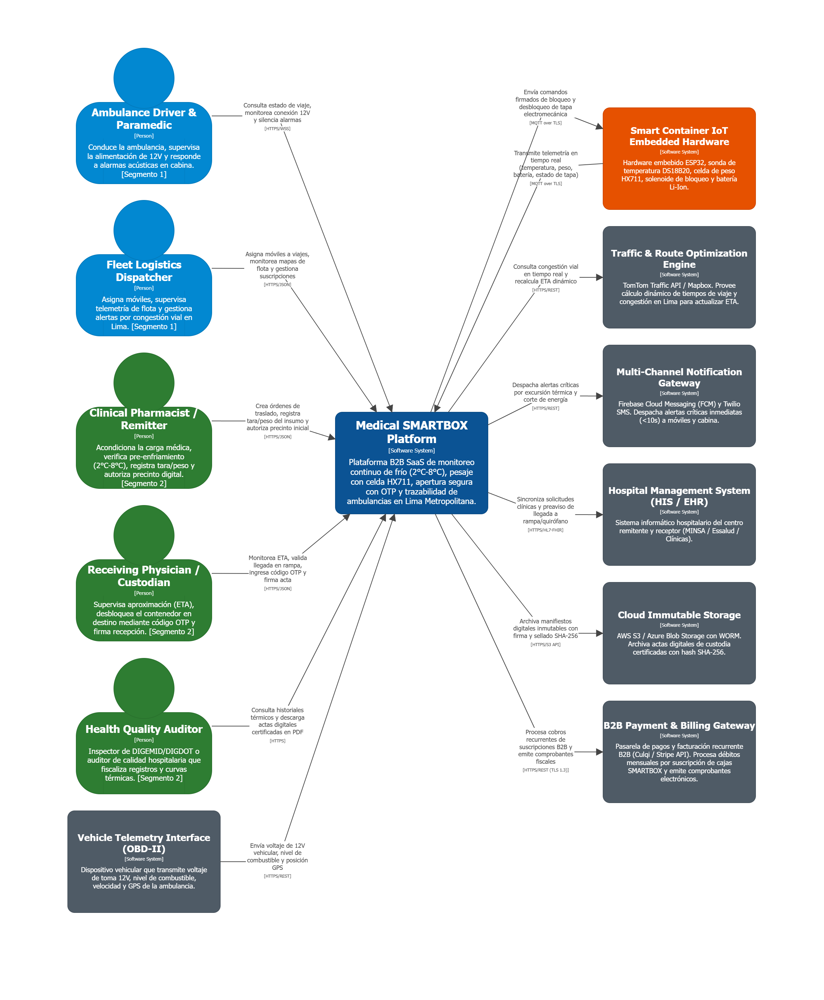

*Nota: Elaboración propia en Structurizr conforme a los estándares del modelo C4 para la arquitectura de software.*

---

### **7. Conclusiones y Transición hacia el Container Diagram (Capítulo 4.6.3)**

El **Software Architecture Context Diagram** define formalmente el perímetro del ecosistema del **Medical SMARTBOX**:
1. **Claridad de Actores:** Se han diferenciado nítidamente las responsabilidades del personal en ruta (Segmento 1: Chofer y Despachador) de las de los especialistas sanitarios (Segmento 2: Químico Farmacéutico, Médico Cirujano y Auditor).
2. **Robustez de Integraciones:** El sistema no depende de soluciones mágicas, sino de contratos técnicos específicos: telemetría continua sobre **MQTT/TLS** para el hardware IoT de ultrabajo consumo (ESP32), APIs de geolocalización contra **TomTom** para vencer la congestión de Lima, y almacenamiento inmutable **WORM** para cumplir la regulación de DIGEMID.
3. **Paso Siguiente:** Habiendo establecido la plataforma central como una caja negra de alcance delimitado, el siguiente capítulo (**4.6.3 Software Architecture Container Diagrams**) "abrirá" esta caja negra para descomponerla en sus unidades ejecutables independientes: **Landing Page estática, Single Page Application en Vue.js + PrimeVue, RESTful Web API en ASP.NET Core C#, IoT Background Ingestion Worker y Base de Datos Relacional MySQL**.

---

## **4.6.3. Software Architecture Container Diagrams**

### **1. Introducción y Fundamentación Arquitectónica del Nivel 2 de C4**

Fundamentado en los estándares de diseño arquitectónico de software, el **C4 Model** de Simon Brown y las directrices de *Domain-Driven Architecture* de Nick Tune para la integración entre Bounded Contexts y unidades de ejecución independientes, un **Contenedor** no debe confundirse exclusivamente con un contenedor de virtualización Docker, sino que representa una **unidad de software ejecutable o almacén de datos desplegable y operable de manera independiente**.

Tras haber delimitado en el Capítulo 4.6.2 la plataforma central `Medical SMARTBOX Platform` como una caja negra perimetral única, en este capítulo se realiza un "zoom in" a su arquitectura interna para descomponerla en sus contenedores de software concretos, evidenciando:
1. **La asignación de responsabilidades de software:** Qué contenedor procesa las interfaces de usuario, cuál gestiona la lógica transaccional de negocio DDD y cuál soporta la ingesta continua de hardware IoT.
2. **Las decisiones y criterios de selección tecnológica:** Adopción estratégica de **HTML5/CSS3/JavaScript** para la Landing Page de captación y difusión; **Vue Framework con PrimeVue** (Material Design) para la Frontend Web Application interactiva de alta densidad operativa; **ASP.NET Core con Entity Framework Core (C#)** para la Web API RESTful de alta concurrencia y procesamiento asíncrono; y **MySQL Server** como RDBMS principal con motor transaccional InnoDB para garantizar consistencia ACID.
3. **Los patrones y protocolos de comunicación inter-contenedor:** Especificación exacta de canales de transporte (HTTPS, WSS, TCP/MQTT, SQL/TCP) para garantizar alta disponibilidad, baja latencia y tolerancia a fallos.

---

### **2. Catálogo de Contenedores de Software (Arquitectura de Despliegue)**

La solución **Medical SMARTBOX** se descompone en **seis (6) contenedores principales**, articulando las necesidades del **Segmento 1 (Transporte / Ambulancias)** y del **Segmento 2 (Centros de Salud / Farmacéuticas)**:

<table border="1" cellpadding="6" cellspacing="0" style="border-collapse: collapse; width: 100%;">
  <thead>
    <tr>
      <th>Contenedor C4</th>
      <th>Tipo de Unidad</th>
      <th>Tecnología Oficial</th>
      <th>Responsabilidades de Negocio y Operativas</th>
      <th>Segmento Atendido</th>
    </tr>
  </thead>
  <tbody>
    <tr>
      <td><strong>1. Landing Page</strong></td>
      <td><em>Web Application (Static)</em></td>
      <td>HTML5, CSS3, JavaScript nativo (Vanilla), Responsive Web Design</td>
      <td>Portal público web orientado a la captación de clientes B2B, presentación de antecedentes, propuesta de valor de cadena de frío y catálogo de planes SaaS basados en factores de forma (*Small Box* de 5L vs. *Standard Box* de 20L). Provee acceso directo al inicio de sesión institucional.</td>
      <td>Segmento 1 y Segmento 2 (Adquisición B2B)</td>
    </tr>
    <tr>
      <td><strong>2. Single Page Application (SPA)</strong> <em>(Frontend Web App)</em></td>
      <td><em>Single Page Application</em></td>
      <td><strong>Vue Framework</strong> + <strong>PrimeVue</strong> (Material Design), HTML5, CSS3, JS, Axios, i18n, ARIA (a11y)</td>
      <td>Aplicación cliente que ejecuta en el navegador web del usuario, adaptativa y accesible:  • <strong>Vista Mobile PWA:</strong> Para Paramédicos/Choferes en tablet de cabina (alertas visuales/audibles) y Médicos en rampa hospitalaria (validación OTP de un solo uso).  • <strong>Vista Desktop:</strong> Para Despachadores de flota (mapas en vivo) y Químicos Farmacéuticos/Auditores (órdenes y actas).</td>
      <td>Segmento 1 (Operación en cabina/despacho) y Segmento 2 (Clínico y auditoría)</td>
    </tr>
    <tr>
      <td><strong>3. RESTful Web API</strong> <em>(Backend Services)</em></td>
      <td><em>Web API Service</em></td>
      <td><strong>ASP.NET Core 10.0 (.NET 10 LTS, C#)</strong>, Entity Framework Core 10.0 (TargetFramework: <code>net10.0</code>), OpenAPI / Swagger</td>
      <td>Servidor central de servicios que expone endpoints REST bajo especificación OpenAPI/Swagger. Ejecuta la lógica de aplicación DDD, gestiona la autenticación JWT con 2FA, orquesta comandos y queries, valida invariantes de negocio de los 6 Bounded Contexts y genera actas PDF firmadas.</td>
      <td>Transversal a toda la plataforma</td>
    </tr>
    <tr>
      <td><strong>4. IoT Ingestion Background Worker</strong></td>
      <td><em>Background Service / Daemon & Embedded MQTT Broker</em></td>
      <td><strong>.NET BackgroundService (C#)</strong>, MQTTnet Server (Embedded Managed Broker) & Client, TLS 1.3</td>
      <td>Servicio en segundo plano de alto rendimiento desacoplado de la API web. Aloja un servidor/broker MQTT gestionado embebido (MQTTnet Server) que gestiona sesiones concurrentes seguras y procesa de forma continua el flujo masivo de telemetría emitido por los microcontroladores ESP32 vía <strong>MQTT over TLS (Puerto 8883)</strong>. Valida en microsegundos si la temperatura excede [2.0 °C - 8.0 °C] o si cayó la alimentación de 12V vehicular, actualiza el snapshot reactivo en Redis y emite eventos de lotes para su volcado periódico en MySQL para alimentar el historial inmutable de las actas de DIGEMID.</td>
      <td>Hardware IoT de los Contenedores Inteligentes</td>
    </tr>
    <tr>
      <td><strong>5. Relational Database</strong></td>
      <td><em>Relational DBMS</em></td>
      <td><strong>MySQL 8.0 Server</strong> (o PostgreSQL)</td>
      <td>Almacén de datos relacional transaccional (ACID) administrado mediante migraciones de Entity Framework Core (Puerto TCP 3306). Persiste usuarios, suscripciones, flota de ambulancias, órdenes de traslado, manifiestos digitales y registros de auditoría legal.</td>
      <td>Persistencia persistente del sistema</td>
    </tr>
    <tr>
      <td><strong>6. Telemetry Cache & Real-Time Hub</strong></td>
      <td><em>In-Memory Data Store & Pub/Sub</em></td>
      <td><strong>Redis</strong> + <strong>ASP.NET Core SignalR</strong></td>
      <td>Almacén en memoria de ultrabaja latencia (Puerto TCP 6379) donde Redis provee la persistencia volátil en memoria y el backplane Pub/Sub distribuido, mientras que el host Kestrel expone el hub de WebSockets seguros (<code>WSS</code>) de ASP.NET Core SignalR para distribuir telemetría en tiempo real hacia la SPA sin saturar conexiones de MySQL.</td>
      <td>Soporte en tiempo real para SPA y Monitoreo</td>
    </tr>
  </tbody>
</table>

---

### **3. Matriz de Protocolos de Comunicación y Conectividad Inter-Contenedor**

Para garantizar el cumplimiento de los estándares de conectividad segura e interoperabilidad exigidos por la industria médica, se formaliza la siguiente matriz de integración:

<table border="1" cellpadding="5" cellspacing="0" style="border-collapse: collapse; width: 100%;">
  <thead>
    <tr>
      <th>Origen (Source)</th>
      <th>Destino (Target)</th>
      <th>Protocolo / Canal</th>
      <th>Puerto</th>
      <th>Formato de Carga</th>
      <th>Descripción y Función de Negocio</th>
    </tr>
  </thead>
  <tbody>
    <tr>
      <td>Navegador Web (Usuario)</td>
      <td>Landing Page</td>
      <td><code>HTTPS (TLS 1.3)</code></td>
      <td>TCP 443</td>
      <td>HTML5 / CSS3 / JS</td>
      <td>Descarga de recursos estáticos, SEO meta tags y presentación del servicio SaaS.</td>
    </tr>
    <tr>
      <td>Navegador Web (Usuario)</td>
      <td>Single Page Application (SPA)</td>
      <td><code>HTTPS (TLS 1.3)</code></td>
      <td>TCP 443</td>
      <td>Vue.js Bundle / JSON</td>
      <td>Descarga de la aplicación web interactiva compilada y componentes PrimeVue.</td>
    </tr>
    <tr>
      <td>Single Page Application (SPA)</td>
      <td>RESTful Web API</td>
      <td><code>JSON / HTTPS</code></td>
      <td>TCP 443 / 5001</td>
      <td>REST Payload + Bearer JWT</td>
      <td>Ejecución de comandos y consultas autenticadas (Login 2FA, Crear orden, Despacho, Verificación OTP, Firmas).</td>
    </tr>
    <tr>
      <td>Single Page Application (SPA)</td>
      <td>Telemetry Cache & SignalR Hub</td>
      <td><code>WSS (WebSocket Seguro)</code></td>
      <td>TCP 443 (WSS)</td>
      <td>JSON Event Stream</td>
      <td>Recepción continua de telemetría en vivo (curva térmica Peltier, posición GPS en mapa) y alertas audibles en cabina.</td>
    </tr>
    <tr>
      <td>Smart Container Hardware (ESP32)</td>
      <td>IoT Ingestion Background Worker</td>
      <td><code>MQTT over TLS</code></td>
      <td>TCP 8883</td>
      <td>Compact JSON / Binary</td>
      <td>Transmisión masiva de telemetría de sensores (DS18B20, celda HX711, batería Li-Ion, acelerómetro).</td>
    </tr>
    <tr>
      <td>IoT Ingestion Background Worker</td>
      <td>Smart Container Hardware (ESP32)</td>
      <td><code>MQTT over TLS</code></td>
      <td>TCP 8883</td>
      <td>JSON Signed Command</td>
      <td>Publicación de comandos firmados de bloqueo y desbloqueo del solenoide electromecánico de la tapa.</td>
    </tr>
    <tr>
      <td>IoT Ingestion Background Worker</td>
      <td>Telemetry Cache (Redis)</td>
      <td><code>TCP / RESP</code></td>
      <td>TCP 6379</td>
      <td>Key-Value / Hashes</td>
      <td>Actualización en memoria del último snapshot térmico del contenedor para consulta instantánea.</td>
    </tr>
    <tr>
      <td>IoT Ingestion Background Worker</td>
      <td>Telemetry Cache & Event Bus (Redis)</td>
      <td><code>TCP / RESP (Pub/Sub)</code></td>
      <td>TCP 6379</td>
      <td>JSON / Domain Events</td>
      <td>Publicación desacoplada de eventos críticos en canal Redis Pub/Sub (<code>smartbox.alerts.critical</code>) consumidos por la Web API.</td>
    </tr>
    <tr>
      <td>RESTful Web API</td>
      <td>Relational Database (MySQL)</td>
      <td><code>TCP / MySQL Protocol</code></td>
      <td>TCP 3306</td>
      <td>SQL Statements vía EF Core</td>
      <td>Persistencia transaccional de órdenes, usuarios, suscripciones, manifiestos digitales, auditorías y volcado por lotes de snapshots de telemetría consolidada (telemetry_logs).</td>
    </tr>
    <tr>
      <td>RESTful Web API</td>
      <td>Telemetry Cache (Redis)</td>
      <td><code>TCP / RESP</code></td>
      <td>TCP 6379</td>
      <td>Key-Value / Distributed Cache</td>
      <td>Almacén volátil de tokens OTP temporales (validez 15 min), sesiones activas y suscripción a eventos críticos de telemetría.</td>
    </tr>
    <tr>
      <td>RESTful Web API</td>
      <td>TomTom Traffic & Routing API</td>
      <td><code>HTTPS / REST</code></td>
      <td>TCP 443</td>
      <td>JSON Requests / Responses</td>
      <td>Cálculo dinámico de congestión vial y estimación de tiempo de llegada (ETA) para alertar al quirófano.</td>
    </tr>
    <tr>
      <td>RESTful Web API</td>
      <td>Firebase FCM & Twilio Gateway</td>
      <td><code>HTTPS / REST</code></td>
      <td>TCP 443</td>
      <td>JSON Push / SMS Payload</td>
      <td>Despacho de notificaciones push de emergencia (&lt;10s) a paramédicos y farmacéuticos.</td>
    </tr>
    <tr>
      <td>RESTful Web API</td>
      <td>Cloud Immutable Storage (AWS S3)</td>
      <td><code>HTTPS / S3 REST API</code></td>
      <td>TCP 443</td>
      <td>Octet-Stream (PDF SHA-256)</td>
      <td>Archivo permanente con directiva WORM de actas digitales certificadas de custodia para DIGEMID/DIGDOT.</td>
    </tr>
    <tr>
      <td>RESTful Web API</td>
      <td>B2B Payment & Billing Gateway (Culqi / Stripe)</td>
      <td><code>HTTPS / REST API (TLS 1.3)</code></td>
      <td>TCP 443</td>
      <td>JSON Requests / Webhooks</td>
      <td>Procesamiento recurrente de débitos automáticos por planes de suscripción B2B y emisión de comprobantes fiscales electrónicos.</td>
    </tr>
    <tr>
      <td>Vehicle Telemetry System (OBD-II / 12V Aux)</td>
      <td>RESTful Web API</td>
      <td><code>HTTPS / REST</code></td>
      <td>TCP 443</td>
      <td>JSON Payload</td>
      <td>Transmisión telemétrica del voltaje auxiliar de 12V vehicular y geolocalización satelital de la unidad móvil.</td>
    </tr>
    <tr>
      <td>RESTful Web API</td>
      <td>Hospital Management System (HIS / EHR / RENIPRESS)</td>
      <td><code>HTTPS / FHIR (HL7)</code></td>
      <td>TCP 443</td>
      <td>FHIR JSON Bundle</td>
      <td>Sincronización automatizada del preaviso de llegada a rampa/quirófano y validación de acreditación institucional ante RENIPRESS.</td>
    </tr>
  </tbody>
</table>

---

### **4. Decisiones de Arquitectura y Trade-offs Técnicos**

1. **Desacoplamiento entre REST API y el IoT Ingestion Worker:**  
   * *Justificación:* Los sensores de los contenedores inteligentes emiten lecturas cada pocos segundos. Si todas estas ráfagas ingresaran directamente por endpoints HTTP de la REST API, se generaría un alto overhead de conexiones y contención en la base de datos. Se adoptó un **Worker Service dedicado en segundo plano que hospeda un broker MQTT gestionado embebido (`MQTTnet Server`)** y consume MQTT sobre TLS (puerto 8883), consolidando el broker y el procesamiento en una sola unidad de despliegue de alto rendimiento en .NET sin requerir un contenedor Mosquitto o EMQX externo, procesando las lecturas en memoria y notificando al backend solo cuando se detectan desviaciones o al consolidar viajes.
2. **Uso de Redis y SignalR como Capa de Caché y Tiempo Real:**  
   * *Justificación:* Los operadores logísticos y paramédicos requieren monitorear la curva de temperatura y la posición de la ambulancia en vivo. Implementar consultas periódicas (*polling*) desde el cliente web saturaría la base de datos MySQL. Para resolverlo, el hub de WebSockets (`TelemetryHub`) se aloja en el host Kestrel de la **RESTful Web API**, mientras que **Redis** opera como almacén de estado volátil en memoria y backplane Pub/Sub distribuido, permitiendo empujar actualizaciones en milisegundos hacia la Single Page Application mediante WebSockets (`WSS`) sin acoplar instancias de servidor ni comprometer la concurrencia transaccional.
3. **Persistencia Relacional en MySQL Server:**  
   * *Justificación:* El transporte asistencial exige estricta integridad referencial (ACID) para auditorías de DIGEMID: no puede existir un viaje sin una orden médica, ni un acta firmada sin un custodio validado. **MySQL 8.0 administrado por Entity Framework Core** provee el control transaccional requerido.

---

### **5. Especificación Visual Oficial y Bloque de Diagramación**

---

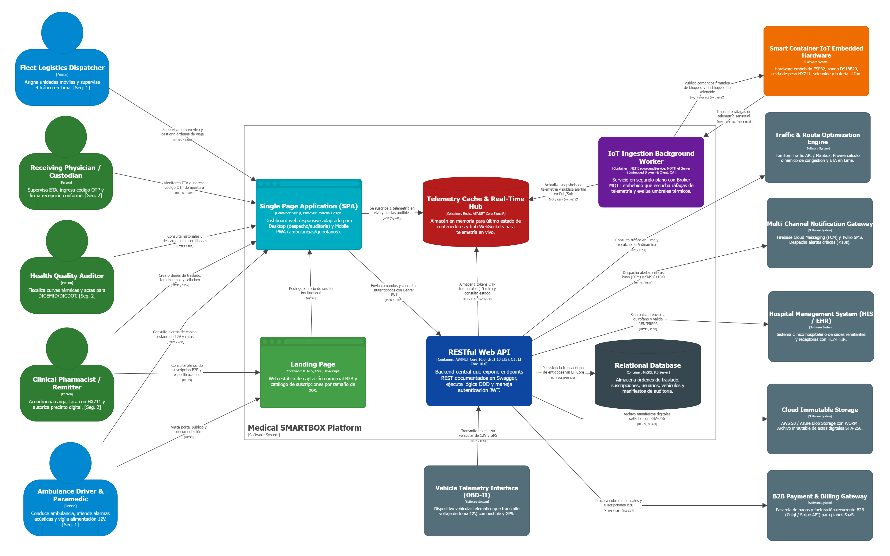

*Nota: Elaboración propia en Structurizr conforme a los estándares del modelo C4 para la arquitectura de software.*

---

### **6. Conclusiones y Transición hacia el Component Diagram (Capítulo 4.6.4)**

El **Software Architecture Container Diagram** formaliza la distribución física de responsabilidades de la plataforma:
1. **Cumplimiento Estricto del Stack:** Se ha integrado fielmente el ecosistema de tecnologías abiertas y estándares de la industria adoptados para la plataforma (**Vue.js 3 + PrimeVue**, **ASP.NET Core con Entity Framework Core**, **MySQL Server** y **Worker Services .NET**).
2. **Desacoplamiento de Carga:** La separación entre la **RESTful Web API** (orientada a transacciones de usuario) y el **IoT Ingestion Worker** (orientado a ráfagas continuas de telemetría MQTT) garantiza que la plataforma soporte cientos de ambulancias concurrentes en Lima sin degradar el rendimiento.
3. **Paso Siguiente:** Habiendo descompuesto el sistema en contenedores ejecutables, el siguiente capítulo (**4.6.4 Software Architecture Components Diagrams**) profundizará en la arquitectura interna del contenedor central más complejo: la **RESTful Web API en ASP.NET Core**, desglosándola bajo los principios de **Clean Architecture / Onion Architecture DDD** (Controllers, Application Handlers, Domain Aggregates e Infrastructure Repositories).

---

## **4.6.4. Software Architecture Components Diagrams**

### **1. Introducción y Fundamentos Arquitectónicos del Nivel 3 de C4**

Fundamentado en las directrices técnicas del **C4 Model** de Simon Brown, las prácticas de arquitectura hexagonal / Clean Architecture de Nick Tune y las convenciones de ingeniería de software para ASP.NET Core, un **Componente** es una agrupación modular y cohesiva de código (clases, interfaces y servicios) que reside dentro de un contenedor ejecutable, definiendo límites de responsabilidad explícitos.

#### Justificación del Alcance de Componentes en la Solución
Conforme a las recomendaciones de arquitectura de software para sistemas distribuidos, la descomposición de componentes se enfoca de manera prioritaria y detallada en el contenedor central: la **RESTful Web API en ASP.NET Core (C#)**, dado que en ella reside la lógica transaccional de negocio de los Bounded Contexts, la aplicación de Clean Architecture y la inversión de dependencias hacia la base de datos y pasarelas de terceros. Respecto al resto de contenedores de la arquitectura:
* **Single Page Application (SPA):** Se organiza modularmente mediante componentes adaptativos de interfaz en **Vue Framework con PrimeVue** (vistas móviles PWA para paramédicos y vistas de escritorio para coordinadores hospitalarios), los cuales consumen directamente la Web API mediante servicios HTTP tipados (Axios).
* **IoT Ingestion Background Worker:** Se estructura internamente mediante daemons de servicio (.NET `BackgroundService`) y manejadores de mensajes MQTTnet que enrutan telemetría cruda hacia la Web API y Redis.
* **Landing Page y Bases de Datos:** La Landing Page está constituida por recursos web estáticos (HTML5/CSS3/JS), mientras que la persistencia relacional en **MySQL 8.0 InnoDB** se especifica con total profundidad en el **Capítulo 4.8 (Database Design)**.

En este capítulo se realiza la descomposición exhaustiva de la **RESTful Web API en ASP.NET Core (C#)**, descomponiéndola bajo los principios de **Clean Architecture / DDD Onion Architecture (Inversión de Dependencias)** para evidenciar cómo se estructuran los módulos que dan soporte operativo al **Segmento 1 (Transporte / Ambulancias)** y al **Segmento 2 (Centros de Salud y Cadenas Farmacéuticas)**.

---

### **2. Arquitectura Interna del Contenedor: Clean / Onion Architecture**

Para evitar el acoplamiento directo entre los controladores HTTP y la base de datos MySQL, el contenedor **RESTful Web API** organiza sus componentes en cuatro capas concéntricas regidas por la **Regla de Dependencia** (las dependencias de código fuente solo apuntan hacia adentro, hacia el Dominio):

---

*Nota: Diagrama de Arquitectura de Capas Clean / Onion para el contenedor RESTful Web API elaborado conforme a los patrones de Clean Architecture y Domain-Driven Design para la plataforma.*

---

1. **Presentation Layer (Capa de Controladores REST):**  
   Recibe las solicitudes HTTP desde la Single Page Application (Vue.js), valida los tokens JWT de autorización y el formato básico de los datos entrantes (DTOs), delegando inmediatamente la ejecución hacia los servicios de aplicación.
2. **Application Layer (Capa de Aplicación y Casos de Uso):**  
   Orquesta los flujos de negocio y coordina las transacciones sin contener reglas de negocio del dominio. Convierte DTOs en entidades, invoca a los agregados del dominio, interactúa con interfaces de repositorio y coordina adaptadores externos.
3. **Domain Layer (Capa de Dominio - Núcleo Central Inmutable):**  
   Contiene los Agregados Raíz (*Aggregate Roots*), Entidades, Objetos de Valor (*Value Objects*) y las **invariantes de negocio** que no dependen de ningún framework o base de datos. Define las interfaces de repositorio que la infraestructura debe implementar.
4. **Infrastructure Layer (Capa de Infraestructura y Persistencia):**  
   Implementa las interfaces de repositorio utilizando **Entity Framework Core sobre MySQL 8.0**, gestiona el contexto de base de datos (`AppDbContext`) e implementa los adaptadores hacia servicios en la nube externos (TomTom, Firebase, Twilio, AWS S3).

Conforme a los fundamentos del C4 Model, en este Nivel 3 (Component Diagrams) se modelan los artefactos modulares inyectables en el contenedor de inversión de control (IoC) de ASP.NET Core (Controladores, Servicios de Aplicación, Repositorios, Adaptadores y DbContext). Las entidades de dominio, objetos de valor y estructuras internas de clases corresponden al Nivel 4 (Code / UML Class Diagrams), los cuales se especifican con exhaustividad técnica en el Capítulo 4.7.

---

### **3. Catálogo Detallado de Componentes de la RESTful Web API**

A continuación se detallan los componentes estructurados por capa para los Bounded Contexts principales:

<table border="1" cellpadding="6" cellspacing="0" style="border-collapse: collapse; width: 100%;">
  <thead>
    <tr>
      <th>Capa Arquitectónica</th>
      <th>Componente C4</th>
      <th>Tecnología / Framework</th>
      <th>Responsabilidades Técnicas y de Negocio</th>
      <th>Dependencias Inyectadas</th>
    </tr>
  </thead>
  <tbody>
    
    <tr>
      <td rowspan="7"><strong>Presentation (Controllers & Hubs)</strong></td>
      <td><code>AuthController</code></td>
      <td>ASP.NET Core ControllerBase, Swagger Attributes</td>
      <td>Expone endpoints para autenticación JWT, renovación de tokens, registro de usuarios institucionales y roles.</td>
      <td><code>IIdentityService</code></td>
    </tr>
    <tr>
      <td><code>SubscriptionsController</code></td>
      <td>ASP.NET Core ControllerBase, Swagger Attributes</td>
      <td>Expone endpoints para planes SaaS B2B, cupos de contenedores (5L/20L) y vinculación de ambulancias.</td>
      <td><code>ISubscriptionService</code></td>
    </tr>
    <tr>
      <td><code>TransportsController</code></td>
      <td>ASP.NET Core ControllerBase, Swagger Attributes</td>
      <td>Expone endpoints REST para crear órdenes de traslado de emergencia, asignar ambulancias (Seg. 1) y consultar rutas activas.</td>
      <td><code>ITransportService</code></td>
    </tr>
    <tr>
      <td><code>ContainersController</code></td>
      <td>ASP.NET Core ControllerBase, Swagger Attributes</td>
      <td>Expone endpoints para calibración de tara y pesaje neto con celda HX711, y envío de comandos de bloqueo solenoide.</td>
      <td><code>ITelemetryService</code></td>
    </tr>
    <tr>
      <td><code>AlertsController</code></td>
      <td>ASP.NET Core ControllerBase, Swagger Attributes</td>
      <td>Expone endpoints para acuse de recibo de alarmas acústicas en cabina (Seg. 1) y registro de mitigación ante excursión térmica.</td>
      <td><code>IIncidentService</code></td>
    </tr>
    <tr>
      <td><code>CustodyController</code></td>
      <td>ASP.NET Core ControllerBase, Swagger Attributes</td>
      <td>Expone endpoints para validar el <strong>código OTP de un solo uso</strong> en rampa hospitalaria (Seg. 2) y descargar el acta digital certificada.</td>
      <td><code>ICustodyService</code></td>
    </tr>
    <tr>
      <td><code>TelemetryHub</code></td>
      <td>ASP.NET Core SignalR Hub, Authorize Attribute</td>
      <td>Expone el endpoint de WebSockets (<code>/hubs/telemetry</code>) para suscripción en tiempo real a curvas térmicas, estado de 12V y posición GPS de SmartBoxes.</td>
      <td><code>IRealTimeCacheService</code></td>
    </tr>
    
    <tr>
      <td rowspan="7"><strong>Application (Services / Use Cases)</strong></td>
      <td><code>IdentityService</code></td>
      <td>C# Service Class, JWT Bearer Handler</td>
      <td>Valida credenciales con hashing BCrypt, emite tokens criptográficos JWT y verifica permisos RBAC de ambos segmentos.</td>
      <td><code>IUserRepository</code>, <code>ITokenGeneratorService</code></td>
    </tr>
    <tr>
      <td><code>SubscriptionService</code></td>
      <td>C# Service Class</td>
      <td>Gestiona planes institucionales B2B, valida cupos de SmartBoxes activos por institución y acuerdos de soporte SLA.</td>
      <td><code>ISubscriptionRepository</code></td>
    </tr>
    <tr>
      <td><code>TransportApplicationService</code></td>
      <td>C# Service Class, FluentValidation</td>
      <td>Orquesta la planificación del viaje, valida tiempos de isquemia fría (&lt;4h corazón, &lt;8h hígado) y consulta a TomTom para recalcular ETA dinámico.</td>
      <td><code>ITransportRepository</code>, <code>ITrafficRoutingService</code></td>
    </tr>
    <tr>
      <td><code>TelemetryProcessingService</code></td>
      <td>C# Service Class, MediatR</td>
      <td>Valida snapshots de telemetría, comprueba rango térmico (+2.0 °C a +8.0 °C), detecta desconexión de energía de 12V y persiste periódicamente bloques consolidados en MySQL vía <code>ISmartContainerRepository</code> para alimentar las actas de DIGEMID.</td>
      <td><code>ISmartContainerRepository</code>, <code>IRealTimeCacheService</code></td>
    </tr>
    <tr>
      <td><code>TelemetryAlertSubscriber</code></td>
      <td>BackgroundService (C#), IHostedService</td>
      <td>Servicio continuo en segundo plano que escucha los canales Redis Pub/Sub (<code>smartbox.alerts.critical</code> y <code>smartbox.telemetry.batch</code>); mediante <code>IServiceScope</code>, delega de forma segura el manejo de alertas a <code>IncidentResponseService</code> y la persistencia de lotes a <code>TelemetryProcessingService</code>.</td>
      <td><code>IServiceScopeFactory</code>, <code>IRealTimeCacheService</code></td>
    </tr>
    <tr>
      <td><code>IncidentResponseService</code></td>
      <td>C# Service Class</td>
      <td>Evalúa severidad de desviaciones térmicas y orquesta el despacho omnicanal de alertas push y SMS hacia la tripulación y médicos.</td>
      <td><code>IIncidentRepository</code>, <code>INotificationService</code></td>
    </tr>
    <tr>
      <td><code>CustodyVerificationService</code></td>
      <td>C# Service Class</td>
      <td>Comprueba la validez temporal del OTP, comanda el desbloqueo electromecánico de la tapa y genera el manifiesto sellado con SHA-256.</td>
      <td><code>ICustodyRepository</code>, <code>IStorageService</code>, <code>IRealTimeCacheService</code></td>
    </tr>
    
    <tr>
      <td rowspan="5"><strong>Domain (Core Business)</strong> <small style="color: #666;"><em>(Límites de dominio orquestados por Aplicación; modelado estructural de clases detallado en Capítulo 4.7)</em></small></td>
      <td><code>UserAccount</code> & <code>SubscriptionPlan</code></td>
      <td>Plain C# (POCO), Domain Entities</td>
      <td>Representan las identidades, roles clínicos, límites de flota de SmartBoxes y acuerdos comerciales B2B.</td>
      <td>—</td>
    </tr>
    <tr>
      <td><code>SmartContainer</code></td>
      <td>DDD Aggregate Root</td>
      <td>Encapsula el estado electromecánico de la tapa, celda Peltier, batería LiFePO4 y el historial telemétrico.</td>
      <td>—</td>
    </tr>
    <tr>
      <td><code>TransportOrder</code> & <code>DispatchTrip</code></td>
      <td>DDD Aggregate Roots</td>
      <td>Modelan la solicitud clínica de traslado, asignación de paramédico/ambulancia y ruta con isquemia fría controlada.</td>
      <td>—</td>
    </tr>
    <tr>
      <td><code>CriticalIncident</code></td>
      <td>DDD Aggregate Root</td>
      <td>Modela anomalías térmicas y de energía auxiliar, gobernando las reglas de escalamiento y resoluciones de mitigación.</td>
      <td>—</td>
    </tr>
    <tr>
      <td><code>CustodyTransfer</code></td>
      <td>DDD Aggregate Root</td>
      <td>Gobernado por la máquina de estados de entrega, validación de clave OTP temporal y manifiesto inmutable DIGEMID.</td>
      <td>—</td>
    </tr>
    
    <tr>
      <td rowspan="9"><strong>Infrastructure (Persistence & Adapters)</strong></td>
      <td><code>AppDbContext</code></td>
      <td>Entity Framework Core 10.0 (.NET 10 LTS), Pomelo MySQL / Oracle MySQL EF Core</td>
      <td>Contexto de base de datos que mapea las entidades del dominio hacia el esquema relacional en MySQL 8.0 (TCP 3306).</td>
      <td><code>DbContextOptions</code></td>
    </tr>
    <tr>
      <td><code>EF Repositories Implementations</code></td>
      <td>EF Core Repositories (C#)</td>
      <td>Implementan <code>IUserRepository</code>, <code>ISubscriptionRepository</code>, <code>ITransportRepository</code>, <code>ISmartContainerRepository</code>, etc.</td>
      <td><code>AppDbContext</code></td>
    </tr>
    <tr>
      <td><code>TomTomRoutingAdapter</code></td>
      <td>HttpClient, Polly (Retry/CircuitBreaker)</td>
      <td>Consume la API de TomTom para obtener matrices de tiempo considerando el tráfico vehicular en avenidas de Lima.</td>
      <td><code>IHttpClientFactory</code></td>
    </tr>
    <tr>
      <td><code>FirebaseTwilioNotificationAdapter</code></td>
      <td>FirebaseAdmin SDK, Twilio REST API</td>
      <td>Despacha notificaciones push a la PWA móvil y mensajes de texto SMS a los teléfonos de la guardia médica.</td>
      <td><code>IOptions&lt;NotificationSettings&gt;</code></td>
    </tr>
    <tr>
      <td><code>AwsS3StorageAdapter</code></td>
      <td>AWSSDK.S3 (C#)</td>
      <td>Sube los manifiestos de viaje en PDF generados con sellado SHA-256 a buckets con retención WORM inmutable.</td>
      <td><code>IAmazonS3</code></td>
    </tr>
    <tr>
      <td><code>CulqiPaymentAdapter</code></td>
      <td>HttpClient, Polly (Resilience)</td>
      <td>Implementa <code>IPaymentGateway</code> para procesamiento automatizado de débitos B2B y validación de comprobantes de pago.</td>
      <td><code>IHttpClientFactory</code></td>
    </tr>
    <tr>
      <td><code>HospitalFhirAdapter</code></td>
      <td>HttpClient, HL7.Fhir.R4</td>
      <td>Implementa <code>IHospitalInteroperabilityService</code> para sincronización de preavisos con el HIS hospitalario y consulta de habilitación RENIPRESS.</td>
      <td><code>IHttpClientFactory</code></td>
    </tr>
    <tr>
      <td><code>JwtTokenGeneratorAdapter</code></td>
      <td>System.IdentityModel.Tokens.Jwt, C# Class</td>
      <td>Implementa <code>ITokenGeneratorService</code> para generar y firmar criptográficamente tokens JWT con claims institucionales.</td>
      <td><code>IOptions&lt;JwtSettings&gt;</code></td>
    </tr>
    <tr>
      <td><code>RedisRealTimeCacheAdapter</code></td>
      <td>StackExchange.Redis (C#)</td>
      <td>Implementa <code>IRealTimeCacheService</code> para gestión de estado volátil en memoria y suscripción a canales Pub/Sub.</td>
      <td><code>IConnectionMultiplexer</code></td>
    </tr>
  </tbody>
</table>

---

### **4. Matriz de Inyección de Dependencias y Ciclos de Vida (IoC Container)**

Siguiendo las convenciones oficiales de desarrollo para ASP.NET Core de Microsoft, los componentes se registran en el contenedor de dependencias nativo de ASP.NET Core (`Program.cs`) respetando sus ciclos de vida:

| Interfaz (Abstracción) | Implementación Concreta | Ciclo de Vida (*Service Lifetime*) | Justificación Arquitectónica |
|---|---|---|---|
| `IIdentityService` | `IdentityService` | `Scoped` | Maneja la sesión y tokens JWT por cada solicitud HTTP entrante. |
| `ISubscriptionService` | `SubscriptionService` | `Scoped` | Valida cuotas y estado de suscripción por transacción. |
| `ITransportService` | `TransportApplicationService` | `Scoped` | Instanciado por cada petición HTTP para mantener el contexto de la transacción. |
| `ITelemetryService` | `TelemetryProcessingService` | `Scoped` | Maneja operaciones de validación por solicitud. |
| `TelemetryAlertSubscriber` | `TelemetryAlertSubscriber` | `Singleton` (`IHostedService`) | Mantiene la escucha permanente del canal Redis Pub/Sub y crea ámbitos temporales (`IServiceScope`) para ejecutar servicios `Scoped`. |
| `IIncidentService` | `IncidentResponseService` | `Scoped` | Mantiene el estado de evaluación de la incidencia en curso. |
| `ICustodyService` | `CustodyVerificationService` | `Scoped` | Gestiona el proceso transaccional de entrega con OTP y comanda el desbloqueo vía Redis Pub/Sub hacia el despachador MQTT. |
| `AppDbContext` | `AppDbContext` (EF Core) | `Scoped` | Un contexto por request garantiza coherencia del patrón *Unit of Work*. |
| `IUserRepository` | `UserRepository` | `Scoped` | Acceso a credenciales y roles asistenciales vía EF Core. |
| `ISubscriptionRepository` | `SubscriptionRepository` | `Scoped` | Persistencia de contratos y cuotas institucionales. |
| `ITransportRepository` | `TransportRepository` | `Scoped` | Comparte el mismo `AppDbContext` que el servicio de aplicación. |
| `ISmartContainerRepository`| `SmartContainerRepository` | `Scoped` | Persistencia coordinada de contenedores. |
| `IIncidentRepository` | `IncidentRepository` | `Scoped` | Persistencia transaccional de incidentes térmicos y acciones de mitigación. |
| `ICustodyRepository` | `CustodyRepository` | `Scoped` | Persistencia de transferencias de custodia, tokens OTP y actas digitales. |
| `ITrafficRoutingService` | `TomTomRoutingAdapter` | `Transient` / `Typed HttpClient` | Utiliza pools de sockets optimizados con reintentos automáticos (Polly). |
| `INotificationService` | `FirebaseTwilioNotificationAdapter` | `Singleton` | Reutiliza los clientes de conexión hacia FCM y Twilio de forma concurrente. |
| `IStorageService` | `AwsS3StorageAdapter` | `Singleton` | Adaptador de cliente S3 autenticado de larga duración. |
| `IPaymentGateway` | `CulqiPaymentAdapter` | `Transient` / `Typed HttpClient` | Procesamiento transaccional de débitos B2B con aislamiento por solicitud. |
| `IHospitalInteroperabilityService` | `HospitalFhirAdapter` | `Transient` / `Typed HttpClient` | Consultas de interoperabilidad hospitalaria HL7-FHIR y estado RENIPRESS con resiliencia Polly. |
| `ITokenGeneratorService` | `JwtTokenGeneratorAdapter` | `Scoped` | Genera tokens criptográficos JWT con claims y firmas digitales para usuarios autenticados. |
| `IRealTimeCacheService` | `RedisRealTimeCacheAdapter` | `Singleton` | Administra la conexión multiplexada persistente hacia Redis para telemetría en tiempo real y canales SignalR Pub/Sub. |
| `MapHub<TelemetryHub>` | `TelemetryHub` (SignalR) | `Transient` / *Per-Invocation* | Endpoint WebSockets (`/hubs/telemetry`) para distribución reactiva de eventos y telemetría hacia los clientes SPA conectados. |

---

### **5. Especificación Visual Oficial y Bloque de Diagramación del Backend RESTful API**

---

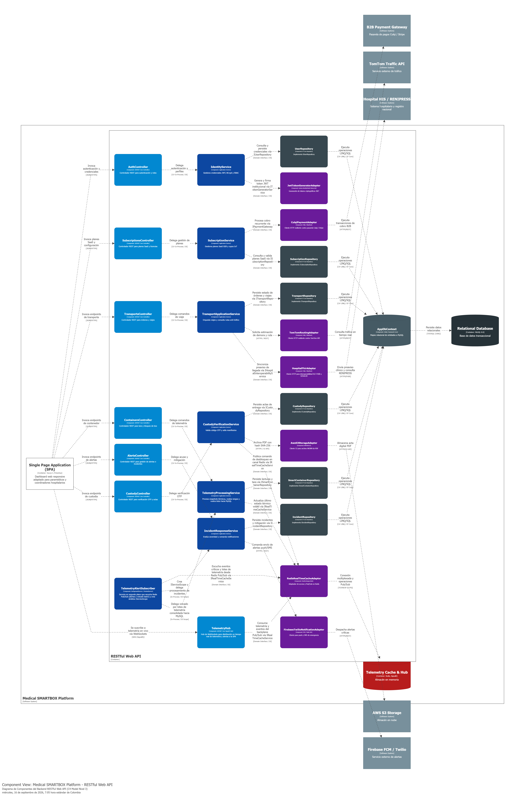

*Nota: Elaboración propia en Structurizr conforme a los estándares del modelo C4 para la arquitectura de software.*

---

### **6. Desglose Componencial de Contenedores Satélites (SPA y Ingestion Worker)**

Para complementar la visión integral de la arquitectura en el Nivel 3 (Componentes) conforme a las directrices de ingeniería de software, se presenta la descomposición modular de los otros dos contenedores de software activos del sistema:

#### **6.1. Single Page Application (Frontend Web Vue 3 + PrimeVue)**
* **Router & Navigation Guard (Vue Router):** Gestiona rutas protegidas por roles sanitarios (`/dispatch`, `/telemetry-live`, `/handover-otp`, `/audit-manifests`), interceptando transiciones de usuario sin token JWT válido.
* **State Management Stores (Pinia):**
  * `useAuthStore`: Almacena perfil del usuario autenticado, RUC institucional y claims de autorización.
  * `useTripTrackingStore`: Mantiene la posición geográfica en vivo de la ambulancia, el tiempo estimado de llegada (ETA) y la ruta activa.
  * `useSmartBoxStore`: Sincroniza en tiempo real la temperatura interna (+2°C a +8°C), nivel de batería, estado del cerrojo y alertas críticas recibidas vía WebSocket SignalR.
* **Componentes Visuales Especializados (PrimeVue + Leaflet):**
  * `LiveAmbulanceMap`: Renderiza el mapa interactivo de Lima Metropolitana con trazado de polilíneas y geocercas hospitalarias de 2 km.
  * `ThermalTelemetryGauge`: Instrumento gráfico tipo tacómetro que resalta zonas térmicas seguras y dispara avisos visuales ante aproximación al límite de excursión.
  * `OtpHandoverDialog`: Interfaz modal para ingreso del código OTP de 6 dígitos con teclado numérico accesible para cirujanos y farmacéuticos en quirófano.
* **HTTP Client & Resiliency (Axios ApiClient):** Instancia de Axios configurada con interceptores para inyección automática del encabezado `Authorization: Bearer <token>` y captura uniforme de errores RFC 7807 (ProblemDetails).

---

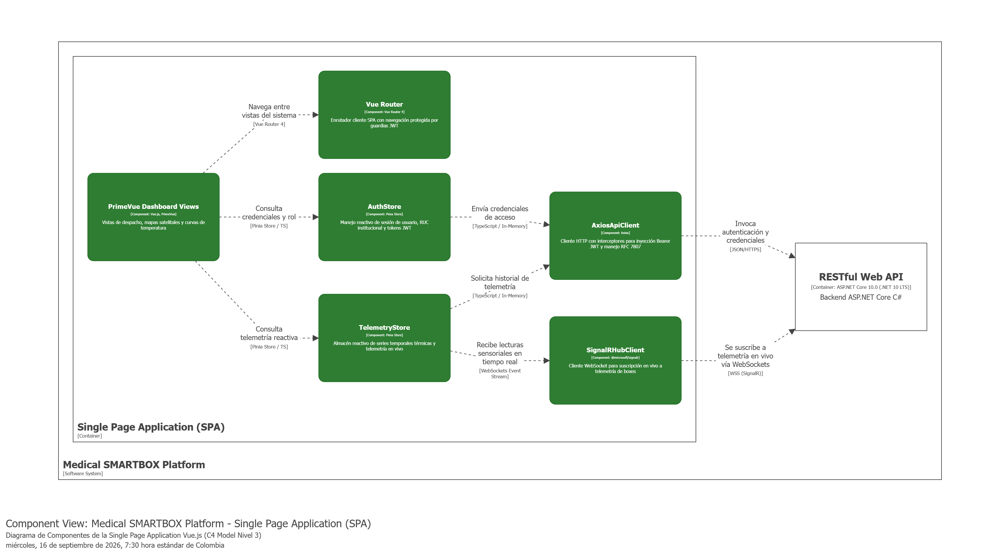

*Nota: Elaboración propia en Structurizr conforme a la notación C4 Model (Nivel 3: Componentes) de Simon Brown.*

---

#### **6.2. IoT Telemetry Ingestion Worker (.NET BackgroundService)**
* **MqttTelemetryConsumer:** Servicio residente en segundo plano basado en `MQTTnet` que mantiene una conexión persistente bidireccional sobre TLS (puerto 8883) suscrito al tópico canónico `smartbox/+/telemetry`.
* **TelemetryPayloadValidator:** Valida la estructura JSON del mensaje sensorial, verifica la firma criptográfica HMAC-SHA256 generada por el firmware del microcontrolador ESP32 y descarta paquetes corruptos.
* **ThermalThresholdEvaluator:** Evalúa si la temperatura supera los umbrales clínicos (+2.0 °C / +8.0 °C); de detectar desviación o desconexión vehicular de 12V, emite un evento interno hacia el pipeline de alertas críticas.
* **RedisTelemetryPublisher:** Publica las lecturas normalizadas en el canal Pub/Sub de Redis para su propagación inmediata a la Web API y clientes conectados mediante SignalR Hubs.
* **MqttCommandDispatcher:** Componente residente que se suscribe al canal Redis Pub/Sub (`smartbox.commands.actuators`) para consumir comandos de bloqueo y desbloqueo emitidos por `CustodyVerificationService`, publicando mensajes firmados vía MQTT sobre TLS (puerto 8883) hacia el actuador del cerrojo electromecánico en el microcontrolador ESP32 (`smartbox/{boxId}/commands`).

---

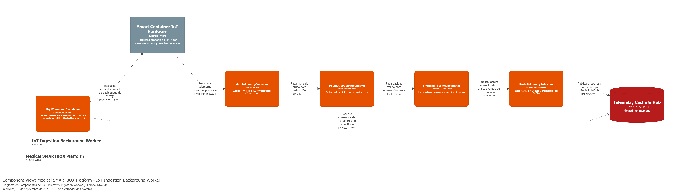

*Nota: Elaboración propia en Structurizr conforme a la notación C4 Model (Nivel 3: Componentes) de Simon Brown.*

---

### **7. Conclusiones y Transición hacia el Diseño Orientado a Objetos (Capítulo 4.7)**

El **Software Architecture Components Diagram** demuestra la aplicación rigurosa de los principios de **Clean Architecture e Inversión de Dependencias (DIP)**:
1. **Desacoplamiento Estricto:** La capa de Dominio permanece libre de dependencias hacia MySQL, HTTP o bibliotecas de terceros; los controladores y repositorios dependen de abstracciones (`Interfaces`).
2. **Alta Cohesión:** Cada Bounded Context cuenta con su tríada de Controlador, Servicio de Aplicación y Repositorio, garantizando mantenibilidad y escalabilidad.
3. **Paso Siguiente:** Habiendo establecido la estructura modular de componentes, el siguiente capítulo (**4.7 Software Object-Oriented Design / 4.7.1 Class Diagrams**) detallará el modelado estático orientado a objetos de estas clases, especificando atributos tipados, modificadores de acceso (`+`, `-`, `#`), métodos con parámetros y tipos de retorno, y relaciones UML con multiplicidades exactas.

---
