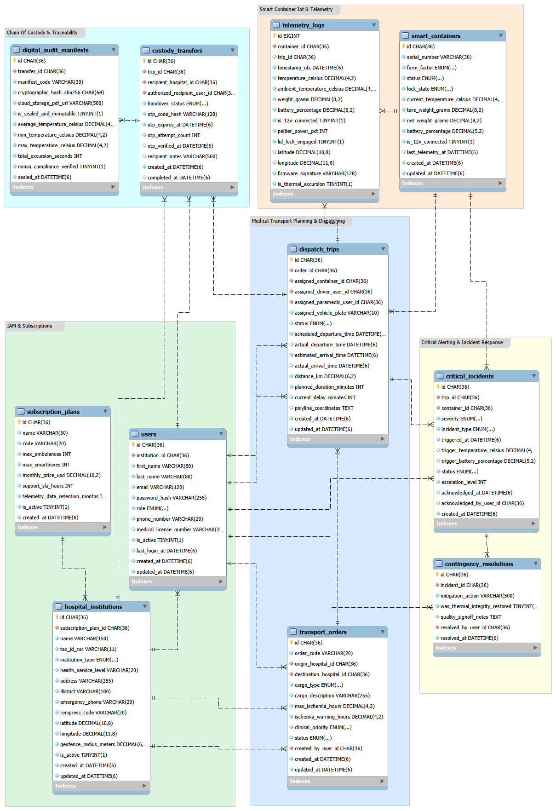

# **4.8. Database Design**

El diseño de la base de datos de **Medical SMARTBOX** establece la arquitectura de persistencia física que da soporte a los procesos transaccionales, telemétricos y de auditoría clínica de la plataforma. A diferencia del Diagrama de Clases de Software (Capítulo 4.7), cuyo foco es la encapsulación del comportamiento y la protección de invariantes en memoria mediante agregados de Domain-Driven Design (DDD), el modelo relacional se especializa en la integridad referencial estricta, la normalización formal, la indexación de alta velocidad para series temporales de IoT y la inmutabilidad jurídica de los registros de custodia requeridos por las entidades regulatorias peruanas (**DIGEMID** y **MINSA**).

La persistencia del sistema está gobernada por un enfoque **Code-First** a través de **Entity Framework Core 10.0 (.NET 10 LTS)** sobre el motor relacional **MySQL Server 8.0 (Enterprise / Community)** utilizando el motor de almacenamiento **InnoDB**. Siguiendo las convenciones oficiales de desarrollo para Microsoft .NET y ASP.NET Core Framework, la configuración de esquemas se desacopla mediante clases `IEntityTypeConfiguration<TEntity>` basadas en **Fluent API**, asegurando que el modelo de dominio permanezca limpio (*Persistence Ignorance*) mientras que la base de datos física explota al máximo las restricciones nativas del motor (`FOREIGN KEY`, `UNIQUE`, `CHECK`, `INDEX`).

### Decisiones Arquitectónicas de Persistencia Relacional:
1. **Motor de Almacenamiento y Conjunto de Caracteres:**  
   Se selecciona exclusivamente **InnoDB** por su soporte nativo de transacciones compatibles con **ACID**, bloqueo a nivel de fila (*row-level locking*) y soporte de claves foráneas con verificación en tiempo de ejecución. La base de datos opera bajo el conjunto de caracteres `utf8mb4` y la colación `utf8mb4_unicode_ci`, garantizando soporte pleno para caracteres especiales clínicos, acentos en español latinoamericano (`es_419`) y firmas criptográficas sin riesgo de truncamiento.
2. **Identificadores Universales Únicos (UUID / GUID):**  
   Para desacoplar la generación de identificadores entre los nodos de borde (ESP32 en ambulancias) y los microservicios sin colisiones ni consultas previas de secuencia, todas las entidades maestras y transaccionales utilizan identificadores únicos universales (`Guid` en C#) persistidos como columnas `CHAR(36)` con formato canónico de guiones (`8-4-4-4-12`). La única excepción son los registros de telemetría sensorial de alta frecuencia (`telemetry_logs`), donde se utiliza un identificador numérico secuencial `BIGINT UNSIGNED AUTO_INCREMENT` como clave primaria física para minimizar la fragmentación de índices B-Tree en inserciones continuas masivas.
3. **Estrategia de Aplanamiento de Value Objects (*Flattening*):**  
   Conforme a los patrones de diseño de arquitectura orientada al dominio formulados por Nick Tune, los *Value Objects* del dominio carecen de identidad propia y representan atributos compuestos inmutables. Para evitar la sobrecarga de uniones relacionales (*JOINs*) en consultas críticas, se aplica la técnica de *Value Object Flattening*:
   * El Value Object `IschemiaTimeLimit` se aplana en las columnas `max_ischemia_hours` e `ischemia_warning_hours` dentro de `transport_orders`.
   * El Value Object `OtpToken` se aplana en las columnas `otp_code_hash`, `otp_expires_at` y `otp_attempt_count` dentro de `custody_transfers`.
   * Las coordenadas geográficas de telemetría se aplanan en `latitude` y `longitude` en `telemetry_logs`.
4. **Marcas Temporales UTC con Precisión de Microsegundos:**  
   Dado que los contenedores inteligentes registran desviaciones térmicas en milisegundos y las ambulancias se desplazan rápidamente por arterias viales, todas las fechas y horas se registran en formato universal coordinado (`DateTime.UtcNow`) utilizando el tipo `DATETIME(6)`. Esto elimina ambigüedades por husos horarios y garantiza orden estricto en el procesamiento reactivo de eventos.
5. **Estrategia de Persistencia de Entidades Internas de Agregados (*Entity Flattening*):**  
   En el modelo orientado a objetos (Capítulo 4.7), la raíz de agregado `SmartContainer` encapsula entidades subordinadas como `ElectromechanicalLock` (cerrojo de seguridad) y `BatteryUnit` (unidad de alimentación LiFePO4), mientras que la raíz `DispatchTrip` encapsula la entidad de ruta `TransportRoute`. En la base de datos física relacional, para evitar la proliferación innecesaria de tablas satélite 1 a 1 y maximizar la eficiencia en consultas operativas sin sobrecarga de operaciones `JOIN`, estas entidades subordinadas se integran y aplanan directamente como columnas dentro de sus tablas principales:
   * En `smart_containers`: se persisten atómicamente `lock_state` (estado del cerrojo), `battery_percentage` (porcentaje de carga) e `is_12v_connected` (alimentación auxiliar 12V).
   * En `dispatch_trips`: se persisten directamente los atributos de ruta calculados `distance_km`, `planned_duration_minutes`, `current_delay_minutes` y `polyline_coordinates`.  
   Esta decisión garantiza un esquema de almacenamiento de alto rendimiento para las consultas operativas en ruta sin comprometer la encapsulación conceptual definida en el diseño orientado a objetos.
6. **Conversión de Tipos Numéricos entre Dominio y Persistencia (`double` a `DECIMAL`):**  
   En el modelo de clases de dominio (Capítulo 4.7), las lecturas sensoriales y telemétricas (temperatura, peso neto y coordenadas geográficas) se representan como tipos numéricos en coma flotante para optimizar el rendimiento computacional de cálculos en memoria y procesamiento de flujos IoT. En la persistencia física en MySQL, estos valores se almacenan rigurosamente como tipos de coma fija `DECIMAL(p, s)` (`DECIMAL(4,2)` para temperatura, `DECIMAL(6,2)` para peso en gramos y `DECIMAL(10,8)` / `DECIMAL(11,8)` para latitud/longitud), eliminando cualquier riesgo de discrepancia por redondeo o imprecisión binaria en los registros médicos.
7. **Delimitación de Flota Vehicular y Activos Externos (Segmento 1):**  
   En el modelo SaaS, las ambulancias constituyen activos vehiculares de transporte sanitario operados por terceros (Segmento 1) identificados por su número de placa (`assigned_vehicle_plate`) en las órdenes de despacho (`dispatch_trips`). El control de cuotas comerciales de suscripción (`max_ambulances` en `subscription_plans`) se valida a nivel de servicio contra las unidades móviles simultáneamente activas, preservando el foco del software exclusivamente en la gestión del contenedor médico inteligente y evitando la sobreingeniería de tablas maestras vehiculares internas.
8. **Invariantes Térmicas de Firmware y Control de Celda Peltier:**  
   La celda termoeléctrica Peltier opera bajo un punto de consigna (*setpoint*) fijo y normado (+4.0 °C) implementado como invariante de control en el firmware autónomo del ESP32. Su estado no demanda columnas de configuración mutable en la tabla de catálogo `smart_containers`, sino que su modulación dinámica de potencia se audita y persiste históricamente mediante la columna `peltier_power_pct` en la tabla de series temporales de alta frecuencia `telemetry_logs`.
9. **Correspondencia de Nomenclatura entre Dominio y Esquema Físico:**  
   Para preservar la pureza del modelo conceptual de dominio (Capítulo 4.7) formulado bajo el lenguaje ubicuo (*PascalCase*) y garantizar total coherencia con las convenciones relacionales del esquema físico en MySQL 8.0 (*snake_case*), se formaliza la siguiente matriz de correspondencia:
   * `SubscriptionPlan.PlanCode` → `code` (tabla `subscription_plans`).
   * `SubscriptionPlan.MaxFleetBoxes` → `max_smartboxes` (tabla `subscription_plans`).
   * `SubscriptionPlan.MonthlyCostUsd` → `monthly_price_usd` (tabla `subscription_plans`).
   * `HospitalInstitution.OfficialName` → `name` (tabla `hospital_institutions`).
   * `UserAccount.ProfessionalLicenseNumber` → `medical_license_number` (tabla `users`).
   * `TransportOrder.Priority` → `clinical_priority` (tabla `transport_orders`).
   * `CustodyTransfer.TransferredAt` → `completed_at` (tabla `custody_transfers`).
   * `DigitalAuditManifest.GeneratedAt` → `sealed_at` (tabla `digital_audit_manifests`).
   * `DigitalAuditManifest.CloudStorageUrl` → `cloud_storage_pdf_url` (tabla `digital_audit_manifests`).

---

### **4.8.1. Database Diagrams**

#### **1. Justificación de Normalización y Desnormalización Controlada**

El modelo de datos relacional de Medical SMARTBOX ha sido diseñado bajo una estricta disciplina de normalización matemática para erradicar redundancias y anomalías de actualización, incorporando desnormalización controlada únicamente en puntos donde la seguridad clínica y el rendimiento de consulta lo justifican plenamente:

* **Primera Forma Normal (1NF):**  
  Todas las columnas contienen exclusivamente valores atómicos e indivisibles. No existen grupos repetitivos ni atributos multivaluados; por ejemplo, las coordenadas poligonales de rutas se representan mediante colecciones ordenadas o columnas específicas de latitud/longitud decimal, y la tripulación de la ambulancia se descompone en roles foráneos atómicos (`assigned_driver_user_id` y `assigned_paramedic_user_id`).
* **Segunda Forma Normal (2NF):**  
  El modelo se encuentra en 1NF y cada atributo no primario posee una dependencia funcional completa de la clave primaria. En ninguna tabla existen dependencias parciales, puesto que todas las tablas maestras emplean identificadores subrogados únicos (`id`), garantizando que cada columna describa íntegramente a dicha entidad.
* **Tercera Forma Normal (3NF):**  
  El modelo se encuentra en 2NF y ningún atributo no clave depende transitivamente de otra columna no clave. Por ejemplo, los datos del hospital de origen y destino (RUC, dirección, acreditación) no se duplican dentro de `transport_orders`, sino que se relacionan mediante claves foráneas normalizadas (`origin_hospital_id`, `destination_hospital_id`) hacia `hospital_institutions`.
* **Desnormalización Controlada Justificada por Criterio Clínico:**  
  En la tabla `digital_audit_manifests` (Contexto de Cadena de Custodia), se almacenan de manera precalculada las métricas `average_temperature_celsius`, `min_temperature_celsius`, `max_temperature_celsius` y `total_excursion_seconds`.  
  *Justificación Técnica y Legal:* Un traslado en ambulancia puede generar miles de lecturas de telemetría en `telemetry_logs`. Si un auditor de calidad de DIGEMID o un cirujano de trasplantes requiere verificar el acta de entrega durante una auditoría o minutos antes de implantar un corazón, calcular agregaciones dinámicas (`AVG`, `MIN`, `MAX`) sobre millones de filas degradaría la base de datos y retardaría la respuesta médica. Además, el acta digital constituye un documento médico-legal sellado criptográficamente con hash SHA-256 (`cryptographic_hash_sha256`); desnormalizar estas métricas en el momento exacto del cierre de custodia garantiza que las cifras auditadas permanezcan inmutables en el tiempo, protegidas de cualquier alteración histórica o depuración de logs sensoriales antiguos.
* **Principio de Custodia Unívoca y Ausencia de Tablas N:M:**  
  A diferencia de aplicaciones comerciales genéricas, el modelo relacional descarta de forma deliberada el uso de tablas intermedias de descomposición muchos a muchos (N:M). Bajo la normativa de DIGEMID (R.M. N° 833-2015/MINSA) y DIGDOT (Directiva Sanitaria N° 152), el transporte asistencial de órganos, hemoderivados y vacunas críticas opera bajo el **Principio de Custodia Unívoca (1 Orden de Traslado → 1 Despacho → 1 Contenedor Inteligente → 1 Custodio Receptor Acreditado)**. Establecer asignaciones múltiples concurrentes (N:M) introduciría vacíos de trazabilidad médico-legal y riesgo inaceptable de contaminación cruzada o confusión de muestras biológicas, por lo que el esquema relacional refuerza estrictamente relaciones 1:1 y 1:N con integridad referencial restrictiva.

---

#### **2. Diccionario de Datos Exhaustivo por Bounded Context**

A continuación se detalla la especificación formal de las 11 tablas del sistema relacional agrupadas por sus Bounded Contexts, cubriendo de forma estricta las necesidades operativas del **Segmento 1 (Ambulancias y Logística)** y el **Segmento 2 (Hospitales y Laboratorios B2B)**:

---

##### **4.8.1.1. Bounded Context: IAM & Subscriptions (Soporte B2B y Acceso)**

Garantiza la autenticación, la asignación de roles médicos y la gestión de planes SaaS para clínicas y flotas de ambulancias.

###### **Tabla 1: `subscription_plans`**
Almacena los niveles de suscripción B2B que determinan la capacidad operativa de ambulancias y contenedores asignados a cada institución cliente.

| Columna | Tipo de Dato MySQL | Nulo | Restricciones / Constraints | Descripción y Regla de Negocio |
|---|---|---|---|---|
| `id` | `CHAR(36)` | **NOT NULL** | `PRIMARY KEY` | Identificador único del plan en formato UUIDv4. |
| `name` | `VARCHAR(50)` | **NOT NULL** | — | Nombre comercial del plan (ej. *Plan Red Hospitalaria Integral*). |
| `code` | `VARCHAR(20)` | **NOT NULL** | `UNIQUE` | Código alfanumérico único para facturación (ej. `HOSP-ENTERPRISE-01`). |
| `max_ambulances` | `INT` | **NOT NULL** | `DEFAULT 5, CHECK (> 0)` | Límite máximo de ambulancias autorizadas para operar en la red. |
| `max_smartboxes` | `INT` | **NOT NULL** | `DEFAULT 10, CHECK (> 0)` | Cupo de contenedores inteligentes IoT asignados a la flota. |
| `monthly_price_usd` | `DECIMAL(10, 2)` | **NOT NULL** | `DEFAULT 0.00, CHECK (>= 0)` | Tarifa mensual en dólares americanos cobrada a la institución. |
| `support_sla_hours` | `INT` | **NOT NULL** | `DEFAULT 24` | Tiempo máximo garantizado de respuesta técnica para incidentes. |
| `telemetry_data_retention_months` | `INT` | **NOT NULL** | `DEFAULT 12, CHECK (> 0)` | Período de retención de telemetría histórica conforme a normativa DIGEMID. |
| `is_active` | `TINYINT(1)` | **NOT NULL** | `DEFAULT 1` | Indicador booleano de vigencia comercial del plan. |
| `created_at` | `DATETIME(6)` | **NOT NULL** | `DEFAULT CURRENT_TIMESTAMP(6)` | Fecha y hora UTC de registro del plan en la plataforma. |

###### **Tabla 2: `hospital_institutions`**
Representa los centros de salud, redes hospitalarias, bancos de órganos y operadores logísticos (Segmento 2).

| Columna | Tipo de Dato MySQL | Nulo | Restricciones / Constraints | Descripción y Regla de Negocio |
|---|---|---|---|---|
| `id` | `CHAR(36)` | **NOT NULL** | `PRIMARY KEY` | Identificador único de la institución de salud en formato UUIDv4. |
| `subscription_plan_id` | `CHAR(36)` | **NOT NULL** | `FOREIGN KEY` -> `subscription_plans(id)` | Plan de suscripción contratado por la entidad hospitalaria. |
| `name` | `VARCHAR(150)` | **NOT NULL** | — | Razón social o denominación del hospital/clínica (ej. *Hospital Rebagliati*). |
| `tax_id_ruc` | `VARCHAR(11)` | **NOT NULL** | `UNIQUE` | Registro Único de Contribuyentes (RUC) fiscal emitido por SUNAT. |
| `institution_type` | `ENUM(...)` | **NOT NULL** | `DEFAULT 'PublicHospital'` | Tipo: `PublicHospital`, `PrivateClinic`, `AmbulanceNetwork`, `PharmaceuticalLab`. |
| `health_service_level` | `VARCHAR(20)` | **NOT NULL** | `DEFAULT 'II-2'` | Nivel o categoría de atención asistencial MINSA (I-4, II-2, III-1, III-E). |
| `address` | `VARCHAR(255)` | **NOT NULL** | — | Dirección física donde operan los puntos de despacho o quirófanos. |
| `district` | `VARCHAR(100)` | **NOT NULL** | — | Distrito de Lima Metropolitana o región sanitaria de ubicación. |
| `emergency_phone` | `VARCHAR(20)` | **NOT NULL** | — | Teléfono de contacto de la central de emergencias hospitalarias. |
| `renipress_code` | `VARCHAR(20)` | **NOT NULL** | `UNIQUE` | Código único nacional del Registro Nacional de IPRESS (SUSALUD / MINSA). |
| `latitude` | `DECIMAL(10, 8)` | **NOT NULL** | `CHECK (BETWEEN -90 AND 90)` | Coordenada geográfica de latitud del helipuerto o rampa de urgencia. |
| `longitude` | `DECIMAL(11, 8)` | **NOT NULL** | `CHECK (BETWEEN -180 AND 180)` | Coordenada geográfica de longitud de la sede hospitalaria. |
| `geofence_radius_meters` | `DECIMAL(6, 2)` | **NOT NULL** | `DEFAULT 2000.00, CHECK (> 0)` | Radio perimétrico virtual (ej. 2 km) que dispara el preaviso y habilita OTP. |
| `is_active` | `TINYINT(1)` | **NOT NULL** | `DEFAULT 1` | Estado de habilitación operativa para programar traslados. |
| `created_at` | `DATETIME(6)` | **NOT NULL** | `DEFAULT CURRENT_TIMESTAMP(6)` | Fecha y hora UTC de alta en el sistema. |
| `updated_at` | `DATETIME(6)` | **NOT NULL** | `DEFAULT CURRENT_TIMESTAMP(6)` | Marca temporal UTC de la última actualización de datos institucionales. |

###### **Tabla 3: `users`**
Gestiona las credenciales y perfiles profesionales autorizados en ambos segmentos.

| Columna | Tipo de Dato MySQL | Nulo | Restricciones / Constraints | Descripción y Regla de Negocio |
|---|---|---|---|---|
| `id` | `CHAR(36)` | **NOT NULL** | `PRIMARY KEY` | Identificador universal del usuario en la plataforma. |
| `institution_id` | `CHAR(36)` | **NOT NULL** | `FOREIGN KEY` -> `hospital_institutions(id)` | Entidad sanitaria a la cual pertenece laboralmente el usuario. |
| `first_name` | `VARCHAR(80)` | **NOT NULL** | — | Nombres del usuario. |
| `last_name` | `VARCHAR(80)` | **NOT NULL** | — | Apellidos completos. |
| `email` | `VARCHAR(120)` | **NOT NULL** | `UNIQUE` | Correo electrónico corporativo utilizado para autenticación JWT. |
| `password_hash` | `VARCHAR(255)` | **NOT NULL** | — | Contraseña protegida mediante algoritmo de hashing irreversible (BCrypt). |
| `role` | `ENUM(...)` | **NOT NULL** | — | Rol: `FleetDispatcher`, `AmbulanceDriver`, `Paramedic`, `ClinicalPharmacist`, `ReceivingSurgeon`, `QualityAuditor`, `SystemAdministrator`. |
| `phone_number` | `VARCHAR(20)` | **NOT NULL** | — | Número móvil para recepción de alertas SMS de contingencia vía Twilio. |
| `medical_license_number` | `VARCHAR(30)` | NULL | — | Matrícula profesional (CMP para cirujanos, TEM para paramédicos). |
| `is_active` | `TINYINT(1)` | **NOT NULL** | `DEFAULT 1` | Indicador de cuenta activa y habilitada para iniciar sesión. |
| `last_login_at` | `DATETIME(6)` | NULL | — | Marca temporal UTC del último inicio de sesión autenticado. |
| `created_at` | `DATETIME(6)` | **NOT NULL** | `DEFAULT CURRENT_TIMESTAMP(6)` | Registro inicial de la cuenta de usuario. |
| `updated_at` | `DATETIME(6)` | **NOT NULL** | `DEFAULT CURRENT_TIMESTAMP(6)` | Timestamp de modificación de credenciales o perfil. |

---

##### **4.8.1.2. Bounded Context: Smart Container & Telemetry Monitoring (Core IoT)**

Modela el contenedor físico inteligente, su estado electromecánico y el flujo continuo de lecturas sensoriales emitidas desde la ambulancia.

###### **Tabla 4: `smart_containers`**
Representa la unidad isotérmica física dotada de sensores, solenoide de tapa y refrigeración activa Peltier.

| Columna | Tipo de Dato MySQL | Nulo | Restricciones / Constraints | Descripción y Regla de Negocio |
|---|---|---|---|---|
| `id` | `CHAR(36)` | **NOT NULL** | `PRIMARY KEY` | Identificador único del contenedor inteligente. |
| `serial_number` | `VARCHAR(30)` | **NOT NULL** | `UNIQUE` | Número de serie impreso en chasis y quemado en firmware (ej. `SMB-BOX-2026-0042`). |
| `form_factor` | `ENUM(...)` | **NOT NULL** | `DEFAULT 'StandardBox_20L'` | Tamaño: `SmallBox_5L` (córneas, biopsias) o `StandardBox_20L` (corazones, riñones). |
| `status` | `ENUM(...)` | **NOT NULL** | `DEFAULT 'Available'` | Estado operativo: `Available`, `Precooling`, `LockedAndReady`, `InTransit`, `Delivered`, `MaintenanceRequired`. |
| `lock_state` | `ENUM(...)` | **NOT NULL** | `DEFAULT 'Unlocked'` | Posición del cerrojo electromecánico: `Locked`, `Unlocked`, `Tampered`, `Error`. |
| `current_temperature_celsius` | `DECIMAL(4, 2)` | **NOT NULL** | `CHECK (-20.00 TO 60.00)` | Última lectura de temperatura interna (°C). Rango seguro: +2.00 a +8.00 °C. |
| `tare_weight_grams` | `DECIMAL(8, 2)` | **NOT NULL** | `DEFAULT 0.00, CHECK (>= 0)` | Peso en vacío calibrado con celda de carga HX711 (tara en gramos). |
| `net_weight_grams` | `DECIMAL(8, 2)` | **NOT NULL** | `DEFAULT 0.00, CHECK (>= 0)` | Peso neto actual del paquete biológico o hemoderivado transportado. |
| `battery_percentage` | `DECIMAL(5, 2)` | **NOT NULL** | `CHECK (0.00 TO 100.00)` | Nivel remanente de la batería LiFePO4 interna del contenedor. |
| `is_12v_connected` | `TINYINT(1)` | **NOT NULL** | `DEFAULT 0` | Flag de alimentación auxiliar desde la toma de 12V vehicular de la ambulancia. |
| `last_telemetry_at` | `DATETIME(6)` | NULL | — | Marca de tiempo del último mensaje MQTT recibido desde el ESP32. |
| `created_at` | `DATETIME(6)` | **NOT NULL** | `DEFAULT CURRENT_TIMESTAMP(6)` | Fecha de fabricación o registro del contenedor en inventario. |
| `updated_at` | `DATETIME(6)` | **NOT NULL** | `DEFAULT CURRENT_TIMESTAMP(6)` | Timestamp de la última sincronización telemétrica o cambio de estado. |

###### **Tabla 5: `telemetry_logs`**
Serie temporal de lecturas sensoriales emitidas en ráfagas cada 5 segundos durante el transporte de emergencia.

| Columna | Tipo de Dato MySQL | Nulo | Restricciones / Constraints | Descripción y Regla de Negocio |
|---|---|---|---|---|
| `id` | `BIGINT UNSIGNED` | **NOT NULL** | `PRIMARY KEY, AUTO_INCREMENT` | Identificador numérico monótono para optimización de inserciones continuas. |
| `container_id` | `CHAR(36)` | **NOT NULL** | `FOREIGN KEY` -> `smart_containers(id)` | Contenedor inteligente emisor de la trama sensorial. |
| `trip_id` | `CHAR(36)` | NULL | `FOREIGN KEY` -> `dispatch_trips(id)` | Viaje de ambulancia activo durante el registro telemétrico. |
| `timestamp_utc` | `DATETIME(6)` | **NOT NULL** | — | Marca temporal UTC provista por el reloj RTC del microcontrolador. |
| `temperature_celsius` | `DECIMAL(4, 2)` | **NOT NULL** | — | Temperatura en la cámara biológica medida por el sensor Dallas DS18B20. |
| `ambient_temperature_celsius` | `DECIMAL(4, 2)` | **NOT NULL** | — | Temperatura ambiente dentro de la cabina de la ambulancia. |
| `weight_grams` | `DECIMAL(8, 2)` | **NOT NULL** | — | Peso bruto medido por la celda HX711 (detecta aperturas o sustracciones). |
| `battery_percentage` | `DECIMAL(5, 2)` | **NOT NULL** | `CHECK (0.00 TO 100.00)` | Carga porcentual de la batería interna en el instante de la muestra. |
| `is_12v_connected` | `TINYINT(1)` | **NOT NULL** | `DEFAULT 0` | Estado del circuito de alimentación de 12V de la ambulancia. |
| `peltier_power_pct` | `INT` | **NOT NULL** | `CHECK (0 TO 100)` | Potencia PWM aplicada a las celdas Peltier de enfriamiento. |
| `lid_lock_engaged` | `TINYINT(1)` | **NOT NULL** | `DEFAULT 1` | Verificación de contacto magnético de tapa (1: sellado, 0: abierto). |
| `latitude` | `DECIMAL(10, 8)` | NULL | — | Coordenada GPS latitudinal transmitida por el módem SIM7600G. |
| `longitude` | `DECIMAL(11, 8)` | NULL | — | Coordenada GPS longitudinal del vehículo en ruta. |
| `firmware_signature` | `VARCHAR(128)` | **NOT NULL** | — | Hash de validación criptográfica de la trama generada por el ESP32. |
| `is_thermal_excursion` | `TINYINT(1)` | **NOT NULL** | `DEFAULT 0` | Flag de desvío: marcado con 1 si la temperatura sale de +2.0°C a +8.0°C. |

---

##### **4.8.1.3. Bounded Context: Medical Transport Planning & Dispatching (Core Operativo)**

Articula las órdenes de traslado clínico y su asignación a los recursos móviles (ambulancia, chofer y paramédico).

###### **Tabla 6: `transport_orders`**
Solicitudes clínicas de transporte emitidas por cirujanos o químicos farmacéuticos (Segmento 2).

| Columna | Tipo de Dato MySQL | Nulo | Restricciones / Constraints | Descripción y Regla de Negocio |
|---|---|---|---|---|
| `id` | `CHAR(36)` | **NOT NULL** | `PRIMARY KEY` | Identificador universal de la orden clínica. |
| `order_code` | `VARCHAR(20)` | **NOT NULL** | `UNIQUE` | Código legible de seguimiento clínico (ej. `ORD-2026-TRP-001`). |
| `origin_hospital_id` | `CHAR(36)` | **NOT NULL** | `FOREIGN KEY` -> `hospital_institutions(id)` | Centro hospitalario emisor de la carga médica (donante/banco). |
| `destination_hospital_id` | `CHAR(36)` | **NOT NULL** | `FOREIGN KEY` -> `hospital_institutions(id)` | Centro hospitalario receptor (sala de operaciones de trasplante). |
| `cargo_type` | `ENUM(...)` | **NOT NULL** | — | Carga: `HeartOrgan`, `LiverOrgan`, `KidneyOrgan`, `BloodPlasmaPack`, `ThermolabileVaccine`, `BiopsySample`. |
| `cargo_description` | `VARCHAR(255)` | **NOT NULL** | — | Especificación clínica detallada (ej. *Corazón en solución Custodiol*). |
| `max_ischemia_hours` | `DECIMAL(4, 2)` | **NOT NULL** | `CHECK (> 0)` | Límite máximo de isquemia fría tolerable según Directiva 152/MINSA. |
| `ischemia_warning_hours` | `DECIMAL(4, 2)` | **NOT NULL** | `CHECK (> 0)` | Umbral preventivo para disparo de alertas de tráfico severo. |
| `clinical_priority` | `ENUM(...)` | **NOT NULL** | `DEFAULT 'StatEmergency'` | Prioridad médica de despacho: `Routine`, `Urgent`, `StatEmergency`. |
| `status` | `ENUM(...)` | **NOT NULL** | `DEFAULT 'Pending'` | Ciclo de vida: `Pending`, `Assigned`, `InTransit`, `Completed`, `Cancelled`. |
| `created_by_user_id` | `CHAR(36)` | **NOT NULL** | `FOREIGN KEY` -> `users(id)` | Cirujano de trasplante o coordinador médico emisor. |
| `created_at` | `DATETIME(6)` | **NOT NULL** | `DEFAULT CURRENT_TIMESTAMP(6)` | Timestamp de emisión de la orden de traslado. |
| `updated_at` | `DATETIME(6)` | **NOT NULL** | `DEFAULT CURRENT_TIMESTAMP(6)` | Marca temporal de última modificación o reasignación. |

###### **Tabla 7: `dispatch_trips`**
Ejecución del traslado por la ambulancia, tripulación y contenedor asignados (Segmento 1).

| Columna | Tipo de Dato MySQL | Nulo | Restricciones / Constraints | Descripción y Regla de Negocio |
|---|---|---|---|---|
| `id` | `CHAR(36)` | **NOT NULL** | `PRIMARY KEY` | Identificador único del viaje de despacho. |
| `order_id` | `CHAR(36)` | **NOT NULL** | `UNIQUE, FOREIGN KEY` -> `transport_orders(id)` | Orden de transporte vinculada (relación 1 a 1 estricta). |
| `assigned_container_id` | `CHAR(36)` | **NOT NULL** | `FOREIGN KEY` -> `smart_containers(id)` | Contenedor físico precriado asignado para el traslado. |
| `assigned_driver_user_id` | `CHAR(36)` | **NOT NULL** | `FOREIGN KEY` -> `users(id)` | Chofer de ambulancia responsable del desplazamiento. |
| `assigned_paramedic_user_id` | `CHAR(36)` | **NOT NULL** | `FOREIGN KEY` -> `users(id)` | Paramédico TEM a bordo encargado de la custodia del contenedor. |
| `assigned_vehicle_plate` | `VARCHAR(10)` | **NOT NULL** | — | Placa oficial de rodaje de la ambulancia asignada (ej. `EUG-418`). |
| `status` | `ENUM(...)` | **NOT NULL** | `DEFAULT 'Scheduled'` | Estado: `Scheduled`, `ResourcesAssigned`, `PrecoolingVerified`, `InTransit`, `ArrivedAtDestination`, `Completed`, `Cancelled`. |
| `scheduled_departure_time` | `DATETIME(6)` | **NOT NULL** | — | Hora programada de salida del hospital de origen. |
| `actual_departure_time` | `DATETIME(6)` | NULL | — | Hora real de partida una vez validado el pre-enfriamiento a 4.0 °C. |
| `estimated_arrival_time` | `DATETIME(6)` | **NOT NULL** | — | ETA inicial recalculado dinámicamente según TomTom Traffic API. |
| `actual_arrival_time` | `DATETIME(6)` | NULL | — | Hora exacta de arribo físico a la puerta de emergencia hospitalaria. |
| `distance_km` | `DECIMAL(6, 2)` | **NOT NULL** | `DEFAULT 0.00` | Distancia total recorrida por la ambulancia en kilómetros. |
| `planned_duration_minutes` | `INT` | **NOT NULL** | `DEFAULT 0` | Duración prevista calculada en el ruteo inicial. |
| `current_delay_minutes` | `INT` | **NOT NULL** | `DEFAULT 0` | Retraso acumulado inducido por congestión vehicular en Lima. |
| `polyline_coordinates` | `TEXT` | NULL | — | Cadena codificada de la ruta geográfica recorrida. |
| `created_at` | `DATETIME(6)` | **NOT NULL** | `DEFAULT CURRENT_TIMESTAMP(6)` | Momento de creación de la hoja de despacho. |
| `updated_at` | `DATETIME(6)` | **NOT NULL** | `DEFAULT CURRENT_TIMESTAMP(6)` | Timestamp de la última actualización telemétrica o de ETA. |

---

##### **4.8.1.4. Bounded Context: Critical Alerting & Incident Response (Soporte Reactivo)**

Registra y escala contingencias en ruta ante desvíos térmicos o fallas eléctricas de la ambulancia.

###### **Tabla 8: `critical_incidents`**
Incidencias generadas automáticamente ante violaciones térmicas o manipulaciones indebidas.

| Columna | Tipo de Dato MySQL | Nulo | Restricciones / Constraints | Descripción y Regla de Negocio |
|---|---|---|---|---|
| `id` | `CHAR(36)` | **NOT NULL** | `PRIMARY KEY` | Identificador universal del incidente crítico. |
| `trip_id` | `CHAR(36)` | **NOT NULL** | `FOREIGN KEY` -> `dispatch_trips(id)` | Viaje de ambulancia en el cual ocurrió la anomalía. |
| `container_id` | `CHAR(36)` | **NOT NULL** | `FOREIGN KEY` -> `smart_containers(id)` | Contenedor que experimentó el desvío sensorial. |
| `severity` | `ENUM(...)` | **NOT NULL** | `DEFAULT 'CriticalEmergency'` | Nivel: `LowWarning`, `ModerateAlert`, `CriticalEmergency`, `CatastrophicFailure`. |
| `incident_type` | `ENUM(...)` | **NOT NULL** | — | Tipo: `ColdChainBreachHigh`, `ColdChainBreachLow`, `Auxiliary12VPowerLost`, `PayloadTamperingSuspected`, `SevereTrafficDelayExceeded`. |
| `triggered_at` | `DATETIME(6)` | **NOT NULL** | — | Momento UTC exacto en que se detectó la violación del umbral. |
| `trigger_temperature_celsius` | `DECIMAL(4, 2)` | NULL | — | Temperatura registrada al momento de la alarma (opcional si el incidente es por tráfico o manipulación). |
| `trigger_battery_percentage` | `DECIMAL(5, 2)` | NULL | — | Nivel de batería al momento del incidente (opcional en contingencias no eléctricas). |
| `status` | `ENUM(...)` | **NOT NULL** | `DEFAULT 'Triggered'` | Estado: `Triggered`, `Acknowledged`, `Escalated`, `Resolved`. |
| `escalation_level` | `INT` | **NOT NULL** | `DEFAULT 1, CHECK (1 TO 3)` | Nivel de escalamiento (1: Operador, 2: Paramédico, 3: Director Médico). |
| `acknowledged_at` | `DATETIME(6)` | NULL | — | Timestamp en que el operador de flota confirmó la alerta. |
| `acknowledged_by_user_id` | `CHAR(36)` | NULL | `FOREIGN KEY` -> `users(id)` | Operador que tomó control del incidente. |
| `created_at` | `DATETIME(6)` | **NOT NULL** | `DEFAULT CURRENT_TIMESTAMP(6)` | Fecha de persistencia del incidente. |

###### **Tabla 9: `contingency_resolutions`**
Medidas correctivas aplicadas y validadas para mitigar el incidente y proteger el tejido clínico.

| Columna | Tipo de Dato MySQL | Nulo | Restricciones / Constraints | Descripción y Regla de Negocio |
|---|---|---|---|---|
| `id` | `CHAR(36)` | **NOT NULL** | `PRIMARY KEY` | Identificador único de la resolución de contingencia. |
| `incident_id` | `CHAR(36)` | **NOT NULL** | `UNIQUE, FOREIGN KEY` -> `critical_incidents(id)` | Incidente mitigado (relación 1 a 1 estricta). |
| `mitigation_action` | `VARCHAR(500)` | **NOT NULL** | — | Acción operativa (ej. *Reconexión de arnés 12V vehicular y refuerzo criogénico*). |
| `was_thermal_integrity_restored` | `TINYINT(1)` | **NOT NULL** | `DEFAULT 1` | Certificación de retorno a la franja de +2.0 °C a +8.0 °C. |
| `quality_signoff_notes` | `TEXT` | **NOT NULL** | — | Dictamen técnico obligatorio firmado por el especialista biomédico. |
| `resolved_by_user_id` | `CHAR(36)` | **NOT NULL** | `FOREIGN KEY` -> `users(id)` | Profesional biomédico o médico de guardia responsable. |
| `resolved_at` | `DATETIME(6)` | **NOT NULL** | — | Marca temporal del cierre satisfactorio de la contingencia. |

---

##### **4.8.1.5. Bounded Context: Chain of Custody & Traceability (Core Regulatorio)**

Garantiza la inmutabilidad de la custodia médica mediante autenticación OTP y actas digitales para MINSA/DIGEMID.

###### **Tabla 10: `custody_transfers`**
Protocolo de entrega hospitalaria con autenticación de apertura mediante código OTP de un solo uso.

| Columna | Tipo de Dato MySQL | Nulo | Restricciones / Constraints | Descripción y Regla de Negocio |
|---|---|---|---|---|
| `id` | `CHAR(36)` | **NOT NULL** | `PRIMARY KEY` | Identificador universal de la transferencia de custodia. |
| `trip_id` | `CHAR(36)` | **NOT NULL** | `UNIQUE, FOREIGN KEY` -> `dispatch_trips(id)` | Viaje de ambulancia culminado (relación 1 a 1 estricta). |
| `recipient_hospital_id` | `CHAR(36)` | **NOT NULL** | `FOREIGN KEY` -> `hospital_institutions(id)` | Hospital de destino donde se realiza la entrega física. |
| `authorized_recipient_user_id` | `CHAR(36)` | **NOT NULL** | `FOREIGN KEY` -> `users(id)` | Cirujano o farmacéutico facultado para recibir el contenedor. |
| `handover_status` | `ENUM(...)` | **NOT NULL** | `DEFAULT 'PendingOtpVerification'` | Estado: `PendingOtpVerification`, `OtpVerifiedLidUnlocked`, `CompletedAccepted`, `RejectedThermalExcursion`, `RejectedTampering`. |
| `otp_code_hash` | `VARCHAR(128)` | **NOT NULL** | — | Hash HMAC-SHA256 del token OTP efímero de 6 dígitos generado por el sistema. |
| `otp_expires_at` | `DATETIME(6)` | **NOT NULL** | — | Límite temporal de vigencia del token (15 minutos tras el arribo). |
| `otp_attempt_count` | `INT` | **NOT NULL** | `DEFAULT 0, CHECK (0 TO 3)` | Contador de intentos de digitación (bloqueo automático al 3er fallo). |
| `otp_verified_at` | `DATETIME(6)` | NULL | — | Marca temporal exacta de la validación y liberación del solenoide. |
| `recipient_notes` | `VARCHAR(500)` | NULL | — | Observaciones clínicas del receptor en la mesa quirúrgica. |
| `created_at` | `DATETIME(6)` | **NOT NULL** | `DEFAULT CURRENT_TIMESTAMP(6)` | Momento de generación del token OTP al llegar la ambulancia. |
| `completed_at` | `DATETIME(6)` | NULL | — | Timestamp de aceptación y firma final de la custodia. |

###### **Tabla 11: `digital_audit_manifests`**
Acta digital de entrega legal sellada criptográficamente con hash SHA-256 para auditorías de DIGEMID (R.M. 833-2015).

| Columna | Tipo de Dato MySQL | Nulo | Restricciones / Constraints | Descripción y Regla de Negocio |
|---|---|---|---|---|
| `id` | `CHAR(36)` | **NOT NULL** | `PRIMARY KEY` | Identificador único del acta digital. |
| `transfer_id` | `CHAR(36)` | **NOT NULL** | `UNIQUE, FOREIGN KEY` -> `custody_transfers(id)` | Transferencia de custodia certificada (relación 1 a 1 estricta). |
| `manifest_code` | `VARCHAR(30)` | **NOT NULL** | `UNIQUE` | Código oficial del manifiesto clínico (ej. `MAN-2026-MINSA-0089`). |
| `cryptographic_hash_sha256` | `CHAR(64)` | **NOT NULL** | — | Hash SHA-256 del PDF y de la serie completa de telemetría del viaje. |
| `cloud_storage_pdf_url` | `VARCHAR(500)` | **NOT NULL** | — | Enlace inmutable hacia el repositorio S3 / Azure Blob Storage cifrado. |
| `is_sealed_and_immutable` | `TINYINT(1)` | **NOT NULL** | `DEFAULT 1` | Bandera de inmutabilidad jurídica; impide modificaciones o reaperturas. |
| `average_temperature_celsius` | `DECIMAL(4, 2)` | **NOT NULL** | — | Temperatura promedio consolidada durante todo el traslado (°C). |
| `min_temperature_celsius` | `DECIMAL(4, 2)` | **NOT NULL** | — | Temperatura mínima registrada en la cámara durante el viaje. |
| `max_temperature_celsius` | `DECIMAL(4, 2)` | **NOT NULL** | — | Temperatura máxima alcanzada en el contenedor. |
| `total_excursion_seconds` | `INT` | **NOT NULL** | `DEFAULT 0, CHECK (>= 0)` | Tiempo acumulado en segundos fuera del rango regulatorio (+2°C a +8°C). |
| `minsa_compliance_verified` | `TINYINT(1)` | **NOT NULL** | `DEFAULT 1` | Certificación booleana de cumplimiento de la Directiva Sanitaria 152/MINSA. |
| `sealed_at` | `DATETIME(6)` | **NOT NULL** | — | Fecha y hora UTC del sellado criptográfico del acta. |

---

#### **3. Matriz de Integridad Referencial y Cardinalidad**

La siguiente matriz documenta las **20 relaciones de clave foránea** implementadas en la base de datos, detallando la cardinalidad, las restricciones de clave foránea y las acciones ante eliminación (`ON DELETE`):

| Tabla Primaria (Padre) | Tabla Dependiente (Hija) | Cardinalidad | Columna Clave Foránea (FK) | Regla `ON DELETE` | Justificación Operativa y Regulatoria |
|---|---|---|---|---|---|
| `subscription_plans` | `hospital_institutions` | **1 : N** | `subscription_plan_id` | `RESTRICT` | Impide descontinuar o eliminar planes comerciales que posean hospitales asociados activos. |
| `hospital_institutions` | `users` | **1 : N** | `institution_id` | `RESTRICT` | Protege la filiación institucional de la tripulación y personal médico. |
| `hospital_institutions` | `transport_orders` (Origen) | **1 : N** | `origin_hospital_id` | `RESTRICT` | Preserva el hospital emisor como parte inmutable de la orden de traslado clínico. |
| `hospital_institutions` | `transport_orders` (Destino) | **1 : N** | `destination_hospital_id` | `RESTRICT` | Garantiza que el destino del trasplante no sea eliminado de la base de datos histórica. |
| `hospital_institutions` | `custody_transfers` | **1 : N** | `recipient_hospital_id` | `RESTRICT` | Mantiene la validez legal del hospital receptor del órgano según directiva MINSA. |
| `users` | `transport_orders` | **1 : N** | `created_by_user_id` | `RESTRICT` | Mantiene la autoría médica del cirujano solicitante para efectos médico-legales. |
| `users` | `dispatch_trips` (Chofer) | **1 : N** | `assigned_driver_user_id` | `RESTRICT` | Salvaguarda la identidad del chofer asignado a la ambulancia en la hoja de ruta. |
| `users` | `dispatch_trips` (Paramédico) | **1 : N** | `assigned_paramedic_user_id` | `RESTRICT` | Registra de forma indeleble al paramédico TEM que custodió el contenedor en tránsito. |
| `users` | `critical_incidents` | **1 : N** | `acknowledged_by_user_id` | `RESTRICT` | Documenta fehacientemente qué operador de despacho atendió y acusó la alerta crítica. |
| `users` | `contingency_resolutions` | **1 : N** | `resolved_by_user_id` | `RESTRICT` | Fija la responsabilidad del profesional biomédico que dictaminó la resolución correctiva. |
| `users` | `custody_transfers` | **1 : N** | `authorized_recipient_user_id` | `RESTRICT` | Identifica con precisión al médico receptor que digitó el código OTP en quirófano. |
| `smart_containers` | `telemetry_logs` | **1 : N** | `container_id` | `RESTRICT` | Protege la integridad de las series temporales físicas emitidas por el hardware IoT. |
| `smart_containers` | `dispatch_trips` | **1 : N** | `assigned_container_id` | `RESTRICT` | Evita la desvinculación o supresión de un contenedor involucrado en un traslado en curso. |
| `smart_containers` | `critical_incidents` | **1 : N** | `container_id` | `RESTRICT` | Asegura la trazabilidad técnica histórica del contenedor que experimentó anomalías térmicas. |
| `transport_orders` | `dispatch_trips` | **1 : 1** | `order_id` | `RESTRICT` | Cada orden clínica tiene exactamente una hoja de despacho operativa para su cumplimiento. |
| `dispatch_trips` | `telemetry_logs` | **1 : N** | `trip_id` | `SET NULL` | Si un despacho preliminar es cancelado antes de partir, las muestras se conservan vinculadas al contenedor pero desacopladas del viaje. |
| `dispatch_trips` | `critical_incidents` | **1 : N** | `trip_id` | `RESTRICT` | Impide borrar un viaje de ambulancia que haya tenido incidentes críticos en ruta. |
| `dispatch_trips` | `custody_transfers` | **1 : 1** | `trip_id` | `RESTRICT` | Cada viaje completado concluye obligatoriamente en un único proceso formal de entrega. |
| `critical_incidents` | `contingency_resolutions` | **1 : 1** | `incident_id` | `RESTRICT` | Un incidente crítico solo puede tener un dictamen oficial de mitigación de contingencia. |
| `custody_transfers` | `digital_audit_manifests` | **1 : 1** | `transfer_id` | `RESTRICT` | La transferencia exitosa produce exactamente un acta digital sellada inmutable para DIGEMID. |

---

#### **4. Estrategia de Indexación y Optimización de Consultas IoT**

Para procesar ráfagas continuas de telemetría provenientes de múltiples ambulancias sin degradar los tiempos de respuesta del dashboard web en Vue.js ni la transmisión en tiempo real de WebSockets vía SignalR, se implementa una estrategia de **índices B-Tree compuestos**:

1. **`idx_telemetry_container_timestamp (container_id, timestamp_utc DESC)`:**  
   *Propósito:* Optimiza la consulta más frecuente del sistema: obtener la última lectura emitida por un contenedor específico para renderizar el termómetro digital, indicador de peso y estado de batería en el frontend. Al estar ordenado descendentemente, el motor MySQL resuelve la consulta en tiempo O(1) sin realizar un escaneo completo de tabla (*Full Table Scan*).
2. **`idx_telemetry_trip_timestamp (trip_id, timestamp_utc ASC)`:**  
   *Propósito:* Permite recuperar la curva térmica completa y las coordenadas del recorrido de una ambulancia para trazar el gráfico histórico de temperatura en el visor de auditoría clínica.
3. **`idx_dispatch_trips_status_departure (status, scheduled_departure_time)`:**  
   *Propósito:* Alimenta la vista en tiempo real del operador de despacho de flota (Segmento 1), filtrando instantáneamente todos los viajes con estado `InTransit` o `Scheduled` para calcular demoras por tráfico con TomTom API.
4. **`idx_critical_incidents_status_severity (status, severity)`:**  
   *Propósito:* Prioriza las alertas no resueltas (`Open`) de mayor severidad (`CriticalEmergency`, `CatastrophicFailure`) para despachar notificaciones inmediatas mediante push y SMS a la central médica.

---

#### **5. Diagrama Físico de Base de Datos (Entity Relationship Diagram)**

  
*Nota: Diagrama Relacional Físico de Base de Datos generado mediante Reverse Engineering en MySQL Workbench 8.0 bajo motor InnoDB.*

---

#### **6. Conclusiones y Transición hacia el Capítulo V (Implementación y Validación)**

El diseño relacional presentado en esta sección concluye la fase arquitectónica del **Capítulo IV**, consolidando una base de datos que:
1. **Garantiza la Integridad Clínica y Legal:** El uso de restricciones `RESTRICT` en claves foráneas, sellos SHA-256 e inmutabilidad de actas previene la eliminación o alteración de evidencia requerida por DIGEMID y SUSALUD.
2. **Satisface las Necesidades de Ambos Segmentos:** Modela fielmente las variables dinámicas de las ambulancias en ruta (Segmento 1) y los requisitos de recepción estéril y tiempos de isquemia de los cirujanos y farmacéuticos (Segmento 2).
3. **Prepara el Terreno para el Capítulo V:** Con el esquema relacional formalizado y la estructura física de base de datos validada, el equipo técnico queda habilitado para proceder en el **Capítulo V (Product Implementation, Validation & Deployment)** con la configuración del entorno de desarrollo (.NET 10 SDK [net10.0], MySQL 8.0, Vue 3, GitFlow) y la ejecución de los Sprints de desarrollo con Entity Framework Core Code-First Migrations.
