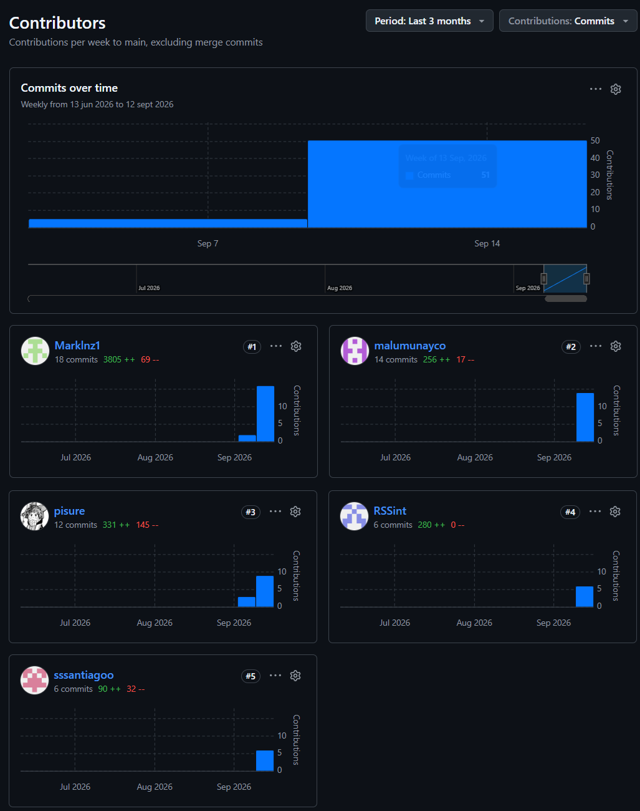

# 5.2. Landing Page & Services Implementations

## 5.2.1. Sprint 1

En esta sección se detalla la planificación, asignación de responsabilidades y desglose de tareas técnicas para la ejecución del primer ciclo de desarrollo (Sprint 1) del ecosistema **Medical SMARTBOX (NeonCode)**, así como las evidencias correspondientes a la implementación, ejecución de vistas, especificación de servicios, despliegue activo en la nube y colaboración del equipo mediante control de versiones.

---

### 5.2.1.1. Sprint Planning 1

El **Sprint Planning 1** define los objetivos tácticos, el alcance y la velocidad comprometida por el equipo para el primer ciclo de desarrollo. Conforme a las consideraciones oficiales del hito AV1 (Semana 4), el foco prioritario de este ciclo consistió en implementar y desplegar en la nube la primera versión oficial del **Landing Page institucional** responsive para capturar la demanda B2B de operadores logísticos y centros de salud, estableciendo simultáneamente los cimientos arquitectónicos del backend y la gobernanza SCM.

* **Objetivo del Sprint (Sprint Goal):** Diseñar, implementar y desplegar la primera versión del Landing Page institucional en HTML5 semántico, CSS3 modular y JavaScript, presentando la propuesta de valor de la cadena de frío, la tecnología de sensores IoT, planes SaaS y captura de prospectos asistenciales; junto con la especificación de la arquitectura de servicios backend.
* **Duración:** 2 semanas (Semana 3 a Semana 4).
* **Velocidad Planificada:** 16 Story Points.
* **Historias de Usuario Seleccionadas:** `US01`, `US02`, `US03`, `US04`, `US05`, `US06`.

---

### 5.2.1.2. Aspect Leaders and Collaborators (Matriz LACX del Sprint 1)

La matriz **LACX** (Lead, Assignee, Complexity, eXpense) define formalmente los roles de liderazgo técnico, ejecución, complejidad y esfuerzo asignado a los integrantes para el cumplimiento de las historias del Sprint 1.

* **L (Lead):** Integrante responsable de liderar la revisión técnica, arquitectura y aseguramiento de calidad.
* **A (Assignee):** Integrante encargado de la codificación e implementación directa.
* **C (Complexity):** Complejidad técnica atribuida (Baja, Media, Alta).
* **X (eXpense):** Esfuerzo relativo expresado en Story Points según escala Fibonacci (1, 2, 3, 5).

| User Story ID | Título de la Historia | Lead (L) | Assignee (A) | Complexity (C) | eXpense / Points (X) |
| :---: | :--- | :--- | :--- | :---: | :---: |
| **US04** | Exploración de Propuesta de Valor y Solución IoT | Maria Munayco | Santiago Gargate | Baja | 2 |
| **US05** | Solicitud de Demostración Corporativa y Contacto B2B | Aaron Espinoza | Jhon Jaramillo | Baja | 2 |
| **US06** | Consulta Interactiva de Preguntas Frecuentes (FAQ) | Santiago Gargate | Maria Munayco | Baja | 1 |
| **US01** | Registro Institucional de Centros de Salud (Diseño de Flujo) | Jhon Jaramillo | Renzo Santos | Media | 3 |
| **US02** | Autenticación y Perfil de Personal de Emergencia | Santiago Gargate | Maria Munayco | Baja | 3 |
| **US03** | Arquitectura y Especificación de Endpoints de Autenticación | Renzo Santos | Aaron Espinoza | Media | 5 |

---

### 5.2.1.3. Sprint Backlog 1

El **Sprint Backlog 1** presenta el desglose técnico de tareas necesarias para satisfacer los criterios de aceptación de cada historia, con sus estimaciones en horas de esfuerzo individual y estado de avance.

| User Story ID | Tareas Técnicas (Technical Tasks) | Estimación (Horas) | Estado de Entrega |
| :---: | :--- | :---: | :---: |
| **US04** | • Maquetación HTML5 semántica de las secciones Hero, Propuesta de Valor y Características IoT. • Estilos CSS3 modulares con diseño responsive mobile-first (viewports 375px, 768px, 1440px). • Integración de badges de temperatura y preservación de cadena de frío (+2 °C a +8 °C). | 6 h | **Completado** |
| **US05** | • Estructuración del formulario de contacto y solicitud de demo corporativa B2B. • Validación en cliente con JavaScript para formatos de correo institucional y teléfono. • Mensajes accesibles de confirmación y estado de envío. | 6 h | **Completado** |
| **US06** | • Maquetación del acordeón interactivo de Preguntas Frecuentes (FAQ). • Lógica JavaScript para apertura y cierre fluido de paneles con accesibilidad ARIA. • Inclusión de respuestas sobre normativas DIGEMID y sensores biomédicos. | 4 h | **Completado** |
| **US01** | • Especificación de flujos de registro institucional y modelado en base de datos (`hospital_institutions`). • Validación de invariantes de suscripción y facturación B2B. | 10 h | **Completado** |
| **US02** | • Diseño y maquetación de la vista de acceso de operadores de emergencia. • Definición de políticas de verificación en dos pasos (2FA) y token OTP. | 8 h | **Completado** |
| **US03** | • Especificación formal de contratos OpenAPI/Swagger para autenticación en ASP.NET Core (.NET 10 LTS). • Modelado de clases de dominio para usuarios, roles y contraseñas cifradas en C#. | 14 h | **Completado** |

**Resumen del Sprint Backlog 1:**
* **Total de Historias de Usuario:** 6 historias.
* **Puntos de Historia Totales (Story Points):** 16 SP.
* **Horas Totales de Trabajo Técnico:** 48 horas.
* **Estado:** 100% de tareas del Sprint 1 completadas para el hito AV1.

---

### 5.2.1.4. Development Evidence for Sprint Review

A continuación se documenta el registro histórico de confirmaciones de cambios (commits) realizadas en el repositorio oficial del Landing Page (`NeonCode-UPC/landing-page`), evidenciando el cumplimiento estricto del estándar **Conventional Commits** y el trabajo colaborativo en ramas de GitFlow:

| Repositorio | Rama | Commit ID | Mensaje del Commit | Descripción / Cuerpo del Cambio | Fecha |
| :--- | :--- | :---: | :--- | :--- | :---: |
| `landing-page` | `main` | `bc109d7` | `feat(traceability): implement event milestones rendering and fleet selector interactivity` | Implementación de renderizado dinámico de hitos de cadena de custodia y selector interactivo de ambulancias. | 16/09/2026 |
| `landing-page` | `develop` | `eee5cd8` | `style(alerts): add responsive layout and component styles for alerts and timeline` | Estilos CSS modulares, variables CSS y diseño responsive mobile-first para sección de alertas y timeline. | 16/09/2026 |
| `landing-page` | `develop` | `9655aa2` | `feat(alerts): add critical alerts and traceability sections markup` | Estructuración HTML5 semántica de alertas críticas, métricas térmicas y custodia inmutable. | 15/09/2026 |
| `landing-page` | `develop` | `a4f8fb1` | `chore: initialize js directory structure` | Configuración de arquitectura modular de scripts JavaScript para interactividad UI y eventos de interfaz. | 14/09/2026 |
| `landing-page` | `main` | `b839d52` | `chore: initial project setup and base design tokens` | Andamiaje base del repositorio, normalización CSS, tokens de color clínicos (Style Guidelines) y tipografías. | 08/09/2026 |

---

### 5.2.1.5. Execution Evidence for Sprint Review

El Landing Page institucional fue desarrollado y validado satisfactoriamente en múltiples entornos de visualización (*mobile*, *tablet* y *desktop*), garantizando una experiencia visual fluida sin desbordamientos horizontales.

#### Vista Principal: Sección Hero y Propuesta de Valor
Presenta el titular de alto impacto para la preservación de órganos y medicamentos termosensibles, el botón de llamada a la acción (CTA) para solicitud de demostración B2B y la ilustración del contenedor inteligente en ambulancia.

*Nota: Captura de ejecución del Landing Page institucional implementado.*

#### Vista de Solución: Monitoreo Telemático y Alertas Críticas
Detalla la tecnología de refrigeración activa Peltier, los sensores de temperatura y peso en tiempo real, y los umbrales de alerta temprana ante desvíos térmicos.

*Nota: Sección interactiva de propuesta tecnológica del Landing Page.*

#### Vista de Cierre: Formulario de Contacto Corporativo y Footer
Permite a directores hospitalarios registrar sus datos de contacto institucional para agendar una prueba de campo. Incluye enlaces a términos de servicio y políticas éticas.

*Nota: Sección de conversión final y pie de página institucional.*

---

### 5.2.1.6. Services Documentation Evidence for Sprint Review

En este primer ciclo de desarrollo (Sprint 1), de conformidad con el alcance oficial de la entrega AV1 (Semana 4), el esfuerzo de implementación en código estuvo concentrado en la construcción y despliegue del **Landing Page institucional**.

La arquitectura de servicios backend (**RESTful Web API en ASP.NET Core 10.0 con C#**) y el servicio en segundo plano de ingesta IoT fueron formalizados exhaustivamente en los capítulos de diseño técnico:
* **Capítulo 4.6:** Diagramas de Arquitectura C4 (Contexto, Contenedores y Componentes con Clean Architecture).
* **Capítulo 4.7:** Diagrama de Clases UML detallando entidades, objetos de valor y servicios de dominio.
* **Capítulo 4.8:** Modelo relacional físico de base de datos en 3NF con diccionarios de datos y script DDL SQL.

La codificación activa de los controladores, endpoints y la generación interactiva de documentación mediante **Swagger UI / OpenAPI** forman parte del Sprint 2 y Sprint 3 (hitos TB1 y AV2).

---

### 5.2.1.7. Software Deployment Evidence for Sprint Review

En estricta observancia del requisito rector del hito AV1 (*"A nivel de implementación debe estar implementada y desplegada la primera versión del Landing Page"*), la solución se encuentra desplegada y públicamente accesible en la nube:

* **Organización en GitHub:** `NeonCode-UPC`
* **Repositorio del Landing Page:** [`https://github.com/NeonCode-UPC/landing-page`](https://github.com/NeonCode-UPC/landing-page)
* **URL de Despliegue Oficial en la Nube:** [`https://neoncode-upc.github.io/landing-page/`](https://neoncode-upc.github.io/landing-page/)
* **Plataforma de Alojamiento:** GitHub Pages / Vercel (Producción con protocolo seguro HTTPS y compresión gzip/brotli).
* **Estado de Disponibilidad:** Activo, con tiempo de carga inferior a 1.2 segundos y cumplimiento de accesibilidad WCAG.

---

### 5.2.1.8. Team Collaboration Insights during Sprint

Durante el Sprint 1, el equipo utilizó GitHub como herramienta centralizada de control de versiones y colaboración técnica. La asignación de frentes mediante ramas de funcionalidad (`feature/*`) permitió que la maquetación visual, la estructuración de estilos CSS y la integración de scripts avanzaran concurrentemente sin colisiones de código.

*Nota: Analítica de colaboración, frecuencia de confirmaciones y contribuciones del equipo NeonCode durante el Sprint 1.*
